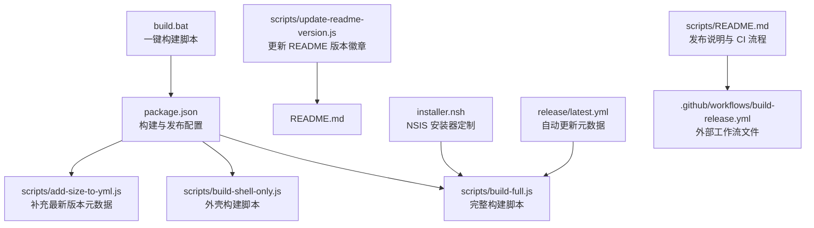
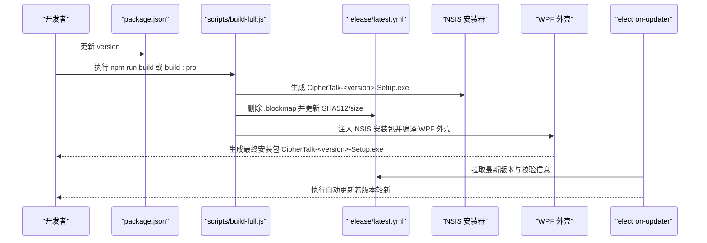
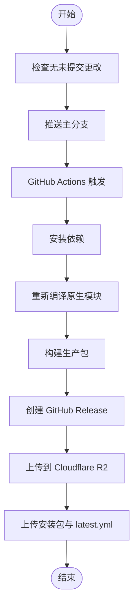
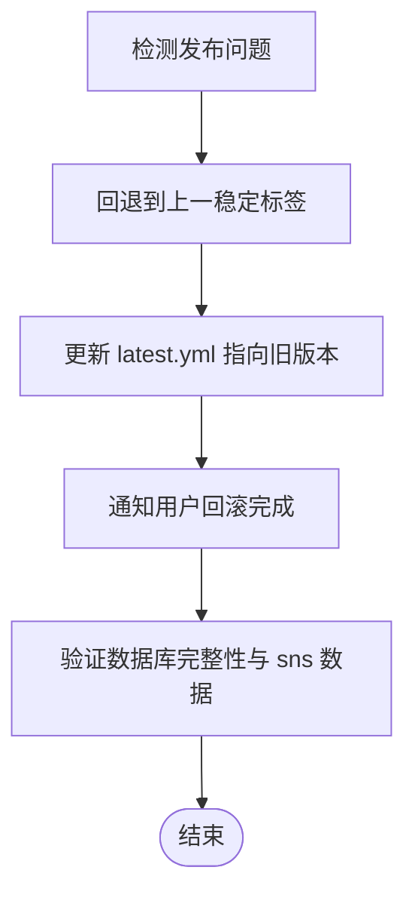
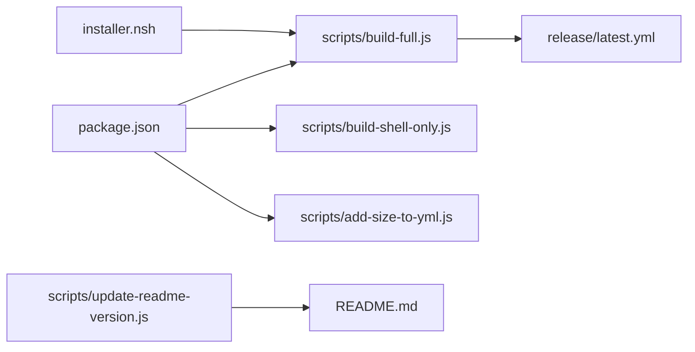

# 发布流程

<cite>
**本文引用的文件**
- [package.json](file://package.json)
- [README.md](file://README.md)
- [scripts/build-full.js](file://scripts/build-full.js)
- [scripts/build-shell-only.js](file://scripts/build-shell-only.js)
- [scripts/update-readme-version.js](file://scripts/update-readme-version.js)
- [scripts/add-size-to-yml.js](file://scripts/add-size-to-yml.js)
- [scripts/README.md](file://scripts/README.md)
- [build.bat](file://build.bat)
- [installer.nsh](file://installer.nsh)
- [release/latest.yml](file://release/latest.yml)
- [electron/services/dataManagementService.ts](file://electron/services/dataManagementService.ts)
- [electron/services/chatService.ts](file://electron/services/chatService.ts)
- [src/services/config.ts](file://src/services/config.ts)
</cite>

## 目录
1. [简介](#简介)
2. [项目结构](#项目结构)
3. [核心组件](#核心组件)
4. [架构总览](#架构总览)
5. [详细组件分析](#详细组件分析)
6. [依赖分析](#依赖分析)
7. [性能考虑](#性能考虑)
8. [故障排查指南](#故障排查指南)
9. [结论](#结论)
10. [附录](#附录)

## 简介
本文件面向 CipherTalk 的发布团队，提供一套完整的发布操作文档，覆盖版本管理策略、自动化构建流程、发布检查清单、发布渠道管理、回滚策略以及发布前准备、发布执行与发布后验证的全流程指导。文档基于仓库中的构建脚本、配置与发布说明进行整理，确保发布过程可追溯、可审计、可回滚。

## 项目结构
围绕发布相关的文件主要分布在以下位置：
- 构建与打包：scripts 目录下的构建脚本、package.json 中的构建配置、build.bat 一键构建脚本
- 安装器定制：NSIS 脚本 installer.nsh
- 自动发布与 CI：scripts/README.md 中的发布说明与 GitHub Actions 流程说明
- 自动更新与校验：release/latest.yml、electron 与前端配置中的自动更新逻辑
- 版本号同步：scripts/update-readme-version.js

**图表来源**
- [package.json:74-167](file://package.json#L74-L167)
- [scripts/build-full.js:1-157](file://scripts/build-full.js#L1-L157)
- [scripts/build-shell-only.js:1-85](file://scripts/build-shell-only.js#L1-L85)
- [scripts/add-size-to-yml.js:1-62](file://scripts/add-size-to-yml.js#L1-L62)
- [scripts/update-readme-version.js:1-31](file://scripts/update-readme-version.js#L1-L31)
- [build.bat:1-79](file://build.bat#L1-L79)
- [installer.nsh:1-65](file://installer.nsh#L1-L65)
- [release/latest.yml:1-9](file://release/latest.yml#L1-L9)
- [scripts/README.md:192-210](file://scripts/README.md#L192-L210)

**章节来源**
- [package.json:1-169](file://package.json#L1-L169)
- [scripts/README.md:192-210](file://scripts/README.md#L192-L210)

## 核心组件
- 版本号与元数据
  - package.json 中的 version 字段作为统一版本号来源；README.md 中的版本徽章通过 update-readme-version.js 同步
- 构建与打包
  - npm scripts：build、build:pro、electron:build 等；build.bat 提供一键构建
  - electron-builder 与 NSIS 打包；ASAR 解包与额外资源注入
- 自动更新与校验
  - release/latest.yml 提供自动更新所需的版本、SHA512、size、下载路径等
  - build-full.js 在替换安装包后，删除 blockmap 并更新 latest.yml 的校验信息
- 安装器定制
  - NSIS 脚本 installer.nsh：DPI 感知、安装目录修正、VC++ 运行库检测与安装
- 自动发布与 CI
  - scripts/README.md 描述了“tuisong”发布脚本的工作流程，以及 GitHub Actions 的触发与产物上传

**章节来源**
- [package.json:3](file://package.json#L3)
- [scripts/update-readme-version.js:1-31](file://scripts/update-readme-version.js#L1-L31)
- [scripts/build-full.js:111-152](file://scripts/build-full.js#L111-L152)
- [release/latest.yml:1-9](file://release/latest.yml#L1-L9)
- [installer.nsh:1-65](file://installer.nsh#L1-L65)
- [scripts/README.md:192-210](file://scripts/README.md#L192-L210)

## 架构总览
下图展示了从版本号更新到安装包生成、自动更新元数据维护与安装器定制的整体流程。

**图表来源**
- [package.json:3](file://package.json#L3)
- [scripts/build-full.js:20-152](file://scripts/build-full.js#L20-L152)
- [release/latest.yml:1-9](file://release/latest.yml#L1-L9)

## 详细组件分析

### 版本管理策略与变更日志维护
- 语义化版本控制
  - patch（x.y.Z）：修复 bug，如 2.2.13 → 2.2.14
  - minor（x.Y.z）：新增功能，如 2.2.13 → 2.3.0
  - major（X.y.z）：重大更新，如 2.2.13 → 3.0.0
- 版本号更新机制
  - 手动更新 package.json 中的 version 字段
  - 运行 npm run prebuild（调用 update-readme-version.js）同步 README.md 中的版本徽章
- 变更日志维护
  - 建议在每次发布前更新 CHANGELOG 或在 GitHub Releases 中记录本次变更摘要（仓库未包含独立变更日志文件）

**章节来源**
- [scripts/README.md:61-64](file://scripts/README.md#L61-L64)
- [scripts/update-readme-version.js:16-30](file://scripts/update-readme-version.js#L16-L30)

### 自动化构建流程
- CI/CD 集成
  - 推送至 main 分支触发 GitHub Actions 工作流（scripts/README.md 描述）
  - 工作流步骤：安装依赖、重新编译原生模块、构建生产包、创建 GitHub Release、上传 Cloudflare R2、上传构建产物
- 构建触发条件
  - 推送 main 分支；执行 npm run tuisong 触发自动发布脚本
- 构建产物验证
  - 生成 release 目录下的安装包与 latest.yml
  - build-full.js 在替换安装包后删除 .blockmap 并更新 SHA512/size，确保自动更新校验通过

**图表来源**
- [scripts/README.md:192-210](file://scripts/README.md#L192-L210)

**章节来源**
- [scripts/README.md:192-210](file://scripts/README.md#L192-L210)
- [scripts/build-full.js:111-152](file://scripts/build-full.js#L111-L152)

### 发布检查清单
- 代码质量检查
  - TypeScript 类型检查通过
  - 代码格式化与静态检查（仓库未提供独立脚本，建议在本地执行 npx tsc --noEmit 与格式化命令）
- 安全扫描
  - 依赖审计：建议执行 npm audit 或使用第三方工具扫描高危漏洞
- 兼容性测试
  - Windows 10/11 系统安装测试（VC++ 运行库由 NSIS 脚本检测并提示安装）
  - 安装器外壳（WPF）与原版安装包对比测试
- 自动更新可用性
  - latest.yml 中的版本、SHA512、size、下载路径正确
  - 通过 build-full.js 更新后的校验信息与最终安装包一致

**章节来源**
- [installer.nsh:20-64](file://installer.nsh#L20-L64)
- [scripts/add-size-to-yml.js:1-62](file://scripts/add-size-to-yml.js#L1-L62)
- [scripts/build-full.js:111-152](file://scripts/build-full.js#L111-L152)

### 发布渠道管理
- GitHub Releases
  - 自动创建并上传安装包与 latest.yml
  - 通过 scripts/README.md 中的链接查看构建状态与发布页面
- 应用商店发布
  - 仓库未提供应用商店发布配置；如需上架，应在 CI 中新增相应步骤并配置商店凭据
- 手动分发
  - 通过 release 目录中的安装包进行手动分发

**章节来源**
- [scripts/README.md:204-208](file://scripts/README.md#L204-L208)

### 回滚策略
- 版本回退
  - 在 GitHub Releases 中回退到上一个稳定版本标签
  - 若使用 Cloudflare R2，注意其自动删除旧版本的策略（scripts/README.md 描述）
- 配置恢复
  - 自动更新开关与检查间隔可通过前端配置服务读取与设置，便于在回滚后恢复默认行为
- 数据迁移
  - 增量更新过程中具备数据库完整性检查与 sns.db 合并逻辑，降低回滚风险
  - 若回滚涉及数据库结构变化，建议保留备份并在回滚后进行数据一致性校验

**图表来源**
- [electron/services/dataManagementService.ts:514-664](file://electron/services/dataManagementService.ts#L514-L664)
- [src/services/config.ts:38-76](file://src/services/config.ts#L38-L76)

**章节来源**
- [electron/services/dataManagementService.ts:514-664](file://electron/services/dataManagementService.ts#L514-L664)
- [src/services/config.ts:38-76](file://src/services/config.ts#L38-L76)

## 依赖分析
- 构建链路依赖
  - package.json 的 scripts 与 build 配置驱动构建流程
  - scripts/build-full.js 依赖 electron-builder 生成的 NSIS 安装包，并对 latest.yml 进行校验信息更新
- 安装器依赖
  - NSIS 脚本 installer.nsh 依赖 Visual C++ 运行库安装能力
- 自动更新依赖
  - electron-updater 依赖 release/latest.yml 中的版本与校验信息

**图表来源**
- [package.json:8-18](file://package.json#L8-L18)
- [scripts/build-full.js:1-157](file://scripts/build-full.js#L1-L157)
- [scripts/build-shell-only.js:1-85](file://scripts/build-shell-only.js#L1-L85)
- [scripts/add-size-to-yml.js:1-62](file://scripts/add-size-to-yml.js#L1-L62)
- [scripts/update-readme-version.js:1-31](file://scripts/update-readme-version.js#L1-L31)
- [release/latest.yml:1-9](file://release/latest.yml#L1-L9)
- [installer.nsh:1-65](file://installer.nsh#L1-L65)

**章节来源**
- [package.json:74-167](file://package.json#L74-L167)

## 性能考虑
- 构建体积与速度
  - electron-builder 的 asarUnpack 与 extraResources 配置影响打包体积与冷启动性能
  - 通过过滤规则减少无关文件进入安装包，缩短安装与更新时间
- 自动更新效率
  - latest.yml 中的 size 字段有助于客户端预估下载时间
  - build-full.js 删除 .blockmap 并更新 SHA512/size，避免差分更新失败导致的回滚与重试

**章节来源**
- [package.json:159-166](file://package.json#L159-L166)
- [scripts/add-size-to-yml.js:31-61](file://scripts/add-size-to-yml.js#L31-L61)
- [scripts/build-full.js:116-152](file://scripts/build-full.js#L116-L152)

## 故障排查指南
- 未找到版本号徽章
  - update-readme-version.js 会在 README.md 中找不到版本徽章时报错，需检查徽章格式
- 安装包未找到
  - build-full.js 与 build-shell-only.js 会根据当前版本号精确匹配安装包，若不存在则报错
- WPF 编译失败
  - build-full.js 与 build-shell-only.js 在 dotnet publish 失败时会提示缺少 .NET SDK
- 文件被占用
  - build-full.js 与 build-shell-only.js 在目标文件被占用时会提示关闭占用程序后重试
- 自动更新校验失败
  - build-full.js 会删除 .blockmap 并更新 latest.yml 的 SHA512/size，确保与最终安装包一致

**章节来源**
- [scripts/update-readme-version.js:16-30](file://scripts/update-readme-version.js#L16-L30)
- [scripts/build-full.js:25-41](file://scripts/build-full.js#L25-L41)
- [scripts/build-full.js:66-70](file://scripts/build-full.js#L66-L70)
- [scripts/build-full.js:94-100](file://scripts/build-full.js#L94-L100)
- [scripts/build-full.js:116-152](file://scripts/build-full.js#L116-L152)
- [scripts/build-shell-only.js:24-32](file://scripts/build-shell-only.js#L24-L32)
- [scripts/build-shell-only.js:48-52](file://scripts/build-shell-only.js#L48-L52)
- [scripts/build-shell-only.js:63-74](file://scripts/build-shell-only.js#L63-L74)

## 结论
本发布文档基于仓库现有脚本与配置，提供了从版本号管理、自动化构建、发布渠道到回滚策略的完整流程说明。建议在现有基础上补充独立变更日志与应用商店发布配置，并在 CI 中增加依赖审计与兼容性测试，以进一步提升发布质量与可追溯性。

## 附录

### 发布前准备
- 确认 package.json 中 version 已按语义化版本更新
- 运行 npm run prebuild 同步 README.md 版本徽章
- 本地执行构建验证（npm run build 或 build.bat）
- 准备 GitHub Releases 说明与变更摘要

**章节来源**
- [scripts/update-readme-version.js:16-30](file://scripts/update-readme-version.js#L16-L30)
- [build.bat:40-79](file://build.bat#L40-L79)

### 发布执行
- 推送主分支触发 GitHub Actions（scripts/README.md 描述）
- 或执行 npm run tuisong 触发自动发布脚本
- 等待构建完成，检查 GitHub Actions 日志与 GitHub Releases 页面

**章节来源**
- [scripts/README.md:192-210](file://scripts/README.md#L192-L210)

### 发布后验证
- 校验 release 目录中的安装包与 latest.yml
- 在目标系统安装测试，确认 VC++ 运行库安装流程与应用启动正常
- 验证自动更新功能（electron-updater）能否正确识别新版本并下载安装

**章节来源**
- [release/latest.yml:1-9](file://release/latest.yml#L1-L9)
- [installer.nsh:20-64](file://installer.nsh#L20-L64)
- [electron/services/chatService.ts:4728-4774](file://electron/services/chatService.ts#L4728-L4774)