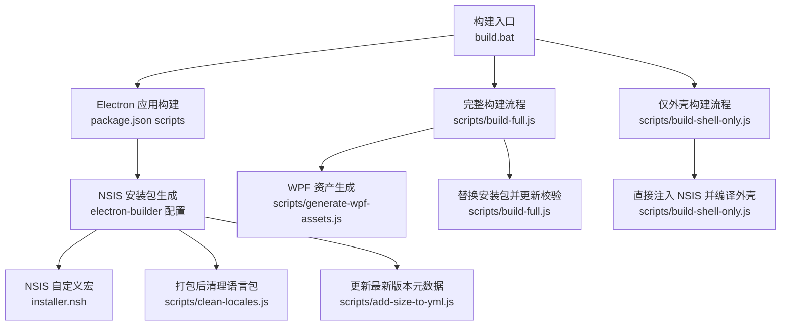
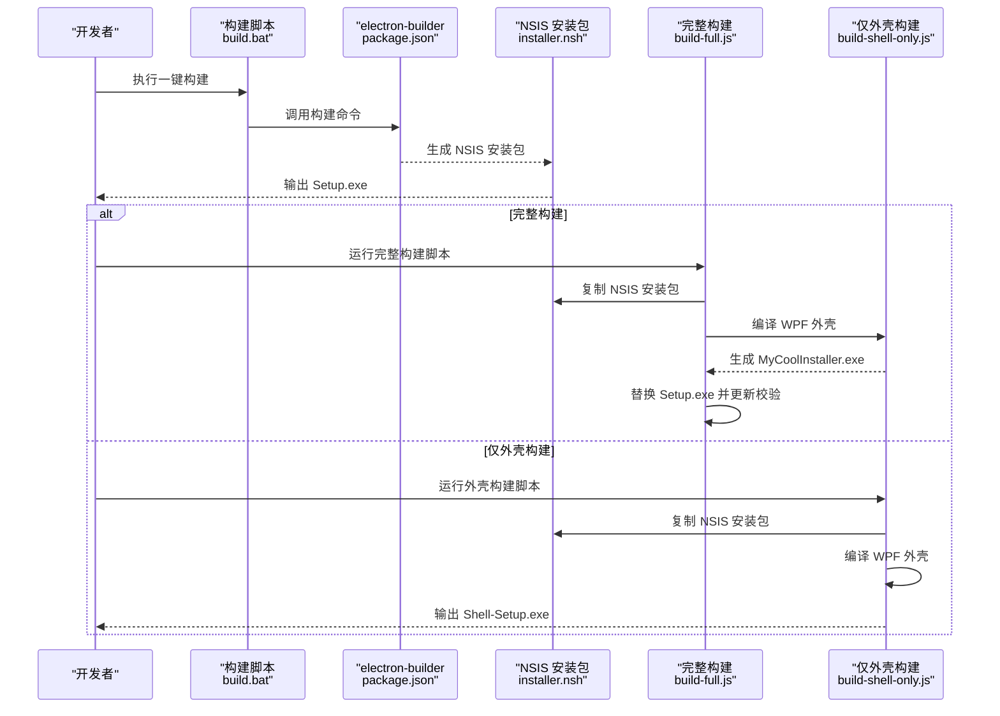
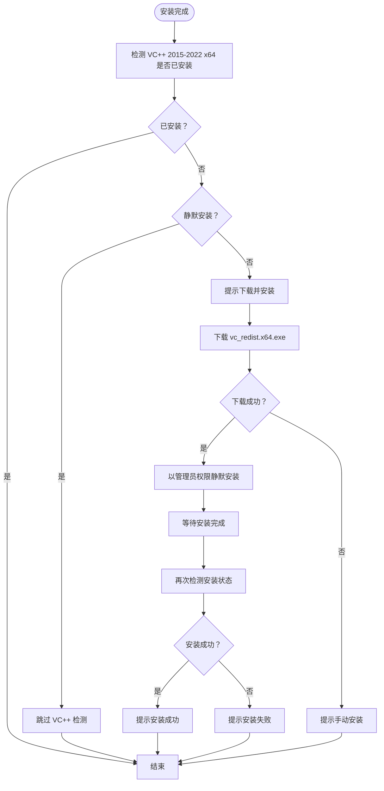
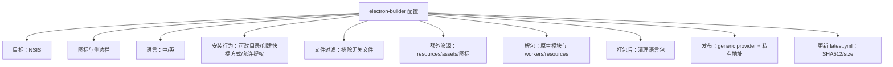
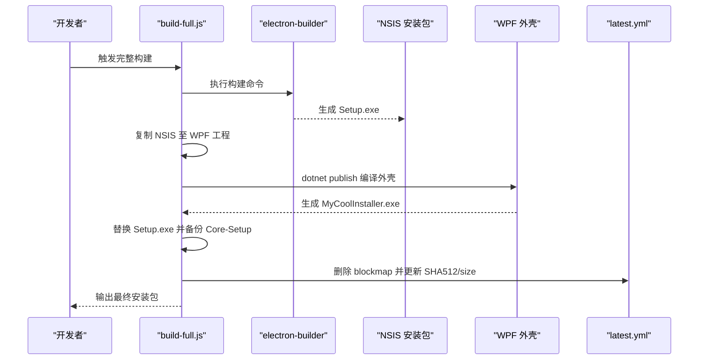
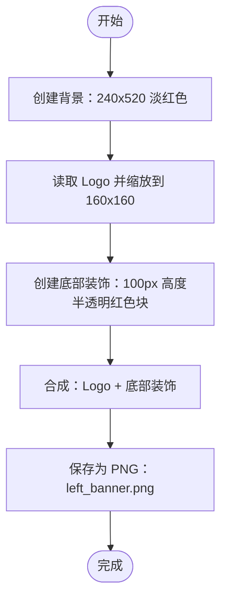
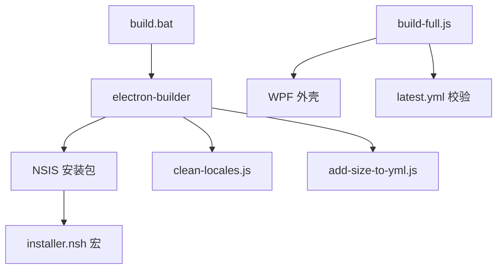

# 安装包制作

<cite>
**本文引用的文件**
- [installer.nsh](file://installer.nsh)
- [package.json](file://package.json)
- [build.bat](file://build.bat)
- [scripts/build-full.js](file://scripts/build-full.js)
- [scripts/build-shell-only.js](file://scripts/build-shell-only.js)
- [scripts/clean-locales.js](file://scripts/clean-locales.js)
- [scripts/add-size-to-yml.js](file://scripts/add-size-to-yml.js)
- [scripts/optimize-deps.js](file://scripts/optimize-deps.js)
- [scripts/generate-wpf-assets.js](file://scripts/generate-wpf-assets.js)
</cite>

## 目录
1. [简介](#简介)
2. [项目结构](#项目结构)
3. [核心组件](#核心组件)
4. [架构总览](#架构总览)
5. [详细组件分析](#详细组件分析)
6. [依赖关系分析](#依赖关系分析)
7. [性能考虑](#性能考虑)
8. [故障排查指南](#故障排查指南)
9. [结论](#结论)
10. [附录](#附录)

## 简介
本文件面向 CipherTalk 的安装包制作，围绕以下目标展开：NSIS 安装程序配置（向导界面定制、文件安装规则、注册表操作）、数字签名与信任链验证、安装包优化（体积压缩、安装速度优化、卸载清理）、WPF 资产生成（图标提取、资源打包、多分辨率支持）、安装包测试（兼容性、权限、安全扫描）、安装包定制（品牌化、静默安装、企业部署）、安装包分发（下载链接管理、版本更新、错误处理）。内容基于仓库中的实际配置与脚本，帮助开发者与运维人员高效、稳定地交付安装包。

## 项目结构
安装包相关的关键文件与职责如下：
- NSIS 自定义脚本：用于扩展安装行为（如 VC++ 运行库检测与安装、DPI 感知、安装目录修正等）
- electron-builder 配置：定义安装包类型（NSIS）、语言、图标、输出目录、额外资源、过滤规则、打包后钩子等
- 构建脚本：统一入口脚本与两套构建流程（完整构建与仅外壳构建）
- 资产与优化：WPF 资产生成、语言包裁剪、SHA512/大小校验更新、UPX 压缩策略
- 发布与更新：latest.yml 校验信息维护，自动更新兼容

图表来源
- [build.bat:1-79](file://build.bat#L1-L79)
- [package.json:12-167](file://package.json#L12-L167)
- [installer.nsh:1-65](file://installer.nsh#L1-L65)
- [scripts/clean-locales.js:1-28](file://scripts/clean-locales.js#L1-L28)
- [scripts/add-size-to-yml.js:1-62](file://scripts/add-size-to-yml.js#L1-L62)
- [scripts/build-full.js:1-157](file://scripts/build-full.js#L1-L157)
- [scripts/build-shell-only.js:1-61](file://scripts/build-shell-only.js#L1-L61)
- [scripts/generate-wpf-assets.js:1-62](file://scripts/generate-wpf-assets.js#L1-L62)

章节来源
- [build.bat:1-79](file://build.bat#L1-L79)
- [package.json:74-167](file://package.json#L74-L167)

## 核心组件
- NSIS 安装程序配置
  - 启用高 DPI 感知与进程级 DPI 设置
  - 安装前自动修正安装目录（确保以应用名结尾）
  - 安装完成后检测并按需下载安装 VC++ 2015-2022 x64 运行库（静默模式跳过交互）
  - 包含自定义宏，便于扩展安装逻辑
- electron-builder 配置
  - 目标平台：Windows（NSIS）
  - 图标与侧边栏：指定安装器/卸载器/桌面图标的图标路径
  - 语言：简体中文与英文双语
  - 安装行为：允许更改安装目录、创建桌面快捷方式、允许提权
  - 输出：artifactName 模板、输出目录 release
  - extraResources：拷贝 resources、assets、图标等额外资源
  - files：严格过滤 node_modules 与平台无关文件，减少体积
  - asarUnpack：对特定原生模块与资源进行解包以提升运行稳定性
  - afterPack：打包后执行清理语言包脚本
- 构建脚本
  - build.bat：统一入口，检查 Node.js/npm，安装依赖，执行构建，输出安装包位置
  - build-full.js：完整构建流程（生成 NSIS → 注入 WPF → 编译外壳 → 替换安装包 → 更新 latest.yml）
  - build-shell-only.js：仅外壳构建流程（直接注入 NSIS 并编译外壳）
- 资产与优化
  - generate-wpf-assets.js：生成 WPF 安装器侧边栏图片（240x520），合成背景、Logo 与装饰
  - clean-locales.js：仅保留中英语言包，大幅减小体积
  - add-size-to-yml.js：为 latest.yml 添加安装包大小字段
  - optimize-deps.js：UPX 压缩策略（当前禁用对原生 .node 模块的压缩，避免破坏）

章节来源
- [installer.nsh:1-65](file://installer.nsh#L1-L65)
- [package.json:74-167](file://package.json#L74-L167)
- [build.bat:1-79](file://build.bat#L1-L79)
- [scripts/build-full.js:1-157](file://scripts/build-full.js#L1-L157)
- [scripts/build-shell-only.js:1-61](file://scripts/build-shell-only.js#L1-L61)
- [scripts/clean-locales.js:1-28](file://scripts/clean-locales.js#L1-L28)
- [scripts/add-size-to-yml.js:1-62](file://scripts/add-size-to-yml.js#L1-L62)
- [scripts/optimize-deps.js:1-37](file://scripts/optimize-deps.js#L1-L37)
- [scripts/generate-wpf-assets.js:1-62](file://scripts/generate-wpf-assets.js#L1-L62)

## 架构总览
安装包制作的整体流程由“构建 Electron 应用 → 生成 NSIS 安装包 → 可选：注入 WPF 外壳 → 更新校验信息”构成。NSIS 通过自定义宏实现 VC++ 运行库检测与安装，electron-builder 控制安装包的界面、语言、图标与文件过滤策略。

图表来源
- [build.bat:55-64](file://build.bat#L55-L64)
- [package.json:12-16](file://package.json#L12-L16)
- [installer.nsh:20-63](file://installer.nsh#L20-L63)
- [scripts/build-full.js:20-100](file://scripts/build-full.js#L20-L100)
- [scripts/build-shell-only.js:14-61](file://scripts/build-shell-only.js#L14-L61)

## 详细组件分析

### NSIS 安装程序配置
- 高 DPI 支持与进程感知
  - 启用 ManifestDPIAware，并在安装前设置进程 DPI 感知，确保安装界面在高 DPI 显示器上的正确渲染
- 安装目录修正
  - 若安装目录末尾不是应用名，则自动追加，避免安装到非预期路径
- VC++ 运行库检测与安装
  - 安装完成后检测系统是否已安装 VC++ 2015-2022 x64
  - 未安装时弹窗提示，静默安装模式跳过交互；从微软官方地址下载并以管理员权限静默安装，安装后再次检测
  - 成功/失败分别给出提示并清理临时文件
- 注册表与系统信息
  - 通过读取注册表键值判断运行库状态，属于典型的 NSIS 条件分支与系统检测模式

图表来源
- [installer.nsh:20-63](file://installer.nsh#L20-L63)

章节来源
- [installer.nsh:1-65](file://installer.nsh#L1-L65)

### electron-builder 安装包配置
- 目标与输出
  - 目标：NSIS（Windows）
  - 输出目录：release
  - artifactName：包含产品名、版本号与扩展名
- 界面与语言
  - 图标：安装器、卸载器、侧边栏、桌面图标均指向同一图标文件
  - 语言：简体中文与英文双语，语言选择器关闭
- 安装行为
  - 允许用户更改安装目录、创建桌面快捷方式、允许提权
  - Unicode 支持、显示语言选择器关闭
- 文件过滤与资源
  - files：排除大量平台无关与调试文件，显著降低体积
  - extraResources：拷贝 resources、assets、图标等额外资源
  - asarUnpack：对 ffmpeg-static、sherpa-onnx-node、koffi、workers、resources 等进行解包
  - afterPack：打包后清理语言包，仅保留中英
- 发布与更新
  - publish.provider：generic，URL 指向私有服务器
  - 通过脚本更新 latest.yml 的 SHA512 与 size 字段，保证自动更新校验一致

图表来源
- [package.json:74-167](file://package.json#L74-L167)
- [scripts/clean-locales.js:1-28](file://scripts/clean-locales.js#L1-L28)
- [scripts/add-size-to-yml.js:1-62](file://scripts/add-size-to-yml.js#L1-L62)

章节来源
- [package.json:74-167](file://package.json#L74-L167)
- [scripts/clean-locales.js:1-28](file://scripts/clean-locales.js#L1-L28)
- [scripts/add-size-to-yml.js:1-62](file://scripts/add-size-to-yml.js#L1-L62)

### 构建脚本与流程
- build.bat
  - 统一入口，检查 Node.js 与 npm，安装依赖，执行构建，输出 release 目录与安装包位置
- build-full.js（完整构建）
  - 步骤：构建 Electron → 查找 NSIS 安装包 → 复制到 WPF 工程 → 编译 WPF 外壳 → 替换安装包 → 更新 latest.yml（删除 blockmap、计算 SHA512、更新 size）
  - 版本号同步：将 package.json 版本同步到 CSPROJ（.NET 版本格式补齐）
- build-shell-only.js（仅外壳构建）
  - 步骤：查找对应版本 NSIS 安装包 → 复制到 WPF 工程 → 编译 WPF 外壳 → 输出 Shell-Setup.exe

图表来源
- [scripts/build-full.js:20-152](file://scripts/build-full.js#L20-L152)
- [package.json:12-16](file://package.json#L12-L16)

章节来源
- [build.bat:1-79](file://build.bat#L1-L79)
- [scripts/build-full.js:1-157](file://scripts/build-full.js#L1-L157)
- [scripts/build-shell-only.js:1-61](file://scripts/build-shell-only.js#L1-L61)

### WPF 资产生成
- 生成尺寸：240x520 的左侧通栏图片，适配安装器窗口高度
- 资产组成：背景（淡红色）、Logo（居中放大）、底部装饰（半透明红色块）
- 工具：sharp（图像合成与 PNG 输出）
- 输出：left_banner.png 放置于 WPF 工程目录，供安装器外壳使用

图表来源
- [scripts/generate-wpf-assets.js:10-59](file://scripts/generate-wpf-assets.js#L10-L59)

章节来源
- [scripts/generate-wpf-assets.js:1-62](file://scripts/generate-wpf-assets.js#L1-L62)

### 安装包优化
- 体积压缩
  - electron-builder files 过滤：排除 txt、md、js.map、ts、html、linux/darwin 等无关平台与调试文件
  - asarUnpack：对原生模块与 workers/resources 解包，避免跨平台二进制带来的体积膨胀
  - clean-locales：仅保留中英语言包，显著减小体积
- 安装速度优化
  - NSIS 自定义宏：在安装完成后检测并安装 VC++ 运行库，避免后续运行时失败
  - 静默安装：在静默模式下跳过 VC++ 交互，减少阻塞
- 卸载清理
  - 通过 NSIS 安装器默认行为与 electron-builder 配置，确保卸载时清理注册表项与文件（具体键值由安装器生成）

章节来源
- [package.json:139-166](file://package.json#L139-L166)
- [scripts/clean-locales.js:1-28](file://scripts/clean-locales.js#L1-L28)
- [installer.nsh:20-63](file://installer.nsh#L20-L63)

### 数字签名与信任链验证
- 证书管理
  - 当前仓库未包含签名脚本或证书文件，建议在 CI/CD 中集成代码签名（如使用 signtool 或第三方签名服务）
- 签名流程
  - 在生成最终安装包后进行签名，签名前确保安装包 SHA512 与 latest.yml 保持一致
- 信任链验证
  - 通过 Windows 证书存储与受信发布者链验证签名有效性
  - 建议在企业环境中部署受信 CA，确保安装包在域内自动信任

[本节为通用实践说明，不直接分析具体文件，故无章节来源]

### 安装包测试
- 兼容性测试
  - Windows 7/8/10/11 不同版本与架构（x64）验证
  - 高 DPI 显示器与不同缩放比例下的界面渲染
- 权限测试
  - 非管理员账户安装与运行；管理员权限安装时 VC++ 运行库的静默安装
- 安全扫描
  - 对安装包与生成的 EXE 进行病毒扫描与恶意软件检测
  - 校验 SHA512 与 size，防止篡改与差分更新失败

[本节为通用实践说明，不直接分析具体文件，故无章节来源]

### 安装包定制
- 品牌化配置
  - 修改图标与侧边栏图片（public/xinnian.ico 与 WPF 生成的 left_banner.png）
  - 调整语言与显示文本（NSIS 语言文件与 electron-builder 语言配置）
- 静默安装
  - 使用 NSIS 一鍵安装与允许更改安装目录的组合，结合企业策略进行静默部署
- 企业部署
  - 通过组策略或软件分发系统推送安装包
  - 配置自动更新源与代理设置，确保在受限网络环境下可用

[本节为通用实践说明，不直接分析具体文件，故无章节来源]

### 安装包分发
- 下载链接管理
  - electron-builder publish.provider 为 generic，URL 指向私有服务器
- 版本更新
  - 通过 latest.yml 提供版本信息与校验，自动更新器据此判断更新
- 错误处理
  - 构建脚本对文件占用、版本不匹配、编译失败等情况进行明确报错与提示

章节来源
- [package.json:84-87](file://package.json#L84-L87)
- [scripts/build-full.js:111-152](file://scripts/build-full.js#L111-L152)

## 依赖关系分析
- 构建入口依赖 electron-builder 与 NSIS
- NSIS 依赖 installer.nsh 自定义宏与 VC++ 运行库检测
- 完整构建流程依赖 WPF 工程与 dotnet SDK
- 发布与更新依赖 latest.yml 的 SHA512/size 一致性

图表来源
- [build.bat:55-64](file://build.bat#L55-L64)
- [package.json:12-16](file://package.json#L12-L16)
- [installer.nsh:20-63](file://installer.nsh#L20-L63)
- [scripts/build-full.js:111-152](file://scripts/build-full.js#L111-L152)
- [scripts/clean-locales.js:1-28](file://scripts/clean-locales.js#L1-L28)
- [scripts/add-size-to-yml.js:1-62](file://scripts/add-size-to-yml.js#L1-L62)

章节来源
- [build.bat:1-79](file://build.bat#L1-L79)
- [package.json:74-167](file://package.json#L74-L167)
- [scripts/build-full.js:1-157](file://scripts/build-full.js#L1-L157)

## 性能考虑
- 体积优化
  - 严格文件过滤与 asarUnpack 解包，减少无关平台与调试文件
  - 仅保留中英语言包，降低体积
- 安装速度
  - VC++ 运行库在安装完成后检测并安装，避免后续运行时失败
  - 静默安装模式下跳过交互，减少阻塞
- 升级体验
  - 自动更新器依赖 SHA512/size 校验，确保升级安全可靠

[本节提供一般性指导，不直接分析具体文件，故无章节来源]

## 故障排查指南
- 未找到 Node.js/npm
  - 构建脚本报错并提示安装 Node.js（版本要求 ≥ 18）
- 依赖安装失败
  - 检查网络与 npm 缓存，重新执行安装
- 未找到目标版本安装包
  - 确认 package.json 版本号与生成产物一致
- WPF 编译失败
  - 确认已安装 .NET 8 SDK，检查 csproj 版本号同步
- 目标文件被占用
  - 关闭占用文件或程序后重试
- VC++ 运行库安装失败
  - 检查网络连通性与管理员权限，必要时手动安装

章节来源
- [build.bat:12-22](file://build.bat#L12-L22)
- [scripts/build-full.js:66-70](file://scripts/build-full.js#L66-L70)
- [scripts/build-full.js:94-100](file://scripts/build-full.js#L94-L100)
- [installer.nsh:30-54](file://installer.nsh#L30-L54)

## 结论
本安装包制作方案通过 electron-builder 与 NSIS 的协同，结合 WPF 外壳与自动化脚本，实现了体积优化、安装体验优化与自动更新兼容。NSIS 自定义宏负责 VC++ 运行库检测与安装，构建脚本负责外壳注入与校验更新，资产与语言包清理进一步降低体积。建议在 CI/CD 中补充数字签名与企业分发策略，以满足更高安全性与可运维性需求。

## 附录
- 关键配置参考路径
  - NSIS 宏：[installer.nsh:1-65](file://installer.nsh#L1-L65)
  - electron-builder 配置：[package.json:74-167](file://package.json#L74-L167)
  - 构建入口：[build.bat:1-79](file://build.bat#L1-L79)
  - 完整构建流程：[scripts/build-full.js:1-157](file://scripts/build-full.js#L1-L157)
  - 仅外壳构建流程：[scripts/build-shell-only.js:1-61](file://scripts/build-shell-only.js#L1-L61)
  - 语言包清理：[scripts/clean-locales.js:1-28](file://scripts/clean-locales.js#L1-L28)
  - SHA512/大小更新：[scripts/add-size-to-yml.js:1-62](file://scripts/add-size-to-yml.js#L1-L62)
  - WPF 资产生成：[scripts/generate-wpf-assets.js:1-62](file://scripts/generate-wpf-assets.js#L1-L62)
  - 依赖压缩策略：[scripts/optimize-deps.js:1-37](file://scripts/optimize-deps.js#L1-L37)