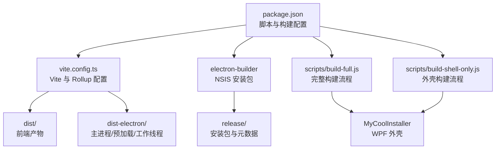
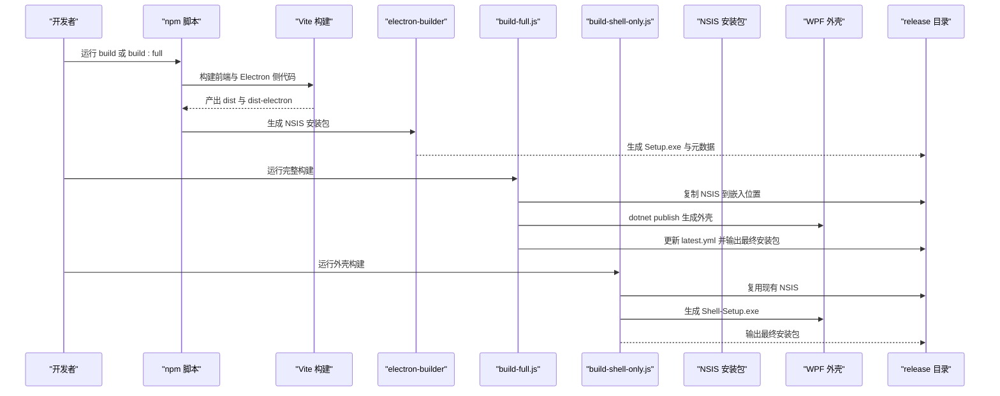
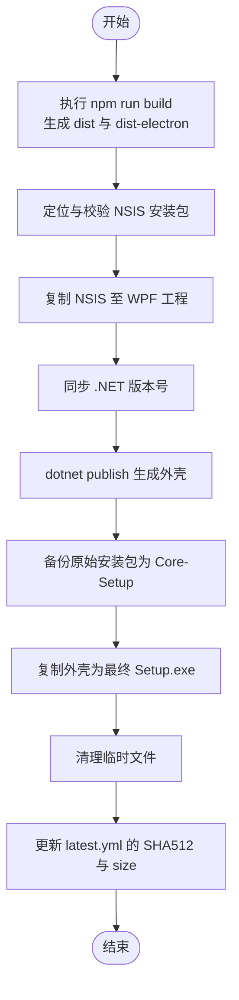
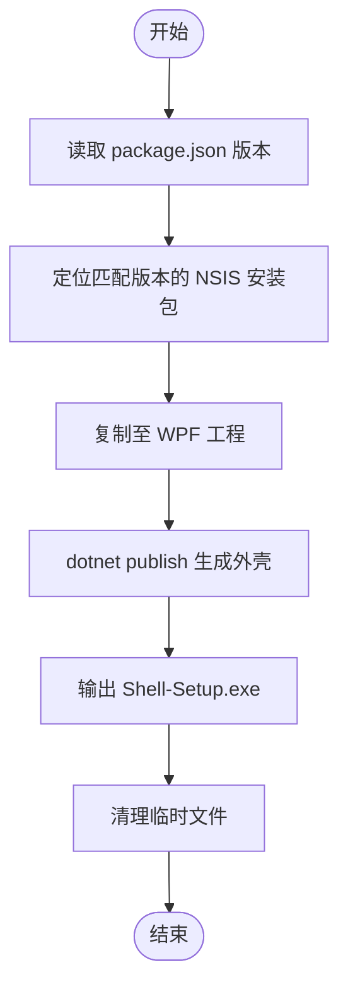
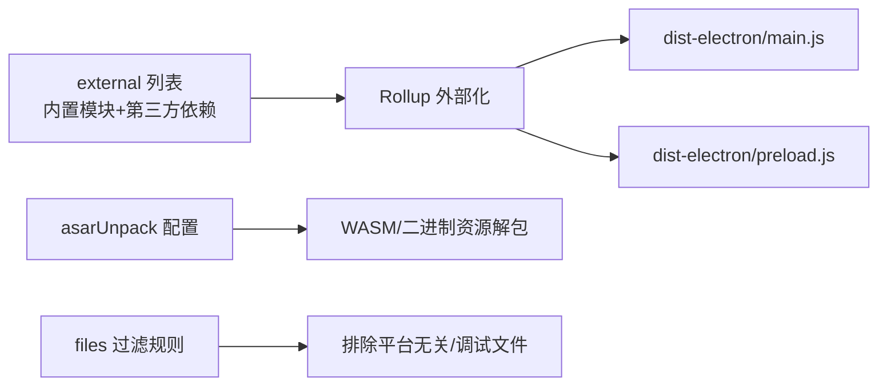
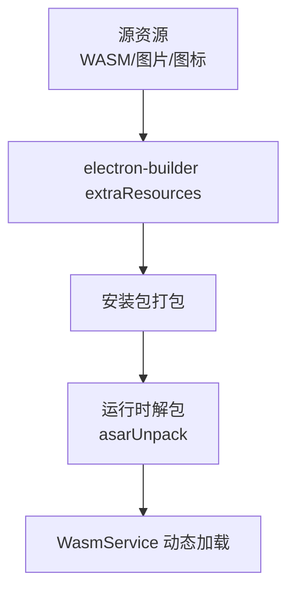
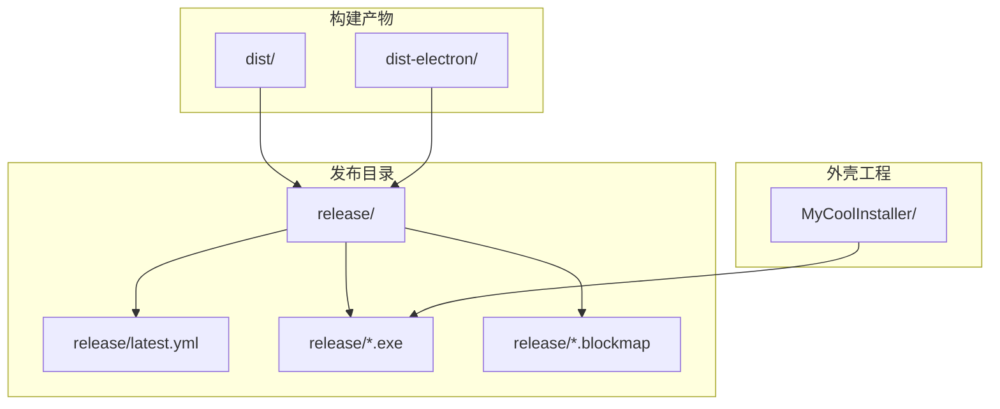
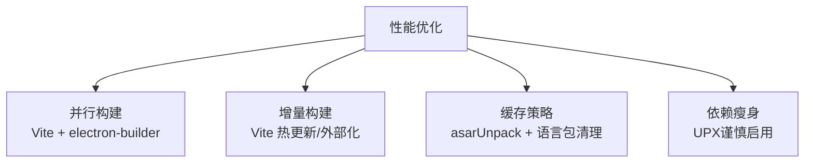
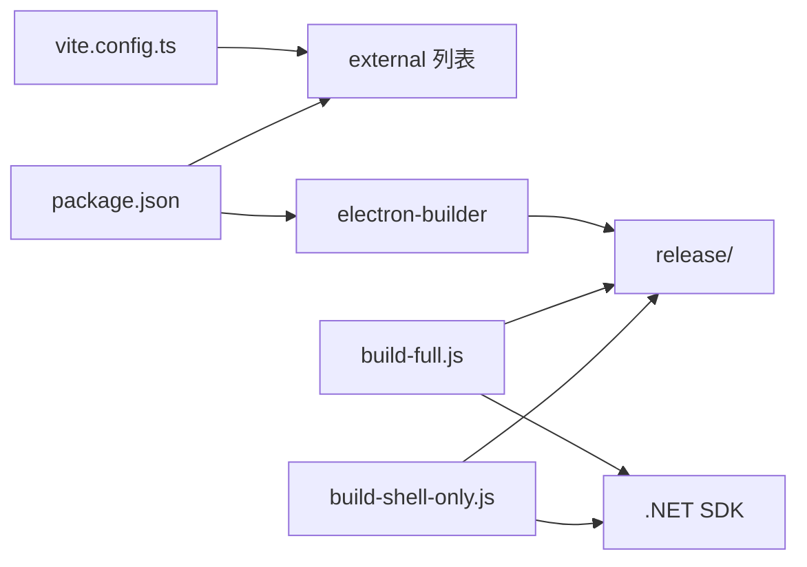

# 打包策略

<cite>
**本文档引用的文件**
- [scripts/build-full.js](file://scripts/build-full.js)
- [scripts/build-shell-only.js](file://scripts/build-shell-only.js)
- [package.json](file://package.json)
- [vite.config.ts](file://vite.config.ts)
- [electron/main.ts](file://electron/main.ts)
- [electron/preload.ts](file://electron/preload.ts)
- [electron/workers/decryptWorker.js](file://electron/workers/decryptWorker.js)
- [electron/transcribeWorker.ts](file://electron/transcribeWorker.ts)
- [electron/services/wasmService.ts](file://electron/services/wasmService.ts)
- [electron/assets/wasm/wasm_video_decode.js](file://electron/assets/wasm/wasm_video_decode.js)
- [scripts/optimize-deps.js](file://scripts/optimize-deps.js)
- [scripts/clean-locales.js](file://scripts/clean-locales.js)
- [scripts/add-size-to-yml.js](file://scripts/add-size-to-yml.js)
- [installer.nsh](file://installer.nsh)
</cite>

## 目录
1. [简介](#简介)
2. [项目结构](#项目结构)
3. [核心组件](#核心组件)
4. [架构总览](#架构总览)
5. [详细组件分析](#详细组件分析)
6. [依赖分析](#依赖分析)
7. [性能考虑](#性能考虑)
8. [故障排除指南](#故障排除指南)
9. [结论](#结论)
10. [附录](#附录)

## 简介
本文件系统性阐述 CipherTalk 的打包策略，重点对比两种构建模式：完整版构建（build-full.js）与核心版构建（build-shell-only.js）的功能差异与适用场景；详解依赖处理策略（Node.js 内置模块、第三方依赖、动态导入优化）、资源优化策略（静态资源、WASM 文件、图片压缩）、输出目录结构（dist 与 dist-electron 组织、Electron 输出配置、工作线程打包）、以及打包性能优化（并行构建、增量构建、缓存策略）。同时提供不同环境下的配置指导与常见问题排查方法。

## 项目结构
- 构建脚本位于 scripts/ 目录，包含完整构建、外壳构建、依赖优化、语言包清理、更新元数据注入等脚本。
- Vite 配置通过 vite.config.ts 控制前端构建与 Electron 主进程/预加载/工作线程的 Rollup 外部化策略。
- Electron 应用入口与服务位于 electron/ 目录，包含主进程、预加载、工作线程、WASM 服务等。
- 发布产物由 electron-builder 生成，安装器脚本由 NSIS 提供，WPF 外壳通过 dotnet publish 生成。

图表来源
- [package.json:11-169](file://package.json#L11-L169)
- [vite.config.ts:15-78](file://vite.config.ts#L15-L78)
- [scripts/build-full.js:20-157](file://scripts/build-full.js#L20-L157)
- [scripts/build-shell-only.js:14-85](file://scripts/build-shell-only.js#L14-L85)

章节来源
- [package.json:11-169](file://package.json#L11-L169)
- [vite.config.ts:15-78](file://vite.config.ts#L15-L78)

## 核心组件
- 完整版构建（build-full.js）：执行完整前端构建 → 生成 NSIS 安装包 → 嵌入到 WPF 外壳 → 更新 latest.yml 校验信息 → 输出最终安装包。
- 核心版构建（build-shell-only.js）：直接复用已存在的 NSIS 安装包，注入 WPF 外壳，输出 Shell-Setup.exe。
- Vite/Electron 配置：通过 external 列表将 Node.js 内置模块与第三方依赖外部化，避免将它们打包进主进程与预加载。
- 依赖优化：通过 clean-locales.js 清理 Chromium 语言包，减少体积；通过 optimize-deps.js 使用 UPX 压缩可压缩的二进制（当前禁用原生模块压缩）。
- 资源优化：WASM 文件通过 asarUnpack 独立打包并在运行时加载；图片与静态资源由 Vite 与 electron-builder 处理。
- 输出结构：dist 与 dist-electron 分别存放前端与 Electron 侧产物；release 存放最终安装包与更新元数据。

章节来源
- [scripts/build-full.js:20-157](file://scripts/build-full.js#L20-L157)
- [scripts/build-shell-only.js:14-85](file://scripts/build-shell-only.js#L14-L85)
- [vite.config.ts:9-33](file://vite.config.ts#L9-L33)
- [package.json:74-167](file://package.json#L74-L167)
- [scripts/clean-locales.js:4-27](file://scripts/clean-locales.js#L4-L27)
- [scripts/optimize-deps.js:1-38](file://scripts/optimize-deps.js#L1-L38)

## 架构总览
下图展示两种构建模式的端到端流程与关键决策点：

图表来源
- [scripts/build-full.js:20-157](file://scripts/build-full.js#L20-L157)
- [scripts/build-shell-only.js:14-85](file://scripts/build-shell-only.js#L14-L85)
- [package.json:11-18](file://package.json#L11-L18)

## 详细组件分析

### 完整版构建（build-full.js）
- 步骤概览
  - 构建核心 Electron 应用（包含 Vite 前端与 Electron 产物）。
  - 定位并校验与 package.json 版本匹配的 NSIS 安装包。
  - 将 NSIS 安装包嵌入 WPF 外壳工程，动态同步 .NET 版本号。
  - dotnet publish 生成单文件 WPF 外壳可执行文件。
  - 将最终产物复制回 release 目录，并备份原始安装包。
  - 更新 latest.yml 的 SHA512 与 size，禁用差分更新以避免 blockmap 不匹配。
- 关键特性
  - 自动版本同步：将 package.json 的版本映射为 .NET 的四段版本。
  - 安全更新：删除无效 blockmap，强制全量更新。
  - 文件占用保护：检测目标文件占用并提示用户释放。
- 适用场景
  - 需要美观外壳与完整更新元数据的正式发布。
  - 需要禁用差分更新以确保升级一致性。

图表来源
- [scripts/build-full.js:20-157](file://scripts/build-full.js#L20-L157)

章节来源
- [scripts/build-full.js:20-157](file://scripts/build-full.js#L20-L157)

### 核心版构建（build-shell-only.js）
- 步骤概览
  - 读取当前项目版本，定位与版本匹配的 NSIS 安装包。
  - 直接复制到 WPF 工程并生成外壳，输出 Shell-Setup.exe。
  - 与完整版相比，省略了前端构建与更新元数据更新。
- 关键特性
  - 快速外壳构建：仅复用已有安装包，适合快速迭代外壳外观。
  - 文件占用保护：同样具备占用检测与错误提示。
- 适用场景
  - 仅需更换外壳外观，无需重新构建前端与 Electron 产物。
  - CI 场景中加速外壳构建。

图表来源
- [scripts/build-shell-only.js:14-85](file://scripts/build-shell-only.js#L14-L85)

章节来源
- [scripts/build-shell-only.js:14-85](file://scripts/build-shell-only.js#L14-L85)

### 依赖处理策略
- Node.js 内置模块处理
  - Vite/Electron 插件在主进程与预加载中将内置模块与第三方依赖统一外部化，避免打包进产物。
  - 通过 external 列表排除内置模块与依赖，降低包体并提升启动性能。
- 第三方依赖打包
  - electron-builder 的 files 与 asarUnpack 配置决定哪些依赖被打包或单独解包。
  - asarUnpack 用于将 ffmpeg-static、sherpa-onnx-node、koffi 等二进制或 WASM 资源单独解包，便于运行时访问。
- 动态导入优化
  - 通过 asarUnpack 与 extraResources 精细控制资源路径，避免不必要的 asar 打包。
  - 预加载桥接 API 通过 contextBridge 暴露，减少主进程直接暴露 API 的风险。

图表来源
- [vite.config.ts:9-33](file://vite.config.ts#L9-L33)
- [package.json:139-167](file://package.json#L139-L167)

章节来源
- [vite.config.ts:9-33](file://vite.config.ts#L9-L33)
- [package.json:139-167](file://package.json#L139-L167)

### 资源优化策略
- 静态资源处理
  - Vite 负责前端静态资源的构建与优化；electron-builder 将 dist 与 dist-electron 产物打包为安装包。
  - extraResources 用于复制 resources、assets 与图标等资源到安装包中。
- WASM 文件优化
  - WASM 通过 asarUnpack 独立解包，运行时由 WasmService 动态加载并模拟 Emscripten 环境。
  - 通过 process.resourcesPath 与多候选路径兼容开发与打包环境。
- 图片压缩
  - 项目中未发现专门的图片压缩插件配置；建议在 CI 中集成 sharp 或其他图像处理工具进行批量压缩与格式优化。

图表来源
- [package.json:114-138](file://package.json#L114-L138)
- [package.json:159-166](file://package.json#L159-L166)
- [electron/services/wasmService.ts:32-62](file://electron/services/wasmService.ts#L32-L62)

章节来源
- [package.json:114-138](file://package.json#L114-L138)
- [package.json:159-166](file://package.json#L159-L166)
- [electron/services/wasmService.ts:32-62](file://electron/services/wasmService.ts#L32-L62)

### 输出目录结构
- dist：前端构建产物，包含 HTML、JS、CSS、静态资源。
- dist-electron：Electron 主进程、预加载、工作线程产物。
- release：安装包与更新元数据，包括 Setup.exe、latest.yml、blockmap 等。
- MyCoolInstaller：WPF 外壳工程，用于生成最终外壳可执行文件。

图表来源
- [package.json:81-83](file://package.json#L81-L83)
- [scripts/build-full.js:76-104](file://scripts/build-full.js#L76-L104)
- [scripts/build-shell-only.js:56-74](file://scripts/build-shell-only.js#L56-L74)

章节来源
- [package.json:81-83](file://package.json#L81-L83)
- [scripts/build-full.js:76-104](file://scripts/build-full.js#L76-L104)
- [scripts/build-shell-only.js:56-74](file://scripts/build-shell-only.js#L56-L74)

### 打包性能优化
- 并行构建
  - Vite 与 electron-builder 并行执行，缩短构建时间。
  - 通过 vite-plugin-electron 的多入口配置，主进程、预加载、工作线程分别构建。
- 增量构建
  - Vite 开发模式支持热更新与增量编译；生产构建通过 Rollup 的外部化与 asarUnpack 减少重复打包。
- 缓存策略
  - 通过 asarUnpack 缓存二进制与 WASM 资源，避免每次重新打包。
  - 清理多余语言包（clean-locales.js）减少安装包体积。
- 依赖瘦身
  - optimize-deps.js 提供 UPX 压缩能力（当前禁用原生模块压缩以避免破坏性）。

图表来源
- [vite.config.ts:23-64](file://vite.config.ts#L23-L64)
- [scripts/clean-locales.js:4-27](file://scripts/clean-locales.js#L4-L27)
- [scripts/optimize-deps.js:1-38](file://scripts/optimize-deps.js#L1-L38)

章节来源
- [vite.config.ts:23-64](file://vite.config.ts#L23-L64)
- [scripts/clean-locales.js:4-27](file://scripts/clean-locales.js#L4-L27)
- [scripts/optimize-deps.js:1-38](file://scripts/optimize-deps.js#L1-L38)

### 不同环境下的打包配置指导
- 开发环境
  - 使用 npm run dev 进行前端开发；electron:dev 以 Electron 模式运行。
  - 预加载通过 contextBridge 暴露 API，确保渲染进程安全访问。
- 生产环境
  - 使用 npm run build 生成 dist 与 dist-electron；electron-builder 生成 NSIS 安装包。
  - 如需外壳外观，使用 npm run build:full 或 npm run build-shell-only。
- CI 环境
  - 确保安装 .NET SDK（WPF 外壳）、UPX（可选）、Visual C++ 运行库（NSIS 安装器脚本会检测并提示安装）。
  - 使用 release 目录中的最新安装包与 latest.yml 进行自动更新测试。

章节来源
- [package.json:9-18](file://package.json#L9-L18)
- [electron/preload.ts:4-435](file://electron/preload.ts#L4-L435)
- [installer.nsh:20-64](file://installer.nsh#L20-L64)

## 依赖分析
- 组件耦合
  - vite.config.ts 与 package.json 的 external/asarUnpack 配置紧密耦合，共同决定打包范围。
  - build-full.js 与 build-shell-only.js 依赖 release 目录中的 NSIS 安装包与 latest.yml。
- 外部依赖
  - electron-builder 负责安装包生成与元数据注入。
  - dotnet publish 生成 WPF 外壳可执行文件。
- 潜在循环依赖
  - 无直接循环依赖；脚本间通过文件系统交互，逻辑清晰。

图表来源
- [vite.config.ts:9-33](file://vite.config.ts#L9-L33)
- [package.json:74-167](file://package.json#L74-L167)
- [scripts/build-full.js:48-70](file://scripts/build-full.js#L48-L70)
- [scripts/build-shell-only.js:44-52](file://scripts/build-shell-only.js#L44-L52)

章节来源
- [vite.config.ts:9-33](file://vite.config.ts#L9-L33)
- [package.json:74-167](file://package.json#L74-L167)
- [scripts/build-full.js:48-70](file://scripts/build-full.js#L48-L70)
- [scripts/build-shell-only.js:44-52](file://scripts/build-shell-only.js#L44-L52)

## 性能考虑
- 构建阶段
  - 使用 external 与 asarUnpack 显著减少包体与启动时间。
  - 清理无关语言包与过滤调试文件进一步减小体积。
- 运行阶段
  - WASM 通过解包与动态加载，避免 asar 带来的性能损耗。
  - 工作线程（decryptWorker、transcribeWorker）分离 CPU 密集任务，提升 UI 流畅度。
- 更新阶段
  - 禁用差分更新并删除 blockmap，确保升级一致性与稳定性。

章节来源
- [package.json:139-167](file://package.json#L139-L167)
- [scripts/clean-locales.js:4-27](file://scripts/clean-locales.js#L4-L27)
- [electron/workers/decryptWorker.js:1-89](file://electron/workers/decryptWorker.js#L1-L89)
- [electron/transcribeWorker.ts:1-261](file://electron/transcribeWorker.ts#L1-L261)

## 故障排除指南
- 完整构建失败
  - 检查 release 目录是否存在与版本匹配的 NSIS 安装包；若不存在，先执行 npm run build。
  - 若 .NET SDK 未安装，dotnet publish 会失败；请安装 .NET 8 SDK。
  - 若目标文件被占用，系统会提示占用；请关闭相关程序后重试。
- 外壳构建失败
  - 确认已存在对应版本的 NSIS 安装包；若不存在，先执行 npm run build。
  - dotnet publish 失败通常由于 SDK 缺失或权限问题；以管理员身份运行或修复 SDK。
- 更新失败
  - 若 SHA512 校验失败，确认 latest.yml 已被 build-full.js 更新；必要时手动运行 scripts/add-size-to-yml.js。
  - 禁用差分更新时，确保删除 .blockmap 文件。
- 语言包过大
  - 使用 clean-locales.js 清理无关语言包，仅保留中英语言包。
- 依赖体积过大
  - 使用 optimize-deps.js 对可压缩的二进制进行 UPX 压缩（注意原生模块不建议压缩）。

章节来源
- [scripts/build-full.js:27-38](file://scripts/build-full.js#L27-L38)
- [scripts/build-full.js:66-70](file://scripts/build-full.js#L66-L70)
- [scripts/build-full.js:94-100](file://scripts/build-full.js#L94-L100)
- [scripts/build-full.js:116-124](file://scripts/build-full.js#L116-L124)
- [scripts/build-full.js:147-149](file://scripts/build-full.js#L147-L149)
- [scripts/add-size-to-yml.js:1-62](file://scripts/add-size-to-yml.js#L1-L62)
- [scripts/clean-locales.js:4-27](file://scripts/clean-locales.js#L4-L27)
- [scripts/optimize-deps.js:1-38](file://scripts/optimize-deps.js#L1-L38)

## 结论
CipherTalk 的打包策略围绕“最小化包体、稳定运行时性能、可控更新体验”展开。完整版构建提供完整的外壳与更新元数据，适合正式发布；核心版构建专注于外壳迭代，适合快速迭代外观。通过 external 与 asarUnpack 的组合、语言包清理与可选的 UPX 压缩，项目在体积与性能之间取得平衡。建议在 CI 中严格执行依赖瘦身与更新元数据校验，确保发布质量与用户体验。

## 附录
- 安装器脚本（NSIS）
  - installer.nsh 包含 DPI 支持、安装目录修正、VC++ 运行库检测与自动安装提示。
- 预加载桥接
  - electron/preload.ts 通过 contextBridge 暴露受限 API，保障渲染进程安全访问。

章节来源
- [installer.nsh:1-65](file://installer.nsh#L1-L65)
- [electron/preload.ts:4-435](file://electron/preload.ts#L4-L435)