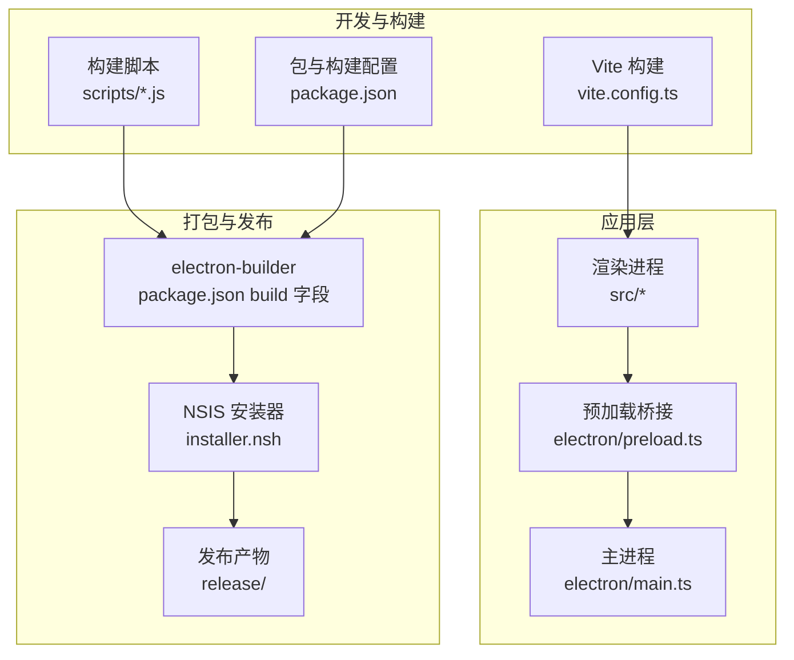
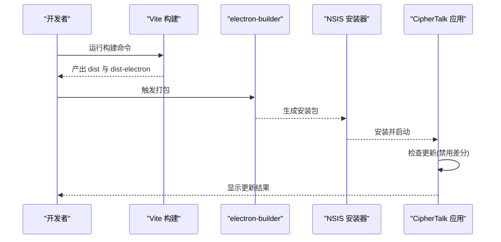
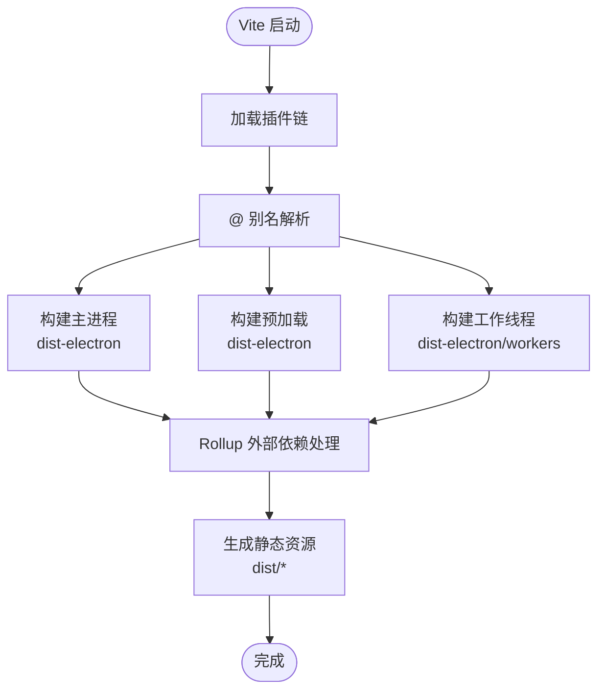
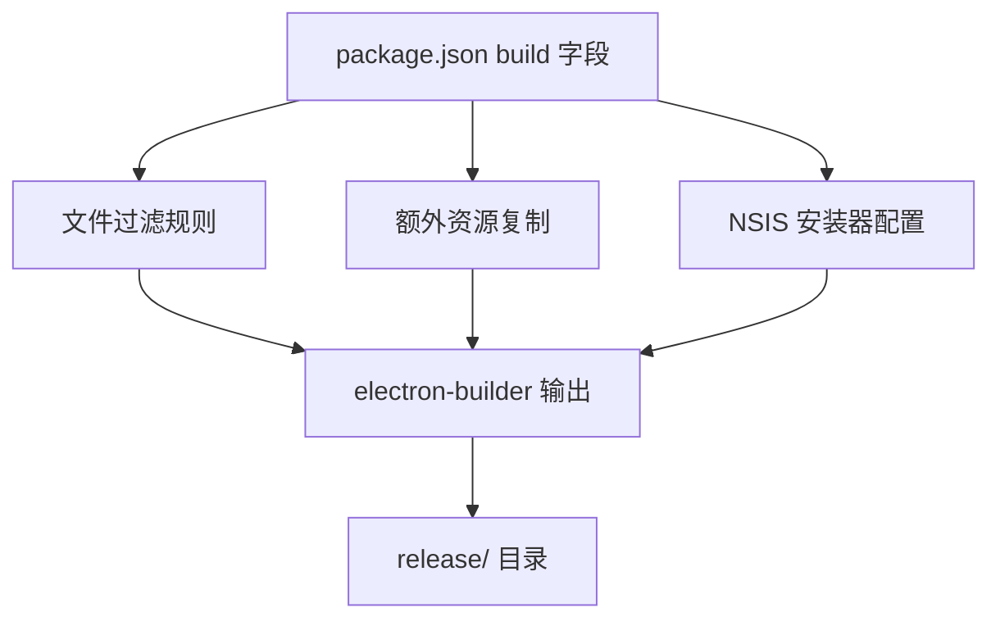
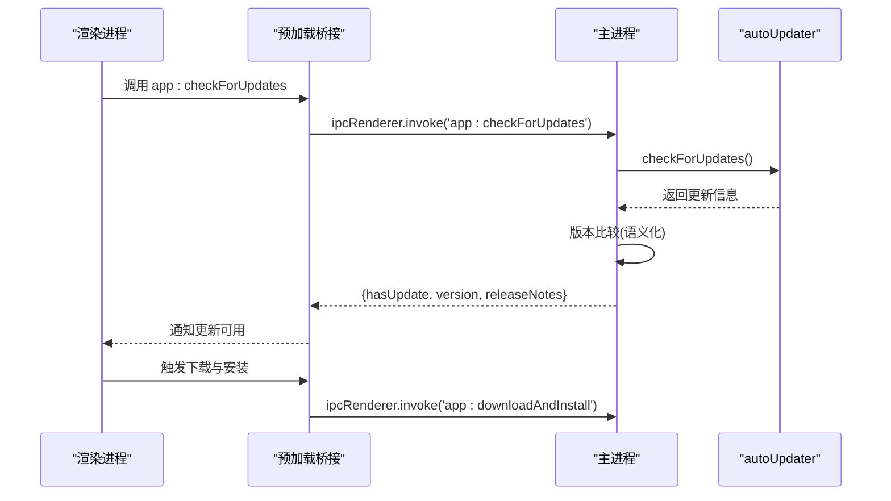
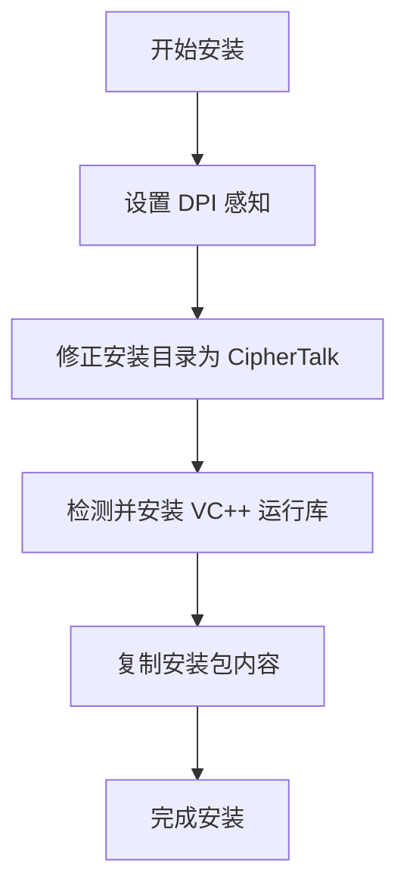
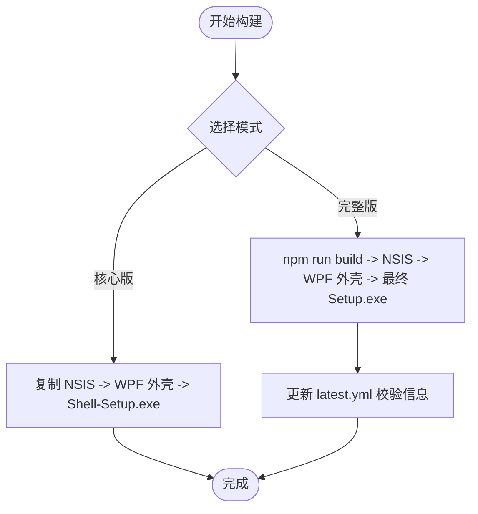
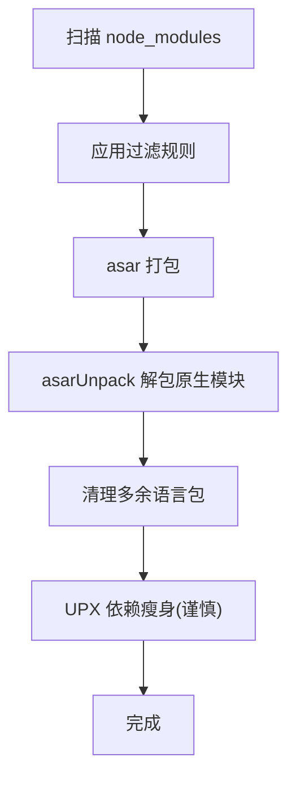
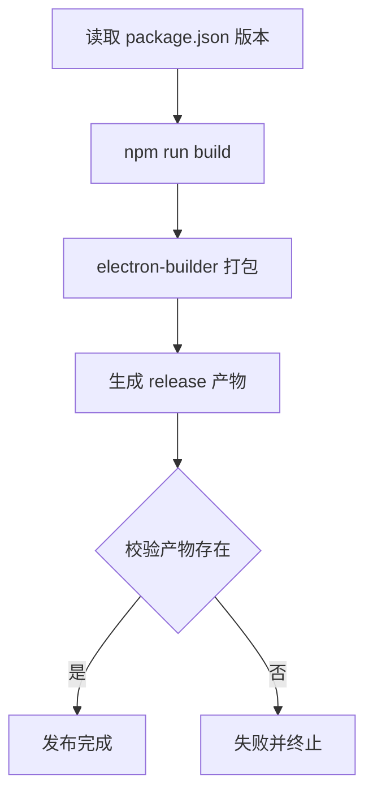
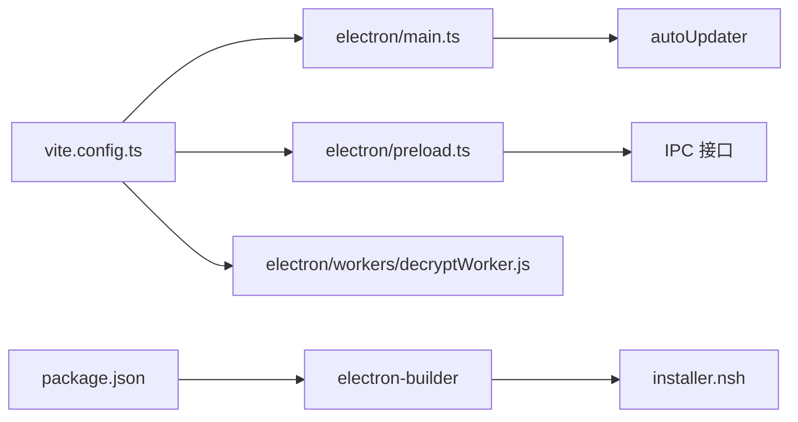

# 构建和部署

<cite>
**本文档引用的文件**
- [package.json](file://package.json)
- [vite.config.ts](file://vite.config.ts)
- [electron/main.ts](file://electron/main.ts)
- [electron/preload.ts](file://electron/preload.ts)
- [scripts/build-full.js](file://scripts/build-full.js)
- [scripts/build-shell-only.js](file://scripts/build-shell-only.js)
- [build.bat](file://build.bat)
- [installer.nsh](file://installer.nsh)
- [scripts/optimize-deps.js](file://scripts/optimize-deps.js)
- [scripts/clean-locales.js](file://scripts/clean-locales.js)
- [electron/workers/decryptWorker.js](file://electron/workers/decryptWorker.js)
- [electron/services/config.ts](file://electron/services/config.ts)
- [electron/services/httpApiService.ts](file://electron/services/httpApiService.ts)
- [electron/services/cacheService.ts](file://electron/services/cacheService.ts)
</cite>

## 目录
1. [简介](#简介)
2. [项目结构](#项目结构)
3. [核心组件](#核心组件)
4. [架构总览](#架构总览)
5. [详细组件分析](#详细组件分析)
6. [依赖关系分析](#依赖关系分析)
7. [性能考量](#性能考量)
8. [故障排查指南](#故障排查指南)
9. [结论](#结论)
10. [附录](#附录)

## 简介
本文件面向 DevOps 工程师与项目经理，系统化梳理 CipherTalk 的构建与部署体系，覆盖以下关键主题：
- 构建配置：Vite 构建工具配置、Electron 打包配置、资源优化策略
- 打包策略：完整版构建 vs 核心版构建、依赖处理、体积优化
- 发布流程：版本管理、自动化构建、发布检查
- 安装包制作：NSIS 安装程序、数字签名、安装向导
- 自动更新机制：更新检查、增量更新、回滚策略
- 跨平台考虑：Windows 平台特定配置、兼容性测试
- 构建优化技巧：代码分割、资源压缩、缓存策略

## 项目结构
项目采用前端 React/Vite + Electron 主进程/预加载/渲染进程的双层架构，并通过 electron-builder 进行跨平台打包。构建脚本位于 scripts 目录，安装包定制通过 NSIS 脚本实现。

图表来源
- [vite.config.ts:1-78](file://vite.config.ts#L1-L78)
- [package.json:74-167](file://package.json#L74-L167)
- [electron/main.ts:1-120](file://electron/main.ts#L1-L120)
- [electron/preload.ts:1-50](file://electron/preload.ts#L1-L50)
- [installer.nsh:1-65](file://installer.nsh#L1-L65)

章节来源
- [package.json:1-169](file://package.json#L1-L169)
- [vite.config.ts:1-78](file://vite.config.ts#L1-L78)
- [electron/main.ts:1-120](file://electron/main.ts#L1-L120)
- [electron/preload.ts:1-50](file://electron/preload.ts#L1-L50)
- [installer.nsh:1-65](file://installer.nsh#L1-L65)

## 核心组件
- Vite 构建配置：定义入口、插件链、别名、外部依赖与 Rollup 选项，支撑主进程、预加载与工作线程的独立构建。
- Electron 打包配置：通过 electron-builder 的 build 字段统一配置产物、目标平台、安装器、额外资源与 asar 解包策略。
- 自动更新：基于 electron-updater，禁用差分下载，强制全量更新，结合版本比较逻辑与 UI 交互。
- 安装器定制：NSIS 脚本集成 DPI、VC++ 运行库检测与安装、安装目录修正、语言选择等。
- 构建脚本：完整版构建脚本负责将 NSIS 安装包注入 WPF 外壳，生成最终 Setup.exe，并同步更新最新版本元数据。

章节来源
- [vite.config.ts:15-77](file://vite.config.ts#L15-L77)
- [package.json:74-167](file://package.json#L74-L167)
- [electron/main.ts:58-64](file://electron/main.ts#L58-L64)
- [installer.nsh:1-65](file://installer.nsh#L1-L65)
- [scripts/build-full.js:20-157](file://scripts/build-full.js#L20-L157)

## 架构总览
下图展示从源码到安装包的关键流程：Vite 构建前端资源与 Electron 主进程/预加载/工作线程，electron-builder 打包为可执行安装包，NSIS 安装器负责安装与运行库检测，自动更新在应用内触发检查与下载。

图表来源
- [vite.config.ts:21-66](file://vite.config.ts#L21-L66)
- [package.json:11-18](file://package.json#L11-L18)
- [package.json:74-167](file://package.json#L74-L167)
- [electron/main.ts:1281-1302](file://electron/main.ts#L1281-L1302)

## 详细组件分析

### Vite 构建配置
- 插件链：React 插件、Vite Electron 插件（主进程、预加载、工作线程）、Electron 渲染器插件。
- 外部依赖：内置模块、Node 内置模块前缀、生产依赖均标记为外部，避免打包进主进程。
- 构建输出：主进程与预加载输出到 dist-electron；工作线程单独输出到 dist-electron/workers。
- 资源解析：@ 别名指向 src；Rollup 外部规则扩展。

图表来源
- [vite.config.ts:21-66](file://vite.config.ts#L21-L66)
- [vite.config.ts:67-77](file://vite.config.ts#L67-L77)

章节来源
- [vite.config.ts:15-77](file://vite.config.ts#L15-L77)

### Electron 打包配置（electron-builder）
- 应用标识与产物命名：appId、productName、artifactName。
- 压缩与重建：compression、npmRebuild。
- 安装器：win.target=nsis，nsis 选项控制桌面快捷方式、语言、Unicode、安装目录等。
- 额外资源：resources、electron/assets、图标等。
- 过滤规则：过滤 node_modules 中的文档、测试、非 Windows 二进制与调试符号。
- asar 解包：对 ffmpeg-static、silk-wasm、sherpa-onnx-node、koffi 与 workers、resources 进行解包以保证原生模块可用。

图表来源
- [package.json:74-167](file://package.json#L74-L167)

章节来源
- [package.json:74-167](file://package.json#L74-L167)

### 自动更新机制
- 禁用差分下载：disableDifferentialDownload=true，强制全量下载。
- 更新检查：ipcMain.handle('app:checkForUpdates')，调用 autoUpdater.checkForUpdates()，使用语义化版本比较。
- UI 交互：preload 暴露出 app:checkForUpdates、app:downloadAndInstall 等 IPC 接口。
- 发布源：generic provider，URL 指向 https://miyuapp.aiqji.com。

图表来源
- [electron/main.ts:1281-1302](file://electron/main.ts#L1281-L1302)
- [electron/preload.ts:46-62](file://electron/preload.ts#L46-L62)
- [package.json:84-87](file://package.json#L84-L87)

章节来源
- [electron/main.ts:58-64](file://electron/main.ts#L58-L64)
- [electron/main.ts:1281-1302](file://electron/main.ts#L1281-L1302)
- [electron/preload.ts:46-62](file://electron/preload.ts#L46-L62)
- [package.json:84-87](file://package.json#L84-L87)

### 安装包制作（NSIS）
- DPI 感知与高 DPI 支持。
- 安装前修正安装目录，确保以 CipherTalk 结尾。
- 安装后检测并安装 VC++ 2015-2022 x64 运行库，避免运行时缺失。
- 安装器语言：简体中文、英文；桌面快捷方式；Unicode 支持；允许更改安装目录。

图表来源
- [installer.nsh:1-65](file://installer.nsh#L1-L65)

章节来源
- [installer.nsh:1-65](file://installer.nsh#L1-L65)

### 完整版构建 vs 核心版构建
- 完整版构建：执行 npm run build 生成 NSIS 安装包，随后注入 WPF 外壳，生成最终 Setup.exe，并同步更新 latest.yml 的 SHA512 与 size。
- 核心版构建：直接使用已存在的 NSIS 安装包，快速生成 Shell-Setup.exe，便于快速迭代外壳。
- 关键差异：完整版构建会删除 blockmap 以禁用差分更新，确保校验一致；核心版构建跳过外壳流程。

图表来源
- [scripts/build-full.js:20-157](file://scripts/build-full.js#L20-L157)
- [scripts/build-shell-only.js:14-85](file://scripts/build-shell-only.js#L14-L85)

章节来源
- [scripts/build-full.js:20-157](file://scripts/build-full.js#L20-L157)
- [scripts/build-shell-only.js:14-85](file://scripts/build-shell-only.js#L14-L85)

### 依赖处理与体积优化
- 文件过滤：排除 node_modules 中的 txt/md/js.map/ts/html、test/docs/examples、非 Windows 平台二进制、.obj/.pdb/.lib、构建目录非 Release 等。
- asar 解包：对原生模块与工作线程目录进行解包，避免 UPX 压缩破坏 .node 完整性。
- 语言包精简：打包后清理 Chromium 语言包，仅保留 zh-CN 与 en-US。
- 依赖瘦身：UPX 压缩（当前注释掉原生模块压缩，避免破坏）。

图表来源
- [package.json:139-166](file://package.json#L139-L166)
- [scripts/clean-locales.js:4-27](file://scripts/clean-locales.js#L4-L27)
- [scripts/optimize-deps.js:8-38](file://scripts/optimize-deps.js#L8-L38)

章节来源
- [package.json:139-166](file://package.json#L139-L166)
- [scripts/clean-locales.js:4-27](file://scripts/clean-locales.js#L4-L27)
- [scripts/optimize-deps.js:8-38](file://scripts/optimize-deps.js#L8-L38)

### 发布流程与版本管理
- 版本号：package.json 中 version 字段驱动构建与产物命名。
- 自动化构建：npm run build 调用 TypeScript 编译、Vite 构建、electron-builder 打包，并在完成后更新 release 目录元数据。
- 发布检查：构建脚本严格校验 release 目录与目标安装包是否存在，失败时终止并输出错误信息。
- 一键构建：build.bat 自动安装依赖并执行 npm run build，适合本地快速验证。

图表来源
- [package.json:3-4](file://package.json#L3-L4)
- [package.json:11-18](file://package.json#L11-L18)
- [build.bat:12-79](file://build.bat#L12-L79)

章节来源
- [package.json:3-4](file://package.json#L3-L4)
- [package.json:11-18](file://package.json#L11-L18)
- [build.bat:12-79](file://build.bat#L12-L79)

### 跨平台与 Windows 平台特定配置
- 平台目标：win.target=nsis，请求执行级别 asInvoker。
- 安装器特性：Unicode、桌面快捷方式、允许提升权限、允许更改安装目录、语言选择。
- 运行库要求：安装器自动检测并安装 VC++ 2015-2022 x64 运行库。
- 原生模块：通过 asarUnpack 与过滤规则确保 Windows x64 二进制可用。

章节来源
- [package.json:88-113](file://package.json#L88-L113)
- [installer.nsh:20-65](file://installer.nsh#L20-L65)

### 构建优化技巧
- 代码分割：Vite 与 Rollup 默认进行代码分割，结合外部依赖策略减少主进程包体。
- 资源压缩：启用 maximum 压缩；清理语言包与调试符号；必要时使用 UPX（需谨慎处理原生模块）。
- 缓存策略：配置缓存路径与清理逻辑，避免缓存膨胀影响安装包体积。

章节来源
- [package.json:77](file://package.json#L77)
- [scripts/clean-locales.js:12-26](file://scripts/clean-locales.js#L12-L26)
- [scripts/optimize-deps.js:8-38](file://scripts/optimize-deps.js#L8-L38)
- [electron/services/cacheService.ts:9-40](file://electron/services/cacheService.ts#L9-L40)

## 依赖关系分析
- Vite 与 Electron 插件：主进程、预加载、工作线程分别构建，Rollup 外部依赖避免打包 Node 内置与生产依赖。
- 打包与安装器：electron-builder 依据 build 字段生成 NSIS 安装包；NSIS 脚本负责运行库检测与安装。
- 自动更新：主进程通过 autoUpdater 控制更新流程，preload 暴露 IPC 接口供 UI 调用。
- 构建脚本：完整版与核心版脚本分别处理外壳注入与元数据同步。

图表来源
- [vite.config.ts:21-66](file://vite.config.ts#L21-L66)
- [electron/main.ts:1-120](file://electron/main.ts#L1-L120)
- [electron/preload.ts:1-50](file://electron/preload.ts#L1-L50)
- [electron/workers/decryptWorker.js:1-20](file://electron/workers/decryptWorker.js#L1-L20)
- [package.json:74-167](file://package.json#L74-L167)
- [installer.nsh:1-65](file://installer.nsh#L1-L65)

章节来源
- [vite.config.ts:21-66](file://vite.config.ts#L21-L66)
- [package.json:74-167](file://package.json#L74-L167)
- [electron/main.ts:1-120](file://electron/main.ts#L1-L120)
- [electron/preload.ts:1-50](file://electron/preload.ts#L1-L50)
- [electron/workers/decryptWorker.js:1-20](file://electron/workers/decryptWorker.js#L1-L20)
- [installer.nsh:1-65](file://installer.nsh#L1-L65)

## 性能考量
- 构建性能：合理使用外部依赖与 asar 解包，避免不必要的打包；利用 Vite 的热更新与并行构建能力。
- 运行性能：禁用差分更新可简化校验流程，但会增加下载体积；根据网络条件评估是否启用差分。
- 安装体验：NSIS 自动检测 VC++ 运行库，减少用户手动安装成本；桌面快捷方式与语言选择提升可用性。
- 体积控制：过滤规则与语言包精简显著降低安装包大小；UPX 压缩需谨慎处理原生模块。

## 故障排查指南
- 构建失败：检查 Node.js 与 npm 版本，确认依赖安装成功；查看 build.bat 输出定位具体错误。
- 安装包缺失：核对 release 目录与目标安装包命名是否与版本一致；完整版构建需确保 latest.yml 元数据同步。
- 运行库问题：NSIS 会自动检测并安装 VC++ 运行库；若失败，需手动安装或调整安装器逻辑。
- 自动更新失败：检查发布源 URL 与 latest.yml 校验信息；确保禁用差分下载时 blockmap 已删除。
- 原生模块异常：确认 asarUnpack 已包含相关原生模块目录；避免对 .node 文件使用 UPX 压缩。

章节来源
- [build.bat:12-79](file://build.bat#L12-L79)
- [scripts/build-full.js:25-38](file://scripts/build-full.js#L25-L38)
- [installer.nsh:20-65](file://installer.nsh#L20-L65)
- [electron/main.ts:58-64](file://electron/main.ts#L58-L64)
- [scripts/build-full.js:116-124](file://scripts/build-full.js#L116-L124)

## 结论
CipherTalk 的构建与部署体系围绕 Vite + Electron + electron-builder 展开，通过严格的文件过滤、语言包精简与 asar 解包策略，实现了体积与功能的平衡。NSIS 安装器提供了完善的运行库检测与安装体验，自动更新机制在简化校验的同时确保稳定性。建议在团队内标准化构建脚本与发布流程，持续优化体积与性能，并完善跨平台兼容性测试。

## 附录
- 一键构建：build.bat 自动安装依赖并执行 npm run build。
- 完整版构建：scripts/build-full.js 生成最终 Setup.exe 并同步最新版本元数据。
- 核心版构建：scripts/build-shell-only.js 快速生成 Shell-Setup.exe。
- 依赖瘦身：scripts/optimize-deps.js 提供 UPX 压缩示例（当前注释掉原生模块压缩）。
- 语言包清理：scripts/clean-locales.js 在打包后清理多余语言包。

章节来源
- [build.bat:12-79](file://build.bat#L12-L79)
- [scripts/build-full.js:20-157](file://scripts/build-full.js#L20-L157)
- [scripts/build-shell-only.js:14-85](file://scripts/build-shell-only.js#L14-L85)
- [scripts/optimize-deps.js:8-38](file://scripts/optimize-deps.js#L8-L38)
- [scripts/clean-locales.js:4-27](file://scripts/clean-locales.js#L4-L27)