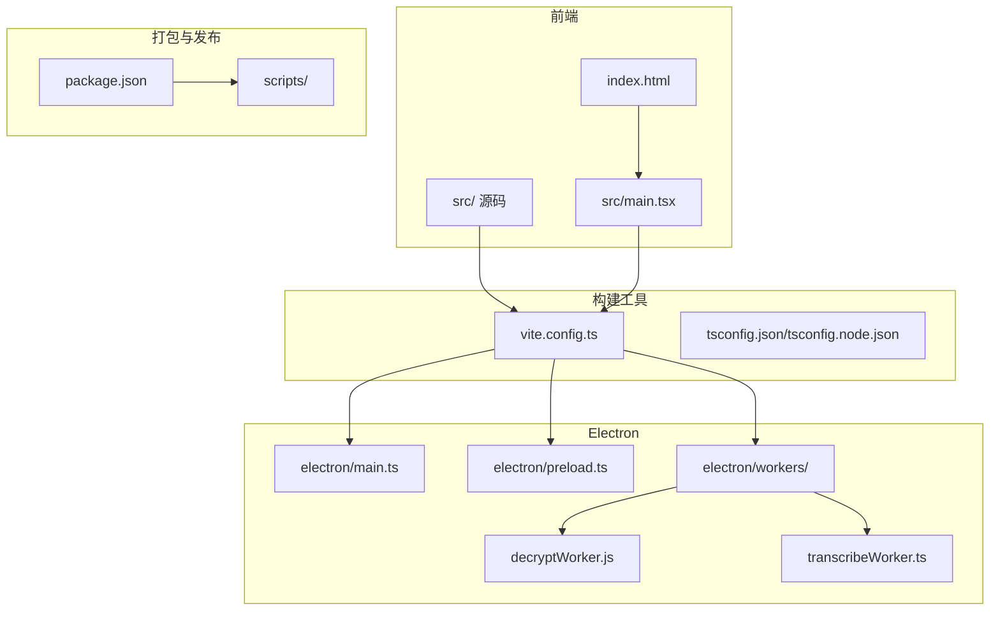
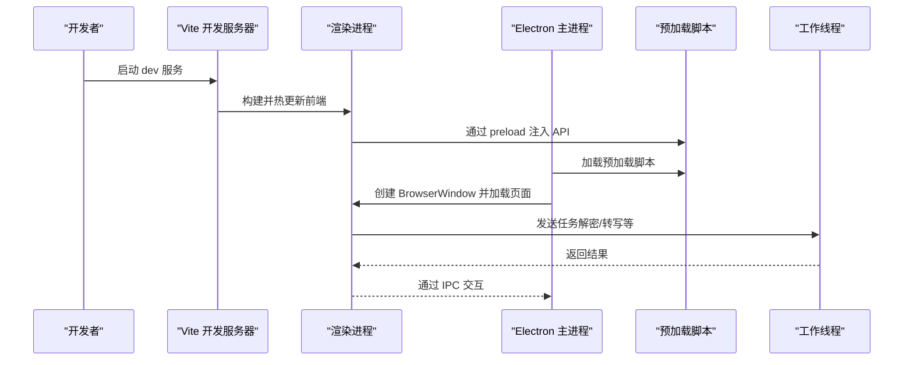
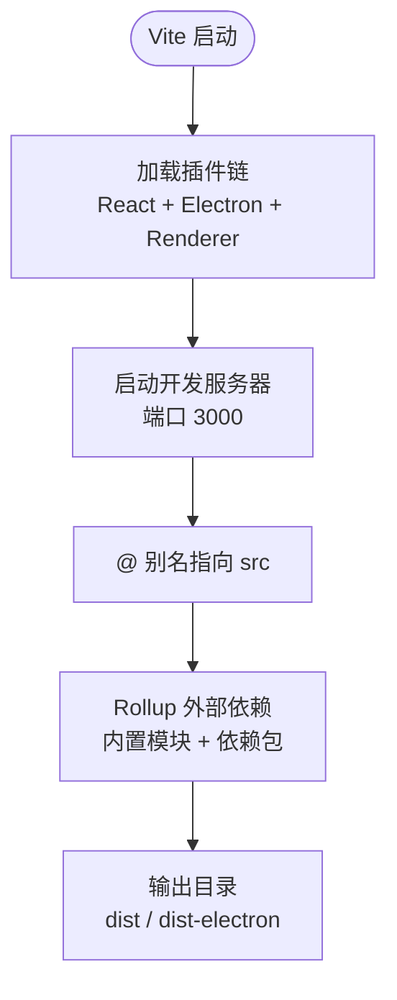
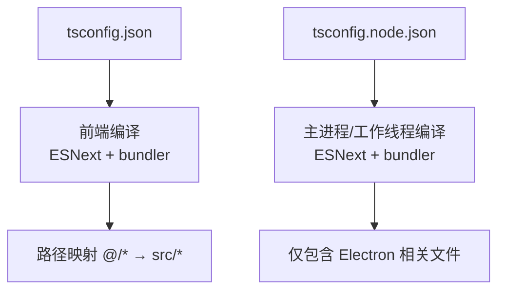
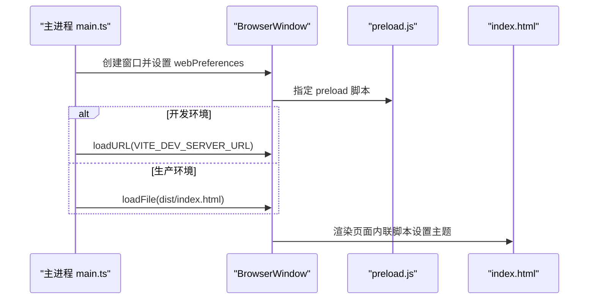
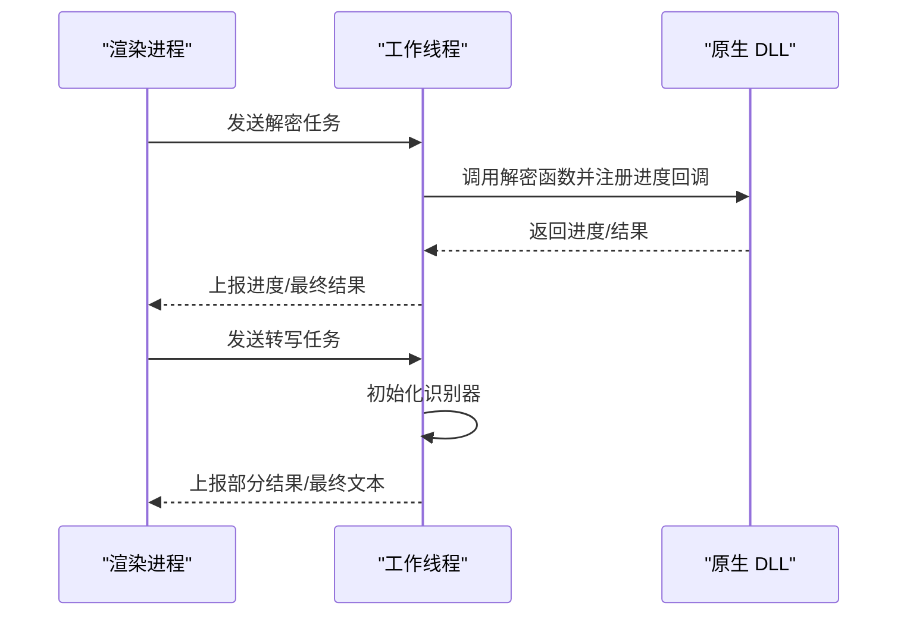
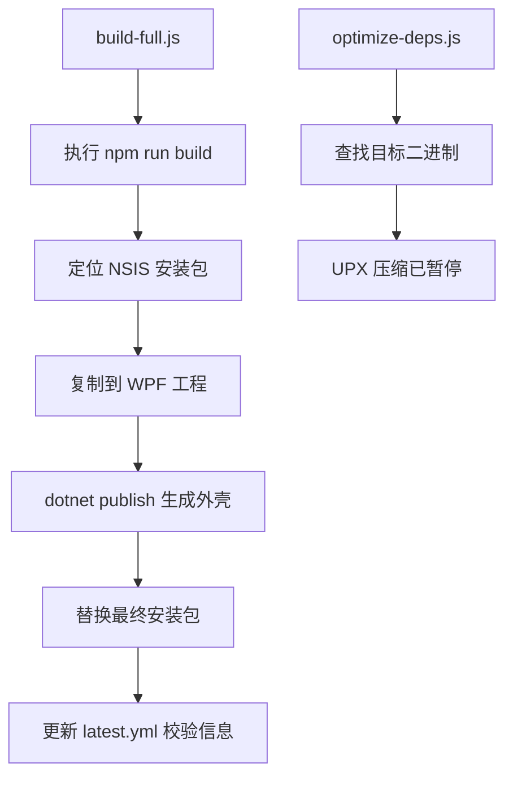
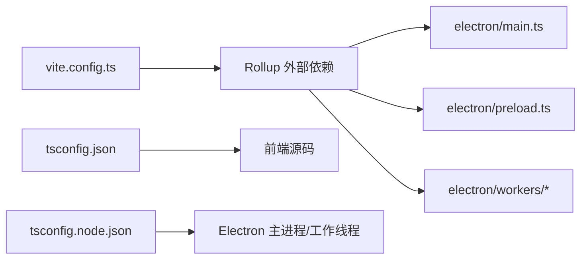

# 构建配置详解

<cite>
**本文档引用的文件**
- [vite.config.ts](file://vite.config.ts)
- [package.json](file://package.json)
- [tsconfig.json](file://tsconfig.json)
- [tsconfig.node.json](file://tsconfig.node.json)
- [electron/main.ts](file://electron/main.ts)
- [electron/preload.ts](file://electron/preload.ts)
- [electron/workers/decryptWorker.js](file://electron/workers/decryptWorker.js)
- [electron/transcribeWorker.ts](file://electron/transcribeWorker.ts)
- [index.html](file://index.html)
- [scripts/build-full.js](file://scripts/build-full.js)
- [scripts/optimize-deps.js](file://scripts/optimize-deps.js)
- [src/main.tsx](file://src/main.tsx)
</cite>

## 目录
1. [简介](#简介)
2. [项目结构](#项目结构)
3. [核心组件](#核心组件)
4. [架构总览](#架构总览)
5. [详细组件分析](#详细组件分析)
6. [依赖关系分析](#依赖关系分析)
7. [性能考虑](#性能考虑)
8. [故障排除指南](#故障排除指南)
9. [结论](#结论)
10. [附录](#附录)

## 简介
本文件面向 CipherTalk 的构建配置，系统性解析 Vite 构建工具、Rollup 打包、TypeScript 编译、Electron 特定配置以及构建优化策略。内容覆盖插件系统（React 插件、Electron 插件、Renderer 插件）、路径别名、开发服务器、外部依赖处理、代码分割、输出目录结构、TS 编译选项与模块解析、主进程/预加载/工作线程配置，并提供自定义指导与最佳实践。

## 项目结构
项目采用前端框架与 Electron 主进程分离的典型布局：
- 前端源码位于 src/，通过 Vite 构建
- Electron 主进程、预加载脚本与工作线程位于 electron/
- 构建脚本位于 scripts/
- 根级配置文件包括 vite.config.ts、tsconfig.json、tsconfig.node.json、package.json



图表来源
- [vite.config.ts:15-77](file://vite.config.ts#L15-L77)
- [package.json:1-169](file://package.json#L1-L169)

章节来源
- [vite.config.ts:15-77](file://vite.config.ts#L15-L77)
- [package.json:1-169](file://package.json#L1-L169)

## 核心组件
- Vite 构建配置：定义插件、开发服务器、路径别名、Rollup 外部依赖与输出目录
- TypeScript 配置：两套 tsconfig，分别服务于前端与 Electron 主进程/工作线程
- Electron 配置：主进程入口、预加载脚本、工作线程、窗口加载逻辑
- 构建脚本：完整打包、外壳替换、校验信息更新与依赖优化

章节来源
- [vite.config.ts:15-77](file://vite.config.ts#L15-L77)
- [tsconfig.json:1-26](file://tsconfig.json#L1-L26)
- [tsconfig.node.json:1-14](file://tsconfig.node.json#L1-L14)
- [package.json:1-169](file://package.json#L1-L169)

## 架构总览
下图展示从开发到打包的关键流程：Vite 启动 React 插件与 Electron 插件，渲染进程通过 renderer 插件桥接，主进程加载预加载脚本并通过 preload 暴露受限 API，工作线程执行重型任务。



图表来源
- [vite.config.ts:21-66](file://vite.config.ts#L21-L66)
- [electron/main.ts:260-277](file://electron/main.ts#L260-L277)
- [electron/preload.ts:1-454](file://electron/preload.ts#L1-L454)

## 详细组件分析

### Vite 插件系统与开发服务器
- 插件链路
  - React 插件：启用 JSX 转换与开发时刷新
  - Electron 插件：配置多个入口（主进程、预加载、工作线程）与各自输出目录
  - Renderer 插件：桥接主进程与渲染进程，使渲染侧可感知主进程变化
- 开发服务器
  - 端口 3000，端口占用时自动递增
  - 基础路径 base: "./"，适配打包后相对路径
- 路径别名
  - alias: "@": src，便于统一导入
- Rollup 外部依赖
  - 将 Node 内置模块与 package.json 中 dependencies 设为 external，避免打包进主进程与工作线程



图表来源
- [vite.config.ts:15-77](file://vite.config.ts#L15-L77)

章节来源
- [vite.config.ts:15-77](file://vite.config.ts#L15-L77)

### TypeScript 配置
- 前端 tsconfig.json
  - 目标 ES2020，模块 ESNext，严格模式
  - 路径映射 "@/*": ["./src/*"]
  - 模块解析 "bundler"，配合 Vite/Rollup
- Node/主进程 tsconfig.node.json
  - 目标 ES2020，模块 ESNext，模块解析 "bundler"
  - 仅包含 vite.config.ts 与 electron/**/*.ts，确保主进程/工作线程类型安全



图表来源
- [tsconfig.json:18-21](file://tsconfig.json#L18-L21)
- [tsconfig.node.json:1-13](file://tsconfig.node.json#L1-L13)

章节来源
- [tsconfig.json:1-26](file://tsconfig.json#L1-L26)
- [tsconfig.node.json:1-14](file://tsconfig.node.json#L1-L14)

### Electron 主进程配置
- 窗口创建与加载
  - 开发环境：加载 Vite 开发服务器地址
  - 生产环境：加载 dist/index.html
  - 预加载脚本路径固定为 preload.js
- 协议注册与自动更新
  - 注册本地视频/图片协议为特权
  - 禁用差分更新，强制全量下载
- 系统托盘与多窗口
  - 支持主窗口、聊天窗口、朋友圈窗口、群聊分析窗口、年度报告窗口、协议窗口、购买窗口、AI 摘要窗口、欢迎窗口、聊天记录窗口等
  - 通过查询参数传递主题与模式，减少首屏闪烁



图表来源
- [electron/main.ts:193-281](file://electron/main.ts#L193-L281)
- [electron/main.ts:260-277](file://electron/main.ts#L260-L277)
- [index.html:7-30](file://index.html#L7-L30)

章节来源
- [electron/main.ts:1-3886](file://electron/main.ts#L1-L3886)
- [index.html:1-37](file://index.html#L1-L37)

### 预加载脚本与受限 API
- 通过 contextBridge.exposeInMainWorld 暴露受控 API 至渲染进程
- 涵盖配置、数据库、解密、对话框、文件、Shell、HTTP API、窗口控制、Windows Hello、密钥获取、数据库路径、WCDB、数据管理、图片解密、视频、聊天、朋友圈、数据分析、群聊分析、年度报告、导出、激活、缓存、日志、语音转文字（含 Whisper GPU 加速）、AI 摘要等
- 渲染进程通过 window.electronAPI 调用，实现强隔离与安全通信

```mermaid
classDiagram
class Preload {
+暴露 electronAPI
+配置 API
+数据库 API
+解密 API
+对话框/文件/Shell
+HTTP API
+窗口控制
+Windows Hello
+密钥/路径
+WCDB
+数据管理
+图片解密
+视频
+聊天/朋友圈
+分析/群聊/年报
+导出/激活/缓存/日志
+STT/Whisper
+AI 摘要
}
class Renderer {
+window.electronAPI
}
Preload <---> Renderer : "contextBridge 暴露 API"
```

图表来源
- [electron/preload.ts:1-454](file://electron/preload.ts#L1-L454)

章节来源
- [electron/preload.ts:1-454](file://electron/preload.ts#L1-L454)

### 工作线程配置
- 解密工作线程（decryptWorker.js）
  - 使用 worker_threads 与 koffi 调用原生 DLL
  - 接收任务消息，执行解密并上报进度与结果
- 语音转写工作线程（transcribeWorker.ts）
  - 使用 sherpa-onnx-node 进行本地离线识别
  - 支持 SenseVoiceSmall 模型，动态加载模型与 tokens
  - 支持多语言过滤与线程数自适应



图表来源
- [electron/workers/decryptWorker.js:1-89](file://electron/workers/decryptWorker.js#L1-L89)
- [electron/transcribeWorker.ts:1-261](file://electron/transcribeWorker.ts#L1-L261)

章节来源
- [electron/workers/decryptWorker.js:1-89](file://electron/workers/decryptWorker.js#L1-L89)
- [electron/transcribeWorker.ts:1-261](file://electron/transcribeWorker.ts#L1-L261)

### 构建与打包脚本
- 完整构建脚本（build-full.js）
  - 执行 npm run build 生成核心产物
  - 将 NSIS 安装包注入 WPF 外壳工程并发布
  - 同步版本号至 .NET 项目，替换最终安装包
  - 更新 latest.yml 的 SHA512 与 size，禁用差分更新
- 依赖优化脚本（optimize-deps.js）
  - 自动寻找目标二进制文件并尝试 UPX 压缩
  - 明确注释：UPX 会破坏 .node 原生模块完整性，已暂停对 koffi/better-sqlite3 的压缩



图表来源
- [scripts/build-full.js:1-157](file://scripts/build-full.js#L1-L157)
- [scripts/optimize-deps.js:1-38](file://scripts/optimize-deps.js#L1-L38)

章节来源
- [scripts/build-full.js:1-157](file://scripts/build-full.js#L1-L157)
- [scripts/optimize-deps.js:1-38](file://scripts/optimize-deps.js#L1-L38)

## 依赖关系分析
- Vite 与 Rollup
  - Vite 使用 Rollup 作为底层打包器，vite.config.ts 中的 rollupOptions.external 控制打包范围
  - 主进程与工作线程均设为 external，避免将 Node 内置模块与第三方依赖打包进 Electron 主进程
- TypeScript 与模块解析
  - tsconfig.json 与 tsconfig.node.json 分别约束前端与主进程/工作线程的编译范围与模块解析策略
  - 路径映射 "@/*" 统一导入路径，提升可维护性
- Electron 入口与输出
  - 主进程入口：electron/main.ts
  - 预加载入口：electron/preload.ts
  - 工作线程：decryptWorker.js 与 transcribeWorker.ts
  - 输出目录：dist 与 dist-electron，其中工作线程输出至 dist-electron/workers



图表来源
- [vite.config.ts:9-13](file://vite.config.ts#L9-L13)
- [vite.config.ts:25-63](file://vite.config.ts#L25-L63)
- [tsconfig.json:18-21](file://tsconfig.json#L18-L21)
- [tsconfig.node.json:12](file://tsconfig.node.json#L12)

章节来源
- [vite.config.ts:9-13](file://vite.config.ts#L9-L13)
- [vite.config.ts:25-63](file://vite.config.ts#L25-L63)
- [tsconfig.json:18-21](file://tsconfig.json#L18-L21)
- [tsconfig.node.json:12](file://tsconfig.node.json#L12)

## 性能考虑
- Tree Shaking
  - 使用 ESNext 模块与严格模式，结合 Vite/Rollup 的静态分析能力，减少未使用代码
- 代码压缩
  - 生产构建默认启用压缩；可结合 terser 与构建脚本中的 UPX（谨慎使用）进一步减小体积
- 资源内联
  - index.html 中内联主题设置脚本，避免首屏闪烁
- 外部依赖与拆分
  - 将 Node 内置模块与第三方依赖标记为 external，避免重复打包与体积膨胀
- 工作线程
  - 将重型任务（解密、语音转写）放入工作线程，避免阻塞主线程

章节来源
- [index.html:7-30](file://index.html#L7-L30)
- [vite.config.ts:9-13](file://vite.config.ts#L9-L13)
- [electron/transcribeWorker.ts:103-126](file://electron/transcribeWorker.ts#L103-L126)

## 故障排除指南
- 开发服务器端口占用
  - vite.config.ts 中 server.strictPort=false，端口被占用时自动尝试下一个可用端口
- 预加载 API 未生效
  - 确认主进程 BrowserWindow 的 webPreferences.preload 指向正确路径
  - 确认渲染进程已通过 window.electronAPI 访问 API
- 工作线程无响应
  - 检查工作线程入口路径与输出目录（dist-electron/workers）
  - 确认主线程正确发送消息并监听返回
- 依赖体积过大
  - 检查 external 配置是否覆盖了必要的依赖
  - 谨慎使用 UPX 压缩原生模块（koffi/better-sqlite3），避免初始化失败
- 自动更新校验失败
  - build-full.js 会更新 latest.yml 的 SHA512 与 size，确保与最终安装包一致

章节来源
- [vite.config.ts:17-20](file://vite.config.ts#L17-L20)
- [electron/main.ts:202-207](file://electron/main.ts#L202-L207)
- [electron/workers/decryptWorker.js:1-89](file://electron/workers/decryptWorker.js#L1-L89)
- [scripts/optimize-deps.js:10-13](file://scripts/optimize-deps.js#L10-L13)
- [scripts/build-full.js:114-150](file://scripts/build-full.js#L114-L150)

## 结论
CipherTalk 的构建体系围绕 Vite 与 Electron 展开，通过明确的插件链、严格的外部依赖策略、清晰的路径别名与 TypeScript 配置，实现了前端与主进程/工作线程的高效协作。配合完善的构建脚本与优化策略，可在保证安全性与稳定性的同时获得良好的开发体验与产物体积表现。

## 附录
- 最佳实践建议
  - 保持 external 列表与实际依赖一致，避免遗漏或误伤
  - 在渲染侧统一通过 window.electronAPI 访问受限 API，避免直接引入 Node/Electron 模块
  - 对于原生模块，谨慎使用 UPX 压缩，必要时在 CI 中单独测试
  - 使用路径别名 "@/*" 统一导入，提升可维护性
  - 在生产构建中启用压缩与 Tree Shaking，结合工作线程分流重型任务