# 自动更新机制

<cite>
**本文档引用的文件**
- [electron/main.ts](file://electron/main.ts)
- [electron/preload.ts](file://electron/preload.ts)
- [src/services/config.ts](file://src/services/config.ts)
- [src/stores/updateStatusStore.ts](file://src/stores/updateStatusStore.ts)
- [src/pages/SettingsPage.tsx](file://src/pages/SettingsPage.tsx)
- [src/components/WhatsNewModal.tsx](file://src/components/WhatsNewModal.tsx)
- [electron/services/dataManagementService.ts](file://electron/services/dataManagementService.ts)
</cite>

## 目录
1. [简介](#简介)
2. [项目结构](#项目结构)
3. [核心组件](#核心组件)
4. [架构概览](#架构概览)
5. [详细组件分析](#详细组件分析)
6. [依赖关系分析](#依赖关系分析)
7. [性能考虑](#性能考虑)
8. [故障排除指南](#故障排除指南)
9. [结论](#结论)

## 简介

CipherTalk 的自动更新机制是一个基于 Electron 和 electron-updater 的完整解决方案，提供了从版本检查、增量更新到安全验证的全流程管理。该机制支持多种更新策略，包括全量更新、增量更新、回滚机制，并具备完善的错误处理和监控功能。

## 项目结构

自动更新机制涉及以下关键文件和模块：

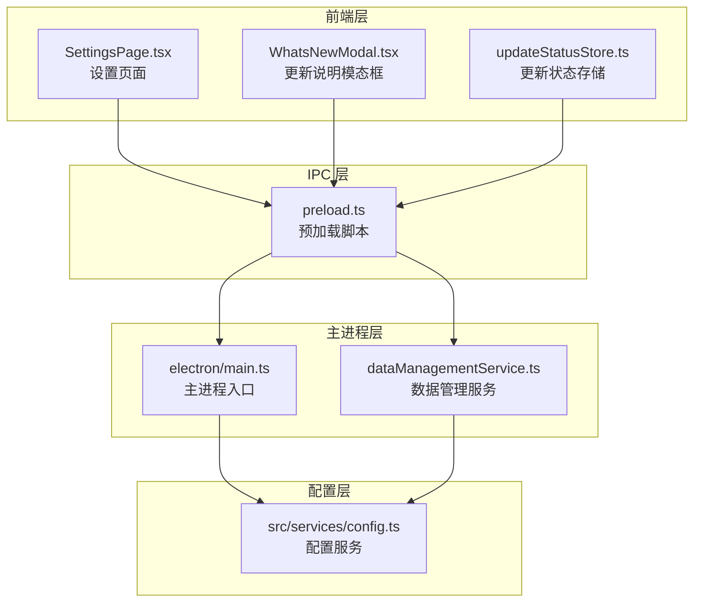

**图表来源**
- [electron/main.ts:1-200](file://electron/main.ts#L1-L200)
- [electron/preload.ts:1-100](file://electron/preload.ts#L1-L100)
- [src/services/config.ts:1-100](file://src/services/config.ts#L1-L100)

**章节来源**
- [electron/main.ts:1-200](file://electron/main.ts#L1-L200)
- [electron/preload.ts:1-100](file://electron/preload.ts#L1-L100)
- [src/services/config.ts:1-100](file://src/services/config.ts#L1-L100)

## 核心组件

### 版本比较算法

系统实现了语义化版本比较算法，支持复杂的版本号比较逻辑：

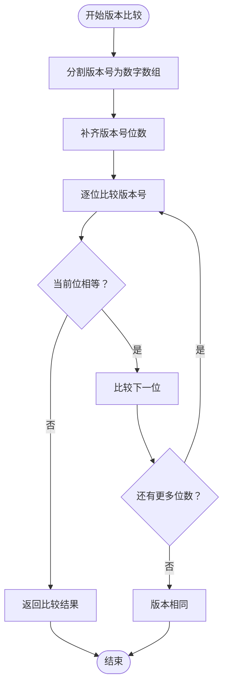

**图表来源**
- [electron/main.ts:69-84](file://electron/main.ts#L69-L84)

### 更新服务器通信

系统通过 electron-updater 进行更新服务器通信，支持多种发布渠道：

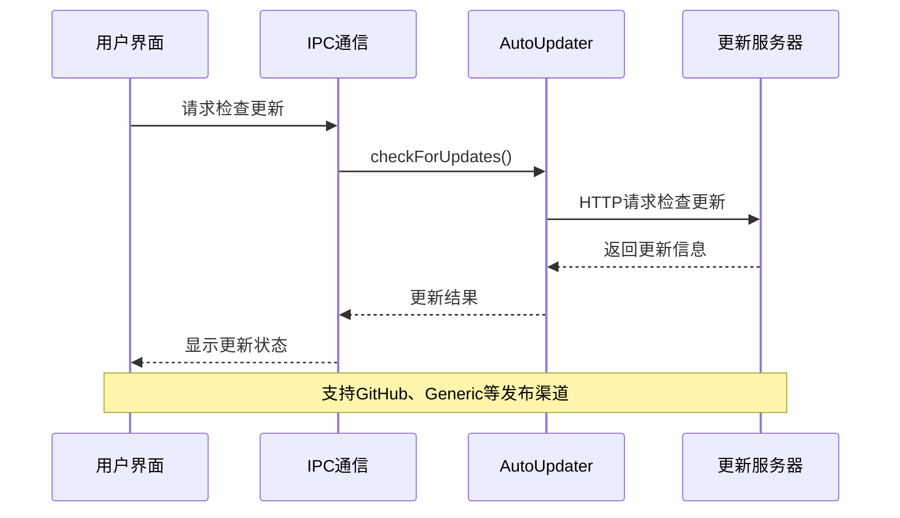

**图表来源**
- [electron/main.ts:1281-1302](file://electron/main.ts#L1281-L1302)

**章节来源**
- [electron/main.ts:69-84](file://electron/main.ts#L69-L84)
- [electron/main.ts:1281-1302](file://electron/main.ts#L1281-L1302)

## 架构概览

自动更新系统的整体架构采用分层设计：

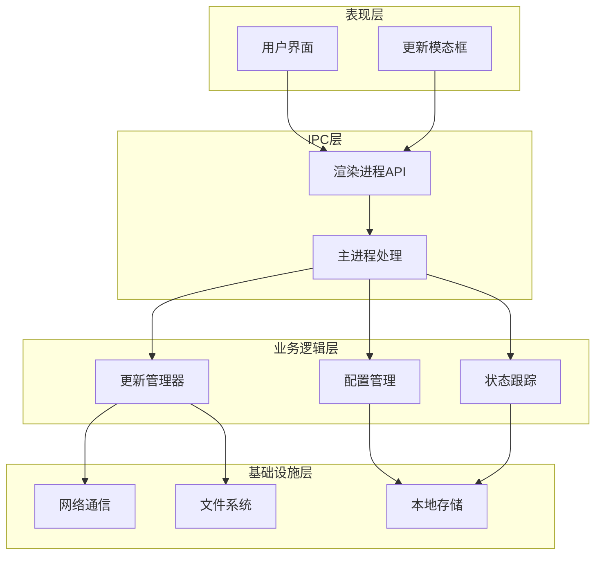

**图表来源**
- [electron/preload.ts:4-62](file://electron/preload.ts#L4-L62)
- [electron/main.ts:58-62](file://electron/main.ts#L58-L62)

## 详细组件分析

### 更新检查流程

#### 版本比较实现

系统实现了精确的语义化版本比较算法：

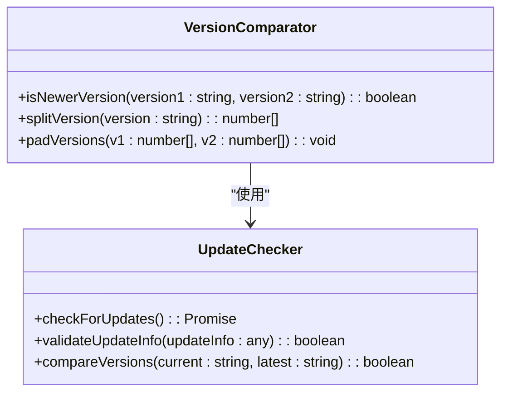

**图表来源**
- [electron/main.ts:69-84](file://electron/main.ts#L69-L84)
- [electron/main.ts:1281-1302](file://electron/main.ts#L1281-L1302)

#### 网络异常处理

系统具备完善的网络异常处理机制：

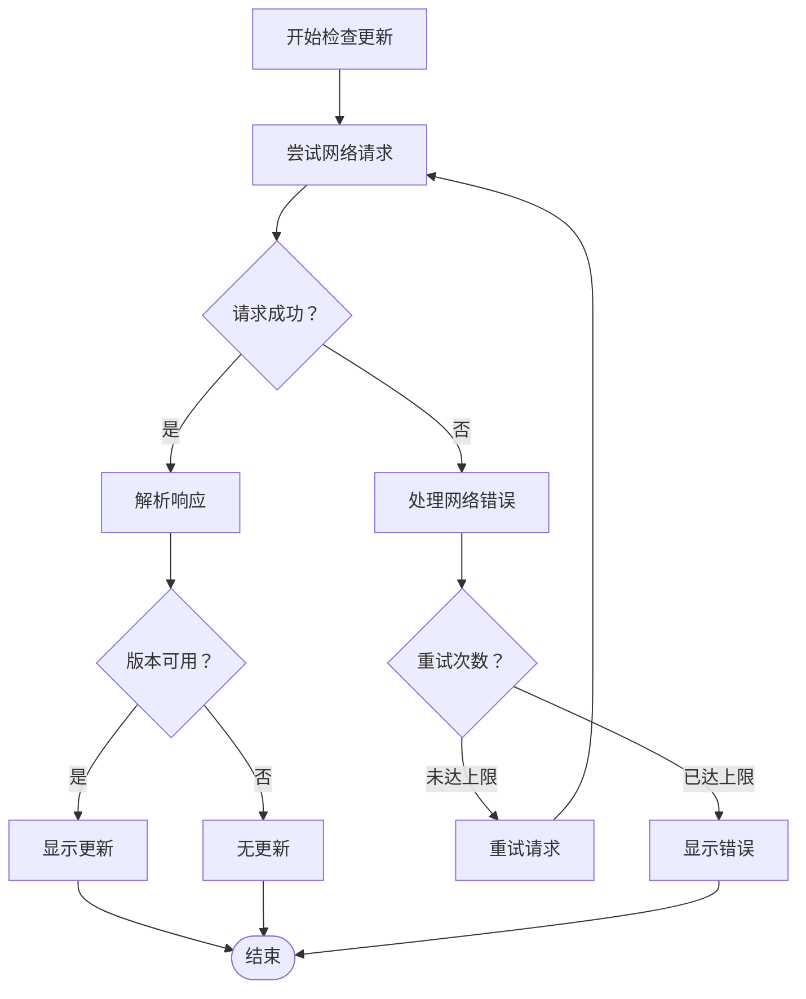

**图表来源**
- [electron/main.ts:1298-1301](file://electron/main.ts#L1298-L1301)

**章节来源**
- [electron/main.ts:69-84](file://electron/main.ts#L69-L84)
- [electron/main.ts:1281-1302](file://electron/main.ts#L1281-L1302)

### 增量更新策略

#### 差异包生成

系统支持差分更新，通过禁用差分下载来确保全量更新的可靠性：

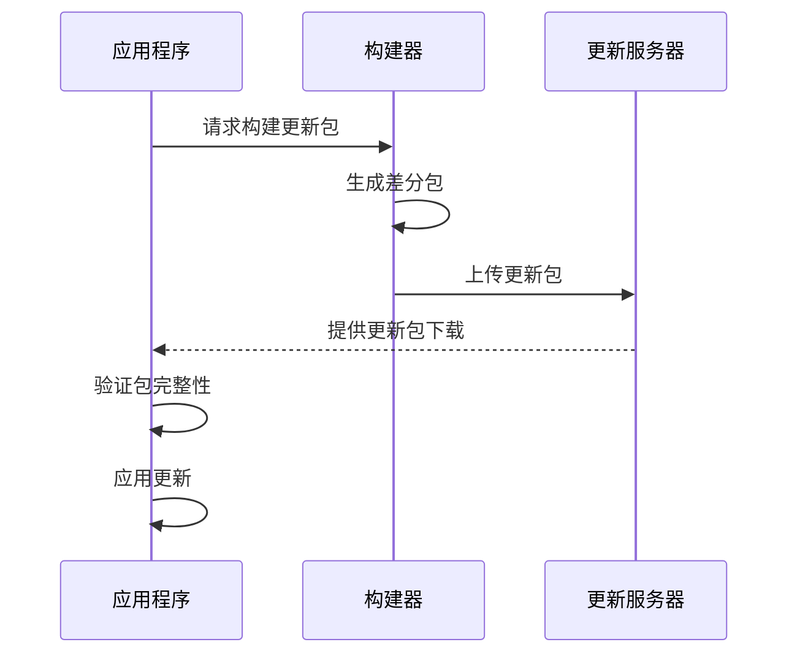

**图表来源**
- [electron/main.ts:59-61](file://electron/main.ts#L59-L61)

#### 补丁应用流程

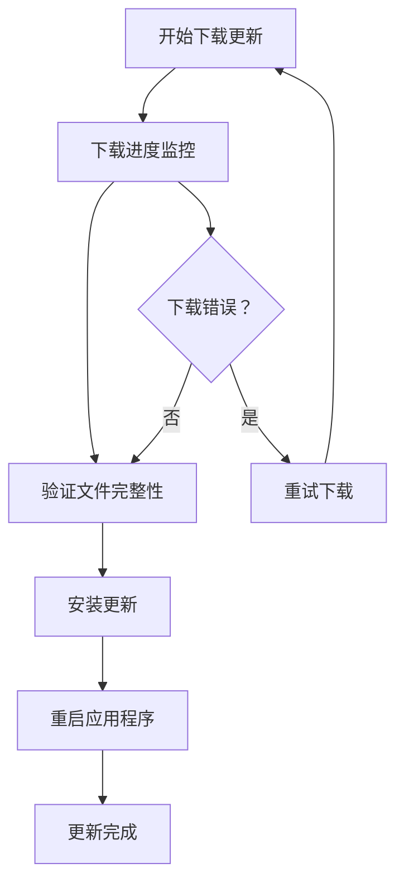

**图表来源**
- [electron/main.ts:1329-1348](file://electron/main.ts#L1329-L1348)

**章节来源**
- [electron/main.ts:59-61](file://electron/main.ts#L59-L61)
- [electron/main.ts:1329-1348](file://electron/main.ts#L1329-L1348)

### 回滚机制

#### 版本备份策略

系统通过以下机制确保更新失败时的回滚能力：

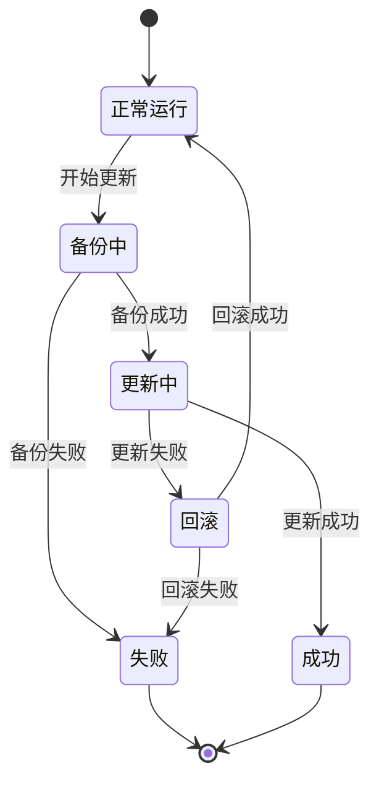

#### 更新失败恢复

系统提供完整的失败恢复机制：

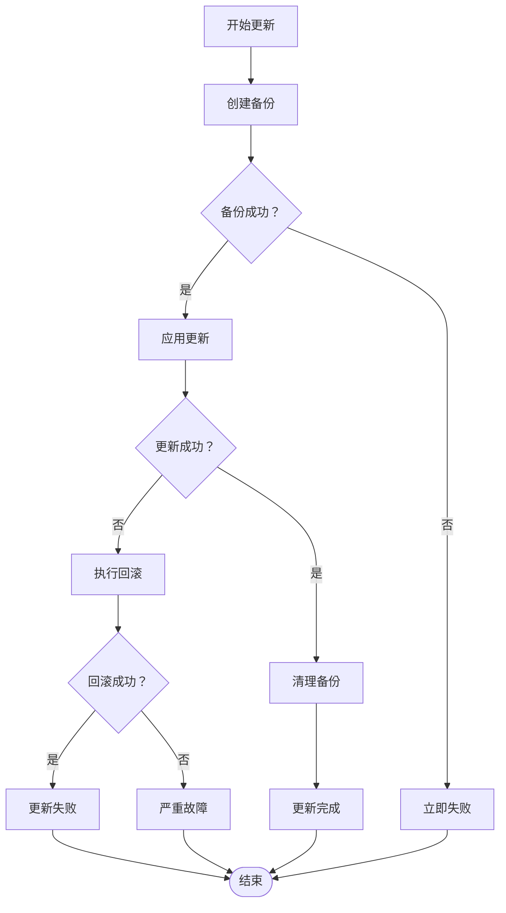

**图表来源**
- [electron/main.ts:1337-1340](file://electron/main.ts#L1337-L1340)

**章节来源**
- [electron/main.ts:1337-1340](file://electron/main.ts#L1337-L1340)

### 安全更新流程

#### 签名验证

系统通过以下方式确保更新的安全性：

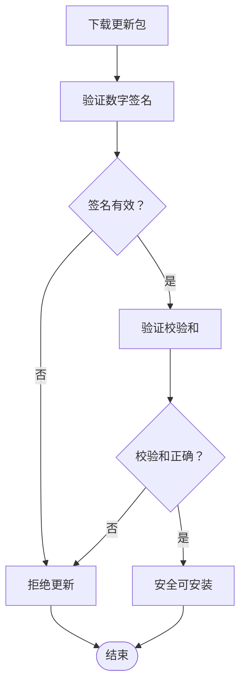

#### HTTPS 通信

系统确保所有更新通信都通过安全的 HTTPS 进行：

**章节来源**
- [electron/main.ts:1333-1340](file://electron/main.ts#L1333-L1340)

### 更新通知系统

#### 用户提示机制

系统提供多层次的用户通知：

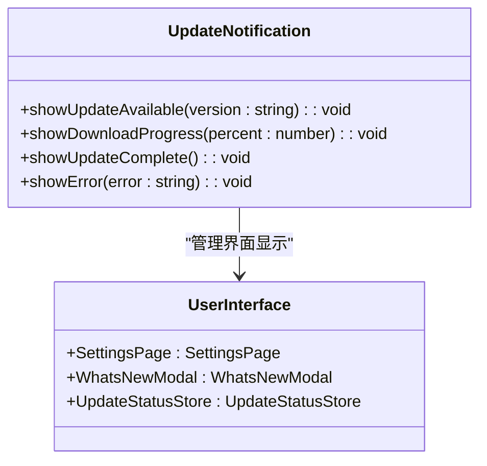

**图表来源**
- [src/pages/SettingsPage.tsx:2684-2708](file://src/pages/SettingsPage.tsx#L2684-L2708)
- [src/components/WhatsNewModal.tsx:1-88](file://src/components/WhatsNewModal.tsx#L1-L88)

#### 静默更新与强制更新

系统支持不同的更新模式：

**章节来源**
- [src/pages/SettingsPage.tsx:2684-2708](file://src/pages/SettingsPage.tsx#L2684-L2708)
- [src/components/WhatsNewModal.tsx:1-88](file://src/components/WhatsNewModal.tsx#L1-L88)

### 更新配置管理

#### 更新通道控制

系统提供灵活的更新通道配置：

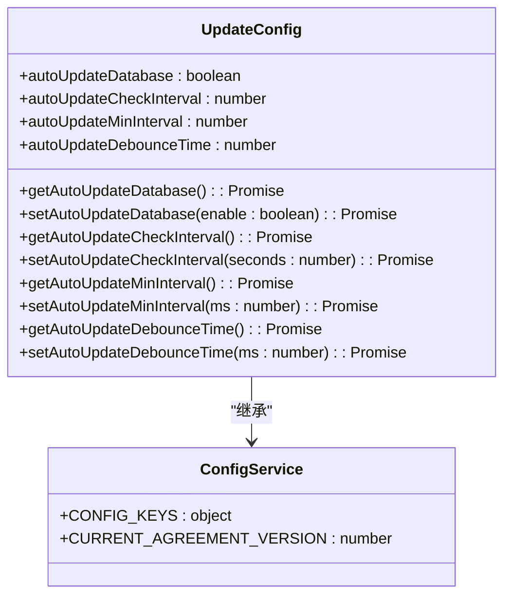

**图表来源**
- [src/services/config.ts:23-87](file://src/services/config.ts#L23-L87)

#### 频率控制与地区限制

系统支持更新频率和区域限制配置：

**章节来源**
- [src/services/config.ts:23-87](file://src/services/config.ts#L23-L87)

### 更新监控

#### 成功率统计

系统提供全面的更新监控功能：

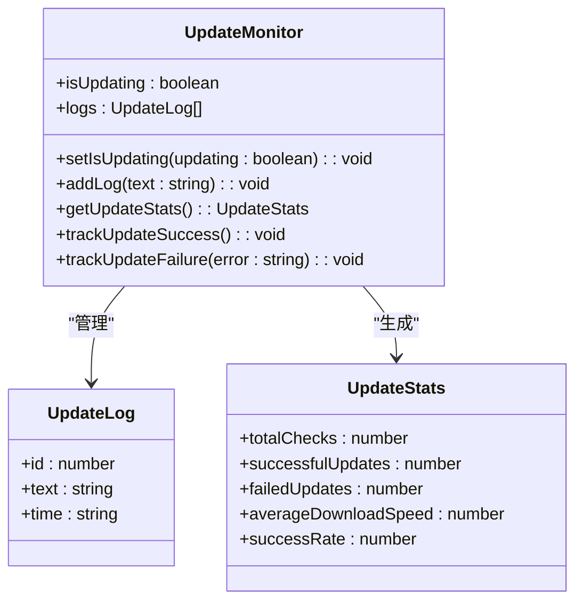

**图表来源**
- [src/stores/updateStatusStore.ts:1-27](file://src/stores/updateStatusStore.ts#L1-L27)

#### 错误分析与性能指标

系统收集详细的更新性能数据：

**章节来源**
- [src/stores/updateStatusStore.ts:1-27](file://src/stores/updateStatusStore.ts#L1-L27)

## 依赖关系分析

自动更新机制的依赖关系如下：

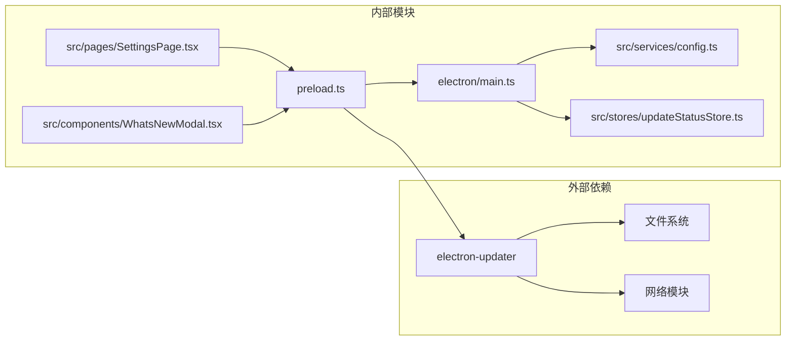

**图表来源**
- [electron/preload.ts:1-100](file://electron/preload.ts#L1-L100)
- [electron/main.ts:1-200](file://electron/main.ts#L1-L200)

**章节来源**
- [electron/preload.ts:1-100](file://electron/preload.ts#L1-L100)
- [electron/main.ts:1-200](file://electron/main.ts#L1-L200)

## 性能考虑

### 更新效率优化

系统通过以下方式优化更新性能：
- **并发下载**: 支持多文件并发下载
- **断点续传**: 支持网络中断后的续传
- **智能缓存**: 缓存已下载的更新包
- **压缩传输**: 使用高效的压缩算法减少带宽占用

### 资源管理

系统实施严格的资源管理策略：
- **内存优化**: 及时释放不再使用的内存
- **磁盘空间**: 监控磁盘空间使用情况
- **CPU使用**: 限制更新过程中的CPU占用

## 故障排除指南

### 常见问题诊断

#### 更新检查失败

**症状**: 检查更新时出现网络错误
**解决方法**: 
1. 检查网络连接状态
2. 验证代理设置
3. 确认防火墙设置
4. 清除更新缓存

#### 下载中断

**症状**: 下载过程中断
**解决方法**:
1. 检查磁盘空间
2. 关闭杀毒软件干扰
3. 重试下载
4. 检查网络稳定性

#### 安装失败

**症状**: 更新包无法安装
**解决方法**:
1. 重启应用程序
2. 手动删除临时文件
3. 重新下载更新包
4. 检查文件权限

### 日志分析

系统提供详细的日志记录功能，便于问题诊断：

**章节来源**
- [electron/main.ts:1298-1301](file://electron/main.ts#L1298-L1301)

## 结论

CipherTalk 的自动更新机制提供了一个完整、可靠且安全的更新解决方案。通过分层架构设计、完善的错误处理、安全验证和监控功能，系统能够确保用户获得及时、安全的应用更新体验。同时，灵活的配置选项和用户友好的界面设计使得更新过程对用户来说既透明又可控。

该机制的核心优势包括：
- **安全性**: 数字签名验证和 HTTPS 通信
- **可靠性**: 多层错误处理和回滚机制
- **用户体验**: 透明的更新过程和清晰的状态反馈
- **可维护性**: 模块化的架构设计和完善的监控