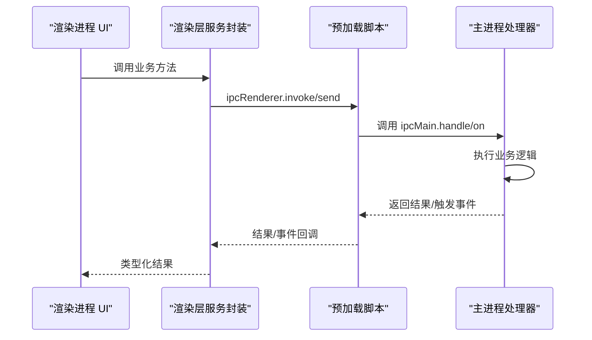
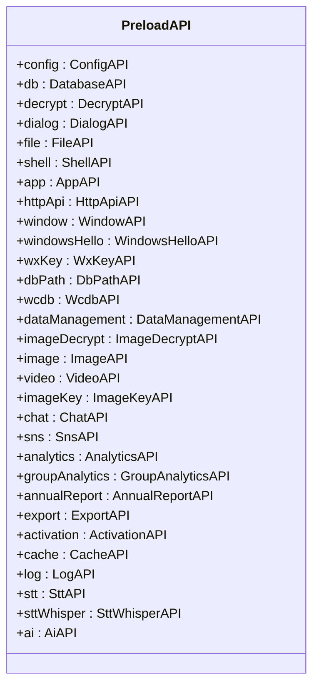
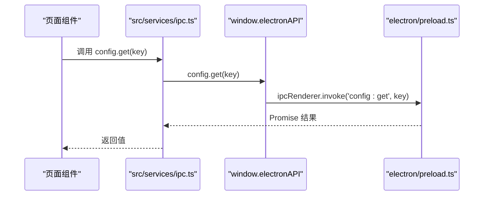
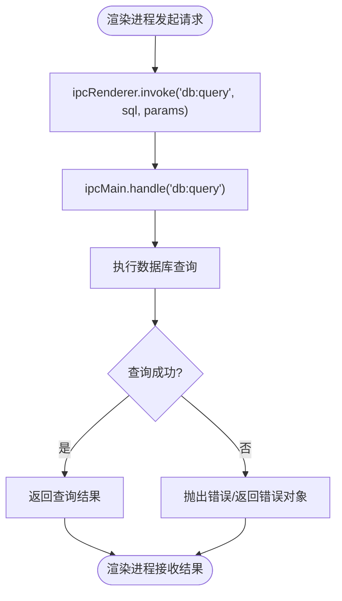
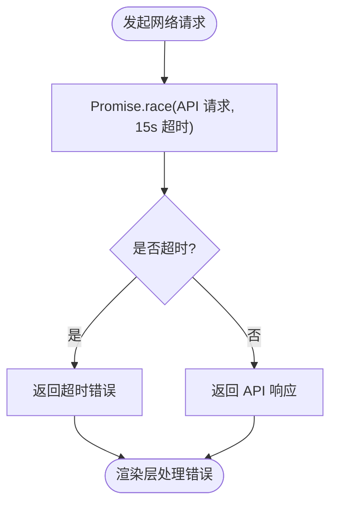
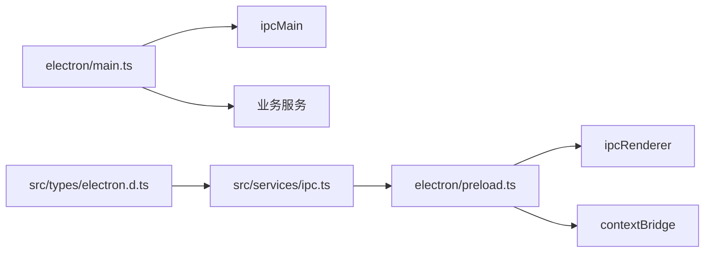

# IPC 通信机制

<cite>
**本文档引用的文件**
- [electron/main.ts](file://electron/main.ts)
- [electron/preload.ts](file://electron/preload.ts)
- [src/services/ipc.ts](file://src/services/ipc.ts)
- [src/types/electron.d.ts](file://src/types/electron.d.ts)
- [electron/services/database.ts](file://electron/services/database.ts)
- [electron/services/chatService.ts](file://electron/services/chatService.ts)
- [electron/services/ai/providers/custom.ts](file://electron/services/ai/providers/custom.ts)
- [electron/services/ai/providers/base.ts](file://electron/services/ai/providers/base.ts)
</cite>

## 目录
1. [简介](#简介)
2. [项目结构](#项目结构)
3. [核心组件](#核心组件)
4. [架构总览](#架构总览)
5. [详细组件分析](#详细组件分析)
6. [依赖关系分析](#依赖关系分析)
7. [性能考虑](#性能考虑)
8. [故障排除指南](#故障排除指南)
9. [结论](#结论)

## 简介
本文件系统性阐述 CipherTalk 项目中的 IPC（进程间通信）机制，重点覆盖以下方面：
- Electron 主进程与渲染进程的通信模式：ipcMain 和 ipcRenderer 的使用方式
- 预加载脚本的作用：contextBridge API 的安全封装、API 暴露策略、安全隔离机制
- 消息传递协议：请求-响应模式、事件广播、异步通信
- 数据序列化与反序列化：支持的数据类型、性能优化、内存管理
- 错误处理机制：通信失败的处理、超时机制、重连策略
- IPC 通信流程图与消息传递示例，展示典型的数据交换场景

## 项目结构
CipherTalk 的 IPC 架构围绕三个关键层构建：
- 预加载层（Preload）：通过 contextBridge 安全地向渲染进程暴露有限的 API
- 渲染层（Renderer）：通过封装的服务模块调用预加载层暴露的方法
- 主进程层（Main）：通过 ipcMain 注册处理器，执行实际业务逻辑

```mermaid
graph TB
subgraph "渲染进程"
RUI["React 组件<br/>src/pages/*"]
RSvc["服务封装<br/>src/services/ipc.ts"]
Preload["预加载脚本<br/>electron/preload.ts"]
end
subgraph "主进程"
Main["主进程入口<br/>electron/main.ts"]
Handlers["IPC 处理器注册<br/>registerIpcHandlers()"]
Services["业务服务<br/>electron/services/*"]
end
RUI --> RSvc --> Preload
Preload <- --> Main
Main --> Handlers --> Services
```

**图表来源**
- [electron/preload.ts:1-454](file://electron/preload.ts#L1-L454)
- [src/services/ipc.ts:1-38](file://src/services/ipc.ts#L1-L38)
- [electron/main.ts:1130-1500](file://electron/main.ts#L1130-L1500)

**章节来源**
- [electron/preload.ts:1-454](file://electron/preload.ts#L1-L454)
- [src/services/ipc.ts:1-38](file://src/services/ipc.ts#L1-L38)
- [electron/main.ts:1130-1500](file://electron/main.ts#L1130-L1500)

## 核心组件
- 预加载脚本（electron/preload.ts）
  - 使用 contextBridge.exposeInMainWorld 暴露受控 API 给渲染进程
  - 将 ipcRenderer.invoke/send 包装为语义化方法，统一参数与返回值约定
  - 提供事件监听器的注册与移除，确保生命周期管理
- 渲染层服务封装（src/services/ipc.ts）
  - 对预加载层 API 进一步封装，提供类型安全的调用接口
  - 保持渲染层与主进程实现的解耦
- 主进程处理器（electron/main.ts）
  - 在 registerIpcHandlers 函数中集中注册 ipcMain.handle/on
  - 执行具体业务逻辑（数据库、文件、窗口、AI 等）
  - 通过 BrowserWindow.webContents.send 实现事件广播

**章节来源**
- [electron/preload.ts:1-454](file://electron/preload.ts#L1-L454)
- [src/services/ipc.ts:1-38](file://src/services/ipc.ts#L1-L38)
- [electron/main.ts:1130-1500](file://electron/main.ts#L1130-L1500)

## 架构总览
IPC 通信遵循“预加载桥接 + 类型声明 + 主进程处理器”的三层架构，确保：
- 安全性：仅暴露必要的 API，避免直接访问 Node.js 与 Electron 丰富 API
- 可维护性：统一的调用约定与错误处理
- 可扩展性：新增功能只需在主进程注册处理器并在预加载层暴露



**图表来源**
- [src/services/ipc.ts:1-38](file://src/services/ipc.ts#L1-L38)
- [electron/preload.ts:1-454](file://electron/preload.ts#L1-L454)
- [electron/main.ts:1130-1500](file://electron/main.ts#L1130-L1500)

## 详细组件分析

### 预加载脚本与 contextBridge 安全封装
- API 暴露策略
  - 通过 contextBridge.exposeInMainWorld('electronAPI', {...}) 将 API 暴露到 window.electronAPI
  - 将 ipcRenderer.invoke 与 ipcRenderer.send 统一封装为语义化方法
  - 对事件监听器提供返回的移除函数，便于组件卸载时清理
- 安全隔离机制
  - 预加载脚本启用 contextIsolation: true，禁用 nodeIntegration，限制渲染进程访问 Node.js API
  - 仅暴露经过审查的 API，降低 XSS 与权限滥用风险
- 事件监听与清理
  - 对于需要持续监听的事件（如聊天新消息、下载进度等），提供注册与移除方法
  - 保证组件销毁时主动移除监听，避免内存泄漏



**图表来源**
- [electron/preload.ts:4-435](file://electron/preload.ts#L4-L435)

**章节来源**
- [electron/preload.ts:1-454](file://electron/preload.ts#L1-L454)

### 渲染层服务封装与类型声明
- 服务封装（src/services/ipc.ts）
  - 将 window.electronAPI 的调用进一步封装为业务服务，提升可读性与复用性
  - 保持与预加载层 API 的一一对应关系
- 类型声明（src/types/electron.d.ts）
  - 为 window.electronAPI 提供完整的 TypeScript 接口定义
  - 明确每个方法的输入输出类型，便于 IDE 提示与编译期校验



**图表来源**
- [src/services/ipc.ts:4-7](file://src/services/ipc.ts#L4-L7)
- [src/types/electron.d.ts:47-52](file://src/types/electron.d.ts#L47-L52)
- [electron/preload.ts:7-8](file://electron/preload.ts#L7-L8)

**章节来源**
- [src/services/ipc.ts:1-38](file://src/services/ipc.ts#L1-L38)
- [src/types/electron.d.ts:15-52](file://src/types/electron.d.ts#L15-L52)

### 主进程处理器与消息协议
- 请求-响应模式（invoke）
  - 使用 ipcMain.handle 注册处理器，渲染进程通过 ipcRenderer.invoke 发起请求
  - 主进程执行业务逻辑后返回 Promise 结果，适合查询、操作类请求
- 事件广播（send/on）
  - 使用 ipcMain.on 注册事件监听，通过 BrowserWindow.webContents.send 广播事件
  - 适用于实时推送（如新消息、下载进度、状态变更）
- 窗口控制与跨窗口通信
  - 通过 send/on 实现窗口间事件传递（如 moments:filterUser）
  - 通过 handle 实现窗口创建与管理的请求-响应



**图表来源**
- [electron/main.ts:1190-1193](file://electron/main.ts#L1190-L1193)
- [electron/preload.ts:15-16](file://electron/preload.ts#L15-L16)

**章节来源**
- [electron/main.ts:1130-1500](file://electron/main.ts#L1130-L1500)
- [electron/main.ts:1210-1217](file://electron/main.ts#L1210-L1217)

### 数据序列化与反序列化
- 支持的数据类型
  - 基本类型：字符串、数字、布尔值
  - 复合类型：对象、数组（需满足可序列化要求）
  - 特殊类型：Buffer（用于二进制数据，如图片、视频）
- 性能优化
  - 对大对象采用分批传输或流式处理（如视频下载进度）
  - 避免在 IPC 中传输大型 DOM 或复杂嵌套对象
- 内存管理
  - 事件监听器在组件卸载时及时移除
  - 大量数据传输后及时释放临时缓冲区

**章节来源**
- [electron/main.ts:1877-1887](file://electron/main.ts#L1877-L1887)
- [electron/preload.ts:392-393](file://electron/preload.ts#L392-L393)

### 错误处理与超时机制
- 通信失败处理
  - 主进程处理器捕获异常并返回结构化错误对象
  - 渲染层根据返回值进行 UI 提示与状态更新
- 超时机制
  - AI 提供商连接测试使用 Promise.race 与定时器实现 15 秒超时
  - 网络错误分类（连接拒绝、超时、域名解析失败等）并给出友好提示
- 重连策略
  - 对于网络不稳定场景，建议在渲染层实现指数退避重试
  - 对于长耗时任务（如下载、解密），通过事件流汇报进度，避免 UI 阻塞



**图表来源**
- [electron/services/ai/providers/custom.ts:55-64](file://electron/services/ai/providers/custom.ts#L55-L64)
- [electron/services/ai/providers/base.ts:182-190](file://electron/services/ai/providers/base.ts#L182-L190)

**章节来源**
- [electron/services/ai/providers/custom.ts:51-116](file://electron/services/ai/providers/custom.ts#L51-L116)
- [electron/services/ai/providers/base.ts:177-240](file://electron/services/ai/providers/base.ts#L177-L240)

### 典型消息传递示例
- 数据库查询（请求-响应）
  - 渲染层：调用 db.query(sql, params)
  - 预加载层：ipcRenderer.invoke('db:query', sql, params)
  - 主进程：ipcMain.handle('db:query') 执行查询并返回结果
- 新消息推送（事件广播）
  - 主进程：chatService.on('new-messages') 广播到所有窗口
  - 预加载层：ipcRenderer.on('chat:new-messages', callback)
  - 渲染层：订阅回调并更新状态
- 窗口控制（请求-响应 + 事件）
  - 渲染层：window.openChatWindow()
  - 预加载层：ipcRenderer.invoke('window:openChatWindow')
  - 主进程：ipcMain.handle('window:openChatWindow') 创建窗口
  - 主进程：窗口加载完成后发送 'imageViewer:setImageList' 事件

**章节来源**
- [electron/main.ts:1210-1217](file://electron/main.ts#L1210-L1217)
- [electron/main.ts:1380-1403](file://electron/main.ts#L1380-L1403)
- [electron/preload.ts:78-81](file://electron/preload.ts#L78-L81)

## 依赖关系分析
- 预加载层依赖
  - 依赖 ipcRenderer 进行消息收发
  - 依赖 contextBridge 进行安全暴露
- 主进程依赖
  - 依赖 ipcMain 注册处理器
  - 依赖各业务服务（database、chat、ai 等）执行具体逻辑
- 渲染层依赖
  - 依赖预加载层提供的 window.electronAPI
  - 依赖类型声明文件确保类型安全



**图表来源**
- [electron/preload.ts:1](file://electron/preload.ts#L1)
- [electron/main.ts:1130](file://electron/main.ts#L1130)
- [src/services/ipc.ts:1](file://src/services/ipc.ts#L1)
- [src/types/electron.d.ts:15](file://src/types/electron.d.ts#L15)

**章节来源**
- [electron/preload.ts:1-454](file://electron/preload.ts#L1-L454)
- [electron/main.ts:1130-1500](file://electron/main.ts#L1130-L1500)
- [src/services/ipc.ts:1-38](file://src/services/ipc.ts#L1-L38)
- [src/types/electron.d.ts:15-52](file://src/types/electron.d.ts#L15-L52)

## 性能考虑
- 事件驱动的增量更新：通过事件广播减少轮询开销
- 分批传输与进度上报：对大文件与长任务采用事件流汇报进度
- 缓存与预热：数据库连接、会话列表等关键数据建立缓存，缩短响应时间
- 资源释放：组件卸载时及时移除事件监听，避免内存泄漏

## 故障排除指南
- 通信失败
  - 检查主进程处理器是否正确注册（registerIpcHandlers）
  - 确认预加载层是否正确暴露对应 API
  - 查看渲染层调用是否符合类型声明
- 超时问题
  - AI 提供商连接测试默认 15 秒超时，检查网络与代理配置
  - 对外部 API 调用增加重试与降级策略
- 事件未触发
  - 确认事件监听器是否在组件挂载时注册
  - 确认组件卸载时是否正确移除监听
- 数据异常
  - 检查序列化对象是否包含不可序列化字段
  - 对大对象采用分批传输或流式处理

**章节来源**
- [electron/services/ai/providers/custom.ts:51-116](file://electron/services/ai/providers/custom.ts#L51-L116)
- [electron/services/ai/providers/base.ts:177-240](file://electron/services/ai/providers/base.ts#L177-L240)

## 结论
CipherTalk 的 IPC 机制通过预加载脚本的安全封装、清晰的类型声明与主进程处理器的集中管理，实现了高效、安全、可维护的跨进程通信。结合事件驱动的增量更新与完善的错误处理机制，能够满足复杂业务场景下的数据交换需求。建议在后续开发中持续优化大对象传输与事件清理，进一步提升系统性能与稳定性。