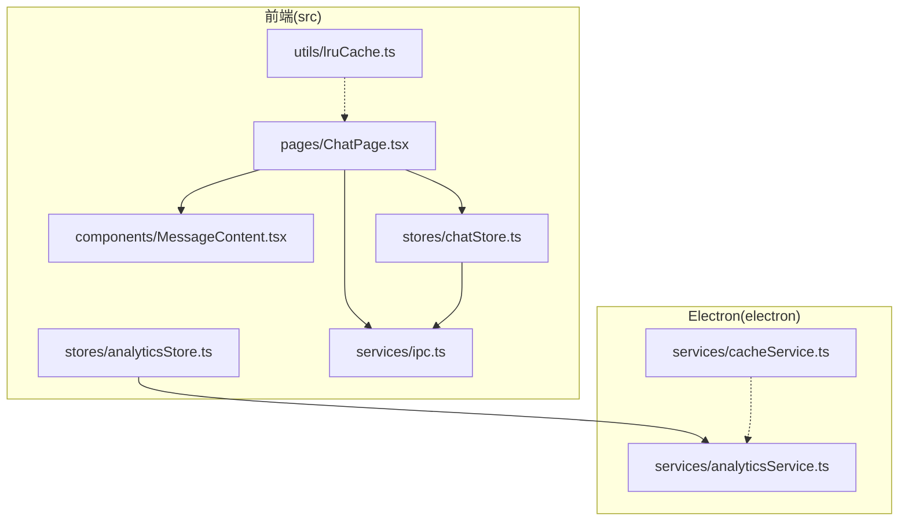
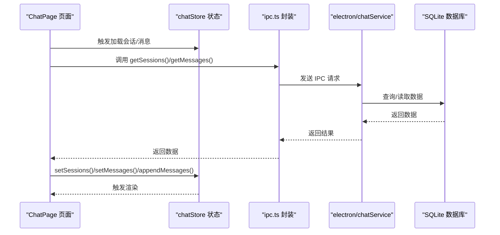
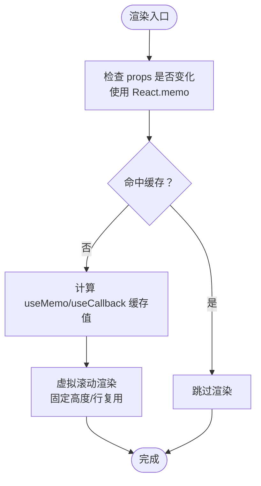
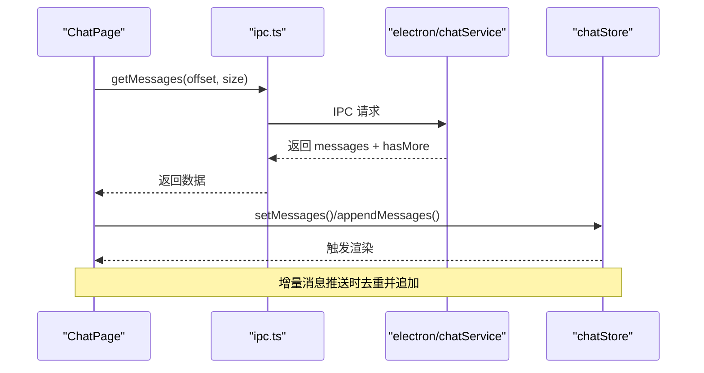
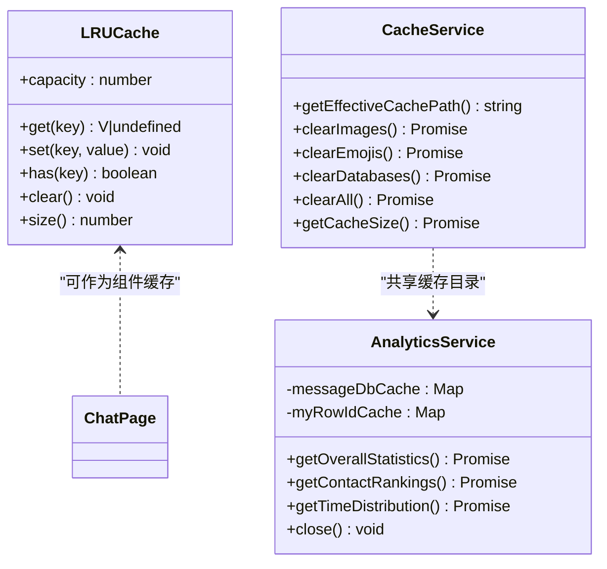
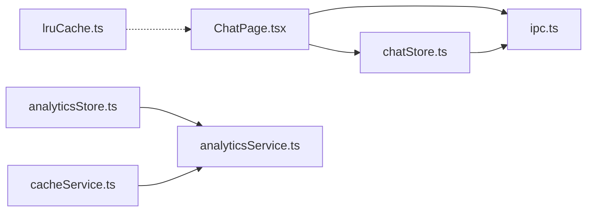
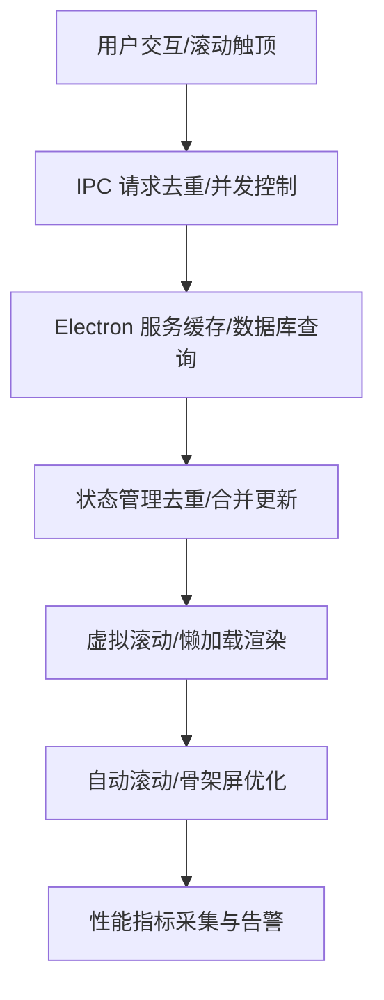

# 前端性能优化

<cite>
**本文引用的文件**
- [lruCache.ts](file://src/utils/lruCache.ts)
- [chatStore.ts](file://src/stores/chatStore.ts)
- [analyticsStore.ts](file://src/stores/analyticsStore.ts)
- [cacheService.ts](file://electron/services/cacheService.ts)
- [analyticsService.ts](file://electron/services/analyticsService.ts)
- [MessageContent.tsx](file://src/components/MessageContent.tsx)
- [ChatPage.tsx](file://src/pages/ChatPage.tsx)
- [ipc.ts](file://src/services/ipc.ts)
- [vite.config.ts](file://vite.config.ts)
- [appStore.ts](file://src/stores/appStore.ts)
</cite>

## 目录
1. [简介](#简介)
2. [项目结构](#项目结构)
3. [核心组件](#核心组件)
4. [架构总览](#架构总览)
5. [详细组件分析](#详细组件分析)
6. [依赖关系分析](#依赖关系分析)
7. [性能考量](#性能考量)
8. [故障排查指南](#故障排查指南)
9. [结论](#结论)
10. [附录](#附录)

## 简介
本文件面向 CipherTalk 前端，系统性梳理并提出性能优化策略，覆盖组件渲染优化（React.memo 使用、useMemo/useCallback 优化、虚拟滚动）、数据加载优化（懒加载策略、分页加载、增量更新机制）、缓存策略设计（LRU 缓存实现、本地存储优化、内存管理）、网络请求优化（请求去重、并发控制、错误重试机制），以及性能监控方案（性能指标收集、性能瓶颈分析、用户体验监控）。同时提供性能优化策略图与数据流优化图，帮助从数据获取到渲染的全链路提升体验。

## 项目结构
- 前端核心位于 src 目录，包含页面、组件、状态管理、工具与服务层。
- Electron 后端服务位于 electron 目录，负责数据库、缓存、分析等能力。
- 构建配置位于 vite.config.ts，采用 Vite + React + Electron 插件组合。

图表来源
- [ChatPage.tsx:1-800](file://src/pages/ChatPage.tsx#L1-L800)
- [MessageContent.tsx:1-103](file://src/components/MessageContent.tsx#L1-L103)
- [chatStore.ts:1-146](file://src/stores/chatStore.ts#L1-L146)
- [analyticsStore.ts:1-71](file://src/stores/analyticsStore.ts#L1-L71)
- [lruCache.ts:1-51](file://src/utils/lruCache.ts#L1-L51)
- [ipc.ts:1-38](file://src/services/ipc.ts#L1-L38)
- [cacheService.ts:1-486](file://electron/services/cacheService.ts#L1-L486)
- [analyticsService.ts:1-759](file://electron/services/analyticsService.ts#L1-L759)

章节来源
- [vite.config.ts:1-78](file://vite.config.ts#L1-L78)

## 核心组件
- ChatPage 页面：负责会话列表与消息列表的渲染、懒加载、分页加载、日期跳转、滚动控制、增量消息监听与自动滚动策略。
- MessageContent 组件：负责文本换行、链接识别、表情解析的高效渲染。
- chatStore 状态：集中管理会话、消息、联系人、搜索、同步版本号等，支持去重与智能合并更新。
- analyticsStore 状态：承载分析统计、排行榜、时间分布等数据与缓存标记。
- LRU 缓存：通用的最近最少使用缓存，限制内存占用。
- cacheService：Electron 层的缓存路径管理、清理与统计。
- analyticsService：跨数据库聚合统计、缓存数据库连接与 rowid，减少重复 IO。
- ipc 服务：统一的 Electron IPC 封装，便于后续并发控制与去重。

章节来源
- [ChatPage.tsx:1-800](file://src/pages/ChatPage.tsx#L1-L800)
- [MessageContent.tsx:1-103](file://src/components/MessageContent.tsx#L1-L103)
- [chatStore.ts:1-146](file://src/stores/chatStore.ts#L1-L146)
- [analyticsStore.ts:1-71](file://src/stores/analyticsStore.ts#L1-L71)
- [lruCache.ts:1-51](file://src/utils/lruCache.ts#L1-L51)
- [cacheService.ts:1-486](file://electron/services/cacheService.ts#L1-L486)
- [analyticsService.ts:1-759](file://electron/services/analyticsService.ts#L1-L759)
- [ipc.ts:1-38](file://src/services/ipc.ts#L1-L38)

## 架构总览
下图展示从前端页面到状态管理、IPC 通信，再到 Electron 服务与数据库的完整链路，体现数据流与性能优化点：

图表来源
- [ChatPage.tsx:396-540](file://src/pages/ChatPage.tsx#L396-L540)
- [ipc.ts:1-38](file://src/services/ipc.ts#L1-L38)
- [chatStore.ts:71-110](file://src/stores/chatStore.ts#L71-L110)

## 详细组件分析

### 组件渲染优化
- React.memo 使用建议
  - 会话列表行组件已具备稳定 props 结构，建议在外部包裹 React.memo，避免无关重渲染。
  - 会话头像组件具备懒加载与骨架屏逻辑，建议进一步使用 React.memo 保护内部渲染。
- useMemo/useCallback 优化
  - ChatPage 中的 handleScroll、loadMoreMessagesInDateJumpMode、handleRefreshMessages 等回调已使用 useCallback，建议对依赖数组进行精细化收敛，避免不必要的重建。
  - 会话列表的排序/过滤逻辑可使用 useMemo 缓存中间结果，减少重复计算。
- 虚拟滚动实现
  - 已引入 react-window 的 List 组件，建议：
    - 固定行高或使用 auto-sizer，避免每次渲染测量高度。
    - 使用 WindowScroller 或固定高度容器，减少 DOM 节点数量。
    - 行组件内仅渲染必要节点，避免深层嵌套与复杂计算。

图表来源
- [ChatPage.tsx:168-208](file://src/pages/ChatPage.tsx#L168-L208)
- [MessageContent.tsx:70-100](file://src/components/MessageContent.tsx#L70-L100)

章节来源
- [ChatPage.tsx:168-208](file://src/pages/ChatPage.tsx#L168-L208)
- [MessageContent.tsx:70-100](file://src/components/MessageContent.tsx#L70-L100)

### 数据加载优化
- 懒加载策略
  - 会话头像组件使用 IntersectionObserver 实现懒加载，提前 50px 触发，配合骨架屏与超时兜底，显著降低首屏压力。
- 分页加载
  - 首次加载与“加载更多”分别处理，滚动到阈值（约 30%）触发分页，保持历史消息位置稳定。
  - 日期跳转模式通过游标（sortSeq/createTime/localId）精确加载更早消息，避免重复与越界。
- 增量更新机制
  - 通过监听后端推送的新消息，基于多维键去重，仅追加新增消息，并在用户靠近底部时自动滚动。
  - chatStore 的 appendMessages 与 setMessages 内部均执行去重，避免 UI 抖动与重复渲染。

图表来源
- [ChatPage.tsx:476-540](file://src/pages/ChatPage.tsx#L476-L540)
- [chatStore.ts:89-110](file://src/stores/chatStore.ts#L89-L110)

章节来源
- [ChatPage.tsx:476-540](file://src/pages/ChatPage.tsx#L476-L540)
- [chatStore.ts:89-110](file://src/stores/chatStore.ts#L89-L110)

### 缓存策略设计
- LRU 缓存实现
  - 提供通用的 Map 实现的 LRU，支持 get/set/has/clear/size，适合缓存热点数据（如表情映射、解析结果）。
- 本地存储优化
  - Electron cacheService 负责图片/表情/日志/数据库缓存的路径管理、清理与统计，支持多路径兼容与安全删除。
- 内存管理
  - analyticsService 对数据库连接与 rowid 查询结果进行缓存，避免重复打开/查询；退出时主动 close 并清空缓存，防止资源泄露。

图表来源
- [lruCache.ts:1-51](file://src/utils/lruCache.ts#L1-L51)
- [cacheService.ts:1-486](file://electron/services/cacheService.ts#L1-L486)
- [analyticsService.ts:1-759](file://electron/services/analyticsService.ts#L1-L759)

章节来源
- [lruCache.ts:1-51](file://src/utils/lruCache.ts#L1-L51)
- [cacheService.ts:1-486](file://electron/services/cacheService.ts#L1-L486)
- [analyticsService.ts:1-759](file://electron/services/analyticsService.ts#L1-L759)

### 网络请求优化
- 请求去重
  - 增量消息与分页加载均使用多维键去重，避免重复渲染与重复请求。
- 并发控制
  - 建议在 ipc.ts 层引入请求队列/去重标识，避免短时间内多次相同请求堆积。
- 错误重试机制
  - 对于连接失败与加载异常，建议在 ChatPage 中增加指数退避重试与用户提示，避免无限重试导致卡顿。

章节来源
- [ChatPage.tsx:542-585](file://src/pages/ChatPage.tsx#L542-L585)
- [chatStore.ts:89-110](file://src/stores/chatStore.ts#L89-L110)
- [ipc.ts:1-38](file://src/services/ipc.ts#L1-L38)

### 性能监控方案
- 性能指标收集
  - 记录首屏渲染耗时、消息列表滚动帧率、图片懒加载命中率、IPC 请求耗时、数据库查询耗时。
- 性能瓶颈分析
  - 使用浏览器性能面板定位长任务、布局抖动、重绘重排；结合 Electron 主进程日志分析数据库 IO。
- 用户体验监控
  - 监控“自动滚动打断概率”“加载更多触发频率”“骨架屏停留时长”等指标，持续优化交互体验。

## 依赖关系分析
- 前端页面依赖状态管理与 IPC 服务，状态管理依赖后端服务返回的数据。
- Electron 服务之间存在共享缓存目录与数据库连接，需注意并发访问与资源释放。

图表来源
- [ChatPage.tsx:1-800](file://src/pages/ChatPage.tsx#L1-L800)
- [chatStore.ts:1-146](file://src/stores/chatStore.ts#L1-L146)
- [analyticsStore.ts:1-71](file://src/stores/analyticsStore.ts#L1-L71)
- [lruCache.ts:1-51](file://src/utils/lruCache.ts#L1-L51)
- [ipc.ts:1-38](file://src/services/ipc.ts#L1-L38)
- [cacheService.ts:1-486](file://electron/services/cacheService.ts#L1-L486)
- [analyticsService.ts:1-759](file://electron/services/analyticsService.ts#L1-L759)

章节来源
- [ChatPage.tsx:1-800](file://src/pages/ChatPage.tsx#L1-L800)
- [chatStore.ts:1-146](file://src/stores/chatStore.ts#L1-L146)
- [analyticsStore.ts:1-71](file://src/stores/analyticsStore.ts#L1-L71)
- [lruCache.ts:1-51](file://src/utils/lruCache.ts#L1-L51)
- [ipc.ts:1-38](file://src/services/ipc.ts#L1-L38)
- [cacheService.ts:1-486](file://electron/services/cacheService.ts#L1-L486)
- [analyticsService.ts:1-759](file://electron/services/analyticsService.ts#L1-L759)

## 性能考量
- 渲染层面
  - 使用虚拟滚动与 React.memo，减少节点数量与重渲染。
  - 文本渲染组件尽量避免深层嵌套与复杂正则，必要时使用 useMemo 缓存中间结果。
- 数据加载层面
  - 懒加载与骨架屏配合，降低首屏阻塞；分页阈值与游标控制保证加载连续性。
  - 增量更新与去重策略减少无效渲染与重复请求。
- 缓存与内存层面
  - LRU 缓存限制热点数据规模；数据库连接与 rowid 缓存需及时释放。
  - Electron 缓存清理与统计接口可用于定期维护磁盘空间。
- 构建与运行层面
  - Vite 已启用 React 插件与 Electron 插件，建议开启生产构建优化与代码分割。

章节来源
- [ChatPage.tsx:1-800](file://src/pages/ChatPage.tsx#L1-L800)
- [MessageContent.tsx:1-103](file://src/components/MessageContent.tsx#L1-L103)
- [lruCache.ts:1-51](file://src/utils/lruCache.ts#L1-L51)
- [cacheService.ts:1-486](file://electron/services/cacheService.ts#L1-L486)
- [analyticsService.ts:1-759](file://electron/services/analyticsService.ts#L1-L759)
- [vite.config.ts:1-78](file://vite.config.ts#L1-L78)

## 故障排查指南
- 图片懒加载问题
  - 检查 IntersectionObserver 配置与容器尺寸；确认骨架屏与超时逻辑生效。
- 消息重复与去重失效
  - 核对多维键生成规则与去重集合更新时机；确保 appendMessages 与 setMessages 的去重逻辑一致。
- IPC 请求堆积
  - 在 ipc.ts 层引入请求去重与队列控制，避免并发重复请求。
- 数据库连接与缓存
  - analyticsService 退出时调用 close 清理缓存；cacheService 清理数据库缓存前断开相关连接。

章节来源
- [ChatPage.tsx:476-540](file://src/pages/ChatPage.tsx#L476-L540)
- [chatStore.ts:89-110](file://src/stores/chatStore.ts#L89-L110)
- [ipc.ts:1-38](file://src/services/ipc.ts#L1-L38)
- [analyticsService.ts:745-755](file://electron/services/analyticsService.ts#L745-L755)
- [cacheService.ts:112-191](file://electron/services/cacheService.ts#L112-L191)

## 结论
通过组件渲染优化、数据加载优化、缓存与内存管理、网络请求优化与性能监控的协同，CipherTalk 前端可在海量消息场景下保持流畅体验。建议在现有基础上进一步细化 useMemo/useCallback 的依赖收敛、引入 IPC 请求去重与并发控制、完善性能指标采集与告警，持续迭代优化。

## 附录
- 性能优化策略图（从数据获取到渲染的完整路径）

图表来源
- [ChatPage.tsx:703-723](file://src/pages/ChatPage.tsx#L703-L723)
- [ipc.ts:1-38](file://src/services/ipc.ts#L1-L38)
- [chatStore.ts:89-110](file://src/stores/chatStore.ts#L89-L110)
- [analyticsService.ts:1-759](file://electron/services/analyticsService.ts#L1-L759)