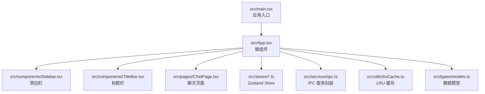
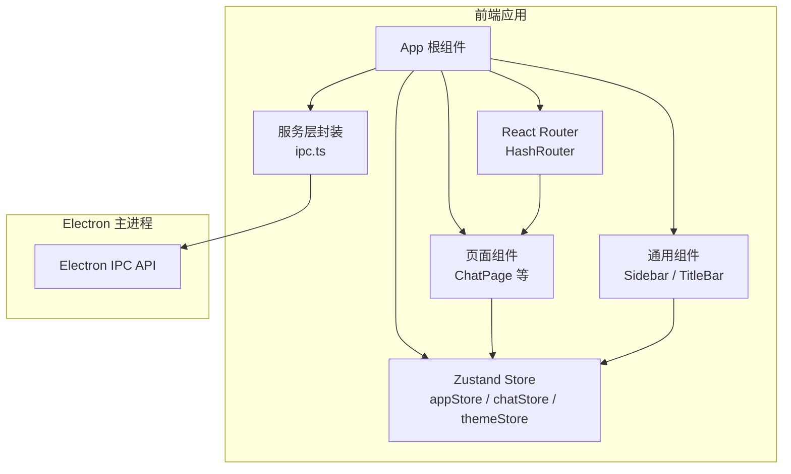
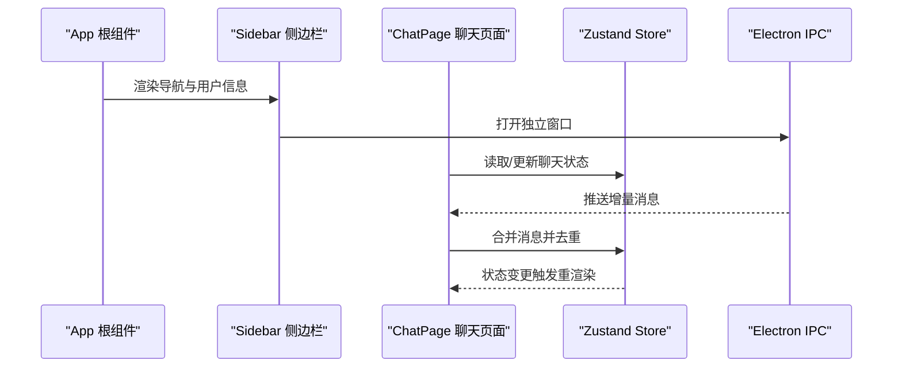
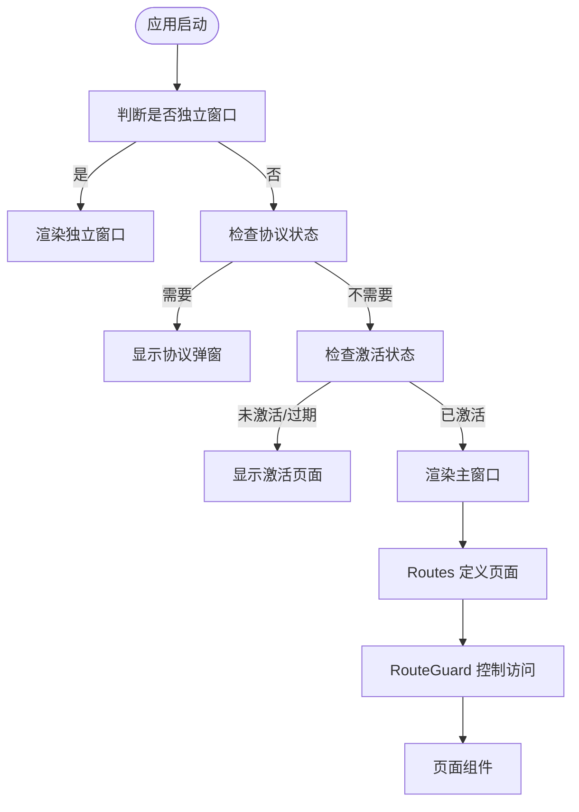
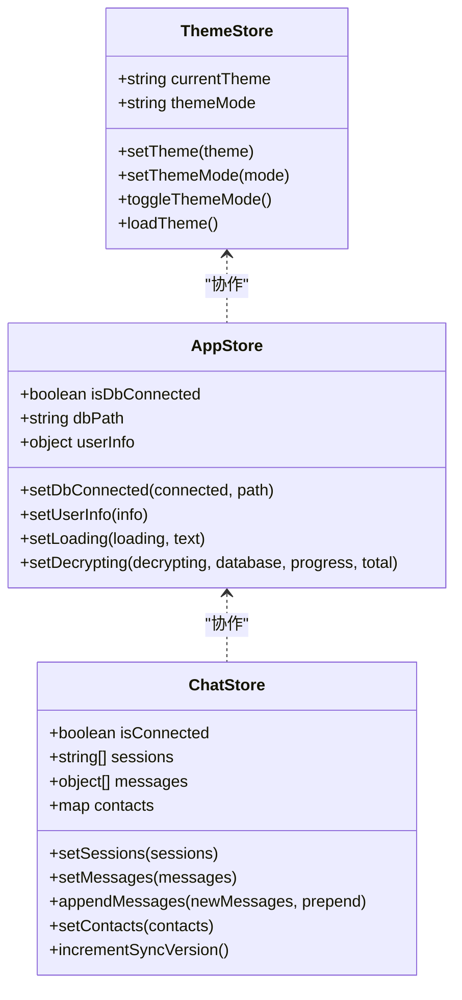
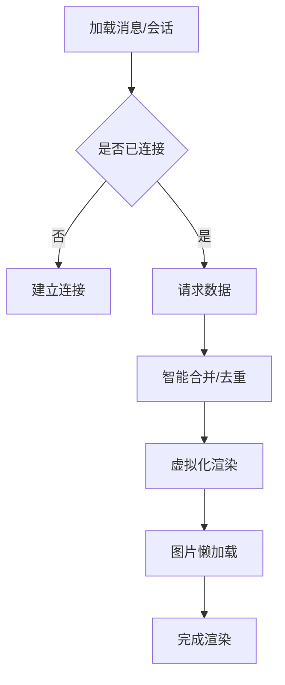
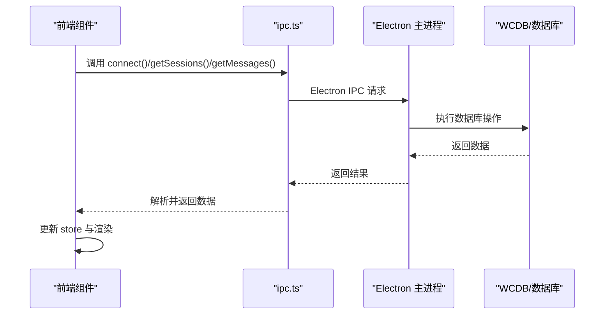
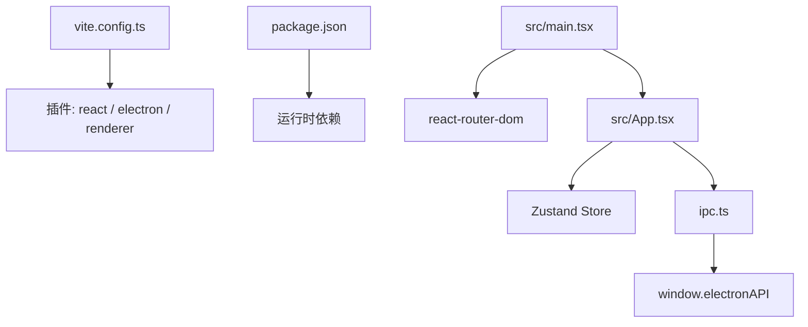

# 前端架构设计

<cite>
**本文档引用的文件**
- [src/main.tsx](file://src/main.tsx)
- [src/App.tsx](file://src/App.tsx)
- [vite.config.ts](file://vite.config.ts)
- [package.json](file://package.json)
- [src/components/Sidebar.tsx](file://src/components/Sidebar.tsx)
- [src/components/TitleBar.tsx](file://src/components/TitleBar.tsx)
- [src/pages/ChatPage.tsx](file://src/pages/ChatPage.tsx)
- [src/stores/appStore.ts](file://src/stores/appStore.ts)
- [src/stores/chatStore.ts](file://src/stores/chatStore.ts)
- [src/stores/themeStore.ts](file://src/stores/themeStore.ts)
- [src/services/ipc.ts](file://src/services/ipc.ts)
- [src/utils/lruCache.ts](file://src/utils/lruCache.ts)
- [src/types/models.ts](file://src/types/models.ts)
- [README.md](file://README.md)
</cite>

## 目录
1. [引言](#引言)
2. [项目结构](#项目结构)
3. [核心组件](#核心组件)
4. [架构总览](#架构总览)
5. [详细组件分析](#详细组件分析)
6. [依赖关系分析](#依赖关系分析)
7. [性能考虑](#性能考虑)
8. [故障排除指南](#故障排除指南)
9. [结论](#结论)

## 引言
本文件面向 CipherTalk 前端架构设计，围绕 React 架构模式、路由系统、状态管理策略、组件库设计、性能优化以及从前端到后端的服务调用链路进行全面阐述。项目采用 React 19 + TypeScript + Zustand + Electron 的技术栈组合，结合 Vite 构建工具与 SCSS 样式体系，形成现代化的桌面应用前端架构。

## 项目结构
前端代码位于 src 目录，主要分为以下层次：
- 入口与根组件：src/main.tsx、src/App.tsx
- 页面组件：src/pages 下的各页面
- 可复用组件：src/components 下的通用 UI 组件
- 状态管理：src/stores 下的 Zustand store
- 服务层：src/services 封装 IPC 通信
- 工具与类型：src/utils、src/types
- 样式：src/styles 与各组件 SCSS 文件

**图表来源**
- [src/main.tsx:1-14](file://src/main.tsx#L1-L14)
- [src/App.tsx:1-538](file://src/App.tsx#L1-L538)

**章节来源**
- [src/main.tsx:1-14](file://src/main.tsx#L1-L14)
- [src/App.tsx:1-538](file://src/App.tsx#L1-L538)
- [README.md:132-159](file://README.md#L132-L159)

## 核心组件
- 应用入口与路由：应用通过 HashRouter 包裹，根组件负责主题初始化、协议与激活流程、数据库连接、更新监听与锁屏等全局逻辑。
- 侧边栏组件：提供导航项、用户信息展示、折叠切换与独立窗口打开能力。
- 标题栏组件：承载应用图标、标题与更新状态指示器。
- 聊天页面：核心业务页面，负责会话列表、消息加载、增量更新、搜索过滤、日期跳转、批量操作等。
- 状态管理：Zustand store 提供跨组件共享的状态，包括应用状态、聊天状态、主题状态等。
- 服务层：封装 Electron IPC，统一配置、数据库、解密、对话框、窗口控制等 API。
- 工具与类型：LRU 缓存用于内存控制，类型定义确保数据结构一致性。

**章节来源**
- [src/App.tsx:40-538](file://src/App.tsx#L40-L538)
- [src/components/Sidebar.tsx:1-355](file://src/components/Sidebar.tsx#L1-L355)
- [src/components/TitleBar.tsx:1-52](file://src/components/TitleBar.tsx#L1-L52)
- [src/pages/ChatPage.tsx:1-800](file://src/pages/ChatPage.tsx#L1-L800)
- [src/stores/appStore.ts:1-97](file://src/stores/appStore.ts#L1-L97)
- [src/stores/chatStore.ts:1-146](file://src/stores/chatStore.ts#L1-L146)
- [src/services/ipc.ts:1-38](file://src/services/ipc.ts#L1-L38)
- [src/utils/lruCache.ts:1-51](file://src/utils/lruCache.ts#L1-L51)
- [src/types/models.ts:1-109](file://src/types/models.ts#L1-L109)

## 架构总览
前端采用“根组件集中管理 + 多 store 分治”的架构模式：
- 根组件 App 负责全局状态初始化、协议与激活流程、数据库连接、更新监听、锁屏控制与路由守卫。
- 页面组件通过 hooks 访问 Zustand store，实现局部状态管理。
- 服务层封装 IPC，隔离 Electron 主进程细节，提供统一 API。
- 组件库遵循可复用与可组合原则，通过 props 与 hooks 实现父子与兄弟组件通信。

**图表来源**
- [src/App.tsx:1-538](file://src/App.tsx#L1-L538)
- [src/services/ipc.ts:1-38](file://src/services/ipc.ts#L1-L38)
- [src/stores/appStore.ts:1-97](file://src/stores/appStore.ts#L1-L97)
- [src/stores/chatStore.ts:1-146](file://src/stores/chatStore.ts#L1-L146)

## 详细组件分析

### React 架构模式与组件通信
- 组件化设计原则
  - 函数组件 + Hooks：页面与通用组件均采用函数组件与 Hooks，提升可读性与可测试性。
  - 可复用性：Sidebar、TitleBar 等组件通过 props 注入行为，便于在不同页面复用。
  - 单一职责：每个 store 专注一个领域（应用、聊天、主题），降低耦合。
- 父子组件通信
  - 根组件通过 props 向子组件传递行为（如打开独立窗口），子组件通过回调向上反馈。
  - 页面组件通过 hooks 访问 store，实现状态提升与共享。
- 兄弟组件通信
  - 通过共享 store 实现跨组件状态同步（如聊天页面与标题栏共享更新状态）。
  - 通过服务层 IPC 事件实现跨页面的实时数据推送（如增量消息）。

**图表来源**
- [src/App.tsx:40-538](file://src/App.tsx#L40-L538)
- [src/components/Sidebar.tsx:51-73](file://src/components/Sidebar.tsx#L51-L73)
- [src/pages/ChatPage.tsx:542-585](file://src/pages/ChatPage.tsx#L542-L585)
- [src/stores/chatStore.ts:89-110](file://src/stores/chatStore.ts#L89-L110)

**章节来源**
- [src/components/Sidebar.tsx:37-85](file://src/components/Sidebar.tsx#L37-L85)
- [src/pages/ChatPage.tsx:542-585](file://src/pages/ChatPage.tsx#L542-L585)
- [src/stores/chatStore.ts:89-110](file://src/stores/chatStore.ts#L89-L110)

### 路由系统设计
- 单页应用架构：基于 HashRouter，使用 Hash 模式适配桌面应用部署。
- 页面间导航：Sidebar 通过 NavLink 与独立窗口 API 实现页面跳转与独立窗口打开。
- 路由守卫：RouteGuard 包裹路由，配合协议与激活流程控制访问。
- 独立窗口：App 根据路径判断是否渲染独立窗口（聊天、群聊分析、朋友圈、年度报告、AI 摘要、聊天记录、引导、图片查看、视频播放、协议、浏览器）。

**图表来源**
- [src/App.tsx:184-344](file://src/App.tsx#L184-L344)
- [src/App.tsx:507-520](file://src/App.tsx#L507-L520)
- [src/components/Sidebar.tsx:75-85](file://src/components/Sidebar.tsx#L75-L85)

**章节来源**
- [src/main.tsx:1-14](file://src/main.tsx#L1-L14)
- [src/App.tsx:184-344](file://src/App.tsx#L184-L344)
- [src/App.tsx:507-520](file://src/App.tsx#L507-L520)

### 状态管理策略（Zustand）
- Store 设计模式
  - 应用状态：数据库连接、用户信息、加载与解密进度等。
  - 聊天状态：会话列表、消息集合、联系人缓存、搜索关键字、同步版本等。
  - 主题状态：主题 ID、模式、图标等。
- 状态持久化机制
  - 主题与图标通过 IPC 写入配置，实现跨会话持久化。
  - 应用状态在内存中维护，重启后重新初始化。
- 数据流
  - 组件通过 hooks 访问 store，store 内部通过 set/get 更新状态，驱动 UI 重渲染。

**图表来源**
- [src/stores/appStore.ts:10-95](file://src/stores/appStore.ts#L10-L95)
- [src/stores/chatStore.ts:4-145](file://src/stores/chatStore.ts#L4-L145)
- [src/stores/themeStore.ts:67-140](file://src/stores/themeStore.ts#L67-L140)

**章节来源**
- [src/stores/appStore.ts:10-95](file://src/stores/appStore.ts#L10-L95)
- [src/stores/chatStore.ts:4-145](file://src/stores/chatStore.ts#L4-L145)
- [src/stores/themeStore.ts:67-140](file://src/stores/themeStore.ts#L67-L140)

### 组件库设计与样式系统
- UI 组件抽象与复用
  - Sidebar：统一导航、用户信息与设置入口。
  - TitleBar：标题与更新状态指示器，支持右侧内容注入。
  - 通用组件：如聊天背景、消息内容、日期选择器等，通过 props 与 hooks 实现可配置与可复用。
- 样式系统组织
  - SCSS + CSS 变量：通过 data-theme 与 data-mode 切换主题与模式。
  - Material-UI：使用 @mui/material 组件库，结合自定义样式覆盖。
  - 组件级样式：各组件拥有独立 SCSS 文件，避免样式污染。

**章节来源**
- [src/components/Sidebar.tsx:1-355](file://src/components/Sidebar.tsx#L1-L355)
- [src/components/TitleBar.tsx:1-52](file://src/components/TitleBar.tsx#L1-L52)
- [README.md:202-231](file://README.md#L202-L231)

### 前端性能优化策略
- 懒加载与代码分割
  - Vite 插件 electron 与 renderer 支持模块拆分与按需加载。
  - 图片懒加载：会话头像使用 IntersectionObserver 与 loading 状态，减少初始渲染压力。
- 虚拟化与滚动优化
  - react-window 用于会话列表与消息列表的虚拟化渲染，显著降低 DOM 数量。
- 缓存机制
  - LRU 缓存：限制内存中缓存对象数量，防止内存泄漏。
  - 消息去重：基于多维键（serverId + localId + createTime + sortSeq）去重，避免重复渲染。
- 状态与渲染优化
  - 智能合并更新：会话列表合并新旧数据，仅更新变化字段，保持对象引用稳定。
  - 自动滚动策略：仅在用户靠近底部时自动滚动，避免浏览历史被打断。

**图表来源**
- [src/pages/ChatPage.tsx:396-447](file://src/pages/ChatPage.tsx#L396-L447)
- [src/pages/ChatPage.tsx:89-110](file://src/pages/ChatPage.tsx#L89-L110)
- [src/utils/lruCache.ts:1-51](file://src/utils/lruCache.ts#L1-L51)

**章节来源**
- [src/pages/ChatPage.tsx:42-166](file://src/pages/ChatPage.tsx#L42-L166)
- [src/pages/ChatPage.tsx:89-110](file://src/pages/ChatPage.tsx#L89-L110)
- [src/utils/lruCache.ts:1-51](file://src/utils/lruCache.ts#L1-L51)

### 服务调用链路（从前端到后端）
- IPC 服务封装：统一暴露配置、数据库、解密、对话框、窗口控制等 API。
- 聊天页面典型链路：连接数据库 → 加载会话 → 加载消息 → 增量推送 → 合并与去重 → 渲染。
- 更新与锁屏：监听主进程事件，动态更新 UI 状态与提示。

**图表来源**
- [src/services/ipc.ts:1-38](file://src/services/ipc.ts#L1-L38)
- [src/pages/ChatPage.tsx:376-393](file://src/pages/ChatPage.tsx#L376-L393)
- [src/pages/ChatPage.tsx:396-447](file://src/pages/ChatPage.tsx#L396-L447)

**章节来源**
- [src/services/ipc.ts:1-38](file://src/services/ipc.ts#L1-L38)
- [src/pages/ChatPage.tsx:376-393](file://src/pages/ChatPage.tsx#L376-L393)
- [src/pages/ChatPage.tsx:396-447](file://src/pages/ChatPage.tsx#L396-L447)

## 依赖关系分析
- 构建与打包：Vite 配置集成 react、electron、renderer 插件，支持开发与生产构建。
- 运行时依赖：React 19、React Router DOM、Zustand、Material-UI、ECharts、Lucide React 等。
- Electron 集成：通过 preload 暴露 window.electronAPI，前端通过 ipc.ts 封装调用。

**图表来源**
- [vite.config.ts:15-77](file://vite.config.ts#L15-L77)
- [package.json:20-56](file://package.json#L20-L56)
- [src/main.tsx:1-14](file://src/main.tsx#L1-L14)

**章节来源**
- [vite.config.ts:15-77](file://vite.config.ts#L15-L77)
- [package.json:20-56](file://package.json#L20-L56)
- [src/main.tsx:1-14](file://src/main.tsx#L1-L14)

## 性能考虑
- 渲染性能
  - 使用 react-window 对长列表进行虚拟化，减少 DOM 节点数量。
  - 智能合并与去重，避免不必要的重渲染。
- 网络与 IO
  - 通过 IPC 与主进程协作，避免在渲染线程执行重型任务。
  - 批量操作（如批量语音转写、批量解密图片）提供进度反馈，避免阻塞 UI。
- 内存管理
  - LRU 缓存限制缓存数量，防止内存泄漏。
  - 图片懒加载与骨架屏，降低首屏内存峰值。

## 故障排除指南
- 协议与激活
  - 若协议弹窗反复出现，检查配置服务的协议状态与激活状态接口。
- 数据库连接
  - 连接失败时检查数据库路径、解密密钥与 wxid 配置，确认主进程 WCDB 连接逻辑。
- 消息加载异常
  - 查看增量推送事件是否正常触发，确认 store 中消息去重逻辑与虚拟化渲染状态。
- 主题与图标
  - 主题切换失败时，检查 IPC 写入配置与主进程图标设置接口。

**章节来源**
- [src/App.tsx:90-130](file://src/App.tsx#L90-L130)
- [src/App.tsx:194-264](file://src/App.tsx#L194-L264)
- [src/pages/ChatPage.tsx:542-585](file://src/pages/ChatPage.tsx#L542-L585)
- [src/stores/themeStore.ts:85-111](file://src/stores/themeStore.ts#L85-L111)

## 结论
CipherTalk 前端采用清晰的分层架构：根组件集中管理全局状态与流程，页面组件通过 hooks 访问 Zustand store，服务层封装 IPC，组件库遵循可复用与可组合原则。结合虚拟化、懒加载、LRU 缓存与智能合并等策略，前端在复杂数据场景下仍能保持良好性能与用户体验。路由系统与独立窗口设计满足桌面应用的多样化需求，状态管理与样式系统则提供了良好的扩展性与维护性。