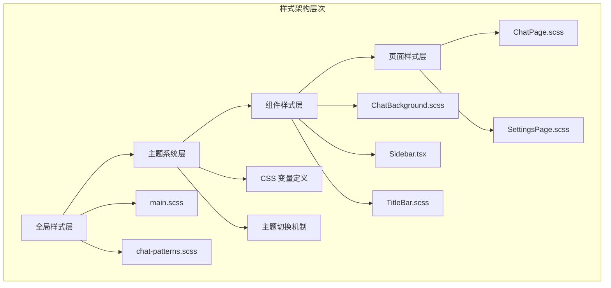
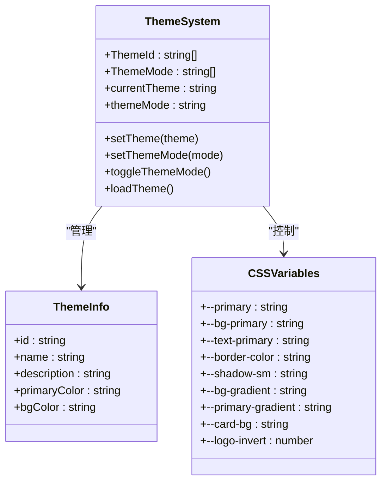
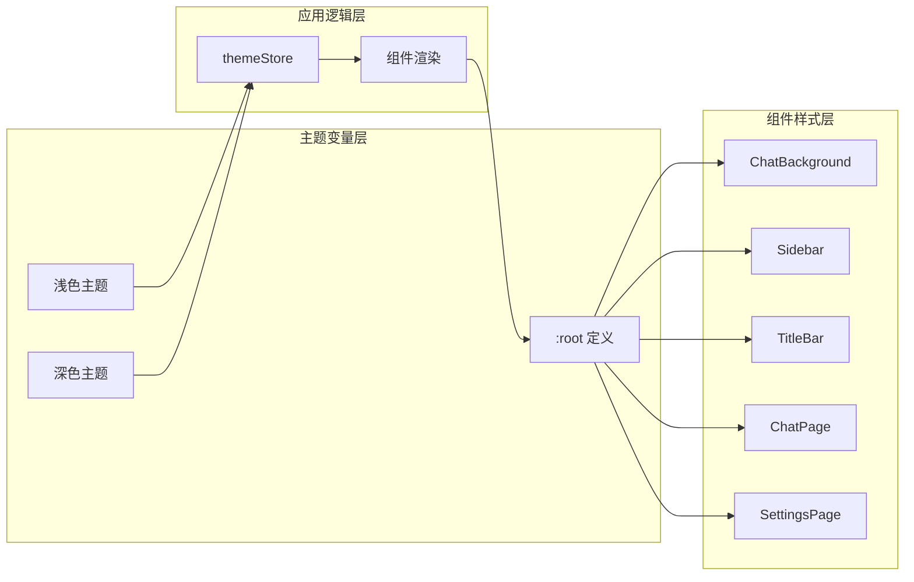
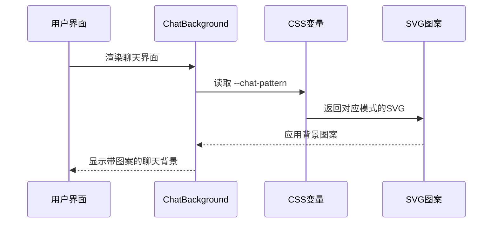
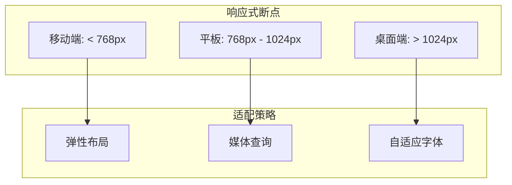
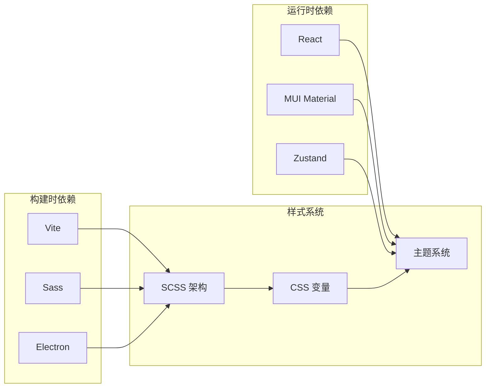
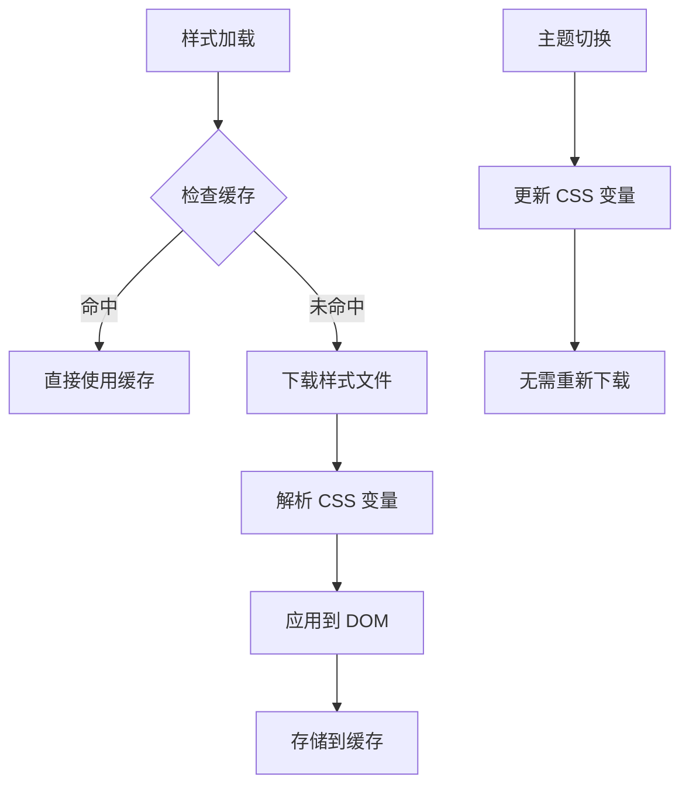

# 样式系统设计

<cite>
**本文档引用的文件**
- [main.scss](file://src/styles/main.scss)
- [chat-patterns.scss](file://src/styles/chat-patterns.scss)
- [App.scss](file://src/App.scss)
- [themeStore.ts](file://src/stores/themeStore.ts)
- [ChatBackground.scss](file://src/components/ChatBackground.scss)
- [ChatPage.scss](file://src/pages/ChatPage.scss)
- [Sidebar.tsx](file://src/components/Sidebar.tsx)
- [SettingsPage.scss](file://src/pages/SettingsPage.scss)
- [TitleBar.scss](file://src/components/TitleBar.scss)
- [vite.config.ts](file://vite.config.ts)
- [package.json](file://package.json)
</cite>

## 目录
1. [简介](#简介)
2. [项目结构](#项目结构)
3. [核心组件](#核心组件)
4. [架构概览](#架构概览)
5. [详细组件分析](#详细组件分析)
6. [依赖关系分析](#依赖关系分析)
7. [性能考虑](#性能考虑)
8. [故障排除指南](#故障排除指南)
9. [结论](#结论)

## 简介

CipherTalk 的样式系统采用现代化的 SCSS 架构设计，实现了高度模块化的样式组织、灵活的主题系统和完整的响应式支持。该系统基于 CSS 变量构建，提供了七种不同的主题选择和深色/浅色模式切换功能。

## 项目结构

样式系统采用分层架构，主要分为以下层次：



**图表来源**
- [main.scss:1-427](file://src/styles/main.scss#L1-L427)
- [chat-patterns.scss:1-19](file://src/styles/chat-patterns.scss#L1-L19)

**章节来源**
- [main.scss:1-427](file://src/styles/main.scss#L1-L427)
- [chat-patterns.scss:1-19](file://src/styles/chat-patterns.scss#L1-L19)

## 核心组件

### CSS 变量系统

样式系统的核心是基于 CSS 自定义属性的变量系统，提供了统一的颜色、间距和排版标准：

| 变量类别 | 数量 | 描述 |
|---------|------|------|
| 颜色变量 | 10个 | 主色调、危险色、警告色等 |
| 背景变量 | 6个 | 主背景、二级背景、悬停效果等 |
| 文本变量 | 4个 | 主文本、辅助文本、三级文本等 |
| 边框变量 | 2个 | 边框颜色、圆角半径等 |
| 阴影变量 | 2个 | 小阴影、中阴影等 |

### 主题系统架构

系统支持七种主题和两种显示模式，通过单一的 CSS 变量源实现动态切换：



**图表来源**
- [themeStore.ts:1-146](file://src/stores/themeStore.ts#L1-L146)
- [main.scss:4-43](file://src/styles/main.scss#L4-L43)

**章节来源**
- [themeStore.ts:1-146](file://src/stores/themeStore.ts#L1-L146)
- [main.scss:1-427](file://src/styles/main.scss#L1-L427)

## 架构概览

样式系统的整体架构采用"变量驱动 + 组件隔离"的设计理念：



**图表来源**
- [main.scss:45-320](file://src/styles/main.scss#L45-L320)
- [themeStore.ts:79-140](file://src/stores/themeStore.ts#L79-L140)

## 详细组件分析

### 聊天背景系统

聊天背景采用了独特的 SVG 背景图案系统，支持深色和浅色模式的自动切换：



**图表来源**
- [ChatBackground.scss:1-26](file://src/components/ChatBackground.scss#L1-L26)
- [chat-patterns.scss:11-18](file://src/styles/chat-patterns.scss#L11-L18)

### 主题切换机制

主题切换通过 data 属性和 CSS 变量实现无缝切换：

```mermaid
flowchart TD
A[用户选择主题] --> B[更新 themeStore]
B --> C[写入 localStorage]
C --> D[设置 data-theme 属性]
D --> E[CSS 变量更新]
E --> F[组件样式重新计算]
F --> G[界面主题变更]
H[深色模式切换] --> I[设置 data-mode="dark"]
I --> E
```

**图表来源**
- [themeStore.ts:85-116](file://src/stores/themeStore.ts#L85-L116)
- [main.scss:48-320](file://src/styles/main.scss#L48-L320)

**章节来源**
- [ChatBackground.scss:1-26](file://src/components/ChatBackground.scss#L1-L26)
- [chat-patterns.scss:1-19](file://src/styles/chat-patterns.scss#L1-L19)
- [themeStore.ts:1-146](file://src/stores/themeStore.ts#L1-L146)

### 组件样式隔离

每个组件都采用独立的样式文件，通过 BEM 命名规范确保样式隔离：

| 组件类型 | 样式文件 | 命名规范 | 作用域特点 |
|---------|----------|----------|-----------|
| 页面组件 | ChatPage.scss | `.chat-page` | 全局页面容器 |
| 功能组件 | Sidebar.tsx | `.session-sidebar` | 侧边栏导航 |
| 通用组件 | TitleBar.scss | `.title-bar` | 标题栏区域 |
| 背景组件 | ChatBackground.scss | `.chat-background` | 聊天背景层 |

**章节来源**
- [ChatPage.scss:1-800](file://src/pages/ChatPage.scss#L1-L800)
- [Sidebar.tsx:1-355](file://src/components/Sidebar.tsx#L1-L355)
- [TitleBar.scss:1-112](file://src/components/TitleBar.scss#L1-L112)

### 响应式设计策略

系统采用移动优先的设计策略，结合断点管理和自适应布局：



**章节来源**
- [SettingsPage.scss:1419-1446](file://src/pages/SettingsPage.scss#L1419-L1446)

## 依赖关系分析

样式系统的依赖关系相对简单，主要依赖于构建工具和运行时环境：



**图表来源**
- [vite.config.ts:1-78](file://vite.config.ts#L1-L78)
- [package.json:20-57](file://package.json#L20-L57)

**章节来源**
- [vite.config.ts:1-78](file://vite.config.ts#L1-L78)
- [package.json:1-169](file://package.json#L1-L169)

## 性能考虑

### CSS 压缩和优化

样式系统在构建过程中实现了多层优化：

1. **变量内联优化**: 所有 CSS 变量在编译时解析，减少运行时计算
2. **选择器合并**: 相同样式的组件共享样式规则
3. **动画优化**: 使用 GPU 加速的 transform 和 opacity 属性

### 缓存策略



### 关键 CSS 提取

系统采用关键渲染路径优化策略，确保首屏渲染的样式能够快速加载。

## 故障排除指南

### 常见问题及解决方案

| 问题类型 | 症状 | 解决方案 |
|---------|------|---------|
| 主题不生效 | 页面颜色未变化 | 检查 data-theme 属性是否正确设置 |
| 样式冲突 | 组件样式异常 | 确认 BEM 命名规范是否遵循 |
| 性能问题 | 页面渲染缓慢 | 检查是否有过多的重绘和回流 |
| 响应式失效 | 移动端显示异常 | 验证媒体查询断点设置 |

**章节来源**
- [main.scss:322-427](file://src/styles/main.scss#L322-L427)

## 结论

CipherTalk 的样式系统展现了现代前端开发的最佳实践，通过模块化的 SCSS 架构、灵活的主题系统和完善的响应式支持，为用户提供了优秀的视觉体验。系统的可维护性和扩展性都得到了充分考虑，为后续的功能扩展奠定了坚实的基础。

该样式系统的主要优势包括：
- **高度模块化**: 清晰的文件组织和职责分离
- **灵活的主题系统**: 支持多种主题和动态切换
- **良好的性能**: 优化的构建流程和缓存策略
- **完整的响应式支持**: 适配各种设备和屏幕尺寸
- **易于维护**: 标准化的命名规范和代码结构