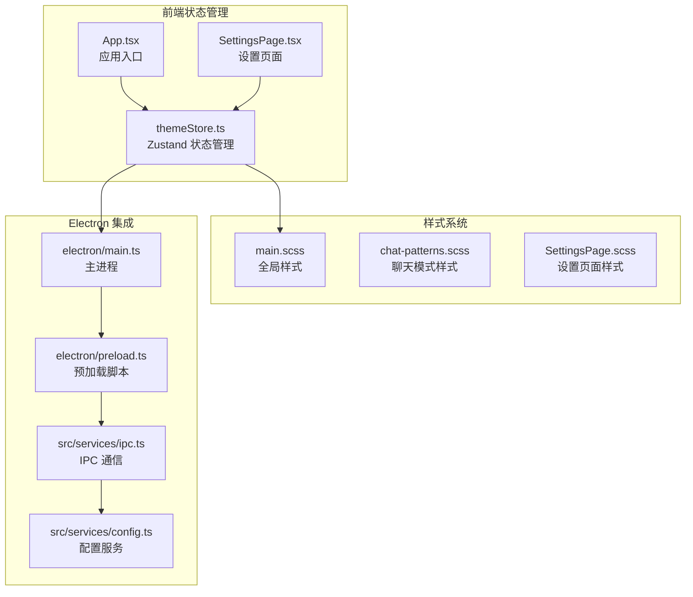
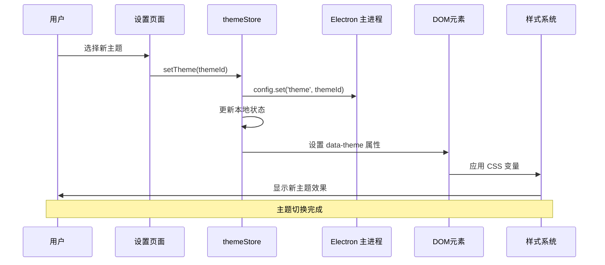
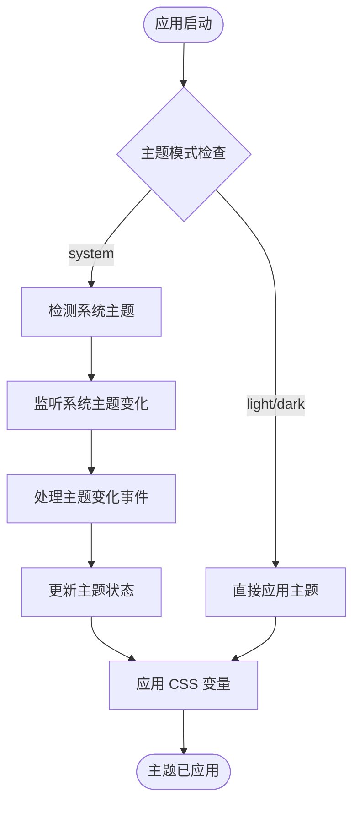
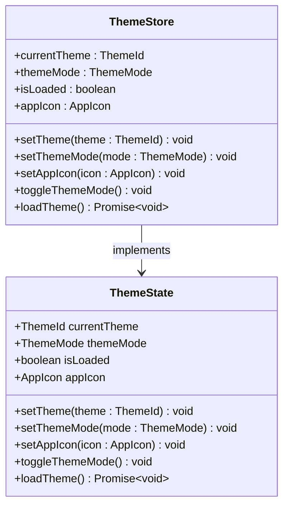
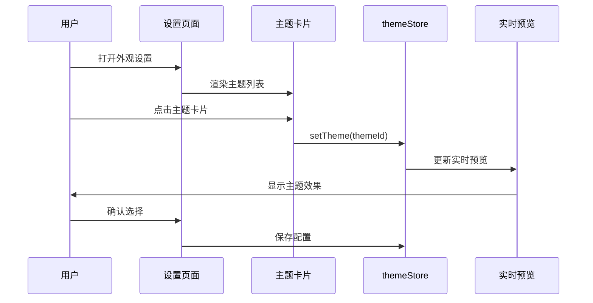
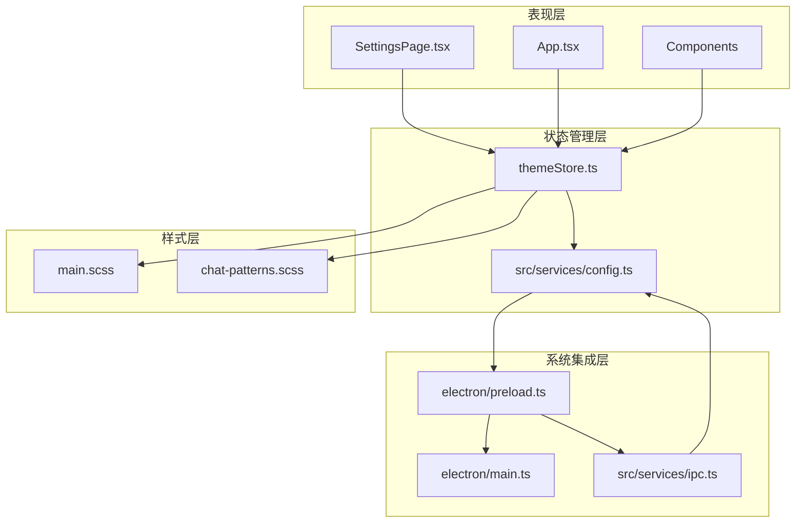

# 主题状态管理

<cite>
**本文档引用的文件**
- [themeStore.ts](file://src/stores/themeStore.ts)
- [main.scss](file://src/styles/main.scss)
- [chat-patterns.scss](file://src/styles/chat-patterns.scss)
- [SettingsPage.tsx](file://src/pages/SettingsPage.tsx)
- [SettingsPage.scss](file://src/pages/SettingsPage.scss)
- [App.tsx](file://src/App.tsx)
- [main.ts](file://electron/main.ts)
- [preload.ts](file://electron/preload.ts)
- [config.ts](file://src/services/config.ts)
- [ipc.ts](file://src/services/ipc.ts)
</cite>

## 目录
1. [简介](#简介)
2. [项目结构](#项目结构)
3. [核心组件](#核心组件)
4. [架构概览](#架构概览)
5. [详细组件分析](#详细组件分析)
6. [依赖关系分析](#依赖关系分析)
7. [性能考虑](#性能考虑)
8. [故障排除指南](#故障排除指南)
9. [结论](#结论)

## 简介

CipherTalk 的主题状态管理系统是一个基于 Zustand 的轻量级状态管理解决方案，专门负责应用程序的主题配置、颜色方案控制和动态主题切换功能。该系统支持多种预定义主题、浅色/深色模式切换以及系统主题跟随功能，为用户提供了丰富的视觉定制体验。

系统采用 CSS 变量驱动的主题架构，通过 HTML 属性选择器实现主题的动态切换，确保了高性能的样式更新和良好的用户体验。主题状态不仅影响界面外观，还深度集成了 Electron 应用程序的原生特性，如应用图标切换和窗口标题栏适配。

## 项目结构

主题系统涉及以下关键文件和模块：



**图表来源**
- [themeStore.ts:1-146](file://src/stores/themeStore.ts#L1-L146)
- [main.scss:1-427](file://src/styles/main.scss#L1-L427)
- [App.tsx:40-88](file://src/App.tsx#L40-L88)

**章节来源**
- [themeStore.ts:1-146](file://src/stores/themeStore.ts#L1-L146)
- [main.scss:1-427](file://src/styles/main.scss#L1-L427)
- [App.tsx:40-88](file://src/App.tsx#L40-L88)

## 核心组件

### 主题状态存储 (themeStore)

themeStore 是整个主题系统的核心，基于 Zustand 提供的状态管理功能。它定义了完整的主题状态结构和操作接口：

**主题类型定义**
- `ThemeId`: 预定义的七种主题标识符
- `ThemeMode`: 主题模式 ('light' | 'dark' | 'system')
- `AppIcon`: 应用图标类型 ('default' | 'xinnian')

**主题信息结构**
```typescript
interface ThemeInfo {
  id: ThemeId
  name: string
  description: string
  primaryColor: string
  bgColor: string
}
```

**状态管理接口**
- `setTheme()`: 设置当前主题
- `setThemeMode()`: 设置主题模式
- `setAppIcon()`: 设置应用图标
- `toggleThemeMode()`: 切换主题模式
- `loadTheme()`: 加载主题配置

**章节来源**
- [themeStore.ts:3-146](file://src/stores/themeStore.ts#L3-L146)

### CSS 变量主题系统

系统采用 CSS 变量驱动的主题架构，通过 HTML 属性选择器实现主题的动态切换：

**根变量定义**
- `--primary`: 主色调
- `--bg-primary`: 主背景色
- `--text-primary`: 主文字色
- `--border-color`: 边框颜色
- `--card-bg`: 卡片背景色

**主题切换机制**
- 使用 `data-theme` 属性标识当前主题
- 使用 `data-mode` 属性标识主题模式
- 通过 CSS 属性选择器应用相应的样式规则

**章节来源**
- [main.scss:4-43](file://src/styles/main.scss#L4-L43)
- [main.scss:47-320](file://src/styles/main.scss#L47-L320)

## 架构概览

主题系统的整体架构采用分层设计，确保了清晰的职责分离和良好的可维护性：



**图表来源**
- [SettingsPage.tsx:923-949](file://src/pages/SettingsPage.tsx#L923-L949)
- [themeStore.ts:85-92](file://src/stores/themeStore.ts#L85-L92)
- [App.tsx:70-88](file://src/App.tsx#L70-L88)

### 系统主题跟随机制

系统实现了智能的主题跟随功能，能够根据操作系统的主题设置自动调整应用主题：



**图表来源**
- [App.tsx:79-87](file://src/App.tsx#L79-L87)
- [main.ts:118-123](file://electron/main.ts#L118-L123)

**章节来源**
- [App.tsx:79-87](file://src/App.tsx#L79-L87)
- [main.ts:118-123](file://electron/main.ts#L118-L123)

## 详细组件分析

### 主题状态存储实现

themeStore 使用 Zustand 的函数式 API 创建，提供了完整的主题状态管理功能：



**图表来源**
- [themeStore.ts:67-140](file://src/stores/themeStore.ts#L67-L140)

**核心功能实现**:

1. **主题持久化**: 通过 Electron IPC 将主题配置保存到本地存储
2. **状态同步**: 确保前端状态与系统配置保持一致
3. **错误处理**: 提供完善的异常处理和降级机制

**章节来源**
- [themeStore.ts:79-140](file://src/stores/themeStore.ts#L79-L140)

### 设置页面集成

设置页面提供了完整的主题配置界面，用户可以直观地选择和预览不同的主题：



**图表来源**
- [SettingsPage.tsx:923-949](file://src/pages/SettingsPage.tsx#L923-L949)
- [SettingsPage.scss:828-879](file://src/pages/SettingsPage.scss#L828-L879)

**章节来源**
- [SettingsPage.tsx:923-949](file://src/pages/SettingsPage.tsx#L923-L949)
- [SettingsPage.scss:828-879](file://src/pages/SettingsPage.scss#L828-L879)

### Electron 集成机制

主题系统与 Electron 主进程深度集成，确保跨平台的一致性体验：

**主进程主题查询**
```typescript
function getThemeQueryParams(): string {
  const theme = configService.get('theme') || 'cloud-dancer'
  const themeMode = configService.get('themeMode') || 'light'
  return `theme=${encodeURIComponent(theme)}&mode=${encodeURIComponent(themeMode)}`
}
```

**应用图标管理**
- 支持默认图标和新年特殊图标
- 动态切换应用图标以适应不同主题
- 跨平台图标资源管理

**章节来源**
- [main.ts:118-141](file://electron/main.ts#L118-L141)
- [main.ts:496-531](file://electron/main.ts#L496-L531)

## 依赖关系分析

主题系统的依赖关系展现了清晰的分层架构：



**图表来源**
- [themeStore.ts:1-146](file://src/stores/themeStore.ts#L1-L146)
- [main.scss:1-427](file://src/styles/main.scss#L1-L427)
- [preload.ts:1-37](file://electron/preload.ts#L1-L37)

**依赖特点**:
- **低耦合**: 各模块职责明确，相互依赖最小化
- **单向数据流**: 状态从主进程流向渲染进程
- **异步通信**: 通过 IPC 实现跨进程通信

**章节来源**
- [themeStore.ts:1-146](file://src/stores/themeStore.ts#L1-L146)
- [preload.ts:1-37](file://electron/preload.ts#L1-L37)

## 性能考虑

### 主题切换性能优化

系统采用了多项性能优化策略：

1. **CSS 变量驱动**: 避免了 JavaScript 直接操作 DOM 样式，减少重排重绘
2. **属性选择器**: 使用 `data-*` 属性进行样式匹配，提高选择器效率
3. **懒加载机制**: 主题配置按需加载，减少初始启动时间
4. **事件去抖**: 系统主题变化监听使用防抖处理，避免频繁更新

### 内存管理

- **状态清理**: 组件卸载时自动清理主题监听器
- **缓存策略**: 主题信息和配置结果进行内存缓存
- **垃圾回收**: 及时释放不再使用的事件处理器

### 跨平台兼容性

- **系统主题检测**: 使用标准的 CSS 媒体查询实现
- **原生集成**: Electron 原生 API 提供最佳的平台适配
- **降级处理**: 在不支持的环境下提供合理的默认行为

## 故障排除指南

### 常见问题及解决方案

**主题配置无法保存**
- 检查 Electron IPC 通信是否正常
- 验证配置服务的权限设置
- 确认本地存储空间充足

**主题切换无效**
- 检查 CSS 变量是否正确应用
- 验证 HTML 属性是否正确设置
- 确认样式文件加载顺序

**系统主题跟随失效**
- 检查媒体查询监听器是否注册
- 验证系统主题变化事件是否触发
- 确认主题模式设置为 'system'

**章节来源**
- [themeStore.ts:85-100](file://src/stores/themeStore.ts#L85-L100)
- [App.tsx:79-87](file://src/App.tsx#L79-L87)

### 调试技巧

1. **开发者工具**: 使用浏览器开发者工具检查 CSS 变量值
2. **控制台日志**: 监听主题状态变化事件
3. **网络面板**: 检查 IPC 通信状态
4. **应用图标**: 验证图标切换功能

## 结论

CipherTalk 的主题状态管理系统展现了现代前端应用的最佳实践。通过精心设计的架构，系统实现了：

- **高度可定制性**: 支持多种主题和颜色方案
- **优秀的用户体验**: 流畅的主题切换和即时反馈
- **跨平台一致性**: 统一的视觉体验和交互行为
- **良好的可维护性**: 清晰的代码结构和完善的文档

该系统为 CipherTalk 提供了强大的视觉定制能力，用户可以根据个人喜好和使用环境自由调整应用外观，同时保持了应用的专业性和一致性。通过持续的优化和改进，主题系统将继续为用户提供更好的使用体验。