# 分析状态管理

<cite>
**本文档引用的文件**
- [analyticsStore.ts](file://src/stores/analyticsStore.ts)
- [analytics.ts](file://src/types/analytics.ts)
- [analyticsService.ts](file://electron/services/analyticsService.ts)
- [AnalyticsPage.tsx](file://src/pages/AnalyticsPage.tsx)
- [GroupAnalyticsPage.tsx](file://src/pages/GroupAnalyticsPage.tsx)
- [groupAnalyticsService.ts](file://electron/services/groupAnalyticsService.ts)
- [lruCache.ts](file://src/utils/lruCache.ts)
- [preload.ts](file://electron/preload.ts)
- [main.ts](file://electron/main.ts)
- [DateRangePicker.tsx](file://src/components/DateRangePicker.tsx)
</cite>

## 目录
1. [简介](#简介)
2. [项目结构](#项目结构)
3. [核心组件](#核心组件)
4. [架构概览](#架构概览)
5. [详细组件分析](#详细组件分析)
6. [依赖关系分析](#依赖关系分析)
7. [性能考虑](#性能考虑)
8. [故障排除指南](#故障排除指南)
9. [结论](#结论)

## 简介

CipherTalk 的分析状态管理系统是一个完整的数据驱动解决方案，专门用于管理和可视化微信聊天数据的统计分析。该系统通过 Zustand 状态管理库实现了高效的数据状态管理，结合 Electron 后端服务提供了强大的数据分析能力。

系统的核心目标是：
- 提供实时的聊天数据分析和统计
- 支持私聊和群聊两种分析模式
- 实现数据缓存和状态持久化
- 提供丰富的可视化图表展示
- 支持时间范围筛选和增量更新

## 项目结构

分析状态管理系统采用分层架构设计，主要分为以下几个层次：

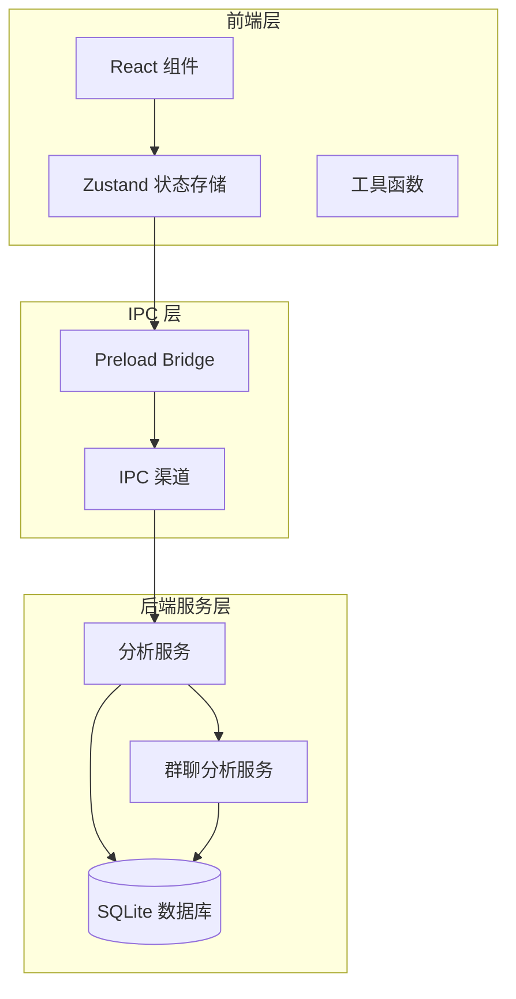

**图表来源**
- [analyticsStore.ts:1-71](file://src/stores/analyticsStore.ts#L1-L71)
- [preload.ts:305-319](file://electron/preload.ts#L305-L319)
- [analyticsService.ts:39-759](file://electron/services/analyticsService.ts#L39-L759)

**章节来源**
- [analyticsStore.ts:1-71](file://src/stores/analyticsStore.ts#L1-L71)
- [AnalyticsPage.tsx:1-189](file://src/pages/AnalyticsPage.tsx#L1-L189)
- [GroupAnalyticsPage.tsx:1-537](file://src/pages/GroupAnalyticsPage.tsx#L1-L537)

## 核心组件

### Zustand 状态存储

分析状态管理系统基于 Zustand 库构建，提供了轻量级但功能强大的状态管理能力。核心状态包括：

#### 数据状态
- `statistics`: 聊天统计数据对象，包含消息总数、发送接收统计、活跃天数等
- `rankings`: 联系人排名列表，按消息数量排序
- `timeDistribution`: 时间分布统计，包括小时分布、星期分布、月份分布

#### 状态标志
- `isLoaded`: 数据加载完成标志
- `lastLoadTime`: 最后一次加载时间戳

#### 核心操作函数
- `setStatistics(data)`: 设置聊天统计数据
- `setRankings(data)`: 设置联系人排名
- `setTimeDistribution(data)`: 设置时间分布
- `markLoaded()`: 标记数据加载完成
- `clearCache()`: 清空所有缓存数据

**章节来源**
- [analyticsStore.ts:34-70](file://src/stores/analyticsStore.ts#L34-L70)

### 数据类型定义

系统定义了完整的数据类型体系，确保类型安全和代码可维护性：

#### 聊天统计数据接口
```typescript
interface ChatStatistics {
  totalMessages: number
  textMessages: number
  imageMessages: number
  voiceMessages: number
  videoMessages: number
  emojiMessages: number
  otherMessages: number
  sentMessages: number
  receivedMessages: number
  firstMessageTime: number | null
  lastMessageTime: number | null
  activeDays: number
  messageTypeCounts: Record<number, number>
}
```

#### 时间分布接口
```typescript
interface TimeDistribution {
  hourlyDistribution: Record<number, number>
  monthlyDistribution: Record<string, number>
}
```

#### 联系人排名接口
```typescript
interface ContactRanking {
  username: string
  displayName: string
  avatarUrl?: string
  messageCount: number
  sentCount: number
  receivedCount: number
  lastMessageTime: number | null
}
```

**章节来源**
- [analytics.ts:3-36](file://src/types/analytics.ts#L3-L36)

## 架构概览

分析状态管理系统采用客户端-服务器分离架构，通过 IPC 通道实现前后端通信：

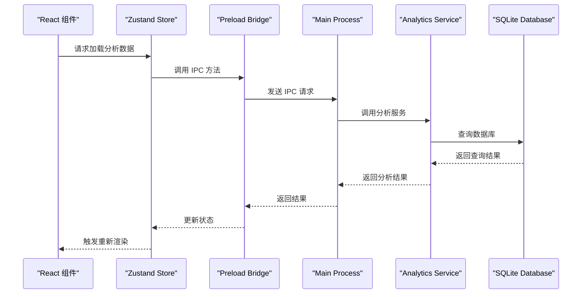

**图表来源**
- [preload.ts:305-319](file://electron/preload.ts#L305-L319)
- [main.ts:2428-2460](file://electron/main.ts#L2428-L2460)
- [analyticsService.ts:269-450](file://electron/services/analyticsService.ts#L269-L450)

**章节来源**
- [preload.ts:305-319](file://electron/preload.ts#L305-L319)
- [main.ts:2428-2460](file://electron/main.ts#L2428-L2460)

## 详细组件分析

### 私聊分析页面

私聊分析页面是用户交互的主要入口，提供了完整的聊天数据分析功能。

#### 页面状态管理

页面使用本地状态管理以下关键状态：
- `isLoading`: 数据加载状态
- `loadingStatus`: 当前加载进度描述
- `error`: 错误状态信息

#### 数据加载流程

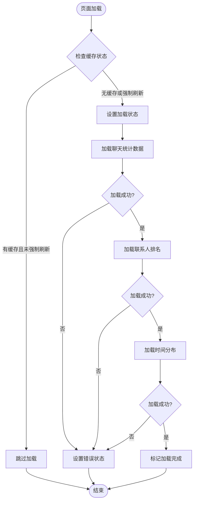

**图表来源**
- [AnalyticsPage.tsx:15-45](file://src/pages/AnalyticsPage.tsx#L15-L45)

#### 图表数据准备

系统提供了多种图表数据准备函数：

##### 消息类型分布图
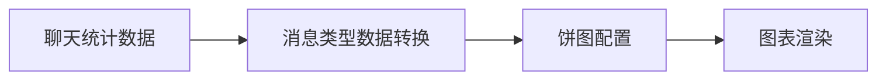

**图表来源**
- [AnalyticsPage.tsx:63-77](file://src/pages/AnalyticsPage.tsx#L63-L77)

##### 发送/接收比例图
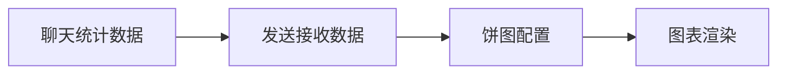

**图表来源**
- [AnalyticsPage.tsx:79-88](file://src/pages/AnalyticsPage.tsx#L79-L88)

**章节来源**
- [AnalyticsPage.tsx:1-189](file://src/pages/AnalyticsPage.tsx#L1-L189)

### 群聊分析页面

群聊分析页面提供了更复杂的数据分析功能，支持多维度的群聊统计分析。

#### 功能模块设计

页面采用模块化设计，支持四种主要分析功能：

| 功能 | 描述 | 数据源 |
|------|------|--------|
| 成员查看 | 显示群聊成员列表 | contact.db |
| 发言排行 | 显示群成员消息统计 | Msg_* 表 |
| 活跃时段 | 显示群聊活跃时间分布 | Msg_* 表 |
| 媒体统计 | 显示群聊媒体内容统计 | Msg_* 表 |

#### 时间范围筛选

群聊分析支持灵活的时间范围筛选，通过 `DateRangePicker` 组件实现：

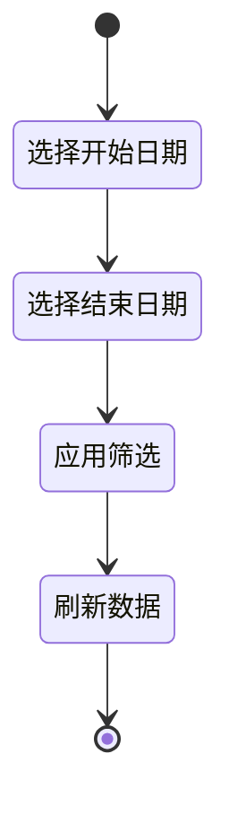

**图表来源**
- [GroupAnalyticsPage.tsx:102-107](file://src/pages/GroupAnalyticsPage.tsx#L102-L107)

**章节来源**
- [GroupAnalyticsPage.tsx:1-537](file://src/pages/GroupAnalyticsPage.tsx#L1-L537)
- [DateRangePicker.tsx:1-240](file://src/components/DateRangePicker.tsx#L1-L240)

### 后端分析服务

分析服务是系统的核心数据处理层，负责从 SQLite 数据库中提取和处理分析数据。

#### 私聊分析服务

私聊分析服务提供了三种核心分析功能：

##### 整体统计分析
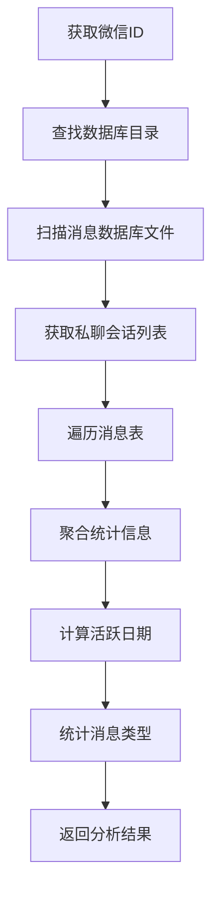

**图表来源**
- [analyticsService.ts:269-450](file://electron/services/analyticsService.ts#L269-L450)

##### 联系人排名分析
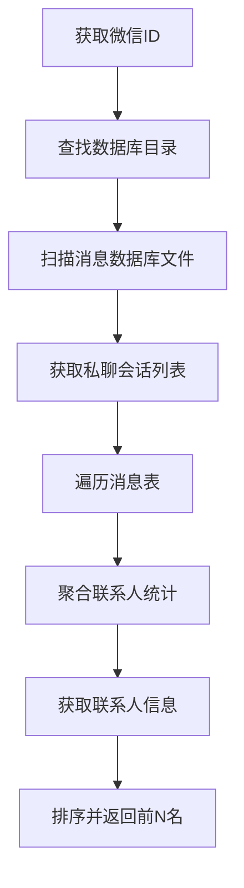

**图表来源**
- [analyticsService.ts:453-625](file://electron/services/analyticsService.ts#L453-L625)

##### 时间分布分析
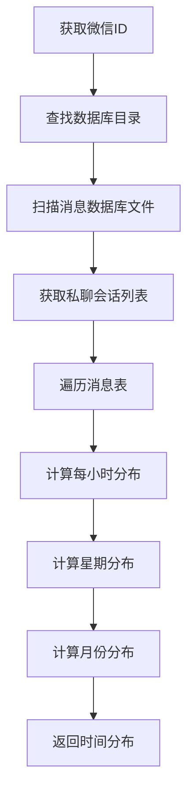

**图表来源**
- [analyticsService.ts:628-743](file://electron/services/analyticsService.ts#L628-L743)

**章节来源**
- [analyticsService.ts:39-759](file://electron/services/analyticsService.ts#L39-L759)

### 群聊分析服务

群聊分析服务提供了专门针对群聊场景的数据分析功能。

#### 群聊信息获取

群聊分析服务首先需要获取群聊的基本信息：

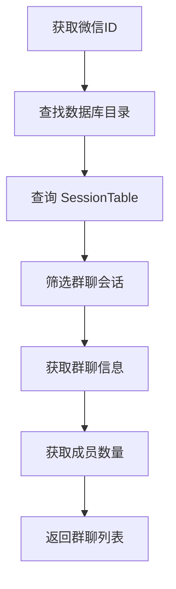

**图表来源**
- [groupAnalyticsService.ts:204-350](file://electron/services/groupAnalyticsService.ts#L204-L350)

#### 群聊成员分析

群聊成员分析功能支持获取群聊成员列表和头像信息：

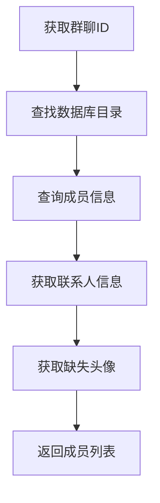

**图表来源**
- [groupAnalyticsService.ts:353-421](file://electron/services/groupAnalyticsService.ts#L353-L421)

**章节来源**
- [groupAnalyticsService.ts:41-718](file://electron/services/groupAnalyticsService.ts#L41-L718)

## 依赖关系分析

分析状态管理系统涉及多个层面的依赖关系：

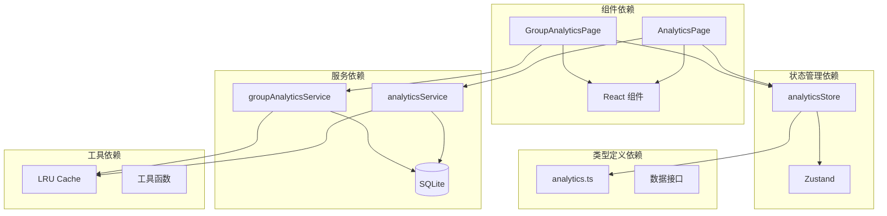

**图表来源**
- [analyticsStore.ts:1-71](file://src/stores/analyticsStore.ts#L1-L71)
- [analytics.ts:1-92](file://src/types/analytics.ts#L1-L92)
- [AnalyticsPage.tsx:1-189](file://src/pages/AnalyticsPage.tsx#L1-L189)
- [GroupAnalyticsPage.tsx:1-537](file://src/pages/GroupAnalyticsPage.tsx#L1-L537)

**章节来源**
- [lruCache.ts:1-51](file://src/utils/lruCache.ts#L1-L51)

## 性能考虑

分析状态管理系统在设计时充分考虑了性能优化，采用了多种策略来提升用户体验：

### 数据缓存策略

#### 内存缓存
系统使用 LRU 缓存机制来限制内存使用：
- 缓存容量限制，防止内存泄漏
- 最近使用优先的淘汰策略
- 支持动态容量调整

#### 数据库连接缓存
分析服务实现了数据库连接缓存：
- 复用 SQLite 连接减少开销
- 缓存表结构信息
- 支持连接池管理

### 增量更新机制

系统支持增量更新，避免全量重新计算：
- 检测数据变更时间戳
- 只更新受影响的数据块
- 支持时间范围增量分析

### 异步数据处理

采用异步处理模式：
- 非阻塞的数据库查询
- 并行处理多个分析任务
- 进度反馈和取消机制

### 图表优化

图表渲染优化：
- 按需加载图表数据
- 支持图表配置缓存
- 优化大数据集的渲染性能

## 故障排除指南

### 常见问题诊断

#### 数据加载失败
**症状**: 分析页面显示加载错误
**可能原因**:
- 数据库文件不存在或损坏
- 微信ID配置不正确
- 数据库权限不足

**解决方法**:
1. 检查数据库目录是否存在
2. 验证微信ID配置
3. 确认数据库文件权限

#### 性能问题
**症状**: 分析过程响应缓慢
**可能原因**:
- 数据库文件过大
- 内存不足
- 缓存失效

**解决方法**:
1. 清理分析缓存
2. 关闭不必要的应用
3. 考虑分批处理大数据

#### 图表显示异常
**症状**: 图表无法正常显示或显示错误
**可能原因**:
- 数据格式不正确
- 图表配置错误
- 浏览器兼容性问题

**解决方法**:
1. 检查数据完整性
2. 验证图表配置
3. 更新浏览器版本

**章节来源**
- [analyticsService.ts:447-450](file://electron/services/analyticsService.ts#L447-L450)
- [groupAnalyticsService.ts:347-350](file://electron/services/groupAnalyticsService.ts#L347-L350)

## 结论

CipherTalk 的分析状态管理系统是一个设计精良、功能完整的数据分析解决方案。系统通过合理的架构设计和优化策略，成功地解决了大规模聊天数据分析的技术挑战。

### 主要优势

1. **模块化设计**: 清晰的分层架构便于维护和扩展
2. **性能优化**: 多层次的缓存和异步处理机制
3. **用户体验**: 直观的界面和流畅的交互体验
4. **数据安全**: 完整的数据类型定义和验证机制

### 技术亮点

- 基于 Zustand 的轻量级状态管理
- Electron IPC 通道实现前后端通信
- SQLite 数据库的高效查询优化
- React 组件的响应式数据绑定

### 未来改进方向

1. **实时分析**: 支持实时数据更新和增量分析
2. **机器学习集成**: 添加智能分析和预测功能
3. **多平台支持**: 扩展到移动端和其他平台
4. **性能监控**: 添加详细的性能指标和监控功能

该系统为用户提供了全面的聊天数据分析能力，是 CipherTalk 产品生态中的重要组成部分。