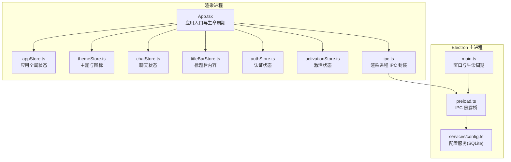
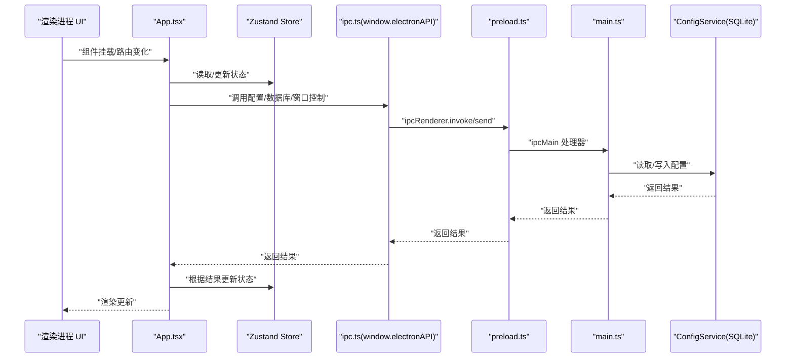
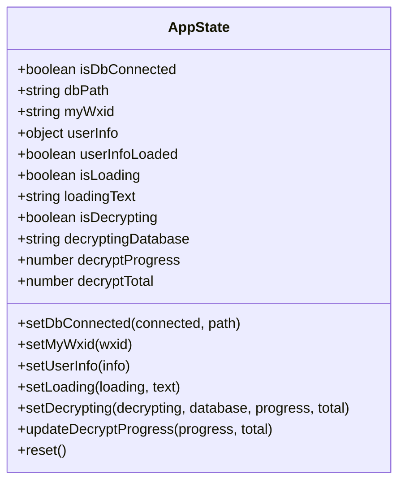
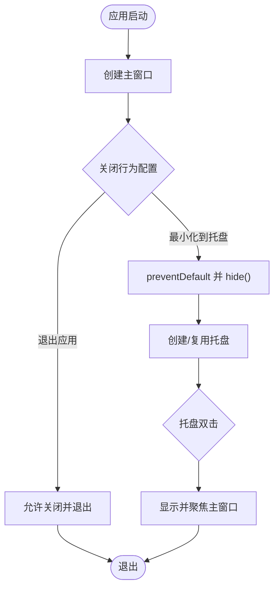
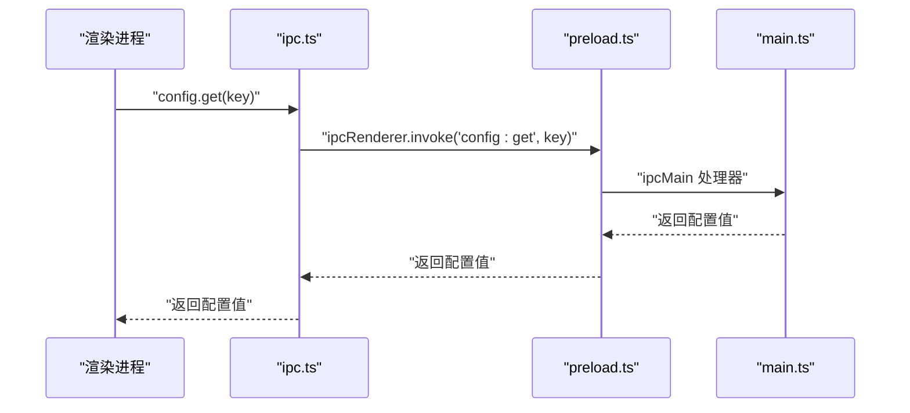
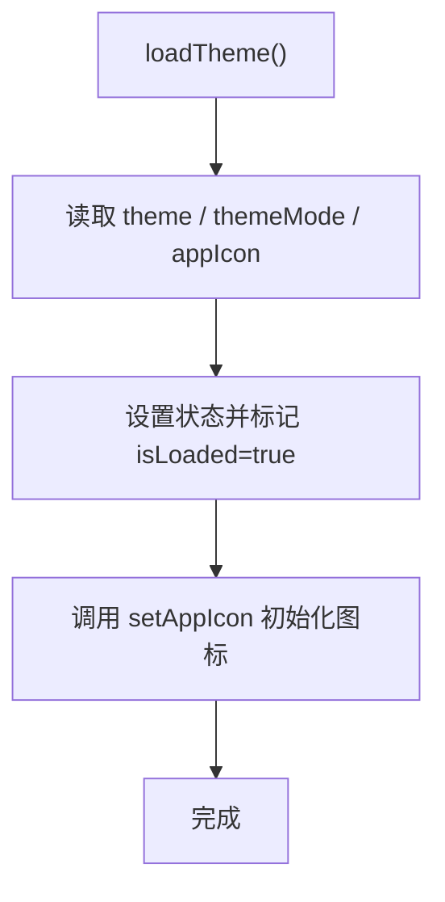
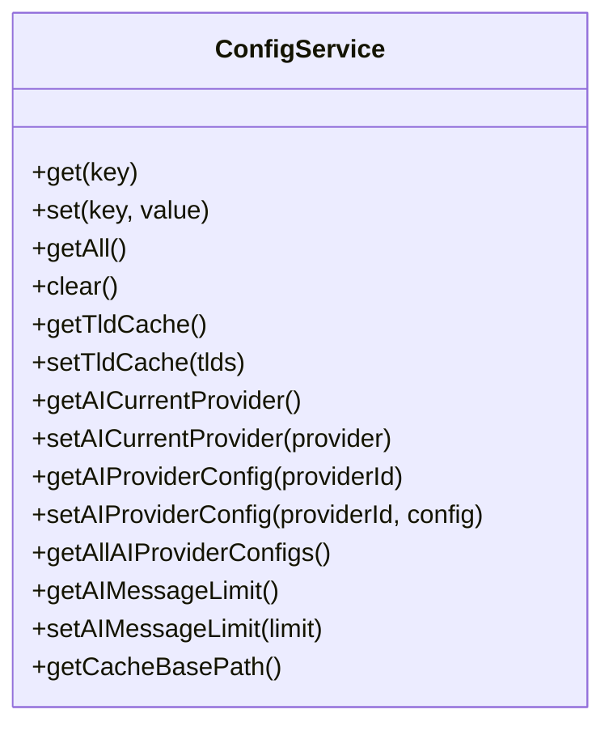
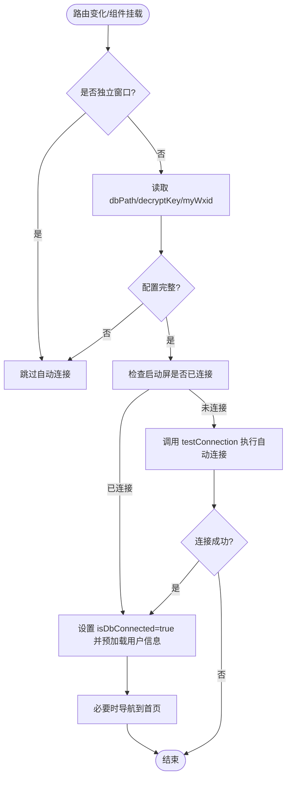
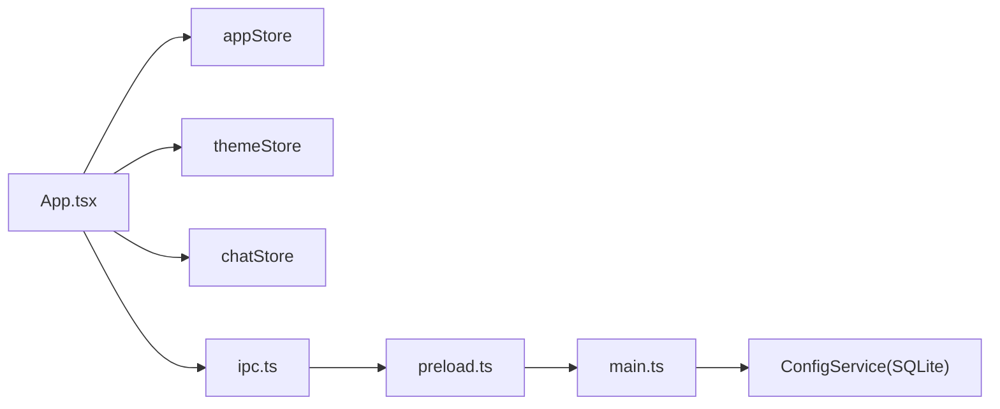

# 应用状态管理

<cite>
**本文档引用的文件**
- [src/stores/appStore.ts](file://src/stores/appStore.ts)
- [electron/main.ts](file://electron/main.ts)
- [electron/preload.ts](file://electron/preload.ts)
- [src/services/ipc.ts](file://src/services/ipc.ts)
- [src/stores/themeStore.ts](file://src/stores/themeStore.ts)
- [electron/services/config.ts](file://electron/services/config.ts)
- [src/services/config.ts](file://src/services/config.ts)
- [src/App.tsx](file://src/App.tsx)
- [src/stores/chatStore.ts](file://src/stores/chatStore.ts)
- [src/stores/activationStore.ts](file://src/stores/activationStore.ts)
- [src/stores/authStore.ts](file://src/stores/authStore.ts)
- [src/stores/titleBarStore.ts](file://src/stores/titleBarStore.ts)
- [src/main.tsx](file://src/main.tsx)
</cite>

## 目录
1. [简介](#简介)
2. [项目结构](#项目结构)
3. [核心组件](#核心组件)
4. [架构总览](#架构总览)
5. [详细组件分析](#详细组件分析)
6. [依赖关系分析](#依赖关系分析)
7. [性能考量](#性能考量)
8. [故障排查指南](#故障排查指南)
9. [结论](#结论)
10. [附录](#附录)

## 简介
本文件面向 CipherTalk 的应用状态管理，系统性阐述 appStore 的设计与实现，覆盖应用全局状态、窗口状态控制、应用生命周期管理；详解应用状态操作函数（初始化、窗口显隐、主题切换、语言设置、配置存储）；解释应用状态与 Electron 主进程的通信机制（IPC 状态同步、主进程状态推送、渲染进程状态订阅）；给出状态在组件间传递的模式（状态提升与隔离策略）；并提供持久化与恢复策略、调试与监控方法。

## 项目结构
应用状态管理采用“前端状态 + Electron 配置服务”的双层架构：
- 前端状态：使用 Zustand 管理应用运行时状态（如数据库连接、用户信息、加载与解密进度、主题与标题栏内容等）。
- Electron 配置服务：使用 SQLite 存储应用配置（如主题、语言、缓存路径、AI 提供商配置、自动更新参数等），并通过 IPC 提供读写接口。

图表来源
- [src/App.tsx:1-538](file://src/App.tsx#L1-L538)
- [src/stores/appStore.ts:1-97](file://src/stores/appStore.ts#L1-L97)
- [src/stores/themeStore.ts:1-146](file://src/stores/themeStore.ts#L1-L146)
- [src/stores/chatStore.ts:1-146](file://src/stores/chatStore.ts#L1-L146)
- [src/stores/titleBarStore.ts:1-13](file://src/stores/titleBarStore.ts#L1-L13)
- [src/stores/authStore.ts:1-271](file://src/stores/authStore.ts#L1-L271)
- [src/stores/activationStore.ts:1-45](file://src/stores/activationStore.ts#L1-L45)
- [src/services/ipc.ts:1-38](file://src/services/ipc.ts#L1-L38)
- [electron/main.ts:1-800](file://electron/main.ts#L1-L800)
- [electron/preload.ts:1-454](file://electron/preload.ts#L1-L454)
- [electron/services/config.ts:1-395](file://electron/services/config.ts#L1-L395)

章节来源
- [src/App.tsx:1-538](file://src/App.tsx#L1-L538)
- [electron/main.ts:1-800](file://electron/main.ts#L1-L800)
- [electron/preload.ts:1-454](file://electron/preload.ts#L1-L454)
- [electron/services/config.ts:1-395](file://electron/services/config.ts#L1-L395)

## 核心组件
- appStore：应用全局状态中心，管理数据库连接、用户信息、加载与解密进度等。
- themeStore：主题与图标状态，负责主题切换、模式切换、图标切换与持久化。
- chatStore：聊天模块状态，管理会话、消息、联系人缓存与搜索关键字。
- titleBarStore：标题栏右侧内容状态，支持动态注入组件。
- authStore：认证状态，支持 Windows Hello 与密码两种认证方式。
- activationStore：激活状态，负责检查与清理激活缓存。
- 配置服务：Electron 层的 ConfigService（SQLite）与渲染层封装（ipc.ts）。

章节来源
- [src/stores/appStore.ts:1-97](file://src/stores/appStore.ts#L1-L97)
- [src/stores/themeStore.ts:1-146](file://src/stores/themeStore.ts#L1-L146)
- [src/stores/chatStore.ts:1-146](file://src/stores/chatStore.ts#L1-L146)
- [src/stores/titleBarStore.ts:1-13](file://src/stores/titleBarStore.ts#L1-L13)
- [src/stores/authStore.ts:1-271](file://src/stores/authStore.ts#L1-L271)
- [src/stores/activationStore.ts:1-45](file://src/stores/activationStore.ts#L1-L45)
- [src/services/ipc.ts:1-38](file://src/services/ipc.ts#L1-L38)
- [electron/services/config.ts:1-395](file://electron/services/config.ts#L1-L395)

## 架构总览
应用状态管理遵循“渲染进程状态 + 主进程配置服务”的分层设计：
- 渲染进程使用 Zustand 管理 UI 状态与业务状态，通过 ipc.ts 封装的 window.electronAPI 与主进程通信。
- 主进程通过 preload.ts 暴露 IPC 接口，ConfigService 使用 SQLite 存储配置，提供 get/set 等方法。
- App.tsx 作为应用入口，负责生命周期钩子、主题应用、协议与激活流程、自动连接数据库、监听主进程推送事件等。

图表来源
- [src/App.tsx:1-538](file://src/App.tsx#L1-L538)
- [src/services/ipc.ts:1-38](file://src/services/ipc.ts#L1-L38)
- [electron/preload.ts:1-454](file://electron/preload.ts#L1-L454)
- [electron/main.ts:1-800](file://electron/main.ts#L1-L800)
- [electron/services/config.ts:1-395](file://electron/services/config.ts#L1-L395)

## 详细组件分析

### appStore：应用全局状态
- 状态字段
  - 数据库状态：isDbConnected、dbPath、myWxid
  - 用户信息：userInfo、userInfoLoaded
  - 加载状态：isLoading、loadingText
  - 解密进度：isDecrypting、decryptingDatabase、decryptProgress、decryptTotal
- 操作函数
  - setDbConnected：设置数据库连接状态与路径
  - setMyWxid：设置当前用户 wxid
  - setUserInfo：设置用户信息并标记已加载
  - setLoading：设置加载状态与提示文本
  - setDecrypting：设置解密状态与进度上下文
  - updateDecryptProgress：增量更新解密进度
  - reset：重置所有状态为初始值

图表来源
- [src/stores/appStore.ts:10-95](file://src/stores/appStore.ts#L10-L95)

章节来源
- [src/stores/appStore.ts:1-97](file://src/stores/appStore.ts#L1-L97)

### 主进程窗口与生命周期控制
- 窗口创建与行为
  - createWindow：主窗口创建，支持开发/生产环境加载，关闭时可最小化到托盘
  - createChatWindow、createMomentsWindow、createGroupAnalyticsWindow、createAnnualReportWindow、createWelcomeWindow、createChatHistoryWindow：独立窗口创建，传递主题参数，支持过滤与定位
- 生命周期与托盘
  - 关闭行为：根据配置 closeToTray 决定最小化到托盘还是退出
  - 托盘：双击显示主窗口，点击菜单退出
- 主题参数传递
  - getThemeQueryParams：从配置服务读取主题与模式，拼接查询参数传递给子窗口

图表来源
- [electron/main.ts:193-281](file://electron/main.ts#L193-L281)
- [electron/main.ts:286-588](file://electron/main.ts#L286-L588)
- [electron/main.ts:118-123](file://electron/main.ts#L118-L123)

章节来源
- [electron/main.ts:1-800](file://electron/main.ts#L1-L800)

### 渲染进程 IPC 通信与配置封装
- ipc.ts：对 window.electronAPI 的轻量封装，提供 config、db、decrypt、dialog、windowControl 等 API
- preload.ts：通过 contextBridge 暴露 electronAPI，包含配置、数据库、解密、窗口控制、HTTP API、聊天、朋友圈、数据分析、导出、激活、缓存、日志、语音转写、AI 摘要等接口
- App.tsx：在应用入口处使用 ipc.ts 调用主进程能力，如自动连接数据库、监听更新、监听会话更新等

图表来源
- [src/services/ipc.ts:4-7](file://src/services/ipc.ts#L4-L7)
- [electron/preload.ts:6-11](file://electron/preload.ts#L6-L11)
- [electron/main.ts:1-800](file://electron/main.ts#L1-L800)

章节来源
- [src/services/ipc.ts:1-38](file://src/services/ipc.ts#L1-L38)
- [electron/preload.ts:1-454](file://electron/preload.ts#L1-L454)

### 主题与图标状态：themeStore
- 状态：currentTheme、themeMode、appIcon、isLoaded
- 操作：
  - setTheme、setThemeMode、setAppIcon：异步写入配置并持久化
  - toggleThemeMode：在 light/dark 间切换
  - loadTheme：从配置服务读取主题、模式与图标，初始化图标
- 与主进程交互：通过 window.electronAPI.config.set/get 与主进程配置服务通信

图表来源
- [src/stores/themeStore.ts:118-139](file://src/stores/themeStore.ts#L118-L139)
- [src/stores/themeStore.ts:85-111](file://src/stores/themeStore.ts#L85-L111)

章节来源
- [src/stores/themeStore.ts:1-146](file://src/stores/themeStore.ts#L1-L146)

### 配置服务：Electron ConfigService 与渲染层封装
- Electron ConfigService（SQLite）
  - Schema：包含数据库路径、解密密钥、主题、语言、缓存路径、导出路径、AI 提供商配置、自动更新参数、HTTP API、窗口关闭行为等
  - 方法：get、set、getAll、clear、getTldCache、setTldCache、AI 配置便捷方法等
- 渲染层封装（src/services/config.ts）
  - 对 CONFIG_KEYS 的常量封装，提供 get/set 方法族（如 getTheme、setTheme、getDbPath、setDbPath 等）
  - 与 ipc.ts 配合，统一读写配置

图表来源
- [electron/services/config.ts:126-394](file://electron/services/config.ts#L126-L394)

章节来源
- [electron/services/config.ts:1-395](file://electron/services/config.ts#L1-L395)
- [src/services/config.ts:1-574](file://src/services/config.ts#L1-L574)

### 应用生命周期与自动连接数据库
- App.tsx 在非独立窗口场景下，自动检查配置并尝试连接数据库
- 逻辑要点：
  - 读取 dbPath、decryptKey、myWxid
  - 通过 window.electronAPI.app.getStartupDbConnected 判断启动屏是否已连接
  - 若未连接，调用 window.electronAPI.wcdb.testConnection 执行自动连接
  - 成功后设置 appStore 的 isDbConnected，并预加载用户信息

图表来源
- [src/App.tsx:194-264](file://src/App.tsx#L194-L264)

章节来源
- [src/App.tsx:1-538](file://src/App.tsx#L1-L538)

### 状态操作函数详解
- 应用初始化状态
  - 通过 App.tsx 的 useEffect，在路由变化时读取配置并尝试连接数据库
  - 成功后设置 appStore 的 isDbConnected，并预加载用户信息
- 窗口显示隐藏控制
  - 主进程：createWindow 中监听 close 事件，根据 closeToTray 决定最小化到托盘或退出
  - 渲染进程：通过 window.electronAPI.window 控制最小化、最大化、关闭
- 应用主题切换
  - themeStore.setTheme/setThemeMode：异步写入配置并持久化
  - App.tsx 在 themeMode 为 system 时监听系统配色变化，动态应用 data-mode
- 语言设置管理
  - Electron ConfigService 中包含 language 字段，可通过 set/get 方法读写
  - 渲染层封装提供 getLanguage/setLanguage 方法族
- 配置项存储
  - Electron ConfigService 使用 SQLite 存储键值对，提供 get/set/getAll/clear
  - 渲染层通过 ipc.ts 与 preload.ts 暴露的 electronAPI.config 接口读写

章节来源
- [src/App.tsx:194-264](file://src/App.tsx#L194-L264)
- [src/stores/themeStore.ts:85-111](file://src/stores/themeStore.ts#L85-L111)
- [electron/services/config.ts:248-273](file://electron/services/config.ts#L248-L273)
- [src/services/config.ts:162-171](file://src/services/config.ts#L162-L171)

### 应用状态与 Electron 主进程通信机制
- IPC 状态同步
  - 渲染进程通过 window.electronAPI.config.get/set 与主进程配置服务同步主题、语言、缓存路径等
  - 通过 window.electronAPI.wcdb.testConnection 等接口与数据库服务通信
- 主进程状态推送
  - App.tsx 监听 window.electronAPI.app.onUpdateAvailable、window.electronAPI.dataManagement.onUpdateAvailable、window.electronAPI.chat.onSessionsUpdated 等推送事件，更新 UI 与状态
- 渲染进程状态订阅
  - 使用 useEffect 订阅事件，返回函数中移除监听，避免内存泄漏

章节来源
- [src/App.tsx:136-168](file://src/App.tsx#L136-L168)
- [src/services/ipc.ts:1-38](file://src/services/ipc.ts#L1-L38)
- [electron/preload.ts:438-453](file://electron/preload.ts#L438-L453)

### 组件间状态传递模式
- 状态提升
  - App.tsx 作为根组件，集中处理协议、激活、主题、自动连接等全局逻辑，再将状态与回调传递给子组件
- 状态隔离
  - chatStore、themeStore、titleBarStore 等各自维护独立领域状态，避免跨域耦合
- 状态共享
  - 通过 Zustand 的 getState() 在事件回调中直接更新全局状态（如更新状态、添加日志）

章节来源
- [src/App.tsx:40-88](file://src/App.tsx#L40-L88)
- [src/stores/chatStore.ts:1-146](file://src/stores/chatStore.ts#L1-L146)
- [src/stores/themeStore.ts:1-146](file://src/stores/themeStore.ts#L1-L146)
- [src/stores/titleBarStore.ts:1-13](file://src/stores/titleBarStore.ts#L1-L13)

### 持久化机制与恢复策略
- 配置持久化
  - Electron ConfigService 使用 SQLite 存储配置，提供 get/set/getAll/clear 等方法
  - 渲染层通过 ipc.ts 与主进程通信，实现配置的读写
- 状态持久化
  - appStore、themeStore 等状态为内存态，重启后需通过配置恢复
  - App.tsx 在启动时读取 dbPath、decryptKey、myWxid 并尝试自动连接数据库
- 恢复策略
  - 协议版本与激活状态在 App.tsx 中检查，必要时弹出协议或激活页面
  - 主题与图标在 App.tsx 首次渲染时通过 themeStore.loadTheme 恢复

章节来源
- [electron/services/config.ts:126-394](file://electron/services/config.ts#L126-L394)
- [src/services/config.ts:1-574](file://src/services/config.ts#L1-L574)
- [src/App.tsx:60-105](file://src/App.tsx#L60-L105)
- [src/App.tsx:194-264](file://src/App.tsx#L194-L264)

### 调试与监控方法
- 日志与事件
  - App.tsx 监听应用更新可用与下载进度事件，打印时间戳日志
  - 数据管理模块监听 onUpdateAvailable 与 onProgress，输出同步状态
- 断点与控制台
  - 在 App.tsx 的 useEffect 中设置断点，观察自动连接与主题应用流程
  - 在 preload.ts 中检查 ipcMain 处理器返回值，验证配置读写正确性

章节来源
- [src/App.tsx:136-178](file://src/App.tsx#L136-L178)
- [electron/preload.ts:1-454](file://electron/preload.ts#L1-L454)

## 依赖关系分析
- 组件耦合
  - App.tsx 依赖多个 store 与 ipc 封装，承担协调职责
  - themeStore 与 preload.ts 的 app.setAppIcon 存在间接耦合
- 外部依赖
  - Electron 主进程提供窗口、托盘、IPC、配置服务等能力
  - SQLite 作为配置存储介质

图表来源
- [src/App.tsx:1-538](file://src/App.tsx#L1-L538)
- [src/services/ipc.ts:1-38](file://src/services/ipc.ts#L1-L38)
- [electron/preload.ts:1-454](file://electron/preload.ts#L1-L454)
- [electron/main.ts:1-800](file://electron/main.ts#L1-L800)
- [electron/services/config.ts:1-395](file://electron/services/config.ts#L1-L395)

章节来源
- [src/App.tsx:1-538](file://src/App.tsx#L1-L538)
- [src/services/ipc.ts:1-38](file://src/services/ipc.ts#L1-L38)
- [electron/preload.ts:1-454](file://electron/preload.ts#L1-L454)
- [electron/main.ts:1-800](file://electron/main.ts#L1-L800)
- [electron/services/config.ts:1-395](file://electron/services/config.ts#L1-L395)

## 性能考量
- 状态粒度
  - 将主题、聊天、认证等状态拆分为独立 store，降低无关更新成本
- IPC 调用
  - 将频繁调用的配置读取合并为批量读取，减少 IPC 往返
- 渲染优化
  - 使用 React Router 的懒加载与按需渲染，避免不必要的组件重渲染
- 数据库连接
  - 自动连接仅在配置完整且未通过启动屏连接时触发，避免重复连接

## 故障排查指南
- 自动连接失败
  - 检查 dbPath、decryptKey、myWxid 是否完整
  - 查看 window.electronAPI.wcdb.testConnection 返回的错误信息
- 主题不生效
  - 确认 themeStore.loadTheme 已执行，检查 documentElement 的 data-theme 与 data-mode 属性
  - 验证 preload.ts 中的配置读取逻辑
- 窗口关闭行为异常
  - 检查 closeToTray 配置，确认 createWindow 的 close 事件处理逻辑
- 激活与协议
  - 协议版本不匹配时，App.tsx 会弹出协议窗口；激活状态异常时弹出激活页面
- 配置读写
  - 使用 Electron DevTools 的 Console 查看 ipcRenderer.invoke 返回值，确认配置读写成功

章节来源
- [src/App.tsx:136-178](file://src/App.tsx#L136-L178)
- [src/stores/themeStore.ts:118-139](file://src/stores/themeStore.ts#L118-L139)
- [electron/main.ts:237-258](file://electron/main.ts#L237-L258)
- [electron/preload.ts:438-453](file://electron/preload.ts#L438-L453)

## 结论
CipherTalk 的应用状态管理采用“Zustand 前端状态 + Electron 配置服务”的清晰分层架构。appStore 作为全局状态中心，结合主题、聊天、认证等专用 store，配合主进程的窗口与配置服务，实现了稳定的应用生命周期管理与状态同步。通过 IPC 事件订阅与自动连接机制，应用能够在启动时快速恢复状态并提供一致的用户体验。建议后续进一步细化状态边界、增加状态快照与回放能力，以增强调试与可观测性。

## 附录
- 入口文件
  - [src/main.tsx:1-14](file://src/main.tsx#L1-L14)
- 相关页面与组件
  - [src/App.tsx:1-538](file://src/App.tsx#L1-L538)