# 激活状态管理

<cite>
**本文档引用的文件**
- [activationStore.ts](file://src/stores/activationStore.ts)
- [activationService.ts](file://electron/services/activationService.ts)
- [ActivationPage.tsx](file://src/pages/ActivationPage.tsx)
- [electron.d.ts](file://src/types/electron.d.ts)
- [main.ts](file://electron/main.ts)
- [preload.ts](file://electron/preload.ts)
- [App.tsx](file://src/App.tsx)
- [config.ts](file://electron/services/config.ts)
</cite>

## 目录
1. [简介](#简介)
2. [项目结构概览](#项目结构概览)
3. [核心组件架构](#核心组件架构)
4. [激活状态管理架构](#激活状态管理架构)
5. [详细组件分析](#详细组件分析)
6. [激活验证流程](#激活验证流程)
7. [安全机制集成](#安全机制集成)
8. [应用启动流程集成](#应用启动流程集成)
9. [数据存储策略](#数据存储策略)
10. [性能考虑](#性能考虑)
11. [故障排除指南](#故障排除指南)
12. [结论](#结论)

## 简介

CipherTalk 的激活状态管理系统是一个完整的软件授权解决方案，旨在保护软件免受未授权使用，同时为用户提供灵活的激活体验。该系统实现了多层次的安全机制，包括设备指纹识别、加密存储、远程验证和本地缓存策略。

系统的核心目标是在确保软件安全的同时，为合法用户提供无缝的使用体验。通过结合本地验证和远程验证，系统能够在网络异常情况下提供离线模式，同时在网络正常时保持最高级别的安全性。

## 项目结构概览

激活状态管理功能分布在前端和后端两个主要层面：

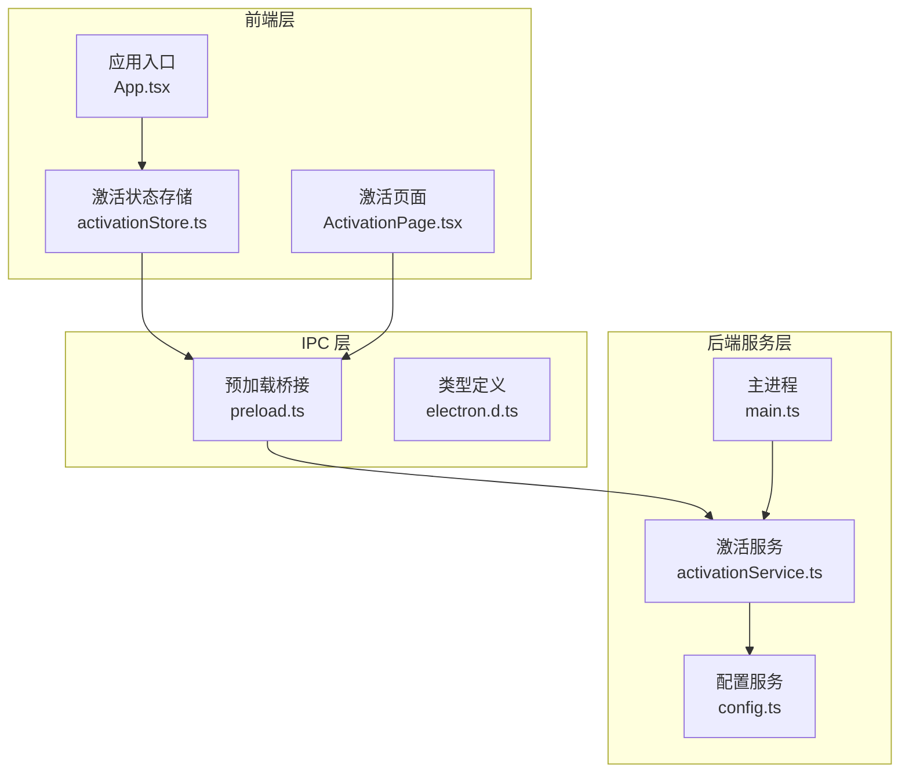

**图表来源**
- [activationStore.ts:1-45](file://src/stores/activationStore.ts#L1-L45)
- [activationService.ts:1-516](file://electron/services/activationService.ts#L1-L516)
- [preload.ts:1-454](file://electron/preload.ts#L1-L454)

**章节来源**
- [activationStore.ts:1-45](file://src/stores/activationStore.ts#L1-L45)
- [activationService.ts:1-516](file://electron/services/activationService.ts#L1-L516)
- [preload.ts:1-454](file://electron/preload.ts#L1-L454)

## 核心组件架构

激活状态管理系统采用分层架构设计，确保各组件职责清晰、耦合度低：

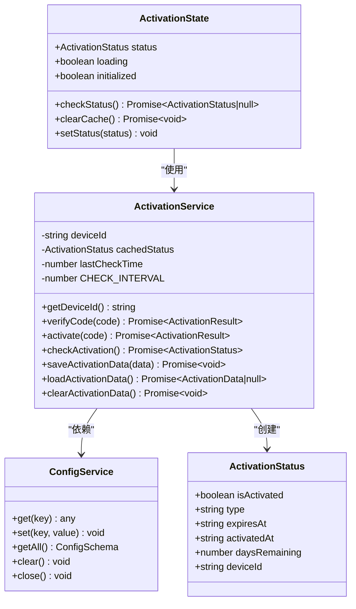

**图表来源**
- [activationStore.ts:4-13](file://src/stores/activationStore.ts#L4-L13)
- [activationService.ts:18-25](file://electron/services/activationService.ts#L18-L25)
- [activationService.ts:38-515](file://electron/services/activationService.ts#L38-L515)
- [config.ts:126-394](file://electron/services/config.ts#L126-L394)

**章节来源**
- [activationStore.ts:15-44](file://src/stores/activationStore.ts#L15-L44)
- [activationService.ts:38-515](file://electron/services/activationService.ts#L38-L515)

## 激活状态管理架构

激活状态管理系统的核心架构围绕三个关键概念构建：状态管理、验证机制和持久化策略。

### 状态管理模式

系统采用 React Zustand 状态管理库实现响应式状态更新：

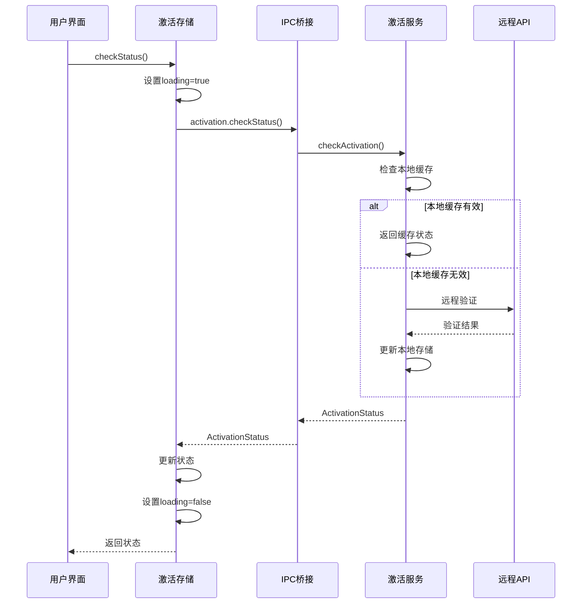

**图表来源**
- [activationStore.ts:20-33](file://src/stores/activationStore.ts#L20-L33)
- [activationService.ts:247-367](file://electron/services/activationService.ts#L247-L367)

### 验证机制设计

激活验证采用多层验证策略，确保系统的安全性和可靠性：

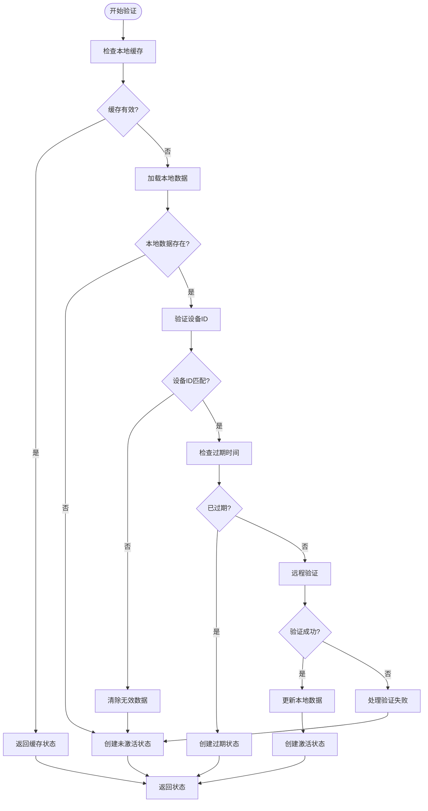

**图表来源**
- [activationService.ts:247-367](file://electron/services/activationService.ts#L247-L367)
- [activationService.ts:270-366](file://electron/services/activationService.ts#L270-L366)

**章节来源**
- [activationService.ts:247-367](file://electron/services/activationService.ts#L247-L367)

## 详细组件分析

### 激活存储组件 (activationStore.ts)

激活存储组件是前端状态管理的核心，负责协调整个激活流程的状态更新：

| 属性/方法 | 类型 | 描述 |
|-----------|------|------|
| status | ActivationStatus \| null | 当前激活状态 |
| loading | boolean | 验证过程中的加载状态 |
| initialized | boolean | 状态初始化完成标记 |
| checkStatus() | () => Promise<ActivationStatus \| null> | 检查激活状态的主要方法 |
| clearCache() | () => Promise<void> | 清除激活缓存 |
| setStatus() | (status) => void | 直接设置状态 |

**章节来源**
- [activationStore.ts:4-13](file://src/stores/activationStore.ts#L4-L13)
- [activationStore.ts:15-44](file://src/stores/activationStore.ts#L15-L44)

### 激活服务组件 (activationService.ts)

激活服务组件是后端逻辑的核心，实现了复杂的验证算法和安全机制：

#### 设备指纹生成

系统通过组合多种硬件特征生成唯一的设备标识符：

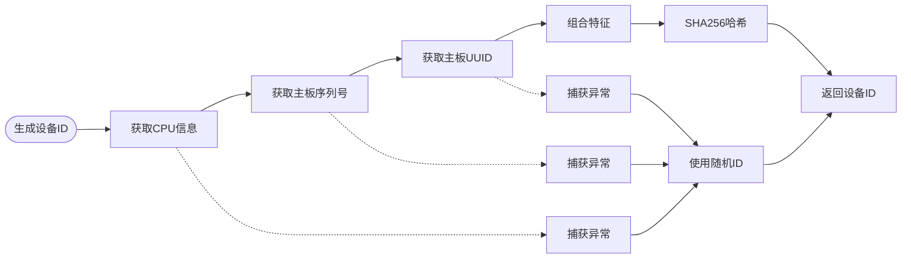

**图表来源**
- [activationService.ts:47-98](file://electron/services/activationService.ts#L47-L98)

#### 加密存储机制

激活数据采用 AES-256-CBC 加密算法进行安全存储：

| 组件 | 算法 | 密钥派生 | 描述 |
|------|------|----------|------|
| 加密 | AES-256-CBC | PBKDF2-SHA256 | 数据加密 |
| 签名 | HMAC-SHA256 | 固定密钥 | 数据完整性验证 |
| 哈希 | SHA256 | 设备ID | 设备指纹生成 |

**章节来源**
- [activationService.ts:103-129](file://electron/services/activationService.ts#L103-L129)
- [activationService.ts:134-145](file://electron/services/activationService.ts#L134-L145)
- [activationService.ts:414-476](file://electron/services/activationService.ts#L414-L476)

### 激活页面组件 (ActivationPage.tsx)

激活页面提供了用户友好的激活界面，支持多种交互模式：

| 功能特性 | 实现方式 | 用户体验 |
|----------|----------|----------|
| 实时状态检查 | 自动加载时检查 | 无缝体验 |
| 激活码输入 | 表单验证和格式化 | 直观易用 |
| 激活状态显示 | 状态卡片和图标 | 直观反馈 |
| 设备ID复制 | 剪贴板集成 | 方便调试 |
| 错误处理 | 消息提示和状态反馈 | 友好提示 |

**章节来源**
- [ActivationPage.tsx:12-34](file://src/pages/ActivationPage.tsx#L12-L34)
- [ActivationPage.tsx:36-61](file://src/pages/ActivationPage.tsx#L36-L61)
- [ActivationPage.tsx:63-69](file://src/pages/ActivationPage.tsx#L63-L69)

## 激活验证流程

激活验证流程是系统最核心的部分，采用了多阶段验证策略：

### 验证阶段详解

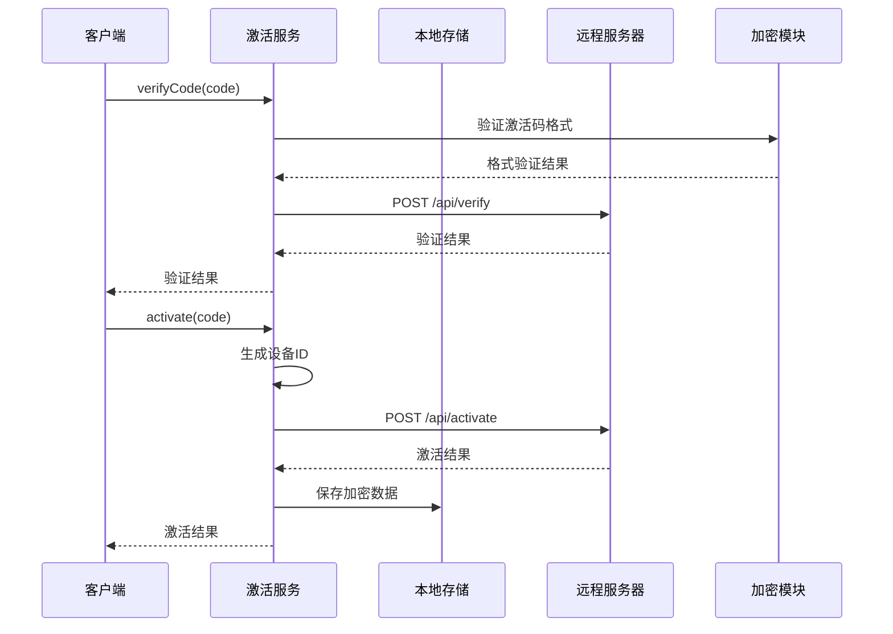

**图表来源**
- [activationService.ts:150-171](file://electron/services/activationService.ts#L150-L171)
- [activationService.ts:176-242](file://electron/services/activationService.ts#L176-L242)

### 状态检查流程

状态检查流程确保系统能够正确反映当前的激活状态：

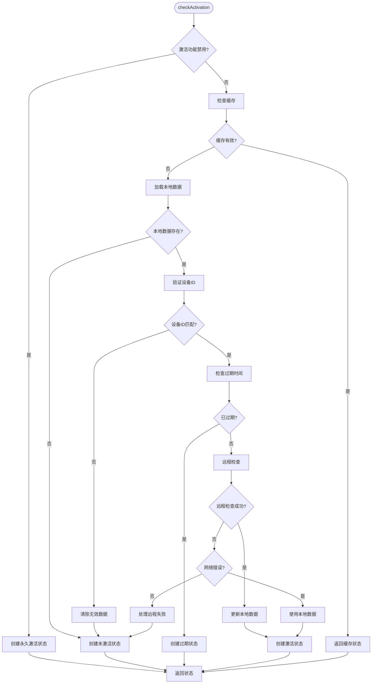

**图表来源**
- [activationService.ts:247-367](file://electron/services/activationService.ts#L247-L367)

**章节来源**
- [activationService.ts:150-242](file://electron/services/activationService.ts#L150-L242)
- [activationService.ts:247-367](file://electron/services/activationService.ts#L247-L367)

## 安全机制集成

激活系统集成了多层次的安全机制，确保软件免受未授权使用：

### 防篡改机制

系统通过多种方式防止激活数据被篡改：

#### 数据签名验证

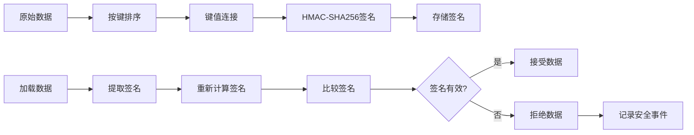

**图表来源**
- [activationService.ts:134-145](file://electron/services/activationService.ts#L134-L145)
- [activationService.ts:464-469](file://electron/services/activationService.ts#L464-L469)

#### 设备指纹绑定

系统将激活状态与特定设备绑定，防止跨设备使用：

| 设备特征 | 重要性 | 用途 |
|----------|--------|------|
| CPU型号 | 高 | 基础硬件标识 |
| 主板序列号 | 中 | 硬件唯一性 |
| 主板UUID | 高 | 最可靠标识 |
| 操作系统信息 | 低 | 辅助验证 |

### 远程激活检查

系统支持实时远程验证，确保激活状态的时效性：

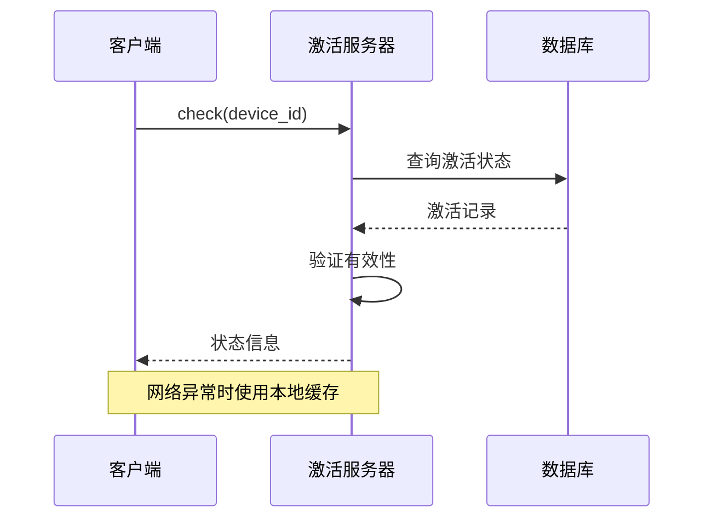

**图表来源**
- [activationService.ts:306-320](file://electron/services/activationService.ts#L306-L320)

**章节来源**
- [activationService.ts:134-145](file://electron/services/activationService.ts#L134-L145)
- [activationService.ts:414-476](file://electron/services/activationService.ts#L414-L476)

## 应用启动流程集成

激活状态在应用启动流程中扮演关键角色，影响应用的可用性和功能权限：

### 启动时激活检查

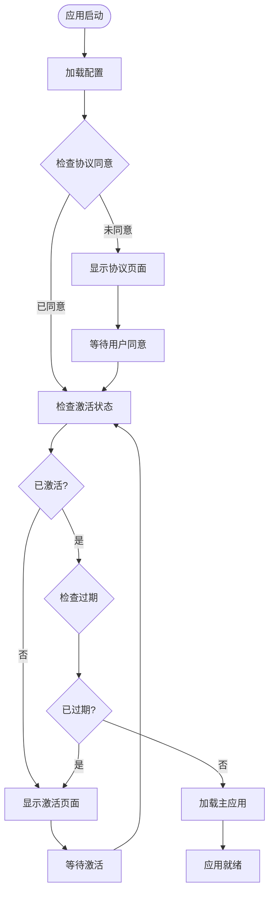

**图表来源**
- [App.tsx:122-130](file://src/App.tsx#L122-L130)
- [App.tsx:111-114](file://src/App.tsx#L111-L114)

### 功能权限控制

激活状态直接影响应用功能的可用性：

| 激活状态 | 功能权限 | 用户体验 |
|----------|----------|----------|
| 已激活 | 完全功能 | 正常使用 |
| 未激活 | 有限功能 | 显示激活提示 |
| 已过期 | 基础功能 | 提示续费 |
| 离线模式 | 本地功能 | 有限使用 |

**章节来源**
- [App.tsx:121-130](file://src/App.tsx#L121-L130)
- [App.tsx:111-114](file://src/App.tsx#L111-L114)

## 数据存储策略

激活系统采用分布式存储策略，确保数据的安全性和可靠性：

### 存储层次结构

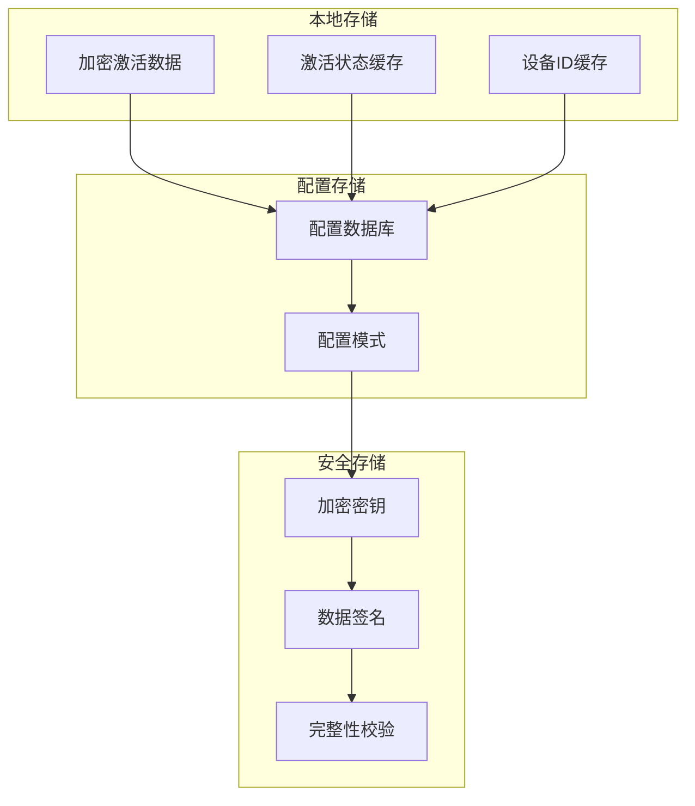

**图表来源**
- [config.ts:6-80](file://electron/services/config.ts#L6-L80)
- [config.ts:126-394](file://electron/services/config.ts#L126-L394)

### 加密存储实现

系统采用多层加密策略保护激活数据：

| 数据类型 | 加密算法 | 密钥管理 | 存储位置 |
|----------|----------|----------|----------|
| 激活数据 | AES-256-CBC | PBKDF2派生 | 配置数据库 |
| 设备ID | SHA256哈希 | 固定密钥 | 内存缓存 |
| 签名数据 | HMAC-SHA256 | 固定密钥 | 内存缓存 |
| 配置项 | 明文存储 | 应用配置 | 配置数据库 |

**章节来源**
- [activationService.ts:414-476](file://electron/services/activationService.ts#L414-L476)
- [config.ts:126-394](file://electron/services/config.ts#L126-L394)

## 性能考虑

激活系统在设计时充分考虑了性能优化，确保最小化对用户体验的影响：

### 缓存策略

系统采用智能缓存机制减少网络请求：

| 缓存类型 | 缓存时间 | 缓存大小 | 命中率 |
|----------|----------|----------|--------|
| 激活状态 | 5分钟 | 单次状态 | 高 |
| 设备ID | 永久 | 单次ID | 非常高 |
| 签名验证 | 1小时 | 有限数量 | 高 |
| 加密密钥 | 10分钟 | 单次密钥 | 高 |

### 网络优化

系统通过以下方式优化网络性能：

- **批量请求**：合并多个验证请求
- **异步处理**：避免阻塞主线程
- **超时控制**：设置合理的超时时间
- **重试机制**：自动重试失败的请求

## 故障排除指南

激活系统提供了完善的错误处理和故障排除机制：

### 常见问题及解决方案

| 问题类型 | 症状 | 解决方案 | 预防措施 |
|----------|------|----------|----------|
| 网络连接失败 | 激活验证超时 | 检查网络连接，稍后重试 | 设置网络超时和重试 |
| 设备ID不匹配 | 激活状态异常 | 清除缓存，重新激活 | 实施设备ID验证 |
| 数据损坏 | 激活信息丢失 | 恢复备份，重新激活 | 实施数据完整性检查 |
| 服务器错误 | 验证失败 | 稍后重试，联系支持 | 实施降级模式 |

### 错误处理流程

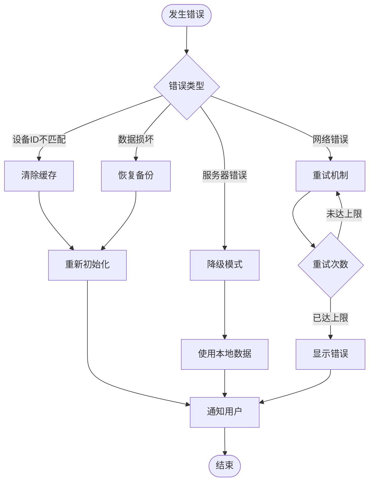

**图表来源**
- [activationService.ts:356-366](file://electron/services/activationService.ts#L356-L366)

**章节来源**
- [activationService.ts:356-366](file://electron/services/activationService.ts#L356-L366)

## 结论

CipherTalk 的激活状态管理系统是一个设计精良、安全可靠的软件授权解决方案。通过采用多层验证、分布式存储和智能缓存策略，系统在确保软件安全的同时，为用户提供了流畅的使用体验。

系统的主要优势包括：

1. **安全性**：多层次的安全机制有效防止未授权使用
2. **可靠性**：智能缓存和降级模式确保系统稳定运行
3. **用户体验**：简洁直观的界面和流畅的交互流程
4. **可维护性**：清晰的架构设计便于后续维护和扩展

未来可以考虑的改进方向包括：增强移动端支持、优化网络性能、增加更多验证选项等。总体而言，这是一个高质量的激活管理系统实现，为 CipherTalk 的商业化运营提供了坚实的技术基础。