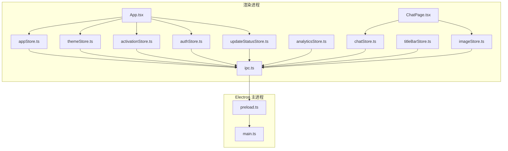
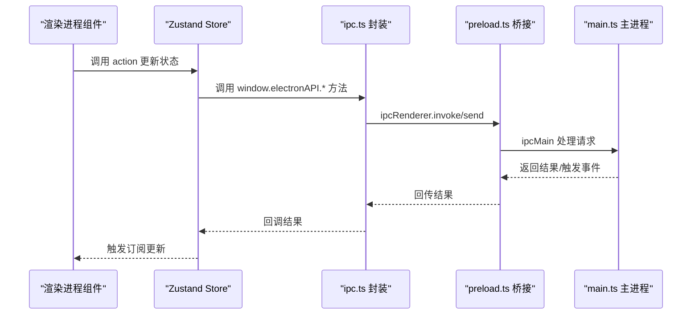
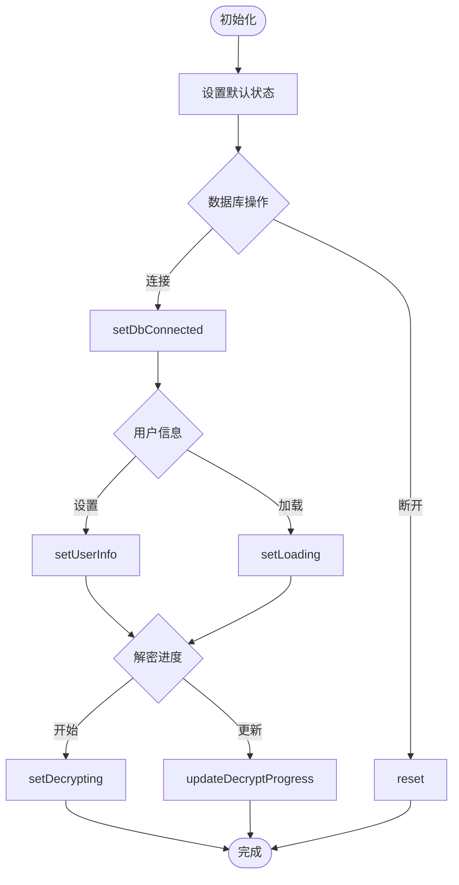
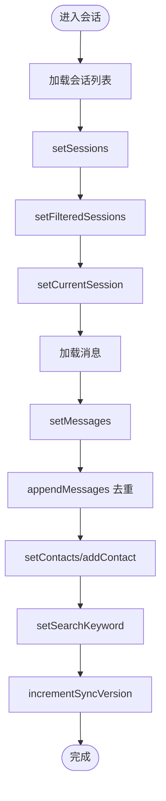
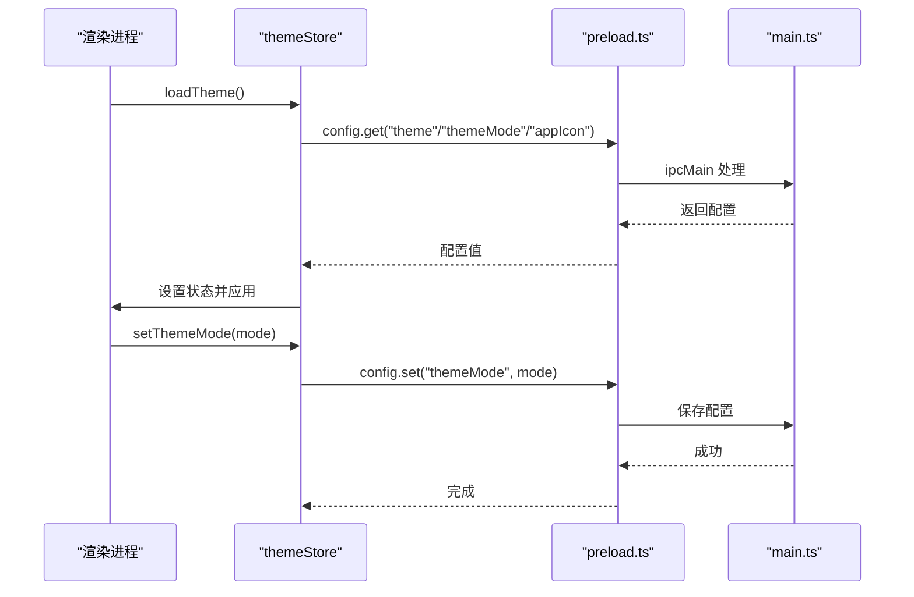
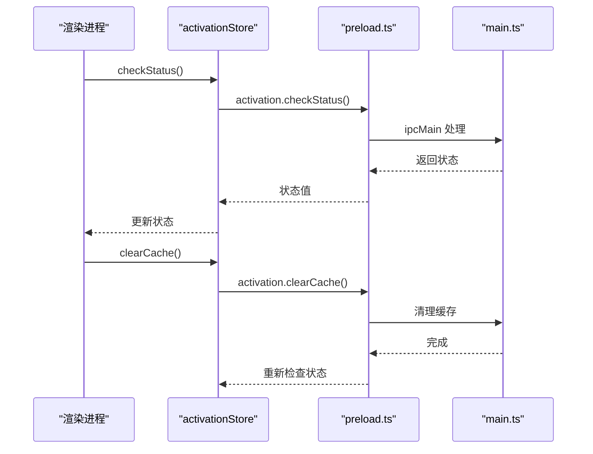
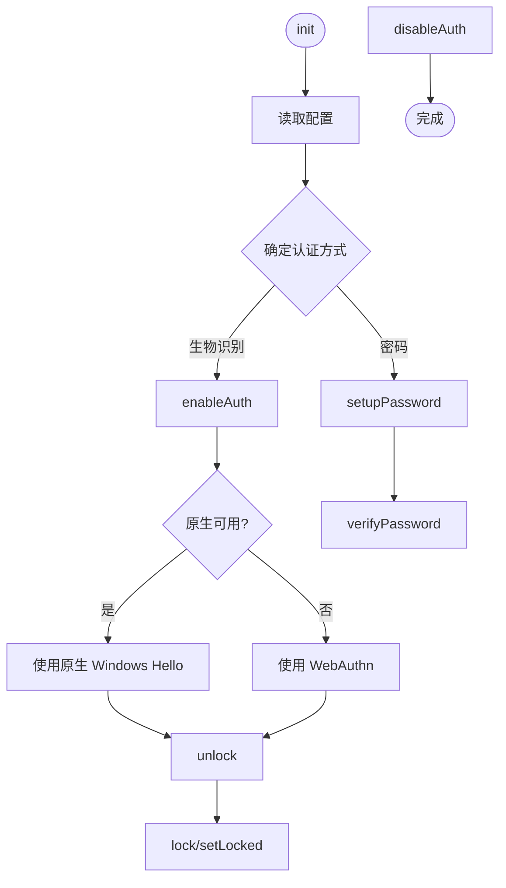
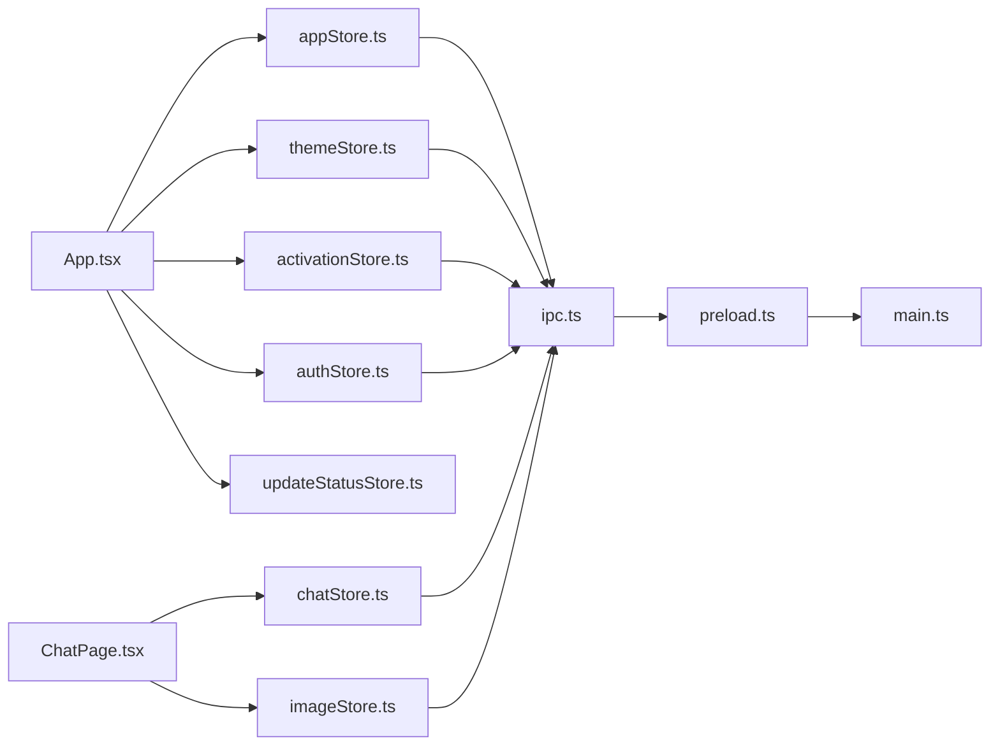

# 状态管理策略

<cite>
**本文引用的文件**
- [appStore.ts](file://src/stores/appStore.ts)
- [chatStore.ts](file://src/stores/chatStore.ts)
- [themeStore.ts](file://src/stores/themeStore.ts)
- [activationStore.ts](file://src/stores/activationStore.ts)
- [authStore.ts](file://src/stores/authStore.ts)
- [analyticsStore.ts](file://src/stores/analyticsStore.ts)
- [imageStore.ts](file://src/stores/imageStore.ts)
- [titleBarStore.ts](file://src/stores/titleBarStore.ts)
- [updateStatusStore.ts](file://src/stores/updateStatusStore.ts)
- [models.ts](file://src/types/models.ts)
- [main.ts](file://electron/main.ts)
- [preload.ts](file://electron/preload.ts)
- [ipc.ts](file://src/services/ipc.ts)
- [App.tsx](file://src/App.tsx)
- [ChatPage.tsx](file://src/pages/ChatPage.tsx)
</cite>

## 目录
1. [引言](#引言)
2. [项目结构](#项目结构)
3. [核心组件](#核心组件)
4. [架构总览](#架构总览)
5. [详细组件分析](#详细组件分析)
6. [依赖分析](#依赖分析)
7. [性能考虑](#性能考虑)
8. [故障排查指南](#故障排查指南)
9. [结论](#结论)
10. [附录](#附录)

## 引言
本文件面向 CipherTalk 的前端状态管理策略，聚焦于 Zustand 状态库的使用与实践，系统阐述以下内容：
- Store 设计模式与状态结构设计
- Action 函数实现与异步状态更新
- 状态分类策略：应用状态（appStore）、聊天状态（chatStore）、主题状态（themeStore）、激活状态（activationStore）等
- 状态同步机制：Electron 主进程通信、IPC 状态同步、状态持久化
- 状态订阅模式：组件状态订阅、状态变更监听、异步状态更新
- 性能优化：状态分片、选择器优化、状态缓存策略
- 状态流转图与组件状态依赖关系图

## 项目结构
CipherTalk 的状态管理采用“按功能域划分”的 Store 组织方式，每个 Store 聚焦单一职责，通过 Electron IPC 与主进程交互，实现跨进程状态同步与持久化。

图表来源
- [App.tsx:1-200](file://src/App.tsx#L1-L200)
- [ChatPage.tsx:1-200](file://src/pages/ChatPage.tsx#L1-L200)
- [appStore.ts:1-97](file://src/stores/appStore.ts#L1-L97)
- [chatStore.ts:1-146](file://src/stores/chatStore.ts#L1-L146)
- [themeStore.ts:1-146](file://src/stores/themeStore.ts#L1-L146)
- [activationStore.ts:1-45](file://src/stores/activationStore.ts#L1-L45)
- [authStore.ts:1-271](file://src/stores/authStore.ts#L1-L271)
- [analyticsStore.ts:1-71](file://src/stores/analyticsStore.ts#L1-L71)
- [imageStore.ts:1-174](file://src/stores/imageStore.ts#L1-L174)
- [titleBarStore.ts:1-13](file://src/stores/titleBarStore.ts#L1-L13)
- [updateStatusStore.ts:1-28](file://src/stores/updateStatusStore.ts#L1-L28)
- [ipc.ts:1-38](file://src/services/ipc.ts#L1-L38)
- [main.ts:1-200](file://electron/main.ts#L1-L200)
- [preload.ts:1-454](file://electron/preload.ts#L1-L454)

章节来源
- [App.tsx:1-200](file://src/App.tsx#L1-L200)
- [main.ts:1-200](file://electron/main.ts#L1-L200)
- [preload.ts:1-454](file://electron/preload.ts#L1-L454)

## 核心组件
本节概述各 Store 的职责与关键字段/方法，帮助快速理解状态域划分与职责边界。

- 应用状态（appStore）
  - 职责：数据库连接状态、用户信息、全局加载与解密进度
  - 关键字段：数据库连接、数据库路径、我的 wxid、用户信息、加载状态、解密状态
  - 关键动作：设置连接、设置用户信息、设置加载、设置解密、更新进度、重置
- 聊天状态（chatStore）
  - 职责：会话列表、消息列表、联系人缓存、搜索、同步版本
  - 关键字段：连接状态、会话列表、当前会话、消息列表、联系人 Map、搜索关键词、同步版本
  - 关键动作：设置连接、设置会话、设置消息、追加消息、设置联系人、搜索、递增同步版本、重置
- 主题状态（themeStore）
  - 职责：主题 ID、主题模式、应用图标、主题持久化与加载
  - 关键字段：当前主题、主题模式、应用图标、是否已加载
  - 关键动作：设置主题、设置主题模式、设置应用图标、切换主题模式、加载主题
- 激活状态（activationStore）
  - 职责：激活状态检查、缓存清理、状态设置
  - 关键字段：状态、加载中、是否初始化
  - 关键动作：检查状态、清理缓存、设置状态
- 认证状态（authStore）
  - 职责：生物识别/密码认证、锁定/解锁、状态持久化
  - 关键字段：是否启用认证、是否锁定、是否已认证、凭证 ID、认证方式
  - 关键动作：初始化、启用认证、禁用认证、设置密码、验证密码、解锁、上锁、设置锁定
- 分析状态（analyticsStore）
  - 职责：聊天统计、联系人排行、时间分布、加载状态
  - 关键字段：统计数据、排行、时间分布、是否已加载、最后加载时间
  - 关键动作：设置统计、设置排行、设置时间分布、标记已加载、清空缓存
- 图片状态（imageStore）
  - 职责：图片列表、目录、扫描状态、统计
  - 关键字段：图片列表、目录、选中目录、扫描状态、错误信息、统计
  - 关键动作：设置目录、设置选中目录、设置扫描状态、设置扫描完成、设置错误、添加图片、清空、更新图片、更新统计、重置
- 标题栏状态（titleBarStore）
  - 职责：右侧内容动态注入
  - 关键字段：右侧内容、设置右侧内容
- 更新状态（updateStatusStore）
  - 职责：更新状态与日志
  - 关键字段：是否更新中、日志列表、设置更新中、添加日志

章节来源
- [appStore.ts:1-97](file://src/stores/appStore.ts#L1-L97)
- [chatStore.ts:1-146](file://src/stores/chatStore.ts#L1-L146)
- [themeStore.ts:1-146](file://src/stores/themeStore.ts#L1-L146)
- [activationStore.ts:1-45](file://src/stores/activationStore.ts#L1-L45)
- [authStore.ts:1-271](file://src/stores/authStore.ts#L1-L271)
- [analyticsStore.ts:1-71](file://src/stores/analyticsStore.ts#L1-L71)
- [imageStore.ts:1-174](file://src/stores/imageStore.ts#L1-L174)
- [titleBarStore.ts:1-13](file://src/stores/titleBarStore.ts#L1-L13)
- [updateStatusStore.ts:1-28](file://src/stores/updateStatusStore.ts#L1-L28)

## 架构总览
Zustand Store 通过 Electron IPC 与主进程通信，实现跨进程状态同步与持久化。渲染进程通过封装的 IPC 服务调用主进程能力，并在事件回调中更新对应 Store。

图表来源
- [ipc.ts:1-38](file://src/services/ipc.ts#L1-L38)
- [preload.ts:1-454](file://electron/preload.ts#L1-L454)
- [main.ts:1-200](file://electron/main.ts#L1-L200)

章节来源
- [ipc.ts:1-38](file://src/services/ipc.ts#L1-L38)
- [preload.ts:1-454](file://electron/preload.ts#L1-L454)
- [main.ts:1-200](file://electron/main.ts#L1-L200)

## 详细组件分析

### 应用状态（appStore）分析
- 设计要点
  - 使用 create 定义状态与动作，集中管理数据库连接、用户信息、加载与解密进度
  - 动作函数采用 set 与派生 set 组合，保证状态原子更新
- 关键流程
  - 初始化：设置默认状态
  - 连接数据库：setDbConnected
  - 设置用户信息：setUserInfo
  - 全局加载：setLoading
  - 解密进度：setDecrypting、updateDecryptProgress
  - 重置：reset

图表来源
- [appStore.ts:40-95](file://src/stores/appStore.ts#L40-L95)

章节来源
- [appStore.ts:1-97](file://src/stores/appStore.ts#L1-L97)

### 聊天状态（chatStore）分析
- 设计要点
  - 会话与消息分离管理，支持函数式更新与去重插入
  - 联系人使用 Map 缓存，提升查找效率
  - 同步版本用于触发 UI 增量检查
- 关键流程
  - 会话：setSessions、setFilteredSessions、setCurrentSession
  - 消息：setMessages、appendMessages（基于多维 Key 去重）
  - 联系人：setContacts、addContact
  - 搜索：setSearchKeyword
  - 同步：incrementSyncVersion
  - 重置：reset

图表来源
- [chatStore.ts:51-145](file://src/stores/chatStore.ts#L51-L145)

章节来源
- [chatStore.ts:1-146](file://src/stores/chatStore.ts#L1-L146)
- [models.ts:1-109](file://src/types/models.ts#L1-L109)

### 主题状态（themeStore）分析
- 设计要点
  - 主题与模式持久化至主进程配置，加载时从主进程读取
  - 支持切换主题模式与应用图标，并即时同步到主进程
- 关键流程
  - 初始化：loadTheme
  - 设置主题：setTheme
  - 设置模式：setThemeMode
  - 设置图标：setAppIcon
  - 切换模式：toggleThemeMode

图表来源
- [themeStore.ts:79-140](file://src/stores/themeStore.ts#L79-L140)
- [preload.ts:4-11](file://electron/preload.ts#L4-L11)
- [main.ts:118-123](file://electron/main.ts#L118-L123)

章节来源
- [themeStore.ts:1-146](file://src/stores/themeStore.ts#L1-L146)
- [preload.ts:1-454](file://electron/preload.ts#L1-L454)
- [main.ts:1-200](file://electron/main.ts#L1-L200)

### 激活状态（activationStore）分析
- 设计要点
  - 通过主进程激活服务检查设备激活状态
  - 支持清理缓存并重新检查
- 关键流程
  - 检查状态：checkStatus
  - 清理缓存：clearCache（内部再次检查）
  - 设置状态：setStatus

图表来源
- [activationStore.ts:15-44](file://src/stores/activationStore.ts#L15-L44)
- [preload.ts:341-349](file://electron/preload.ts#L341-L349)
- [main.ts:1-200](file://electron/main.ts#L1-L200)

章节来源
- [activationStore.ts:1-45](file://src/stores/activationStore.ts#L1-L45)
- [preload.ts:1-454](file://electron/preload.ts#L1-L454)

### 认证状态（authStore）分析
- 设计要点
  - 支持原生 Windows Hello 与 WebAuthn 双通道认证
  - 密码哈希与盐值持久化，避免互斥
  - 解锁流程根据认证方式分支处理
- 关键流程
  - 初始化：init（读取配置并确定认证方式）
  - 启用认证：enableAuth（优先原生，回退 WebAuthn）
  - 设置密码：setupPassword
  - 验证密码：verifyPassword
  - 解锁：unlock（原生或 WebAuthn）
  - 上锁/设置锁定：lock/setLocked
  - 禁用认证：disableAuth

图表来源
- [authStore.ts:52-270](file://src/stores/authStore.ts#L52-L270)

章节来源
- [authStore.ts:1-271](file://src/stores/authStore.ts#L1-L271)

### 分析状态（analyticsStore）与图片状态（imageStore）分析
- 分析状态（analyticsStore）
  - 管理聊天统计、联系人排行、时间分布与加载状态
  - 动作：设置统计、设置排行、设置时间分布、标记已加载、清空缓存
- 图片状态（imageStore）
  - 管理图片列表、目录、扫描状态与统计
  - 动作：设置目录、设置选中目录、设置扫描状态、添加图片、更新图片、更新统计、重置
  - 图片质量检测：基于文件名、大小、路径层级判断原图/缩略图

章节来源
- [analyticsStore.ts:1-71](file://src/stores/analyticsStore.ts#L1-L71)
- [imageStore.ts:1-174](file://src/stores/imageStore.ts#L1-L174)

### 标题栏状态（titleBarStore）与更新状态（updateStatusStore）
- 标题栏状态（titleBarStore）
  - 管理标题栏右侧内容的动态注入
- 更新状态（updateStatusStore）
  - 管理更新状态与日志队列，限制日志条数

章节来源
- [titleBarStore.ts:1-13](file://src/stores/titleBarStore.ts#L1-L13)
- [updateStatusStore.ts:1-28](file://src/stores/updateStatusStore.ts#L1-L28)

## 依赖分析
- 组件对 Store 的依赖
  - App.tsx 依赖 appStore、themeStore、activationStore、authStore、updateStatusStore
  - ChatPage.tsx 依赖 chatStore、imageStore
- Store 对 IPC 的依赖
  - themeStore、activationStore、authStore、chatStore、analyticsStore、imageStore 通过 ipc.ts 调用 window.electronAPI.*
- IPC 对主进程的依赖
  - preload.ts 暴露 electronAPI，main.ts 注册 ipcMain 处理器

图表来源
- [App.tsx:1-200](file://src/App.tsx#L1-L200)
- [ChatPage.tsx:1-200](file://src/pages/ChatPage.tsx#L1-L200)
- [ipc.ts:1-38](file://src/services/ipc.ts#L1-L38)
- [preload.ts:1-454](file://electron/preload.ts#L1-L454)
- [main.ts:1-200](file://electron/main.ts#L1-L200)

章节来源
- [App.tsx:1-200](file://src/App.tsx#L1-L200)
- [ChatPage.tsx:1-200](file://src/pages/ChatPage.tsx#L1-L200)
- [ipc.ts:1-38](file://src/services/ipc.ts#L1-L38)
- [preload.ts:1-454](file://electron/preload.ts#L1-L454)
- [main.ts:1-200](file://electron/main.ts#L1-L200)

## 性能考虑
- 状态分片
  - 将应用状态、聊天状态、主题状态、激活状态、认证状态、分析状态、图片状态、标题栏状态、更新状态拆分为独立 Store，降低无关更新带来的重渲染
- 选择器优化
  - 使用函数式 set 与局部更新，避免不必要的对象重建
  - chatStore 的 appendMessages 基于多维 Key 去重，减少重复渲染
- 状态缓存策略
  - chatStore 使用 Map 缓存联系人，提高查找效率
  - imageStore 在添加图片时一次性计算统计，避免多次遍历
- 订阅粒度
  - 组件仅订阅所需字段，减少全局订阅范围
- 异步更新批处理
  - 通过主进程事件批量推送（如会话更新），统一在 Store 中进行状态合并

## 故障排查指南
- 主题加载失败
  - 现象：主题未生效或加载异常
  - 排查：确认 preload.ts 中 config.get 调用与 main.ts 配置服务一致；检查 setThemeMode/setTheme 的异常捕获
- 激活状态检查失败
  - 现象：无法正确显示激活状态
  - 排查：检查 activation.checkStatus 的 IPC 调用链与主进程处理器；确认 finally 分支是否正确恢复 loading 状态
- 认证失败
  - 现象：启用/解锁失败或错误提示
  - 排查：区分原生与 WebAuthn 路径，检查友好错误消息映射；确认密码哈希/盐值与凭证 ID 的互斥设置
- 聊天消息重复
  - 现象：消息列表出现重复
  - 排查：确认 appendMessages 的多维 Key 去重逻辑是否覆盖所有字段；检查服务端推送顺序
- 图片质量误判
  - 现象：原图/缩略图识别不准确
  - 排查：核对 detectImageQuality 的文件名、大小与路径层级阈值

章节来源
- [themeStore.ts:118-139](file://src/stores/themeStore.ts#L118-L139)
- [activationStore.ts:20-33](file://src/stores/activationStore.ts#L20-L33)
- [authStore.ts:28-50](file://src/stores/authStore.ts#L28-L50)
- [chatStore.ts:89-110](file://src/stores/chatStore.ts#L89-L110)
- [imageStore.ts:22-48](file://src/stores/imageStore.ts#L22-L48)

## 结论
CipherTalk 的状态管理以 Zustand 为核心，结合 Electron IPC 实现跨进程状态同步与持久化。通过清晰的状态域划分、严格的动作设计与完善的异步更新机制，系统在复杂业务场景下仍保持良好的可维护性与性能表现。建议持续关注订阅粒度与缓存策略，进一步优化大型列表与高频更新场景下的渲染性能。

## 附录
- 状态分类策略总结
  - 应用状态（appStore）：数据库连接、用户信息、加载与解密进度
  - 聊天状态（chatStore）：会话、消息、联系人、搜索、同步版本
  - 主题状态（themeStore）：主题、模式、图标、持久化与加载
  - 激活状态（activationStore）：激活检查、缓存清理、状态设置
  - 认证状态（authStore）：生物识别/密码、锁定/解锁、状态持久化
  - 分析状态（analyticsStore）：统计、排行、时间分布、加载状态
  - 图片状态（imageStore）：图片列表、目录、扫描状态、统计
  - 标题栏状态（titleBarStore）：右侧内容注入
  - 更新状态（updateStatusStore）：更新状态与日志
- 状态同步机制
  - 渲染进程通过 ipc.ts 调用 window.electronAPI.*，主进程在 preload.ts 暴露接口并在 main.ts 注册处理器
- 状态订阅模式
  - 组件通过 useStore 订阅状态；主进程事件通过 App.tsx 监听并更新相应 Store