# 聊天状态管理

<cite>
**本文档引用的文件**
- [chatStore.ts](file://src/stores/chatStore.ts)
- [models.ts](file://src/types/models.ts)
- [chatService.ts](file://electron/services/chatService.ts)
- [ChatPage.tsx](file://src/pages/ChatPage.tsx)
- [database.ts](file://electron/services/database.ts)
- [lruCache.ts](file://src/utils/lruCache.ts)
</cite>

## 目录
1. [简介](#简介)
2. [项目结构](#项目结构)
3. [核心组件](#核心组件)
4. [架构概览](#架构概览)
5. [详细组件分析](#详细组件分析)
6. [依赖关系分析](#依赖关系分析)
7. [性能考虑](#性能考虑)
8. [故障排除指南](#故障排除指南)
9. [结论](#结论)

## 简介

CipherTalk 的聊天状态管理系统基于 Zustand 库构建，提供了完整的聊天应用状态管理解决方案。该系统采用分层架构设计，将连接状态、会话管理、消息处理、联系人缓存等功能模块化，通过统一的状态存储实现高效的数据流管理。

本系统的核心优势在于：
- **实时性**：支持增量消息推送和自动同步
- **性能优化**：智能去重算法和缓存机制
- **用户体验**：平滑的滚动加载和自动滚动功能
- **数据完整性**：严格的去重策略确保消息一致性

## 项目结构

聊天状态管理相关的项目结构如下：

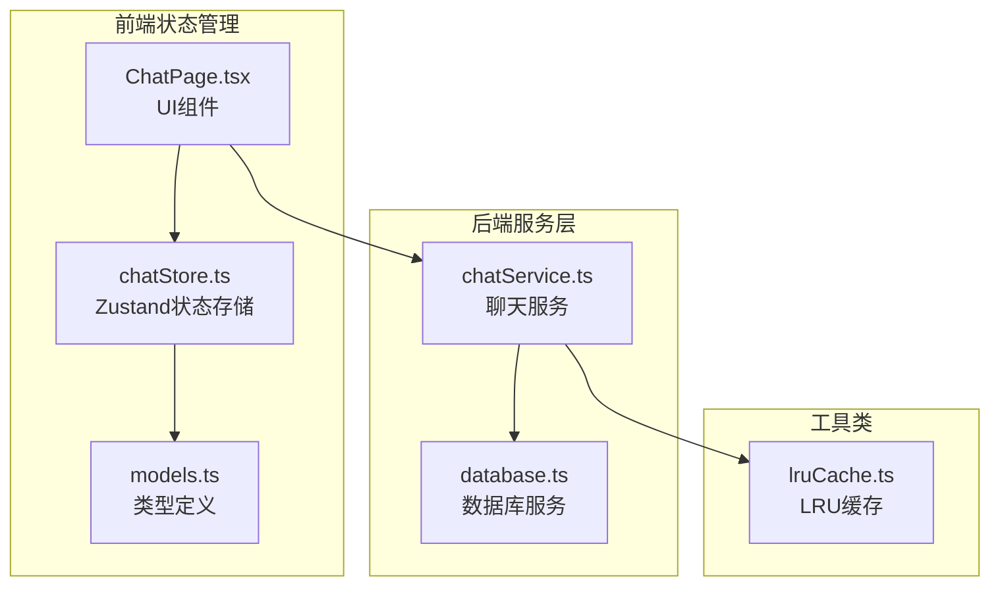

**图表来源**
- [chatStore.ts:1-146](file://src/stores/chatStore.ts#L1-L146)
- [models.ts:1-109](file://src/types/models.ts#L1-L109)
- [chatService.ts:1-800](file://electron/services/chatService.ts#L1-L800)

**章节来源**
- [chatStore.ts:1-146](file://src/stores/chatStore.ts#L1-L146)
- [models.ts:1-109](file://src/types/models.ts#L1-L109)

## 核心组件

### 状态接口定义

聊天状态管理的核心接口定义了完整的状态结构：

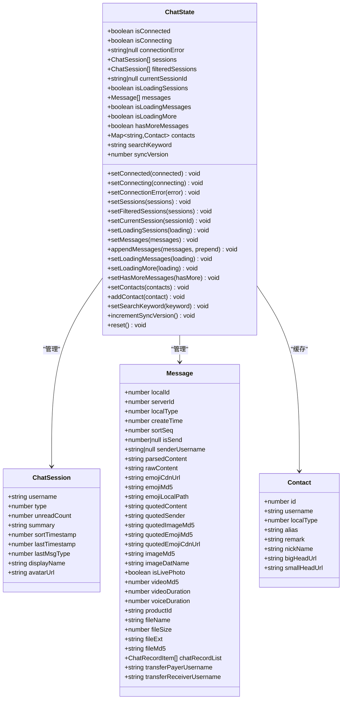

**图表来源**
- [chatStore.ts:4-49](file://src/stores/chatStore.ts#L4-L49)
- [models.ts:2-24](file://src/types/models.ts#L2-L24)
- [models.ts:37-74](file://src/types/models.ts#L37-L74)
- [models.ts:15-24](file://src/types/models.ts#L15-L24)

### 状态初始化配置

系统提供了完整的默认状态初始化，确保应用启动时的正确状态：

| 状态字段 | 默认值 | 用途 |
|---------|--------|------|
| isConnected | false | 连接状态标识 |
| isConnecting | false | 连接中状态 |
| connectionError | null | 连接错误信息 |
| sessions | [] | 会话列表 |
| filteredSessions | [] | 过滤后的会话列表 |
| currentSessionId | null | 当前选中会话ID |
| isLoadingSessions | false | 会话加载状态 |
| messages | [] | 消息列表 |
| isLoadingMessages | false | 消息加载状态 |
| isLoadingMore | false | 更多消息加载状态 |
| hasMoreMessages | true | 是否还有更多消息 |
| contacts | new Map() | 联系人缓存 |
| searchKeyword | '' | 搜索关键词 |
| syncVersion | 0 | 同步版本控制 |

**章节来源**
- [chatStore.ts:51-65](file://src/stores/chatStore.ts#L51-L65)

## 架构概览

### 系统架构图

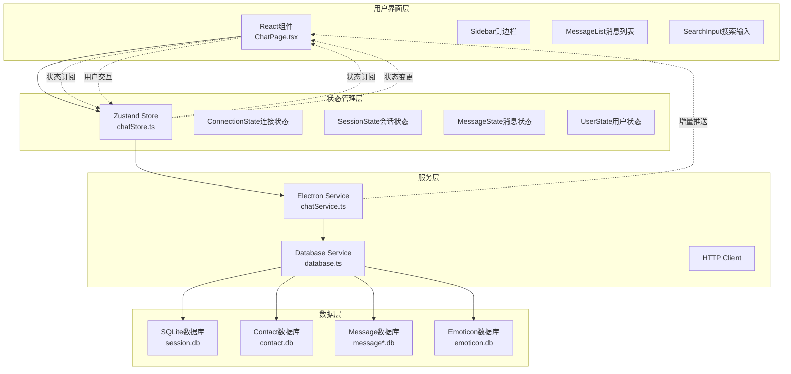

**图表来源**
- [chatStore.ts:1-146](file://src/stores/chatStore.ts#L1-L146)
- [chatService.ts:110-152](file://electron/services/chatService.ts#L110-L152)
- [ChatPage.tsx:210-244](file://src/pages/ChatPage.tsx#L210-L244)

### 状态流转流程

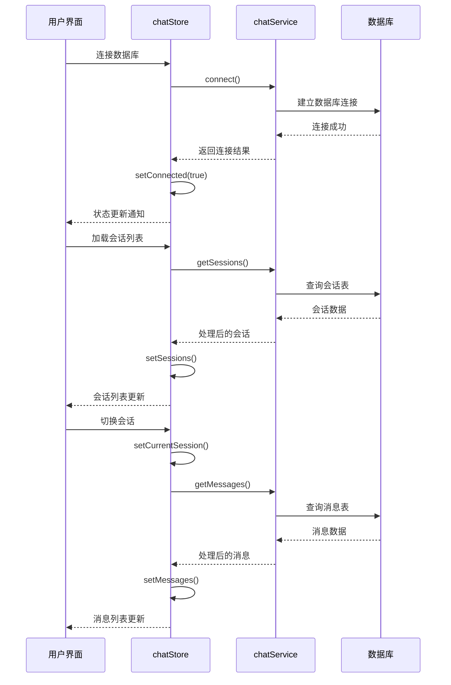

**图表来源**
- [chatStore.ts:67-81](file://src/stores/chatStore.ts#L67-L81)
- [chatService.ts:451-520](file://electron/services/chatService.ts#L451-L520)
- [ChatPage.tsx:376-393](file://src/pages/ChatPage.tsx#L376-L393)

## 详细组件分析

### 连接状态管理

#### 连接状态控制函数

连接状态管理提供了三个核心函数来控制数据库连接状态：

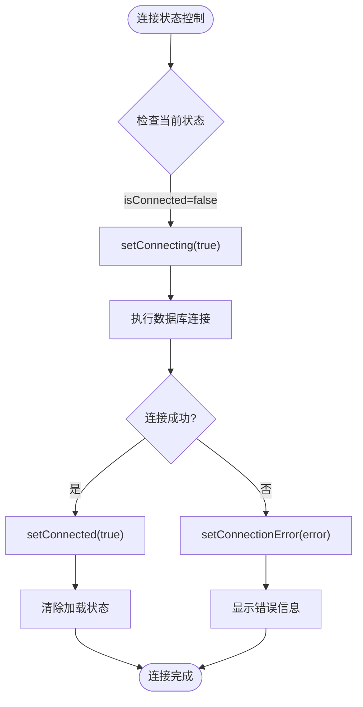

**图表来源**
- [chatStore.ts:67-69](file://src/stores/chatStore.ts#L67-L69)
- [ChatPage.tsx:376-393](file://src/pages/ChatPage.tsx#L376-L393)

#### 连接状态生命周期

连接状态管理遵循严格的生命周期：

1. **初始化阶段**：`isConnected=false`, `isConnecting=false`, `connectionError=null`
2. **连接中阶段**：`isConnecting=true`，显示连接进度
3. **连接成功**：`isConnected=true`，关闭连接中状态
4. **连接失败**：`connectionError=错误信息`，显示错误提示
5. **断开连接**：重置所有连接状态

**章节来源**
- [chatStore.ts:52-54](file://src/stores/chatStore.ts#L52-L54)
- [chatStore.ts:67-69](file://src/stores/chatStore.ts#L67-L69)

### 会话列表管理

#### 会话状态控制

会话列表管理提供了完整的会话状态控制机制：

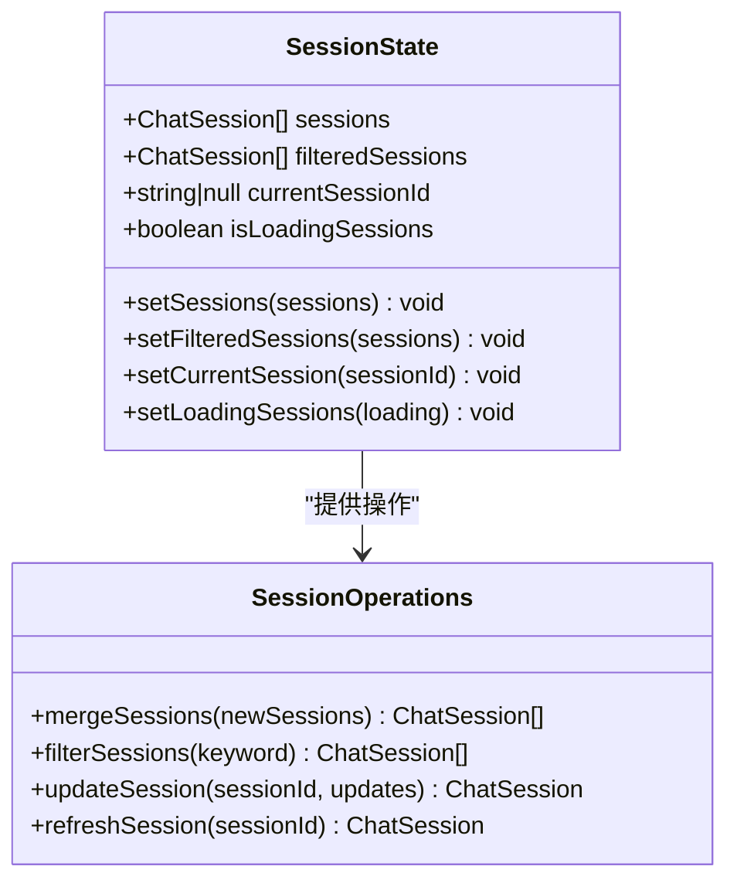

**图表来源**
- [chatStore.ts:11-14](file://src/stores/chatStore.ts#L11-L14)
- [chatStore.ts:35-38](file://src/stores/chatStore.ts#L35-L38)

#### 会话智能合并算法

系统实现了智能的会话合并算法，避免不必要的UI重渲染：

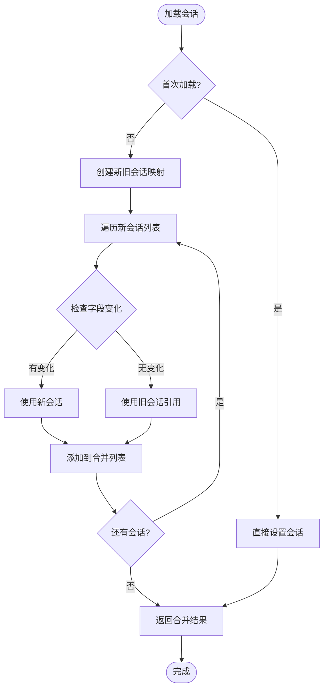

**图表来源**
- [ChatPage.tsx:402-440](file://src/pages/ChatPage.tsx#L402-L440)

**章节来源**
- [ChatPage.tsx:396-447](file://src/pages/ChatPage.tsx#L396-L447)

### 消息状态管理

#### 消息处理机制

消息状态管理提供了灵活的消息处理能力：

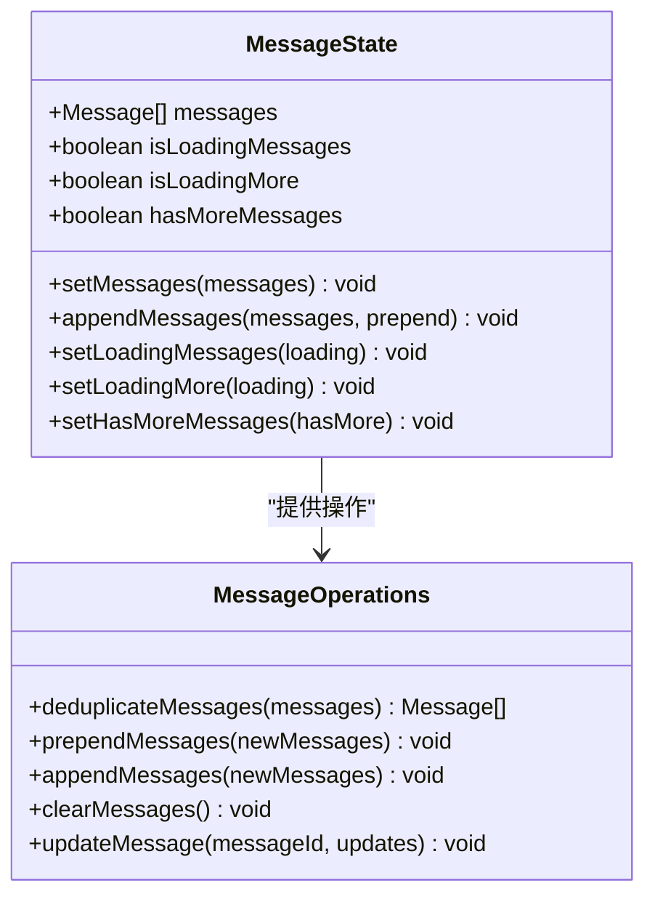

**图表来源**
- [chatStore.ts:17-20](file://src/stores/chatStore.ts#L17-L20)
- [chatStore.ts:39-43](file://src/stores/chatStore.ts#L39-L43)

#### 消息去重算法

系统实现了严格的消息去重算法，确保消息一致性：

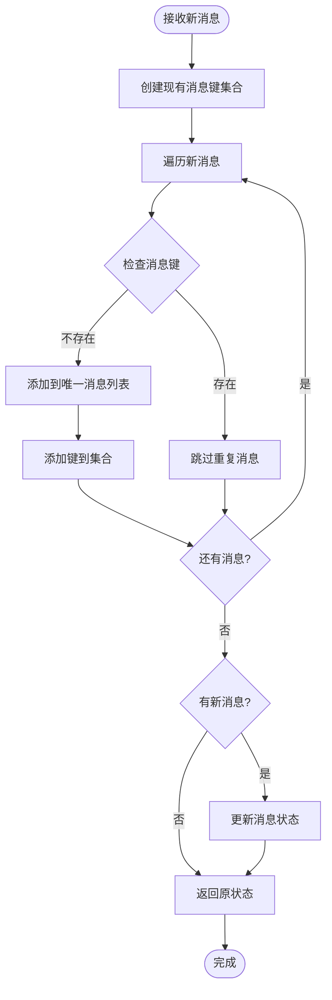

**图表来源**
- [chatStore.ts:89-110](file://src/stores/chatStore.ts#L89-L110)

#### 消息加载策略

系统支持多种消息加载策略：

1. **首次加载**：清空现有消息，设置新消息列表
2. **追加加载**：在消息列表末尾添加新消息
3. **前置加载**：在消息列表开头添加历史消息
4. **滚动加载**：根据滚动位置动态加载更多消息

**章节来源**
- [chatStore.ts:85-110](file://src/stores/chatStore.ts#L85-L110)
- [ChatPage.tsx:477-540](file://src/pages/ChatPage.tsx#L477-L540)

### 联系人缓存机制

#### 联系人状态管理

联系人缓存机制提供了高效的联系人数据管理：

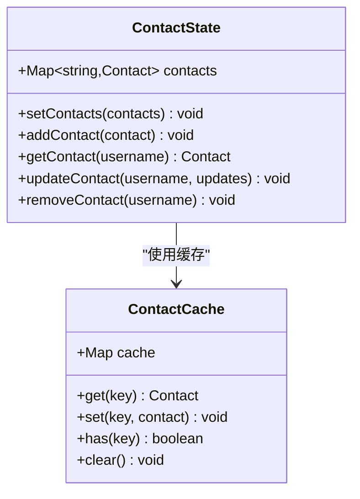

**图表来源**
- [chatStore.ts:23](file://src/stores/chatStore.ts#L23)
- [chatStore.ts:116-124](file://src/stores/chatStore.ts#L116-L124)

#### 联系人数据结构

联系人数据结构设计考虑了性能和扩展性：

| 字段名 | 类型 | 描述 | 性能考虑 |
|--------|------|------|----------|
| username | string | 用户唯一标识 | 主键索引 |
| localType | number | 本地类型标识 | 数字比较 |
| alias | string | 别名 | 字符串匹配 |
| remark | string | 备注 | 文本搜索 |
| nickName | string | 昵称 | 名称显示 |
| bigHeadUrl | string | 大头像URL | 缓存策略 |
| smallHeadUrl | string | 小头像URL | 缓存策略 |

**章节来源**
- [models.ts:15-24](file://src/types/models.ts#L15-L24)
- [chatStore.ts:116-124](file://src/stores/chatStore.ts#L116-L124)

### 搜索功能实现

#### 搜索状态管理

搜索功能提供了实时的会话过滤能力：

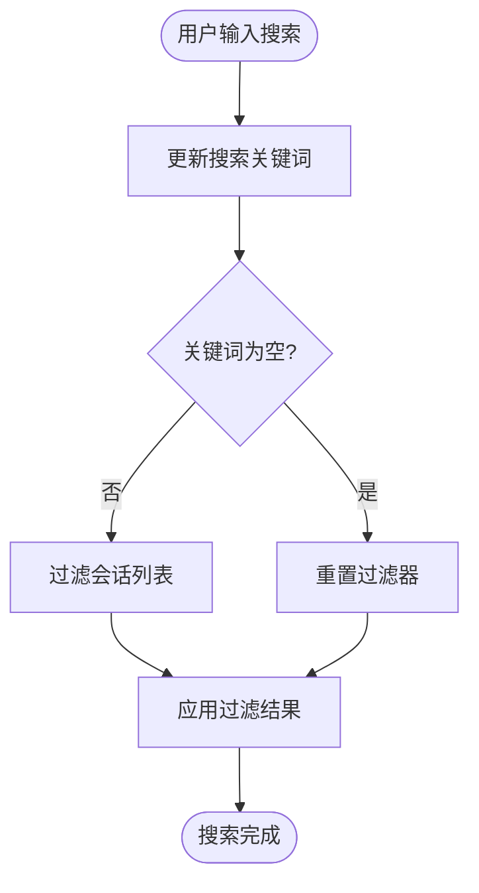

**图表来源**
- [chatStore.ts:26](file://src/stores/chatStore.ts#L26)
- [chatStore.ts:126](file://src/stores/chatStore.ts#L126)

#### 搜索算法优化

搜索算法采用了多字段匹配和性能优化：

1. **多字段匹配**：同时搜索显示名称、用户名和摘要内容
2. **大小写不敏感**：统一转换为小写进行匹配
3. **实时响应**：防抖处理避免频繁计算
4. **索引优化**：利用Map结构提高查找效率

**章节来源**
- [ChatPage.tsx:613-626](file://src/pages/ChatPage.tsx#L613-L626)

## 依赖关系分析

### 状态依赖图

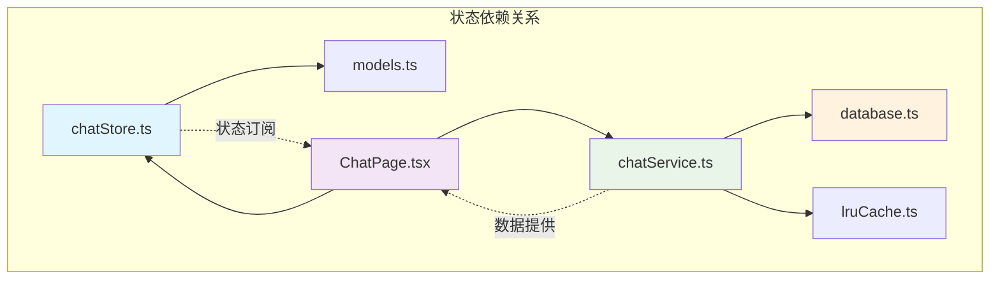

**图表来源**
- [chatStore.ts:1-2](file://src/stores/chatStore.ts#L1-L2)
- [models.ts:1-2](file://src/types/models.ts#L1-L2)

### 组件耦合度分析

| 组件 | 内聚性 | 耦合度 | 说明 |
|------|--------|--------|------|
| chatStore | 高 | 低 | 独立的状态管理，依赖最小 |
| ChatPage | 中 | 中 | 与多个状态源交互 |
| chatService | 高 | 低 | 独立的服务层，封装数据库操作 |
| models | 高 | 低 | 纯数据模型，无业务逻辑 |
| database | 中 | 中 | 与外部数据库交互 |

**章节来源**
- [chatStore.ts:1-146](file://src/stores/chatStore.ts#L1-L146)
- [chatService.ts:110-152](file://electron/services/chatService.ts#L110-L152)

## 性能考虑

### 缓存策略

系统采用了多层次的缓存策略来优化性能：

#### LRU缓存实现

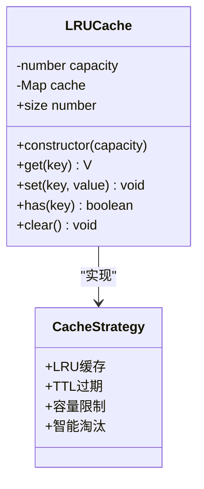

**图表来源**
- [lruCache.ts:5-50](file://src/utils/lruCache.ts#L5-L50)

#### 缓存应用场景

1. **消息缓存**：避免重复加载相同消息
2. **头像缓存**：减少网络请求和渲染开销
3. **联系人缓存**：提升会话列表渲染性能
4. **数据库连接缓存**：减少连接建立开销

### 性能优化技术

#### 智能去重算法

系统实现了高效的去重算法：

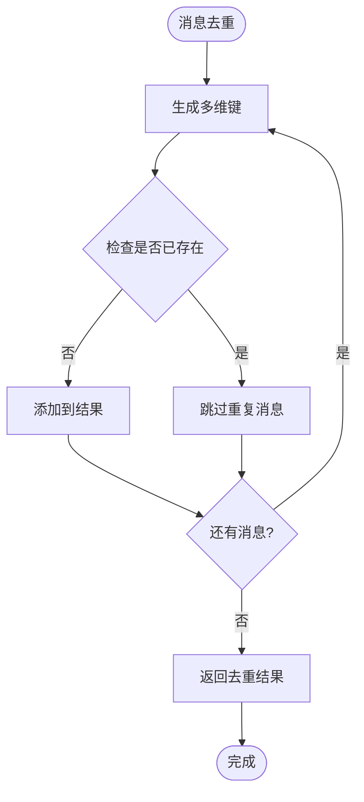

#### 滚动优化

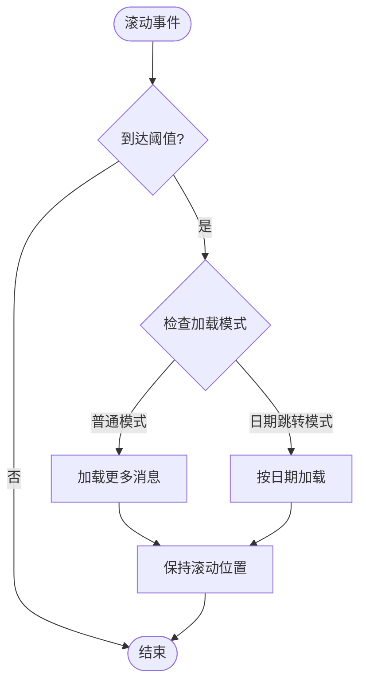

**图表来源**
- [ChatPage.tsx:703-723](file://src/pages/ChatPage.tsx#L703-L723)

**章节来源**
- [chatStore.ts:89-110](file://src/stores/chatStore.ts#L89-L110)
- [ChatPage.tsx:703-723](file://src/pages/ChatPage.tsx#L703-L723)

## 故障排除指南

### 常见问题诊断

#### 连接问题

| 问题症状 | 可能原因 | 解决方案 |
|----------|----------|----------|
| 连接失败 | 数据库文件不存在 | 检查数据库路径配置 |
| 连接超时 | 网络环境不稳定 | 检查网络连接状态 |
| 权限不足 | 文件访问权限问题 | 检查文件权限设置 |
| 版本不兼容 | 数据库版本过旧 | 升级数据库版本 |

#### 消息同步问题

| 问题症状 | 可能原因 | 解决方案 |
|----------|----------|----------|
| 消息重复 | 去重算法失效 | 检查去重键生成逻辑 |
| 消息丢失 | 网络中断影响 | 实现消息确认机制 |
| 加载缓慢 | 数据量过大 | 优化分页加载策略 |
| 滚动异常 | 位置计算错误 | 检查滚动位置维护逻辑 |

#### 性能问题

| 问题症状 | 可能原因 | 解决方案 |
|----------|----------|----------|
| UI卡顿 | 频繁重渲染 | 实施状态分离和优化 |
| 内存泄漏 | 缓存未清理 | 实现缓存清理机制 |
| 响应迟缓 | 异步操作阻塞 | 优化异步处理流程 |
| 数据不一致 | 并发访问冲突 | 实现状态锁定机制 |

### 调试技巧

#### 状态监控

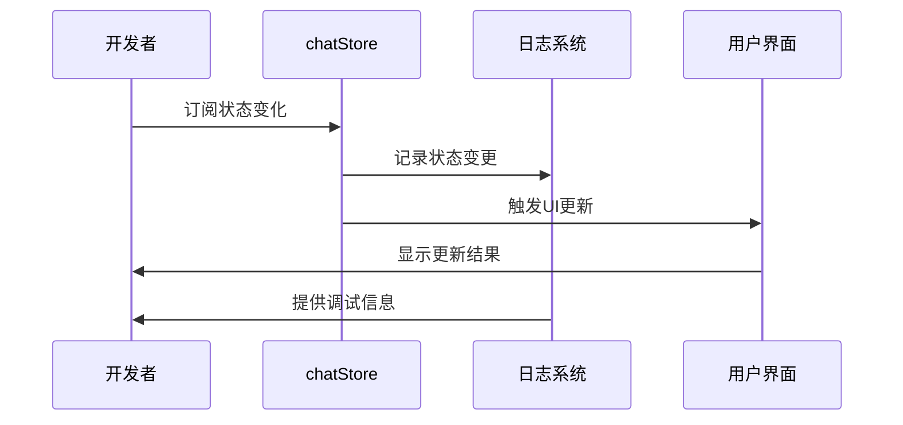

#### 性能分析

1. **状态变更频率**：监控状态更新频率，识别异常高频更新
2. **渲染性能**：分析组件渲染时间，优化重渲染逻辑
3. **内存使用**：监控内存占用，及时清理缓存数据
4. **网络请求**：跟踪API调用频率，优化请求策略

**章节来源**
- [chatStore.ts:128](file://src/stores/chatStore.ts#L128)
- [ChatPage.tsx:542-585](file://src/pages/ChatPage.tsx#L542-L585)

## 结论

CipherTalk 的聊天状态管理系统展现了现代前端应用的最佳实践：

### 设计优势

1. **模块化设计**：清晰的状态分离和职责划分
2. **性能优化**：智能去重、缓存策略和渲染优化
3. **用户体验**：流畅的交互体验和实时更新
4. **可维护性**：简洁的代码结构和完善的错误处理

### 技术亮点

1. **Zustand集成**：轻量级状态管理，避免过度复杂性
2. **增量同步**：实时消息推送和自动更新
3. **智能缓存**：多层级缓存策略提升性能
4. **类型安全**：完整的TypeScript类型定义

### 改进建议

1. **状态持久化**：实现状态持久化机制
2. **并发控制**：增强并发访问的安全性
3. **监控告警**：完善性能监控和异常告警
4. **测试覆盖**：增加单元测试和集成测试

该系统为聊天应用开发提供了坚实的技术基础，通过合理的架构设计和性能优化，能够满足大规模应用的需求。