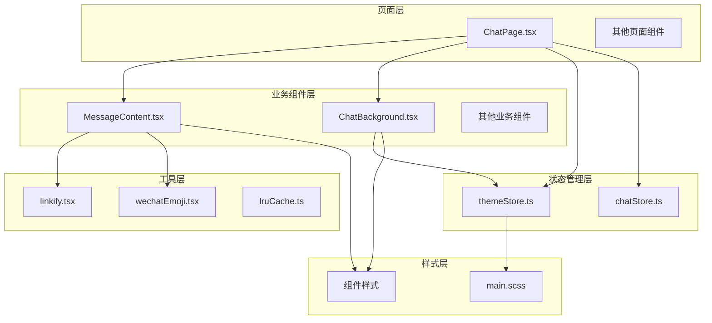
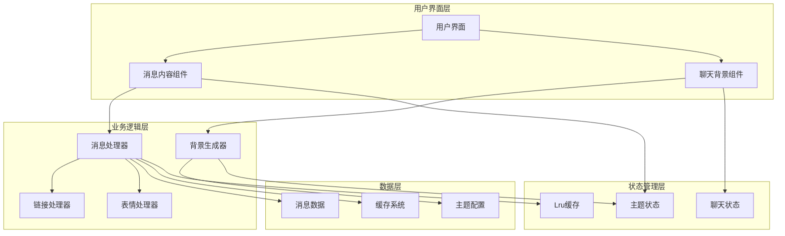
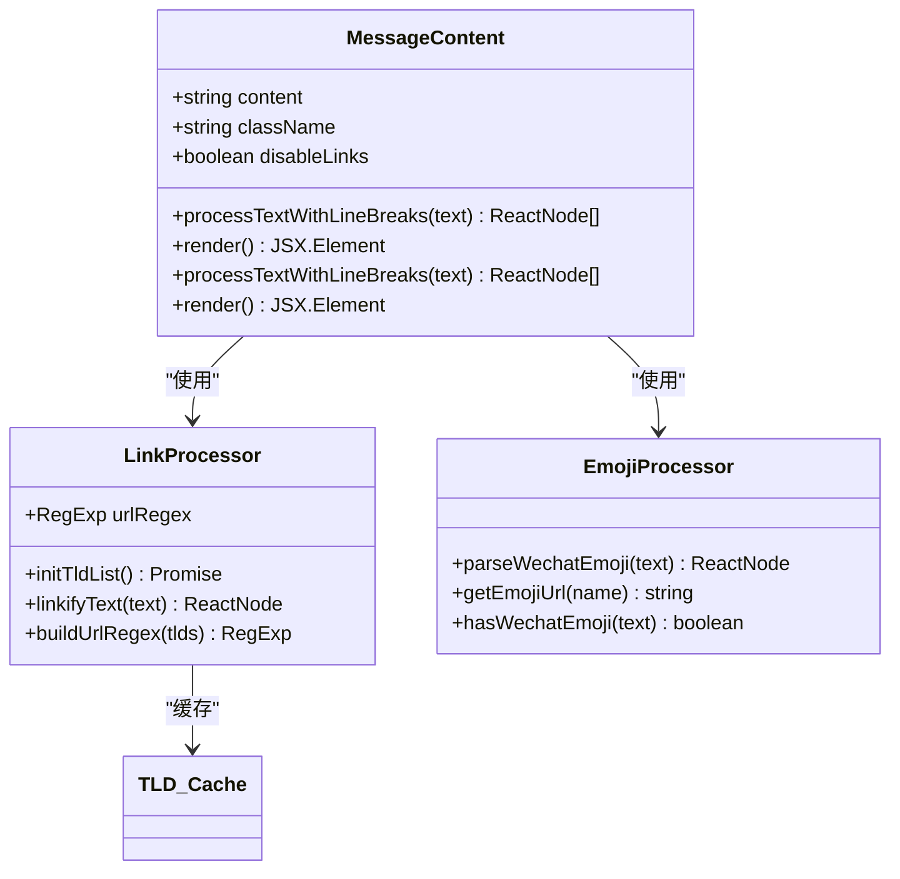
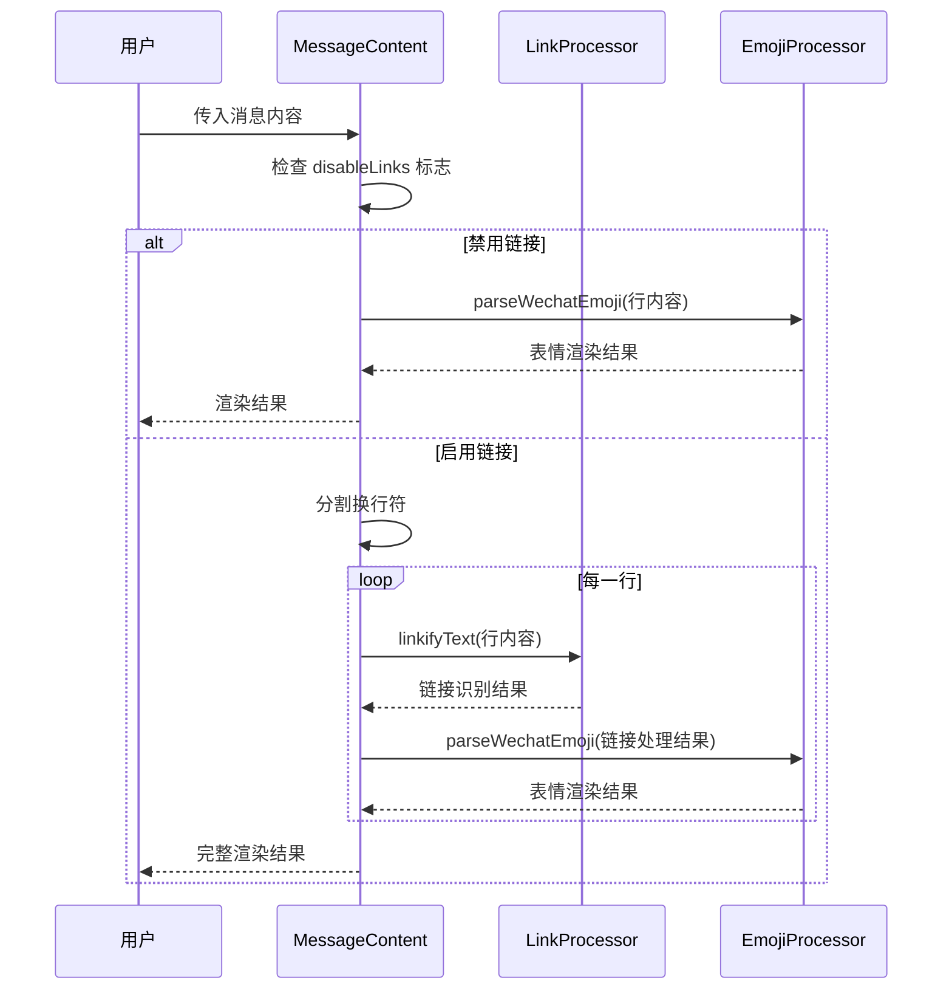
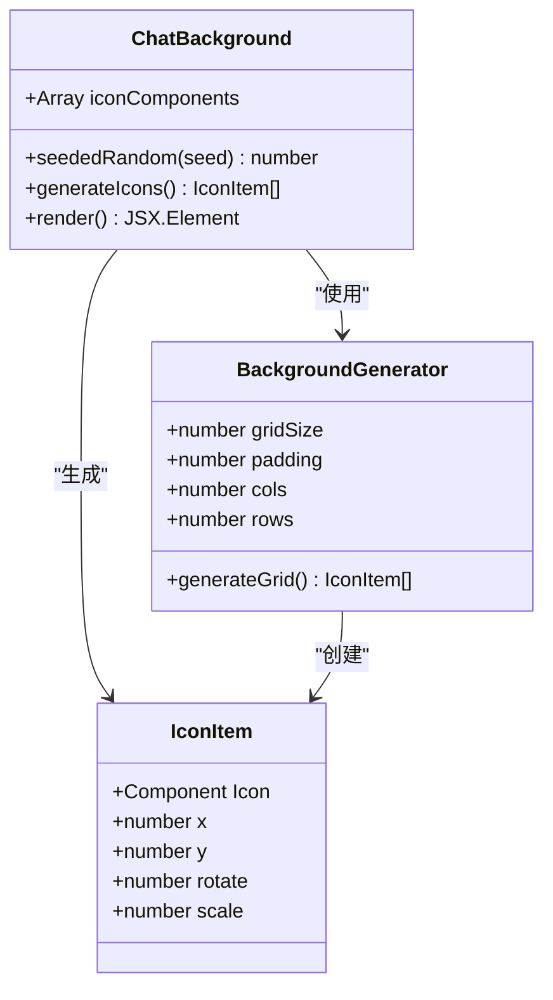
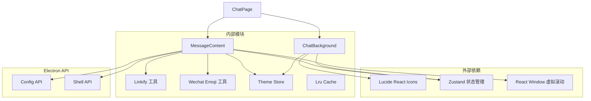
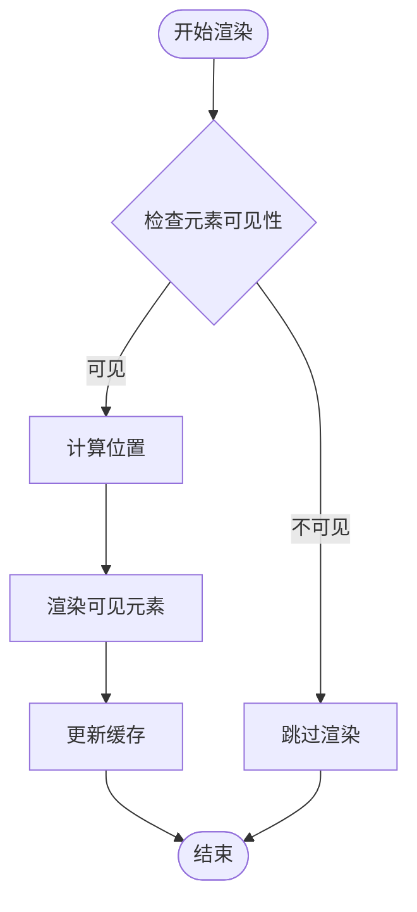

# 业务组件设计

<cite>
**本文档引用的文件**
- [MessageContent.tsx](file://src/components/MessageContent.tsx)
- [ChatBackground.tsx](file://src/components/ChatBackground.tsx)
- [MessageContent.scss](file://src/components/MessageContent.scss)
- [ChatBackground.scss](file://src/components/ChatBackground.scss)
- [linkify.tsx](file://src/utils/linkify.tsx)
- [wechatEmoji.tsx](file://src/utils/wechatEmoji.tsx)
- [ChatPage.tsx](file://src/pages/ChatPage.tsx)
- [themeStore.ts](file://src/stores/themeStore.ts)
- [lruCache.ts](file://src/utils/lruCache.ts)
- [main.scss](file://src/styles/main.scss)
</cite>

## 目录
1. [简介](#简介)
2. [项目结构](#项目结构)
3. [核心组件](#核心组件)
4. [架构概览](#架构概览)
5. [详细组件分析](#详细组件分析)
6. [依赖关系分析](#依赖关系分析)
7. [性能考虑](#性能考虑)
8. [故障排除指南](#故障排除指南)
9. [结论](#结论)
10. [附录](#附录)

## 简介

CipherTalk 是一个基于 Electron 的微信聊天记录查看器，专注于提供高质量的消息内容渲染和用户体验。本文档深入分析业务组件的设计原则和实现细节，重点涵盖 MessageContent 和 ChatBackground 两大核心组件。

系统采用数据驱动的设计理念，通过 props 接收数据，内部状态管理实现响应式更新，结合丰富的用户体验设计，为用户提供流畅的消息浏览体验。

## 项目结构

CipherTalk 项目采用模块化的组织方式，主要分为以下几个层次：



**图表来源**
- [ChatPage.tsx:1-100](file://src/pages/ChatPage.tsx#L1-L100)
- [MessageContent.tsx:1-103](file://src/components/MessageContent.tsx#L1-L103)
- [ChatBackground.tsx:1-83](file://src/components/ChatBackground.tsx#L1-L83)

**章节来源**
- [ChatPage.tsx:1-100](file://src/pages/ChatPage.tsx#L1-L100)
- [MessageContent.tsx:1-103](file://src/components/MessageContent.tsx#L1-L103)
- [ChatBackground.tsx:1-83](file://src/components/ChatBackground.tsx#L1-L83)

## 核心组件

### 设计原则

CipherTalk 业务组件遵循以下设计原则：

1. **数据驱动**：组件通过 props 接收外部数据，内部状态管理实现响应式更新
2. **状态管理**：使用 Zustand 状态管理库实现全局状态共享
3. **用户体验**：注重性能优化和交互反馈，提供流畅的使用体验

### 组件职责

- **MessageContent**：负责消息内容的渲染，包括文本处理、链接识别、表情解析
- **ChatBackground**：提供聊天界面的背景装饰，增强视觉体验

**章节来源**
- [themeStore.ts:1-146](file://src/stores/themeStore.ts#L1-L146)
- [ChatPage.tsx:210-400](file://src/pages/ChatPage.tsx#L210-L400)

## 架构概览



**图表来源**
- [MessageContent.tsx:70-100](file://src/components/MessageContent.tsx#L70-L100)
- [ChatBackground.tsx:25-80](file://src/components/ChatBackground.tsx#L25-L80)
- [linkify.tsx:69-114](file://src/utils/linkify.tsx#L69-L114)
- [wechatEmoji.tsx:21-66](file://src/utils/wechatEmoji.tsx#L21-L66)

## 详细组件分析

### MessageContent 组件分析

MessageContent 是消息内容渲染的核心组件，实现了复杂的消息格式化功能。

#### 组件架构



**图表来源**
- [MessageContent.tsx:5-103](file://src/components/MessageContent.tsx#L5-L103)
- [linkify.tsx:69-114](file://src/utils/linkify.tsx#L69-L114)
- [wechatEmoji.tsx:21-66](file://src/utils/wechatEmoji.tsx#L21-L66)

#### 消息类型识别流程



**图表来源**
- [MessageContent.tsx:14-64](file://src/components/MessageContent.tsx#L14-L64)
- [linkify.tsx:69-114](file://src/utils/linkify.tsx#L69-L114)
- [wechatEmoji.tsx:21-66](file://src/utils/wechatEmoji.tsx#L21-L66)

#### 富文本渲染机制

MessageContent 实现了多层次的文本处理：

1. **换行符处理**：将 `\n` 转换为 `<br />` 标签
2. **链接识别**：使用正则表达式识别 URL 链接
3. **表情解析**：将 `[表情]` 格式转换为微信表情图片
4. **事件处理**：为链接添加点击事件处理器

#### 多媒体内容处理

组件支持多种消息类型的处理：
- 文本消息：标准富文本渲染
- 链接消息：自动识别并创建可点击链接
- 表情消息：微信表情图片渲染
- 混合内容：多种类型组合的消息

**章节来源**
- [MessageContent.tsx:14-100](file://src/components/MessageContent.tsx#L14-L100)
- [linkify.tsx:69-114](file://src/utils/linkify.tsx#L69-L114)
- [wechatEmoji.tsx:21-66](file://src/utils/wechatEmoji.tsx#L21-L66)

### ChatBackground 组件分析

ChatBackground 提供聊天界面的背景装饰，通过算法生成随机分布的图标网格。

#### 组件架构



**图表来源**
- [ChatBackground.tsx:11-80](file://src/components/ChatBackground.tsx#L11-L80)

#### 背景图片处理机制

ChatBackground 采用算法生成背景装饰，具有以下特点：

1. **网格布局**：使用 90x90 像素的网格系统
2. **随机分布**：每个网格内随机放置图标，保持视觉平衡
3. **动态生成**：使用种子生成器确保渲染一致性
4. **样式适配**：根据主题自动调整透明度和颜色

#### 模糊效果实现

背景采用 CSS 变量实现主题适配：
- 默认透明度：0.045
- 深色主题透明度：0.055
- 颜色继承自 `--text-primary` 变量

**章节来源**
- [ChatBackground.tsx:19-80](file://src/components/ChatBackground.tsx#L19-L80)
- [ChatBackground.scss:1-26](file://src/components/ChatBackground.scss#L1-L26)

## 依赖关系分析



**图表来源**
- [MessageContent.tsx:1-4](file://src/components/MessageContent.tsx#L1-L4)
- [ChatBackground.tsx:1-9](file://src/components/ChatBackground.tsx#L1-L9)
- [ChatPage.tsx:4-12](file://src/pages/ChatPage.tsx#L4-L12)

**章节来源**
- [MessageContent.tsx:1-103](file://src/components/MessageContent.tsx#L1-L103)
- [ChatBackground.tsx:1-83](file://src/components/ChatBackground.tsx#L1-L83)
- [ChatPage.tsx:1-26](file://src/pages/ChatPage.tsx#L1-L26)

## 性能考虑

### 虚拟滚动实现

项目使用 `react-window` 实现高性能的消息列表渲染：



**图表来源**
- [ChatPage.tsx:168-208](file://src/pages/ChatPage.tsx#L168-L208)

### 懒加载策略

组件采用多种懒加载技术：

1. **图片懒加载**：使用 IntersectionObserver 检测元素可见性
2. **表情图片缓存**：LRU 缓存避免重复请求
3. **链接预处理**：异步获取 TLD 列表并缓存

### 缓存策略

```mermaid
graph LR
subgraph "缓存层级"
L1[LRU 缓存]
L2[TLD 列表缓存]
L3[表情图片缓存]
end
subgraph "数据源"
FS[文件系统]
DB[(数据库)]
Network[网络]
end
L1 <- --> FS
L2 <- --> DB
L3 <- --> Network
FS --> L1
DB --> L2
Network --> L3
```

**图表来源**
- [lruCache.ts:1-51](file://src/utils/lruCache.ts#L1-L51)
- [wechatEmoji.tsx:82-82](file://src/utils/wechatEmoji.tsx#L82-L82)
- [linkify.tsx:35-64](file://src/utils/linkify.tsx#L35-L64)

**章节来源**
- [ChatPage.tsx:41-166](file://src/pages/ChatPage.tsx#L41-L166)
- [lruCache.ts:1-51](file://src/utils/lruCache.ts#L1-L51)
- [linkify.tsx:35-64](file://src/utils/linkify.tsx#L35-L64)

## 故障排除指南

### 常见问题及解决方案

1. **链接识别失败**
   - 检查 TLD 列表缓存状态
   - 验证网络连接和权限设置
   - 查看控制台错误日志

2. **表情显示异常**
   - 确认表情文件路径正确
   - 检查缓存是否过期
   - 验证表情名称格式

3. **背景渲染性能问题**
   - 检查图标数量和复杂度
   - 验证 CSS 变量设置
   - 监控内存使用情况

**章节来源**
- [linkify.tsx:16-32](file://src/utils/linkify.tsx#L16-L32)
- [wechatEmoji.tsx:82-134](file://src/utils/wechatEmoji.tsx#L82-L134)
- [ChatBackground.tsx:25-61](file://src/components/ChatBackground.tsx#L25-L61)

## 结论

CipherTalk 的业务组件设计体现了现代前端开发的最佳实践：

1. **模块化设计**：清晰的组件职责分离，便于维护和扩展
2. **性能优化**：虚拟滚动、懒加载、缓存策略确保流畅体验
3. **用户体验**：主题适配、动画效果、响应式设计提升交互质量
4. **可扩展性**：良好的架构设计支持功能扩展和定制化需求

通过数据驱动的设计理念和完善的性能优化策略，CipherTalk 为用户提供了高质量的消息浏览体验。

## 附录

### 组件扩展方案

1. **自定义消息类型**：通过扩展 MessageContent 的处理逻辑
2. **主题定制**：利用 CSS 变量系统实现主题切换
3. **性能监控**：集成性能指标收集和分析
4. **国际化支持**：添加多语言消息处理能力

### 定制化建议

1. **样式定制**：通过修改 CSS 变量调整视觉效果
2. **功能扩展**：基于现有组件架构添加新功能
3. **性能调优**：根据具体使用场景优化渲染策略
4. **用户体验**：持续改进交互设计和反馈机制