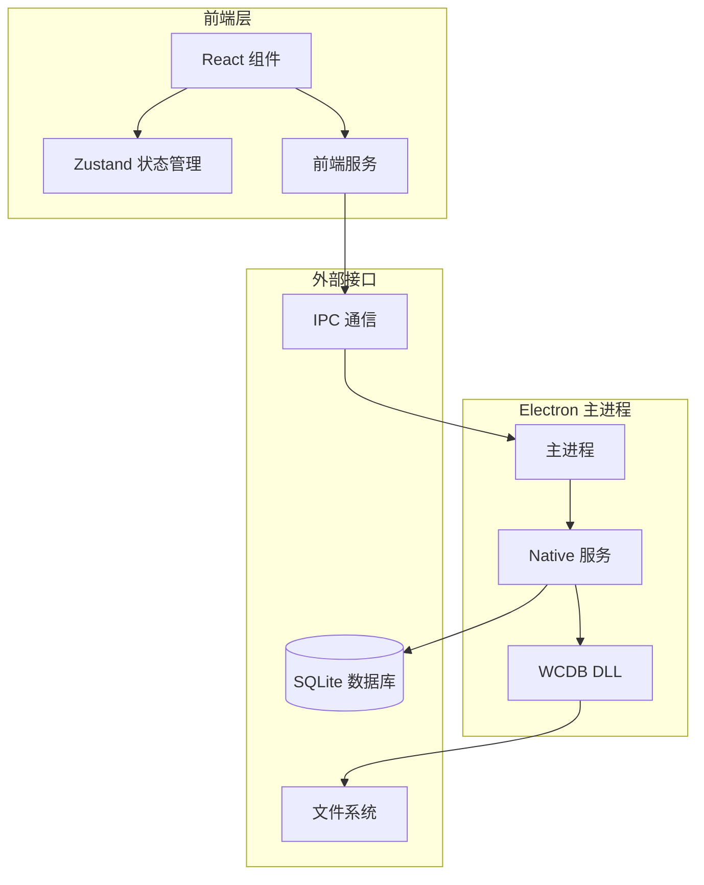
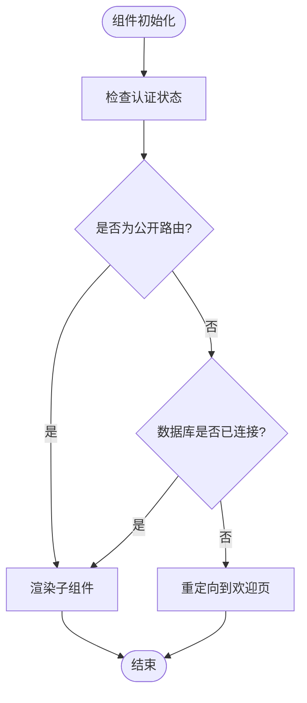
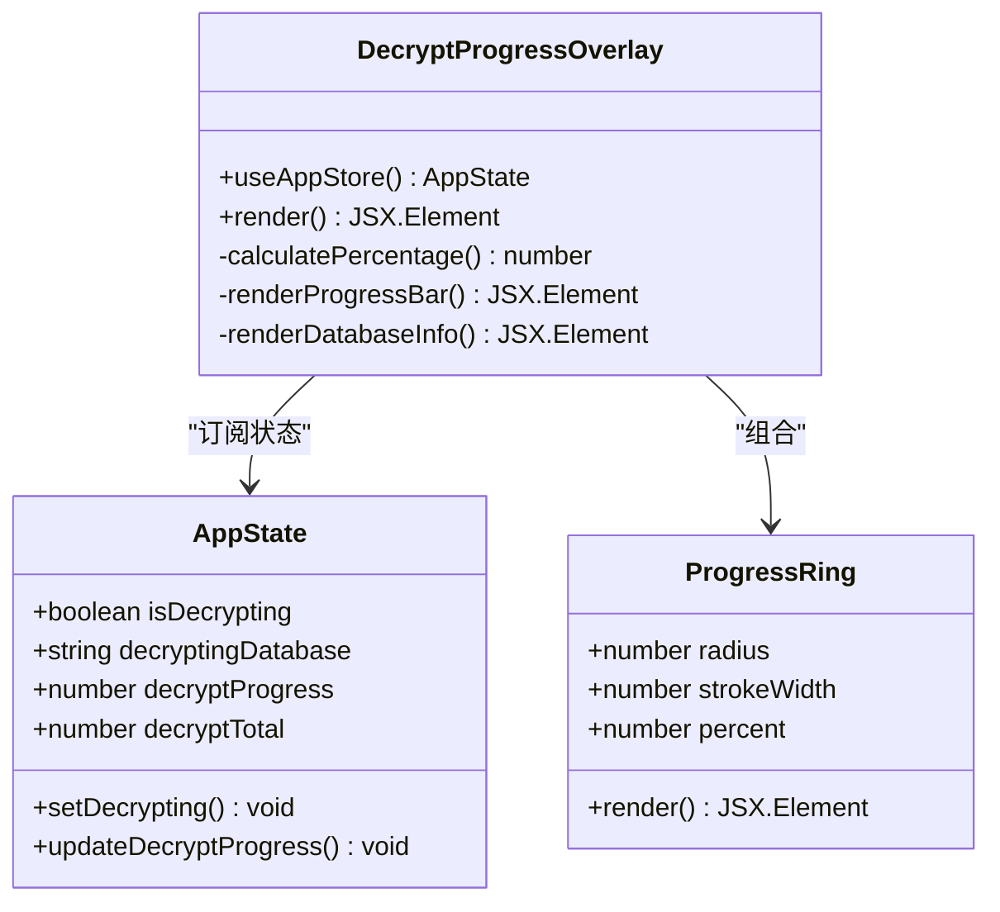
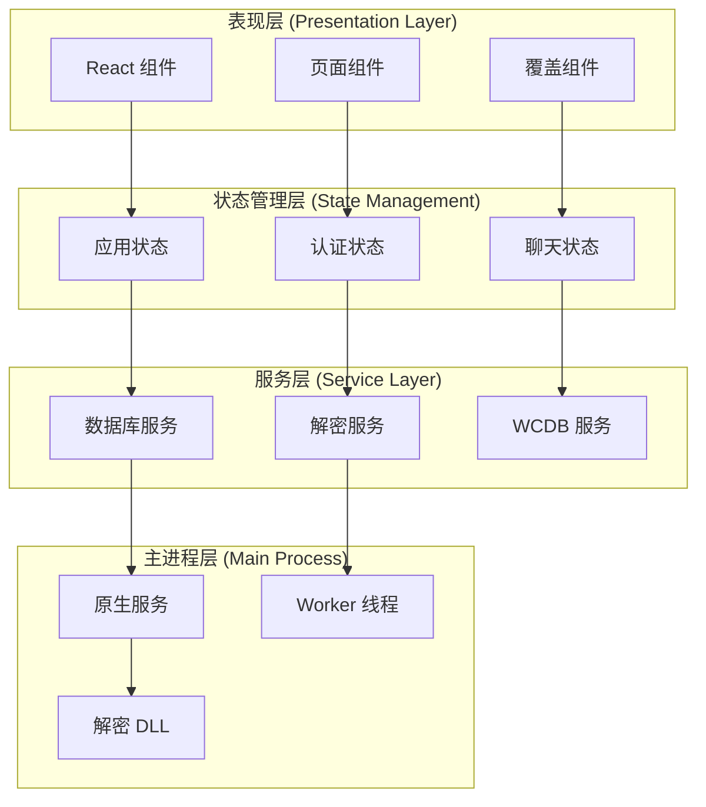
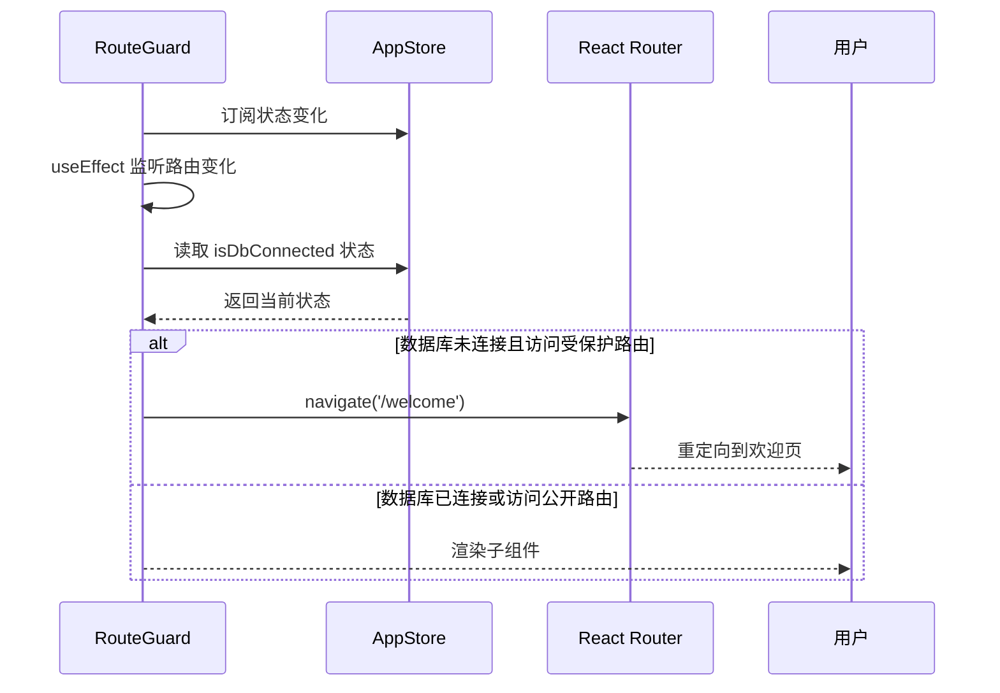
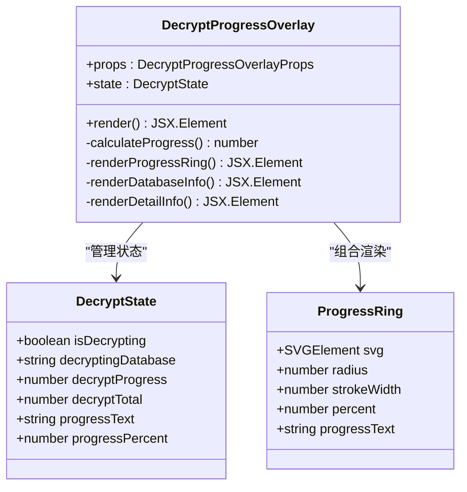
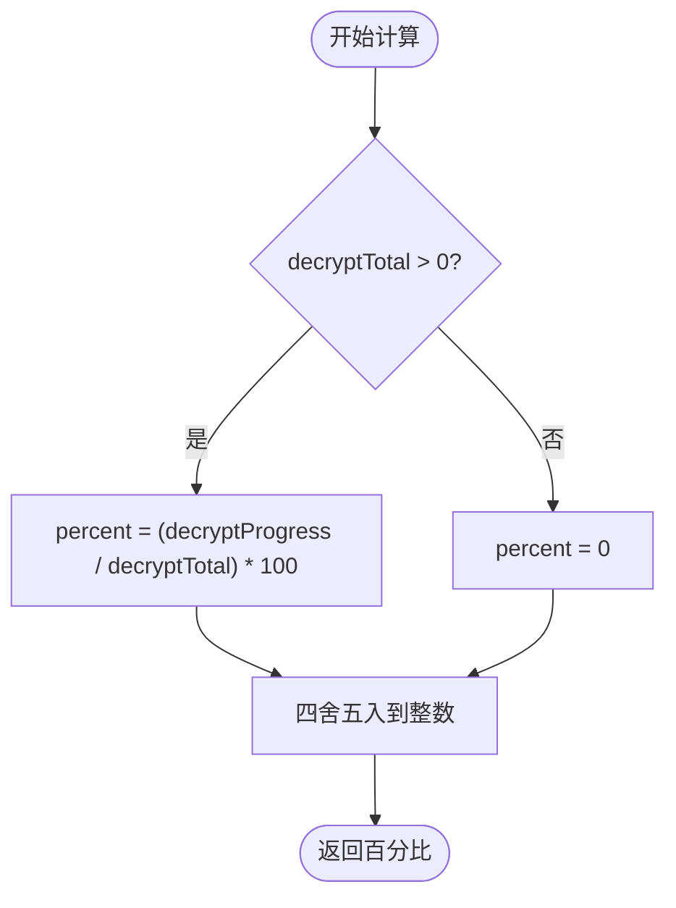
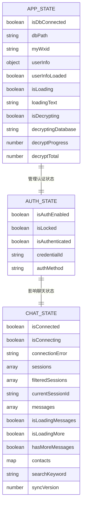
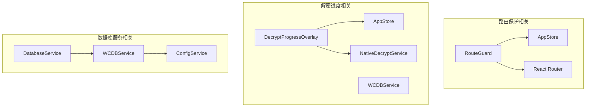
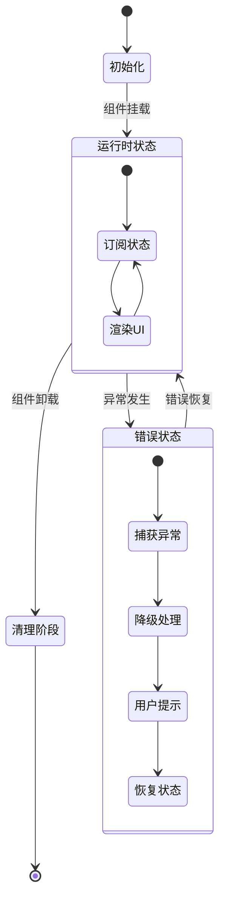

# 功能组件设计

<cite>
**本文档引用的文件**
- [RouteGuard.tsx](file://src/components/RouteGuard.tsx)
- [DecryptProgressOverlay.tsx](file://src/components/DecryptProgressOverlay.tsx)
- [DecryptProgressOverlay.scss](file://src/components/DecryptProgressOverlay.scss)
- [appStore.ts](file://src/stores/appStore.ts)
- [authStore.ts](file://src/stores/authStore.ts)
- [App.tsx](file://src/App.tsx)
- [database.ts](file://src/services/database.ts)
- [decryptService.ts](file://electron/services/decryptService.ts)
- [nativeDecryptService.ts](file://electron/services/nativeDecryptService.ts)
- [wcdbService.ts](file://electron/services/wcdbService.ts)
- [DataManagementPage.tsx](file://src/pages/DataManagementPage.tsx)
- [package.json](file://package.json)
</cite>

## 目录
1. [引言](#引言)
2. [项目结构](#项目结构)
3. [核心组件](#核心组件)
4. [架构概览](#架构概览)
5. [详细组件分析](#详细组件分析)
6. [依赖分析](#依赖分析)
7. [性能考虑](#性能考虑)
8. [故障排除指南](#故障排除指南)
9. [结论](#结论)
10. [附录](#附录)

## 引言

CipherTalk 是一款现代化的微信聊天记录查看与分析工具，采用 React + Electron + TypeScript 技术栈构建。本文档专注于功能组件设计，重点分析两个关键组件：RouteGuard 路由守卫组件和 DecryptProgressOverlay 解密进度覆盖组件。

## 项目结构

CipherTalk 采用模块化架构设计，主要分为前端 React 组件层、状态管理层、服务层和 Electron 主进程层：

**图表来源**
- [App.tsx:40-538](file://src/App.tsx#L40-L538)
- [package.json:1-169](file://package.json#L1-L169)

**章节来源**
- [App.tsx:1-538](file://src/App.tsx#L1-L538)
- [package.json:1-169](file://package.json#L1-L169)

## 核心组件

### 设计原则

基于 CipherTalk 的实现，功能组件遵循以下设计原则：

1. **高内聚低耦合**：每个组件职责单一，通过明确的接口与其他组件交互
2. **可复用性**：组件设计考虑通用性，可在不同场景下复用
3. **错误处理**：完善的异常捕获和降级机制
4. **状态同步**：组件间通过全局状态管理保持数据一致性

### RouteGuard 组件

RouteGuard 是一个路由守卫组件，负责权限验证和路由拦截：

**图表来源**
- [RouteGuard.tsx:12-27](file://src/components/RouteGuard.tsx#L12-L27)

**章节来源**
- [RouteGuard.tsx:1-30](file://src/components/RouteGuard.tsx#L1-L30)

### DecryptProgressOverlay 组件

DecryptProgressOverlay 提供解密进度显示和用户反馈：

**图表来源**
- [DecryptProgressOverlay.tsx:4-53](file://src/components/DecryptProgressOverlay.tsx#L4-L53)
- [appStore.ts:10-38](file://src/stores/appStore.ts#L10-L38)

**章节来源**
- [DecryptProgressOverlay.tsx:1-56](file://src/components/DecryptProgressOverlay.tsx#L1-L56)
- [DecryptProgressOverlay.scss:1-80](file://src/components/DecryptProgressOverlay.scss#L1-L80)

## 架构概览

CipherTalk 采用分层架构，各层职责明确：

**图表来源**
- [App.tsx:40-538](file://src/App.tsx#L40-L538)
- [appStore.ts:40-97](file://src/stores/appStore.ts#L40-L97)
- [authStore.ts:52-271](file://src/stores/authStore.ts#L52-L271)

## 详细组件分析

### RouteGuard 组件深入分析

RouteGuard 实现了基于状态的路由保护机制：

#### 核心功能实现

1. **权限验证**：通过 `useAppStore` 订阅数据库连接状态
2. **路由拦截**：阻止未授权访问受保护路由
3. **状态同步**：与全局状态保持同步

#### 生命周期管理

**图表来源**
- [RouteGuard.tsx:17-24](file://src/components/RouteGuard.tsx#L17-L24)

**章节来源**
- [RouteGuard.tsx:12-27](file://src/components/RouteGuard.tsx#L12-L27)

### DecryptProgressOverlay 组件深入分析

DecryptProgressOverlay 提供了完整的解密进度显示解决方案：

#### 组件架构

**图表来源**
- [DecryptProgressOverlay.tsx:4-53](file://src/components/DecryptProgressOverlay.tsx#L4-L53)

#### 进度计算逻辑

组件实现了精确的进度计算算法：

**图表来源**
- [DecryptProgressOverlay.tsx:9](file://src/components/DecryptProgressOverlay.tsx#L9)

#### 用户反馈机制

组件提供了多层次的用户反馈：

1. **视觉反馈**：圆形进度环和百分比显示
2. **文本反馈**：当前解密数据库名称和详细进度
3. **状态反馈**：首次加载提示信息

**章节来源**
- [DecryptProgressOverlay.tsx:1-56](file://src/components/DecryptProgressOverlay.tsx#L1-L56)
- [DecryptProgressOverlay.scss:1-80](file://src/components/DecryptProgressOverlay.scss#L1-L80)

### 状态管理系统

CipherTalk 使用 Zustand 进行状态管理，实现了高效的状态同步：

#### 应用状态管理

**图表来源**
- [appStore.ts:10-38](file://src/stores/appStore.ts#L10-L38)
- [authStore.ts:5-24](file://src/stores/authStore.ts#L5-L24)
- [chatStore.ts:4-49](file://src/stores/chatStore.ts#L4-L49)

**章节来源**
- [appStore.ts:1-97](file://src/stores/appStore.ts#L1-L97)
- [authStore.ts:1-271](file://src/stores/authStore.ts#L1-L271)
- [chatStore.ts:1-146](file://src/stores/chatStore.ts#L1-L146)

## 依赖分析

### 组件间依赖关系

**图表来源**
- [RouteGuard.tsx:1-30](file://src/components/RouteGuard.tsx#L1-L30)
- [DecryptProgressOverlay.tsx:1-56](file://src/components/DecryptProgressOverlay.tsx#L1-L56)
- [database.ts:1-243](file://src/services/database.ts#L1-L243)

### 外部依赖分析

基于 package.json 分析，CipherTalk 主要依赖包括：

1. **核心框架**：React 19、Electron 39、TypeScript
2. **状态管理**：Zustand 5.0.2
3. **UI 组件**：@mui/material 7.3.9
4. **构建工具**：Vite 6.0.5、electron-builder 25.1.8
5. **多媒体处理**：ffmpeg-static 5.3.0、sherpa-onnx-node 1.12.23

**章节来源**
- [package.json:20-73](file://package.json#L20-L73)

## 性能考虑

### 解密性能优化

CipherTalk 采用了多项性能优化策略：

1. **Worker 线程分离**：原生解密服务在独立 Worker 线程中运行，避免阻塞主线程
2. **异步解密**：支持异步解密操作，实时返回进度信息
3. **内存管理**：合理管理解密过程中的内存使用

### 状态管理性能

1. **局部状态更新**：使用 Zustand 的细粒度状态更新机制
2. **状态持久化**：关键状态通过配置服务持久化存储
3. **状态同步**：通过订阅机制实现实时状态同步

## 故障排除指南

### 常见问题及解决方案

#### 路由守卫问题

**问题**：用户无法访问受保护路由
**诊断**：检查 `isDbConnected` 状态是否为 true
**解决方案**：确保数据库正确连接后再访问受保护路由

#### 解密进度显示问题

**问题**：解密进度不显示或显示异常
**诊断**：检查 `isDecrypting` 状态和进度数据
**解决方案**：
1. 确认解密服务正常启动
2. 检查 Worker 线程状态
3. 验证进度回调函数

#### 认证状态问题

**问题**：认证状态不同步
**诊断**：检查 `useAuthStore` 的状态更新
**解决方案**：
1. 确认认证初始化完成
2. 检查生物识别或密码验证流程
3. 验证状态持久化机制

**章节来源**
- [authStore.ts:29-50](file://src/stores/authStore.ts#L29-L50)
- [nativeDecryptService.ts:88-117](file://electron/services/nativeDecryptService.ts#L88-L117)

## 结论

CipherTalk 的功能组件设计体现了现代前端开发的最佳实践：

1. **清晰的架构分离**：各组件职责明确，耦合度低
2. **完善的错误处理**：多层次的异常捕获和降级机制
3. **高效的性能表现**：通过 Worker 线程和异步处理提升用户体验
4. **良好的可维护性**：模块化设计便于后续扩展和维护

这两个核心组件（RouteGuard 和 DecryptProgressOverlay）为整个应用提供了坚实的功能基础，展现了高内聚低耦合的设计理念和优秀的可复用性。

## 附录

### 组件生命周期总结

### 测试策略建议

1. **单元测试**：针对组件的核心逻辑进行测试
2. **集成测试**：测试组件间的交互和状态同步
3. **端到端测试**：模拟真实用户场景的完整流程
4. **性能测试**：验证解密性能和响应时间
5. **错误注入测试**：模拟各种异常情况下的行为

### 调试方法

1. **状态监控**：使用浏览器开发者工具监控状态变化
2. **日志记录**：在关键节点添加详细的日志信息
3. **断点调试**：利用 React DevTools 进行组件调试
4. **性能分析**：使用性能面板分析组件渲染性能
5. **网络监控**：监控 IPC 通信和解密进度回调