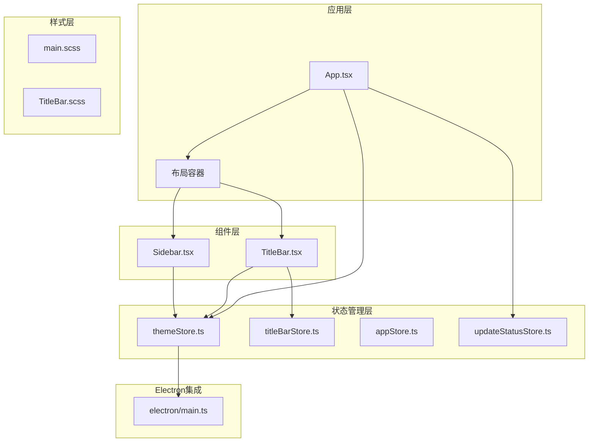
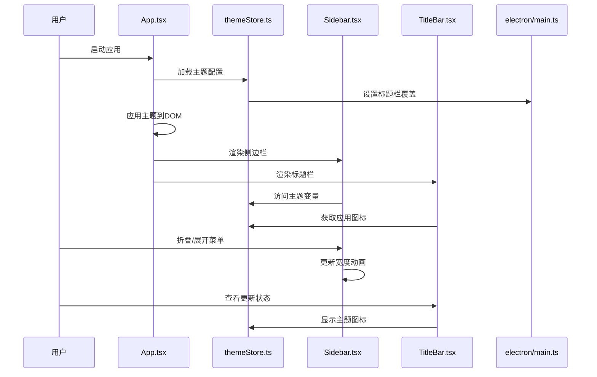
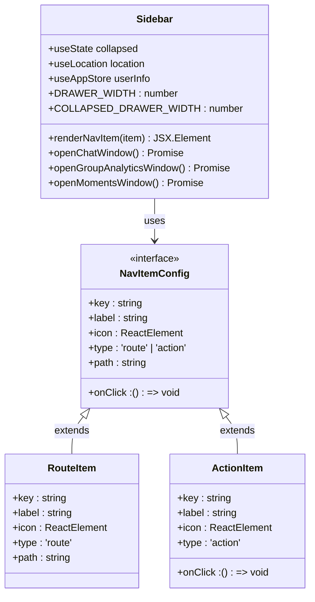
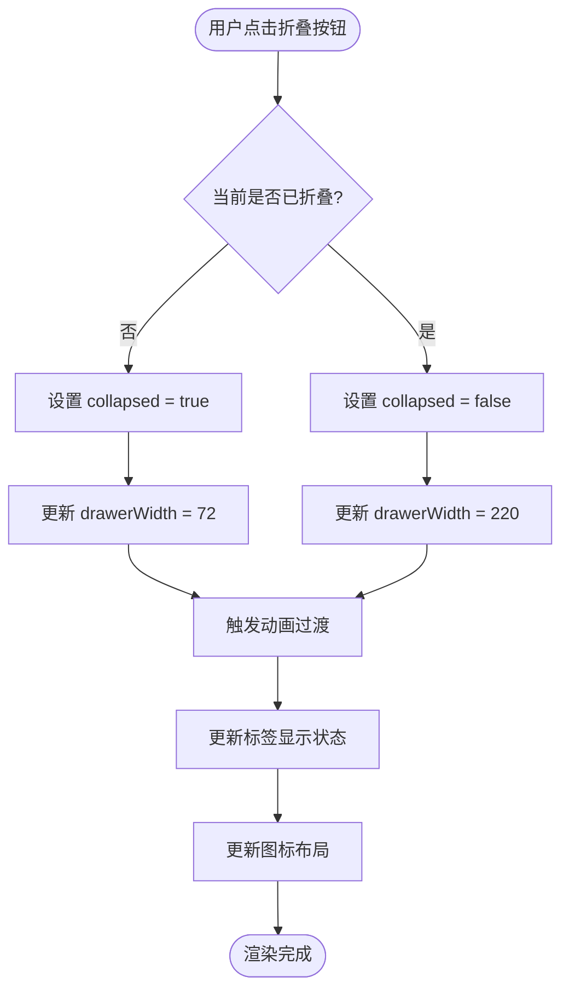
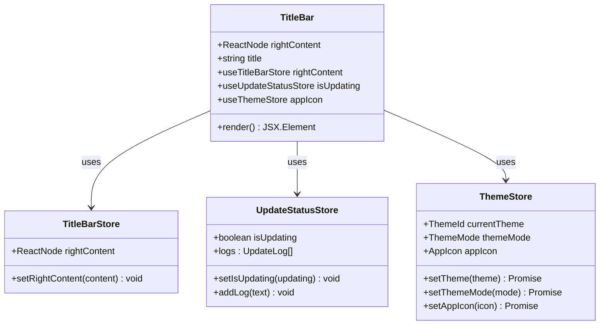
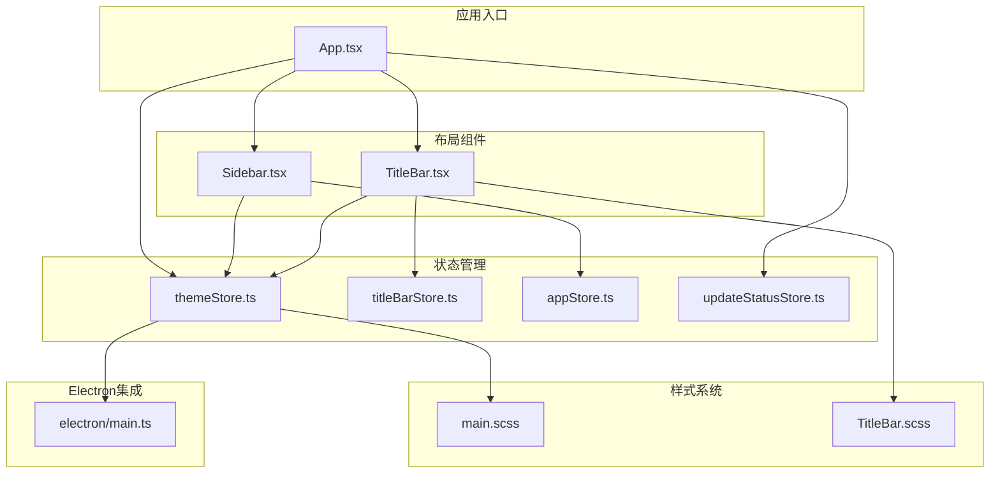
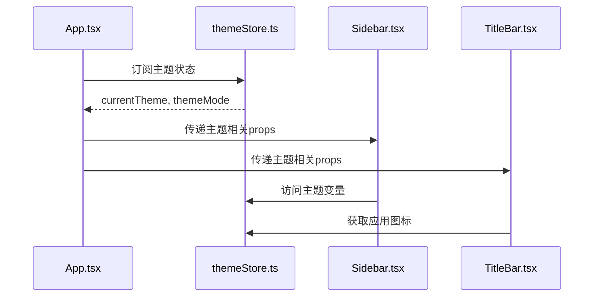
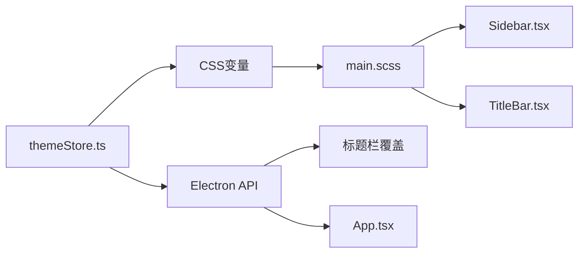

# 布局组件设计

<cite>
**本文档引用的文件**
- [Sidebar.tsx](file://src/components/Sidebar.tsx)
- [TitleBar.tsx](file://src/components/TitleBar.tsx)
- [TitleBar.scss](file://src/components/TitleBar.scss)
- [App.tsx](file://src/App.tsx)
- [main.scss](file://src/styles/main.scss)
- [themeStore.ts](file://src/stores/themeStore.ts)
- [titleBarStore.ts](file://src/stores/titleBarStore.ts)
- [appStore.ts](file://src/stores/appStore.ts)
- [updateStatusStore.ts](file://src/stores/updateStatusStore.ts)
- [main.ts](file://electron/main.ts)
</cite>

## 目录
1. [简介](#简介)
2. [项目结构](#项目结构)
3. [核心组件](#核心组件)
4. [架构概览](#架构概览)
5. [详细组件分析](#详细组件分析)
6. [依赖关系分析](#依赖关系分析)
7. [性能考虑](#性能考虑)
8. [故障排除指南](#故障排除指南)
9. [结论](#结论)
10. [附录](#附录)

## 简介

CipherTalk 的布局组件设计专注于构建现代化、响应式的桌面应用程序界面。该设计文档详细阐述了布局组件的设计原则，包括响应式布局、主题适配和动画过渡效果的实现策略。重点分析了 Sidebar 抽屉式导航组件和 TitleBar 窗口控制组件的实现细节，以及组件间的通信机制和性能优化方案。

## 项目结构

CipherTalk 采用模块化的组件架构，布局组件位于 `src/components/` 目录下，配合全局样式和状态管理实现完整的界面布局解决方案。



**图表来源**
- [App.tsx:40-538](file://src/App.tsx#L40-L538)
- [Sidebar.tsx:37-355](file://src/components/Sidebar.tsx#L37-L355)
- [TitleBar.tsx:13-52](file://src/components/TitleBar.tsx#L13-L52)

**章节来源**
- [App.tsx:40-538](file://src/App.tsx#L40-L538)
- [main.scss:1-427](file://src/styles/main.scss#L1-L427)

## 核心组件

### 设计原则

布局组件遵循以下核心设计原则：

1. **响应式布局**：组件能够适应不同屏幕尺寸和窗口大小的变化
2. **主题适配**：支持多种主题颜色方案和深浅模式切换
3. **动画过渡效果**：提供流畅的交互体验和视觉反馈
4. **Material UI 集成**：充分利用 Material-UI 组件库的功能特性
5. **状态提升**：通过集中状态管理实现组件间通信

### 组件职责

- **Sidebar 组件**：提供抽屉式导航菜单，支持折叠展开功能
- **TitleBar 组件**：实现窗口标题栏，包含应用图标、标题和更新状态指示
- **主题系统**：通过 CSS 变量和 Electron 集成实现完整的主题适配

**章节来源**
- [Sidebar.tsx:16-46](file://src/components/Sidebar.tsx#L16-L46)
- [TitleBar.tsx:8-17](file://src/components/TitleBar.tsx#L8-L17)

## 架构概览

布局系统的整体架构采用分层设计，从应用入口到具体组件形成清晰的层次结构。



**图表来源**
- [App.tsx:60-88](file://src/App.tsx#L60-L88)
- [themeStore.ts:79-140](file://src/stores/themeStore.ts#L79-L140)
- [Sidebar.tsx:37-355](file://src/components/Sidebar.tsx#L37-L355)
- [TitleBar.tsx:13-52](file://src/components/TitleBar.tsx#L13-L52)

## 详细组件分析

### Sidebar 组件分析

Sidebar 组件实现了完整的抽屉式导航功能，具备以下核心特性：

#### 抽屉式导航实现

组件使用 Material-UI 的 Drawer 组件作为基础，设置为永久性抽屉（variant="permanent"），确保始终可见且不占用路由切换的动画资源。



**图表来源**
- [Sidebar.tsx:19-35](file://src/components/Sidebar.tsx#L19-L35)
- [Sidebar.tsx:75-85](file://src/components/Sidebar.tsx#L75-L85)

#### 折叠状态管理

Sidebar 实现了智能的折叠状态管理，支持两种宽度模式：

- **展开模式**：宽度 220px，显示完整菜单项和用户信息
- **折叠模式**：宽度 72px，仅显示图标，隐藏文本标签



**图表来源**
- [Sidebar.tsx:40-46](file://src/components/Sidebar.tsx#L40-L46)
- [Sidebar.tsx:120-150](file://src/components/Sidebar.tsx#L120-L150)

#### 动态宽度计算

组件通过 CSS 变量和内联样式的结合实现动态宽度计算：

- 使用 `drawerWidth` 变量控制整体宽度
- 通过 `createLabelSx(maxWidth)` 函数动态计算标签宽度
- 利用 `widthTransition` 和 `fadeTransition` 实现平滑过渡动画

#### Material UI 集成

Sidebar 充分利用 Material-UI 组件库的功能：

- **Drawer**：提供抽屉式布局容器
- **List/ListItem**：实现导航列表结构
- **ListItemButton**：提供可点击的列表项
- **Tooltip**：实现悬停提示功能
- **Avatar**：显示用户头像

**章节来源**
- [Sidebar.tsx:37-355](file://src/components/Sidebar.tsx#L37-L355)

### TitleBar 组件分析

TitleBar 组件负责实现窗口标题栏功能，集成了应用图标、标题显示和更新状态指示。

#### 窗口控制按钮设计

TitleBar 采用 Electron 的原生窗口控制集成，通过 `-webkit-app-region` 属性实现拖拽区域控制：



**图表来源**
- [TitleBar.tsx:8-17](file://src/components/TitleBar.tsx#L8-L17)
- [titleBarStore.ts:4-12](file://src/stores/titleBarStore.ts#L4-L12)
- [updateStatusStore.ts:9-27](file://src/stores/updateStatusStore.ts#L9-L27)
- [themeStore.ts:67-140](file://src/stores/themeStore.ts#L67-L140)

#### 标题显示机制

TitleBar 支持灵活的标题显示机制：

- **静态标题**：通过 props 传入的 title 参数
- **动态标题**：从应用状态中获取当前页面标题
- **默认标题**：当没有指定标题时显示 "CipherTalk"

#### 系统集成特性

TitleBar 与 Electron 系统深度集成：

- **拖拽区域**：整个标题栏区域可拖拽移动窗口
- **原生控制**：右侧区域禁用拖拽，保留原生窗口控制按钮
- **图标适配**：根据主题模式自动调整应用图标颜色

**章节来源**
- [TitleBar.tsx:13-52](file://src/components/TitleBar.tsx#L13-L52)
- [TitleBar.scss:1-112](file://src/components/TitleBar.scss#L1-L112)

## 依赖关系分析

布局组件之间的依赖关系形成了清晰的层次结构：



**图表来源**
- [App.tsx:28-31](file://src/App.tsx#L28-L31)
- [themeStore.ts:1-146](file://src/stores/themeStore.ts#L1-L146)
- [titleBarStore.ts:1-13](file://src/stores/titleBarStore.ts#L1-L13)

### 组件通信机制

布局组件采用多种通信机制实现松耦合设计：

#### 状态提升模式

应用入口集中管理所有状态，各组件通过 props 接收所需数据：



**图表来源**
- [App.tsx:44-88](file://src/App.tsx#L44-L88)
- [themeStore.ts:79-140](file://src/stores/themeStore.ts#L79-L140)

#### 事件传递机制

组件通过回调函数实现事件向上冒泡：

- **Sidebar 折叠事件**：通过 `setCollapsed` 状态更新
- **TitleBar 右侧内容**：通过 `setRightContent` 动态更新
- **主题切换事件**：通过 `setTheme` 和 `setThemeMode` 触发

#### 主题传播机制

主题系统通过 CSS 变量和 Electron API 实现全局传播：



**图表来源**
- [themeStore.ts:79-140](file://src/stores/themeStore.ts#L79-L140)
- [main.scss:4-43](file://src/styles/main.scss#L4-L43)
- [App.tsx:69-88](file://src/App.tsx#L69-L88)

**章节来源**
- [App.tsx:40-538](file://src/App.tsx#L40-L538)
- [themeStore.ts:79-140](file://src/stores/themeStore.ts#L79-L140)

## 性能考虑

### CSS 变量使用

布局系统大量使用 CSS 变量实现主题适配，具有以下优势：

- **零运行时开销**：CSS 变量在编译时解析，运行时查找成本低
- **原子化设计**：通过 `var(--variable-name)` 形式统一管理样式属性
- **动态切换**：通过修改 `data-theme` 和 `data-mode` 属性实现主题快速切换

### 动画性能优化

组件实现了多层动画优化策略：

#### 硬件加速动画

- **Transform 优化**：使用 `transform` 属性而非改变布局属性
- **GPU 加速**：通过 `backdropFilter` 和 `transform` 触发硬件加速
- **时间曲线优化**：使用 `cubic-bezier` 曲线实现自然的动画效果

#### 渲染性能优化

- **防抖机制**：避免频繁的状态更新触发重渲染
- **条件渲染**：根据折叠状态动态决定元素渲染
- **样式缓存**：通过 CSS 变量减少样式计算开销

### 内存管理

布局组件采用轻量级设计减少内存占用：

- **状态最小化**：只存储必要的状态信息
- **事件清理**：在组件卸载时清理监听器
- **懒加载**：非关键资源按需加载

**章节来源**
- [Sidebar.tsx:44-46](file://src/components/Sidebar.tsx#L44-L46)
- [main.scss:4-43](file://src/styles/main.scss#L4-L43)

## 故障排除指南

### 常见问题诊断

#### 主题切换失效

**症状**：主题切换后界面颜色未更新
**排查步骤**：
1. 检查 `data-theme` 属性是否正确设置
2. 验证 CSS 变量是否正确解析
3. 确认 Electron 标题栏覆盖设置是否成功

#### 折叠动画异常

**症状**：Sidebar 折叠展开动画卡顿
**排查步骤**：
1. 检查 `widthTransition` 和 `fadeTransition` 动画时长
2. 验证 `transform` 属性的硬件加速支持
3. 确认 `backdropFilter` 属性的兼容性

#### 窗口拖拽问题

**症状**：标题栏无法拖拽移动窗口
**排查步骤**：
1. 检查 `-webkit-app-region: drag` 属性设置
2. 验证右侧区域是否正确设置 `no-drag`
3. 确认 Electron 窗口配置

**章节来源**
- [App.tsx:69-88](file://src/App.tsx#L69-L88)
- [TitleBar.scss:10-11](file://src/components/TitleBar.scss#L10-L11)

## 结论

CipherTalk 的布局组件设计体现了现代前端开发的最佳实践，通过合理的架构设计和性能优化实现了优秀的用户体验。组件系统具有良好的扩展性和维护性，为后续功能扩展奠定了坚实基础。

主要成就包括：
- 实现了完整的响应式布局系统
- 建立了灵活的主题适配机制  
- 提供了流畅的动画过渡效果
- 采用了高效的组件通信模式
- 优化了性能和内存使用

## 附录

### 使用示例

#### 基础布局使用

```typescript
// 在应用入口中使用布局组件
function App() {
  return (
    <div className="app-container">
      <TitleBar title="我的应用" />
      <Box sx={{ display: 'flex', minHeight: 0 }}>
        <Sidebar />
        <Box component="main" sx={{ flex: 1, minWidth: 0 }}>
          {/* 页面内容 */}
        </Box>
      </Box>
    </div>
  );
}
```

#### 主题配置示例

```typescript
// 在设置页面中配置主题
function SettingsPage() {
  const { currentTheme, themeMode, setTheme, setThemeMode } = useThemeStore();
  
  return (
    <div>
      <select 
        value={currentTheme} 
        onChange={(e) => setTheme(e.target.value as ThemeId)}
      >
        {themes.map(theme => (
          <option key={theme.id} value={theme.id}>
            {theme.name}
          </option>
        ))}
      </select>
      
      <button onClick={() => setThemeMode(themeMode === 'light' ? 'dark' : 'light')}>
        切换模式
      </button>
    </div>
  );
}
```

### 最佳实践

1. **状态管理**：使用集中式状态管理避免组件间紧耦合
2. **性能优化**：合理使用 CSS 变量和硬件加速动画
3. **主题一致性**：通过 CSS 变量确保主题风格统一
4. **可访问性**：提供键盘导航和屏幕阅读器支持
5. **跨平台兼容**：考虑不同操作系统下的窗口控制行为