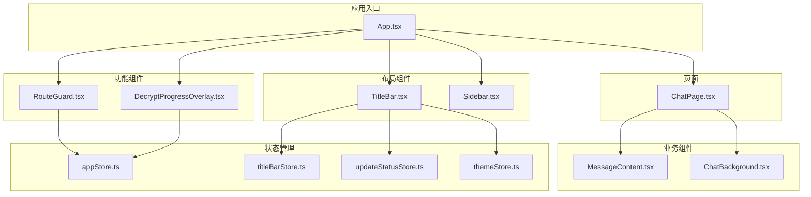
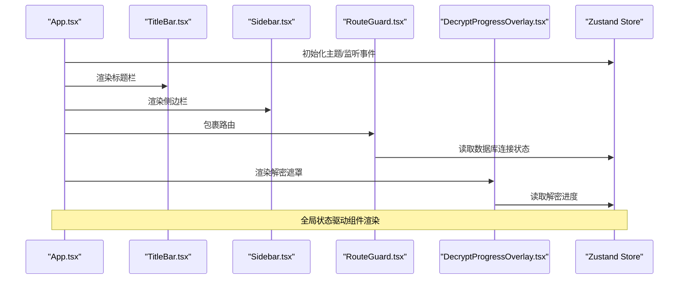
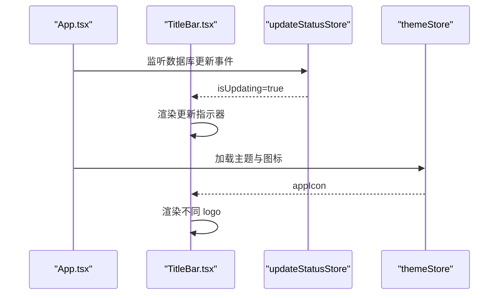
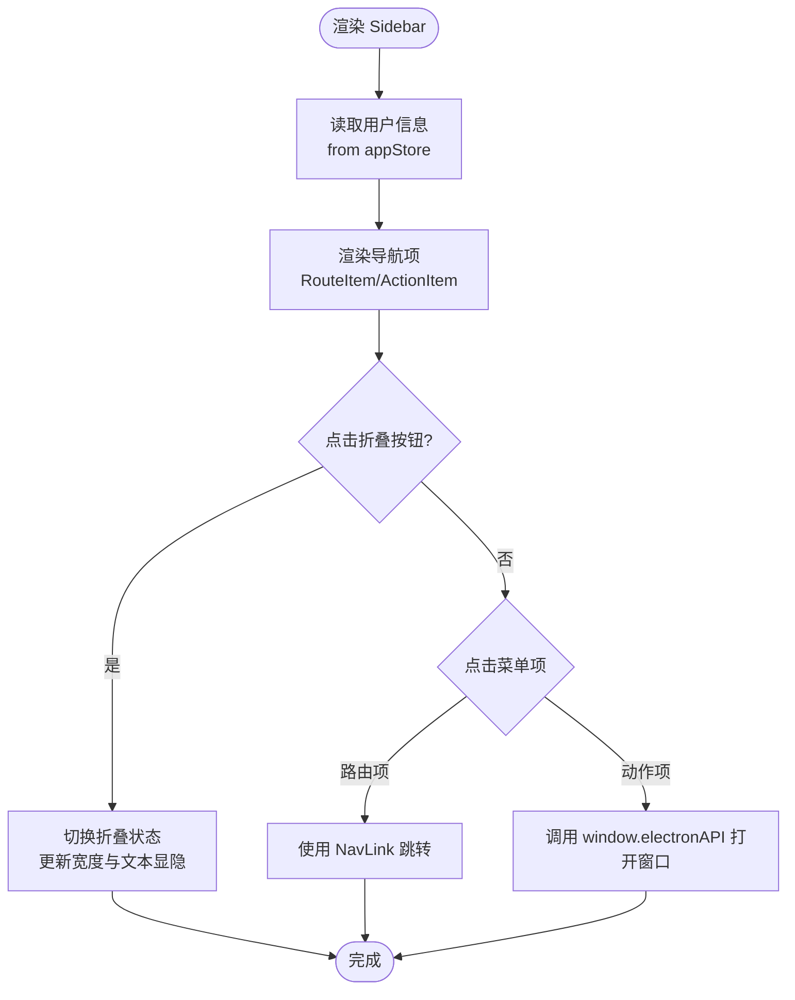
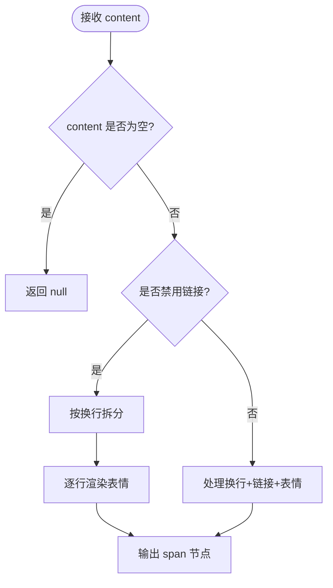
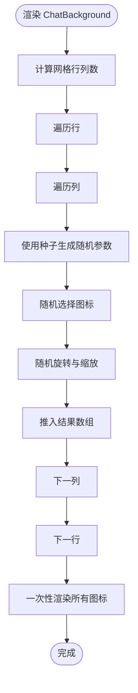
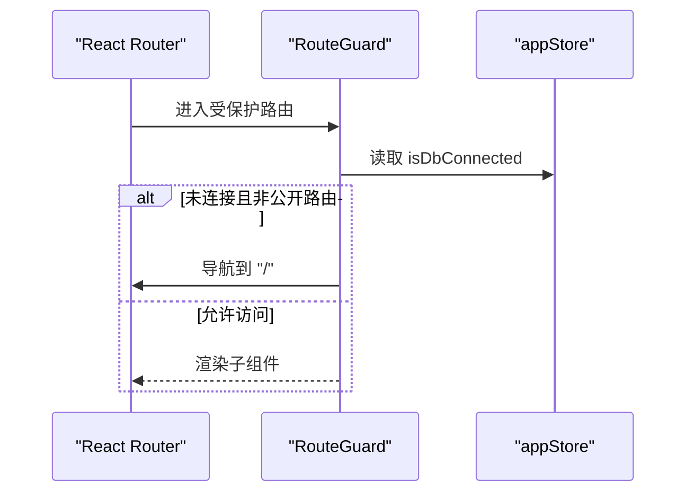
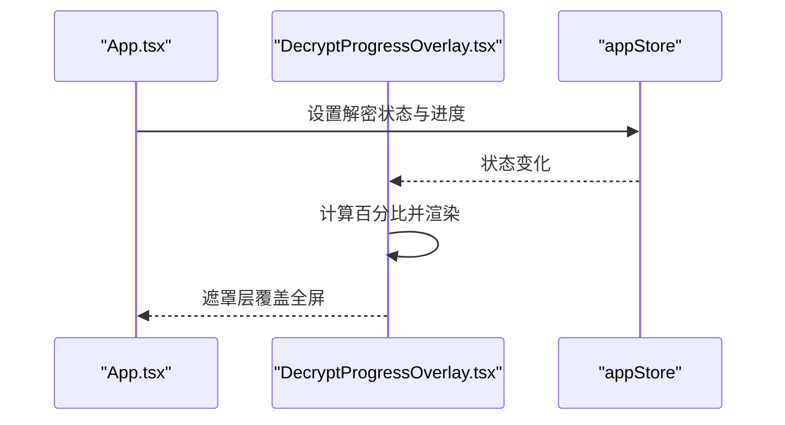
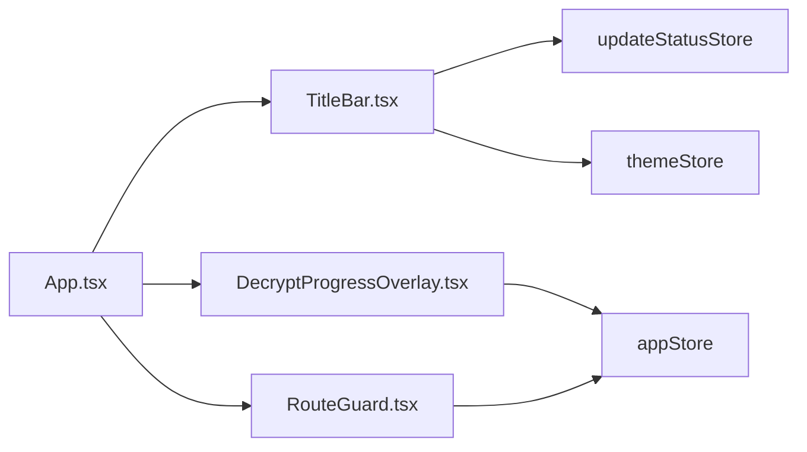
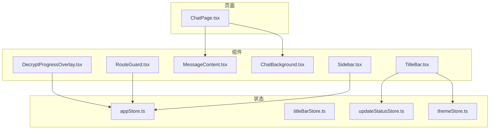

# 组件架构设计

<cite>
**本文档引用的文件**
- [src/App.tsx](file://src/App.tsx)
- [src/components/TitleBar.tsx](file://src/components/TitleBar.tsx)
- [src/components/TitleBar.scss](file://src/components/TitleBar.scss)
- [src/components/Sidebar.tsx](file://src/components/Sidebar.tsx)
- [src/components/MessageContent.tsx](file://src/components/MessageContent.tsx)
- [src/components/ChatBackground.tsx](file://src/components/ChatBackground.tsx)
- [src/components/ChatBackground.scss](file://src/components/ChatBackground.scss)
- [src/components/RouteGuard.tsx](file://src/components/RouteGuard.tsx)
- [src/components/DecryptProgressOverlay.tsx](file://src/components/DecryptProgressOverlay.tsx)
- [src/components/DecryptProgressOverlay.scss](file://src/components/DecryptProgressOverlay.scss)
- [src/stores/appStore.ts](file://src/stores/appStore.ts)
- [src/stores/titleBarStore.ts](file://src/stores/titleBarStore.ts)
- [src/stores/updateStatusStore.ts](file://src/stores/updateStatusStore.ts)
- [src/stores/themeStore.ts](file://src/stores/themeStore.ts)
- [src/pages/ChatPage.tsx](file://src/pages/ChatPage.tsx)
</cite>

## 目录
1. [引言](#引言)
2. [项目结构](#项目结构)
3. [核心组件](#核心组件)
4. [架构总览](#架构总览)
5. [详细组件分析](#详细组件分析)
6. [依赖关系分析](#依赖关系分析)
7. [性能考虑](#性能考虑)
8. [故障排查指南](#故障排查指南)
9. [结论](#结论)
10. [附录](#附录)

## 引言
本设计文档面向 CipherTalk 的组件化架构，系统阐述组件设计原则、分类体系、通信机制、复用策略与运行时特性。重点覆盖布局组件（TitleBar、Sidebar）、业务组件（MessageContent、ChatBackground）、功能组件（RouteGuard、DecryptProgressOverlay），并结合 Zustand 状态管理与 Electron IPC，给出可落地的组件开发规范与最佳实践。

## 项目结构
- 组件层：位于 src/components，包含布局、业务、功能三类组件，以及样式文件。
- 页面层：位于 src/pages，承载路由级页面逻辑与复杂交互。
- 状态层：位于 src/stores，采用 Zustand 构建模块化状态管理。
- 应用入口：src/App.tsx 组合页面与组件，统一处理主题、路由守卫、全局状态与事件监听。

图表来源
- [src/App.tsx:40-538](file://src/App.tsx#L40-L538)
- [src/components/TitleBar.tsx:1-52](file://src/components/TitleBar.tsx#L1-L52)
- [src/components/Sidebar.tsx:37-355](file://src/components/Sidebar.tsx#L37-L355)
- [src/components/MessageContent.tsx:1-103](file://src/components/MessageContent.tsx#L1-L103)
- [src/components/ChatBackground.tsx:1-83](file://src/components/ChatBackground.tsx#L1-L83)
- [src/components/RouteGuard.tsx:1-30](file://src/components/RouteGuard.tsx#L1-L30)
- [src/components/DecryptProgressOverlay.tsx:1-56](file://src/components/DecryptProgressOverlay.tsx#L1-L56)
- [src/stores/appStore.ts:1-97](file://src/stores/appStore.ts#L1-L97)
- [src/stores/titleBarStore.ts:1-13](file://src/stores/titleBarStore.ts#L1-L13)
- [src/stores/updateStatusStore.ts:1-28](file://src/stores/updateStatusStore.ts#L1-L28)
- [src/stores/themeStore.ts:1-146](file://src/stores/themeStore.ts#L1-L146)
- [src/pages/ChatPage.tsx:1-800](file://src/pages/ChatPage.tsx#L1-L800)

章节来源
- [src/App.tsx:40-538](file://src/App.tsx#L40-L538)

## 核心组件
- 布局组件
  - TitleBar：标题栏，支持右侧内容插槽、更新状态指示、主题图标联动。
  - Sidebar：侧边导航，支持折叠、动态菜单项、用户信息展示。
- 业务组件
  - MessageContent：消息文本渲染，处理换行、链接识别、微信表情。
  - ChatBackground：聊天背景装饰网格，基于种子的伪随机分布。
- 功能组件
  - RouteGuard：路由守卫，控制数据库连接态下的页面访问。
  - DecryptProgressOverlay：解密进度遮罩，展示环形进度与页码统计。

章节来源
- [src/components/TitleBar.tsx:8-52](file://src/components/TitleBar.tsx#L8-L52)
- [src/components/Sidebar.tsx:37-355](file://src/components/Sidebar.tsx#L37-L355)
- [src/components/MessageContent.tsx:5-103](file://src/components/MessageContent.tsx#L5-L103)
- [src/components/ChatBackground.tsx:19-83](file://src/components/ChatBackground.tsx#L19-L83)
- [src/components/RouteGuard.tsx:5-30](file://src/components/RouteGuard.tsx#L5-L30)
- [src/components/DecryptProgressOverlay.tsx:4-56](file://src/components/DecryptProgressOverlay.tsx#L4-L56)

## 架构总览
- 组件分类与职责
  - 布局组件：负责窗口框架与导航，强调可配置与主题一致性。
  - 业务组件：专注数据渲染与展示，强调可复用与可配置。
  - 功能组件：负责横切关注点（路由、解密、更新提示等）。
- 状态与通信
  - 状态：Zustand Store（appStore、titleBarStore、updateStatusStore、themeStore）。
  - 通信：父子 props/event、跨组件 Context/Zustand store。
- 生命周期与事件
  - App.tsx 统一初始化主题、监听更新事件、自动连接数据库、预加载用户信息。
  - 各组件通过 store 订阅状态变化，实现响应式更新。

图表来源
- [src/App.tsx:40-538](file://src/App.tsx#L40-L538)
- [src/components/TitleBar.tsx:13-52](file://src/components/TitleBar.tsx#L13-L52)
- [src/components/Sidebar.tsx:37-355](file://src/components/Sidebar.tsx#L37-L355)
- [src/components/RouteGuard.tsx:12-30](file://src/components/RouteGuard.tsx#L12-L30)
- [src/components/DecryptProgressOverlay.tsx:4-56](file://src/components/DecryptProgressOverlay.tsx#L4-L56)
- [src/stores/appStore.ts:40-97](file://src/stores/appStore.ts#L40-L97)
- [src/stores/titleBarStore.ts:9-13](file://src/stores/titleBarStore.ts#L9-L13)
- [src/stores/updateStatusStore.ts:16-28](file://src/stores/updateStatusStore.ts#L16-L28)
- [src/stores/themeStore.ts:79-146](file://src/stores/themeStore.ts#L79-L146)

## 详细组件分析

### 布局组件

#### TitleBar 组件
- 设计要点
  - Props 设计：支持 rightContent 插槽与 title 文案，内部回退到 store 中的 rightContent。
  - 状态订阅：订阅 updateStatusStore 的 isUpdating 与 themeStore 的 appIcon。
  - 视觉反馈：在更新时显示旋转指示器与提示文案。
- 交互流程
  - 组件挂载后根据 isUpdating 输出调试日志。
  - 根据 appIcon 决定 logo 路径，实现节日主题切换。
- 样式要点
  - 标题栏拖拽区域、更新状态动画、右侧面板拖拽禁用。

图表来源
- [src/components/TitleBar.tsx:13-52](file://src/components/TitleBar.tsx#L13-L52)
- [src/stores/updateStatusStore.ts:16-28](file://src/stores/updateStatusStore.ts#L16-L28)
- [src/stores/themeStore.ts:79-146](file://src/stores/themeStore.ts#L79-L146)

章节来源
- [src/components/TitleBar.tsx:8-52](file://src/components/TitleBar.tsx#L8-L52)
- [src/components/TitleBar.scss:1-112](file://src/components/TitleBar.scss#L1-L112)

#### Sidebar 组件
- 设计要点
  - 菜单项类型：RouteItem（路由跳转）与 ActionItem（原生窗口打开）。
  - 折叠逻辑：通过状态切换宽度与文本显隐，配合过渡动画。
  - 用户信息：从 appStore 读取用户信息，动态头像与初始字母。
- 交互流程
  - 点击菜单项触发路由或原生窗口打开。
  - 点击设置与折叠按钮分别跳转设置页与切换折叠状态。
- 性能优化
  - 使用 MUI Drawer 与 sx 属性实现高性能样式切换。
  - 列表项渲染通过 Tooltip 与 Box 组合减少 DOM 层级。

图表来源
- [src/components/Sidebar.tsx:37-355](file://src/components/Sidebar.tsx#L37-L355)
- [src/stores/appStore.ts:40-97](file://src/stores/appStore.ts#L40-L97)

章节来源
- [src/components/Sidebar.tsx:37-355](file://src/components/Sidebar.tsx#L37-L355)

### 业务组件

#### MessageContent 组件
- 设计要点
  - 输入：content 字符串，className 可选。
  - 功能：逐行处理换行符、链接识别、微信表情解析。
  - 可配置：disableLinks 参数可禁用链接处理，仅表情与换行。
- 性能与复用
  - 对每行进行 Fragment 拼接，避免不必要的节点提升。
  - 与 ChatPage 的会话摘要中复用，禁用链接以避免干扰摘要展示。

图表来源
- [src/components/MessageContent.tsx:14-103](file://src/components/MessageContent.tsx#L14-L103)

章节来源
- [src/components/MessageContent.tsx:5-103](file://src/components/MessageContent.tsx#L5-L103)

#### ChatBackground 组件
- 设计要点
  - 布局：固定定位，z-index 低于消息内容。
  - 生成：基于 90x90 网格，每格内随机位置与旋转缩放，图标从集合中随机选取。
  - 一致性：使用固定种子生成伪随机序列，保证多次渲染结果一致。
- 样式要点
  - 深色模式下透明度调整，确保视觉平衡。

图表来源
- [src/components/ChatBackground.tsx:19-83](file://src/components/ChatBackground.tsx#L19-L83)
- [src/components/ChatBackground.scss:1-26](file://src/components/ChatBackground.scss#L1-L26)

章节来源
- [src/components/ChatBackground.tsx:19-83](file://src/components/ChatBackground.tsx#L19-L83)
- [src/components/ChatBackground.scss:1-26](file://src/components/ChatBackground.scss#L1-L26)

### 功能组件

#### RouteGuard 组件
- 设计要点
  - 公共路由白名单：无需数据库连接即可访问。
  - 保护逻辑：未连接数据库且访问非公开路由时，强制跳转到欢迎页。
- 通信机制
  - 通过 appStore 读取 isDbConnected 状态，useEffect 监听 location 变化。

图表来源
- [src/components/RouteGuard.tsx:12-30](file://src/components/RouteGuard.tsx#L12-L30)
- [src/stores/appStore.ts:40-97](file://src/stores/appStore.ts#L40-L97)

章节来源
- [src/components/RouteGuard.tsx:5-30](file://src/components/RouteGuard.tsx#L5-L30)

#### DecryptProgressOverlay 组件
- 设计要点
  - 条件渲染：仅在 isDecrypting 为真时显示。
  - 进度计算：基于 decryptProgress 与 decryptTotal 计算百分比。
  - 信息展示：当前数据库名、页码统计与提示文本。
- 通信机制
  - 直接订阅 appStore 的解密状态。

图表来源
- [src/components/DecryptProgressOverlay.tsx:4-56](file://src/components/DecryptProgressOverlay.tsx#L4-L56)
- [src/stores/appStore.ts:40-97](file://src/stores/appStore.ts#L40-L97)
- [src/components/DecryptProgressOverlay.scss:1-80](file://src/components/DecryptProgressOverlay.scss#L1-L80)

章节来源
- [src/components/DecryptProgressOverlay.tsx:4-56](file://src/components/DecryptProgressOverlay.tsx#L4-L56)
- [src/components/DecryptProgressOverlay.scss:1-80](file://src/components/DecryptProgressOverlay.scss#L1-L80)

### 状态与通信机制

#### 组件通信矩阵
- 父子组件通信
  - App.tsx -> TitleBar：传递 title 与 rightContent 插槽。
  - App.tsx -> RouteGuard：包裹路由内容。
  - App.tsx -> DecryptProgressOverlay：条件渲染。
- 兄弟组件通信
  - 通过全局 store（updateStatusStore）共享“更新中”状态，TitleBar 与 App 共同消费。
- 跨层级通信
  - 所有组件通过 Zustand store 订阅状态，实现跨层级响应式更新。
  - ThemeStore 与 Electron IPC 结合，实现主题持久化与图标切换。

图表来源
- [src/App.tsx:40-538](file://src/App.tsx#L40-L538)
- [src/components/TitleBar.tsx:13-52](file://src/components/TitleBar.tsx#L13-L52)
- [src/components/RouteGuard.tsx:12-30](file://src/components/RouteGuard.tsx#L12-L30)
- [src/components/DecryptProgressOverlay.tsx:4-56](file://src/components/DecryptProgressOverlay.tsx#L4-L56)
- [src/stores/updateStatusStore.ts:16-28](file://src/stores/updateStatusStore.ts#L16-L28)
- [src/stores/themeStore.ts:79-146](file://src/stores/themeStore.ts#L79-L146)
- [src/stores/appStore.ts:40-97](file://src/stores/appStore.ts#L40-L97)

章节来源
- [src/stores/appStore.ts:1-97](file://src/stores/appStore.ts#L1-L97)
- [src/stores/titleBarStore.ts:1-13](file://src/stores/titleBarStore.ts#L1-L13)
- [src/stores/updateStatusStore.ts:1-28](file://src/stores/updateStatusStore.ts#L1-L28)
- [src/stores/themeStore.ts:1-146](file://src/stores/themeStore.ts#L1-L146)

## 依赖关系分析

图表来源
- [src/components/TitleBar.tsx:1-52](file://src/components/TitleBar.tsx#L1-L52)
- [src/components/Sidebar.tsx:1-355](file://src/components/Sidebar.tsx#L1-L355)
- [src/components/MessageContent.tsx:1-103](file://src/components/MessageContent.tsx#L1-L103)
- [src/components/ChatBackground.tsx:1-83](file://src/components/ChatBackground.tsx#L1-L83)
- [src/components/RouteGuard.tsx:1-30](file://src/components/RouteGuard.tsx#L1-L30)
- [src/components/DecryptProgressOverlay.tsx:1-56](file://src/components/DecryptProgressOverlay.tsx#L1-L56)
- [src/stores/appStore.ts:1-97](file://src/stores/appStore.ts#L1-L97)
- [src/stores/titleBarStore.ts:1-13](file://src/stores/titleBarStore.ts#L1-L13)
- [src/stores/updateStatusStore.ts:1-28](file://src/stores/updateStatusStore.ts#L1-L28)
- [src/stores/themeStore.ts:1-146](file://src/stores/themeStore.ts#L1-L146)
- [src/pages/ChatPage.tsx:1-800](file://src/pages/ChatPage.tsx#L1-L800)

章节来源
- [src/App.tsx:40-538](file://src/App.tsx#L40-L538)

## 性能考虑
- 渲染优化
  - ChatBackground 使用 useMemo 缓存图标列表，避免重复计算。
  - MessageContent 对每行进行 Fragment 拼接，减少节点层级。
  - Sidebar 使用 MUI sx 属性与过渡动画，避免频繁重排。
- 状态订阅
  - 组件仅订阅所需字段，降低重渲染频率。
  - App.tsx 通过事件监听集中处理外部状态变化，减少子组件副作用。
- 图片与列表
  - ChatPage 中头像懒加载与骨架屏，结合 IntersectionObserver 与超时处理，提升首屏体验。
  - react-window 列表组件按需渲染，结合去重与智能合并更新，减少闪烁。

章节来源
- [src/components/ChatBackground.tsx:25-62](file://src/components/ChatBackground.tsx#L25-L62)
- [src/components/MessageContent.tsx:14-103](file://src/components/MessageContent.tsx#L14-L103)
- [src/pages/ChatPage.tsx:42-166](file://src/pages/ChatPage.tsx#L42-L166)

## 故障排查指南
- 路由守卫导致页面无法访问
  - 检查 appStore 的 isDbConnected 状态是否为 false。
  - 确认访问路径是否在公共路由白名单中。
- 解密遮罩不消失
  - 检查 appStore 的 isDecrypting、decryptProgress、decryptTotal 是否正确更新。
  - 确认 Electron IPC 是否正常触发进度回调。
- 标题栏更新指示器不显示
  - 检查 updateStatusStore 的 setIsUpdating 与 addLog 是否被调用。
  - 确认 App.tsx 的事件监听是否注册成功。
- 主题图标不切换
  - 检查 themeStore 的 setAppIcon 是否调用 window.electronAPI.app.setAppIcon。
  - 确认 Electron 配置读取与写入是否成功。

章节来源
- [src/components/RouteGuard.tsx:12-30](file://src/components/RouteGuard.tsx#L12-L30)
- [src/components/DecryptProgressOverlay.tsx:4-56](file://src/components/DecryptProgressOverlay.tsx#L4-L56)
- [src/stores/updateStatusStore.ts:16-28](file://src/stores/updateStatusStore.ts#L16-L28)
- [src/stores/themeStore.ts:103-111](file://src/stores/themeStore.ts#L103-L111)

## 结论
CipherTalk 的组件架构以“布局-业务-功能”三层清晰分离为基础，结合 Zustand 实现跨层级状态共享与响应式渲染。通过 props 插槽、store 订阅与 Electron IPC，实现了稳定的组件通信与运行时行为。建议在后续迭代中进一步细化组件 Props 接口文档、增强错误边界与日志埋点，持续优化长列表与图片懒加载性能。

## 附录

### 组件设计规范与命名约定
- 命名约定
  - 布局组件：TitleBar、Sidebar。
  - 业务组件：MessageContent、ChatBackground。
  - 功能组件：RouteGuard、DecryptProgressOverlay。
- Props 设计模式
  - 插槽模式：TitleBar 的 rightContent 支持外部注入。
  - 可选参数：MessageContent 的 disableLinks 控制渲染行为。
  - 状态订阅：组件内部通过 store 订阅必要字段，避免过度透传。

章节来源
- [src/components/TitleBar.tsx:8-11](file://src/components/TitleBar.tsx#L8-L11)
- [src/components/MessageContent.tsx:5-8](file://src/components/MessageContent.tsx#L5-L8)
- [src/components/RouteGuard.tsx:5-7](file://src/components/RouteGuard.tsx#L5-L7)