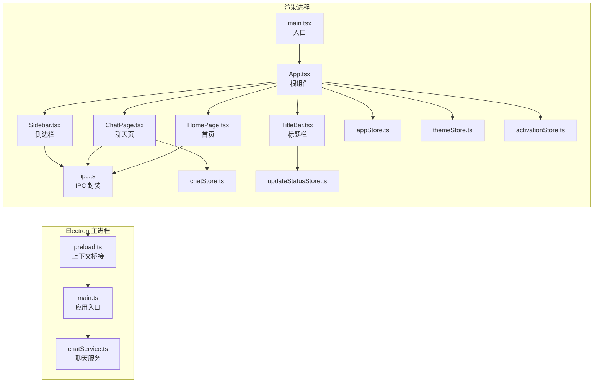
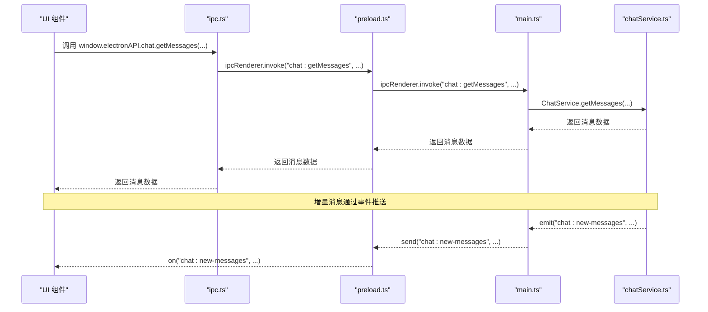
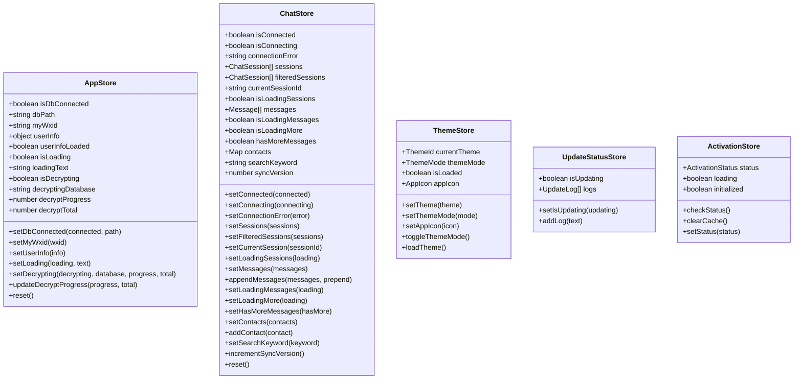
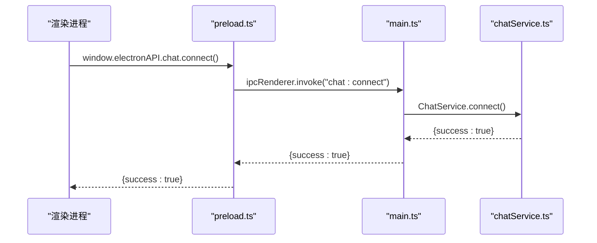
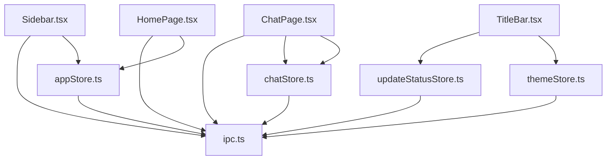

# 组件通信机制

<cite>
**本文档引用的文件**
- [src/stores/appStore.ts](file://src/stores/appStore.ts)
- [src/stores/chatStore.ts](file://src/stores/chatStore.ts)
- [src/stores/themeStore.ts](file://src/stores/themeStore.ts)
- [src/stores/updateStatusStore.ts](file://src/stores/updateStatusStore.ts)
- [src/stores/activationStore.ts](file://src/stores/activationStore.ts)
- [src/services/ipc.ts](file://src/services/ipc.ts)
- [src/App.tsx](file://src/App.tsx)
- [src/main.tsx](file://src/main.tsx)
- [src/components/Sidebar.tsx](file://src/components/Sidebar.tsx)
- [src/pages/ChatPage.tsx](file://src/pages/ChatPage.tsx)
- [src/pages/HomePage.tsx](file://src/pages/HomePage.tsx)
- [src/components/TitleBar.tsx](file://src/components/TitleBar.tsx)
- [electron/preload.ts](file://electron/preload.ts)
- [electron/main.ts](file://electron/main.ts)
- [electron/services/chatService.ts](file://electron/services/chatService.ts)
</cite>

## 目录
1. [简介](#简介)
2. [项目结构](#项目结构)
3. [核心组件](#核心组件)
4. [架构总览](#架构总览)
5. [详细组件分析](#详细组件分析)
6. [依赖关系分析](#依赖关系分析)
7. [性能考量](#性能考量)
8. [故障排除指南](#故障排除指南)
9. [结论](#结论)
10. [附录](#附录)

## 简介
本文件系统性梳理 CipherTalk 的组件通信机制，覆盖以下方面：
- 组件间通信方式：父子组件通信（props/事件）、兄弟组件通信（事件总线）、跨层级通信（Context/Zustand store）
- 状态管理模式：Zustand store 设计、状态提升策略、状态同步机制
- IPC 通信实现：主进程-渲染进程通信、数据传输协议、错误处理
- 最佳实践：单向数据流、避免循环依赖、性能优化
- 调试方法：日志记录、状态追踪、性能监控
- 故障排除指南

## 项目结构
项目采用前端 React + Electron 主进程的双层架构，前端通过 preload 暴露的 API 与主进程通信，状态管理统一使用 Zustand。

图表来源
- [src/main.tsx:1-14](file://src/main.tsx#L1-L14)
- [src/App.tsx:1-538](file://src/App.tsx#L1-L538)
- [src/components/Sidebar.tsx:1-355](file://src/components/Sidebar.tsx#L1-L355)
- [src/pages/ChatPage.tsx:1-800](file://src/pages/ChatPage.tsx#L1-L800)
- [src/pages/HomePage.tsx:1-175](file://src/pages/HomePage.tsx#L1-L175)
- [src/components/TitleBar.tsx:1-52](file://src/components/TitleBar.tsx#L1-L52)
- [src/services/ipc.ts:1-38](file://src/services/ipc.ts#L1-L38)
- [electron/preload.ts:1-454](file://electron/preload.ts#L1-L454)
- [electron/main.ts:1-800](file://electron/main.ts#L1-L800)
- [electron/services/chatService.ts:1-800](file://electron/services/chatService.ts#L1-L800)

章节来源
- [src/main.tsx:1-14](file://src/main.tsx#L1-L14)
- [src/App.tsx:1-538](file://src/App.tsx#L1-L538)
- [electron/main.ts:1-800](file://electron/main.ts#L1-L800)

## 核心组件
- Zustand Store：集中管理应用状态，包括应用全局状态、聊天状态、主题状态、更新状态、激活状态等。
- IPC 封装：在渲染进程中提供统一的 API，屏蔽主进程细节。
- 主进程服务：提供数据库、聊天、分析、导出等能力，并通过事件向渲染进程推送增量数据。
- UI 组件：通过 Store 和 IPC 与服务层交互，实现数据驱动的视图更新。

章节来源
- [src/stores/appStore.ts:1-97](file://src/stores/appStore.ts#L1-L97)
- [src/stores/chatStore.ts:1-146](file://src/stores/chatStore.ts#L1-L146)
- [src/stores/themeStore.ts:1-146](file://src/stores/themeStore.ts#L1-L146)
- [src/stores/updateStatusStore.ts:1-28](file://src/stores/updateStatusStore.ts#L1-L28)
- [src/stores/activationStore.ts:1-45](file://src/stores/activationStore.ts#L1-L45)
- [src/services/ipc.ts:1-38](file://src/services/ipc.ts#L1-L38)

## 架构总览
渲染进程通过 preload 暴露的 electronAPI 与主进程通信，主进程的服务层处理复杂逻辑并向渲染进程推送事件。Zustand Store 作为单一事实来源，驱动 UI 更新。

图表来源
- [src/services/ipc.ts:1-38](file://src/services/ipc.ts#L1-L38)
- [electron/preload.ts:241-287](file://electron/preload.ts#L241-L287)
- [electron/main.ts:1-800](file://electron/main.ts#L1-L800)
- [electron/services/chatService.ts:1-800](file://electron/services/chatService.ts#L1-L800)

## 详细组件分析

### 父子组件通信（props/事件）
- 父组件 App.tsx 通过路由组织子组件，如 ChatPage、HomePage、Sidebar 等。
- 子组件通过 props 接收状态（如 Sidebar 从 appStore 读取用户信息），并通过事件（如点击打开独立窗口）与父组件协作。
- 示例：Sidebar 通过 window.electronAPI.window.openChatWindow 打开独立聊天窗口，属于事件驱动的父子协作。

章节来源
- [src/App.tsx:1-538](file://src/App.tsx#L1-L538)
- [src/components/Sidebar.tsx:1-355](file://src/components/Sidebar.tsx#L1-L355)

### 兄弟组件通信（事件总线）
- 渲染进程内部通过 window.electronAPI.chat.onNewMessages 监听主进程推送的增量消息，实现兄弟组件（如 ChatPage 与 App.tsx）之间的松耦合通信。
- App.tsx 通过 window.electronAPI.chat.onSessionsUpdated 监听会话列表更新，实现兄弟组件间的状态同步。

章节来源
- [src/pages/ChatPage.tsx:542-585](file://src/pages/ChatPage.tsx#L542-L585)
- [src/App.tsx:136-168](file://src/App.tsx#L136-L168)
- [electron/preload.ts:282-286](file://electron/preload.ts#L282-L286)

### 跨层级通信（Context/Zustand Store）
- 全局状态通过多个 Zustand Store 管理：appStore（应用状态）、chatStore（聊天状态）、themeStore（主题状态）、updateStatusStore（更新状态）、activationStore（激活状态）。
- 组件通过 useStore 读取状态，通过 action 修改状态，实现跨层级通信。
- 示例：App.tsx 读取 themeStore 的主题信息并应用到 DOM 属性；ChatPage 读取 chatStore 的消息列表并渲染。

图表来源
- [src/stores/appStore.ts:1-97](file://src/stores/appStore.ts#L1-L97)
- [src/stores/chatStore.ts:1-146](file://src/stores/chatStore.ts#L1-L146)
- [src/stores/themeStore.ts:1-146](file://src/stores/themeStore.ts#L1-L146)
- [src/stores/updateStatusStore.ts:1-28](file://src/stores/updateStatusStore.ts#L1-L28)
- [src/stores/activationStore.ts:1-45](file://src/stores/activationStore.ts#L1-L45)

章节来源
- [src/stores/appStore.ts:1-97](file://src/stores/appStore.ts#L1-L97)
- [src/stores/chatStore.ts:1-146](file://src/stores/chatStore.ts#L1-L146)
- [src/stores/themeStore.ts:1-146](file://src/stores/themeStore.ts#L1-L146)
- [src/stores/updateStatusStore.ts:1-28](file://src/stores/updateStatusStore.ts#L1-L28)
- [src/stores/activationStore.ts:1-45](file://src/stores/activationStore.ts#L1-L45)

### 状态管理模式
- 设计原则：单一职责、最小必要状态、不可变更新。
- 状态提升：将跨组件共享的状态提升到 Zustand Store，避免 props 逐层传递。
- 同步机制：主进程通过事件推送增量数据，渲染进程通过 Store action 更新状态，UI 自动响应。

章节来源
- [src/App.tsx:136-168](file://src/App.tsx#L136-L168)
- [src/pages/ChatPage.tsx:542-585](file://src/pages/ChatPage.tsx#L542-L585)

### IPC 通信实现
- 渲染进程 API：src/services/ipc.ts 封装了 config、db、decrypt、dialog、window 等模块的调用。
- 上下文桥接：electron/preload.ts 通过 contextBridge.exposeInMainWorld 暴露 electronAPI，将 ipcRenderer.invoke/send 映射到具体主进程处理函数。
- 主进程处理：electron/main.ts 注册 ipcMain 处理器，调用相应服务（如 chatService）。
- 数据传输协议：invoke 用于请求-响应，send 用于单向事件；事件名遵循 "模块:动作" 命名规范。
- 错误处理：渲染进程捕获异常并记录日志；主进程服务层对数据库异常进行包装返回。

图表来源
- [src/services/ipc.ts:1-38](file://src/services/ipc.ts#L1-L38)
- [electron/preload.ts:241-243](file://electron/preload.ts#L241-L243)
- [electron/main.ts:1-800](file://electron/main.ts#L1-L800)
- [electron/services/chatService.ts:1-800](file://electron/services/chatService.ts#L1-L800)

章节来源
- [src/services/ipc.ts:1-38](file://src/services/ipc.ts#L1-L38)
- [electron/preload.ts:1-454](file://electron/preload.ts#L1-L454)
- [electron/main.ts:1-800](file://electron/main.ts#L1-L800)
- [electron/services/chatService.ts:1-800](file://electron/services/chatService.ts#L1-L800)

### 组件通信最佳实践
- 单向数据流：Store 为唯一数据源，组件仅订阅状态并触发 action。
- 避免循环依赖：通过 Store 抽象共享状态，组件之间通过 Store 交互而非直接互相引用。
- 性能优化：使用 useMemo/useCallback、虚拟滚动、懒加载、缓存（LRU）、预编译 SQL、增量更新等策略。

章节来源
- [src/pages/ChatPage.tsx:1-800](file://src/pages/ChatPage.tsx#L1-L800)
- [electron/services/chatService.ts:1-800](file://electron/services/chatService.ts#L1-L800)

## 依赖关系分析
- 组件依赖 Store：Sidebar、ChatPage、HomePage、TitleBar 等组件依赖对应的 Store。
- 组件依赖 IPC：所有需要与主进程交互的组件都依赖 src/services/ipc.ts。
- Store 依赖主进程：部分 Store 的 action 通过 window.electronAPI 调用主进程服务。

图表来源
- [src/components/Sidebar.tsx:1-355](file://src/components/Sidebar.tsx#L1-L355)
- [src/pages/ChatPage.tsx:1-800](file://src/pages/ChatPage.tsx#L1-L800)
- [src/pages/HomePage.tsx:1-175](file://src/pages/HomePage.tsx#L1-L175)
- [src/components/TitleBar.tsx:1-52](file://src/components/TitleBar.tsx#L1-L52)
- [src/services/ipc.ts:1-38](file://src/services/ipc.ts#L1-L38)
- [src/stores/appStore.ts:1-97](file://src/stores/appStore.ts#L1-L97)
- [src/stores/chatStore.ts:1-146](file://src/stores/chatStore.ts#L1-L146)
- [src/stores/themeStore.ts:1-146](file://src/stores/themeStore.ts#L1-L146)
- [src/stores/updateStatusStore.ts:1-28](file://src/stores/updateStatusStore.ts#L1-L28)

章节来源
- [src/components/Sidebar.tsx:1-355](file://src/components/Sidebar.tsx#L1-L355)
- [src/pages/ChatPage.tsx:1-800](file://src/pages/ChatPage.tsx#L1-L800)
- [src/pages/HomePage.tsx:1-175](file://src/pages/HomePage.tsx#L1-L175)
- [src/components/TitleBar.tsx:1-52](file://src/components/TitleBar.tsx#L1-L52)
- [src/services/ipc.ts:1-38](file://src/services/ipc.ts#L1-L38)
- [src/stores/appStore.ts:1-97](file://src/stores/appStore.ts#L1-L97)
- [src/stores/chatStore.ts:1-146](file://src/stores/chatStore.ts#L1-L146)
- [src/stores/themeStore.ts:1-146](file://src/stores/themeStore.ts#L1-L146)
- [src/stores/updateStatusStore.ts:1-28](file://src/stores/updateStatusStore.ts#L1-L28)

## 性能考量
- 渲染性能：ChatPage 使用 react-window 虚拟列表，减少 DOM 节点数量；消息列表使用去重算法避免重复渲染。
- 状态更新：Store 使用不可变更新，配合 React.memo 降低重渲染成本。
- 数据库性能：chatService 使用预编译语句、索引、缓存（会话表、头像、列信息）提升查询效率。
- 网络与 I/O：IPC 采用 invoke/send 分离，避免阻塞主线程；增量更新减少全量拉取。

章节来源
- [src/pages/ChatPage.tsx:1-800](file://src/pages/ChatPage.tsx#L1-L800)
- [electron/services/chatService.ts:1-800](file://electron/services/chatService.ts#L1-L800)

## 故障排除指南
- 数据库连接失败：检查解密密钥、数据库路径；查看 App.tsx 中的日志输出与错误提示。
- 增量更新不生效：确认主进程 chatService 的 setCurrentSession 与 onNewMessages 事件是否正确绑定；检查渲染进程监听是否移除。
- 主题切换异常：检查 themeStore 的 loadTheme 与 preload.ts 的同步逻辑。
- 激活状态异常：使用 activationStore 的 checkStatus 与 clearCache 重置状态。
- IPC 调用超时：检查主进程处理器注册情况与 preload 暴露的 API 名称一致性。

章节来源
- [src/App.tsx:136-168](file://src/App.tsx#L136-L168)
- [src/stores/activationStore.ts:1-45](file://src/stores/activationStore.ts#L1-L45)
- [electron/preload.ts:1-454](file://electron/preload.ts#L1-L454)
- [electron/services/chatService.ts:1-800](file://electron/services/chatService.ts#L1-L800)

## 结论
CipherTalk 通过清晰的分层架构与 Zustand 状态管理，实现了组件间高效、可维护的通信。IPC 通道以事件驱动的方式实现主进程与渲染进程的解耦协作。建议持续优化状态粒度与缓存策略，完善错误边界与日志体系，以进一步提升用户体验与系统稳定性。

## 附录
- 调试技巧：利用 console.log 输出关键流程；使用浏览器开发者工具观察 Store 变化；通过 preload.ts 的事件监听确认 IPC 通路。
- 性能监控：结合 updateStatusStore 的日志与 UI 的更新指示器，定位卡顿与异常。