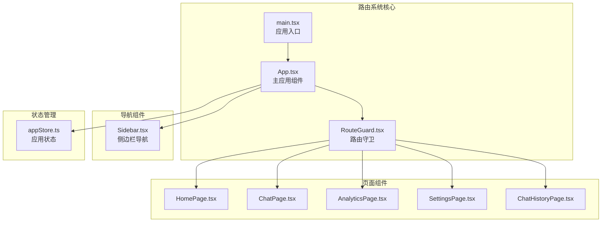
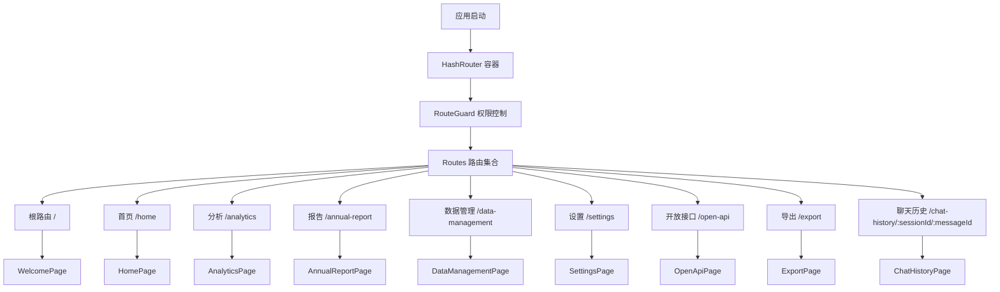
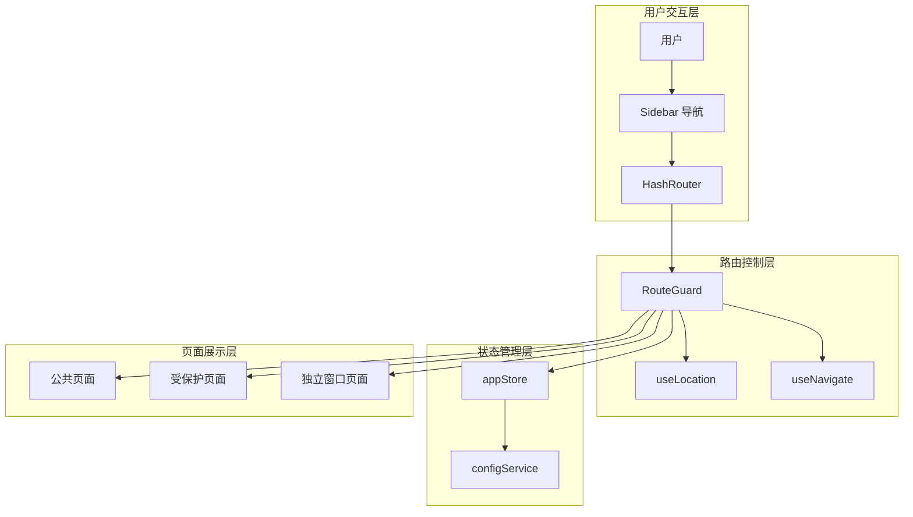
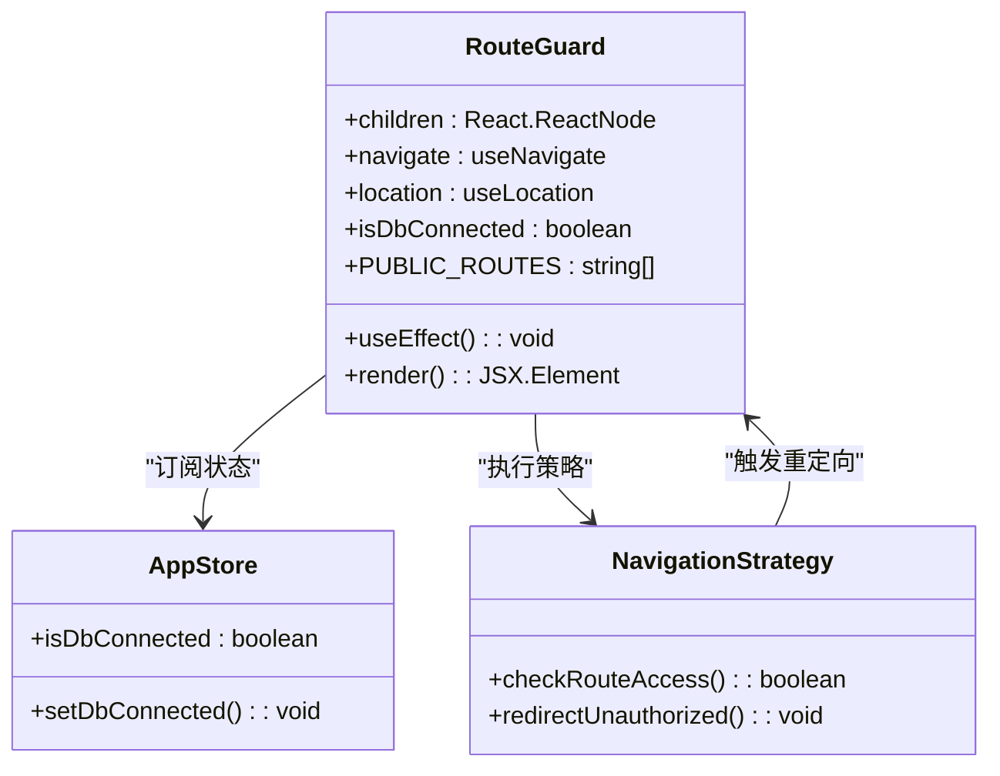
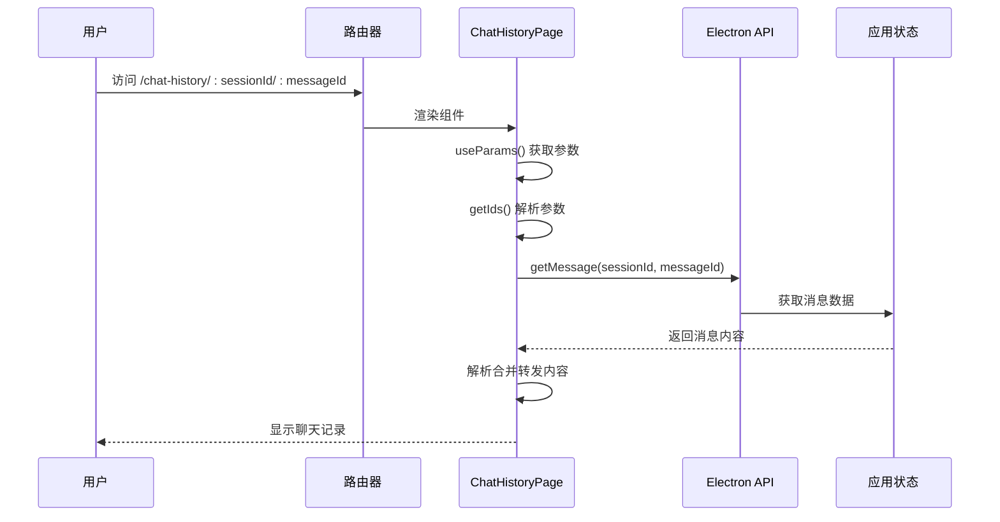
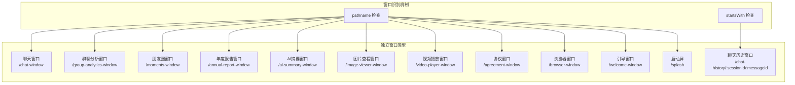
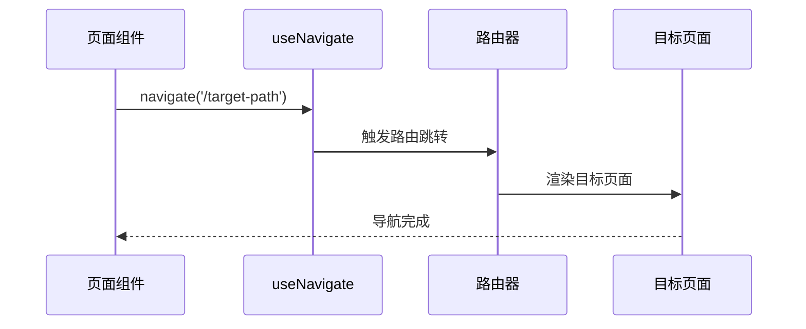
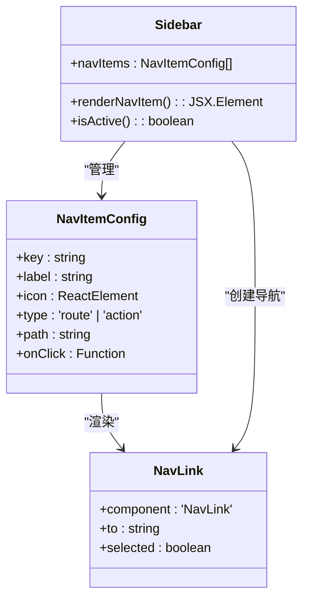
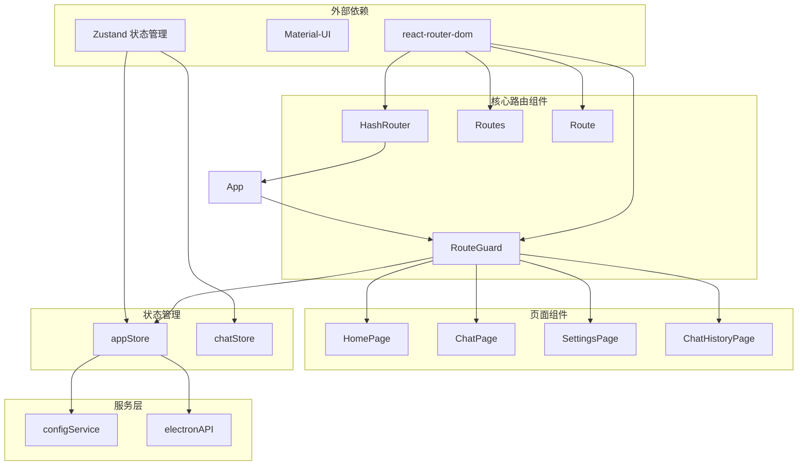

# 路由系统设计

<cite>
**本文档引用的文件**
- [src/App.tsx](file://src/App.tsx)
- [src/main.tsx](file://src/main.tsx)
- [src/components/RouteGuard.tsx](file://src/components/RouteGuard.tsx)
- [src/components/Sidebar.tsx](file://src/components/Sidebar.tsx)
- [src/pages/ChatHistoryPage.tsx](file://src/pages/ChatHistoryPage.tsx)
- [src/stores/appStore.ts](file://src/stores/appStore.ts)
- [src/services/config.ts](file://src/services/config.ts)
- [src/pages/HomePage.tsx](file://src/pages/HomePage.tsx)
- [src/pages/BrowserWindowPage.tsx](file://src/pages/BrowserWindowPage.tsx)
- [electron/main.ts](file://electron/main.ts)
- [electron/services/httpApiService.ts](file://electron/services/httpApiService.ts)
</cite>

## 目录
1. [简介](#简介)
2. [项目结构](#项目结构)
3. [核心组件](#核心组件)
4. [架构概览](#架构概览)
5. [详细组件分析](#详细组件分析)
6. [依赖关系分析](#依赖关系分析)
7. [性能考虑](#性能考虑)
8. [故障排除指南](#故障排除指南)
9. [结论](#结论)

## 简介

CipherTalk 是一个基于 React Router 的单页应用(SPA)，采用 HashRouter 实现路由控制。该路由系统设计了完整的页面导航体系，包括基础路由配置、嵌套路由设计、动态路由参数处理、路由守卫机制以及独立窗口路由支持。

系统采用模块化设计，通过 RouteGuard 组件实现权限控制，通过独立窗口机制支持多种专用页面，实现了从路由到页面组件的完整数据流向。

## 项目结构

CipherTalk 的路由系统基于 React Router v6 构建，采用以下文件组织结构：



**图表来源**
- [src/main.tsx:1-14](file://src/main.tsx#L1-L14)
- [src/App.tsx:1-538](file://src/App.tsx#L1-L538)
- [src/components/RouteGuard.tsx:1-30](file://src/components/RouteGuard.tsx#L1-L30)

**章节来源**
- [src/main.tsx:1-14](file://src/main.tsx#L1-L14)
- [src/App.tsx:1-538](file://src/App.tsx#L1-L538)

## 核心组件

### 路由配置策略

系统采用 HashRouter 作为基础路由容器，在应用入口处统一配置：



**图表来源**
- [src/App.tsx:507-519](file://src/App.tsx#L507-L519)

### 嵌套路由设计

系统实现了清晰的嵌套路由结构，通过 RouteGuard 组件实现权限控制：

- **公共路由**: `/`、`/settings`、`/data-management` - 无需数据库连接
- **受保护路由**: `/home`、`/analytics`、`/annual-report`、`/export` - 需要数据库连接
- **动态路由**: `/chat-history/:sessionId/:messageId` - 支持动态参数

**章节来源**
- [src/components/RouteGuard.tsx:9-11](file://src/components/RouteGuard.tsx#L9-L11)
- [src/App.tsx:507-519](file://src/App.tsx#L507-L519)

## 架构概览

CipherTalk 的路由系统采用分层架构设计，实现了路由控制、权限验证、页面导航的完整闭环：



**图表来源**
- [src/App.tsx:184-344](file://src/App.tsx#L184-L344)
- [src/components/RouteGuard.tsx:12-27](file://src/components/RouteGuard.tsx#L12-L27)

## 详细组件分析

### RouteGuard 路由守卫组件

RouteGuard 是整个路由系统的核心安全组件，实现了基于数据库连接状态的权限控制：



**图表来源**
- [src/components/RouteGuard.tsx:1-30](file://src/components/RouteGuard.tsx#L1-L30)
- [src/stores/appStore.ts:40-95](file://src/stores/appStore.ts#L40-L95)

#### 权限控制逻辑

RouteGuard 实现了三层权限控制机制：

1. **公共路由白名单**: `/`、`/settings`、`/data-management` - 无需数据库连接
2. **数据库连接检查**: 非公共路由需检查 `isDbConnected` 状态
3. **实时状态监控**: 通过 `useEffect` 监控路由变化，动态执行权限验证

**章节来源**
- [src/components/RouteGuard.tsx:17-24](file://src/components/RouteGuard.tsx#L17-L24)

### 动态路由参数处理

系统支持复杂的动态路由参数，特别是聊天历史页面的多级参数传递：



**图表来源**
- [src/pages/ChatHistoryPage.tsx:8-152](file://src/pages/ChatHistoryPage.tsx#L8-L152)

#### 参数解析策略

系统实现了双重参数解析机制：

1. **标准路由参数**: 使用 `useParams()` 获取 `:sessionId` 和 `:messageId`
2. **独立窗口兼容**: 对于无 Route 包裹的独立窗口，使用 `location.pathname` 正则匹配解析

**章节来源**
- [src/pages/ChatHistoryPage.tsx:9-112](file://src/pages/ChatHistoryPage.tsx#L9-L112)

### 独立窗口路由系统

CipherTalk 支持多种专用独立窗口，每种窗口都有特定的路由路径和功能：



**图表来源**
- [src/App.tsx:184-344](file://src/App.tsx#L184-L344)

#### 窗口类型识别

系统通过多种方式识别窗口类型：

1. **精确路径匹配**: 使用 `location.pathname === '/path'` 进行精确匹配
2. **前缀匹配**: 使用 `location.pathname.startsWith('/chat-history/')` 支持动态参数
3. **条件判断**: 根据窗口类型执行不同的渲染策略

**章节来源**
- [src/App.tsx:266-344](file://src/App.tsx#L266-L344)

### 路由导航策略

系统实现了多种导航策略，满足不同场景的需求：

#### 编程式导航



**图表来源**
- [src/pages/HomePage.tsx:155](file://src/pages/HomePage.tsx#L155)

#### 声明式导航

通过 Sidebar 组件实现声明式导航：



**图表来源**
- [src/components/Sidebar.tsx:19-33](file://src/components/Sidebar.tsx#L19-L33)

**章节来源**
- [src/components/Sidebar.tsx:152-181](file://src/components/Sidebar.tsx#L152-L181)

## 依赖关系分析

路由系统各组件之间的依赖关系如下：



**图表来源**
- [src/main.tsx:2-3](file://src/main.tsx#L2-L3)
- [src/App.tsx:28-36](file://src/App.tsx#L28-L36)

**章节来源**
- [src/App.tsx:1-538](file://src/App.tsx#L1-L538)
- [src/stores/appStore.ts:1-97](file://src/stores/appStore.ts#L1-L97)

## 性能考虑

### 懒加载实现

系统通过多种方式实现性能优化：

1. **组件懒加载**: 使用 React.lazy 实现组件级别的代码分割
2. **图片懒加载**: ChatPage 中实现了 IntersectionObserver 图片懒加载
3. **虚拟滚动**: 使用 react-window 实现大数据量列表的虚拟滚动

### 代码分割策略

```mermaid
flowchart TD
subgraph "构建时代码分割"
HomePage[HomePage]
ChatPage[ChatPage]
AnalyticsPage[AnalyticsPage]
SettingsPage[SettingsPage]
ChatHistoryPage[ChatHistoryPage]
end
subgraph "运行时懒加载"
LazyHome[React.lazy(() => import('./pages/HomePage'))]
LazyChat[React.lazy(() => import('./pages/ChatPage'))]
LazyAnalytics[React.lazy(() => import('./pages/AnalyticsPage'))]
LazySettings[React.lazy(() => import('./pages/SettingsPage'))]
LazyChatHistory[React.lazy(() => import('./pages/ChatHistoryPage'))]
end
HomePage -.-> LazyHome
ChatPage -.-> LazyChat
AnalyticsPage -.-> LazyAnalytics
SettingsPage -.-> LazySettings
ChatHistoryPage -.-> LazyChatHistory
```

### 预加载机制

系统实现了多层次的预加载机制：

1. **启动预加载**: 应用启动时预加载用户信息
2. **数据库连接预检查**: 启动时自动检查数据库连接状态
3. **页面预渲染**: 通过状态管理实现页面间的状态保持

**章节来源**
- [src/App.tsx:243-261](file://src/App.tsx#L243-L261)
- [src/pages/ChatPage.tsx:50-83](file://src/pages/ChatPage.tsx#L50-L83)

## 故障排除指南

### 常见路由问题

1. **路由跳转失效**
   - 检查 RouteGuard 是否正确配置
   - 验证数据库连接状态
   - 确认 PUBLIC_ROUTES 配置

2. **动态参数解析错误**
   - 检查 useParams() 返回值
   - 验证 pathname 正则表达式
   - 确认独立窗口兼容性

3. **独立窗口显示异常**
   - 检查 pathname 匹配逻辑
   - 验证窗口类型识别
   - 确认渲染组件正确性

### 调试建议

1. **启用开发工具**: 使用 React DevTools 检查组件树
2. **监控状态变化**: 通过 Redux DevTools 或 Zustand Devtools
3. **日志记录**: 在关键路由节点添加 console.log

**章节来源**
- [src/components/RouteGuard.tsx:17-24](file://src/components/RouteGuard.tsx#L17-L24)
- [src/pages/ChatHistoryPage.tsx:101-112](file://src/pages/ChatHistoryPage.tsx#L101-L112)

## 结论

CipherTalk 的路由系统设计体现了现代前端应用的最佳实践：

1. **安全性**: 通过 RouteGuard 实现了完善的权限控制
2. **灵活性**: 支持多种窗口类型和导航策略
3. **性能**: 采用懒加载和代码分割优化加载性能
4. **可维护性**: 模块化设计便于功能扩展和维护

该路由系统为 CipherTalk 提供了稳定、高效的导航体验，支持从基础页面到复杂功能页面的完整路由需求。通过合理的架构设计和性能优化，确保了应用在各种使用场景下的流畅运行。