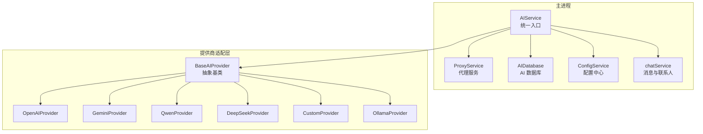
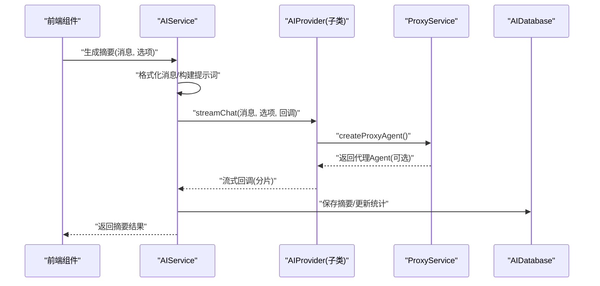
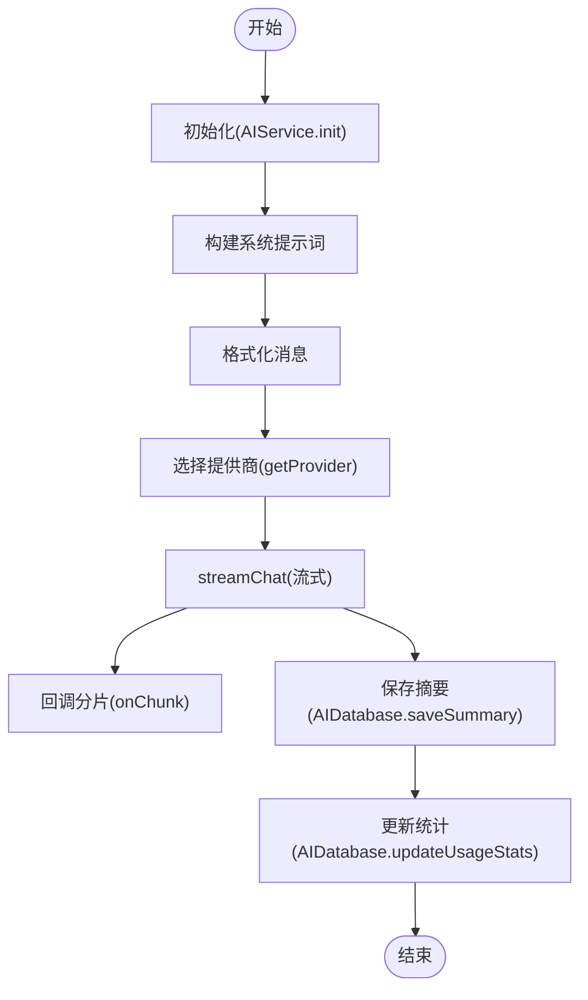
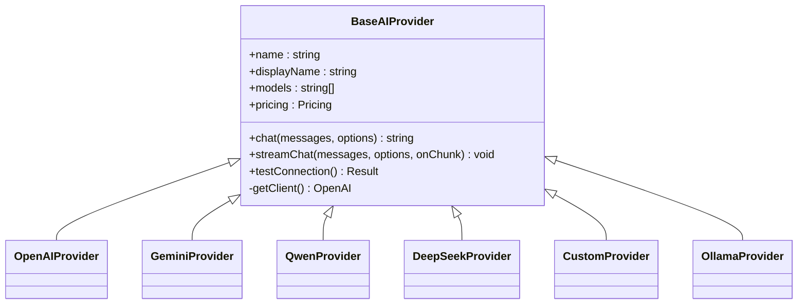
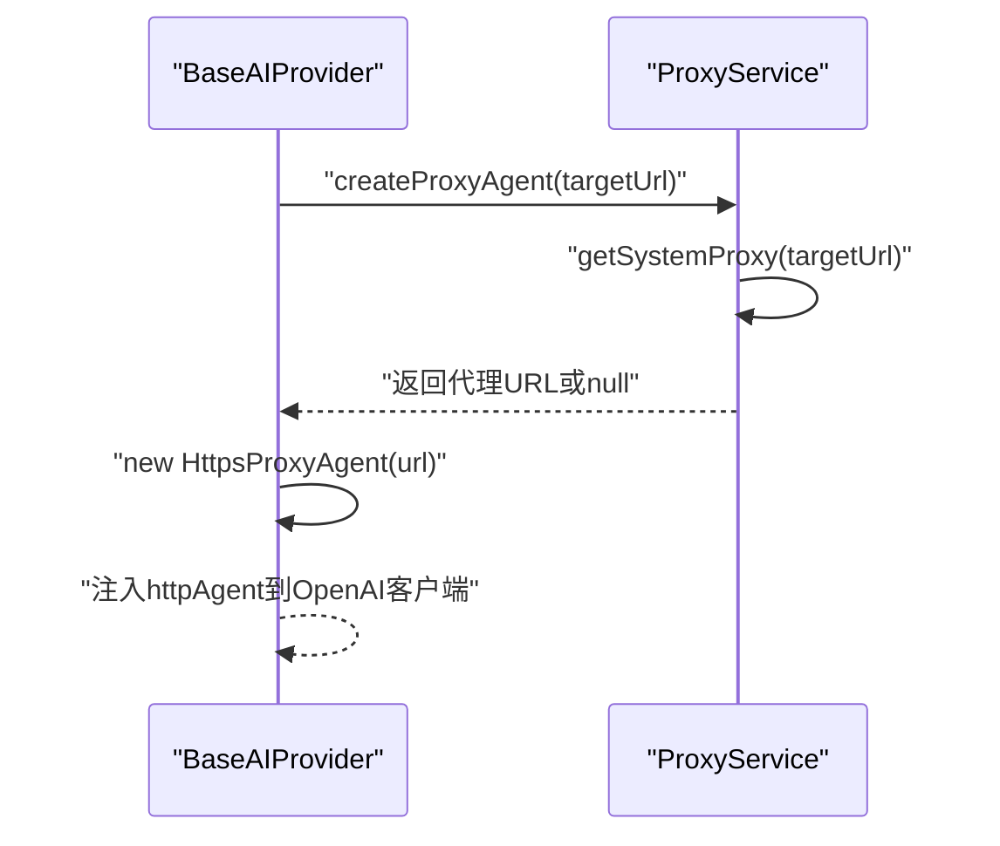
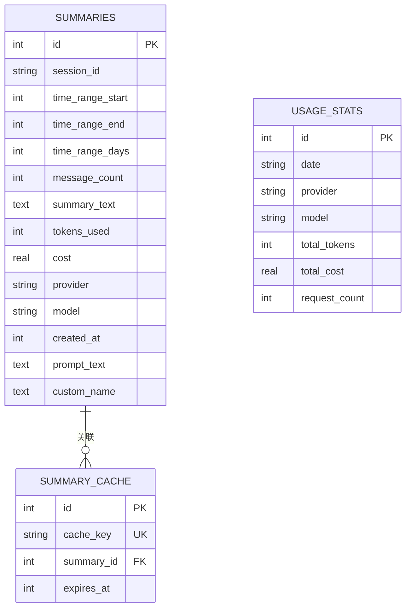
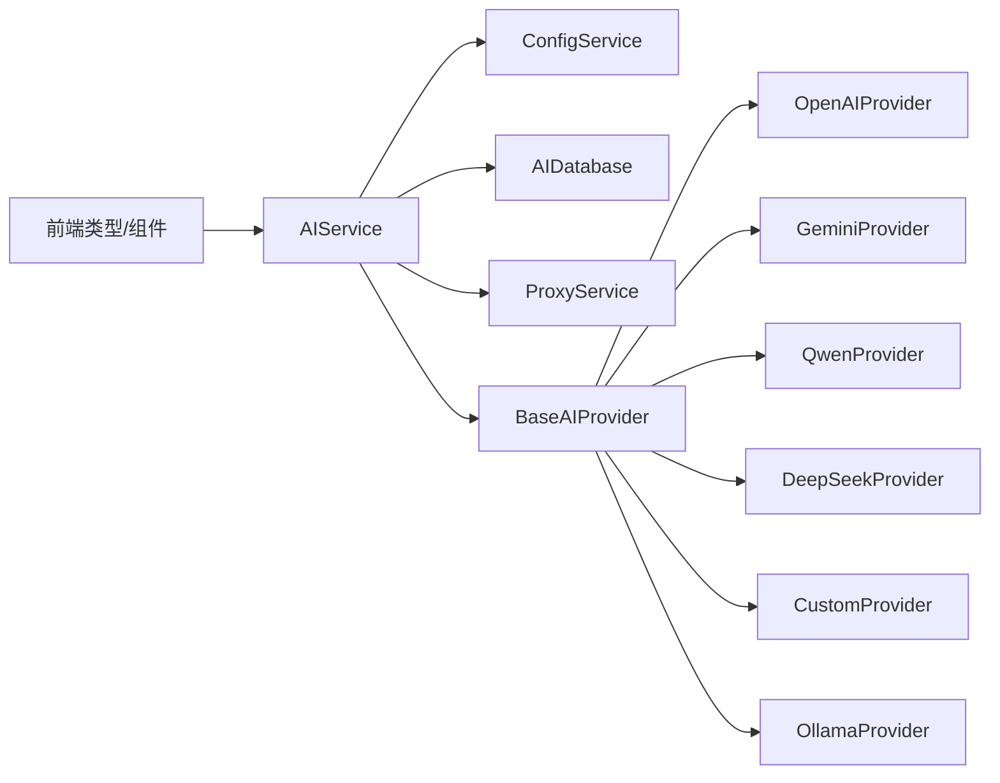
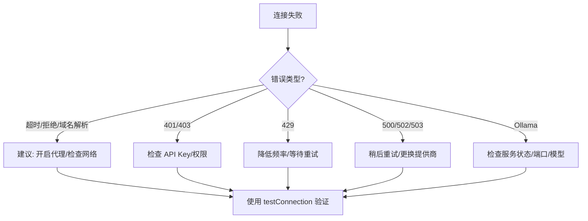

# AI 服务集成

<cite>
**本文档引用的文件**
- [aiService.ts](file://electron/services/ai/aiService.ts)
- [proxyService.ts](file://electron/services/ai/proxyService.ts)
- [aiDatabase.ts](file://electron/services/ai/aiDatabase.ts)
- [base.ts](file://electron/services/ai/providers/base.ts)
- [openai.ts](file://electron/services/ai/providers/openai.ts)
- [gemini.ts](file://electron/services/ai/providers/gemini.ts)
- [qwen.ts](file://electron/services/ai/providers/qwen.ts)
- [deepseek.ts](file://electron/services/ai/providers/deepseek.ts)
- [custom.ts](file://electron/services/ai/providers/custom.ts)
- [ollama.ts](file://electron/services/ai/providers/ollama.ts)
- [config.ts](file://electron/services/config.ts)
- [chatService.ts](file://electron/services/chatService.ts)
- [ai.ts](file://src/types/ai.ts)
- [Ollama使用指南.md](file://electron/README-STT.md)
- [README.md](file://README.md)
</cite>

## 目录
1. [简介](#简介)
2. [项目结构](#项目结构)
3. [核心组件](#核心组件)
4. [架构总览](#架构总览)
5. [详细组件分析](#详细组件分析)
6. [依赖分析](#依赖分析)
7. [性能考虑](#性能考虑)
8. [故障排查指南](#故障排查指南)
9. [结论](#结论)
10. [附录](#附录)

## 简介
本文件面向 CipherTalk 的 AI 服务集成，系统性阐述 AIService 的架构设计与实现，覆盖多提供商统一接入、代理服务、数据库管理、错误处理与重试策略，并提供 OpenAI、DeepSeek、Qwen、Gemini、Ollama 等提供商的适配方案与使用指南。

## 项目结构
AI 服务相关代码集中在 Electron 主进程的 services/ai 目录，前端类型与页面组件位于 src/ 目录。核心模块包括：
- AIService：统一入口，负责提供商选择、消息格式化、流式生成、统计与持久化
- Provider 抽象与实现：BaseAIProvider 及各提供商子类（OpenAI、Gemini、Qwen、DeepSeek、Custom、Ollama 等）
- ProxyService：系统代理检测与注入，解决主进程直连问题
- AIDatabase：SQLite 数据库，管理摘要、使用统计与缓存
- ConfigService：全局配置，支持多提供商独立配置
- 类型定义：前后端共享的 AI 类型与选项

**图示来源**
- [aiService.ts:58-631](file://electron/services/ai/aiService.ts#L58-L631)
- [proxyService.ts:16-151](file://electron/services/ai/proxyService.ts#L16-L151)
- [aiDatabase.ts:8-347](file://electron/services/ai/aiDatabase.ts#L8-L347)
- [base.ts:49-241](file://electron/services/ai/providers/base.ts#L49-L241)
- [openai.ts:44-77](file://electron/services/ai/providers/openai.ts#L44-L77)
- [gemini.ts:46-192](file://electron/services/ai/providers/gemini.ts#L46-L192)
- [qwen.ts:58-91](file://electron/services/ai/providers/qwen.ts#L58-L91)
- [deepseek.ts:29-62](file://electron/services/ai/providers/deepseek.ts#L29-L62)
- [custom.ts:37-117](file://electron/services/ai/providers/custom.ts#L37-L117)
- [ollama.ts:33-97](file://electron/services/ai/providers/ollama.ts#L33-L97)
- [config.ts:126-395](file://electron/services/config.ts#L126-L395)
- [chatService.ts:110-200](file://electron/services/chatService.ts#L110-L200)

**章节来源**
- [aiService.ts:58-631](file://electron/services/ai/aiService.ts#L58-L631)
- [proxyService.ts:16-151](file://electron/services/ai/proxyService.ts#L16-L151)
- [aiDatabase.ts:8-347](file://electron/services/ai/aiDatabase.ts#L8-L347)
- [base.ts:49-241](file://electron/services/ai/providers/base.ts#L49-L241)
- [config.ts:126-395](file://electron/services/config.ts#L126-L395)
- [chatService.ts:110-200](file://electron/services/chatService.ts#L110-L200)

## 核心组件
- AIService：提供摘要生成、连接测试、使用统计、历史查询、缓存清理等能力；内部通过 ConfigService 读取提供商配置，通过 ProxyService 注入代理，通过 AIDatabase 持久化与统计。
- BaseAIProvider：统一 OpenAI 兼容客户端初始化、代理注入、流式/非流式聊天、连接测试与思考模式处理。
- Provider 子类：针对不同提供商的模型映射、特殊参数与行为差异（如 Gemini 的 thinking_config、Qwen 的兼容端点）。
- ProxyService：系统代理检测、代理 Agent 创建、代理连通性测试与缓存。
- AIDatabase：摘要表、使用统计表、缓存表，支持增删改查、聚合统计与过期清理。
- ConfigService：多提供商配置结构、默认值、迁移逻辑与便捷读写方法。
- 类型定义：前后端共享的提供商信息、时间范围、摘要详情、使用统计等。

**章节来源**
- [aiService.ts:58-631](file://electron/services/ai/aiService.ts#L58-L631)
- [base.ts:49-241](file://electron/services/ai/providers/base.ts#L49-L241)
- [proxyService.ts:16-151](file://electron/services/ai/proxyService.ts#L16-L151)
- [aiDatabase.ts:8-347](file://electron/services/ai/aiDatabase.ts#L8-L347)
- [config.ts:126-395](file://electron/services/config.ts#L126-L395)
- [ai.ts:1-93](file://src/types/ai.ts#L1-L93)

## 架构总览
AI 服务采用“统一入口 + 抽象适配 + 代理注入 + 数据持久化”的分层架构。AIService 作为门面，负责业务编排；BaseAIProvider 统一处理网络与流式细节；ProxyService 解决主进程直连问题；AIDatabase 提供结构化存储与统计。

**图示来源**
- [aiService.ts:439-539](file://electron/services/ai/aiService.ts#L439-L539)
- [base.ts:106-175](file://electron/services/ai/providers/base.ts#L106-L175)
- [proxyService.ts:83-99](file://electron/services/ai/proxyService.ts#L83-L99)
- [aiDatabase.ts:117-164](file://electron/services/ai/aiDatabase.ts#L117-L164)

## 详细组件分析

### AIService 组件分析
职责与流程
- 初始化：校验缓存路径与用户标识，初始化 AIDatabase
- 提供商选择：优先使用显式 provider/apiKey，否则读取 ConfigService 当前配置
- 消息格式化：将聊天记录、语音转写、引用消息等统一为结构化文本
- 系统提示词：支持多种风格与自定义提示词
- 流式生成：调用 Provider.streamChat，实时回调分片
- 成本估算：基于提供商单价与估算 token 数
- 数据持久化：保存摘要、更新使用统计、清理过期缓存

关键接口与数据结构
- SummaryOptions/SummaryResult：摘要生成参数与结果
- generateSummary：流式生成摘要
- testConnection：测试提供商连通性
- getUsageStats/getSummaryHistory/deleteSummary/renameSummary/cleanExpiredCache：数据库操作

**图示来源**
- [aiService.ts:439-539](file://electron/services/ai/aiService.ts#L439-L539)
- [aiDatabase.ts:117-164](file://electron/services/ai/aiDatabase.ts#L117-L164)

**章节来源**
- [aiService.ts:58-631](file://electron/services/ai/aiService.ts#L58-L631)
- [aiDatabase.ts:117-226](file://electron/services/ai/aiDatabase.ts#L117-L226)

### Provider 抽象与适配
BaseAIProvider
- 客户端延迟创建：每次请求时通过 ProxyService 获取最新代理配置
- 统一接口：chat/streamChat/testConnection
- 思考模式：自动尝试多种参数以适配不同提供商的推理输出

各提供商适配
- OpenAI：模型名映射到官方 ID，兼容 gpt- 系列
- Gemini：OpenAI 兼容端点，针对 thinking 标签与不同模型族做差异化处理
- Qwen：DashScope 兼容端点，支持多种模型族与推理模型
- DeepSeek：兼容端点，支持推理模型
- Custom：任意 OpenAI 兼容服务，支持自定义 baseURL
- Ollama：本地服务，无需 API Key，支持自定义 baseURL

**图示来源**
- [base.ts:49-241](file://electron/services/ai/providers/base.ts#L49-L241)
- [openai.ts:44-77](file://electron/services/ai/providers/openai.ts#L44-L77)
- [gemini.ts:46-192](file://electron/services/ai/providers/gemini.ts#L46-L192)
- [qwen.ts:58-91](file://electron/services/ai/providers/qwen.ts#L58-L91)
- [deepseek.ts:29-62](file://electron/services/ai/providers/deepseek.ts#L29-L62)
- [custom.ts:37-117](file://electron/services/ai/providers/custom.ts#L37-L117)
- [ollama.ts:33-97](file://electron/services/ai/providers/ollama.ts#L33-L97)

**章节来源**
- [base.ts:49-241](file://electron/services/ai/providers/base.ts#L49-L241)
- [openai.ts:44-77](file://electron/services/ai/providers/openai.ts#L44-L77)
- [gemini.ts:46-192](file://electron/services/ai/providers/gemini.ts#L46-L192)
- [qwen.ts:58-91](file://electron/services/ai/providers/qwen.ts#L58-L91)
- [deepseek.ts:29-62](file://electron/services/ai/providers/deepseek.ts#L29-L62)
- [custom.ts:37-117](file://electron/services/ai/providers/custom.ts#L37-L117)
- [ollama.ts:33-97](file://electron/services/ai/providers/ollama.ts#L33-L97)

### 代理服务 ProxyService
问题与方案
- Electron 主进程默认直连，无法自动跟随系统代理
- 通过 session.defaultSession.resolveProxy 获取系统代理规则
- 使用 https-proxy-agent 构建代理 Agent 注入 OpenAI 客户端
- 缓存代理配置，降低频繁查询开销

**图示来源**
- [proxyService.ts:26-99](file://electron/services/ai/proxyService.ts#L26-L99)
- [base.ts:71-90](file://electron/services/ai/providers/base.ts#L71-L90)

**章节来源**
- [proxyService.ts:16-151](file://electron/services/ai/proxyService.ts#L16-L151)
- [base.ts:71-90](file://electron/services/ai/providers/base.ts#L71-L90)

### AI 数据库管理 AIDatabase
表结构与能力
- 摘要表：保存会话、时间范围、消息数、摘要文本、tokens、成本、提供商、模型、创建时间、提示词与自定义名称
- 使用统计表：按日期/提供商/模型聚合 token 数、成本与请求次数
- 缓存表：按 key 关联摘要并设置过期时间
- 支持：保存摘要、查询历史、更新统计、删除摘要、重命名、清理过期缓存、关闭数据库

**图示来源**
- [aiDatabase.ts:38-102](file://electron/services/ai/aiDatabase.ts#L38-L102)
- [aiDatabase.ts:117-164](file://electron/services/ai/aiDatabase.ts#L117-L164)
- [aiDatabase.ts:213-226](file://electron/services/ai/aiDatabase.ts#L213-L226)

**章节来源**
- [aiDatabase.ts:8-347](file://electron/services/ai/aiDatabase.ts#L8-L347)

### 配置与类型
- ConfigService：多提供商配置结构（aiProviderConfigs），默认值、迁移逻辑、便捷读写
- 类型定义：AIProviderInfo、时间范围选项、摘要详情、使用统计等

**章节来源**
- [config.ts:6-124](file://electron/services/config.ts#L6-L124)
- [config.ts:347-395](file://electron/services/config.ts#L347-L395)
- [ai.ts:1-93](file://src/types/ai.ts#L1-L93)

## 依赖分析
- AIService 依赖 ConfigService（读取提供商配置）、AIDatabase（持久化与统计）、ProxyService（网络代理）、Provider 抽象与实现
- BaseAIProvider 依赖 ProxyService 注入代理，依赖 OpenAI SDK
- Provider 子类各自依赖 BaseAIProvider，实现模型映射与差异化参数
- 前端类型与组件通过 AISummary 等组件消费 AIService 与类型定义

**图示来源**
- [aiService.ts:1-16](file://electron/services/ai/aiService.ts#L1-L16)
- [base.ts:1-3](file://electron/services/ai/providers/base.ts#L1-L3)
- [openai.ts:1-1](file://electron/services/ai/providers/openai.ts#L1-L1)
- [gemini.ts:1-2](file://electron/services/ai/providers/gemini.ts#L1-L2)
- [qwen.ts:1-1](file://electron/services/ai/providers/qwen.ts#L1-L1)
- [deepseek.ts:1-1](file://electron/services/ai/providers/deepseek.ts#L1-L1)
- [custom.ts:1-1](file://electron/services/ai/providers/custom.ts#L1-L1)
- [ollama.ts:1-1](file://electron/services/ai/providers/ollama.ts#L1-L1)
- [ai.ts:1-30](file://src/types/ai.ts#L1-L30)

**章节来源**
- [aiService.ts:1-16](file://electron/services/ai/aiService.ts#L1-L16)
- [base.ts:1-3](file://electron/services/ai/providers/base.ts#L1-L3)
- [ai.ts:1-30](file://src/types/ai.ts#L1-L30)

## 性能考虑
- 代理缓存：ProxyService 对系统代理查询结果进行短期缓存，减少频繁解析
- 延迟创建客户端：BaseAIProvider 每次请求才创建 OpenAI 客户端，确保代理配置即时生效
- 流式输出：Provider 层使用流式接口，前端可逐步渲染，降低首帧等待
- 数据库索引：摘要与统计表建立必要索引，提升查询效率
- 缓存键对齐：按自然日对齐时间，提高缓存命中率
- 估算成本：基于估算 token 与单价，避免额外 API 调用

[本节为通用性能建议，无需特定文件引用]

## 故障排查指南
常见问题与处理
- 网络连接失败：检查系统代理、网络连通性；ProxyService 提供代理测试
- API Key 无效/权限不足：检查提供商配置与权限
- 请求过于频繁：遵循提供商速率限制，适当退避
- 服务器错误：稍后重试或更换提供商
- Ollama 本地服务：确认服务已启动、端口正确、模型已下载

**图示来源**
- [base.ts:177-240](file://electron/services/ai/providers/base.ts#L177-L240)
- [proxyService.ts:115-146](file://electron/services/ai/proxyService.ts#L115-L146)
- [ollama.ts:48-95](file://electron/services/ai/providers/ollama.ts#L48-L95)

**章节来源**
- [base.ts:177-240](file://electron/services/ai/providers/base.ts#L177-L240)
- [proxyService.ts:115-146](file://electron/services/ai/proxyService.ts#L115-L146)
- [ollama.ts:48-95](file://electron/services/ai/providers/ollama.ts#L48-L95)

## 结论
CipherTalk 的 AI 服务集成通过统一入口与抽象适配，实现了对多家提供商的一致接入；结合代理服务与本地数据库，提供了稳定、可观测、可扩展的 AI 摘要能力。建议在生产环境中配合合理的代理策略、限额控制与缓存机制，以获得最佳体验。

[本节为总结性内容，无需特定文件引用]

## 附录

### 各提供商配置示例与使用指南
- OpenAI
  - 基础配置：API Key、模型映射到官方 ID
  - 使用：在 AIService 中选择 openai，指定模型名称
  - 参考：[openai.ts:6-39](file://electron/services/ai/providers/openai.ts#L6-L39)
- Gemini
  - 基础配置：API Key、OpenAI 兼容端点、模型映射
  - 思考模式：自动适配 thinking_config 或 reasoning_effort
  - 参考：[gemini.ts:7-40](file://electron/services/ai/providers/gemini.ts#L7-L40)
- Qwen
  - 基础配置：DashScope 兼容端点、模型映射
  - 参考：[qwen.ts:6-35](file://electron/services/ai/providers/qwen.ts#L6-L35)
- DeepSeek
  - 基础配置：API Key、兼容端点、模型映射
  - 参考：[deepseek.ts:6-24](file://electron/services/ai/providers/deepseek.ts#L6-L24)
- Custom
  - 基础配置：API Key、自定义 baseURL（需包含 /v1）
  - 参考：[custom.ts:6-30](file://electron/services/ai/providers/custom.ts#L6-L30)
- Ollama
  - 基础配置：本地服务地址（默认 http://localhost:11434/v1）、无需 API Key
  - 参考：[ollama.ts:6-27](file://electron/services/ai/providers/ollama.ts#L6-L27)，[Ollama使用指南.md](file://electron/README-STT.md)

### 错误处理与重试机制
- 连接测试：Provider.testConnection 统一处理超时、拒绝、域名解析、4xx/5xx 等错误，并返回 needsProxy 标识
- 代理注入：BaseAIProvider 每次请求重建客户端并注入代理 Agent
- 前端策略：根据返回的 needsProxy 提示用户开启代理或检查网络

**章节来源**
- [base.ts:177-240](file://electron/services/ai/providers/base.ts#L177-L240)
- [proxyService.ts:83-99](file://electron/services/ai/proxyService.ts#L83-L99)

### 性能优化建议
- 启用代理缓存与延迟创建客户端
- 使用流式接口，前端逐步渲染
- 控制消息数量上限（ConfigService.aiMessageLimit）
- 合理设置摘要详细度与时间范围
- 定期清理过期缓存与历史摘要

**章节来源**
- [config.ts:379-385](file://electron/services/config.ts#L379-L385)
- [aiService.ts:439-539](file://electron/services/ai/aiService.ts#L439-L539)
- [aiDatabase.ts:327-332](file://electron/services/ai/aiDatabase.ts#L327-L332)