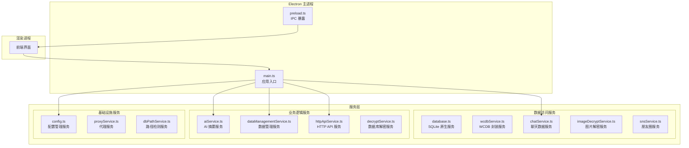
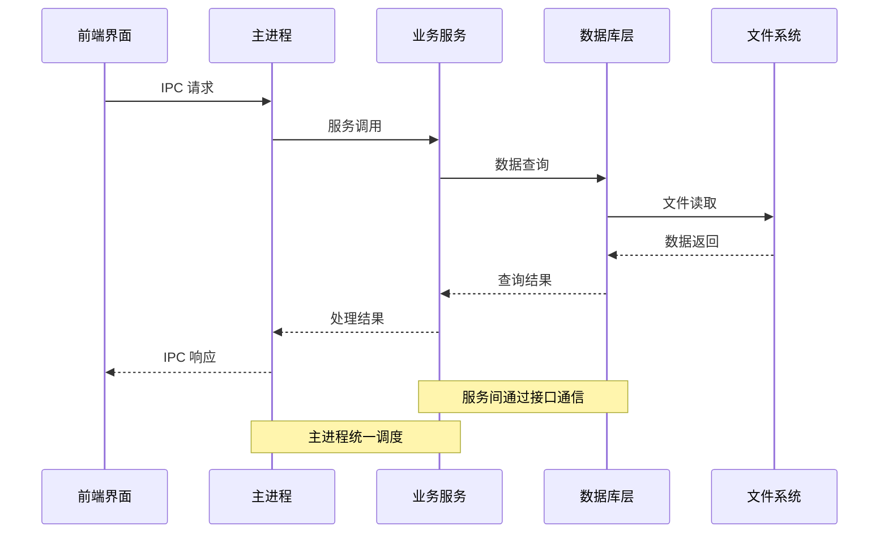
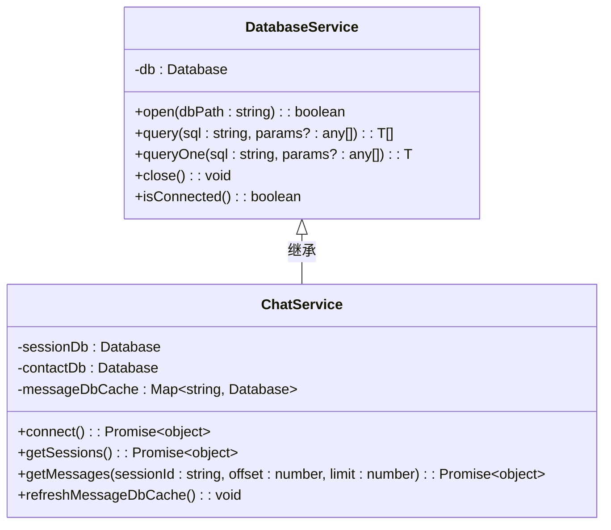
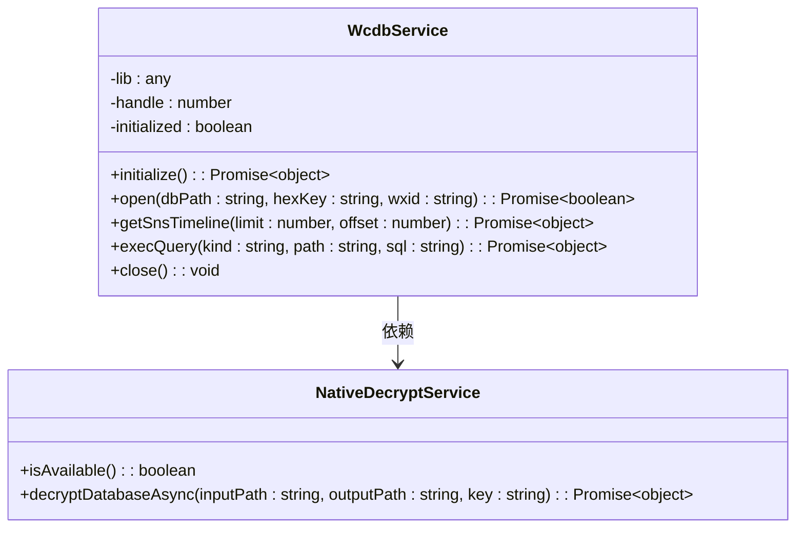
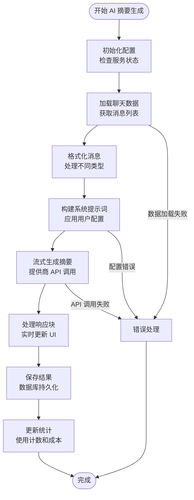
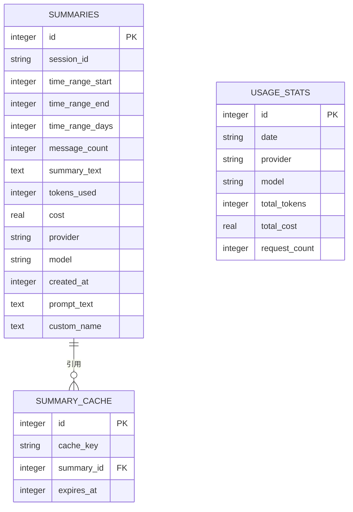
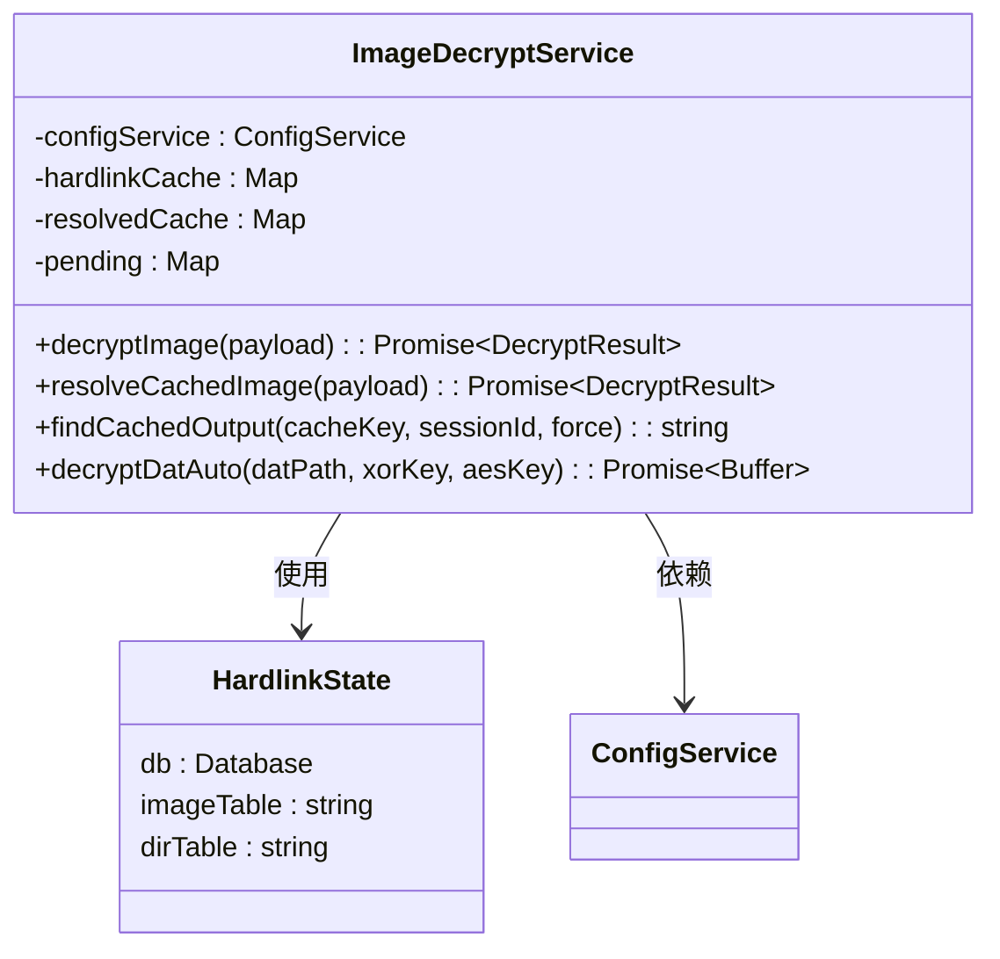
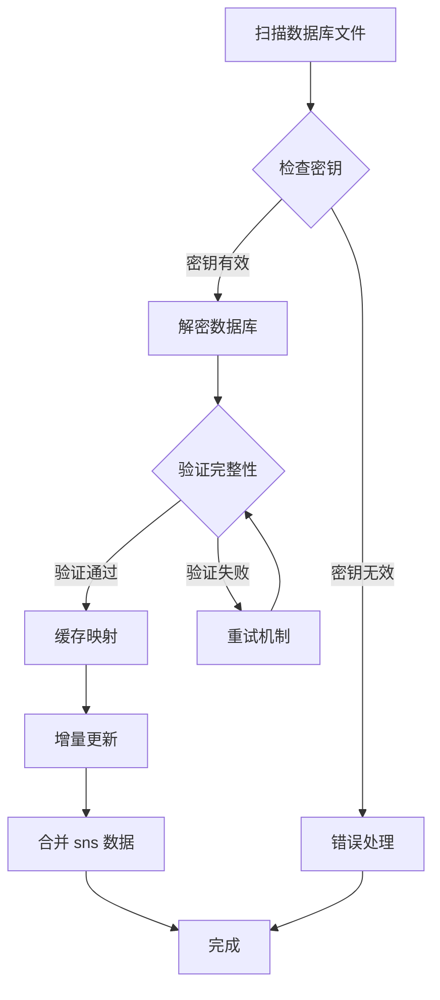
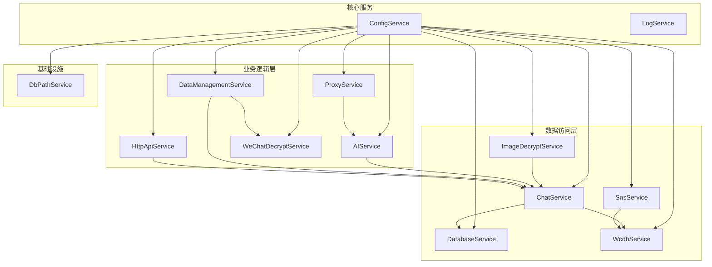

# 后端服务架构

<cite>
**本文档引用的文件**
- [main.ts](file://electron/main.ts)
- [preload.ts](file://electron/preload.ts)
- [database.ts](file://electron/services/database.ts)
- [chatService.ts](file://electron/services/chatService.ts)
- [wcdbService.ts](file://electron/services/wcdbService.ts)
- [aiService.ts](file://electron/services/ai/aiService.ts)
- [aiDatabase.ts](file://electron/services/ai/aiDatabase.ts)
- [proxyService.ts](file://electron/services/ai/proxyService.ts)
- [dataManagementService.ts](file://electron/services/dataManagementService.ts)
- [config.ts](file://electron/services/config.ts)
- [httpApiService.ts](file://electron/services/httpApiService.ts)
- [decryptService.ts](file://electron/services/decryptService.ts)
- [imageDecryptService.ts](file://electron/services/imageDecryptService.ts)
- [snsService.ts](file://electron/services/snsService.ts)
- [dbPathService.ts](file://electron/services/dbPathService.ts)
</cite>

## 目录
1. [简介](#简介)
2. [项目结构](#项目结构)
3. [核心组件](#核心组件)
4. [架构总览](#架构总览)
5. [详细组件分析](#详细组件分析)
6. [依赖关系分析](#依赖关系分析)
7. [性能考虑](#性能考虑)
8. [故障排除指南](#故障排除指南)
9. [结论](#结论)

## 简介

CipherTalk 是一个基于 Electron 的微信聊天数据解析与分析平台。本文档详细描述其后端服务架构，包括数据库服务、聊天数据处理服务、AI 服务、文件系统服务的组织方式，以及服务间的依赖关系和通信机制。

该系统采用模块化设计，通过服务层封装业务逻辑，提供稳定的数据访问接口和强大的扩展能力。系统支持多种数据库格式（SQLite、WCDB），具备完善的缓存机制、错误处理和性能优化策略。

## 项目结构

项目采用 Electron 主进程 + 渲染进程的双进程架构，后端服务主要位于 electron/services 目录下：

**图表来源**
- [main.ts:86-113](file://electron/main.ts#L86-L113)
- [preload.ts:4-435](file://electron/preload.ts#L4-L435)

**章节来源**
- [main.ts:86-113](file://electron/main.ts#L86-L113)
- [preload.ts:4-435](file://electron/preload.ts#L4-L435)

## 核心组件

### 数据库服务层

系统提供多层数据库访问抽象：

1. **原生 SQLite 服务** (`database.ts`)
   - 基于 better-sqlite3 的轻量级数据库访问
   - 支持只读模式，确保数据安全
   - 提供统一的查询接口和错误处理

2. **WCDB 封装服务** (`wcdbService.ts`)
   - 通过 koffi 动态加载 WCDB DLL
   - 提供会话、朋友圈等高级功能
   - 支持原生性能优势

3. **聊天数据服务** (`chatService.ts`)
   - 统一的聊天数据访问接口
   - 智能缓存机制和增量更新
   - 支持多数据库文件管理

**章节来源**
- [database.ts:5-82](file://electron/services/database.ts#L5-L82)
- [wcdbService.ts:5-390](file://electron/services/wcdbService.ts#L5-L390)
- [chatService.ts:110-383](file://electron/services/chatService.ts#L110-L383)

### 业务逻辑服务层

1. **AI 摘要服务** (`aiService.ts`)
   - 多提供商支持（OpenAI、Gemini、通义千问等）
   - 流式摘要生成和缓存管理
   - 成本估算和使用统计

2. **数据管理服务** (`dataManagementService.ts`)
   - 数据库自动解密和增量更新
   - 文件系统监控和缓存管理
   - 批量处理和错误恢复

3. **HTTP API 服务** (`httpApiService.ts`)
   - 内嵌 HTTP 服务器
   - RESTful API 接口
   - 认证和授权机制

**章节来源**
- [aiService.ts:58-631](file://electron/services/ai/aiService.ts#L58-L631)
- [dataManagementService.ts:34-800](file://electron/services/dataManagementService.ts#L34-L800)
- [httpApiService.ts:44-800](file://electron/services/httpApiService.ts#L44-L800)

## 架构总览

系统采用分层架构设计，通过服务发现和依赖注入实现松耦合：

**图表来源**
- [main.ts:218-221](file://electron/main.ts#L218-L221)
- [preload.ts:4-435](file://electron/preload.ts#L4-L435)

### 服务发现机制

系统通过以下方式实现服务发现：

1. **配置驱动的服务注册**
   - ConfigService 统一管理服务配置
   - 支持动态服务启停
   - 配置变更自动生效

2. **单例模式服务实例**
   - 每个服务类维护单例实例
   - 避免重复初始化开销
   - 提供全局访问点

3. **依赖注入容器**
   - 主进程集中管理服务依赖
   - 支持服务间相互依赖
   - 提供统一的生命周期管理

**章节来源**
- [config.ts:126-395](file://electron/services/config.ts#L126-L395)
- [main.ts:86-113](file://electron/main.ts#L86-L113)

## 详细组件分析

### 数据库服务架构

#### SQLite 数据库服务

**图表来源**
- [database.ts:5-82](file://electron/services/database.ts#L5-L82)
- [chatService.ts:110-383](file://electron/services/chatService.ts#L110-L383)

#### WCDB 服务架构

**图表来源**
- [wcdbService.ts:5-390](file://electron/services/wcdbService.ts#L5-L390)
- [decryptService.ts:7-54](file://electron/services/decryptService.ts#L7-L54)

**章节来源**
- [database.ts:5-82](file://electron/services/database.ts#L5-L82)
- [wcdbService.ts:5-390](file://electron/services/wcdbService.ts#L5-L390)

### AI 服务架构

#### AI 服务核心流程

**图表来源**
- [aiService.ts:439-539](file://electron/services/ai/aiService.ts#L439-L539)

#### AI 数据库设计

**图表来源**
- [aiDatabase.ts:35-102](file://electron/services/ai/aiDatabase.ts#L35-L102)

**章节来源**
- [aiService.ts:58-631](file://electron/services/ai/aiService.ts#L58-L631)
- [aiDatabase.ts:8-347](file://electron/services/ai/aiDatabase.ts#L8-L347)

### 文件系统服务架构

#### 图片解密服务

**图表来源**
- [imageDecryptService.ts:44-800](file://electron/services/imageDecryptService.ts#L44-L800)

#### 数据管理服务

**图表来源**
- [dataManagementService.ts:413-612](file://electron/services/dataManagementService.ts#L413-L612)

**章节来源**
- [imageDecryptService.ts:44-800](file://electron/services/imageDecryptService.ts#L44-L800)
- [dataManagementService.ts:34-800](file://electron/services/dataManagementService.ts#L34-L800)

## 依赖关系分析

### 服务依赖图

**图表来源**
- [main.ts:86-113](file://electron/main.ts#L86-L113)
- [config.ts:126-395](file://electron/services/config.ts#L126-L395)

### 错误传播机制

系统采用统一的错误处理策略：

1. **服务内部错误捕获**
   - 每个服务都有完整的 try-catch 保护
   - 错误信息标准化处理
   - 上下文信息完整保留

2. **跨服务错误传播**
   - 通过 Promise 链式调用传播错误
   - 错误包装和类型化处理
   - 用户友好的错误消息

3. **配置驱动的错误处理**
   - ConfigService 统一管理错误处理策略
   - 支持不同环境的差异化处理
   - 错误日志分级管理

**章节来源**
- [chatService.ts:342-346](file://electron/services/chatService.ts#L342-L346)
- [aiService.ts:544-557](file://electron/services/ai/aiService.ts#L544-L557)
- [dataManagementService.ts:114-118](file://electron/services/dataManagementService.ts#L114-L118)

## 性能考虑

### 缓存策略

系统实现了多层次的缓存机制：

1. **数据库连接缓存**
   - 智能连接池管理
   - 自动连接重用
   - 连接超时和重连机制

2. **查询结果缓存**
   - 会话列表缓存（60秒过期）
   - 联系人信息缓存
   - 图片路径解析缓存

3. **文件系统缓存**
   - 解密文件缓存
   - 硬链接数据库缓存
   - 图片缩略图缓存

### 性能优化技术

1. **异步处理**
   - 所有 I/O 操作异步化
   - Worker 线程分离计算密集任务
   - 流式处理大数据集

2. **批量操作**
   - 数据库批量插入和更新
   - 文件系统批量解密
   - 网络请求批量处理

3. **智能索引**
   - 自动生成数据库索引
   - 消息表索引优化
   - 查询条件索引选择

**章节来源**
- [chatService.ts:107-136](file://electron/services/chatService.ts#L107-L136)
- [imageDecryptService.ts:46-54](file://electron/services/imageDecryptService.ts#L46-L54)
- [dataManagementService.ts:413-612](file://electron/services/dataManagementService.ts#L413-L612)

## 故障排除指南

### 常见问题诊断

1. **数据库连接失败**
   - 检查数据库路径配置
   - 验证文件权限和存在性
   - 确认数据库文件完整性

2. **解密失败**
   - 验证解密密钥正确性
   - 检查原生 DLL 可用性
   - 确认文件格式支持

3. **AI 服务连接问题**
   - 检查网络代理配置
   - 验证 API 密钥有效性
   - 确认提供商服务可用性

### 日志和监控

系统提供完整的日志记录机制：

1. **日志级别管理**
   - DEBUG: 详细调试信息
   - INFO: 一般运行信息
   - WARN: 警告信息
   - ERROR: 错误信息

2. **性能监控**
   - 查询执行时间统计
   - 内存使用情况监控
   - 网络请求性能分析

**章节来源**
- [config.ts:317-345](file://electron/services/config.ts#L317-L345)
- [main.ts:223-225](file://electron/main.ts#L223-L225)

## 结论

CipherTalk 的后端服务架构展现了现代 Electron 应用的最佳实践：

1. **模块化设计**：清晰的服务边界和职责分离
2. **可扩展性**：标准化的服务接口和插件机制
3. **可靠性**：完善的错误处理和恢复机制
4. **性能优化**：多层次缓存和异步处理策略
5. **安全性**：数据访问控制和文件系统保护

该架构为后续的功能扩展和性能优化奠定了坚实基础，能够有效支撑大规模聊天数据分析和处理需求。