# 数据分析服务

<cite>
**本文档引用的文件**
- [analyticsService.ts](file://electron/services/analyticsService.ts)
- [groupAnalyticsService.ts](file://electron/services/groupAnalyticsService.ts)
- [annualReportService.ts](file://electron/services/annualReportService.ts)
- [analytics.ts](file://src/types/analytics.ts)
- [analyticsStore.ts](file://src/stores/analyticsStore.ts)
- [AnalyticsPage.tsx](file://src/pages/AnalyticsPage.tsx)
- [GroupAnalyticsPage.tsx](file://src/pages/GroupAnalyticsPage.tsx)
- [AnnualReportPage.tsx](file://src/pages/AnnualReportPage.tsx)
- [cacheService.ts](file://electron/services/cacheService.ts)
- [httpApiService.ts](file://electron/services/httpApiService.ts)
- [config.ts](file://electron/services/config.ts)
- [models.ts](file://src/types/models.ts)
</cite>

## 目录
1. [简介](#简介)
2. [项目结构](#项目结构)
3. [核心组件](#核心组件)
4. [架构概览](#架构概览)
5. [详细组件分析](#详细组件分析)
6. [依赖关系分析](#依赖关系分析)
7. [性能考虑](#性能考虑)
8. [故障排除指南](#故障排除指南)
9. [结论](#结论)
10. [附录](#附录)

## 简介

CipherTalk 是一个专业的微信聊天数据分析工具，专注于为用户提供深入的数据洞察和可视化分析。本文档详细介绍了数据分析服务的核心功能，包括：

- **私聊分析服务**：消息数量统计、时间分布分析、联系人排名
- **群组分析服务**：群组活跃度分析、成员互动统计、群组趋势预测
- **年度报告服务**：数据聚合、图表生成、报告模板定制
- **数据处理流程**：原始数据清洗、统计计算、结果缓存
- **可视化支持**：图表类型选择、颜色主题、交互功能

该系统采用 Electron + React 技术栈，通过 SQLite 数据库直接读取解密后的微信聊天数据，提供实时、准确的数据分析体验。

## 项目结构

CipherTalk 的数据分析服务采用模块化设计，主要分为以下几个层次：

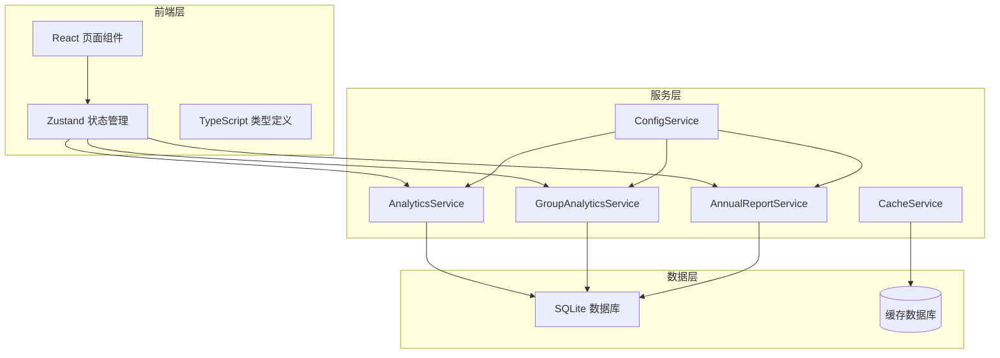

**图表来源**
- [analyticsService.ts:39-759](file://electron/services/analyticsService.ts#L39-L759)
- [groupAnalyticsService.ts:41-718](file://electron/services/groupAnalyticsService.ts#L41-L718)
- [annualReportService.ts:79-887](file://electron/services/annualReportService.ts#L79-L887)

**章节来源**
- [analyticsService.ts:1-759](file://electron/services/analyticsService.ts#L1-L759)
- [groupAnalyticsService.ts:1-718](file://electron/services/groupAnalyticsService.ts#L1-L718)
- [annualReportService.ts:1-887](file://electron/services/annualReportService.ts#L1-L887)

## 核心组件

### AnalyticsService - 私聊分析服务

AnalyticsService 是整个数据分析系统的核心，负责处理私聊消息的统计分析。其主要功能包括：

- **消息统计**：总消息数、发送/接收消息数、不同类型消息统计
- **时间分布**：每小时、每周、每月的消息分布
- **联系人排名**：基于消息数量的联系人互动排行
- **活跃度分析**：用户活跃天数统计

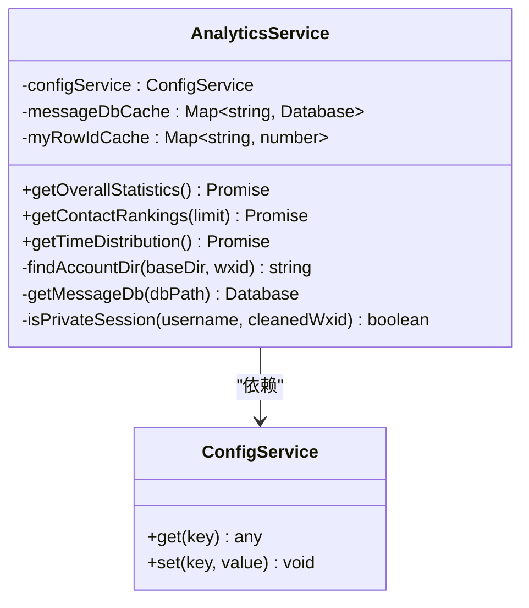

**图表来源**
- [analyticsService.ts:39-759](file://electron/services/analyticsService.ts#L39-L759)

### GroupAnalyticsService - 群组分析服务

GroupAnalyticsService 专门处理群组聊天数据的分析，提供群组层面的深度洞察：

- **群组管理**：群组列表获取、成员信息查询
- **活跃度分析**：群组活跃时段统计、媒体内容分析
- **互动统计**：成员发言排行、互动模式分析
- **趋势预测**：基于历史数据的趋势分析能力

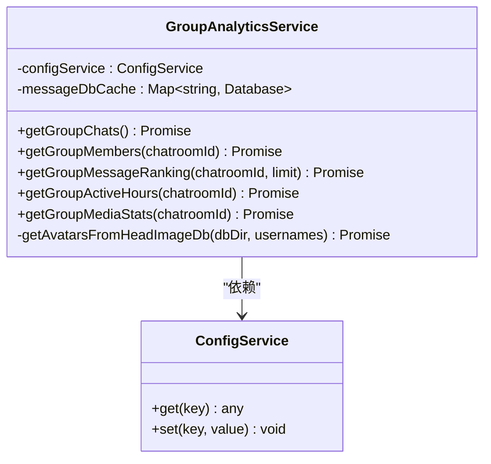

**图表来源**
- [groupAnalyticsService.ts:41-718](file://electron/services/groupAnalyticsService.ts#L41-L718)

### AnnualReportService - 年度报告服务

AnnualReportService 提供完整的年度聊天回顾功能，生成个性化的年度报告：

- **数据聚合**：跨年度的数据整合与分析
- **智能洞察**：双向奔赴关系识别、回复速度分析
- **可视化报告**：热力图、图表、统计摘要
- **个性化定制**：报告模板、主题样式、内容筛选

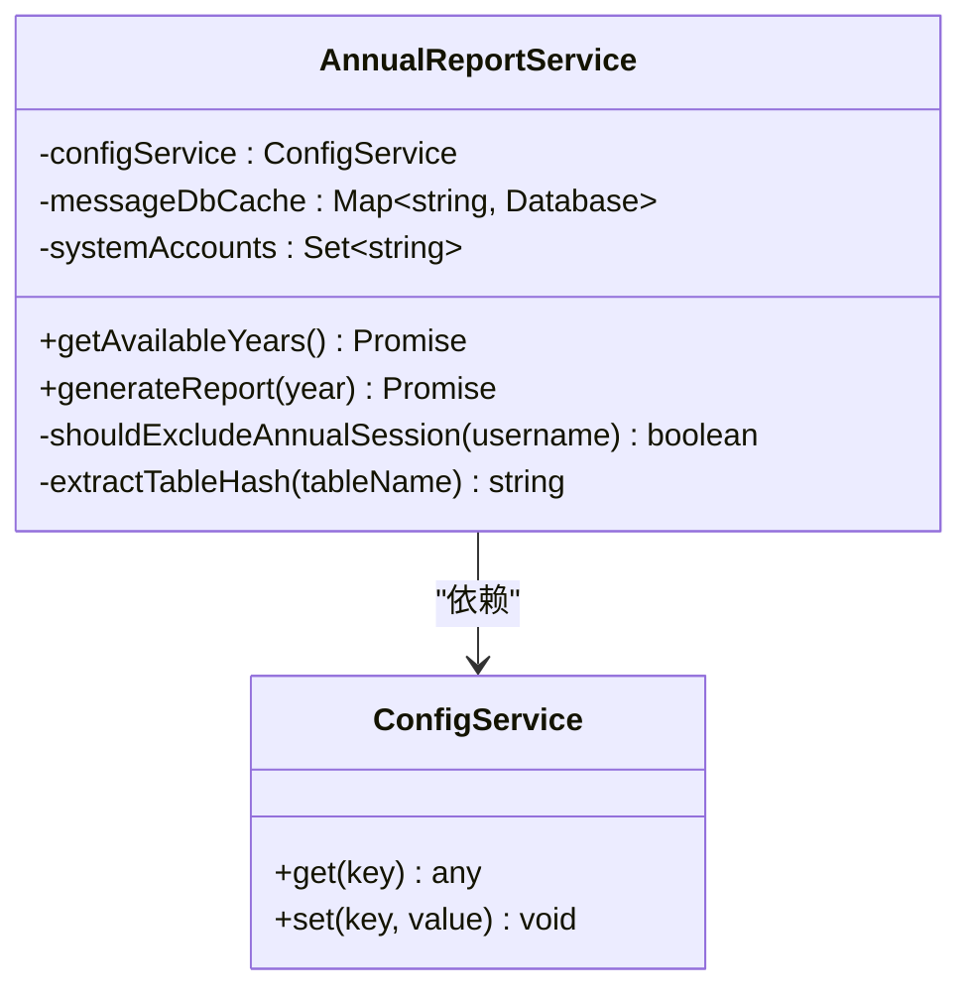

**图表来源**
- [annualReportService.ts:79-887](file://electron/services/annualReportService.ts#L79-L887)

**章节来源**
- [analyticsService.ts:39-759](file://electron/services/analyticsService.ts#L39-L759)
- [groupAnalyticsService.ts:41-718](file://electron/services/groupAnalyticsService.ts#L41-L718)
- [annualReportService.ts:79-887](file://electron/services/annualReportService.ts#L79-L887)

## 架构概览

CipherTalk 采用分层架构设计，确保系统的可维护性和扩展性：

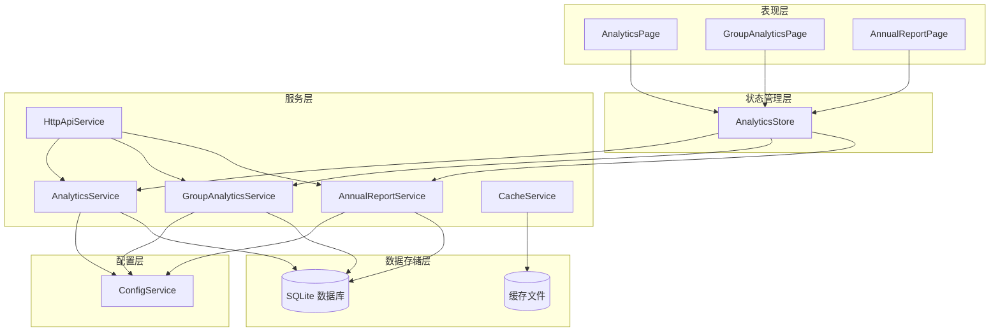

**图表来源**
- [AnalyticsPage.tsx:1-189](file://src/pages/AnalyticsPage.tsx#L1-L189)
- [GroupAnalyticsPage.tsx:1-537](file://src/pages/GroupAnalyticsPage.tsx#L1-L537)
- [AnnualReportPage.tsx:1-114](file://src/pages/AnnualReportPage.tsx#L1-L114)
- [analyticsStore.ts:1-71](file://src/stores/analyticsStore.ts#L1-L71)

**章节来源**
- [AnalyticsPage.tsx:1-189](file://src/pages/AnalyticsPage.tsx#L1-L189)
- [GroupAnalyticsPage.tsx:1-537](file://src/pages/GroupAnalyticsPage.tsx#L1-L537)
- [AnnualReportPage.tsx:1-114](file://src/pages/AnnualReportPage.tsx#L1-L114)

## 详细组件分析

### 数据处理流程

CipherTalk 的数据处理流程采用流水线设计，确保数据的高效处理和准确性：

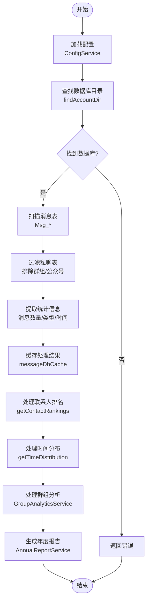

**图表来源**
- [analyticsService.ts:269-450](file://electron/services/analyticsService.ts#L269-L450)
- [groupAnalyticsService.ts:204-350](file://electron/services/groupAnalyticsService.ts#L204-L350)
- [annualReportService.ts:350-372](file://electron/services/annualReportService.ts#L350-L372)

### 私聊分析算法实现

#### 消息数量统计算法

私聊分析的核心算法基于 SQL 查询优化，通过哈希表加速消息表的匹配：

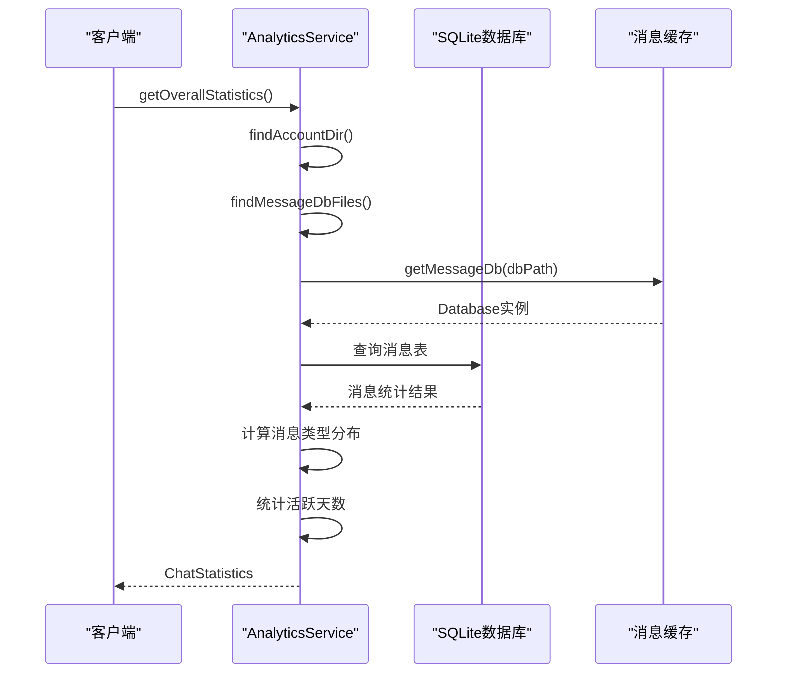

**图表来源**
- [analyticsService.ts:269-450](file://electron/services/analyticsService.ts#L269-L450)

#### 时间分布分析算法

时间分布分析采用多维度时间聚合策略：

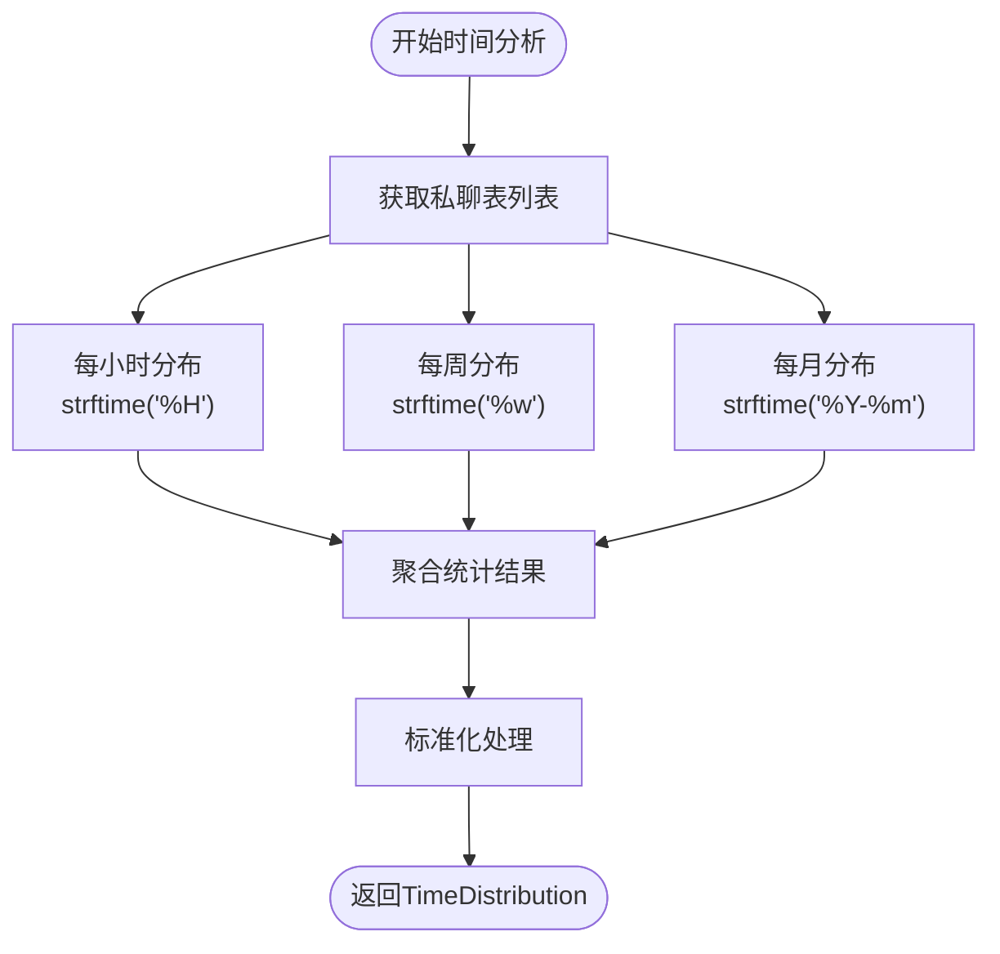

**图表来源**
- [analyticsService.ts:628-743](file://electron/services/analyticsService.ts#L628-L743)

#### 联系人排名算法

联系人排名基于消息统计的复杂计算：

```mermaid
flowchart TD
Start([开始联系人分析]) --> LoadSessions["加载私聊会话"]
LoadSessions --> CountMessages["统计消息数量"]
CountMessages --> CalcInteraction["计算互动指标"]
CalcInteraction --> CalcRecency["计算最近互动时间"]
CalcRecency --> CalcSentReceived["区分发送/接收消息"]
CalcSentReceived --> MergeStats["合并统计信息"]
MergeStats --> GetContactInfo["获取联系人信息"]
GetContactInfo --> SortRankings["排序生成排名"]
SortRankings --> LimitResults["限制结果数量"]
LimitResults --> End([返回ContactRanking[]])
```

**图表来源**
- [analyticsService.ts:453-625](file://electron/services/analyticsService.ts#L453-L625)

### 群组分析算法实现

#### 群组活跃度分析

群组活跃度分析采用多维时间维度统计：

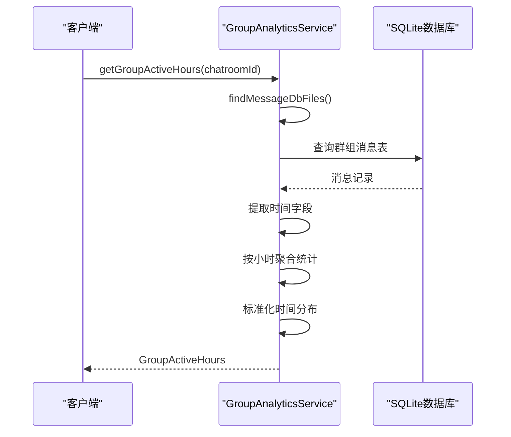

**图表来源**
- [groupAnalyticsService.ts:534-604](file://electron/services/groupAnalyticsService.ts#L534-L604)

#### 成员互动统计算法

成员互动统计基于消息发送者的精确识别：

```mermaid
flowchart TD
Start([开始成员统计]) --> CheckName2Id["检查Name2Id表"]
CheckName2Id --> HasName2Id{"存在Name2Id?"}
HasName2Id --> |是| JoinTables["JOIN Name2Id表"]
HasName2Id --> |否| UseSender["使用sender字段"]
JoinTables --> GroupBySender["GROUP BY real_sender_id"]
UseSender --> GroupBySender
GroupBySender --> CountMessages["统计消息数量"]
CountMessages --> GetMemberInfo["获取成员信息"]
GetMemberInfo --> SortResults["排序生成排行"]
SortResults --> End([返回GroupMessageRank[]])
```

**图表来源**
- [groupAnalyticsService.ts:423-531](file://electron/services/groupAnalyticsService.ts#L423-L531)

### 年度报告算法实现

#### 数据聚合算法

年度报告的数据聚合采用多阶段处理策略：

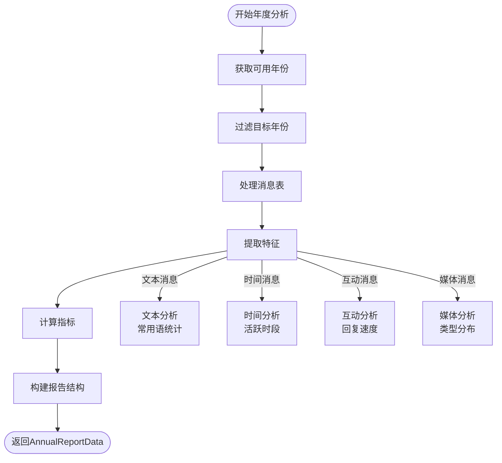

**图表来源**
- [annualReportService.ts:350-876](file://electron/services/annualReportService.ts#L350-L876)

#### 智能洞察算法

年度报告包含多项智能洞察功能：

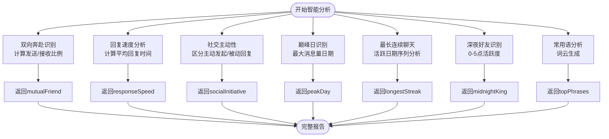

**图表来源**
- [annualReportService.ts:782-854](file://electron/services/annualReportService.ts#L782-L854)

**章节来源**
- [analyticsService.ts:269-743](file://electron/services/analyticsService.ts#L269-L743)
- [groupAnalyticsService.ts:423-707](file://electron/services/groupAnalyticsService.ts#L423-L707)
- [annualReportService.ts:350-876](file://electron/services/annualReportService.ts#L350-L876)

## 依赖关系分析

CipherTalk 的依赖关系清晰明确，遵循单一职责原则：

```mermaid
graph TB
subgraph "外部依赖"
BetterSqlite[better-sqlite3]
Electron[Electron框架]
ECharts[ECharts图表库]
React[React框架]
Zusta[Zustand状态管理]
end
subgraph "内部模块"
Analytics[AnalyticsService]
GroupAnalytics[GroupAnalyticsService]
AnnualReport[AnnualReportService]
Cache[CacheService]
Config[ConfigService]
HttpApi[HttpApiService]
end
subgraph "类型定义"
Types[analytics.ts]
Models[models.ts]
Store[analyticsStore.ts]
end
Analytics --> BetterSqlite
GroupAnalytics --> BetterSqlite
AnnualReport --> BetterSqlite
Analytics --> Config
GroupAnalytics --> Config
AnnualReport --> Config
Analytics --> Electron
GroupAnalytics --> Electron
AnnualReport --> Electron
Analytics --> ECharts
GroupAnalytics --> ECharts
Analytics --> React
GroupAnalytics --> React
AnnualReport --> React
Analytics --> Zusta
GroupAnalytics --> Zusta
AnnualReport --> Zusta
Analytics --> Types
GroupAnalytics --> Types
AnnualReport --> Types
Analytics --> Models
GroupAnalytics --> Models
AnnualReport --> Models
Analytics --> Store
GroupAnalytics --> Store
AnnualReport --> Store
```

**图表来源**
- [analyticsService.ts:1-6](file://electron/services/analyticsService.ts#L1-L6)
- [groupAnalyticsService.ts:1-5](file://electron/services/groupAnalyticsService.ts#L1-L5)
- [annualReportService.ts:1-6](file://electron/services/annualReportService.ts#L1-L6)

**章节来源**
- [analyticsService.ts:1-6](file://electron/services/analyticsService.ts#L1-L6)
- [groupAnalyticsService.ts:1-5](file://electron/services/groupAnalyticsService.ts#L1-L5)
- [annualReportService.ts:1-6](file://electron/services/annualReportService.ts#L1-L6)

## 性能考虑

### 数据库优化策略

CipherTalk 采用了多项数据库优化技术：

- **连接池管理**：通过 `messageDbCache` 实现数据库连接复用
- **索引优化**：利用 SQLite 的内置索引机制
- **查询优化**：使用预编译语句减少解析开销
- **内存管理**：及时关闭不再使用的数据库连接

### 缓存策略

系统实现了多层次的缓存机制：

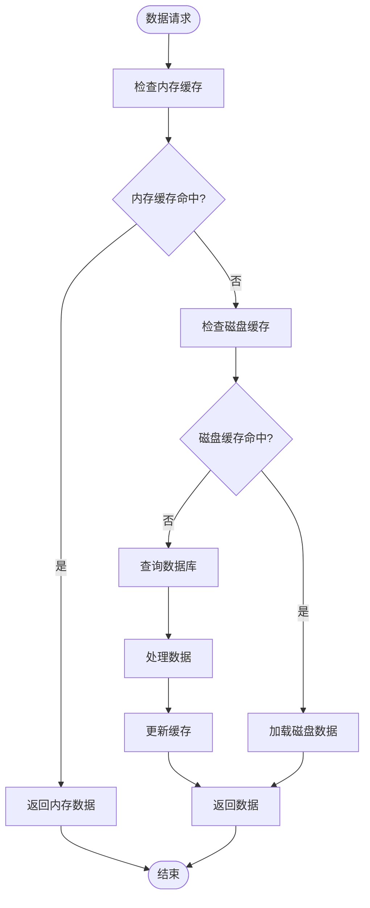

### 内存管理

系统采用智能的内存管理策略：

- **缓存大小控制**：限制缓存数据库的数量
- **超时清理**：定期清理过期的数据库连接
- **异常处理**：优雅处理数据库连接异常

**章节来源**
- [cacheService.ts:1-486](file://electron/services/cacheService.ts#L1-L486)
- [analyticsService.ts:40-46](file://electron/services/analyticsService.ts#L40-L46)

## 故障排除指南

### 常见问题及解决方案

#### 数据库连接问题

**问题症状**：无法连接到解密后的数据库文件

**可能原因**：
- 数据库文件不存在或路径错误
- 权限不足访问数据库文件
- 数据库文件损坏

**解决步骤**：
1. 检查 `cachePath` 配置是否正确
2. 验证数据库文件是否存在
3. 确认应用程序具有文件访问权限
4. 重新执行数据库解密过程

#### 分析服务异常

**问题症状**：分析服务返回错误或结果不准确

**诊断步骤**：
1. 检查 `myWxid` 配置是否正确
2. 验证消息表结构是否符合预期
3. 确认 `Name2Id` 表是否存在
4. 检查数据库完整性

#### 性能问题

**问题症状**：数据分析响应缓慢

**优化建议**：
1. 清理数据库缓存
2. 检查磁盘空间是否充足
3. 关闭不必要的应用程序
4. 考虑升级硬件配置

**章节来源**
- [cacheService.ts:112-191](file://electron/services/cacheService.ts#L112-L191)
- [config.ts:248-273](file://electron/services/config.ts#L248-L273)

## 结论

CipherTalk 的数据分析服务提供了全面、深入的微信聊天数据洞察功能。通过精心设计的架构和高效的算法实现，系统能够：

- **准确分析**：基于 SQLite 的直接数据读取确保统计结果的准确性
- **高效处理**：多层缓存和优化的查询策略保证良好的性能表现
- **深度洞察**：从基础统计到智能分析的多层次数据挖掘
- **用户体验**：直观的可视化界面和丰富的交互功能

该系统为用户提供了从个人聊天习惯分析到群组互动洞察的全方位数据服务，是微信聊天数据分析的理想工具。

## 附录

### API 使用示例

#### 私聊分析 API

```javascript
// 获取整体统计信息
const stats = await window.electronAPI.analytics.getOverallStatistics()

// 获取联系人排名
const rankings = await window.electronAPI.analytics.getContactRankings(20)

// 获取时间分布
const timeDist = await window.electronAPI.analytics.getTimeDistribution()
```

#### 群组分析 API

```javascript
// 获取群组列表
const groups = await window.electronAPI.groupAnalytics.getGroupChats()

// 获取群组成员
const members = await window.electronAPI.groupAnalytics.getGroupMembers(groupId)

// 获取群组活跃时段
const activeHours = await window.electronAPI.groupAnalytics.getGroupActiveHours(groupId)

// 获取媒体统计
const mediaStats = await window.electronAPI.groupAnalytics.getGroupMediaStats(groupId)
```

#### 年度报告 API

```javascript
// 获取可用年份
const years = await window.electronAPI.annualReport.getAvailableYears()

// 生成年度报告
await window.electronAPI.window.openAnnualReportWindow(2023)
```

### 自定义分析扩展指南

#### 添加新的统计指标

1. 在相应的服务类中添加新的方法
2. 定义返回的数据结构
3. 实现具体的统计逻辑
4. 更新前端页面以展示新指标

#### 修改可视化图表

1. 在对应的 React 组件中修改 ECharts 配置
2. 调整颜色主题和样式
3. 添加交互功能
4. 测试不同数据规模下的表现

#### 扩展数据源

1. 在 ConfigService 中添加新的配置项
2. 更新数据处理逻辑以支持新数据源
3. 添加相应的错误处理和验证
4. 更新用户界面以配置新选项

**章节来源**
- [AnalyticsPage.tsx:15-45](file://src/pages/AnalyticsPage.tsx#L15-L45)
- [GroupAnalyticsPage.tsx:138-174](file://src/pages/GroupAnalyticsPage.tsx#L138-L174)
- [AnnualReportPage.tsx:13-43](file://src/pages/AnnualReportPage.tsx#L13-L43)