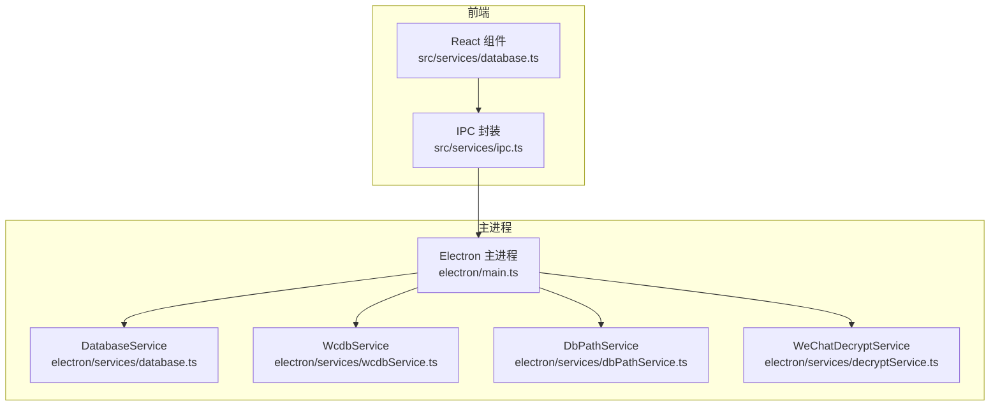
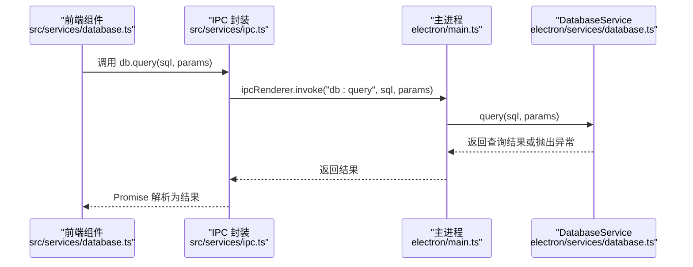
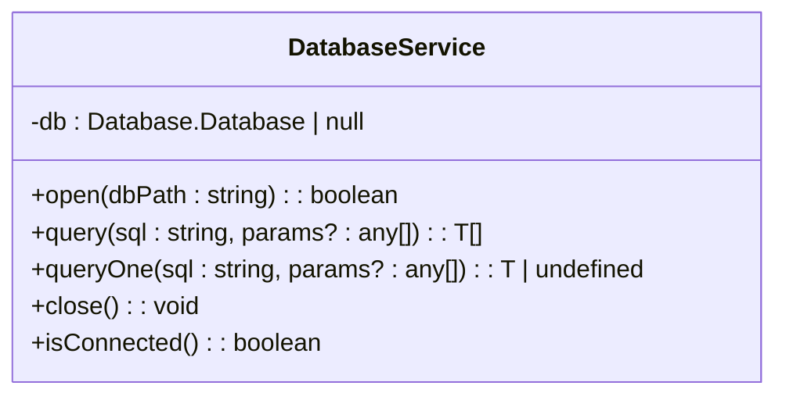
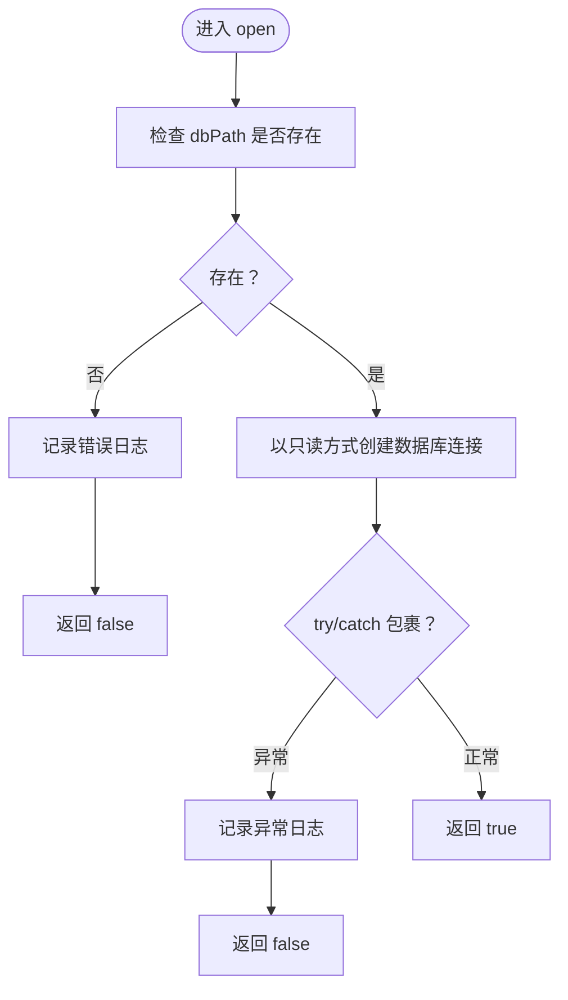
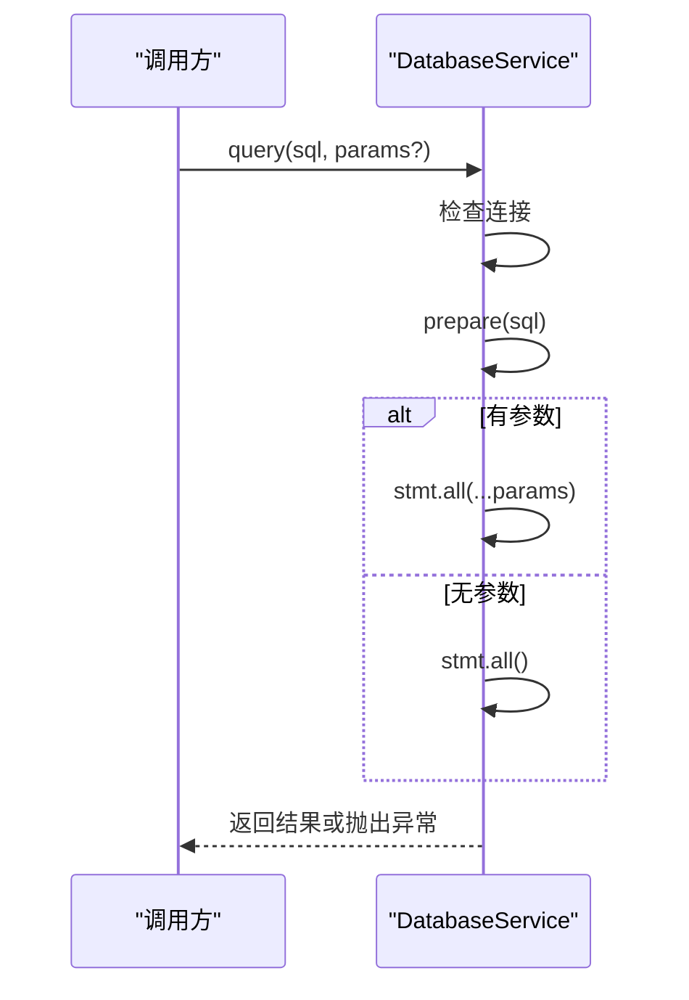
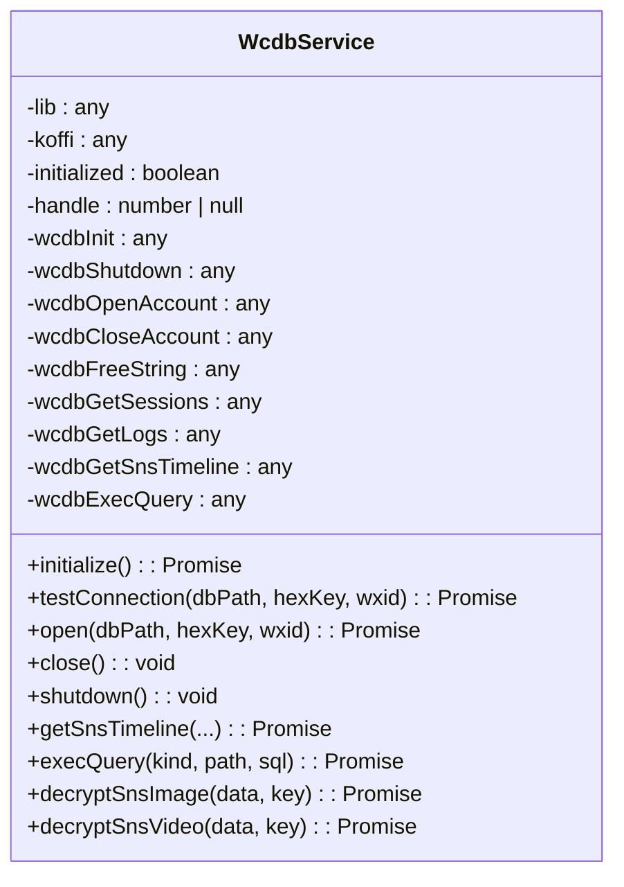
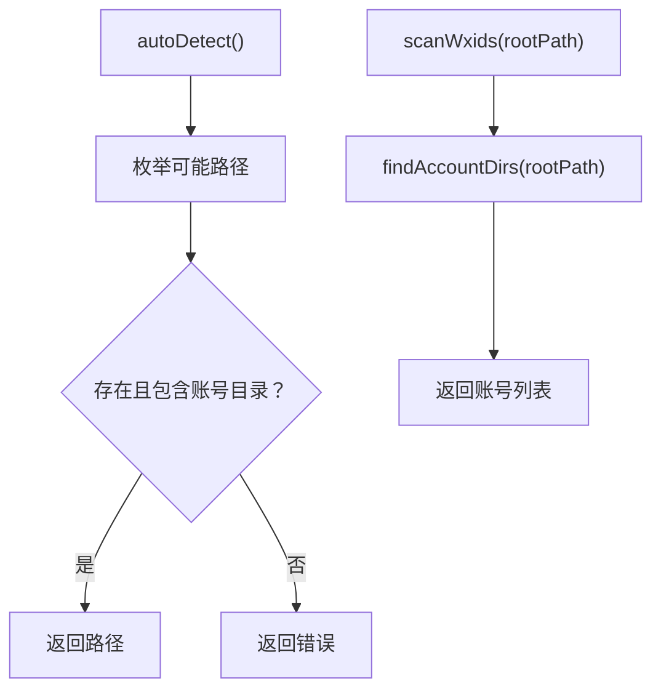
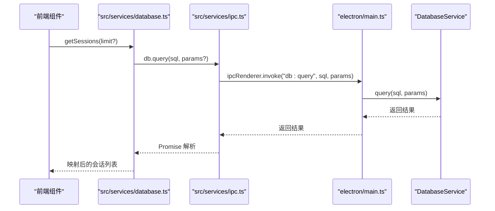
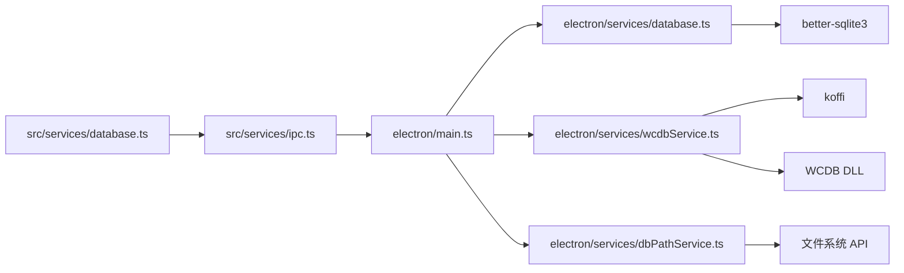

# 数据库服务

<cite>
**本文档引用的文件**
- [electron/services/database.ts](file://electron/services/database.ts)
- [src/services/database.ts](file://src/services/database.ts)
- [electron/services/wcdbService.ts](file://electron/services/wcdbService.ts)
- [electron/services/dbPathService.ts](file://electron/services/dbPathService.ts)
- [src/services/ipc.ts](file://src/services/ipc.ts)
- [electron/main.ts](file://electron/main.ts)
- [electron/services/decryptService.ts](file://electron/services/decryptService.ts)
</cite>

## 目录
1. [简介](#简介)
2. [项目结构](#项目结构)
3. [核心组件](#核心组件)
4. [架构总览](#架构总览)
5. [详细组件分析](#详细组件分析)
6. [依赖关系分析](#依赖关系分析)
7. [性能考量](#性能考量)
8. [故障排查指南](#故障排查指南)
9. [结论](#结论)
10. [附录](#附录)

## 简介
本文件面向 CipherTalk 的数据库服务，重点围绕 DatabaseService 类进行深入解析，涵盖以下方面：
- 数据库连接管理：连接建立、状态检查、资源释放
- WCDB 解密集成：DLL 初始化、密钥校验、会话数据库打开
- 查询执行机制：open 方法的参数验证、query 与 queryOne 的 SQL 执行流程、错误处理策略
- 连接池管理：连接状态检查、资源释放、异常恢复机制
- 数据库安全：只读模式、文件权限验证、路径安全检查
- 使用示例与最佳实践：数据库初始化、查询优化、事务处理等

## 项目结构
CipherTalk 的数据库相关能力由三层组成：
- 前端封装层：通过 IPC 将数据库操作暴露给渲染进程
- 主进程服务层：提供数据库连接、查询、解密等核心服务
- 第三方库集成：WCDB 原生 DLL 与 SQLite3 库

图表来源
- [electron/main.ts:1186-1197](file://electron/main.ts#L1186-L1197)
- [src/services/ipc.ts:10-15](file://src/services/ipc.ts#L10-L15)
- [electron/services/database.ts:5-82](file://electron/services/database.ts#L5-L82)
- [electron/services/wcdbService.ts:5-390](file://electron/services/wcdbService.ts#L5-L390)
- [electron/services/dbPathService.ts:5-93](file://electron/services/dbPathService.ts#L5-L93)
- [electron/services/decryptService.ts:7-54](file://electron/services/decryptService.ts#L7-L54)

章节来源
- [electron/main.ts:1186-1197](file://electron/main.ts#L1186-L1197)
- [src/services/ipc.ts:10-15](file://src/services/ipc.ts#L10-L15)
- [electron/services/database.ts:5-82](file://electron/services/database.ts#L5-L82)
- [electron/services/wcdbService.ts:5-390](file://electron/services/wcdbService.ts#L5-L390)
- [electron/services/dbPathService.ts:5-93](file://electron/services/dbPathService.ts#L5-L93)
- [electron/services/decryptService.ts:7-54](file://electron/services/decryptService.ts#L7-L54)

## 核心组件
本节聚焦 DatabaseService 类的设计与实现要点：
- 单例连接模型：内部维护一个 SQLite3 连接实例，提供 open、query、queryOne、close、isConnected 等方法
- 只读模式：以只读方式打开数据库，降低写入风险
- 参数验证：对输入路径进行存在性检查；对 SQL 参数数组进行长度判断
- 错误处理：捕获异常并记录日志，query/queryOne 抛出异常以便上层处理
- 资源管理：close 方法负责关闭连接并清理引用

章节来源
- [electron/services/database.ts:5-82](file://electron/services/database.ts#L5-L82)

## 架构总览
下图展示从前端发起数据库请求到主进程执行再到底层库交互的整体流程。

图表来源
- [src/services/database.ts:32](file://src/services/database.ts#L32)
- [src/services/ipc.ts:12-13](file://src/services/ipc.ts#L12-L13)
- [electron/main.ts:1191-1192](file://electron/main.ts#L1191-L1192)
- [electron/services/database.ts:29-64](file://electron/services/database.ts#L29-L64)

## 详细组件分析

### DatabaseService 类分析
DatabaseService 是基于 better-sqlite3 的轻量级数据库访问层，提供只读数据库连接与基础查询能力。

图表来源
- [electron/services/database.ts:5-82](file://electron/services/database.ts#L5-L82)

#### open 方法的参数验证与连接建立
- 路径存在性检查：若目标路径不存在，立即返回 false 并记录错误日志
- 只读模式：以只读方式打开数据库，避免意外写入
- 异常捕获：捕获构造函数异常并返回 false，便于上层统一处理

图表来源
- [electron/services/database.ts:11-24](file://electron/services/database.ts#L11-L24)

章节来源
- [electron/services/database.ts:11-24](file://electron/services/database.ts#L11-L24)

#### query 与 queryOne 的 SQL 执行流程
- 连接检查：若未打开连接则抛出错误
- 预编译语句：使用 prepare 编译 SQL
- 参数传递：若传入非空参数数组，则按索引展开传入
- 结果获取：query 使用 all 获取多行，queryOne 使用 get 获取单行
- 错误处理：捕获异常并记录日志，随后向上抛出

图表来源
- [electron/services/database.ts:29-64](file://electron/services/database.ts#L29-L64)

章节来源
- [electron/services/database.ts:29-64](file://electron/services/database.ts#L29-L64)

#### 错误处理策略
- open：返回布尔值，便于上层判断；异常时记录日志
- query/queryOne：抛出异常，让调用方决定如何处理
- close：仅在存在连接时关闭，避免重复关闭

章节来源
- [electron/services/database.ts:11-24](file://electron/services/database.ts#L11-L24)
- [electron/services/database.ts:29-64](file://electron/services/database.ts#L29-L64)
- [electron/services/database.ts:69-74](file://electron/services/database.ts#L69-L74)

#### 连接池管理与异常恢复
- 当前实现为单连接模型，无连接池概念
- isConnected 用于状态检查
- close 会释放连接并置空引用
- 建议：若需并发访问，应引入连接池（例如连接池大小、超时、健康检查），并在异常时进行重连或降级

章节来源
- [electron/services/database.ts:79-81](file://electron/services/database.ts#L79-L81)
- [electron/services/database.ts:69-74](file://electron/services/database.ts#L69-L74)

### WCDB 解密集成分析
WcdbService 负责与原生 WCDB DLL 交互，提供数据库初始化、会话数据库打开、原始 SQL 查询、日志打印等功能。

图表来源
- [electron/services/wcdbService.ts:5-390](file://electron/services/wcdbService.ts#L5-L390)

#### 初始化与 DLL 加载
- 使用 koffi 动态加载 wcdb_api.dll，并预加载 WCDB.dll
- 定义函数指针，确保与 C 接口签名一致
- 初始化成功后设置 initialized 标志

章节来源
- [electron/services/wcdbService.ts:71-148](file://electron/services/wcdbService.ts#L71-L148)

#### 会话数据库打开与密钥校验
- 通过递归查找 db_storage 中的 session.db
- 调用 wcdb_open_account 打开会话数据库
- 根据返回码映射常见错误（参数错误、密钥错误、打开失败）

章节来源
- [electron/services/wcdbService.ts:153-204](file://electron/services/wcdbService.ts#L153-L204)
- [electron/services/wcdbService.ts:231-274](file://electron/services/wcdbService.ts#L231-L274)

#### 原始 SQL 查询与日志打印
- execQuery 支持传入 kind、path、sql 执行查询
- 通过 wcdb_exec_query 获取 JSON 输出，解析为数组返回
- printLogs 在失败时打印 DLL 内部日志，辅助诊断

章节来源
- [electron/services/wcdbService.ts:347-368](file://electron/services/wcdbService.ts#L347-L368)
- [electron/services/wcdbService.ts:209-226](file://electron/services/wcdbService.ts#L209-L226)

#### 关闭与异常恢复
- close/shutdown 直接调用 wcdb_shutdown，避免可能的崩溃
- handle 置空并复位 initialized 标志，便于重新初始化

章节来源
- [electron/services/wcdbService.ts:280-291](file://electron/services/wcdbService.ts#L280-L291)

### 数据库路径与账号发现
DbPathService 提供自动检测微信数据库根目录、扫描账号目录、获取默认路径等能力。

图表来源
- [electron/services/dbPathService.ts:9-38](file://electron/services/dbPathService.ts#L9-L38)
- [electron/services/dbPathService.ts:73-81](file://electron/services/dbPathService.ts#L73-L81)

章节来源
- [electron/services/dbPathService.ts:9-38](file://electron/services/dbPathService.ts#L9-L38)
- [electron/services/dbPathService.ts:73-81](file://electron/services/dbPathService.ts#L73-L81)

### 前端数据库封装与 IPC
src/services/database.ts 作为前端数据库 API 的封装，将 SQL 查询与业务模型映射结合；src/services/ipc.ts 提供 IPC 调用的统一入口。

图表来源
- [src/services/database.ts:26-47](file://src/services/database.ts#L26-L47)
- [src/services/ipc.ts:12-13](file://src/services/ipc.ts#L12-L13)
- [electron/main.ts:1191-1192](file://electron/main.ts#L1191-L1192)
- [electron/services/database.ts:29-64](file://electron/services/database.ts#L29-L64)

章节来源
- [src/services/database.ts:26-47](file://src/services/database.ts#L26-L47)
- [src/services/ipc.ts:12-13](file://src/services/ipc.ts#L12-L13)
- [electron/main.ts:1191-1192](file://electron/main.ts#L1191-L1192)
- [electron/services/database.ts:29-64](file://electron/services/database.ts#L29-L64)

## 依赖关系分析
- DatabaseService 依赖 better-sqlite3，提供只读连接与基础查询
- WcdbService 依赖 koffi 与原生 DLL，提供 WCDB 接口封装
- DbPathService 依赖文件系统 API，提供路径与账号发现
- 前端通过 IPC 与主进程交互，主进程注册 db:open、db:query、db:close 等处理器

图表来源
- [electron/services/database.ts:1](file://electron/services/database.ts#L1)
- [electron/services/wcdbService.ts:75-104](file://electron/services/wcdbService.ts#L75-L104)
- [electron/services/dbPathService.ts:2](file://electron/services/dbPathService.ts#L2)
- [src/services/database.ts:2](file://src/services/database.ts#L2)
- [src/services/ipc.ts:10-15](file://src/services/ipc.ts#L10-L15)
- [electron/main.ts:1186-1197](file://electron/main.ts#L1186-L1197)

章节来源
- [electron/services/database.ts:1](file://electron/services/database.ts#L1)
- [electron/services/wcdbService.ts:75-104](file://electron/services/wcdbService.ts#L75-L104)
- [electron/services/dbPathService.ts:2](file://electron/services/dbPathService.ts#L2)
- [src/services/database.ts:2](file://src/services/database.ts#L2)
- [src/services/ipc.ts:10-15](file://src/services/ipc.ts#L10-L15)
- [electron/main.ts:1186-1197](file://electron/main.ts#L1186-L1197)

## 性能考量
- 只读连接：DatabaseService 以只读方式打开数据库，避免写锁竞争，适合高频只读查询场景
- 预编译语句：query/queryOne 使用 prepare 预编译 SQL，减少解析开销
- 参数绑定：通过数组参数绑定，避免字符串拼接带来的性能与安全问题
- WCDB 查询：execQuery 返回 JSON 字符串，解析为数组，注意大结果集的内存占用
- 建议：对于高频查询，可在上层增加结果缓存；对复杂查询建议分页与索引优化

[本节为通用性能讨论，无需列出具体文件来源]

## 故障排查指南
- 数据库打开失败
  - 检查 dbPath 是否存在且可访问
  - 确认数据库文件未被其他进程锁定
  - 若使用 WCDB，确认密钥 hexKey 正确且 session.db 可被打开
- 查询异常
  - 检查 SQL 语法与参数数量是否匹配
  - 确认数据库连接已打开
  - 查看控制台日志中的错误信息
- WCDB 初始化失败
  - 确认 wcdb_api.dll 与 WCDB.dll 存在且可加载
  - 使用 printLogs 获取 DLL 内部日志
  - 检查返回码含义并对应处理

章节来源
- [electron/services/database.ts:11-24](file://electron/services/database.ts#L11-L24)
- [electron/services/database.ts:29-64](file://electron/services/database.ts#L29-L64)
- [electron/services/wcdbService.ts:71-148](file://electron/services/wcdbService.ts#L71-L148)
- [electron/services/wcdbService.ts:209-226](file://electron/services/wcdbService.ts#L209-L226)

## 结论
DatabaseService 以简洁的只读连接模型满足了 CipherTalk 的数据库读取需求，配合 WCDB 服务实现了对微信数据库的解密与查询。前端通过 IPC 将数据库操作抽象为易用的 API。建议在未来引入连接池、查询缓存与更完善的错误恢复机制，以提升并发性能与稳定性。

[本节为总结性内容，无需列出具体文件来源]

## 附录

### 使用示例与最佳实践
- 数据库初始化
  - 通过 DbPathService 自动检测数据库根目录
  - 使用 WeChatDecryptService 对数据库进行解密
  - 使用 DatabaseService 或 WcdbService 打开数据库并执行查询
- 查询优化
  - 使用 LIMIT 与 OFFSET 实现分页
  - 对常用查询字段建立索引（在可写场景下）
  - 避免 N+1 查询，合并批量查询
- 事务处理
  - DatabaseService 默认为只读，不支持事务
  - 若需写入，请评估使用可写连接或专用写库
- 安全注意事项
  - 严格校验输入路径与密钥
  - 仅在必要时启用写操作
  - 对敏感日志进行脱敏处理

章节来源
- [electron/services/dbPathService.ts:9-38](file://electron/services/dbPathService.ts#L9-L38)
- [electron/services/decryptService.ts:21-50](file://electron/services/decryptService.ts#L21-L50)
- [electron/services/database.ts:11-24](file://electron/services/database.ts#L11-L24)
- [src/services/database.ts:26-47](file://src/services/database.ts#L26-L47)