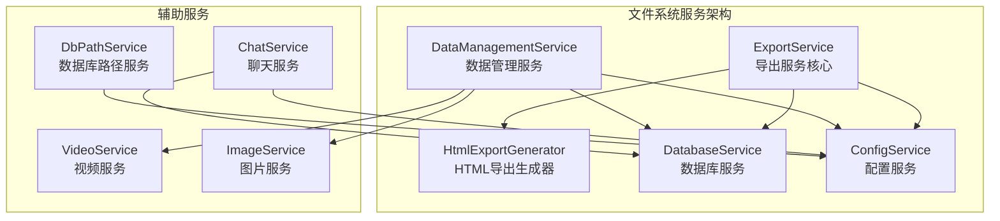
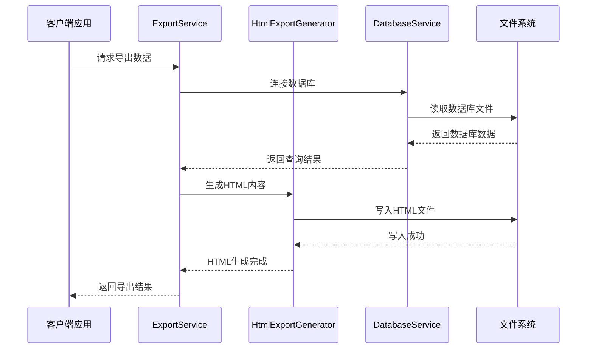
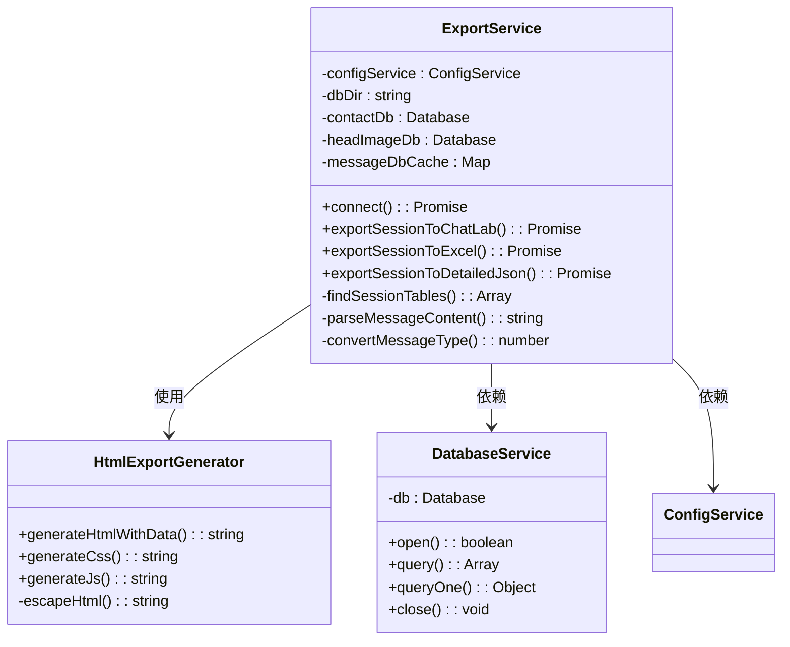
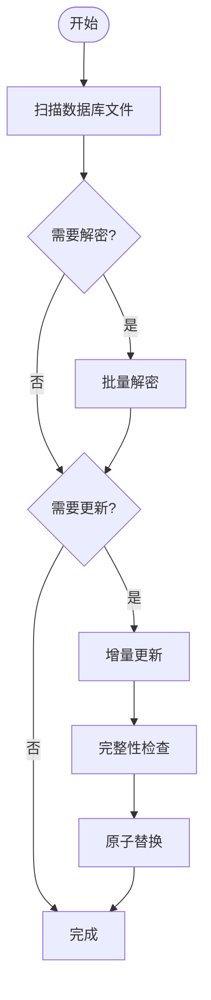
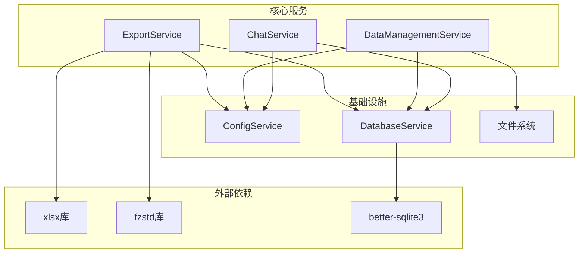

# 文件系统服务

<cite>
**本文档引用的文件**
- [exportService.ts](file://electron/services/exportService.ts)
- [htmlExportGenerator.ts](file://electron/services/htmlExportGenerator.ts)
- [dataManagementService.ts](file://electron/services/dataManagementService.ts)
- [database.ts](file://electron/services/database.ts)
- [dbPathService.ts](file://electron/services/dbPathService.ts)
- [config.ts](file://electron/services/config.ts)
- [chatService.ts](file://electron/services/chatService.ts)
</cite>

## 目录
1. [简介](#简介)
2. [项目结构](#项目结构)
3. [核心组件](#核心组件)
4. [架构概览](#架构概览)
5. [详细组件分析](#详细组件分析)
6. [依赖关系分析](#依赖关系分析)
7. [性能考虑](#性能考虑)
8. [故障排除指南](#故障排除指南)
9. [结论](#结论)

## 简介

CipherTalk 的文件系统服务是一个综合性的数据管理和导出平台，专注于微信聊天数据的处理和导出。该系统提供了多种导出格式支持，包括 ChatLab 格式、HTML 格式、JSON 格式、Excel 格式等，同时具备强大的数据管理功能，包括数据库解密、增量更新、备份恢复和数据迁移。

系统采用模块化设计，通过 ExportService 作为核心导出引擎，结合 HtmlExportGenerator 提供 HTML 导出功能，通过 DataManagementService 管理数据库文件的生命周期，形成了完整的文件系统服务架构。

## 项目结构

文件系统服务位于 Electron 应用的 `electron/services/` 目录下，采用功能模块化的组织方式：

**图表来源**
- [exportService.ts:117-127](file://electron/services/exportService.ts#L117-L127)
- [dataManagementService.ts:34-50](file://electron/services/dataManagementService.ts#L34-L50)
- [database.ts:5-82](file://electron/services/database.ts#L5-L82)

**章节来源**
- [exportService.ts:1-100](file://electron/services/exportService.ts#L1-L100)
- [dataManagementService.ts:1-100](file://electron/services/dataManagementService.ts#L1-L100)

## 核心组件

### ExportService - 导出服务核心

ExportService 是整个文件系统服务的核心组件，负责处理各种格式的数据导出。该服务支持多种导出格式，包括 ChatLab 格式、HTML 格式、JSON 格式、Excel 格式等。

**主要功能特性：**
- 多格式导出支持（ChatLab、HTML、JSON、Excel、TXT、SQL）
- 智能数据库连接管理
- 媒体文件处理和嵌入
- 进度跟踪和状态报告
- 错误处理和恢复机制

**章节来源**
- [exportService.ts:117-1090](file://electron/services/exportService.ts#L117-L1090)

### HtmlExportGenerator - HTML 导出生成器

HtmlExportGenerator 专门负责生成美观的 HTML 格式聊天记录导出文件。该生成器提供了现代化的界面设计，支持主题切换、搜索功能、日期跳转等交互特性。

**核心特性：**
- 单文件 HTML 生成（内联 CSS、JavaScript、数据）
- 响应式设计支持
- 主题切换功能（明暗主题）
- 搜索和日期跳转功能
- 媒体文件内联显示

**章节来源**
- [htmlExportGenerator.ts:51-124](file://electron/services/htmlExportGenerator.ts#L51-L124)

### DataManagementService - 数据管理服务

DataManagementService 负责管理数据库文件的完整生命周期，包括扫描、解密、增量更新、备份恢复和数据迁移等功能。

**关键能力：**
- 数据库文件扫描和识别
- 批量数据库解密
- 增量更新机制
- 自动备份和恢复
- 缓存目录迁移

**章节来源**
- [dataManagementService.ts:34-612](file://electron/services/dataManagementService.ts#L34-L612)

## 架构概览

系统采用分层架构设计，各组件职责明确，通过清晰的接口进行交互：

**图表来源**
- [exportService.ts:717-1090](file://electron/services/exportService.ts#L717-L1090)
- [htmlExportGenerator.ts:55-124](file://electron/services/htmlExportGenerator.ts#L55-L124)

**章节来源**
- [exportService.ts:220-264](file://electron/services/exportService.ts#L220-L264)
- [database.ts:11-44](file://electron/services/database.ts#L11-L44)

## 详细组件分析

### 导出服务架构

ExportService 采用了工厂模式和策略模式相结合的设计，支持多种导出格式的统一处理：

**图表来源**
- [exportService.ts:117-1090](file://electron/services/exportService.ts#L117-L1090)
- [htmlExportGenerator.ts:51-124](file://electron/services/htmlExportGenerator.ts#L51-L124)
- [database.ts:5-82](file://electron/services/database.ts#L5-L82)

**章节来源**
- [exportService.ts:117-327](file://electron/services/exportService.ts#L117-L327)

### HTML 导出生成器详解

HtmlExportGenerator 提供了完整的 HTML 导出解决方案，具有以下特点：

**模板引擎使用：**
- 采用简单的模板字符串替换机制
- 动态生成 CSS 和 JavaScript 代码
- 内联所有资源以确保单文件输出

**样式处理机制：**
- 支持明暗两种主题模式
- 响应式布局设计
- 现代化的聊天界面样式

**多媒体文件嵌入：**
- 图片文件内联编码（base64）
- 视频文件内联播放支持
- 表情包和语音文件处理

**章节来源**
- [htmlExportGenerator.ts:55-673](file://electron/services/htmlExportGenerator.ts#L55-L673)

### 数据管理服务流程

DataManagementService 实现了完整的数据库生命周期管理：

**图表来源**
- [dataManagementService.ts:413-612](file://electron/services/dataManagementService.ts#L413-L612)

**章节来源**
- [dataManagementService.ts:413-612](file://electron/services/dataManagementService.ts#L413-L612)

### 文件操作安全机制

系统实现了多层次的安全保护机制：

**路径验证：**
- 账号目录智能识别和验证
- 文件路径规范化处理
- 目录遍历攻击防护

**权限检查：**
- 文件读写权限验证
- 数据库文件完整性检查
- 用户配置权限验证

**临时文件管理：**
- 解密过程中的临时文件处理
- 原子性文件替换机制
- 备份文件的自动清理

**章节来源**
- [dataManagementService.ts:489-595](file://electron/services/dataManagementService.ts#L489-L595)

## 依赖关系分析

文件系统服务的依赖关系呈现星型结构，核心服务位于中心位置：

**图表来源**
- [exportService.ts:1-13](file://electron/services/exportService.ts#L1-L13)
- [dataManagementService.ts:1-9](file://electron/services/dataManagementService.ts#L1-L9)

**章节来源**
- [exportService.ts:1-13](file://electron/services/exportService.ts#L1-L13)
- [dataManagementService.ts:1-9](file://electron/services/dataManagementService.ts#L1-L9)

## 性能考虑

### 大文件处理策略

系统针对大文件导出实现了多项优化措施：

**内存使用控制：**
- 分批处理消息数据，避免一次性加载所有数据
- 使用流式写入减少内存占用
- 数据库连接池管理，避免资源泄漏

**进度跟踪机制：**
- 详细的导出进度报告
- 阶段性进度更新（准备、导出、写入、完成）
- 实时状态反馈给用户界面

**章节来源**
- [exportService.ts:887-1089](file://electron/services/exportService.ts#L887-L1089)

### 导出格式性能优化

**ChatLab 格式：**
- JSONL 格式支持流式处理
- 增量写入减少内存压力
- 压缩算法优化

**Excel 格式：**
- 使用 xlsx 库进行高效处理
- 内存优化的表格构建
- 大数据量的分页处理

**HTML 格式：**
- 单文件输出减少文件数量
- 内联资源优化加载速度
- 压缩和优化的 CSS/JS

**章节来源**
- [exportService.ts:1679-1905](file://electron/services/exportService.ts#L1679-L1905)

## 故障排除指南

### 常见问题及解决方案

**数据库连接失败：**
- 检查微信数据库路径配置
- 验证数据库文件完整性
- 确认解密密钥正确性

**导出进度停滞：**
- 检查磁盘空间充足性
- 验证目标文件路径可写性
- 监控系统资源使用情况

**HTML 导出显示异常：**
- 确认浏览器兼容性
- 检查文件编码设置
- 验证多媒体文件完整性

**数据管理服务错误：**
- 检查文件权限设置
- 验证备份文件完整性
- 确认数据库文件锁定状态

**章节来源**
- [exportService.ts:1086-1089](file://electron/services/exportService.ts#L1086-L1089)
- [dataManagementService.ts:597-612](file://electron/services/dataManagementService.ts#L597-L612)

### 错误处理机制

系统实现了完善的错误处理和恢复机制：

**错误分类处理：**
- 数据库连接错误：自动重连和降级处理
- 文件操作错误：权限检查和路径修正
- 内存不足错误：自动清理和资源回收

**恢复机制：**
- 增量更新的原子性保证
- 备份文件的自动恢复
- 部分失败的断点续传

**章节来源**
- [dataManagementService.ts:489-595](file://electron/services/dataManagementService.ts#L489-L595)

## 结论

CipherTalk 的文件系统服务提供了一个完整、可靠、高性能的数据导出和管理系统。通过模块化的设计和多层次的安全保障，该系统能够有效处理复杂的微信聊天数据导出需求。

**主要优势：**
- 多格式导出支持，满足不同使用场景
- 完善的数据管理生命周期
- 强大的安全保护机制
- 优秀的性能表现和用户体验

**未来发展方向：**
- 支持更多导出格式和自定义模板
- 增强大数据量处理能力
- 优化移动端导出体验
- 扩展云存储集成支持

该系统为用户提供了专业级的数据导出解决方案，是 CipherTalk 应用的重要组成部分。