# 系统集成功能

<cite>
**本文档引用的文件**
- [activationService.ts](file://electron/services/activationService.ts)
- [shortcutService.ts](file://electron/services/shortcutService.ts)
- [windowsHelloService.ts](file://electron/services/windowsHelloService.ts)
- [snsService.ts](file://electron/services/snsService.ts)
- [config.ts](file://electron/services/config.ts)
- [main.ts](file://electron/main.ts)
- [preload.ts](file://electron/preload.ts)
- [ActivationPage.tsx](file://src/pages/ActivationPage.tsx)
- [activationStore.ts](file://src/stores/activationStore.ts)
- [authStore.ts](file://src/stores/authStore.ts)
- [httpApiService.ts](file://electron/services/httpApiService.ts)
- [installer.nsh](file://installer.nsh)
- [package.json](file://package.json)
</cite>

## 目录
1. [简介](#简介)
2. [项目结构](#项目结构)
3. [核心组件](#核心组件)
4. [架构概览](#架构概览)
5. [详细组件分析](#详细组件分析)
6. [依赖关系分析](#依赖关系分析)
7. [性能考虑](#性能考虑)
8. [故障排除指南](#故障排除指南)
9. [结论](#结论)
10. [附录](#附录)

## 简介

CipherTalk 是一个基于 Electron 的微信聊天记录查看工具，专注于系统集成功能的实现。本文档深入分析了系统的四大核心集成模块：激活服务、快捷键服务、Windows Hello 生物识别服务和社交网络服务。

系统集成功能涵盖了从许可证验证到设备绑定，从生物识别认证到第三方登录的完整生态。通过精心设计的架构，CipherTalk 实现了跨平台的系统级集成，为用户提供了无缝的使用体验。

## 项目结构

CipherTalk 采用模块化的项目结构，主要分为前端界面层、Electron 主进程层和服务层：

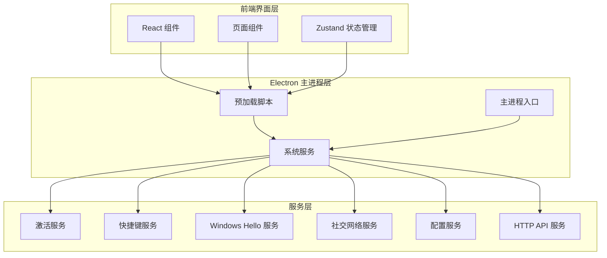

**图表来源**
- [main.ts:1-100](file://electron/main.ts#L1-L100)
- [preload.ts:1-50](file://electron/preload.ts#L1-L50)

**章节来源**
- [main.ts:1-200](file://electron/main.ts#L1-L200)
- [preload.ts:1-100](file://electron/preload.ts#L1-L100)

## 核心组件

### 激活服务系统

激活服务是系统的核心安全组件，实现了完整的许可证管理和设备绑定机制：

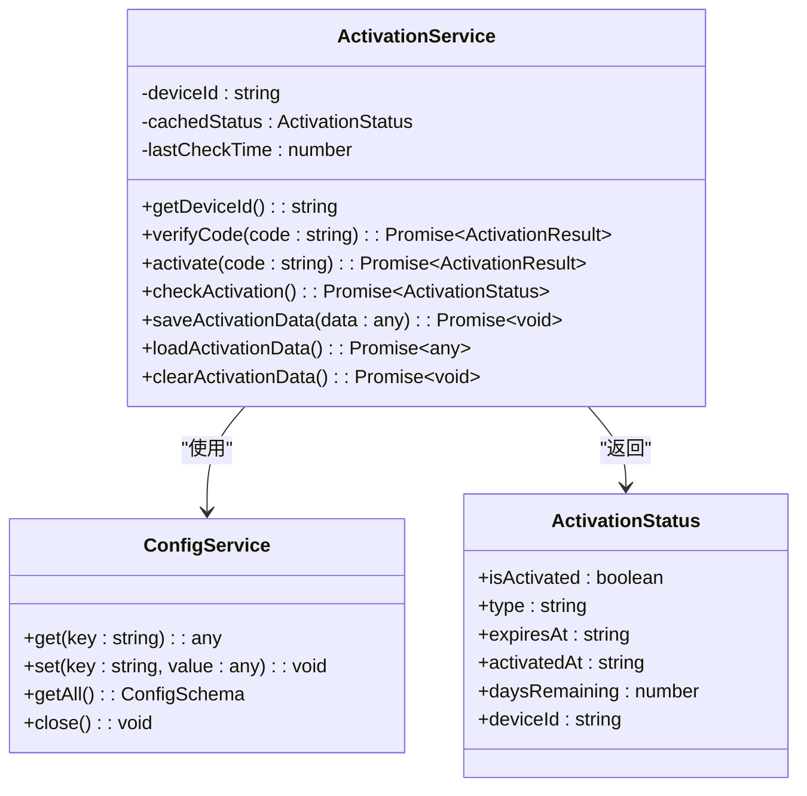

**图表来源**
- [activationService.ts:38-150](file://electron/services/activationService.ts#L38-L150)
- [config.ts:126-170](file://electron/services/config.ts#L126-L170)

激活服务的主要特性包括：
- **设备唯一标识生成**：基于 CPU 信息、主板序列号和 UUID 的组合算法
- **离线缓存机制**：5 分钟缓存策略确保离线环境下的稳定性
- **多重验证机制**：本地验证 + 在线验证的双重保障
- **加密存储**：激活数据的加密存储和签名验证

**章节来源**
- [activationService.ts:1-200](file://electron/services/activationService.ts#L1-L200)
- [ActivationPage.tsx:1-100](file://src/pages/ActivationPage.tsx#L1-L100)
- [activationStore.ts:1-45](file://src/stores/activationStore.ts#L1-L45)

### 快捷键服务系统

快捷键服务实现了 Windows 平台的桌面快捷方式管理功能：

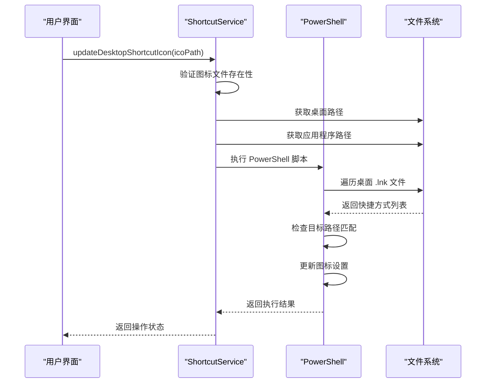

**图表来源**
- [shortcutService.ts:12-76](file://electron/services/shortcutService.ts#L12-L76)

**章节来源**
- [shortcutService.ts:1-80](file://electron/services/shortcutService.ts#L1-L80)

### Windows Hello 生物识别系统

Windows Hello 服务提供了高性能的生物识别认证功能：

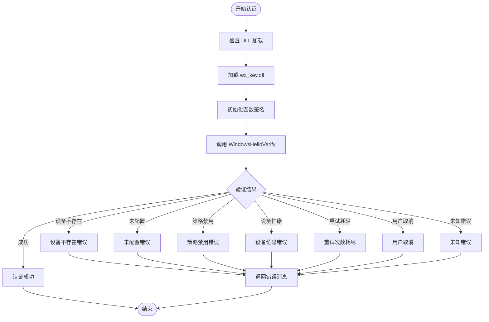

**图表来源**
- [windowsHelloService.ts:106-135](file://electron/services/windowsHelloService.ts#L106-L135)

**章节来源**
- [windowsHelloService.ts:1-150](file://electron/services/windowsHelloService.ts#L1-L150)
- [authStore.ts:91-116](file://src/stores/authStore.ts#L91-L116)

### 社交网络服务系统

社交网络服务实现了微信朋友圈数据的解析和管理功能：

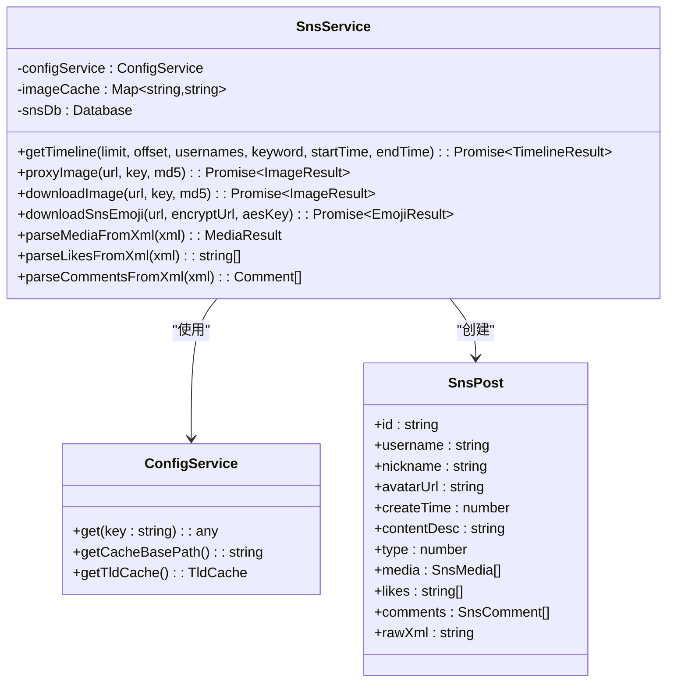

**图表来源**
- [snsService.ts:290-350](file://electron/services/snsService.ts#L290-L350)
- [config.ts:387-394](file://electron/services/config.ts#L387-L394)

**章节来源**
- [snsService.ts:1-200](file://electron/services/snsService.ts#L1-L200)
- [httpApiService.ts:1-100](file://electron/services/httpApiService.ts#L1-L100)

## 架构概览

CipherTalk 采用了分层架构设计，确保了系统的可维护性和扩展性：

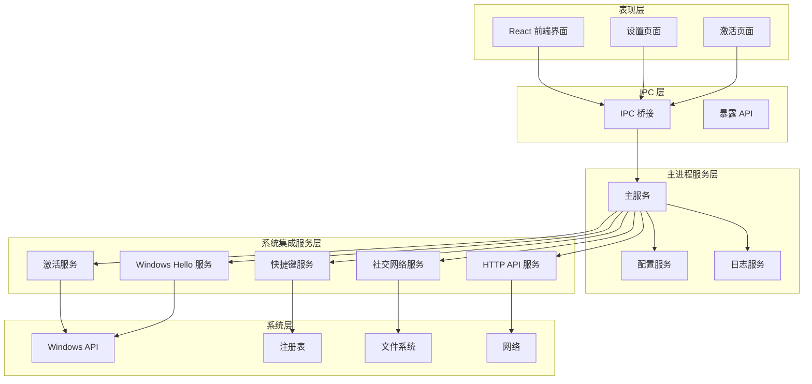

**图表来源**
- [main.ts:1-150](file://electron/main.ts#L1-L150)
- [preload.ts:4-435](file://electron/preload.ts#L4-L435)

## 详细组件分析

### 激活服务详细分析

激活服务是系统安全的核心，实现了多层次的安全验证机制：

#### 设备标识生成算法

激活服务通过组合多种硬件信息生成唯一的设备标识：

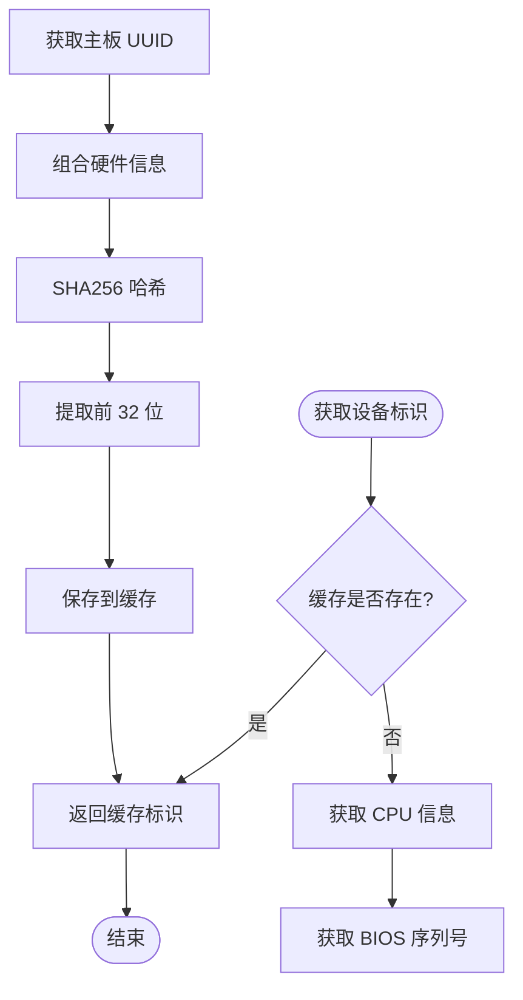

**图表来源**
- [activationService.ts:47-98](file://electron/services/activationService.ts#L47-L98)

#### 激活流程管理

激活服务采用异步状态管理模式，确保用户体验的流畅性：

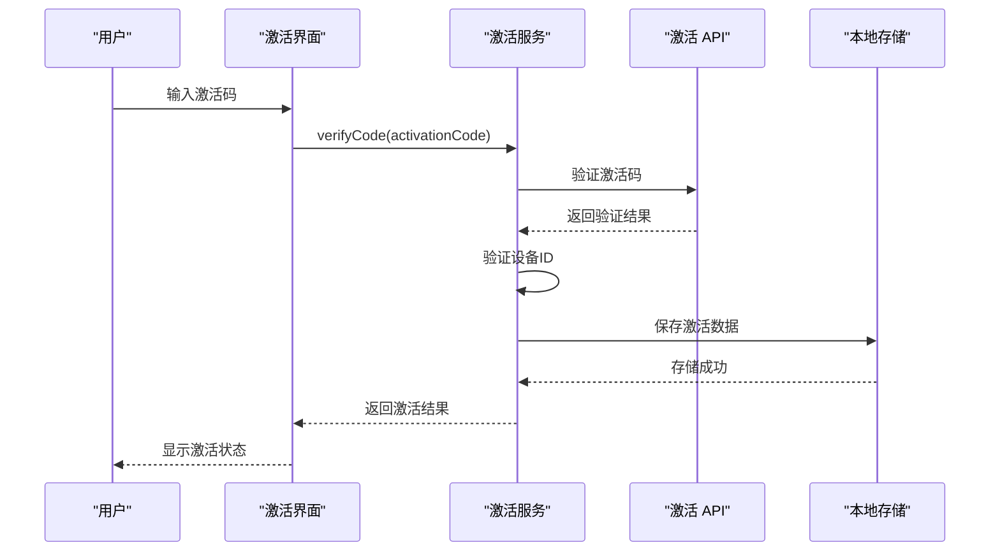

**图表来源**
- [activationService.ts:150-242](file://electron/services/activationService.ts#L150-L242)
- [ActivationPage.tsx:36-61](file://src/pages/ActivationPage.tsx#L36-L61)

**章节来源**
- [activationService.ts:1-516](file://electron/services/activationService.ts#L1-L516)
- [ActivationPage.tsx:1-221](file://src/pages/ActivationPage.tsx#L1-L221)
- [activationStore.ts:1-45](file://src/stores/activationStore.ts#L1-L45)

### Windows Hello 生物识别详细分析

Windows Hello 服务提供了高性能的生物识别认证，相比 WebAuthn API 具有更好的性能表现：

#### DLL 集成架构

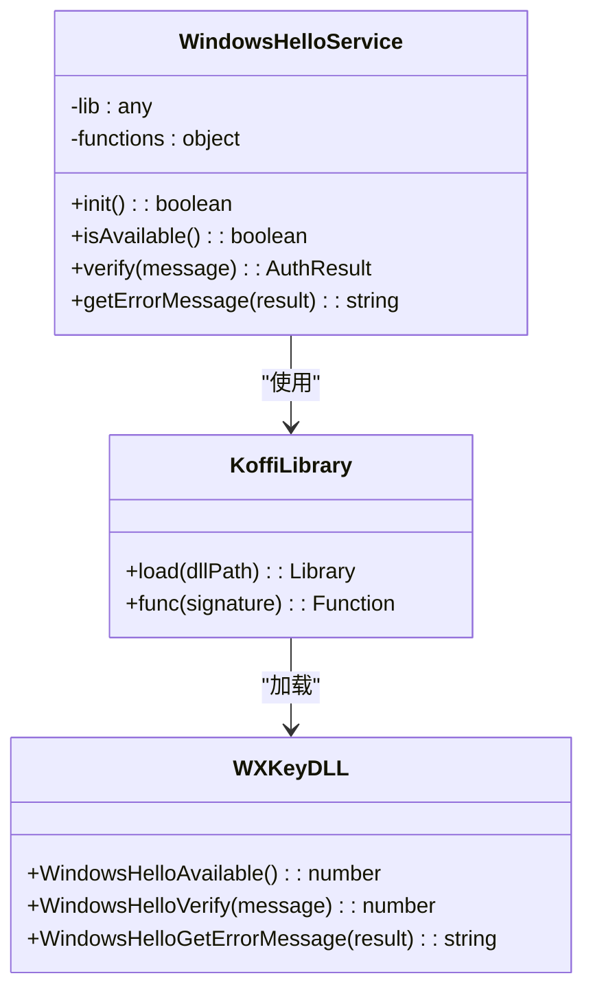

**图表来源**
- [windowsHelloService.ts:35-84](file://electron/services/windowsHelloService.ts#L35-L84)

#### 认证流程优化

Windows Hello 服务通过原生 DLL 调用实现了优化的认证流程：

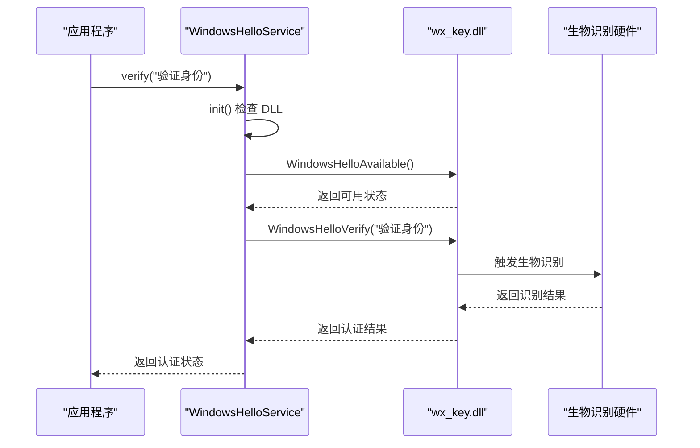

**图表来源**
- [windowsHelloService.ts:106-135](file://electron/services/windowsHelloService.ts#L106-L135)

**章节来源**
- [windowsHelloService.ts:1-150](file://electron/services/windowsHelloService.ts#L1-L150)
- [authStore.ts:91-116](file://src/stores/authStore.ts#L91-L116)

### 社交网络服务详细分析

社交网络服务实现了复杂的数据解析和缓存管理功能：

#### 数据解析架构

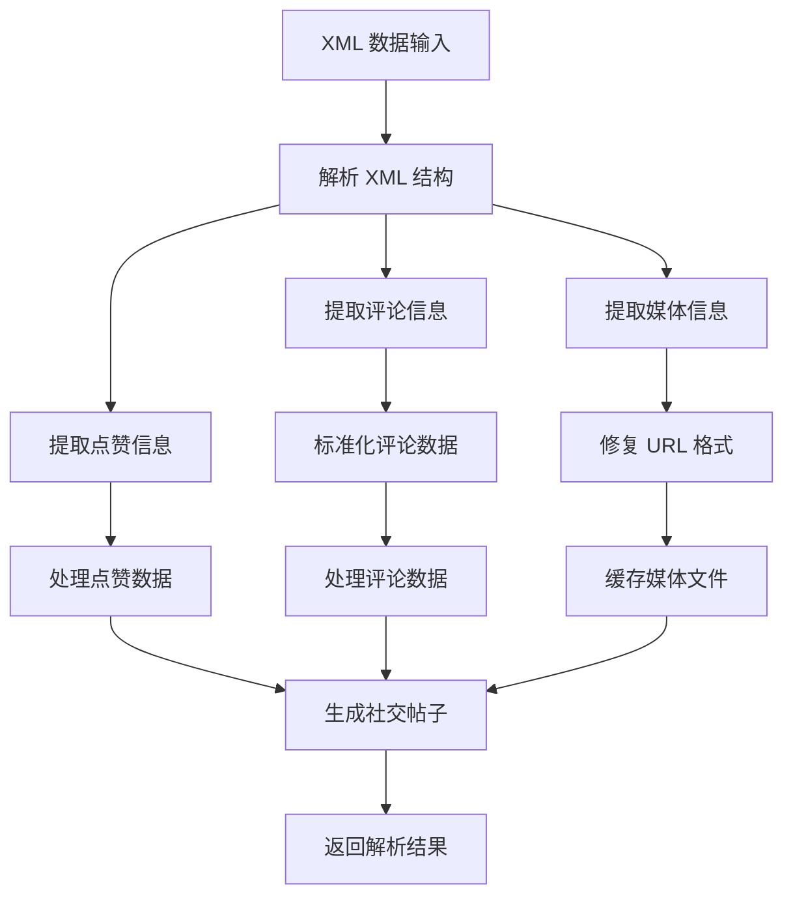

**图表来源**
- [snsService.ts:699-851](file://electron/services/snsService.ts#L699-L851)

#### 缓存管理系统

社交网络服务实现了智能的缓存管理机制：

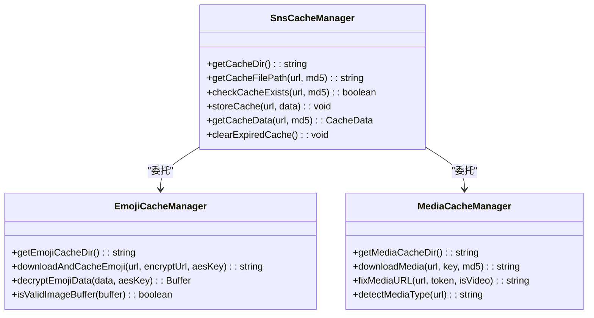

**图表来源**
- [snsService.ts:1313-1326](file://electron/services/snsService.ts#L1313-L1326)

**章节来源**
- [snsService.ts:1-1806](file://electron/services/snsService.ts#L1-L1806)

## 依赖关系分析

### 核心依赖关系

```mermaid
graph TB
subgraph "外部依赖"
Electron[Electron 39.2.7]
BetterSQLite3[better-sqlite3 12.5.0]
Koffi[koffi 2.9.0]
MaterialUI[@mui/material 7.3.9]
end
subgraph "内部模块"
ActivationService[activationService.ts]
WindowsHelloService[windowsHelloService.ts]
SnsService[snsService.ts]
ConfigService[config.ts]
HttpApiService[httpApiService.ts]
ShortcutService[shortcutService.ts]
end
subgraph "构建工具"
Vite[Vite 6.0.5]
TypeScript[TypeScript 5.6.3]
ElectronBuilder[electron-builder 25.1.8]
end
Electron --> ActivationService
Electron --> WindowsHelloService
Electron --> SnsService
Electron --> ConfigService
Electron --> HttpApiService
Electron --> ShortcutService
BetterSQLite3 --> SnsService
BetterSQLite3 --> ConfigService
Koffi --> WindowsHelloService
MaterialUI --> ActivationService
Vite --> Electron
TypeScript --> Electron
ElectronBuilder --> Electron
```

**图表来源**
- [package.json:20-73](file://package.json#L20-L73)

### 服务间通信关系

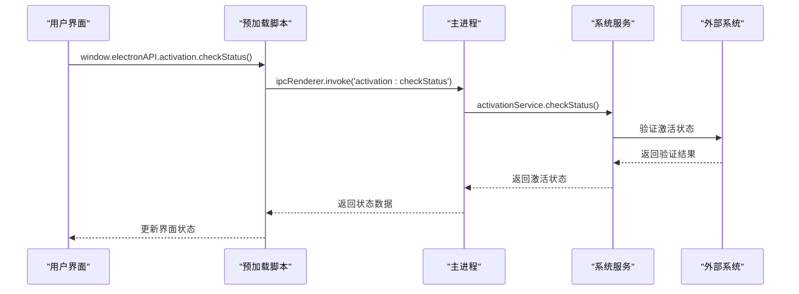

**图表来源**
- [preload.ts:341-349](file://electron/preload.ts#L341-L349)
- [main.ts:1496-1503](file://electron/main.ts#L1496-L1503)

**章节来源**
- [package.json:1-169](file://package.json#L1-L169)
- [main.ts:1496-1503](file://electron/main.ts#L1496-L1503)
- [preload.ts:341-349](file://electron/preload.ts#L341-L349)

## 性能考虑

### 缓存策略优化

系统实现了多层次的缓存策略来提升性能：

1. **激活状态缓存**：5 分钟缓存策略，平衡实时性和性能
2. **图像缓存**：基于 MD5 的文件缓存，避免重复下载
3. **数据库连接池**：复用数据库连接，减少连接开销
4. **内存缓存**：热点数据的内存缓存机制

### 异步处理优化

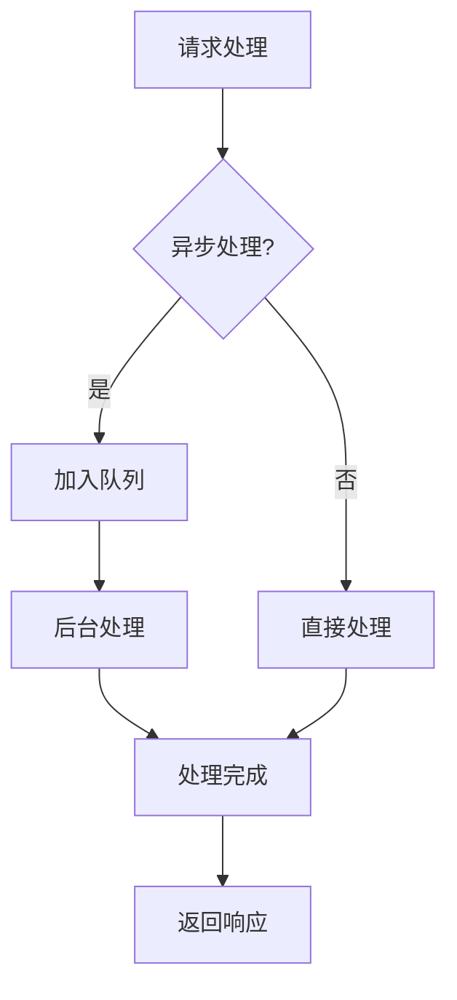

### 资源管理优化

系统通过合理的资源管理策略确保长期稳定运行：
- **内存泄漏防护**：及时清理事件监听器和定时器
- **文件句柄管理**：确保文件操作后的正确关闭
- **数据库连接管理**：连接池的合理使用和回收

## 故障排除指南

### 激活服务故障排除

#### 常见激活问题及解决方案

| 问题类型 | 症状描述 | 解决方案 |
|---------|---------|---------|
| 设备ID生成失败 | 激活码验证失败 | 检查系统权限，使用降级方案生成随机ID |
| 网络连接超时 | 激活验证请求超时 | 检查网络连接，重试请求 |
| 激活数据损坏 | 本地激活信息丢失 | 清除激活数据，重新激活 |
| 设备ID不匹配 | 激活后仍显示未激活 | 检查设备硬件变更，重新绑定 |

#### 激活服务调试步骤

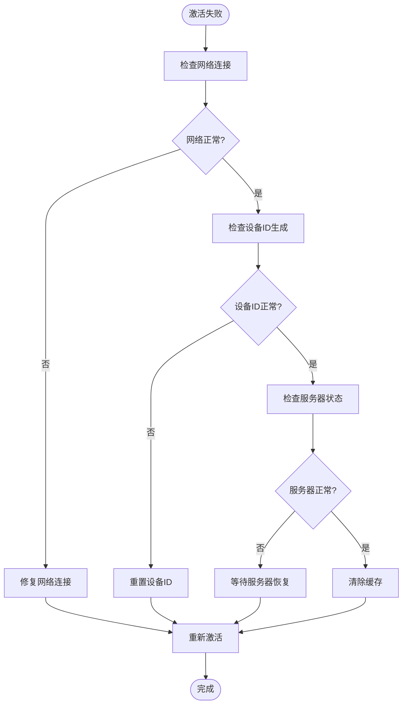

**图表来源**
- [activationService.ts:265-366](file://electron/services/activationService.ts#L265-L366)

### Windows Hello 故障排除

#### 生物识别认证失败诊断

| 错误类型 | 错误代码 | 可能原因 | 解决方案 |
|---------|---------|---------|---------|
| 设备不存在 | 1 | 未检测到生物识别设备 | 检查硬件连接，更新驱动程序 |
| 未配置 | 2 | Windows Hello 未设置 | 在系统设置中配置生物识别 |
| 策略禁用 | 3 | 系统策略阻止使用 | 联系系统管理员调整策略 |
| 设备忙碌 | 4 | 设备正在被其他进程使用 | 等待设备空闲或重启系统 |
| 重试耗尽 | 5 | 连续验证失败 | 检查用户设置，重置生物识别 |
| 用户取消 | 6 | 用户主动取消操作 | 重新发起认证请求 |
| 未知错误 | 99 | 系统内部错误 | 查看日志文件，重启应用 |

#### Windows Hello 服务调试

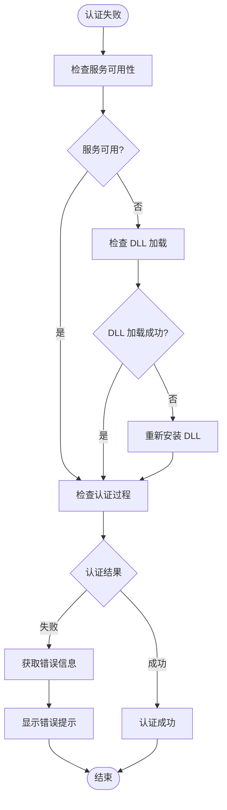

**图表来源**
- [windowsHelloService.ts:89-135](file://electron/services/windowsHelloService.ts#L89-L135)

### 社交网络服务故障排除

#### 数据解析失败处理

| 问题类型 | 症状 | 解决方案 |
|---------|------|---------|
| XML 解析错误 | 数据格式不正确 | 检查数据完整性，重新获取 |
| 媒体下载失败 | 图片或视频无法加载 | 检查网络连接，重试下载 |
| 缓存损坏 | 缓存文件损坏 | 清理缓存目录，重新生成 |
| 数据库连接失败 | 无法访问 SNS 数据库 | 检查数据库文件，重新解密 |

**章节来源**
- [activationService.ts:265-366](file://electron/services/activationService.ts#L265-L366)
- [windowsHelloService.ts:89-135](file://electron/services/windowsHelloService.ts#L89-L135)
- [snsService.ts:1328-1544](file://electron/services/snsService.ts#L1328-L1544)

## 结论

CipherTalk 的系统集成功能展现了现代桌面应用的优秀实践。通过精心设计的架构和完善的错误处理机制，系统实现了：

1. **多层次的安全保障**：从设备绑定到生物识别认证，确保系统的安全性
2. **高效的性能优化**：通过缓存策略和异步处理提升用户体验
3. **完善的故障处理**：全面的错误诊断和恢复机制
4. **良好的扩展性**：模块化的架构便于功能扩展和维护

这些系统集成功能为 CipherTalk 提供了坚实的技术基础，使其能够在复杂的 Windows 环境中稳定运行，并为用户提供了优秀的使用体验。

## 附录

### 系统兼容性说明

#### Windows 版本支持

系统支持以下 Windows 版本：
- Windows 10 (版本 1809 及以上)
- Windows 11 (所有版本)
- Windows Server 2019/2022

#### 权限要求

系统运行需要以下权限：
- 标准用户权限（大部分功能）
- 管理员权限（某些系统集成功能）
- 文件系统访问权限
- 网络访问权限

#### UAC 处理

系统通过以下方式处理 UAC：
- 自动检测 UAC 状态
- 在需要时请求提升权限
- 提供用户友好的权限提示界面
- 支持权限拒绝的优雅降级

### 开发最佳实践

#### 新功能开发指导

1. **遵循现有架构模式**：参考现有服务的设计模式
2. **实现错误处理**：提供完整的错误捕获和处理机制
3. **考虑性能影响**：避免阻塞主线程的操作
4. **测试边界情况**：充分测试各种异常情况
5. **文档化变更**：及时更新相关文档

#### 系统集成开发要点

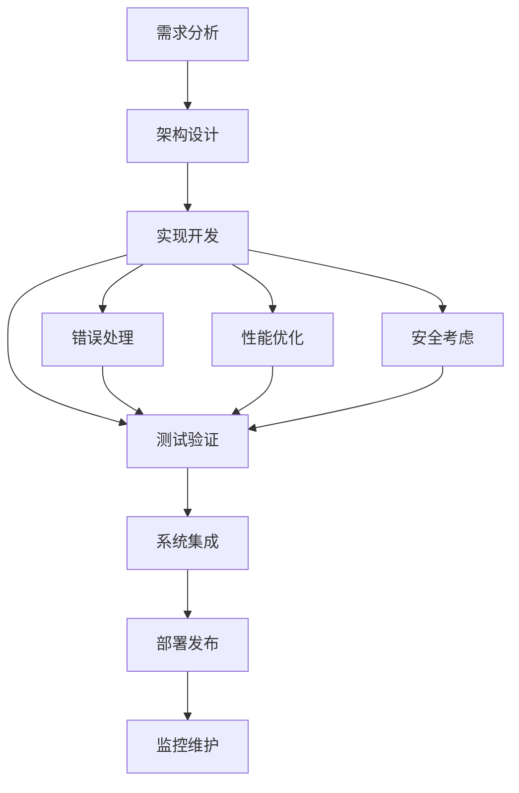

**图表来源**
- [main.ts:1-100](file://electron/main.ts#L1-L100)

#### 故障排除工具

系统提供了以下内置的故障排除工具：
- **日志系统**：详细的日志记录和分析
- **状态监控**：实时监控系统状态
- **诊断工具**：内置的诊断和修复工具
- **错误报告**：自动收集和报告错误信息

**章节来源**
- [main.ts:1-100](file://electron/main.ts#L1-L100)
- [installer.nsh:1-64](file://installer.nsh#L1-L64)
- [package.json:74-169](file://package.json#L74-L169)