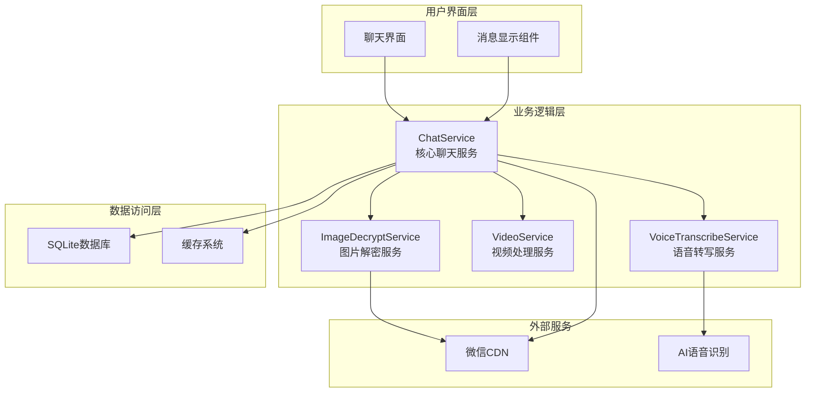
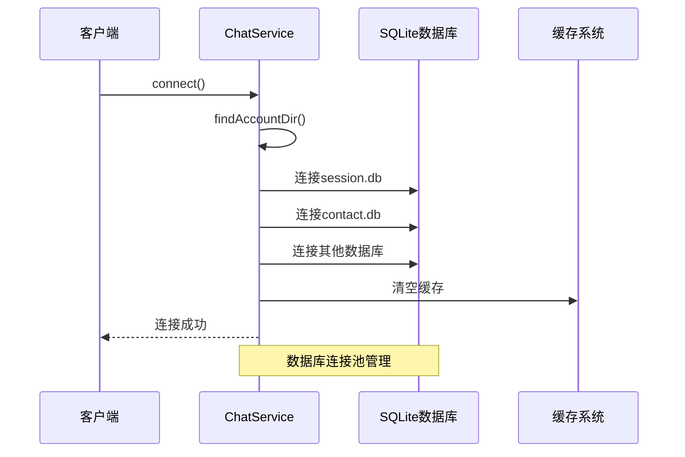
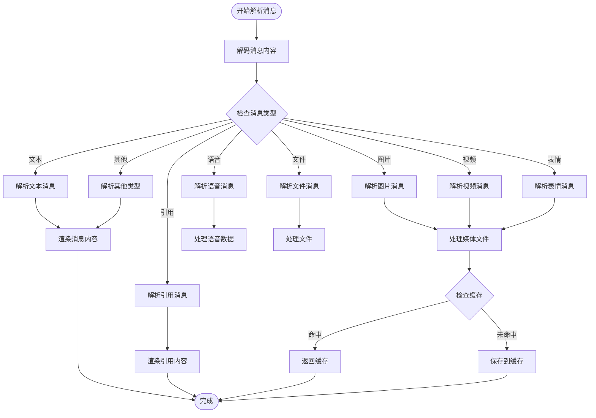
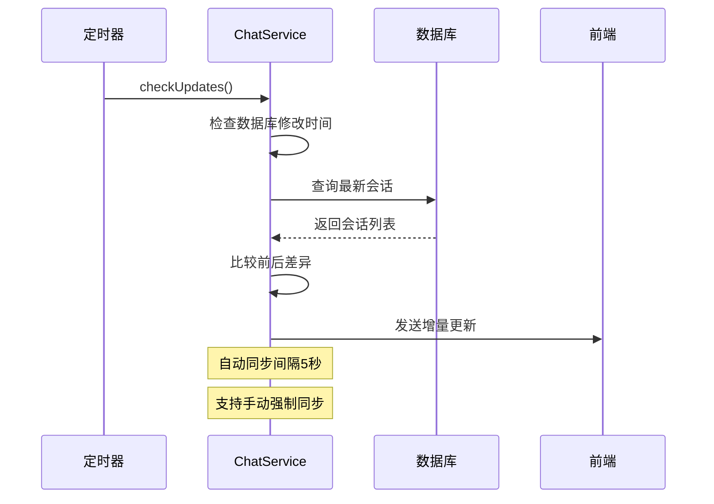
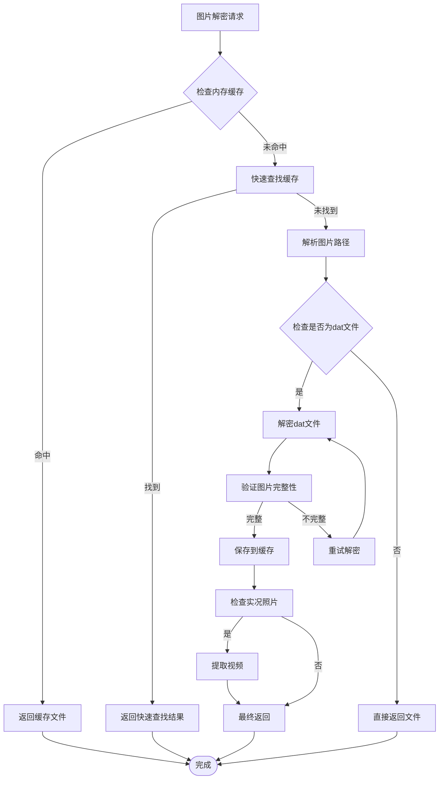
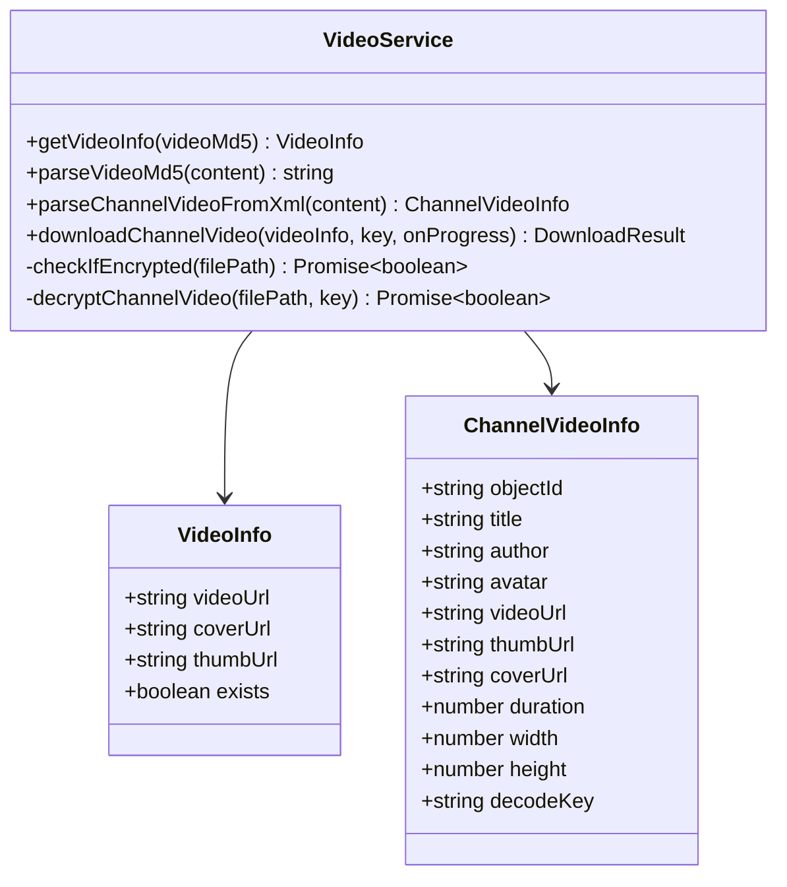
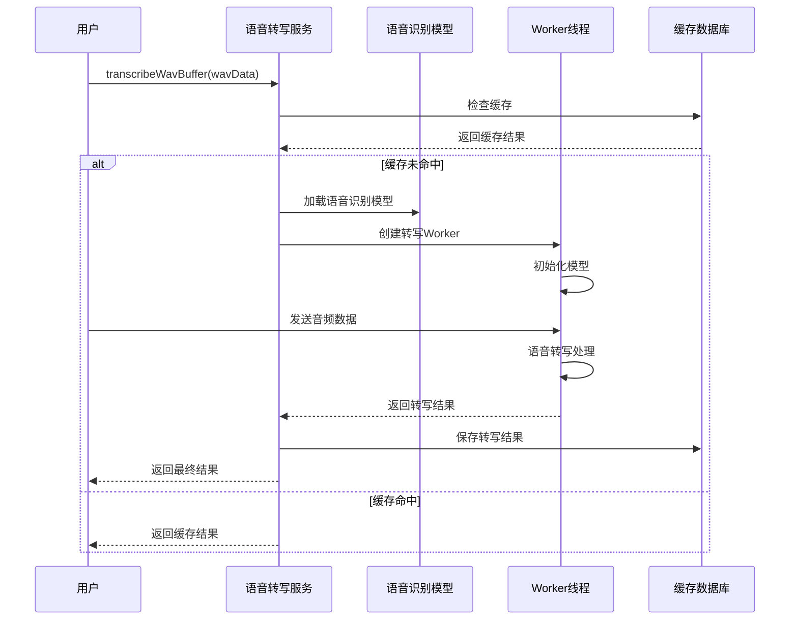
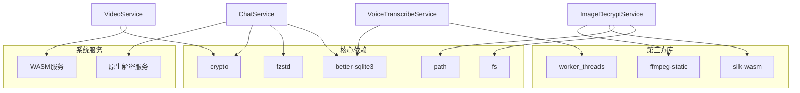
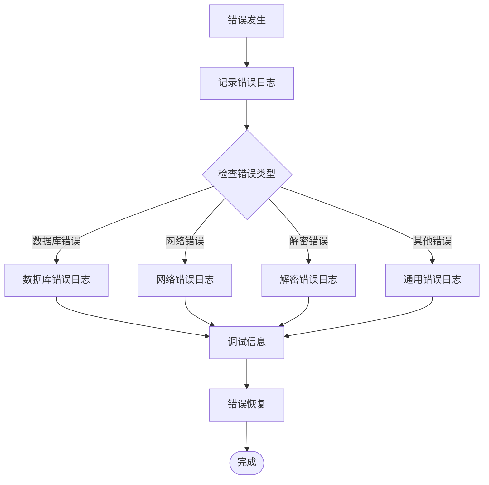

# 聊天数据处理服务

<cite>
**本文档引用的文件**
- [chatService.ts](file://electron/services/chatService.ts)
- [imageDecryptService.ts](file://electron/services/imageDecryptService.ts)
- [videoService.ts](file://electron/services/videoService.ts)
- [voiceTranscribeService.ts](file://electron/services/voiceTranscribeService.ts)
- [decryptService.ts](file://electron/services/decryptService.ts)
</cite>

## 目录
1. [简介](#简介)
2. [项目结构](#项目结构)
3. [核心组件](#核心组件)
4. [架构概览](#架构概览)
5. [详细组件分析](#详细组件分析)
6. [依赖关系分析](#依赖关系分析)
7. [性能考虑](#性能考虑)
8. [故障排除指南](#故障排除指南)
9. [结论](#结论)

## 简介

CipherTalk 的聊天数据处理服务是一个功能完整的微信聊天数据解析和展示系统。该服务负责将加密的微信数据库转换为可显示的聊天界面数据，支持多种消息类型的解析、媒体文件处理、语音转文字等功能。

该服务的核心功能包括：
- 聊天记录解析和消息类型识别
- 媒体文件处理（图片、视频、语音）
- 数据转换流程（原始数据库数据到可显示格式）
- 性能优化策略（批量查询、缓存机制、内存管理）
- 数据完整性保证（数据验证、错误恢复、日志记录）

## 项目结构

聊天数据处理服务主要位于 Electron 应用的 `electron/services` 目录中，包含以下核心文件：

```mermaid
graph TB
subgraph "聊天数据处理服务"
CS[chatService.ts<br/>主聊天服务]
IDS[imageDecryptService.ts<br/>图片解密服务]
VS[videoService.ts<br/>视频处理服务]
VTS[voiceTranscribeService.ts<br/>语音转写服务]
DS[decryptService.ts<br/>数据库解密服务]
end
subgraph "配置服务"
CFG[config.ts<br/>配置管理]
end
subgraph "数据库"
DB[(better-sqlite3)<br/>SQLite数据库]
end
CS --> IDS
CS --> VS
CS --> VTS
CS --> DS
CS --> CFG
CS --> DB
IDS --> DB
VS --> DB
VTS --> DB
```

**图表来源**
- [chatService.ts:110-152](file://electron/services/chatService.ts#L110-152)
- [imageDecryptService.ts:44-54](file://electron/services/imageDecryptService.ts#L44-54)
- [videoService.ts:45-50](file://electron/services/videoService.ts#L45-50)
- [voiceTranscribeService.ts:70-77](file://electron/services/voiceTranscribeService.ts#L70-77)

**章节来源**
- [chatService.ts:1-50](file://electron/services/chatService.ts#L1-50)
- [imageDecryptService.ts:1-50](file://electron/services/imageDecryptService.ts#L1-50)
- [videoService.ts:1-50](file://electron/services/videoService.ts#L1-50)
- [voiceTranscribeService.ts:1-50](file://electron/services/voiceTranscribeService.ts#L1-50)

## 核心组件

### ChatService 主服务

ChatService 是整个聊天数据处理系统的核心，负责协调各个子服务的工作。它提供了以下主要功能：

- **数据库连接管理**：自动连接和管理多个 SQLite 数据库
- **消息解析**：解析各种类型的消息内容
- **媒体文件处理**：协调图片、视频、语音文件的处理
- **缓存机制**：实现多层缓存以提升性能
- **增量同步**：支持实时监控数据库变化

### 图片解密服务

ImageDecryptService 专门处理微信图片的解密和缓存：

- **多格式支持**：支持多种微信图片格式（dat、jpg、webp等）
- **缓存策略**：智能缓存解密后的图片文件
- **实况照片处理**：支持微信实况照片（Motion Photo）
- **格式检测**：自动检测和转换图片格式

### 视频处理服务

VideoService 负责微信视频消息的处理：

- **视频文件查找**：从数据库中定位视频文件
- **视频信息解析**：提取视频元数据和封面
- **视频号内容处理**：支持微信视频号内容的下载和解密
- **加密视频处理**：支持 ISAAC64 加密视频的解密

### 语音转写服务

VoiceTranscribeService 提供语音消息的转写功能：

- **模型管理**：管理 SenseVoice 语音识别模型
- **转写缓存**：缓存转写结果以避免重复计算
- **多语言支持**：支持多种语言的语音转写
- **Worker 线程**：使用独立线程进行语音转写以避免阻塞主线程

**章节来源**
- [chatService.ts:110-152](file://electron/services/chatService.ts#L110-152)
- [imageDecryptService.ts:44-54](file://electron/services/imageDecryptService.ts#L44-54)
- [videoService.ts:45-50](file://electron/services/videoService.ts#L45-50)
- [voiceTranscribeService.ts:70-77](file://electron/services/voiceTranscribeService.ts#L70-77)

## 架构概览

聊天数据处理服务采用模块化架构设计，各组件职责清晰，相互协作：



**图表来源**
- [chatService.ts:1024-1286](file://electron/services/chatService.ts#L1024-1286)
- [imageDecryptService.ts:112-158](file://electron/services/imageDecryptService.ts#L112-158)
- [videoService.ts:194-245](file://electron/services/videoService.ts#L194-245)
- [voiceTranscribeService.ts:368-448](file://electron/services/voiceTranscribeService.ts#L368-448)

## 详细组件分析

### ChatService 核心功能分析

#### 数据库连接和管理

ChatService 实现了智能的数据库连接管理机制：



**图表来源**
- [chatService.ts:283-346](file://electron/services/chatService.ts#L283-346)
- [chatService.ts:351-383](file://electron/services/chatService.ts#L351-383)

#### 消息解析流程

ChatService 的消息解析采用了多阶段处理机制：



**图表来源**
- [chatService.ts:1024-1286](file://electron/services/chatService.ts#L1024-1286)
- [chatService.ts:2097-2170](file://electron/services/chatService.ts#L2097-2170)

#### 增量同步机制

ChatService 实现了高效的增量同步机制：



**图表来源**
- [chatService.ts:4706-4788](file://electron/services/chatService.ts#L4706-4788)

**章节来源**
- [chatService.ts:1024-1558](file://electron/services/chatService.ts#L1024-1558)
- [chatService.ts:4706-4788](file://electron/services/chatService.ts#L4706-4788)

### 图片解密服务详细分析

#### 图片解密流程

ImageDecryptService 提供了完整的图片解密和缓存机制：



**图表来源**
- [imageDecryptService.ts:160-303](file://electron/services/imageDecryptService.ts#L160-303)
- [imageDecryptService.ts:267-298](file://electron/services/imageDecryptService.ts#L267-298)

#### 多格式支持机制

ImageDecryptService 支持多种微信图片格式：

| 格式类型 | 文件扩展名 | 特征 | 处理方式 |
|---------|-----------|------|----------|
| 标准图片 | jpg, jpeg, png, webp | 正常图片格式 | 直接解密 |
| DAT文件 | dat | 微信专用格式 | 解密后转换 |
| 实况照片 | HEVC/H.265 | Motion Photo | 提取视频片段 |
| wxgf格式 | dat | 新版微信格式 | 需要ffmpeg转换 |

**章节来源**
- [imageDecryptService.ts:160-303](file://electron/services/imageDecryptService.ts#L160-303)
- [imageDecryptService.ts:448-505](file://electron/services/imageDecryptService.ts#L448-505)

### 视频处理服务详细分析

#### 视频信息解析

VideoService 提供了全面的视频信息解析功能：



**图表来源**
- [videoService.ts:11-31](file://electron/services/videoService.ts#L11-31)
- [videoService.ts:45-50](file://electron/services/videoService.ts#L45-50)

**章节来源**
- [videoService.ts:194-336](file://electron/services/videoService.ts#L194-336)
- [videoService.ts:499-553](file://electron/services/videoService.ts#L499-553)

### 语音转写服务详细分析

#### 语音转写工作流程

VoiceTranscribeService 实现了完整的语音转写功能：



**图表来源**
- [voiceTranscribeService.ts:368-448](file://electron/services/voiceTranscribeService.ts#L368-448)

**章节来源**
- [voiceTranscribeService.ts:368-448](file://electron/services/voiceTranscribeService.ts#L368-448)
- [voiceTranscribeService.ts:103-137](file://electron/services/voiceTranscribeService.ts#L103-137)

## 依赖关系分析

聊天数据处理服务的依赖关系如下：



**图表来源**
- [chatService.ts:1-10](file://electron/services/chatService.ts#L1-10)
- [imageDecryptService.ts:1-13](file://electron/services/imageDecryptService.ts#L1-13)
- [voiceTranscribeService.ts:1-12](file://electron/services/voiceTranscribeService.ts#L1-12)

**章节来源**
- [chatService.ts:1-10](file://electron/services/chatService.ts#L1-10)
- [imageDecryptService.ts:1-13](file://electron/services/imageDecryptService.ts#L1-13)
- [voiceTranscribeService.ts:1-12](file://electron/services/voiceTranscribeService.ts#L1-12)

## 性能考虑

### 缓存策略

聊天数据处理服务实现了多层次的缓存机制：

1. **内存缓存**：使用 Map 结构缓存频繁访问的数据
2. **文件缓存**：缓存解密后的媒体文件到磁盘
3. **数据库缓存**：缓存数据库连接和查询结果
4. **预编译语句缓存**：避免重复编译 SQL 语句

### 批量查询优化

服务采用了批量查询策略来提升性能：

- **批量消息获取**：每次查询 50-100 条消息，减少数据库往返
- **批量媒体处理**：支持批量解密和缓存媒体文件
- **批量语音转写**：支持批量语音消息的转写

### 内存管理

服务实现了智能的内存管理：

- **连接池管理**：复用数据库连接，避免频繁创建销毁
- **缓存淘汰**：实现 LRU 缓存淘汰策略
- **垃圾回收**：及时释放不再使用的资源

**章节来源**
- [chatService.ts:805-832](file://electron/services/chatService.ts#L805-832)
- [chatService.ts:1024-1286](file://electron/services/chatService.ts#L1024-1286)
- [imageDecryptService.ts:56-110](file://electron/services/imageDecryptService.ts#L56-110)

## 故障排除指南

### 常见问题及解决方案

#### 数据库连接问题

**问题症状**：无法连接到微信数据库
**可能原因**：
- 数据库路径配置错误
- 数据库文件损坏
- 权限不足

**解决方案**：
1. 检查数据库路径配置
2. 验证数据库文件完整性
3. 确认应用程序权限

#### 图片解密失败

**问题症状**：图片无法正常显示
**可能原因**：
- 图片格式不支持
- 解密密钥错误
- 缓存文件损坏

**解决方案**：
1. 检查图片格式支持情况
2. 验证解密密钥配置
3. 清理图片缓存重新生成

#### 语音转写异常

**问题症状**：语音消息无法转写
**可能原因**：
- 语音识别模型未下载
- Worker 线程异常
- 音频格式不支持

**解决方案**：
1. 下载语音识别模型
2. 重启 Worker 线程
3. 检查音频格式兼容性

### 日志记录和调试

服务提供了详细的日志记录机制：



**图表来源**
- [chatService.ts:1235-1247](file://electron/services/chatService.ts#L1235-1247)
- [imageDecryptService.ts:299-302](file://electron/services/imageDecryptService.ts#L299-302)

**章节来源**
- [chatService.ts:1235-1247](file://electron/services/chatService.ts#L1235-1247)
- [imageDecryptService.ts:299-302](file://electron/services/imageDecryptService.ts#L299-302)

## 结论

CipherTalk 的聊天数据处理服务是一个功能完善、性能优异的聊天数据解析系统。通过模块化的架构设计和多层次的优化策略，该服务能够高效地处理各种类型的微信聊天数据。

主要特点包括：

1. **完整的功能覆盖**：支持所有主要的微信消息类型和媒体格式
2. **高性能设计**：通过缓存、批量处理、连接池等技术提升性能
3. **健壮的错误处理**：完善的错误捕获和恢复机制
4. **灵活的扩展性**：模块化设计便于功能扩展和维护

该服务为用户提供了流畅的聊天数据浏览体验，是 CipherTalk 应用程序的核心基础设施。