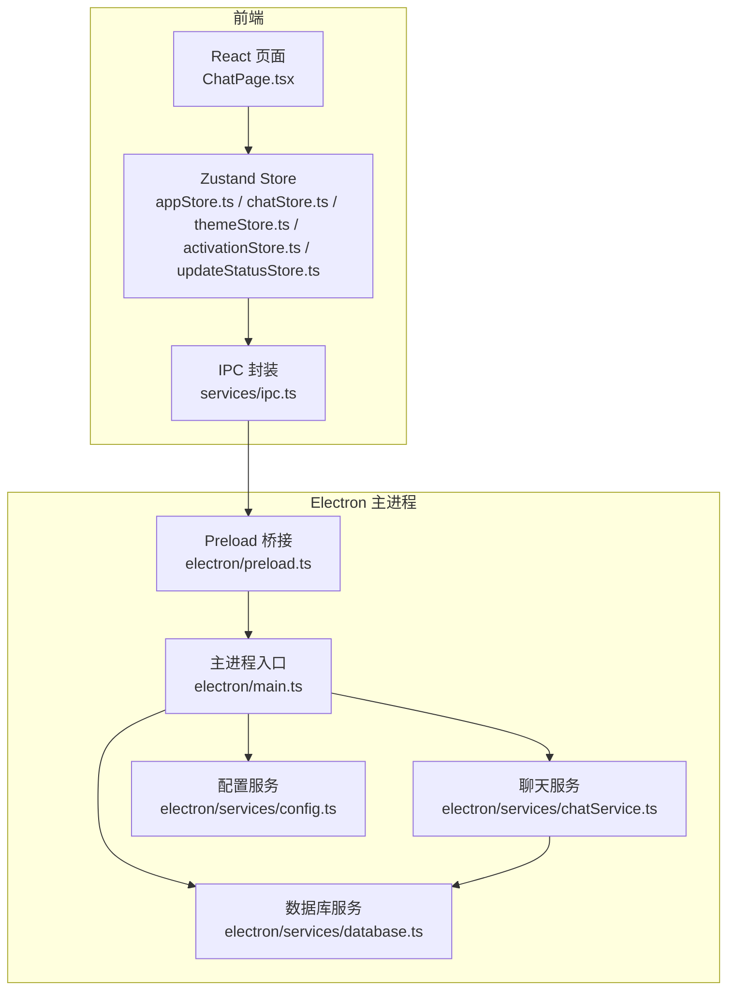
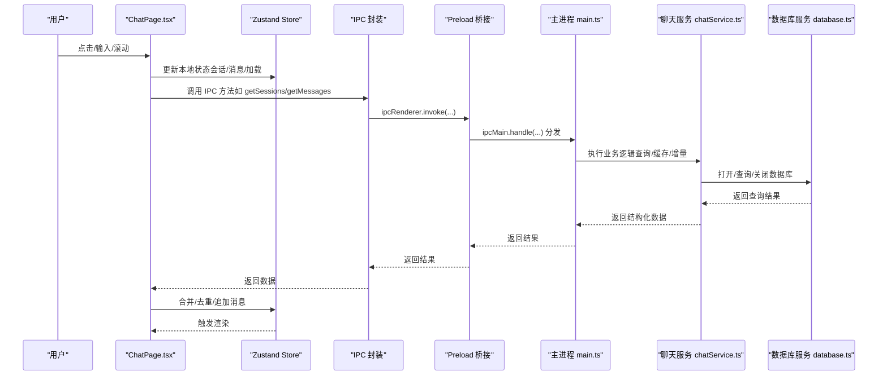
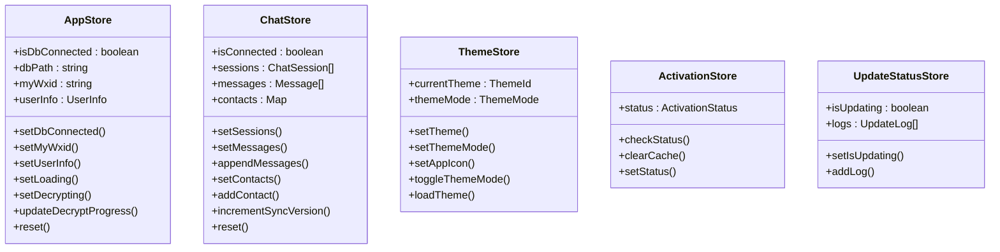
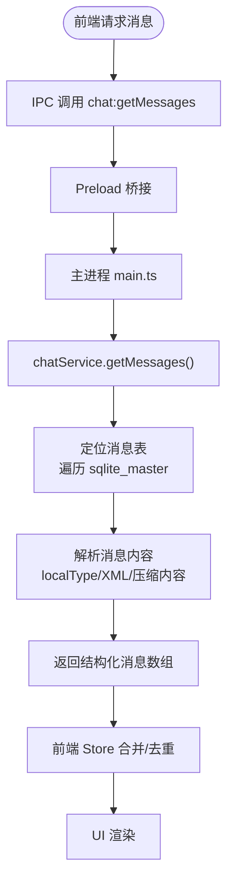
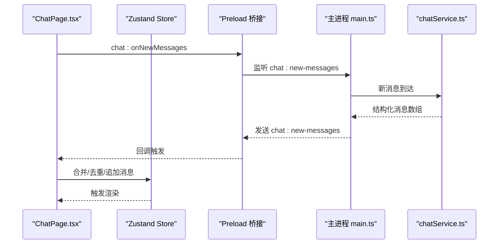
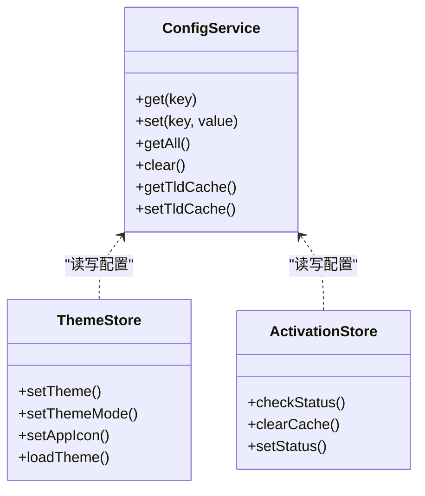
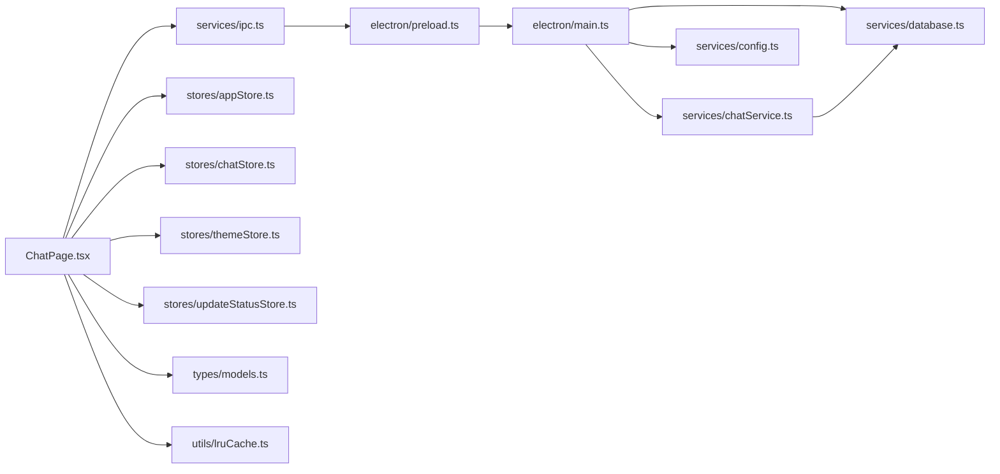

# 数据流设计

<cite>
**本文档引用的文件**
- [src/stores/appStore.ts](file://src/stores/appStore.ts)
- [src/stores/chatStore.ts](file://src/stores/chatStore.ts)
- [src/stores/themeStore.ts](file://src/stores/themeStore.ts)
- [src/stores/activationStore.ts](file://src/stores/activationStore.ts)
- [src/stores/updateStatusStore.ts](file://src/stores/updateStatusStore.ts)
- [src/services/ipc.ts](file://src/services/ipc.ts)
- [src/services/database.ts](file://src/services/database.ts)
- [src/pages/ChatPage.tsx](file://src/pages/ChatPage.tsx)
- [src/types/models.ts](file://src/types/models.ts)
- [src/utils/lruCache.ts](file://src/utils/lruCache.ts)
- [electron/preload.ts](file://electron/preload.ts)
- [electron/main.ts](file://electron/main.ts)
- [electron/services/database.ts](file://electron/services/database.ts)
- [electron/services/chatService.ts](file://electron/services/chatService.ts)
- [electron/services/config.ts](file://electron/services/config.ts)
</cite>

## 目录
1. [简介](#简介)
2. [项目结构](#项目结构)
3. [核心组件](#核心组件)
4. [架构总览](#架构总览)
5. [详细组件分析](#详细组件分析)
6. [依赖关系分析](#依赖关系分析)
7. [性能考虑](#性能考虑)
8. [故障排除指南](#故障排除指南)
9. [结论](#结论)

## 简介
本文件为 CipherTalk 的数据流设计文档，围绕“用户操作 → 前端状态管理 → 主进程服务调用 → 数据库查询 → UI 渲染”的完整闭环展开，重点覆盖以下方面：
- 数据流路径：从用户点击、输入到状态更新、IPC 通信、数据库访问与 UI 响应的全流程
- 状态管理设计：Zustand Store 的数据流控制、状态更新机制、副作用处理
- 数据持久化策略：配置数据存储、用户偏好设置、应用状态保存
- 数据验证与转换：输入数据的校验、数据格式转换、错误数据处理
- 性能优化策略：数据缓存、批量操作、增量更新
- 数据流图与时序图：直观展示组件间的数据传递与处理过程

## 项目结构
项目采用前端（React + Zustand）与 Electron 主进程分离的架构，通过 IPC 通道进行跨进程通信。前端负责 UI 与状态管理，主进程负责数据库访问、系统服务与资源管理。

**图表来源**
- [src/pages/ChatPage.tsx:1-800](file://src/pages/ChatPage.tsx#L1-800)
- [src/stores/appStore.ts:1-97](file://src/stores/appStore.ts#L1-97)
- [src/stores/chatStore.ts:1-146](file://src/stores/chatStore.ts#L1-146)
- [src/stores/themeStore.ts:1-146](file://src/stores/themeStore.ts#L1-146)
- [src/stores/activationStore.ts:1-45](file://src/stores/activationStore.ts#L1-45)
- [src/stores/updateStatusStore.ts:1-28](file://src/stores/updateStatusStore.ts#L1-28)
- [src/services/ipc.ts:1-38](file://src/services/ipc.ts#L1-38)
- [electron/preload.ts:1-454](file://electron/preload.ts#L1-454)
- [electron/main.ts:1-800](file://electron/main.ts#L1-800)
- [electron/services/chatService.ts:1-800](file://electron/services/chatService.ts#L1-800)
- [electron/services/database.ts:1-83](file://electron/services/database.ts#L1-83)
- [electron/services/config.ts:1-395](file://electron/services/config.ts#L1-395)

**章节来源**
- [src/pages/ChatPage.tsx:1-800](file://src/pages/ChatPage.tsx#L1-800)
- [electron/main.ts:1-800](file://electron/main.ts#L1-800)

## 核心组件
- Zustand Store：集中管理应用状态，包括数据库连接、用户信息、加载状态、解密进度、聊天会话与消息、主题与激活状态等
- IPC 封装：统一前端与主进程之间的调用接口，屏蔽底层 IPC 细节
- 主进程服务：
  - 配置服务：基于 SQLite 的键值配置存储，支持默认值、迁移与缓存
  - 数据库服务：面向解密后的数据库读取
  - 聊天服务：会话、联系人、消息的查询与缓存、增量同步、消息表定位
- 前端页面与组件：ChatPage 负责会话与消息加载、搜索、日期跳转、批量操作等交互，并通过 Store 与 IPC 完成数据流转

**章节来源**
- [src/stores/appStore.ts:1-97](file://src/stores/appStore.ts#L1-97)
- [src/stores/chatStore.ts:1-146](file://src/stores/chatStore.ts#L1-146)
- [src/stores/themeStore.ts:1-146](file://src/stores/themeStore.ts#L1-146)
- [src/stores/activationStore.ts:1-45](file://src/stores/activationStore.ts#L1-45)
- [src/stores/updateStatusStore.ts:1-28](file://src/stores/updateStatusStore.ts#L1-28)
- [src/services/ipc.ts:1-38](file://src/services/ipc.ts#L1-38)
- [electron/services/config.ts:1-395](file://electron/services/config.ts#L1-395)
- [electron/services/database.ts:1-83](file://electron/services/database.ts#L1-83)
- [electron/services/chatService.ts:1-800](file://electron/services/chatService.ts#L1-800)

## 架构总览
下图展示了从用户操作到 UI 渲染的完整数据流：

**图表来源**
- [src/pages/ChatPage.tsx:375-585](file://src/pages/ChatPage.tsx#L375-585)
- [src/services/ipc.ts:1-38](file://src/services/ipc.ts#L1-38)
- [electron/preload.ts:1-454](file://electron/preload.ts#L1-454)
- [electron/main.ts:1-800](file://electron/main.ts#L1-800)
- [electron/services/chatService.ts:1-800](file://electron/services/chatService.ts#L1-800)
- [electron/services/database.ts:1-83](file://electron/services/database.ts#L1-83)

## 详细组件分析

### Zustand Store 设计与数据流控制
- 应用状态（appStore）：管理数据库连接、用户信息、加载与解密进度等全局状态，提供原子级 setter 与重置方法
- 聊天状态（chatStore）：管理会话列表、消息列表、联系人缓存、搜索关键字、同步版本号等；提供去重合并、批量追加、增量版本号等能力
- 主题与激活（themeStore/activationStore）：主题与图标持久化到配置服务，激活状态通过 IPC 查询与缓存
- 更新状态（updateStatusStore）：维护更新指示与日志队列，用于 UI 展示

**图表来源**
- [src/stores/appStore.ts:1-97](file://src/stores/appStore.ts#L1-97)
- [src/stores/chatStore.ts:1-146](file://src/stores/chatStore.ts#L1-146)
- [src/stores/themeStore.ts:1-146](file://src/stores/themeStore.ts#L1-146)
- [src/stores/activationStore.ts:1-45](file://src/stores/activationStore.ts#L1-45)
- [src/stores/updateStatusStore.ts:1-28](file://src/stores/updateStatusStore.ts#L1-28)

**章节来源**
- [src/stores/appStore.ts:1-97](file://src/stores/appStore.ts#L1-97)
- [src/stores/chatStore.ts:1-146](file://src/stores/chatStore.ts#L1-146)
- [src/stores/themeStore.ts:1-146](file://src/stores/themeStore.ts#L1-146)
- [src/stores/activationStore.ts:1-45](file://src/stores/activationStore.ts#L1-45)
- [src/stores/updateStatusStore.ts:1-28](file://src/stores/updateStatusStore.ts#L1-28)

### 数据库查询与消息解析流程
- 前端通过 IPC 封装调用主进程的聊天服务，获取会话列表、联系人、消息等
- 主进程聊天服务根据配置定位解密后的数据库目录，连接 session/contact/emoticon/head_image 等数据库
- 通过消息表定位算法（遍历 sqlite_master 查找包含消息的表），确定具体消息表
- 解析消息内容：根据 localType 与 XML/压缩内容提取文本、图片、语音、视频、表情、位置等字段
- 返回结构化数据给前端，前端 Store 合并与去重，驱动 UI 渲染

**图表来源**
- [src/services/database.ts:1-243](file://src/services/database.ts#L1-243)
- [electron/services/chatService.ts:1-800](file://electron/services/chatService.ts#L1-800)
- [electron/services/database.ts:1-83](file://electron/services/database.ts#L1-83)

**章节来源**
- [src/services/database.ts:1-243](file://src/services/database.ts#L1-243)
- [electron/services/chatService.ts:1-800](file://electron/services/chatService.ts#L1-800)
- [electron/services/database.ts:1-83](file://electron/services/database.ts#L1-83)

### 增量更新与自动同步
- 前端监听 chat:new-messages 事件，基于多维 Key（serverId + localId + createTime + sortSeq）进行去重
- 主进程聊天服务维护当前会话游标（sortSeq），仅推送新增消息
- 前端在用户位于底部附近时自动滚动，避免打断用户阅读

**图表来源**
- [src/pages/ChatPage.tsx:542-585](file://src/pages/ChatPage.tsx#L542-585)
- [electron/preload.ts:282-286](file://electron/preload.ts#L282-286)
- [electron/services/chatService.ts:140-160](file://electron/services/chatService.ts#L140-160)

**章节来源**
- [src/pages/ChatPage.tsx:542-585](file://src/pages/ChatPage.tsx#L542-585)
- [electron/preload.ts:282-286](file://electron/preload.ts#L282-286)
- [electron/services/chatService.ts:140-160](file://electron/services/chatService.ts#L140-160)

### 数据持久化策略
- 配置数据存储：主进程配置服务使用 SQLite 存储键值配置，包含默认值初始化、迁移与缓存（TLD 缓存）
- 用户偏好设置：主题、主题模式、应用图标、语言、STT 模型与模式等通过配置服务持久化
- 应用状态保存：Store 状态主要驻留在内存，部分状态（如主题、激活状态）通过 IPC 与配置服务联动

**图表来源**
- [electron/services/config.ts:1-395](file://electron/services/config.ts#L1-395)
- [src/stores/themeStore.ts:1-146](file://src/stores/themeStore.ts#L1-146)
- [src/stores/activationStore.ts:1-45](file://src/stores/activationStore.ts#L1-45)

**章节来源**
- [electron/services/config.ts:1-395](file://electron/services/config.ts#L1-395)
- [src/stores/themeStore.ts:1-146](file://src/stores/themeStore.ts#L1-146)
- [src/stores/activationStore.ts:1-45](file://src/stores/activationStore.ts#L1-45)

### 数据验证与转换
- 输入数据校验：前端对会话与消息进行去重校验（多维 Key），避免重复渲染
- 数据格式转换：消息内容解析（localType 与 XML/压缩内容），提取图片 MD5、表情 CDN URL、语音时长等
- 错误数据处理：数据库未打开、查询异常、头像加载失败等均有相应错误分支与降级处理

**章节来源**
- [src/stores/chatStore.ts:89-110](file://src/stores/chatStore.ts#L89-110)
- [src/services/database.ts:123-203](file://src/services/database.ts#L123-203)
- [src/pages/ChatPage.tsx:105-123](file://src/pages/ChatPage.tsx#L105-123)

## 依赖关系分析
- 前端依赖关系：页面依赖 Store 与 IPC 封装；Store 依赖模型类型；工具类提供缓存与解析
- 主进程依赖关系：主进程依赖配置服务与聊天服务；聊天服务依赖数据库服务；Preload 暴露统一 API

**图表来源**
- [src/pages/ChatPage.tsx:1-800](file://src/pages/ChatPage.tsx#L1-800)
- [src/services/ipc.ts:1-38](file://src/services/ipc.ts#L1-38)
- [electron/preload.ts:1-454](file://electron/preload.ts#L1-454)
- [electron/main.ts:1-800](file://electron/main.ts#L1-800)
- [electron/services/chatService.ts:1-800](file://electron/services/chatService.ts#L1-800)
- [electron/services/database.ts:1-83](file://electron/services/database.ts#L1-83)
- [electron/services/config.ts:1-395](file://electron/services/config.ts#L1-395)
- [src/stores/appStore.ts:1-97](file://src/stores/appStore.ts#L1-97)
- [src/stores/chatStore.ts:1-146](file://src/stores/chatStore.ts#L1-146)
- [src/stores/themeStore.ts:1-146](file://src/stores/themeStore.ts#L1-146)
- [src/stores/updateStatusStore.ts:1-28](file://src/stores/updateStatusStore.ts#L1-28)
- [src/types/models.ts:1-109](file://src/types/models.ts#L1-109)
- [src/utils/lruCache.ts:1-51](file://src/utils/lruCache.ts#L1-51)

**章节来源**
- [src/pages/ChatPage.tsx:1-800](file://src/pages/ChatPage.tsx#L1-800)
- [electron/main.ts:1-800](file://electron/main.ts#L1-800)

## 性能考虑
- 数据缓存
  - 会话表与消息表缓存：聊天服务维护会话表缓存、消息数据库缓存、SQL 预编译语句缓存、头像 Base64 缓存
  - LRU 缓存：LRU 缓存限制内存占用，避免长期运行导致内存膨胀
- 批量操作
  - 批量语音转文字与批量图片解密：前端提供批量确认与进度展示，减少用户交互成本
- 增量更新
  - 增量消息推送：基于游标（sortSeq）与事件订阅，仅推送新增消息，降低网络与渲染压力
- 渲染优化
  - 会话列表与消息列表使用虚拟化（react-window）与智能合并更新，避免不必要的重渲染

**章节来源**
- [electron/services/chatService.ts:110-152](file://electron/services/chatService.ts#L110-152)
- [src/utils/lruCache.ts:1-51](file://src/utils/lruCache.ts#L1-51)
- [src/pages/ChatPage.tsx:302-322](file://src/pages/ChatPage.tsx#L302-322)

## 故障排除指南
- 数据库未连接
  - 现象：无法加载会话或消息，提示未找到数据库
  - 排查：确认配置中的 myWxid 与解密目录路径正确，检查解密流程是否完成
- 查询异常
  - 现象：查询失败或返回空数据
  - 排查：检查消息表定位逻辑、表是否存在、SQL 语法与参数
- 头像加载失败
  - 现象：头像骨架屏长时间不消失
  - 排查：检查头像 URL、缓存状态与懒加载逻辑
- 增量消息未推送
  - 现象：新消息未出现在界面
  - 排查：确认 setCurrentSession 设置、事件监听与去重逻辑

**章节来源**
- [electron/services/chatService.ts:280-346](file://electron/services/chatService.ts#L280-346)
- [src/services/database.ts:102-121](file://src/services/database.ts#L102-121)
- [src/pages/ChatPage.tsx:105-123](file://src/pages/ChatPage.tsx#L105-123)
- [electron/services/chatService.ts:140-160](file://electron/services/chatService.ts#L140-160)

## 结论
CipherTalk 的数据流设计以 Zustand Store 为核心，结合 IPC 与主进程服务，实现了从前端交互到数据库查询再到 UI 渲染的高效闭环。通过缓存、增量更新与批量操作等策略，系统在保证用户体验的同时兼顾性能与稳定性。建议持续关注配置迁移、消息解析健壮性与缓存一致性，以进一步提升系统的可维护性与可靠性。