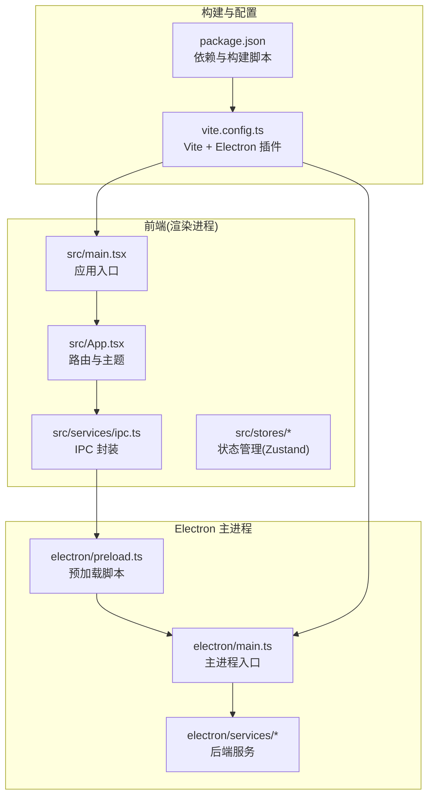
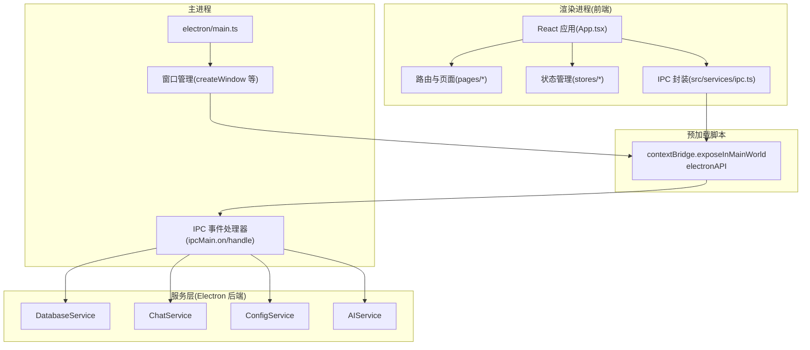
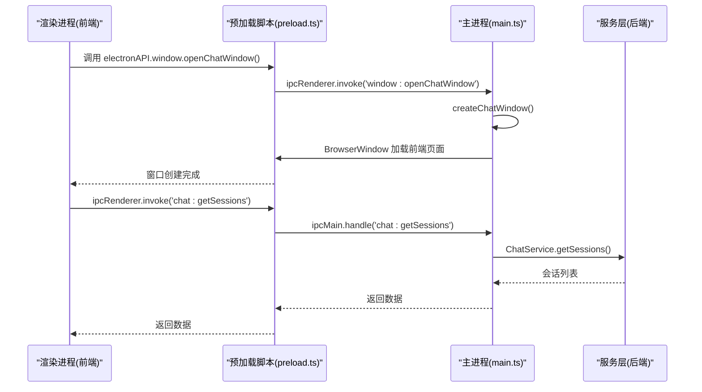
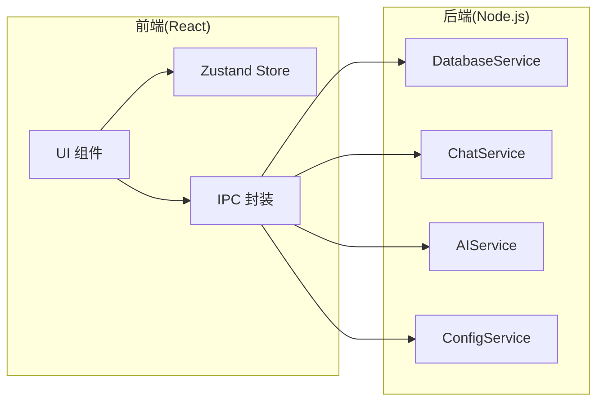
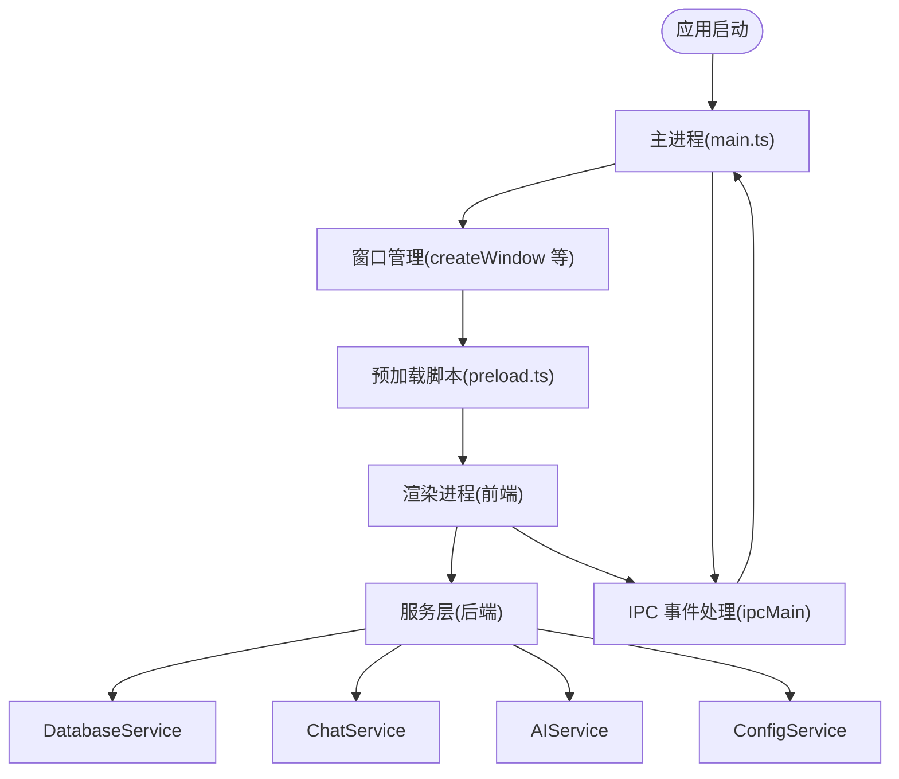
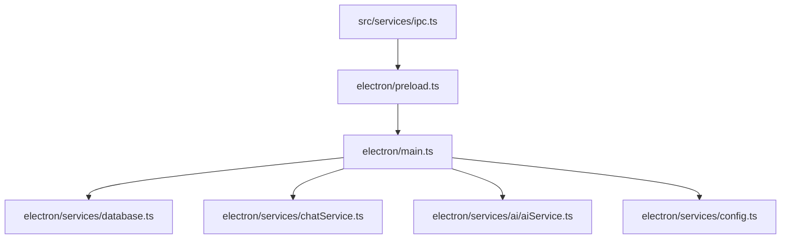

# 整体架构概览

<cite>
**本文档引用的文件**
- [electron/main.ts](file://electron/main.ts)
- [electron/preload.ts](file://electron/preload.ts)
- [src/main.tsx](file://src/main.tsx)
- [src/App.tsx](file://src/App.tsx)
- [src/services/ipc.ts](file://src/services/ipc.ts)
- [electron/services/database.ts](file://electron/services/database.ts)
- [electron/services/chatService.ts](file://electron/services/chatService.ts)
- [electron/services/config.ts](file://electron/services/config.ts)
- [electron/services/ai/aiService.ts](file://electron/services/ai/aiService.ts)
- [src/stores/appStore.ts](file://src/stores/appStore.ts)
- [vite.config.ts](file://vite.config.ts)
- [package.json](file://package.json)
- [README.md](file://README.md)
</cite>

## 目录
1. [简介](#简介)
2. [项目结构](#项目结构)
3. [核心组件](#核心组件)
4. [架构总览](#架构总览)
5. [详细组件分析](#详细组件分析)
6. [依赖关系分析](#依赖关系分析)
7. [性能考虑](#性能考虑)
8. [故障排除指南](#故障排除指南)
9. [结论](#结论)

## 简介
CipherTalk 是一款基于 Electron 的桌面应用，专注于微信聊天记录的查看、分析与导出。系统采用双进程架构：主进程负责系统级操作与窗口管理，渲染进程负责用户界面展示；前后端分离架构：前端使用 React + TypeScript 提供丰富的用户交互体验，后端使用 Node.js + TypeScript 处理数据逻辑。系统边界清晰：主进程边界、渲染进程边界、服务层边界。本文档旨在帮助开发者快速理解整个系统的组织结构与设计思想。

## 项目结构
项目采用模块化组织方式，分为前端源码、Electron 主进程与服务层、静态资源与构建配置等部分。前端使用 React + TypeScript + Zustand 状态管理，Electron 主进程负责窗口生命周期、系统托盘、IPC 通信与系统集成；服务层提供数据库访问、聊天数据解析、AI 摘要、语音转文字、图片解密等功能。

**图表来源**
- [src/main.tsx:1-14](file://src/main.tsx#L1-L14)
- [src/App.tsx:1-200](file://src/App.tsx#L1-L200)
- [src/services/ipc.ts:1-38](file://src/services/ipc.ts#L1-L38)
- [electron/main.ts:1-800](file://electron/main.ts#L1-L800)
- [electron/preload.ts:1-454](file://electron/preload.ts#L1-L454)
- [vite.config.ts:1-78](file://vite.config.ts#L1-L78)
- [package.json:1-169](file://package.json#L1-L169)

**章节来源**
- [README.md:132-159](file://README.md#L132-L159)
- [package.json:1-169](file://package.json#L1-L169)
- [vite.config.ts:1-78](file://vite.config.ts#L1-L78)

## 核心组件
- Electron 主进程：负责应用生命周期、窗口创建与管理、系统托盘、协议注册、自动更新、IPC 事件处理等。
- 预加载脚本：通过 contextBridge 暴露受控 API 给渲染进程，实现安全的 IPC 通道。
- 前端应用：React + TypeScript + Zustand，负责路由、主题、状态管理与 UI 交互。
- 服务层：数据库服务、聊天服务、配置服务、AI 服务等，提供业务能力与数据处理。
- 构建系统：Vite + electron-builder + 插件链路，支持热重载与打包。

**章节来源**
- [electron/main.ts:1-800](file://electron/main.ts#L1-L800)
- [electron/preload.ts:1-454](file://electron/preload.ts#L1-L454)
- [src/main.tsx:1-14](file://src/main.tsx#L1-L14)
- [src/App.tsx:1-200](file://src/App.tsx#L1-L200)
- [vite.config.ts:1-78](file://vite.config.ts#L1-L78)

## 架构总览
系统采用 Electron 双进程架构，结合前后端分离的设计理念，形成清晰的职责边界与通信机制。主进程负责系统级能力与窗口管理，渲染进程负责 UI 展示与用户交互；通过预加载脚本建立受控的 IPC 通道，实现前端对后端服务的安全调用。

**图表来源**
- [src/App.tsx:1-200](file://src/App.tsx#L1-L200)
- [src/services/ipc.ts:1-38](file://src/services/ipc.ts#L1-L38)
- [electron/preload.ts:1-454](file://electron/preload.ts#L1-L454)
- [electron/main.ts:1363-1408](file://electron/main.ts#L1363-L1408)
- [electron/services/database.ts:1-83](file://electron/services/database.ts#L1-L83)
- [electron/services/chatService.ts:1-200](file://electron/services/chatService.ts#L1-L200)
- [electron/services/config.ts:1-200](file://electron/services/config.ts#L1-L200)
- [electron/services/ai/aiService.ts:1-200](file://electron/services/ai/aiService.ts#L1-L200)

## 详细组件分析

### Electron 双进程架构设计
- 主进程职责
  - 应用生命周期管理与自动更新
  - 窗口创建与管理（主窗口、聊天窗口、朋友圈窗口、年度报告窗口等）
  - 系统托盘与菜单
  - 自定义协议注册与网络请求
  - IPC 事件处理与后端服务协调
- 预加载脚本职责
  - 通过 contextBridge 暴露受控 API（electronAPI）
  - 统一封装 IPC 调用，提供类型安全的接口
  - 同步主题配置到 localStorage
- 渲染进程职责
  - React 应用入口与路由
  - 页面组件与 UI 交互
  - 状态管理与主题切换
  - 通过 IPC 封装调用后端服务

**图表来源**
- [electron/preload.ts:71-106](file://electron/preload.ts#L71-L106)
- [electron/main.ts:286-355](file://electron/main.ts#L286-L355)
- [electron/services/chatService.ts:1-200](file://electron/services/chatService.ts#L1-L200)

**章节来源**
- [electron/main.ts:193-281](file://electron/main.ts#L193-L281)
- [electron/preload.ts:1-454](file://electron/preload.ts#L1-L454)

### 前后端分离架构优势
- 前端优势
  - React + TypeScript 提供强类型与组件化开发体验
  - Zustand 状态管理简化状态流转
  - 路由与页面组件清晰分离
- 后端优势
  - Node.js + TypeScript 提供类型安全的后端逻辑
  - better-sqlite3 等高性能数据库驱动
  - 服务层抽象复杂业务逻辑（聊天解析、AI 摘要、语音转文字等）

**图表来源**
- [src/App.tsx:1-200](file://src/App.tsx#L1-L200)
- [src/stores/appStore.ts:1-97](file://src/stores/appStore.ts#L1-L97)
- [src/services/ipc.ts:1-38](file://src/services/ipc.ts#L1-L38)
- [electron/services/database.ts:1-83](file://electron/services/database.ts#L1-L83)
- [electron/services/chatService.ts:1-200](file://electron/services/chatService.ts#L1-L200)
- [electron/services/ai/aiService.ts:1-200](file://electron/services/ai/aiService.ts#L1-L200)
- [electron/services/config.ts:1-200](file://electron/services/config.ts#L1-L200)

**章节来源**
- [README.md:76-89](file://README.md#L76-L89)
- [src/stores/appStore.ts:1-97](file://src/stores/appStore.ts#L1-L97)

### 系统边界划分
- 主进程边界
  - 窗口生命周期与系统托盘
  - 自定义协议与网络请求
  - IPC 事件处理与后端服务协调
- 渲染进程边界
  - UI 组件与路由
  - 状态管理与主题切换
  - 通过 IPC 封装调用后端服务
- 服务层边界
  - 数据库访问与查询
  - 聊天数据解析与缓存
  - AI 摘要与语音转文字
  - 配置管理与持久化

**图表来源**
- [electron/main.ts:1-800](file://electron/main.ts#L1-L800)
- [electron/preload.ts:1-454](file://electron/preload.ts#L1-L454)
- [src/App.tsx:1-200](file://src/App.tsx#L1-L200)
- [electron/services/database.ts:1-83](file://electron/services/database.ts#L1-L83)
- [electron/services/chatService.ts:1-200](file://electron/services/chatService.ts#L1-L200)
- [electron/services/ai/aiService.ts:1-200](file://electron/services/ai/aiService.ts#L1-L200)
- [electron/services/config.ts:1-200](file://electron/services/config.ts#L1-L200)

**章节来源**
- [electron/main.ts:1-800](file://electron/main.ts#L1-L800)
- [electron/preload.ts:1-454](file://electron/preload.ts#L1-L454)

### 架构决策的技术考量
- 选择 Electron 的原因
  - 跨平台桌面应用开发，统一代码库
  - 基于 Chromium 与 Node.js，生态成熟
  - 适合需要系统级集成与窗口管理的应用
- 选择 React 的原因
  - 组件化开发，便于维护与复用
  - TypeScript 提供强类型保障
  - 生态丰富，社区支持良好
- 选择 Node.js + TypeScript 的原因
  - 与 Electron 主进程天然契合
  - 类型安全提升代码质量
  - better-sqlite3 等高性能库满足性能需求

**章节来源**
- [README.md:76-89](file://README.md#L76-L89)
- [package.json:1-169](file://package.json#L1-L169)

## 依赖关系分析
系统依赖关系围绕 IPC 通信展开，前端通过 IPC 封装调用后端服务，后端服务通过 better-sqlite3 等库访问数据库与执行业务逻辑。

**图表来源**
- [src/services/ipc.ts:1-38](file://src/services/ipc.ts#L1-L38)
- [electron/preload.ts:1-454](file://electron/preload.ts#L1-L454)
- [electron/main.ts:1-800](file://electron/main.ts#L1-L800)
- [electron/services/database.ts:1-83](file://electron/services/database.ts#L1-L83)
- [electron/services/chatService.ts:1-200](file://electron/services/chatService.ts#L1-L200)
- [electron/services/ai/aiService.ts:1-200](file://electron/services/ai/aiService.ts#L1-L200)
- [electron/services/config.ts:1-200](file://electron/services/config.ts#L1-L200)

**章节来源**
- [src/services/ipc.ts:1-38](file://src/services/ipc.ts#L1-L38)
- [electron/preload.ts:1-454](file://electron/preload.ts#L1-L454)
- [electron/main.ts:1363-1408](file://electron/main.ts#L1363-L1408)

## 性能考虑
- 数据库访问
  - 使用 better-sqlite3 提供高性能 SQLite 访问
  - 预编译 SQL 语句与缓存策略减少重复解析开销
- 窗口管理
  - 窗口懒加载与按需创建，避免不必要的资源消耗
  - 主题参数透传，减少窗口闪烁
- IPC 通信
  - 预加载脚本集中暴露 API，降低通信开销
  - 事件监听器及时清理，避免内存泄漏
- 构建优化
  - Vite 提供快速开发体验与热重载
  - electron-builder 优化打包体积与发布流程

[本节为通用性能指导，无需特定文件引用]

## 故障排除指南
- 窗口无法创建或显示异常
  - 检查主进程窗口创建逻辑与 webPreferences 配置
  - 确认预加载脚本正确注入并暴露 API
- IPC 调用失败
  - 确认 ipcMain.handle 与 ipcRenderer.invoke 的配对使用
  - 检查预加载脚本中 electronAPI 的暴露范围
- 数据库连接问题
  - 确认 DatabaseService 的 open/close 生命周期
  - 检查数据库路径与权限
- 主题切换异常
  - 确认 ConfigService 的配置读取与主题同步
  - 检查 localStorage 的可用性

**章节来源**
- [electron/main.ts:193-281](file://electron/main.ts#L193-L281)
- [electron/preload.ts:1-454](file://electron/preload.ts#L1-L454)
- [electron/services/database.ts:1-83](file://electron/services/database.ts#L1-L83)
- [electron/services/config.ts:1-200](file://electron/services/config.ts#L1-L200)

## 结论
CipherTalk 通过 Electron 双进程架构与前后端分离设计，实现了功能丰富、性能稳定、易于维护的桌面应用。主进程负责系统级能力与窗口管理，渲染进程专注 UI 交互，服务层提供强大的业务能力。该架构既满足了跨平台桌面应用的需求，又保证了良好的开发体验与扩展性。