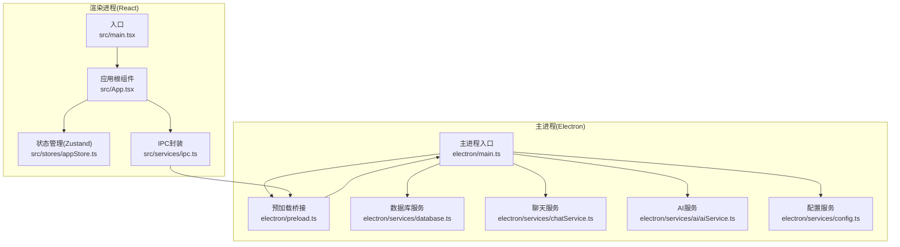
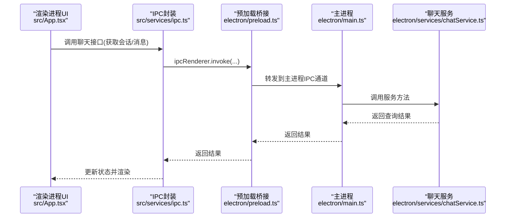
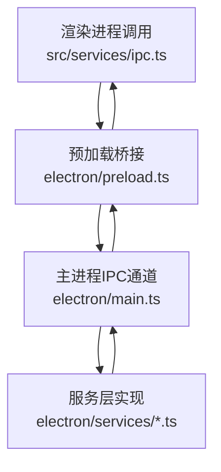
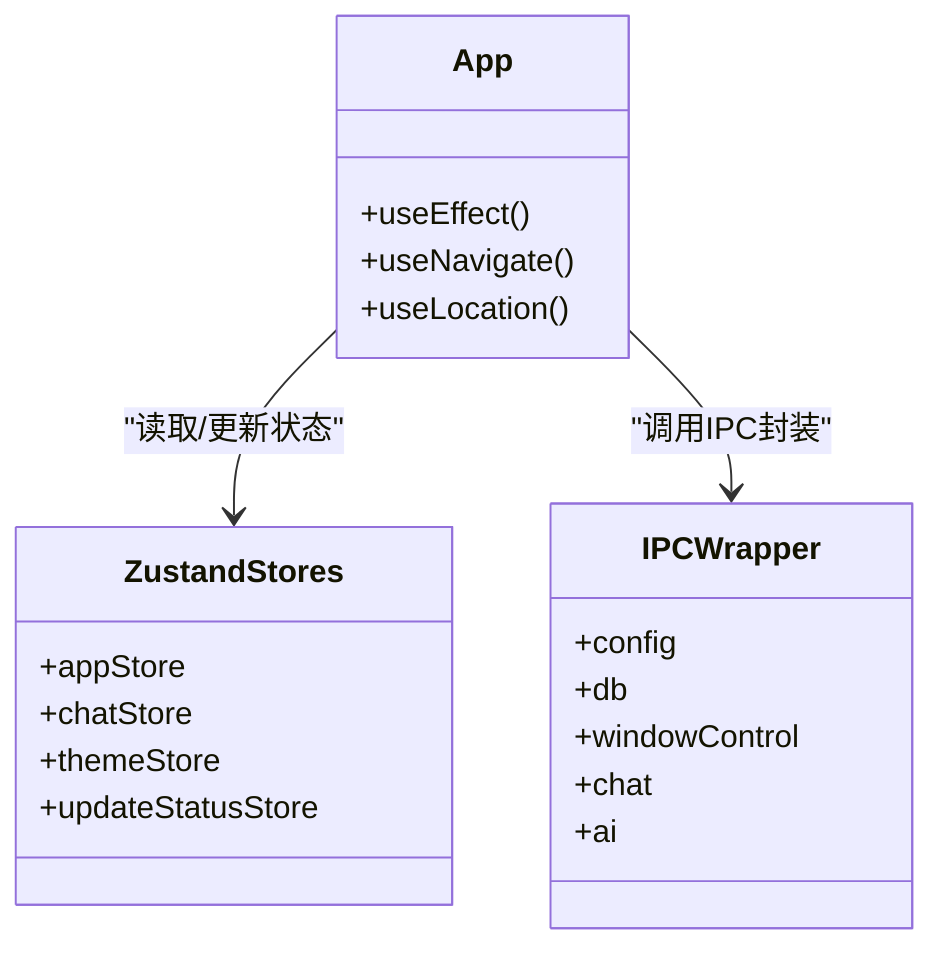
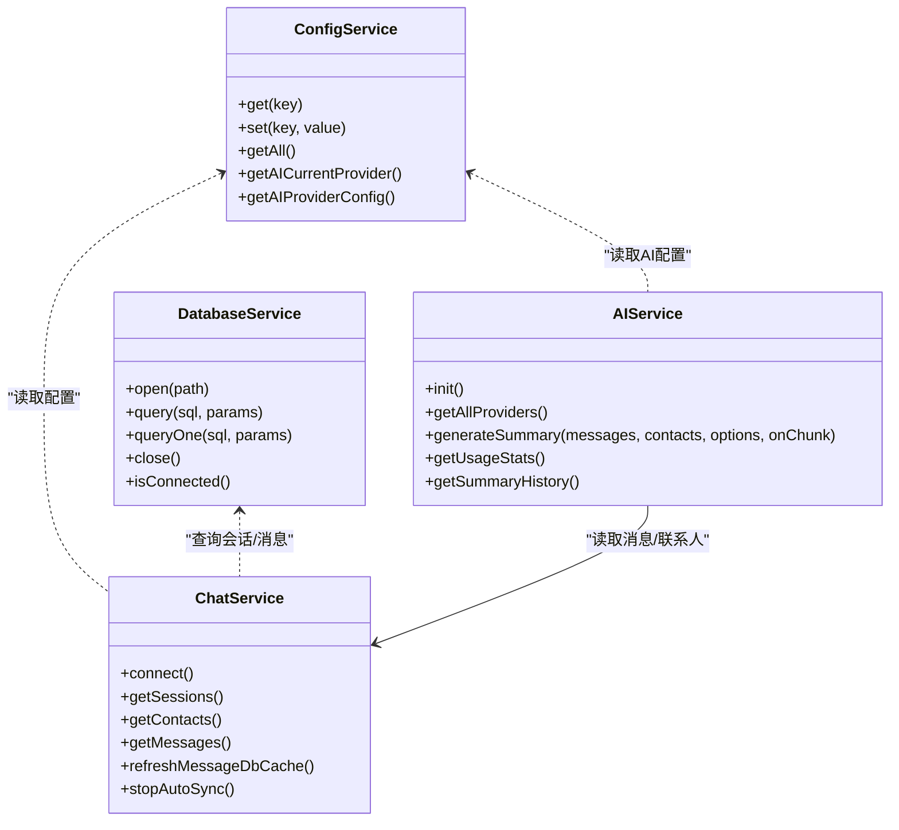
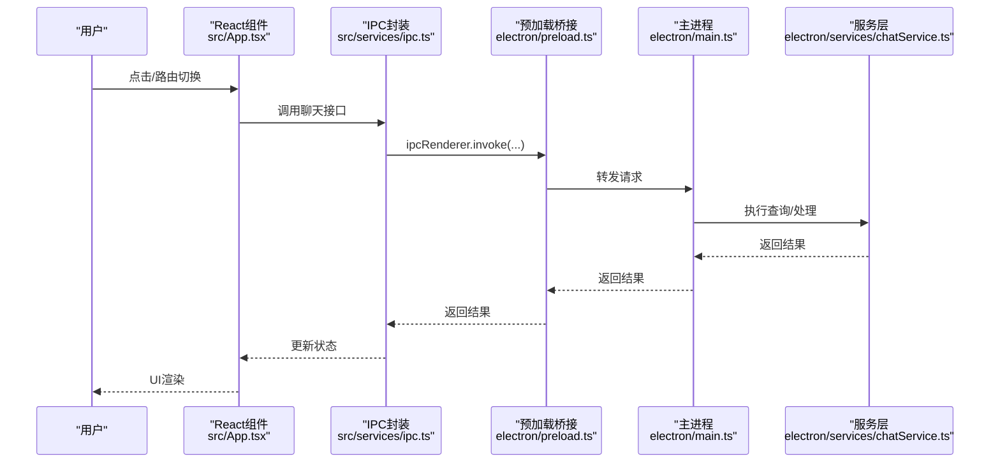
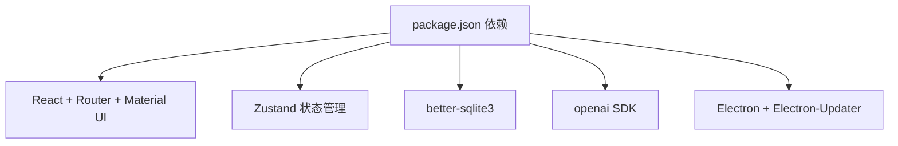

# 架构设计

<cite>
**本文档引用的文件**
- [electron/main.ts](file://electron/main.ts)
- [electron/preload.ts](file://electron/preload.ts)
- [src/main.tsx](file://src/main.tsx)
- [src/App.tsx](file://src/App.tsx)
- [src/services/ipc.ts](file://src/services/ipc.ts)
- [src/stores/appStore.ts](file://src/stores/appStore.ts)
- [electron/services/database.ts](file://electron/services/database.ts)
- [electron/services/chatService.ts](file://electron/services/chatService.ts)
- [electron/services/ai/aiService.ts](file://electron/services/ai/aiService.ts)
- [electron/services/ai/aiDatabase.ts](file://electron/services/ai/aiDatabase.ts)
- [electron/services/config.ts](file://electron/services/config.ts)
- [package.json](file://package.json)
</cite>

## 目录
1. [简介](#简介)
2. [项目结构](#项目结构)
3. [核心组件](#核心组件)
4. [架构总览](#架构总览)
5. [详细组件分析](#详细组件分析)
6. [依赖关系分析](#依赖关系分析)
7. [性能考虑](#性能考虑)
8. [故障排查指南](#故障排查指南)
9. [结论](#结论)
10. [附录](#附录)

## 简介
本架构设计文档面向架构师与高级开发者，系统性阐述 CipherTalk 的整体架构与实现细节。项目采用 Electron 双进程架构（主进程与渲染进程），结合 React 前端与 Zustand 状态管理，以及多服务层后端（数据库、AI、文件系统等）。文档重点覆盖：
- 主进程与渲染进程的职责划分与 IPC 通信机制
- 前端 React 架构、组件化设计与状态管理
- 后端服务层组织方式与数据流路径
- 性能优化策略与可扩展性设计

## 项目结构
项目采用“Electron + React + TypeScript”双端分离架构：
- 主进程（Electron）：负责系统集成、窗口管理、底层服务（数据库、AI、文件系统等）、IPC 消息桥接
- 渲染进程（React）：负责 UI 展示、路由、状态管理（Zustand）、用户交互
- 服务层：数据库服务、聊天服务、AI 服务、配置服务等模块化组织

图表来源
- [electron/main.ts:1-800](file://electron/main.ts#L1-L800)
- [electron/preload.ts:1-454](file://electron/preload.ts#L1-L454)
- [src/main.tsx:1-14](file://src/main.tsx#L1-L14)
- [src/App.tsx:1-538](file://src/App.tsx#L1-L538)
- [src/services/ipc.ts:1-38](file://src/services/ipc.ts#L1-L38)
- [src/stores/appStore.ts:1-97](file://src/stores/appStore.ts#L1-L97)
- [electron/services/database.ts:1-83](file://electron/services/database.ts#L1-L83)
- [electron/services/chatService.ts:1-800](file://electron/services/chatService.ts#L1-L800)
- [electron/services/ai/aiService.ts:1-631](file://electron/services/ai/aiService.ts#L1-L631)
- [electron/services/config.ts:1-395](file://electron/services/config.ts#L1-L395)

章节来源
- [electron/main.ts:1-800](file://electron/main.ts#L1-L800)
- [electron/preload.ts:1-454](file://electron/preload.ts#L1-L454)
- [src/main.tsx:1-14](file://src/main.tsx#L1-L14)
- [src/App.tsx:1-538](file://src/App.tsx#L1-L538)
- [src/services/ipc.ts:1-38](file://src/services/ipc.ts#L1-L38)
- [src/stores/appStore.ts:1-97](file://src/stores/appStore.ts#L1-L97)
- [electron/services/database.ts:1-83](file://electron/services/database.ts#L1-L83)
- [electron/services/chatService.ts:1-800](file://electron/services/chatService.ts#L1-L800)
- [electron/services/ai/aiService.ts:1-631](file://electron/services/ai/aiService.ts#L1-L631)
- [electron/services/config.ts:1-395](file://electron/services/config.ts#L1-L395)

## 核心组件
- 主进程入口与窗口管理：负责创建主窗口、托盘、多窗口（聊天、朋友圈、年报等），注册自定义协议与自动更新逻辑
- 预加载桥接：通过 contextBridge 暴露受限 API 至渲染进程，统一 IPC 调用入口
- React 应用与路由：基于 HashRouter 的 SPA 路由体系，配合 Zustand 管理全局状态
- 服务层：
  - 数据库服务：SQLite 访问与查询
  - 聊天服务：会话、联系人、消息解析与增量同步
  - AI 服务：多提供商抽象、流式摘要生成、使用统计与缓存
  - 配置服务：本地 SQLite 存储配置与迁移

章节来源
- [electron/main.ts:1-800](file://electron/main.ts#L1-L800)
- [electron/preload.ts:1-454](file://electron/preload.ts#L1-L454)
- [src/App.tsx:1-538](file://src/App.tsx#L1-L538)
- [src/stores/appStore.ts:1-97](file://src/stores/appStore.ts#L1-L97)
- [electron/services/database.ts:1-83](file://electron/services/database.ts#L1-L83)
- [electron/services/chatService.ts:1-800](file://electron/services/chatService.ts#L1-L800)
- [electron/services/ai/aiService.ts:1-631](file://electron/services/ai/aiService.ts#L1-L631)
- [electron/services/config.ts:1-395](file://electron/services/config.ts#L1-L395)

## 架构总览
本系统采用“主进程服务 + 渲染进程 UI”的双进程模式，通过 IPC 实现跨进程通信。主进程承载系统级能力（窗口、协议、更新、服务），渲染进程专注 UI 与交互。

图表来源
- [src/App.tsx:1-538](file://src/App.tsx#L1-L538)
- [src/services/ipc.ts:1-38](file://src/services/ipc.ts#L1-L38)
- [electron/preload.ts:1-454](file://electron/preload.ts#L1-L454)
- [electron/main.ts:1-800](file://electron/main.ts#L1-L800)
- [electron/services/chatService.ts:1-800](file://electron/services/chatService.ts#L1-L800)

## 详细组件分析

### Electron 双进程架构与 IPC 通信
- 主进程职责
  - 窗口生命周期管理（主窗口、聊天窗口、朋友圈窗口、年报窗口等）
  - 自定义协议注册（本地视频/图片协议）
  - 自动更新、托盘、快捷键、HTTP API 等系统能力
  - 服务实例化与 IPC 通道注册
- 预加载桥接
  - 通过 contextBridge.exposeInMainWorld 暴露受控 API
  - 将渲染进程的 invoke/send 请求转发至主进程
  - 提供窗口控制、配置、数据库、聊天、AI 等 API
- IPC 通信模式
  - 请求-响应：invoke/send
  - 事件监听：on/off（如更新可用、下载进度、会话更新）

图表来源
- [src/services/ipc.ts:1-38](file://src/services/ipc.ts#L1-L38)
- [electron/preload.ts:1-454](file://electron/preload.ts#L1-L454)
- [electron/main.ts:1-800](file://electron/main.ts#L1-L800)

章节来源
- [electron/main.ts:1-800](file://electron/main.ts#L1-L800)
- [electron/preload.ts:1-454](file://electron/preload.ts#L1-L454)
- [src/services/ipc.ts:1-38](file://src/services/ipc.ts#L1-L38)

### 前端 React 架构与状态管理
- 路由系统
  - 基于 HashRouter 的 SPA 路由，支持独立窗口（聊天、朋友圈、年报、AI 摘要等）
  - 路由守卫与权限控制（协议、激活状态）
- 组件化设计
  - 页面组件（ChatPage、AnalyticsPage 等）与通用组件（TitleBar、Sidebar、DecryptProgressOverlay 等）
  - 消息渲染、图片懒加载、骨架屏等性能优化
- 状态管理（Zustand）
  - 全局状态：数据库连接状态、用户信息、加载与解密进度
  - 分模块 Store：appStore、chatStore、themeStore、updateStatusStore 等

图表来源
- [src/App.tsx:1-538](file://src/App.tsx#L1-L538)
- [src/stores/appStore.ts:1-97](file://src/stores/appStore.ts#L1-L97)
- [src/services/ipc.ts:1-38](file://src/services/ipc.ts#L1-L38)

章节来源
- [src/App.tsx:1-538](file://src/App.tsx#L1-L538)
- [src/stores/appStore.ts:1-97](file://src/stores/appStore.ts#L1-L97)
- [src/services/ipc.ts:1-38](file://src/services/ipc.ts#L1-L38)

### 后端服务层架构
- 数据库服务（SQLite）
  - 打开/查询/关闭数据库，提供只读访问
- 聊天服务
  - 会话列表、联系人、消息解析与增量同步
  - 多数据库文件扫描与缓存，预编译语句提升查询性能
  - 自动同步与增量更新推送
- AI 服务
  - 多提供商抽象（OpenAI、Gemini、智谱、DeepSeek 等）
  - 流式摘要生成、使用统计、缓存与成本估算
  - 会话名称优化提示词、消息类型识别与格式化
- 配置服务
  - 本地 SQLite 存储配置项与迁移
  - 支持 AI 多提供商配置、STT 模型与缓存路径等

图表来源
- [electron/services/config.ts:1-395](file://electron/services/config.ts#L1-L395)
- [electron/services/database.ts:1-83](file://electron/services/database.ts#L1-L83)
- [electron/services/chatService.ts:1-800](file://electron/services/chatService.ts#L1-L800)
- [electron/services/ai/aiService.ts:1-631](file://electron/services/ai/aiService.ts#L1-L631)

章节来源
- [electron/services/config.ts:1-395](file://electron/services/config.ts#L1-L395)
- [electron/services/database.ts:1-83](file://electron/services/database.ts#L1-L83)
- [electron/services/chatService.ts:1-800](file://electron/services/chatService.ts#L1-L800)
- [electron/services/ai/aiService.ts:1-631](file://electron/services/ai/aiService.ts#L1-L631)

### 数据流从用户操作到数据库查询再到 UI 渲染
- 用户操作触发 UI 事件（点击、路由切换、窗口打开）
- React 组件通过 IPC 封装调用主进程 API
- 预加载桥接将请求转发至主进程 IPC 通道
- 主进程调用相应服务（数据库/聊天/AI）
- 服务层执行查询或处理逻辑，返回结果
- 主进程将结果返回渲染进程，Zustand 更新状态
- UI 响应状态变化并重新渲染

图表来源
- [src/App.tsx:1-538](file://src/App.tsx#L1-L538)
- [src/services/ipc.ts:1-38](file://src/services/ipc.ts#L1-L38)
- [electron/preload.ts:1-454](file://electron/preload.ts#L1-L454)
- [electron/main.ts:1-800](file://electron/main.ts#L1-L800)
- [electron/services/chatService.ts:1-800](file://electron/services/chatService.ts#L1-L800)

章节来源
- [src/App.tsx:1-538](file://src/App.tsx#L1-L538)
- [src/services/ipc.ts:1-38](file://src/services/ipc.ts#L1-L38)
- [electron/preload.ts:1-454](file://electron/preload.ts#L1-L454)
- [electron/main.ts:1-800](file://electron/main.ts#L1-L800)
- [electron/services/chatService.ts:1-800](file://electron/services/chatService.ts#L1-L800)

### 架构决策与技术考量
- 双进程隔离：主进程集中处理系统能力与敏感操作，渲染进程专注 UI，降低安全与稳定性风险
- IPC 设计：通过 contextBridge 暴露受控 API，避免直接暴露 Node.js 能力
- 服务层模块化：数据库、聊天、AI、配置等服务独立封装，便于测试与演进
- 缓存与性能：聊天服务使用多级缓存（会话表、SQL 预编译、头像 Base64 缓存）与增量同步，显著提升查询效率
- 可扩展性：AI 服务支持多提供商抽象与流式输出，配置服务支持动态迁移与扩展

章节来源
- [electron/main.ts:1-800](file://electron/main.ts#L1-L800)
- [electron/preload.ts:1-454](file://electron/preload.ts#L1-L454)
- [electron/services/chatService.ts:1-800](file://electron/services/chatService.ts#L1-L800)
- [electron/services/ai/aiService.ts:1-631](file://electron/services/ai/aiService.ts#L1-L631)
- [electron/services/config.ts:1-395](file://electron/services/config.ts#L1-L395)

## 依赖关系分析
- 依赖管理：package.json 定义了 React、Electron、Zustand、Material UI、better-sqlite3、openai 等核心依赖
- 构建与打包：Vite + Electron Builder，产物输出与资源打包策略
- 服务间耦合：AI 服务依赖聊天服务的消息解析；聊天服务依赖数据库服务；配置服务贯穿各服务

图表来源
- [package.json:1-169](file://package.json#L1-L169)

章节来源
- [package.json:1-169](file://package.json#L1-L169)

## 性能考虑
- 渲染进程优化
  - 虚拟滚动（react-window）与懒加载（IntersectionObserver）减少 DOM 压力
  - 图片骨架屏与错误回退，提升感知性能
- 主进程优化
  - 聊天服务多级缓存与预编译语句，降低数据库访问开销
  - 增量同步与防抖机制，避免频繁查询与 UI 抖动
- AI 服务优化
  - 流式输出与分块回调，实时展示摘要生成进度
  - 使用统计与缓存，降低重复请求成本

章节来源
- [src/pages/ChatPage.tsx:1-200](file://src/pages/ChatPage.tsx#L1-L200)
- [electron/services/chatService.ts:1-800](file://electron/services/chatService.ts#L1-L800)
- [electron/services/ai/aiService.ts:1-631](file://electron/services/ai/aiService.ts#L1-L631)

## 故障排查指南
- 数据库连接失败
  - 检查配置服务中的 dbPath、decryptKey、myWxid 是否正确
  - 确认解密后的数据库目录存在且可读
- 聊天数据不刷新
  - 触发增量更新或手动刷新消息数据库缓存
  - 检查自动同步定时器与会话游标
- AI 摘要异常
  - 检查提供商 API Key 与模型配置
  - 查看使用统计与缓存状态，必要时清理过期缓存
- IPC 调用失败
  - 确认预加载桥接已正确暴露 API
  - 检查主进程 IPC 通道注册与服务实现

章节来源
- [electron/services/config.ts:1-395](file://electron/services/config.ts#L1-L395)
- [electron/services/chatService.ts:1-800](file://electron/services/chatService.ts#L1-L800)
- [electron/services/ai/aiService.ts:1-631](file://electron/services/ai/aiService.ts#L1-L631)
- [electron/preload.ts:1-454](file://electron/preload.ts#L1-L454)

## 结论
CipherTalk 通过 Electron 双进程架构实现了系统能力与 UI 的清晰分离，结合 React/Zustand 的现代化前端栈与模块化服务层，构建了高性能、可扩展、易维护的桌面应用。主进程负责安全与系统能力，渲染进程专注用户体验，服务层提供稳定的数据访问与业务处理，整体架构具备良好的演进空间与工程实践价值。

## 附录
- 独立窗口支持：聊天窗口、朋友圈窗口、年报窗口、AI 摘要窗口等，满足不同场景需求
- 协议与激活：用户协议弹窗、激活流程与状态检查，保障合规与授权
- 更新与日志：自动更新检查与下载进度反馈，日志级别与目录管理

章节来源
- [electron/main.ts:1-800](file://electron/main.ts#L1-L800)
- [src/App.tsx:1-538](file://src/App.tsx#L1-L538)