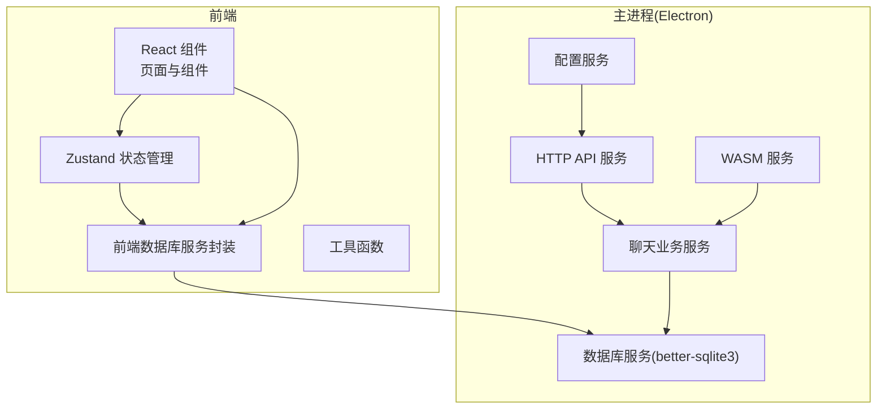
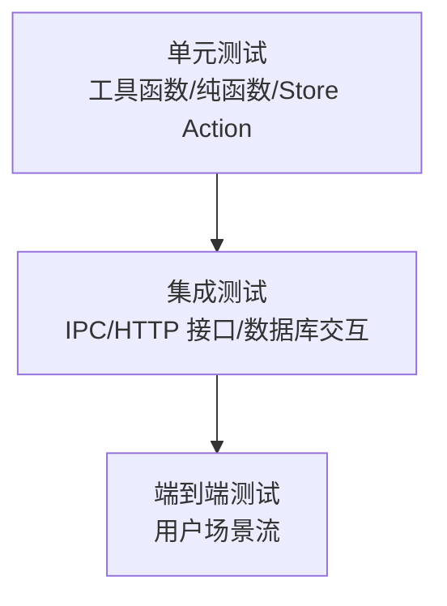
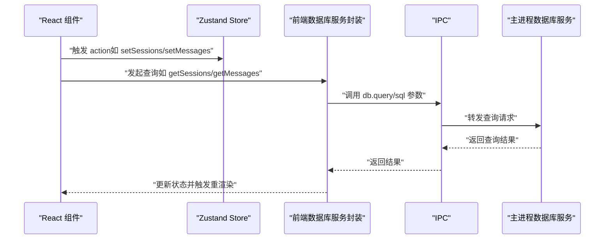
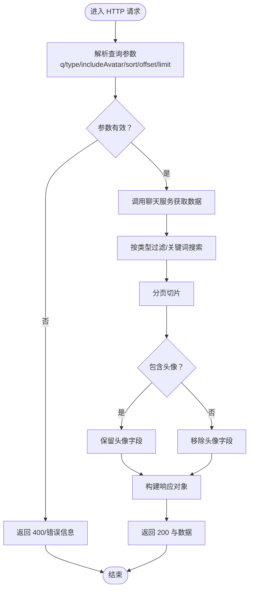
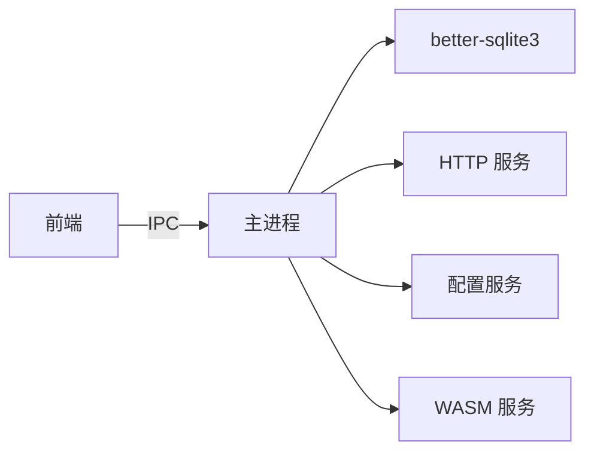

# 测试策略

<cite>
**本文引用的文件**
- [package.json](file://package.json)
- [README.md](file://README.md)
- [tsconfig.node.json](file://tsconfig.node.json)
- [src/vite-env.d.ts](file://src/vite-env.d.ts)
- [src/stores/chatStore.ts](file://src/stores/chatStore.ts)
- [src/stores/appStore.ts](file://src/stores/appStore.ts)
- [src/services/database.ts](file://src/services/database.ts)
- [src/utils/crypto.ts](file://src/utils/crypto.ts)
- [src/types/analytics.ts](file://src/types/analytics.ts)
- [electron/services/database.ts](file://electron/services/database.ts)
- [electron/services/chatService.ts](file://electron/services/chatService.ts)
- [electron/services/httpApiService.ts](file://electron/services/httpApiService.ts)
- [electron/services/config.ts](file://electron/services/config.ts)
- [electron/services/wasmService.ts](file://electron/services/wasmService.ts)
- [electron/assets/wasm/wasm_video_decode.js](file://electron/assets/wasm/wasm_video_decode.js)
</cite>

## 目录
1. [简介](#简介)
2. [项目结构](#项目结构)
3. [核心组件](#核心组件)
4. [架构总览](#架构总览)
5. [详细组件分析](#详细组件分析)
6. [依赖分析](#依赖分析)
7. [性能考虑](#性能考虑)
8. [故障排查指南](#故障排查指南)
9. [结论](#结论)
10. [附录](#附录)

## 简介
本文件为 CipherTalk 的测试策略文档，面向 QA 工程师与开发者，提供覆盖单元测试、集成测试、端到端测试的分层测试架构说明；涵盖前端 React 组件测试、状态管理测试、用户交互测试；涵盖后端数据库操作测试、API 接口测试、业务逻辑测试；描述测试工具链与 Mock 服务、测试数据管理；解释性能测试（负载、压力、基准）；并提供测试自动化（CI/CD 集成、自动化执行、报告生成）、测试覆盖率与质量标准建议。

## 项目结构
CipherTalk 采用前端 React/Vite + Electron 主进程的混合架构，前端负责 UI 与状态管理，后端（Electron 主进程）负责数据库解密与访问、HTTP API、系统服务等。测试应围绕三层边界进行分层设计：
- 前端层：React 组件、Zustand 状态管理、IPC 调用封装
- 后端层：数据库服务、聊天业务服务、HTTP API 服务、配置与工具服务
- 边界层：IPC 通信、HTTP 接口、文件系统与外部依赖（WASM）

**图示来源**
- [src/services/database.ts:1-243](file://src/services/database.ts#L1-L243)
- [electron/services/database.ts:1-83](file://electron/services/database.ts#L1-L83)
- [electron/services/chatService.ts:1-800](file://electron/services/chatService.ts#L1-L800)
- [electron/services/httpApiService.ts:126-1235](file://electron/services/httpApiService.ts#L126-L1235)
- [electron/services/config.ts:126-172](file://electron/services/config.ts#L126-L172)
- [electron/services/wasmService.ts:65-100](file://electron/services/wasmService.ts#L65-L100)

**章节来源**
- [README.md:132-159](file://README.md#L132-L159)
- [package.json:1-169](file://package.json#L1-L169)

## 核心组件
- 前端状态管理：Zustand stores（聊天、应用状态），用于集中管理连接状态、会话列表、消息列表、联系人缓存、搜索关键字、同步版本号等。
- 前端数据库服务封装：对 IPC 的数据库查询进行封装，提供会话、联系人、消息、搜索、计数等方法。
- 后端数据库服务：基于 better-sqlite3 的只读数据库访问，提供 query/queryOne/close/isConnected 等能力。
- 聊天业务服务：主进程聊天服务，负责数据库连接、目录扫描、消息表发现、缓存、增量同步、头像解析、联系人丰富等。
- HTTP API 服务：提供 /v1/health、/v1/status、/v1/sessions、/v1/messages、/v1/contacts 等接口，支持分页、过滤、头像控制等。
- 配置服务：基于 SQLite 的键值配置存储，初始化默认配置与 TLD 缓存表。
- WASM 服务：模拟 Emscripten 环境，加载并运行视频解码 WASM。
- 工具函数：密码哈希（PBKDF2）等加密工具。

**章节来源**
- [src/stores/chatStore.ts:1-146](file://src/stores/chatStore.ts#L1-L146)
- [src/stores/appStore.ts:1-97](file://src/stores/appStore.ts#L1-L97)
- [src/services/database.ts:1-243](file://src/services/database.ts#L1-L243)
- [electron/services/database.ts:1-83](file://electron/services/database.ts#L1-L83)
- [electron/services/chatService.ts:1-800](file://electron/services/chatService.ts#L1-L800)
- [electron/services/httpApiService.ts:126-1235](file://electron/services/httpApiService.ts#L126-L1235)
- [electron/services/config.ts:126-172](file://electron/services/config.ts#L126-L172)
- [electron/services/wasmService.ts:65-100](file://electron/services/wasmService.ts#L65-L100)
- [src/utils/crypto.ts:1-31](file://src/utils/crypto.ts#L1-L31)

## 架构总览
测试架构采用分层设计：
- 单元测试：针对纯函数、工具函数、store 的 action 与派生状态进行测试，确保最小逻辑单元正确。
- 集成测试：针对前端服务封装与后端服务之间的 IPC 交互、数据库查询、HTTP 接口进行集成验证。
- 端到端测试：覆盖真实用户场景（如登录/解密流程、会话列表加载、消息检索、导出流程），验证跨进程与跨模块协作。

[本图为概念性架构示意，无需“图示来源”]

## 详细组件分析

### 前端测试策略
- React 组件测试
  - 目标：验证组件渲染、属性传递、事件回调、条件渲染、主题切换、无障碍可达性。
  - 方法：使用轻量测试运行器与 DOM 测试工具，对组件进行快照与行为断言。
  - 关注点：组件在不同 store 状态下的表现、错误边界、空态与加载态。
- 状态管理测试（Zustand）
  - 目标：验证 store 的初始状态、action 的状态变更、派生状态（如 filteredSessions、hasMoreMessages）。
  - 方法：直接调用 store action，断言状态变化；对复杂逻辑（如 appendMessages 去重）进行边界测试。
- 用户交互测试
  - 目标：验证用户点击、输入、滚动、搜索、分页等交互是否正确驱动状态与 UI 更新。
  - 方法：模拟用户事件，断言 store 状态与 UI 变化；结合屏幕截图对比进行回归验证。

**图示来源**
- [src/services/database.ts:26-47](file://src/services/database.ts#L26-L47)
- [src/services/database.ts:69-100](file://src/services/database.ts#L69-L100)
- [electron/services/database.ts:29-64](file://electron/services/database.ts#L29-L64)

**章节来源**
- [src/stores/chatStore.ts:51-145](file://src/stores/chatStore.ts#L51-L145)
- [src/stores/appStore.ts:40-95](file://src/stores/appStore.ts#L40-L95)
- [src/services/database.ts:1-243](file://src/services/database.ts#L1-L243)

### 后端测试策略
- 数据库操作测试
  - 目标：验证数据库连接、查询、单条查询、关闭、只读模式、异常处理。
  - 方法：构造测试数据库文件，使用只读模式进行查询；断言错误路径与异常抛出。
- 聊天业务逻辑测试
  - 目标：验证会话列表过滤规则、联系人丰富、消息表发现、缓存与增量同步、头像解析。
  - 方法：准备多表结构与数据，断言过滤逻辑、表发现算法、缓存命中与失效。
- HTTP API 接口测试
  - 目标：验证 /v1/health、/v1/status、/v1/sessions、/v1/messages、/v1/contacts 的响应结构、分页、过滤、鉴权。
  - 方法：启动 HTTP 服务，构造请求参数，断言状态码、JSON 结构、字段存在性与范围。

**图示来源**
- [electron/services/httpApiService.ts:1142-1220](file://electron/services/httpApiService.ts#L1142-L1220)

**章节来源**
- [electron/services/database.ts:1-83](file://electron/services/database.ts#L1-L83)
- [electron/services/chatService.ts:451-520](file://electron/services/chatService.ts#L451-L520)
- [electron/services/httpApiService.ts:126-1235](file://electron/services/httpApiService.ts#L126-L1235)

### 测试工具链与 Mock 服务
- 测试框架与运行器
  - 建议：前端使用轻量测试运行器（如 Vitest 或 Jest），后端使用 Node 端测试运行器（如 Jest 或 Mocha）。
  - 配置：前端使用 Vite 环境类型声明，后端使用 tsconfig.node 的 ES 模块解析。
- Mock 服务
  - 数据库：使用 better-sqlite3 的内存数据库或临时文件数据库进行测试。
  - IPC：Mock 前端数据库服务封装，注入假实现以避免真实主进程依赖。
  - HTTP：Mock HTTP API 服务，注入假聊天服务实现，断言路由与参数。
  - 外部依赖：WASM 服务可通过替换加载逻辑或使用静态资源进行测试。
- 测试数据管理
  - 建议：准备标准化的测试数据库（含 SessionTable、Msg_* 表、contact 表等），通过脚本生成与清理。
  - 敏感数据：避免在测试数据中包含真实用户数据，使用脱敏或随机化数据。

**章节来源**
- [src/vite-env.d.ts:1-1](file://src/vite-env.d.ts#L1-L1)
- [tsconfig.node.json:1-13](file://tsconfig.node.json#L1-L13)
- [electron/services/wasmService.ts:65-100](file://electron/services/wasmService.ts#L65-L100)
- [electron/assets/wasm/wasm_video_decode.js:1188-1230](file://electron/assets/wasm/wasm_video_decode.js#L1188-L1230)

### 性能测试策略
- 负载测试
  - 场景：高并发获取会话列表、批量消息查询、联系人列表分页。
  - 指标：吞吐量、平均/95 分位/最大响应时间、错误率。
- 压力测试
  - 场景：数据库连接池耗尽、消息表数量激增、WASM 解码密集计算。
  - 指标：CPU/内存占用、线程阻塞、数据库锁等待、超时与重试。
- 性能基准测试
  - 场景：消息表发现、缓存命中率、预编译语句命中、头像解析性能。
  - 指标：各步骤耗时、缓存命中/未命中次数、SQL 执行计划。

[本节为通用性能指导，无需“章节来源”]

### 测试自动化与 CI/CD
- CI/CD 集成
  - 建议：在 CI 中分别执行前端单元/集成测试、后端单元/集成测试、端到端测试。
  - 并行：将不同层测试并行化，缩短流水线时间。
- 自动化执行
  - 前端：在 CI 中安装依赖、构建、运行测试。
  - 后端：准备测试数据库文件，运行 Node 测试。
  - 端到端：在受控环境中启动 Electron 应用与 HTTP 服务，执行 E2E 测试。
- 测试报告生成
  - 建议：生成 JUnit XML、HTML 报告与覆盖率报告，上传至 CI 平台归档。

[本节为通用自动化指导，无需“章节来源”]

### 测试覆盖率与质量标准
- 覆盖率要求（建议）
  - 前端单元测试：语句覆盖率 ≥ 80%，分支覆盖率 ≥ 70%，函数覆盖率 ≥ 80%，行覆盖率 ≥ 80%。
  - 后端单元测试：语句覆盖率 ≥ 85%，分支覆盖率 ≥ 75%，函数覆盖率 ≥ 85%，行覆盖率 ≥ 85%。
  - 集成测试：关键路径与异常路径 100% 覆盖。
  - 端到端测试：核心用户场景 100% 覆盖。
- 质量标准
  - 代码质量：无阻塞性警告、无未捕获异常、无死循环。
  - 性能：关键接口响应时间 ≤ 2 秒（视硬件而定），数据库查询使用索引与预编译语句。
  - 可靠性：异常路径具备明确错误码与错误信息，日志记录充分。

[本节为通用质量指导，无需“章节来源”]

## 依赖分析
- 前端依赖
  - React 19、Zustand、Electron Store、better-sqlite3（通过 IPC）、WASM 与音频/视频处理库。
- 后端依赖
  - better-sqlite3、Electron、Node 内置模块（fs/path/https/http）、第三方库（如 fzstd、fsevents）。
- 测试依赖
  - 建议：前端测试运行器、DOM 测试工具、Node 测试运行器、SQLite 内存数据库、HTTP 测试客户端。

**图示来源**
- [package.json:20-56](file://package.json#L20-L56)
- [electron/services/database.ts:1-83](file://electron/services/database.ts#L1-L83)
- [electron/services/httpApiService.ts:126-1235](file://electron/services/httpApiService.ts#L126-L1235)
- [electron/services/config.ts:126-172](file://electron/services/config.ts#L126-L172)
- [electron/services/wasmService.ts:65-100](file://electron/services/wasmService.ts#L65-L100)

**章节来源**
- [package.json:20-56](file://package.json#L20-L56)

## 性能考虑
- 数据库查询优化
  - 使用预编译语句与索引，避免全表扫描；对高频查询建立合适索引。
- 缓存策略
  - 对会话表、联系人列信息、头像 Base64 进行缓存，设置合理过期时间。
- 并发与异步
  - 控制并发查询数量，避免阻塞主线程；对长耗时任务使用 Worker 或后台线程。
- HTTP 接口限流
  - 对高频接口增加限流与缓存，防止数据库压力过大。

[本节为通用性能指导，无需“章节来源”]

## 故障排查指南
- 数据库连接失败
  - 现象：打开数据库失败、查询抛错。
  - 排查：确认数据库文件存在、路径正确、只读模式可用；检查权限与文件损坏。
- 会话表缺失
  - 现象：未找到会话表。
  - 排查：确认数据库版本差异导致的表名变化；动态探测 SessionTable/Session/session。
- 消息表发现失败
  - 现象：找不到消息表或返回空。
  - 排查：遍历数据库目录，逐个尝试查询是否存在数据；缓存已知消息数据库文件集合。
- HTTP 接口异常
  - 现象：返回 503 或错误信息。
  - 排查：检查数据库是否已连接；核对查询参数与分页范围；确认鉴权令牌配置。

**章节来源**
- [electron/services/database.ts:11-24](file://electron/services/database.ts#L11-L24)
- [electron/services/chatService.ts:466-477](file://electron/services/chatService.ts#L466-L477)
- [electron/services/chatService.ts:718-742](file://electron/services/chatService.ts#L718-L742)
- [electron/services/httpApiService.ts:1150-1163](file://electron/services/httpApiService.ts#L1150-L1163)

## 结论
通过分层测试策略（单元/集成/端到端）、完善的工具链与 Mock 服务、严格的覆盖率与质量标准，以及性能与可靠性保障，CipherTalk 可以在复杂的数据访问与多进程架构下，持续稳定地交付高质量功能。建议在 CI/CD 中自动化执行各类测试，并定期评估与优化测试矩阵。

## 附录
- 关键测试场景建议
  - 前端：组件渲染与交互、store 状态变更、错误边界、主题切换。
  - 后端：数据库连接与查询、聊天服务过滤与缓存、HTTP 接口参数校验。
  - 端到端：登录/解密流程、会话列表加载、消息检索与分页、导出流程。
- 工具与资源
  - 前端：Vitest/Jest、React Testing Library、DOM 测试工具。
  - 后端：Jest/Mocha、SQLite 内存数据库、HTTP 测试客户端。
  - 性能：压测工具、性能分析器、日志监控。

[本节为通用附录，无需“章节来源”]