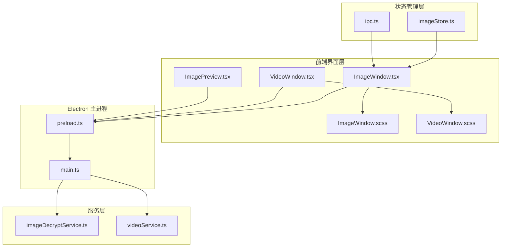
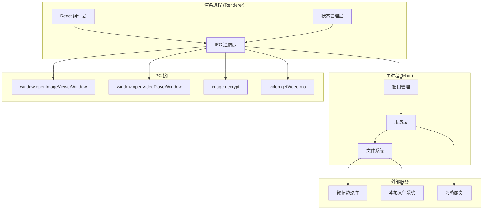
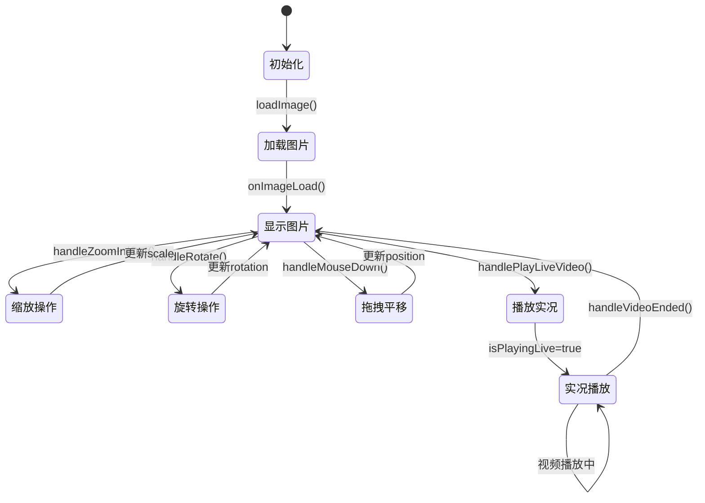
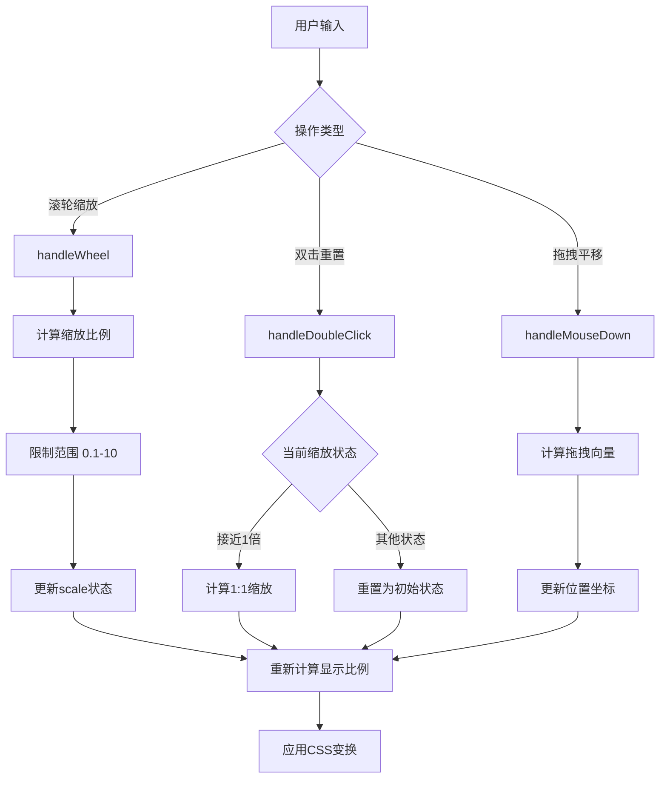
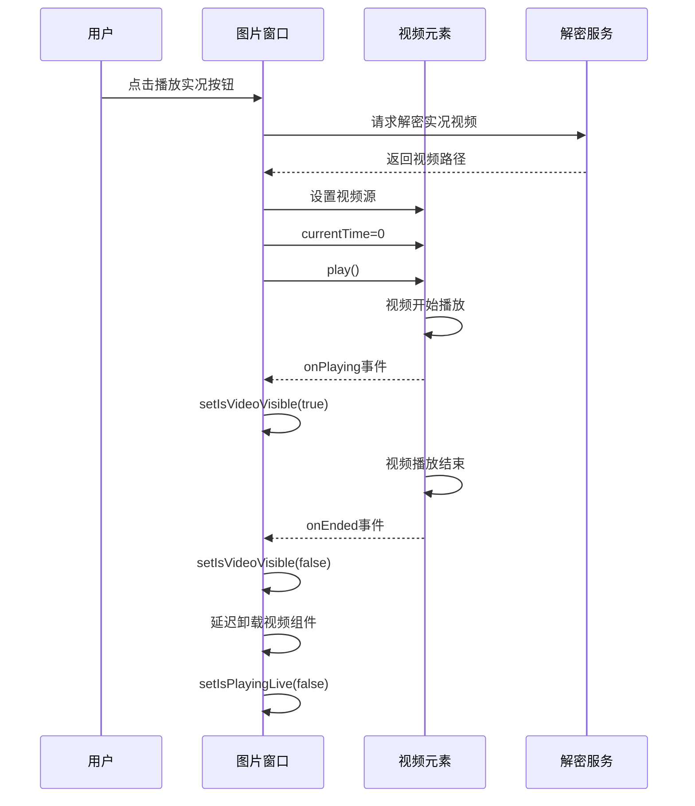
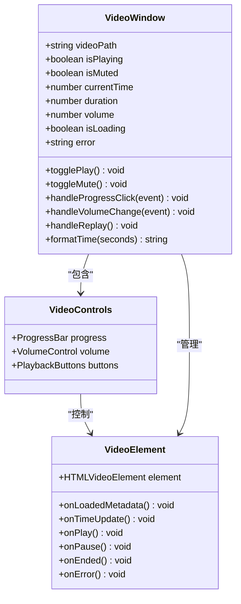
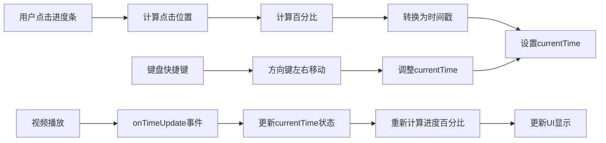
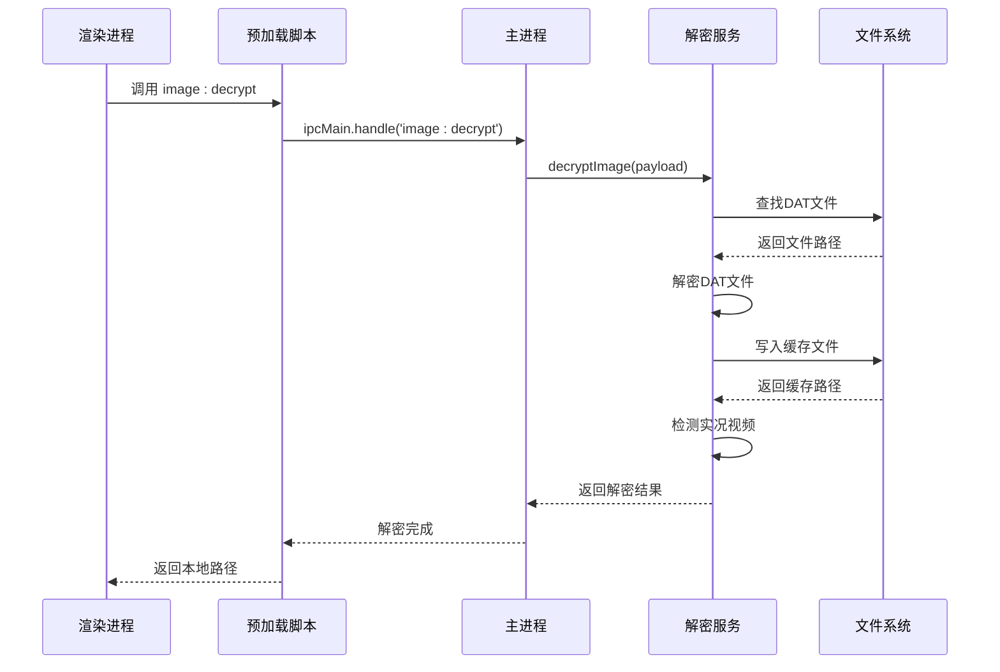
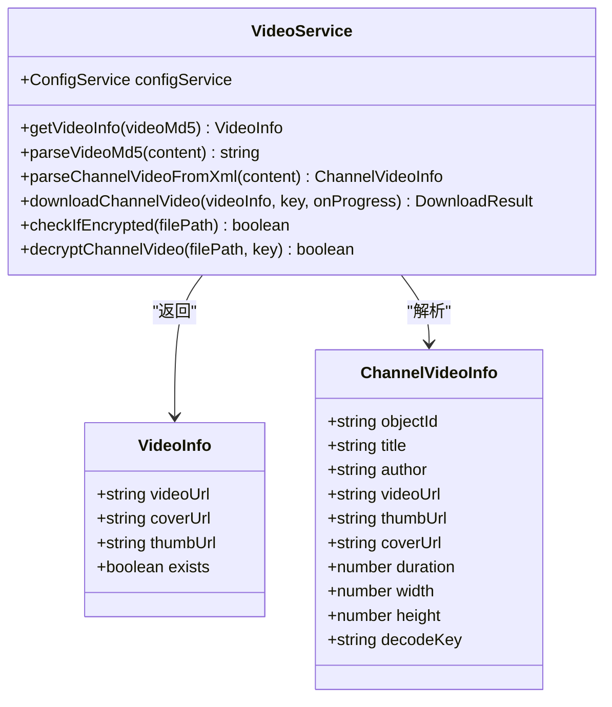
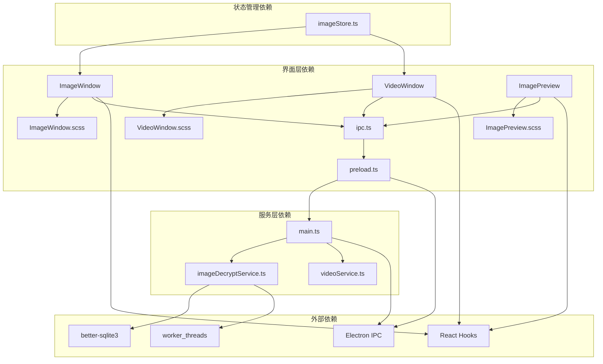

# 媒体查看窗口

<cite>
**本文档引用的文件**
- [ImageWindow.tsx](file://src/pages/ImageWindow.tsx)
- [VideoWindow.tsx](file://src/pages/VideoWindow.tsx)
- [ImagePreview.tsx](file://src/components/ImagePreview.tsx)
- [ImageWindow.scss](file://src/pages/ImageWindow.scss)
- [VideoWindow.scss](file://src/pages/VideoWindow.scss)
- [imageDecryptService.ts](file://electron/services/imageDecryptService.ts)
- [videoService.ts](file://electron/services/videoService.ts)
- [preload.ts](file://electron/preload.ts)
- [main.ts](file://electron/main.ts)
- [ipc.ts](file://src/services/ipc.ts)
- [imageStore.ts](file://src/stores/imageStore.ts)
</cite>

## 目录
1. [简介](#简介)
2. [项目结构](#项目结构)
3. [核心组件](#核心组件)
4. [架构概览](#架构概览)
5. [详细组件分析](#详细组件分析)
6. [依赖关系分析](#依赖关系分析)
7. [性能考虑](#性能考虑)
8. [故障排除指南](#故障排除指南)
9. [结论](#结论)

## 简介

CipherTalk 的媒体查看窗口功能提供了统一的图片和视频查看体验。该系统采用 React + Electron 架构，实现了跨平台的媒体展示功能，支持微信原生格式的图片解密、Live Photo 实况播放、以及完整的视频播放控制。

系统的核心设计理念是"统一处理机制"，通过共享的状态管理和事件驱动架构，实现了图片窗口和视频窗口的协同工作。用户可以通过键盘快捷键、鼠标手势和触摸操作来控制媒体内容的显示和交互。

## 项目结构

媒体查看窗口功能主要分布在以下模块中：

**图表来源**
- [ImageWindow.tsx:1-519](file://src/pages/ImageWindow.tsx#L1-L519)
- [VideoWindow.tsx:1-200](file://src/pages/VideoWindow.tsx#L1-L200)
- [preload.ts:1-454](file://electron/preload.ts#L1-L454)
- [main.ts:1-3886](file://electron/main.ts#L1-L3886)

**章节来源**
- [ImageWindow.tsx:1-519](file://src/pages/ImageWindow.tsx#L1-L519)
- [VideoWindow.tsx:1-200](file://src/pages/VideoWindow.tsx#L1-L200)
- [ImageWindow.scss:1-278](file://src/pages/ImageWindow.scss#L1-L278)
- [VideoWindow.scss:1-217](file://src/pages/VideoWindow.scss#L1-L217)

## 核心组件

### 图片查看窗口 (ImageWindow)

图片查看窗口是媒体查看系统的核心组件，提供了完整的图片浏览功能：

- **多格式支持**: 支持微信原生格式的图片解密和显示
- **Live Photo 实况**: 自动检测并播放 Motion Photo 实况视频
- **手势控制**: 鼠标滚轮缩放、拖拽平移、双击重置
- **键盘快捷键**: 支持 +、-、R、0、方向键等快捷操作
- **批量浏览**: 支持图片列表导航和状态同步

### 视频播放窗口 (VideoWindow)

视频播放窗口专注于视频内容的高质量播放：

- **播放控制**: 播放/暂停、进度控制、音量调节
- **全屏支持**: 自动适配视频尺寸的窗口调整
- **加载状态**: 显示加载进度和错误信息
- **快捷键支持**: 空格键播放/暂停、方向键快进后退、音量调节

### 预览组件 (ImagePreview)

预览组件提供轻量级的媒体预览功能：

- **模态显示**: 使用 Portal 技术在全局遮罩层中显示
- **实时缩放**: 支持滚轮缩放和平移操作
- **实况切换**: 在图片和实况视频之间动态切换
- **ESC 关闭**: 支持键盘快捷键关闭

**章节来源**
- [ImageWindow.tsx:8-519](file://src/pages/ImageWindow.tsx#L8-L519)
- [VideoWindow.tsx:6-200](file://src/pages/VideoWindow.tsx#L6-L200)
- [ImagePreview.tsx:14-151](file://src/components/ImagePreview.tsx#L14-L151)

## 架构概览

媒体查看窗口采用了分层架构设计，确保了良好的可维护性和扩展性：

**图表来源**
- [preload.ts:91-114](file://electron/preload.ts#L91-L114)
- [main.ts:1405-1410](file://electron/main.ts#L1405-L1410)
- [main.ts:1842-1849](file://electron/main.ts#L1842-L1849)

系统的核心优势在于其模块化的架构设计，每个组件都有明确的职责分工：

1. **界面层**: 负责用户交互和视觉呈现
2. **状态层**: 管理应用状态和业务逻辑
3. **通信层**: 处理渲染进程与主进程之间的数据交换
4. **服务层**: 提供具体的业务功能实现

## 详细组件分析

### 图片查看窗口详细分析

#### 状态管理系统

图片查看窗口使用了 React Hooks 来管理复杂的交互状态：

**图表来源**
- [ImageWindow.tsx:30-130](file://src/pages/ImageWindow.tsx#L30-L130)

#### 缩放和变换算法

图片缩放系统实现了精确的变换控制：

**图表来源**
- [ImageWindow.tsx:314-387](file://src/pages/ImageWindow.tsx#L314-L387)

#### 实况照片处理流程

实况照片（Live Photo）的处理是一个复杂的多媒体集成过程：

**图表来源**
- [ImageWindow.tsx:107-130](file://src/pages/ImageWindow.tsx#L107-L130)
- [imageDecryptService.ts:268-272](file://electron/services/imageDecryptService.ts#L268-L272)

**章节来源**
- [ImageWindow.tsx:1-519](file://src/pages/ImageWindow.tsx#L1-L519)

### 视频播放窗口详细分析

#### 播放控制机制

视频播放窗口实现了完整的播放控制功能：

**图表来源**
- [VideoWindow.tsx:1-200](file://src/pages/VideoWindow.tsx#L1-L200)

#### 进度控制算法

视频进度控制实现了精确的时间轴操作：

**图表来源**
- [VideoWindow.tsx:44-67](file://src/pages/VideoWindow.tsx#L44-L67)

**章节来源**
- [VideoWindow.tsx:1-200](file://src/pages/VideoWindow.tsx#L1-L200)

### 解密服务详细分析

#### 图片解密流程

图片解密服务是媒体查看系统的核心基础设施：

**图表来源**
- [preload.ts:200-215](file://electron/preload.ts#L200-L215)
- [main.ts:1842-1858](file://electron/main.ts#L1842-L1858)
- [imageDecryptService.ts:112-158](file://electron/services/imageDecryptService.ts#L112-L158)

#### 视频信息服务

视频信息服务提供了视频元数据管理和下载功能：

**图表来源**
- [videoService.ts:11-567](file://electron/services/videoService.ts#L11-L567)

**章节来源**
- [imageDecryptService.ts:1-800](file://electron/services/imageDecryptService.ts#L1-L800)
- [videoService.ts:1-567](file://electron/services/videoService.ts#L1-L567)

## 依赖关系分析

媒体查看窗口系统的依赖关系体现了清晰的分层架构：

**图表来源**
- [ipc.ts:1-38](file://src/services/ipc.ts#L1-L38)
- [preload.ts:1-454](file://electron/preload.ts#L1-L454)
- [main.ts:1-3886](file://electron/main.ts#L1-L3886)

**章节来源**
- [ipc.ts:1-38](file://src/services/ipc.ts#L1-L38)
- [preload.ts:1-454](file://electron/preload.ts#L1-L454)
- [main.ts:1-3886](file://electron/main.ts#L1-L3886)

## 性能考虑

### 渲染优化策略

媒体查看窗口采用了多项渲染优化技术：

1. **CSS 变换优化**: 使用 `transform` 属性而非改变 DOM 尺寸来实现缩放和平移
2. **will-change 属性**: 为频繁变换的元素启用硬件加速
3. **条件渲染**: 实况视频采用条件渲染，避免不必要的 DOM 创建
4. **事件节流**: 鼠标事件处理使用防抖技术减少重绘频率

### 内存管理策略

系统实现了完善的内存管理机制：

1. **缓存机制**: 解密后的图片和视频文件缓存到本地磁盘
2. **状态清理**: 组件卸载时自动清理事件监听器和定时器
3. **资源释放**: 视频播放结束后及时释放媒体资源
4. **垃圾回收**: 避免创建不必要的闭包和引用

### 网络优化

对于网络视频内容，系统提供了以下优化：

1. **进度回调**: 实现下载进度的实时反馈
2. **错误处理**: 完善的网络错误处理和重试机制
3. **文件头检测**: 通过文件头特征判断视频加密状态
4. **解密优化**: 仅对必要部分进行解密操作

## 故障排除指南

### 常见问题及解决方案

#### 图片无法显示

**问题症状**: 图片窗口显示"无效的图片路径"

**可能原因**:
1. 图片文件不存在或已被删除
2. 解密密钥配置错误
3. 文件权限问题

**解决步骤**:
1. 检查图片文件是否存在于数据库路径中
2. 验证图片解密密钥配置
3. 确认应用程序具有文件访问权限

#### 实况视频播放失败

**问题症状**: 实况按钮可用但视频无法播放

**可能原因**:
1. 实况视频文件缺失
2. 解密服务异常
3. 浏览器兼容性问题

**解决步骤**:
1. 检查是否存在对应的 `.mov` 文件
2. 验证解密服务正常运行
3. 更新浏览器版本

#### 视频播放卡顿

**问题症状**: 视频播放过程中出现卡顿或延迟

**可能原因**:
1. 网络带宽不足
2. 硬件解码器问题
3. 系统资源不足

**解决步骤**:
1. 检查网络连接质量
2. 更新显卡驱动程序
3. 关闭其他占用资源的应用程序

**章节来源**
- [imageDecryptService.ts:285-293](file://electron/services/imageDecryptService.ts#L285-L293)
- [videoService.ts:499-523](file://electron/services/videoService.ts#L499-L523)

## 结论

CipherTalk 的媒体查看窗口功能展现了现代桌面应用的优秀设计实践。通过统一的架构设计、完善的解密机制和丰富的交互功能，系统为用户提供了流畅的媒体查看体验。

系统的主要优势包括：

1. **架构清晰**: 分层设计确保了良好的可维护性和扩展性
2. **功能完整**: 支持多种媒体格式和交互方式
3. **性能优化**: 采用多项优化技术确保流畅的用户体验
4. **错误处理**: 完善的错误处理和恢复机制

未来的发展方向可以包括：

1. **格式扩展**: 支持更多新媒体格式
2. **AI 集成**: 添加智能识别和推荐功能
3. **云同步**: 实现跨设备的媒体同步
4. **性能提升**: 进一步优化渲染和解密性能

通过持续的优化和改进，CipherTalk 的媒体查看窗口将成为一个功能强大、性能优异的媒体处理平台。