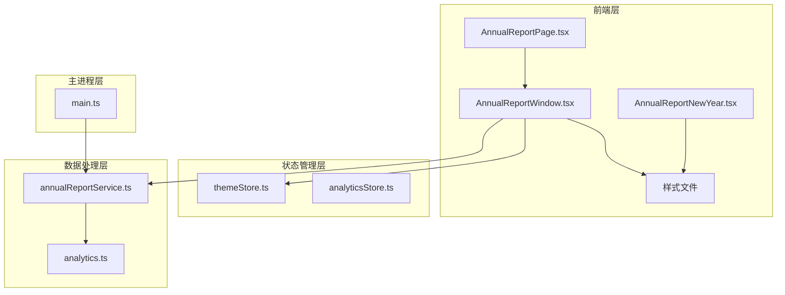
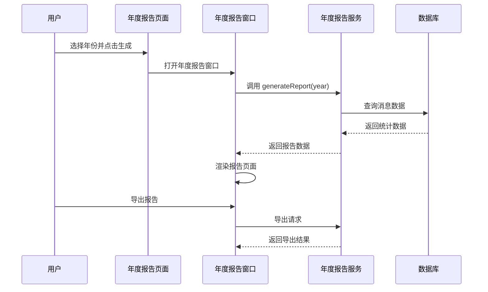
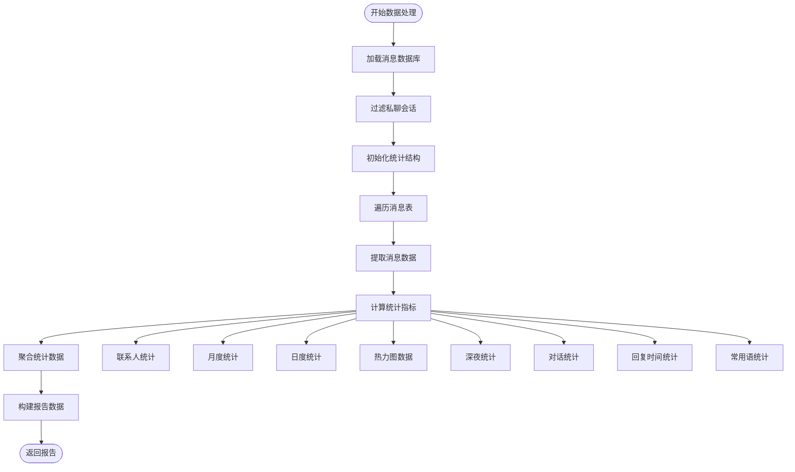
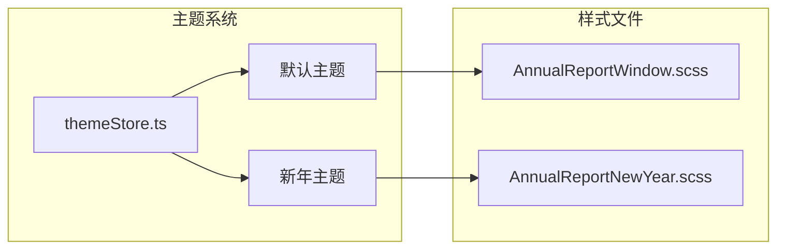
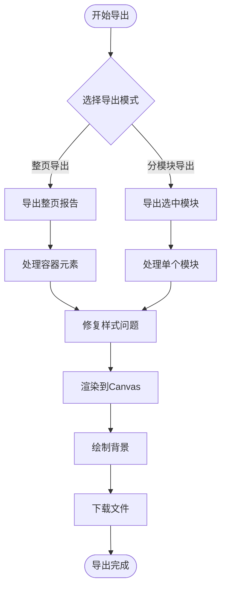
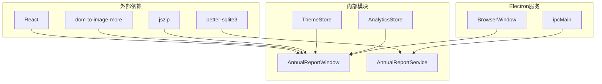

# 年度报告窗口

<cite>
**本文档引用的文件**
- [AnnualReportWindow.tsx](file://src/pages/AnnualReportWindow.tsx)
- [AnnualReportPage.tsx](file://src/pages/AnnualReportPage.tsx)
- [AnnualReportNewYear.tsx](file://src/pages/AnnualReportNewYear.tsx)
- [annualReportService.ts](file://electron/services/annualReportService.ts)
- [themeStore.ts](file://src/stores/themeStore.ts)
- [AnnualReportWindow.scss](file://src/pages/AnnualReportWindow.scss)
- [AnnualReportNewYear.scss](file://src/pages/AnnualReportNewYear.scss)
- [main.ts](file://electron/main.ts)
- [analyticsStore.ts](file://src/stores/analyticsStore.ts)
- [analytics.ts](file://src/types/analytics.ts)
- [DateRangePicker.tsx](file://src/components/DateRangePicker.tsx)
</cite>

## 目录
1. [简介](#简介)
2. [项目结构](#项目结构)
3. [核心组件](#核心组件)
4. [架构概览](#架构概览)
5. [详细组件分析](#详细组件分析)
6. [依赖关系分析](#依赖关系分析)
7. [性能考虑](#性能考虑)
8. [故障排除指南](#故障排除指南)
9. [结论](#结论)

## 简介

年度报告窗口是 CipherTalk 应用程序中的一个核心功能模块，为用户提供了微信聊天数据的年度回顾和统计分析。该功能通过深度挖掘用户的聊天历史数据，生成个性化的年度报告，包括消息统计、时间分布、联系人分析、媒体统计等多个维度的数据洞察。

该功能采用前后端分离的架构设计，前端负责数据展示和用户交互，后端负责数据处理和统计计算。系统支持多种主题模式，包括默认主题和新年主题，提供丰富的视觉体验和导出功能。

## 项目结构

年度报告功能涉及多个层次的组件和文件：



**图表来源**
- [AnnualReportWindow.tsx:1-1134](file://src/pages/AnnualReportWindow.tsx#L1-1134)
- [AnnualReportPage.tsx:1-114](file://src/pages/AnnualReportPage.tsx#L1-114)
- [annualReportService.ts:1-887](file://electron/services/annualReportService.ts#L1-887)

**章节来源**
- [AnnualReportWindow.tsx:1-1134](file://src/pages/AnnualReportWindow.tsx#L1-1134)
- [AnnualReportPage.tsx:1-114](file://src/pages/AnnualReportPage.tsx#L1-114)
- [annualReportService.ts:1-887](file://electron/services/annualReportService.ts#L1-887)

## 核心组件

### 年度报告窗口组件

年度报告窗口是整个功能的核心组件，负责渲染完整的年度报告页面。该组件实现了以下关键功能：

- **数据加载和处理**：通过 IPC 通信调用后端服务获取年度报告数据
- **主题适配**：支持默认主题和新年主题的动态切换
- **导出功能**：提供整页导出和分模块导出两种导出方式
- **响应式布局**：适配不同屏幕尺寸和设备

### 年度报告页面组件

年度报告页面作为入口组件，提供年份选择和报告生成的用户界面：

- **年份选择器**：支持选择特定年份或全部时间范围
- **报告生成**：触发年度报告窗口的创建和数据加载
- **状态管理**：处理加载状态和错误状态

### 新年主题组件

新年主题组件提供了独特的视觉体验，采用中国传统元素设计：

- **传统元素**：使用中国红、书法字体、印章等传统元素
- **动态效果**：实现视差滚动和渐变动画效果
- **文化特色**：融入中国传统文化符号和设计理念

**章节来源**
- [AnnualReportWindow.tsx:243-1134](file://src/pages/AnnualReportWindow.tsx#L243-1134)
- [AnnualReportPage.tsx:1-114](file://src/pages/AnnualReportPage.tsx#L1-114)
- [AnnualReportNewYear.tsx:1-326](file://src/pages/AnnualReportNewYear.tsx#L1-326)

## 架构概览

年度报告功能采用分层架构设计，确保了良好的可维护性和扩展性：



**图表来源**
- [AnnualReportPage.tsx:32-43](file://src/pages/AnnualReportPage.tsx#L32-43)
- [AnnualReportWindow.tsx:296-343](file://src/pages/AnnualReportWindow.tsx#L296-343)
- [annualReportService.ts:350-876](file://electron/services/annualReportService.ts#L350-876)

该架构的主要特点：

1. **前后端分离**：前端负责展示和交互，后端负责数据处理
2. **IPC 通信**：通过 Electron 的 IPC 机制实现前后端通信
3. **模块化设计**：各组件职责明确，便于维护和扩展
4. **异步处理**：采用异步模式处理耗时的数据查询和导出操作

## 详细组件分析

### 数据处理服务

年度报告服务是数据处理的核心，负责从数据库中提取和计算各种统计指标：

#### 数据聚合算法

服务实现了多种数据聚合算法来计算不同的统计指标：



**图表来源**
- [annualReportService.ts:429-592](file://electron/services/annualReportService.ts#L429-592)

#### 统计指标计算

服务计算了以下主要统计指标：

1. **消息统计**：总消息数、发送/接收消息数、联系人总数
2. **时间分布**：每日消息数、月度消息数、热力图数据
3. **联系人分析**：年度挚友、月度好友、双向奔赴好友
4. **媒体统计**：不同类型消息的比例分布
5. **行为分析**：最长连续聊天、回复速度、深夜活跃度

**章节来源**
- [annualReportService.ts:350-876](file://electron/services/annualReportService.ts#L350-876)

### 前端展示组件

#### 年度报告窗口

年度报告窗口组件实现了完整的报告展示功能：

```mermaid
classDiagram
class AnnualReportWindow {
+reportData : AnnualReportData
+isLoading : boolean
+error : string
+isExporting : boolean
+exportProgress : string
+generateReport(year)
+exportSection(section)
+exportFullReport()
+exportSelectedSections()
+toggleSection(id)
+toggleAll()
}
class Heatmap {
+data : number[][]
+maxHeat : number
+render()
}
class WordCloud {
+words : {phrase, count}[]
+maxCount : number
+render()
}
class Avatar {
+url : string
+name : string
+size : string
+render()
}
AnnualReportWindow --> Heatmap : "使用"
AnnualReportWindow --> WordCloud : "使用"
AnnualReportWindow --> Avatar : "使用"
```

**图表来源**
- [AnnualReportWindow.tsx:100-241](file://src/pages/AnnualReportWindow.tsx#L100-241)
- [AnnualReportWindow.tsx:243-1134](file://src/pages/AnnualReportWindow.tsx#L243-1134)

#### 主题适配系统

系统实现了灵活的主题适配机制：



**图表来源**
- [themeStore.ts:1-146](file://src/stores/themeStore.ts#L1-146)
- [AnnualReportWindow.scss:1-1194](file://src/pages/AnnualReportWindow.scss#L1-1194)
- [AnnualReportNewYear.scss:1-604](file://src/pages/AnnualReportNewYear.scss#L1-604)

**章节来源**
- [AnnualReportWindow.tsx:100-1134](file://src/pages/AnnualReportWindow.tsx#L100-1134)
- [themeStore.ts:1-146](file://src/stores/themeStore.ts#L1-146)

### 导出功能

系统提供了强大的导出功能，支持多种导出方式：

#### 导出流程



**图表来源**
- [AnnualReportWindow.tsx:528-704](file://src/pages/AnnualReportWindow.tsx#L528-704)

#### 导出特性

1. **固定尺寸输出**：统一 1920x1080 像素的输出尺寸
2. **背景适配**：支持默认主题和新年主题的背景绘制
3. **样式修复**：自动修复词云等复杂组件的导出样式
4. **批量处理**：支持多个模块的批量导出和打包

**章节来源**
- [AnnualReportWindow.tsx:407-704](file://src/pages/AnnualReportWindow.tsx#L407-704)

## 依赖关系分析

年度报告功能涉及多个层面的依赖关系：



**图表来源**
- [AnnualReportWindow.tsx:1-7](file://src/pages/AnnualReportWindow.tsx#L1-7)
- [annualReportService.ts:1-7](file://electron/services/annualReportService.ts#L1-7)

### 核心依赖

1. **React 生态系统**：使用 React Hooks 和函数组件模式
2. **Electron 平台**：利用 Electron 的原生能力进行系统集成
3. **数据库访问**：通过 better-sqlite3 进行高性能数据库操作
4. **图像处理**：使用 dom-to-image-more 进行页面截图和导出

**章节来源**
- [AnnualReportWindow.tsx:1-7](file://src/pages/AnnualReportWindow.tsx#L1-7)
- [annualReportService.ts:1-7](file://electron/services/annualReportService.ts#L1-7)

## 性能考虑

### 数据处理优化

年度报告服务采用了多种性能优化策略：

1. **数据库连接缓存**：缓存数据库连接避免重复建立连接
2. **查询优化**：使用索引和适当的查询条件减少数据扫描
3. **内存管理**：及时释放不再使用的数据结构和数据库连接
4. **增量处理**：支持按年份增量处理，避免全量扫描

### 前端性能优化

1. **虚拟滚动**：对于大量数据的列表使用虚拟滚动技术
2. **懒加载**：图片和复杂组件采用懒加载策略
3. **样式优化**：使用 CSS 变量和预计算样式减少重绘
4. **导出优化**：导出过程采用异步处理避免阻塞主线程

### 内存管理

系统实现了完善的内存管理机制：

- **数据库连接池**：合理管理数据库连接的生命周期
- **缓存策略**：对计算结果进行缓存避免重复计算
- **垃圾回收**：及时清理不再使用的 DOM 元素和事件监听器

## 故障排除指南

### 常见问题及解决方案

#### 数据加载失败

**问题症状**：年度报告页面显示加载失败或空白

**可能原因**：
1. 数据库文件不存在或损坏
2. 用户微信 ID 配置错误
3. 权限不足无法访问数据库文件

**解决步骤**：
1. 检查数据库文件是否存在
2. 验证用户配置是否正确
3. 确认应用程序具有足够的文件系统权限

#### 导出功能异常

**问题症状**：导出的图片质量差或格式错误

**可能原因**：
1. 页面样式影响导出效果
2. Canvas 渲染超时
3. 内存不足导致导出失败

**解决步骤**：
1. 检查网络连接和资源加载
2. 减少一次性导出的数据量
3. 清理浏览器缓存后重试

#### 主题切换问题

**问题症状**：主题切换后样式不生效

**解决步骤**：
1. 刷新页面使新主题生效
2. 检查主题配置是否正确保存
3. 清除应用缓存后重启

**章节来源**
- [AnnualReportWindow.tsx:727-761](file://src/pages/AnnualReportWindow.tsx#L727-761)
- [annualReportService.ts:290-348](file://electron/services/annualReportService.ts#L290-348)

## 结论

年度报告窗口功能展现了 CipherTalk 应用程序在数据可视化和用户体验方面的卓越设计。该功能通过精心设计的架构和算法，为用户提供了丰富而有意义的聊天数据分析。

### 主要成就

1. **全面的数据洞察**：涵盖了消息统计、时间分布、联系人分析等多个维度
2. **优秀的用户体验**：提供了流畅的交互体验和精美的视觉呈现
3. **强大的技术实现**：采用了现代化的技术栈和优化策略
4. **灵活的扩展性**：模块化设计便于未来功能扩展

### 技术亮点

- **高效的数据处理**：通过优化的数据库查询和算法实现快速响应
- **丰富的可视化**：热力图、词云等可视化组件提供了直观的数据展示
- **完善的导出系统**：支持多种导出格式和批量处理
- **优雅的主题系统**：支持动态主题切换和个性化定制

该功能不仅满足了用户对聊天数据回顾的需求，也为 CipherTalk 应用程序树立了高质量数据处理和可视化的标杆。通过持续的优化和改进，这一功能将继续为用户带来更好的使用体验。