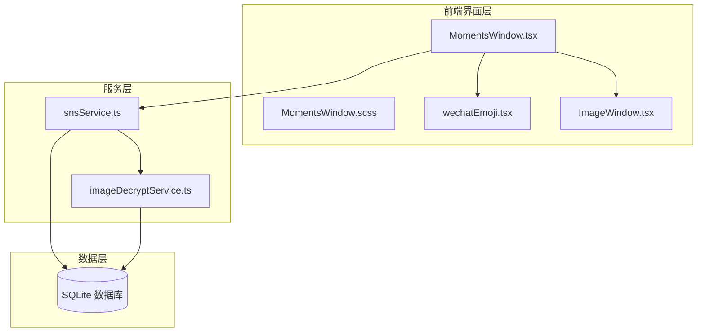
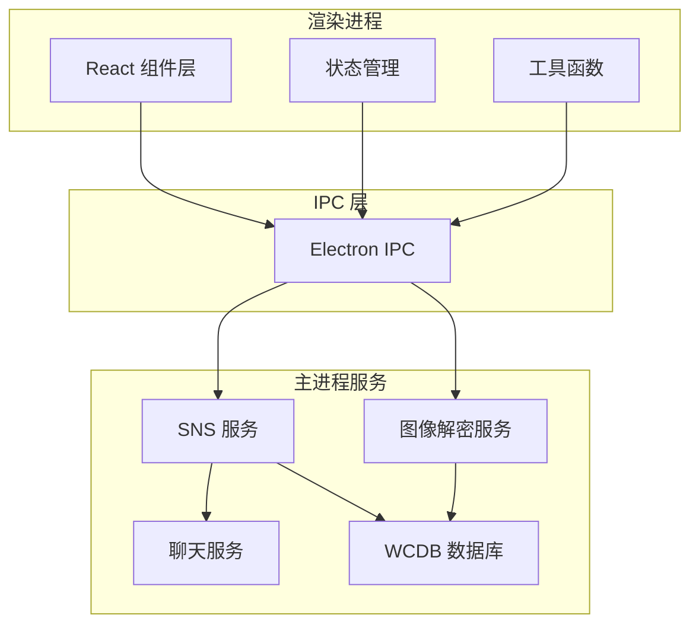
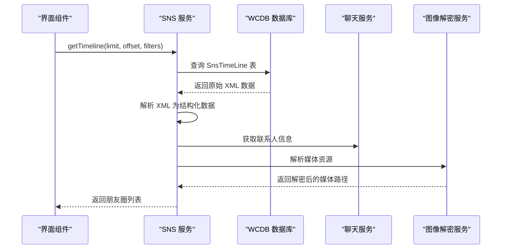
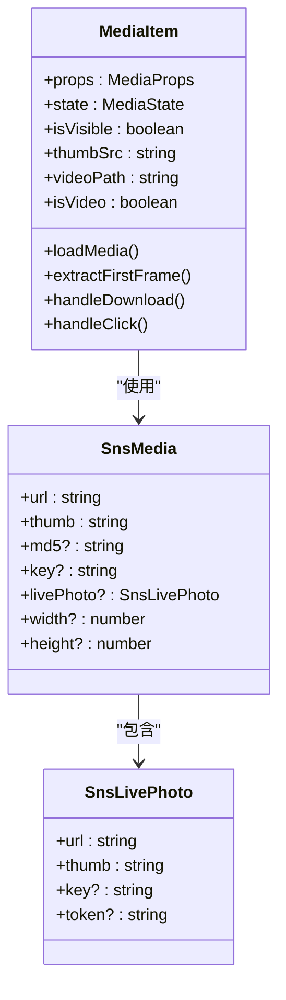
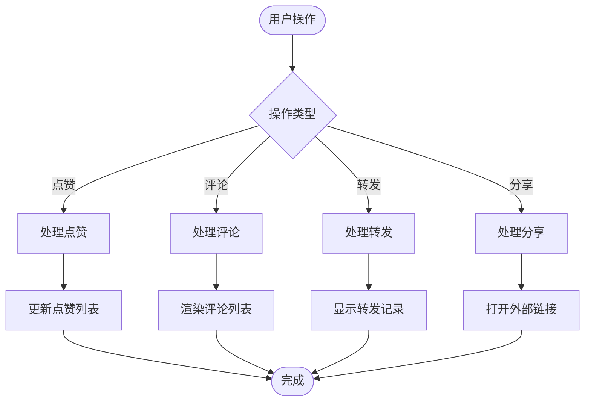
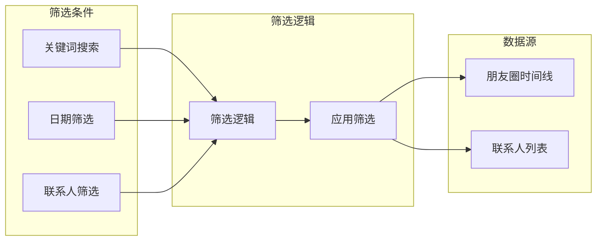
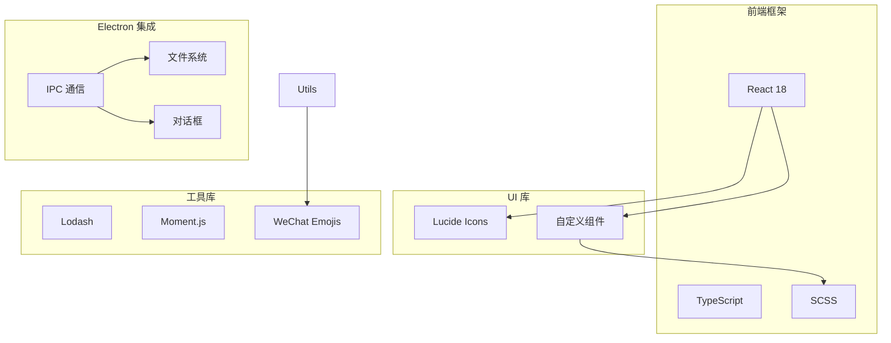
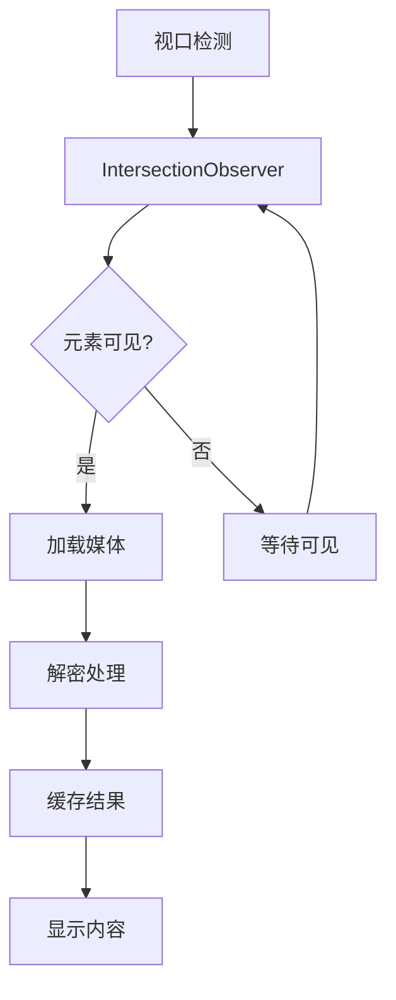
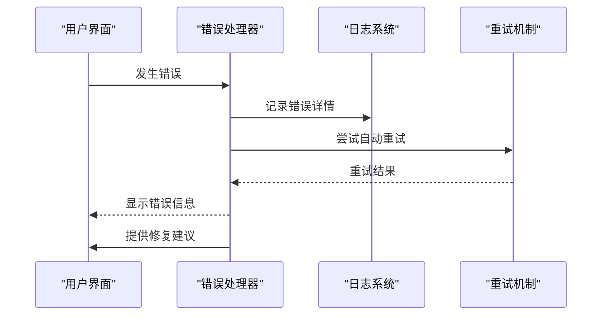

# 朋友圈窗口

<cite>
**本文档引用的文件**
- [MomentsWindow.tsx](file://src/pages/MomentsWindow.tsx)
- [MomentsWindow.scss](file://src/pages/MomentsWindow.scss)
- [snsService.ts](file://electron/services/snsService.ts)
- [imageDecryptService.ts](file://electron/services/imageDecryptService.ts)
- [wechatEmoji.tsx](file://src/utils/wechatEmoji.tsx)
- [ImageWindow.tsx](file://src/pages/ImageWindow.tsx)
</cite>

## 目录
1. [简介](#简介)
2. [项目结构](#项目结构)
3. [核心组件](#核心组件)
4. [架构概览](#架构概览)
5. [详细组件分析](#详细组件分析)
6. [依赖关系分析](#依赖关系分析)
7. [性能考虑](#性能考虑)
8. [故障排除指南](#故障排除指南)
9. [结论](#结论)
10. [附录](#附录)

## 简介
CipherTalk 的朋友圈窗口是一个功能完整的社交动态展示系统，支持多种内容类型（文字动态、图片分享、视频内容、互动评论），提供丰富的交互功能（点赞显示、评论查看、转发记录），并具备完善的性能优化策略（懒加载、虚拟滚动、图片预加载）。该系统通过 Electron 渲染进程与主进程的协作，实现了从数据库解析到界面渲染的完整朋友圈数据处理流程。

## 项目结构
朋友圈窗口功能主要分布在以下文件中：

**图表来源**
- [MomentsWindow.tsx:1-50](file://src/pages/MomentsWindow.tsx#L1-L50)
- [snsService.ts:1-50](file://electron/services/snsService.ts#L1-L50)

**章节来源**
- [MomentsWindow.tsx:1-100](file://src/pages/MomentsWindow.tsx#L1-L100)
- [MomentsWindow.scss:1-50](file://src/pages/MomentsWindow.scss#L1-L50)

## 核心组件
朋友圈窗口系统包含以下核心组件：

### 数据模型定义
系统定义了完整的 SNS 数据模型，包括：
- **SnsPost**: 朋友圈动态主体，包含用户信息、发布时间、内容描述、媒体数组、分享信息、点赞列表、评论数组
- **SnsMedia**: 媒体资源，支持图片、视频、实况照片等多种格式
- **SnsComment**: 评论数据，支持文本、表情包、图片评论
- **SnsShareInfo**: 分享卡片信息，支持链接、音乐等内容类型

### 组件架构
- **主界面组件**: MomentsWindow 负责整体布局和状态管理
- **媒体组件**: MediaItem 处理图片和视频的懒加载与解密
- **表情组件**: CommentEmoji 和 CommentImage 处理评论中的自定义表情
- **分享组件**: ShareThumb 处理分享卡片的缩略图显示
- **工具组件**: ExpandableText 支持长文折叠展开

**章节来源**
- [MomentsWindow.tsx:11-86](file://src/pages/MomentsWindow.tsx#L11-L86)
- [MomentsWindow.tsx:129-488](file://src/pages/MomentsWindow.tsx#L129-L488)

## 架构概览
朋友圈窗口采用分层架构设计，实现了清晰的职责分离：

**图表来源**
- [snsService.ts:1-100](file://electron/services/snsService.ts#L1-L100)
- [imageDecryptService.ts:44-100](file://electron/services/imageDecryptService.ts#L44-L100)

## 详细组件分析

### 数据获取与解析组件

#### SNS 服务层
SNS 服务负责从数据库中提取和解析朋友圈数据：

**图表来源**
- [snsService.ts:1341-1409](file://electron/services/snsService.ts#L1341-L1409)

#### 数据解析流程
SNS 服务实现了完整的数据解析流程：

1. **SQL 查询构建**: 支持用户名过滤、关键词搜索、时间范围过滤
2. **XML 解析**: 从原始内容中提取 createTime、contentDesc、type 等字段
3. **媒体解析**: 从 XML 中提取图片、视频、实况照片等媒体资源
4. **联系人信息**: 通过聊天服务获取用户昵称、头像等信息
5. **结构化转换**: 将解析结果转换为前端可用的数据结构

**章节来源**
- [snsService.ts:1341-1452](file://electron/services/snsService.ts#L1341-L1452)

### 媒体处理组件

#### 媒体组件架构
媒体组件负责处理各种类型的媒体内容：

**图表来源**
- [MomentsWindow.tsx:130-488](file://src/pages/MomentsWindow.tsx#L130-L488)
- [snsService.ts:14-34](file://electron/services/snsService.ts#L14-L34)

#### 媒体类型支持
系统支持多种媒体类型：

1. **静态图片**: 支持缩略图和原图解密
2. **视频内容**: 支持 MP4 格式视频解密和首帧提取
3. **实况照片**: 支持 Live Photo 的图片和视频分离处理
4. **混合媒体**: 支持多张图片的网格布局显示

**章节来源**
- [MomentsWindow.tsx:129-488](file://src/pages/MomentsWindow.tsx#L129-L488)

### 交互功能组件

#### 评论系统
评论系统提供了完整的互动功能：

**图表来源**
- [MomentsWindow.tsx:1779-1800](file://src/pages/MomentsWindow.tsx#L1779-L1800)

#### 评论渲染逻辑
评论系统支持多种内容类型：

1. **文本评论**: 基础的文本内容显示
2. **表情包评论**: 自定义微信表情包的渲染
3. **图片评论**: 评论中的图片内容展示
4. **回复评论**: 支持层级回复的评论结构

**章节来源**
- [MomentsWindow.tsx:1779-1800](file://src/pages/MomentsWindow.tsx#L1779-L1800)

### 筛选与搜索功能

#### 筛选组件架构
筛选系统提供了多维度的内容过滤：

**图表来源**
- [MomentsWindow.tsx:753-995](file://src/pages/MomentsWindow.tsx#L753-L995)

#### 筛选功能实现
系统实现了以下筛选功能：

1. **关键词搜索**: 支持动态内容的全文搜索
2. **时间筛选**: 支持按日期范围筛选朋友圈
3. **联系人筛选**: 支持按好友筛选动态内容
4. **组合筛选**: 支持多种筛选条件的组合使用

**章节来源**
- [MomentsWindow.tsx:753-995](file://src/pages/MomentsWindow.tsx#L753-L995)

## 依赖关系分析

### 技术栈依赖
朋友圈窗口系统采用了现代化的技术栈：

**图表来源**
- [MomentsWindow.tsx:1-10](file://src/pages/MomentsWindow.tsx#L1-L10)

### 外部依赖关系
系统对外部依赖的管理：

1. **数据库依赖**: 依赖 WCDB 进行 SQLite 数据库操作
2. **图像处理**: 依赖 FFmpeg 进行视频解码和图片处理
3. **表情包支持**: 依赖 wechat-emojis 包进行微信表情渲染
4. **IPC 通信**: 通过 Electron 的 IPC 机制与主进程通信

**章节来源**
- [snsService.ts:1-15](file://electron/services/snsService.ts#L1-L15)
- [imageDecryptService.ts:1-15](file://electron/services/imageDecryptService.ts#L1-L15)

## 性能考虑

### 懒加载策略
系统实现了多层次的懒加载优化：

**图表来源**
- [MomentsWindow.tsx:176-200](file://src/pages/MomentsWindow.tsx#L176-L200)

### 性能优化技术
1. **懒加载**: 使用 IntersectionObserver 实现媒体元素的懒加载
2. **缓存策略**: 实现多级缓存（内存缓存、文件缓存、表情包缓存）
3. **并发处理**: 支持多任务并发执行，提升加载效率
4. **资源预加载**: 预加载即将显示的媒体资源

### 内存管理
系统采用了智能的内存管理策略：

1. **组件卸载清理**: 自动清理观察者和定时器
2. **缓存淘汰**: 实现 LRU 缓存淘汰机制
3. **资源释放**: 及时释放不再使用的媒体资源

**章节来源**
- [MomentsWindow.tsx:176-361](file://src/pages/MomentsWindow.tsx#L176-L361)

## 故障排除指南

### 常见问题诊断
1. **媒体加载失败**: 检查网络连接和解密密钥
2. **表情包显示异常**: 验证表情包缓存和路径
3. **筛选功能失效**: 确认数据库连接和查询条件
4. **性能问题**: 检查缓存配置和并发限制

### 错误处理机制
系统实现了完善的错误处理：

**图表来源**
- [MomentsWindow.tsx:350-357](file://src/pages/MomentsWindow.tsx#L350-L357)

### 调试工具
系统提供了多种调试功能：

1. **原始数据查看**: 支持查看解析后的原始 XML 数据
2. **性能监控**: 实时监控加载时间和内存使用
3. **错误日志**: 详细的错误追踪和日志记录
4. **状态检查**: 实时显示组件状态和配置信息

**章节来源**
- [MomentsWindow.tsx:1707-1715](file://src/pages/MomentsWindow.tsx#L1707-L1715)

## 结论
CipherTalk 的朋友圈窗口功能展现了现代桌面应用的优秀实践，通过合理的架构设计、完善的性能优化和丰富的交互功能，为用户提供了流畅的朋友圈浏览体验。系统不仅支持多种内容类型的展示，还具备强大的筛选和搜索能力，同时通过智能化的缓存策略和懒加载机制，确保了良好的性能表现。

未来可以进一步扩展的功能包括：
1. 虚拟滚动支持大量数据的高效渲染
2. 更丰富的排序选项和自定义筛选规则
3. 增强的导出功能和数据备份
4. 更好的离线缓存和同步机制

## 附录

### 开发最佳实践
1. **组件设计**: 保持组件的单一职责和可复用性
2. **状态管理**: 合理使用 React hooks 进行状态管理
3. **错误处理**: 实现全面的错误边界和用户友好的错误提示
4. **性能监控**: 建立性能指标监控和优化机制

### 扩展开发指导
1. **新内容类型**: 通过扩展 SnsPost 接口支持新的内容格式
2. **筛选功能**: 基于现有筛选架构添加新的筛选条件
3. **主题定制**: 通过 CSS 变量实现主题的灵活定制
4. **国际化**: 支持多语言环境的本地化需求