# 独立窗口功能

<cite>
**本文档引用的文件**
- [electron/main.ts](file://electron/main.ts)
- [electron/preload.ts](file://electron/preload.ts)
- [src/pages/AnnualReportWindow.tsx](file://src/pages/AnnualReportWindow.tsx)
- [src/pages/MomentsWindow.tsx](file://src/pages/MomentsWindow.tsx)
- [src/pages/ImageWindow.tsx](file://src/pages/ImageWindow.tsx)
- [src/pages/ChatHistoryPage.tsx](file://src/pages/ChatHistoryPage.tsx)
- [src/stores/themeStore.ts](file://src/stores/themeStore.ts)
- [src/services/ipc.ts](file://src/services/ipc.ts)
- [src/pages/AnnualReportWindow.scss](file://src/pages/AnnualReportWindow.scss)
- [src/pages/MomentsWindow.scss](file://src/pages/MomentsWindow.scss)
- [src/pages/ImageWindow.scss](file://src/pages/ImageWindow.scss)
- [electron/services/annualReportService.ts](file://electron/services/annualReportService.ts)
- [electron/services/snsService.ts](file://electron/services/snsService.ts)
- [electron/services/chatService.ts](file://electron/services/chatService.ts)
- [src/types/electron.d.ts](file://src/types/electron.d.ts)
</cite>

## 目录
1. [简介](#简介)
2. [项目结构](#项目结构)
3. [核心组件](#核心组件)
4. [架构总览](#架构总览)
5. [详细组件分析](#详细组件分析)
6. [依赖关系分析](#依赖关系分析)
7. [性能考虑](#性能考虑)
8. [故障排除指南](#故障排除指南)
9. [结论](#结论)

## 简介

CipherTalk 的独立窗口功能是一个完整的桌面应用程序窗口系统，支持多种专用窗口类型，包括聊天历史窗口、年度报告窗口、朋友圈窗口和图片查看窗口。该系统采用 Electron + React 技术栈，实现了跨平台的独立窗口管理、主题系统集成、窗口间通信以及高性能的媒体处理能力。

## 项目结构

项目采用前后端分离的架构设计，主要分为以下层次：

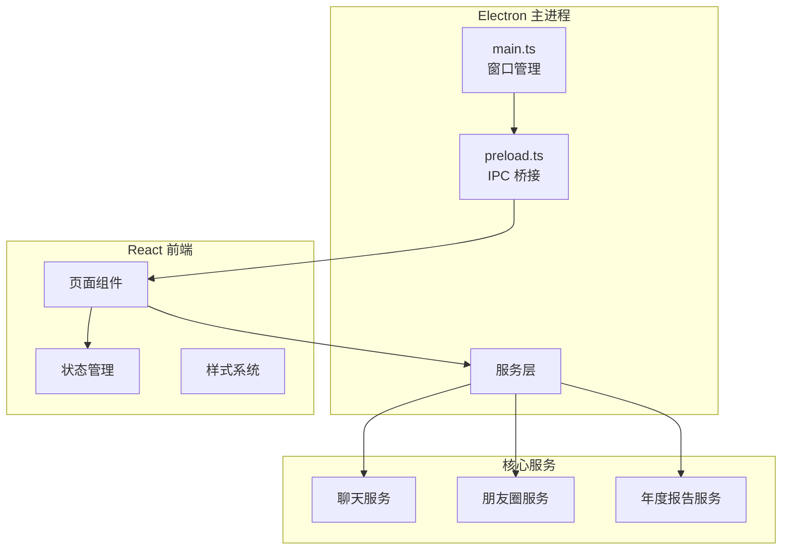

**图表来源**
- [electron/main.ts:1-800](file://electron/main.ts#L1-L800)
- [electron/preload.ts:1-454](file://electron/preload.ts#L1-L454)

**章节来源**
- [electron/main.ts:1-800](file://electron/main.ts#L1-L800)
- [electron/preload.ts:1-454](file://electron/preload.ts#L1-L454)

## 核心组件

### 窗口管理系统

系统支持九种不同类型的独立窗口，每种窗口都有其特定的功能和配置：

| 窗口类型 | 文件路径 | 功能描述 | 窗口尺寸 |
|---------|----------|----------|----------|
| 聊天窗口 | `src/pages/ChatPage.tsx` | 主聊天界面 | 1000×700 |
| 朋友圈窗口 | `src/pages/MomentsWindow.tsx` | 微信朋友圈浏览 | 1200×800 |
| 年度报告窗口 | `src/pages/AnnualReportWindow.tsx` | 年度统计报告 | 1200×800 |
| 图片查看窗口 | `src/pages/ImageWindow.tsx` | 图片和视频查看 | 自适应 |
| 聊天记录窗口 | `src/pages/ChatHistoryPage.tsx` | 单条消息详情 | 600×800 |
| 群聊分析窗口 | `src/pages/GroupAnalyticsPage.tsx` | 群组数据分析 | 1100×750 |
| 协议窗口 | `src/pages/AgreementPage.tsx` | 用户协议展示 | 800×700 |
| 购买窗口 | `src/pages/ActivationPage.tsx` | 许可证购买 | 1000×700 |
| 引导窗口 | `src/pages/WelcomePage.tsx` | 首次启动引导 | 1100×760 |

### 主题系统集成

系统实现了完整的主题系统，支持多种主题和模式：

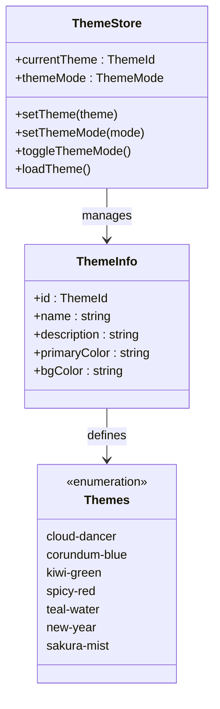

**图表来源**
- [src/stores/themeStore.ts:1-146](file://src/stores/themeStore.ts#L1-L146)

**章节来源**
- [src/stores/themeStore.ts:1-146](file://src/stores/themeStore.ts#L1-L146)

## 架构总览

### 窗口生命周期管理

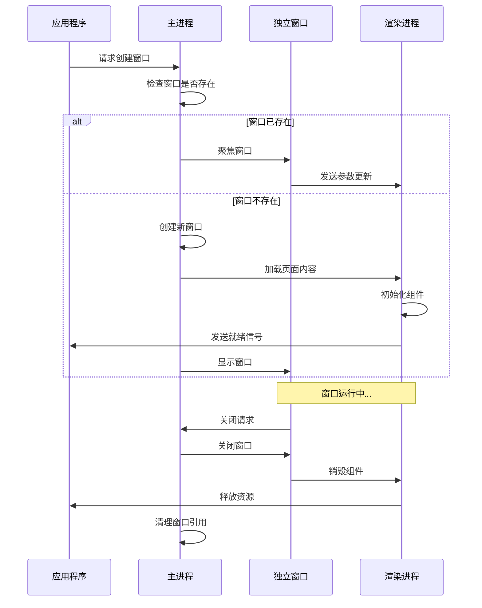

**图表来源**
- [electron/main.ts:590-659](file://electron/main.ts#L590-L659)
- [electron/main.ts:1380-1408](file://electron/main.ts#L1380-L1408)

### 窗口间通信机制

系统通过 IPC（进程间通信）实现窗口间的高效通信：

```mermaid
graph LR
subgraph "主进程"
IPC[IPC 通道]
WindowManager[窗口管理器]
end
subgraph "渲染进程"
WindowA[窗口A]
WindowB[窗口B]
WindowC[窗口C]
end
WindowManager <- --> IPC < --> WindowA
WindowManager <- --> IPC < --> WindowB
WindowManager <- --> IPC < --> WindowC
WindowA -.->|"消息/事件"| WindowB
WindowB -.->|"状态同步"| WindowC
WindowA -.->|"参数传递"| WindowC
```

**图表来源**
- [electron/preload.ts:71-114](file://electron/preload.ts#L71-L114)
- [src/types/electron.d.ts:15-46](file://src/types/electron.d.ts#L15-L46)

**章节来源**
- [electron/preload.ts:71-114](file://electron/preload.ts#L71-L114)
- [src/types/electron.d.ts:15-46](file://src/types/electron.d.ts#L15-L46)

## 详细组件分析

### 年度报告窗口

年度报告窗口是系统中最复杂的独立窗口，提供了丰富的统计数据可视化功能：

#### 核心功能特性

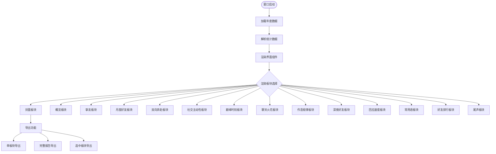

**图表来源**
- [src/pages/AnnualReportWindow.tsx:243-800](file://src/pages/AnnualReportWindow.tsx#L243-L800)

#### 数据处理流程

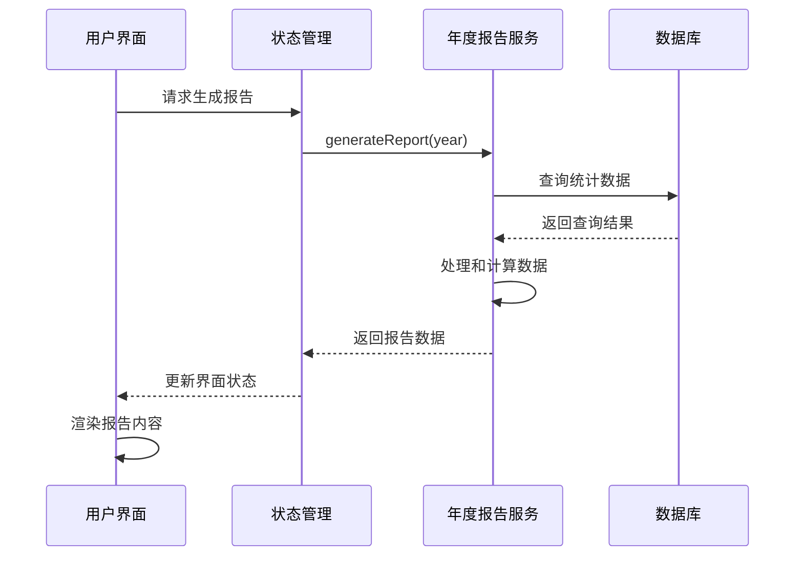

**图表来源**
- [electron/services/annualReportService.ts:79-200](file://electron/services/annualReportService.ts#L79-L200)
- [src/pages/AnnualReportWindow.tsx:296-343](file://src/pages/AnnualReportWindow.tsx#L296-L343)

**章节来源**
- [src/pages/AnnualReportWindow.tsx:243-800](file://src/pages/AnnualReportWindow.tsx#L243-L800)
- [electron/services/annualReportService.ts:79-200](file://electron/services/annualReportService.ts#L79-L200)

### 朋友圈窗口

朋友圈窗口实现了微信朋友圈的完整浏览体验：

#### 媒体处理架构

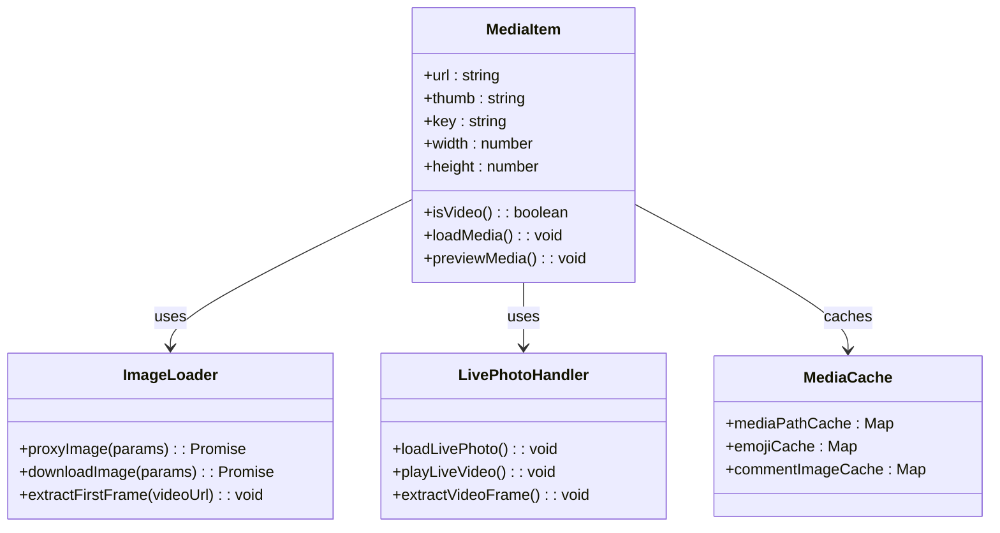

**图表来源**
- [src/pages/MomentsWindow.tsx:126-488](file://src/pages/MomentsWindow.tsx#L126-L488)

#### 窗口交互流程

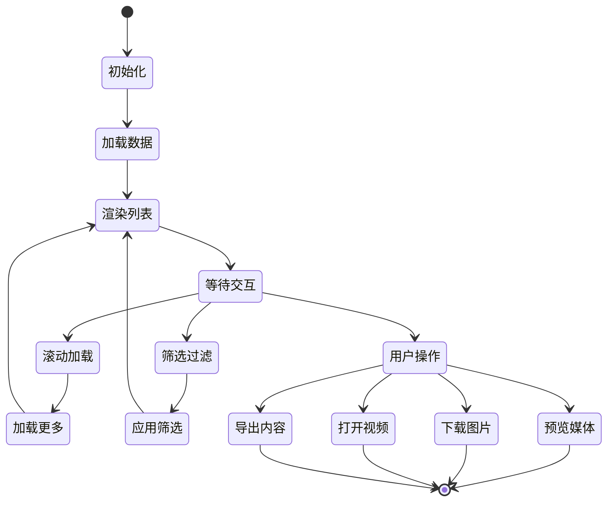

**图表来源**
- [src/pages/MomentsWindow.tsx:746-800](file://src/pages/MomentsWindow.tsx#L746-L800)

**章节来源**
- [src/pages/MomentsWindow.tsx:126-488](file://src/pages/MomentsWindow.tsx#L126-L488)
- [src/pages/MomentsWindow.tsx:746-800](file://src/pages/MomentsWindow.tsx#L746-L800)

### 图片查看窗口

图片查看窗口提供了专业的图片浏览和编辑功能：

#### 图片处理流程

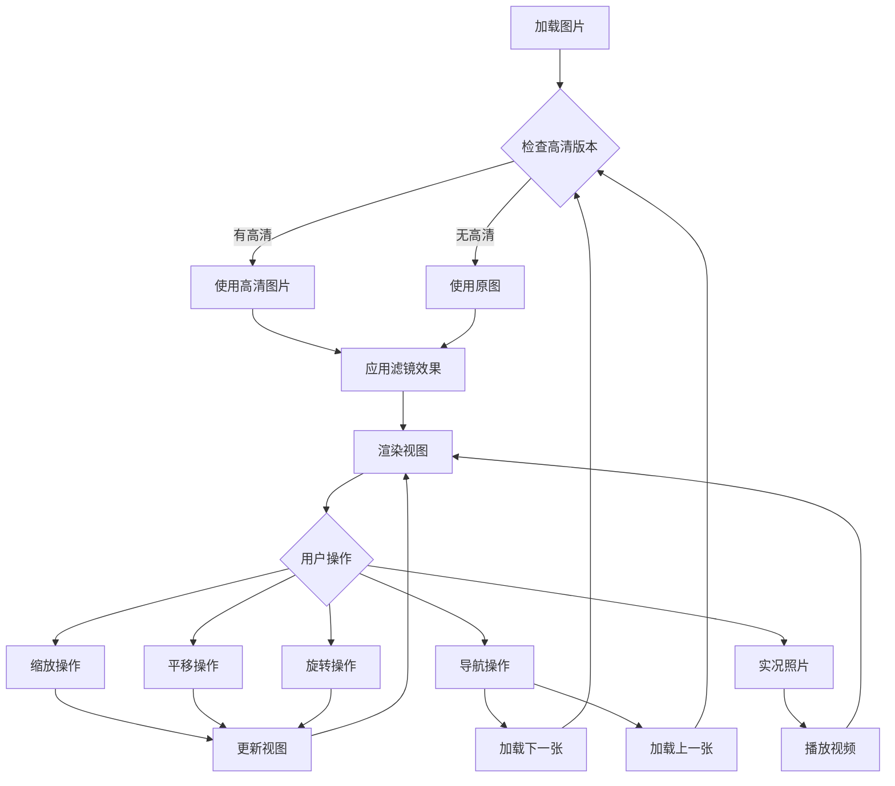

**图表来源**
- [src/pages/ImageWindow.tsx:8-519](file://src/pages/ImageWindow.tsx#L8-L519)

#### 高级功能实现

| 功能特性 | 实现方式 | 性能优化 |
|---------|----------|----------|
| 图片缩放 | CSS transform + 鼠标滚轮 | 虚拟化渲染 |
| 图片平移 | 鼠标拖拽 + 边界检测 | 节流处理 |
| 图片旋转 | CSS rotate + 状态同步 | 预计算变换矩阵 |
| 实况照片 | HTML5 Video + Canvas | 懒加载视频帧 |
| 多图导航 | 事件监听 + 状态管理 | 内存缓存列表 |

**章节来源**
- [src/pages/ImageWindow.tsx:8-519](file://src/pages/ImageWindow.tsx#L8-L519)

### 聊天历史窗口

聊天历史窗口专门用于展示单条消息的详细信息：

#### 数据解析流程

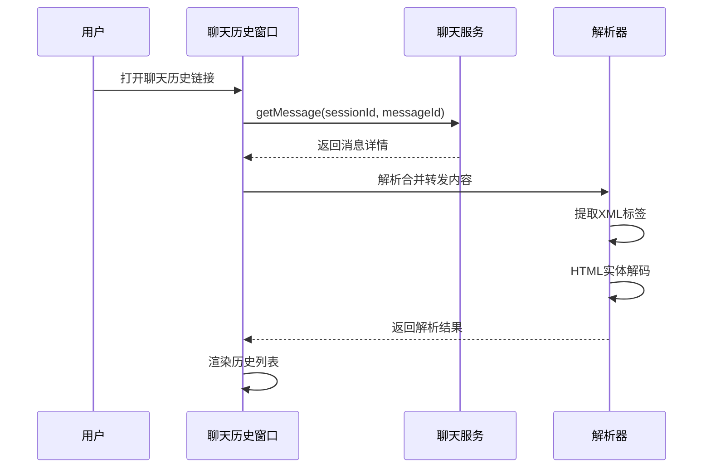

**图表来源**
- [src/pages/ChatHistoryPage.tsx:114-152](file://src/pages/ChatHistoryPage.tsx#L114-L152)

**章节来源**
- [src/pages/ChatHistoryPage.tsx:114-152](file://src/pages/ChatHistoryPage.tsx#L114-L152)

## 依赖关系分析

### 核心依赖图

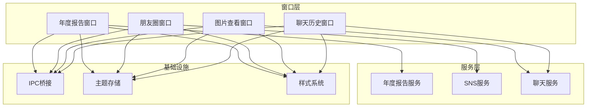

**图表来源**
- [electron/main.ts:95-113](file://electron/main.ts#L95-L113)
- [electron/preload.ts:4-435](file://electron/preload.ts#L4-L435)

### 数据流依赖

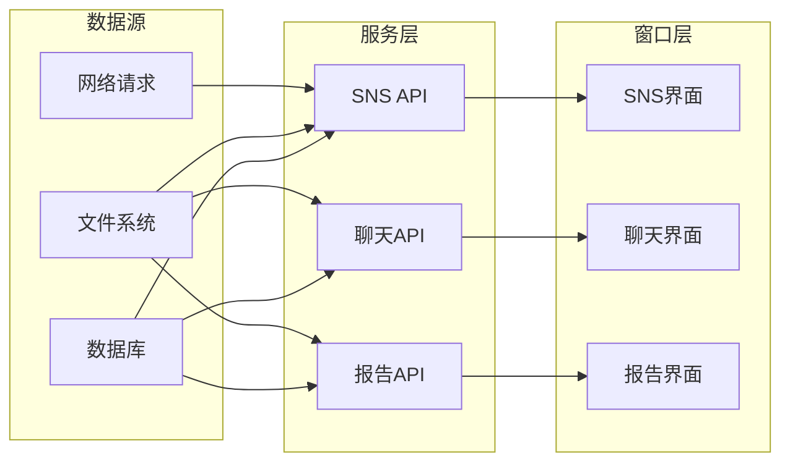

**图表来源**
- [electron/services/snsService.ts:1-200](file://electron/services/snsService.ts#L1-L200)
- [electron/services/chatService.ts:1-200](file://electron/services/chatService.ts#L1-L200)
- [electron/services/annualReportService.ts:1-200](file://electron/services/annualReportService.ts#L1-L200)

**章节来源**
- [electron/main.ts:95-113](file://electron/main.ts#L95-L113)
- [electron/preload.ts:4-435](file://electron/preload.ts#L4-L435)

## 性能考虑

### 内存管理优化

系统采用了多层次的内存管理策略：

1. **组件生命周期管理**
   - 使用 React hooks 管理组件状态
   - 及时清理事件监听器和定时器
   - 实现正确的依赖数组避免内存泄漏

2. **媒体资源管理**
   - 图片和视频的懒加载机制
   - 媒体缓存的智能清理策略
   - 大文件的分块处理

3. **窗口资源管理**
   - 窗口关闭时自动清理资源
   - IPC 通道的正确关闭
   - 定时器和监听器的统一管理

### 渲染性能优化

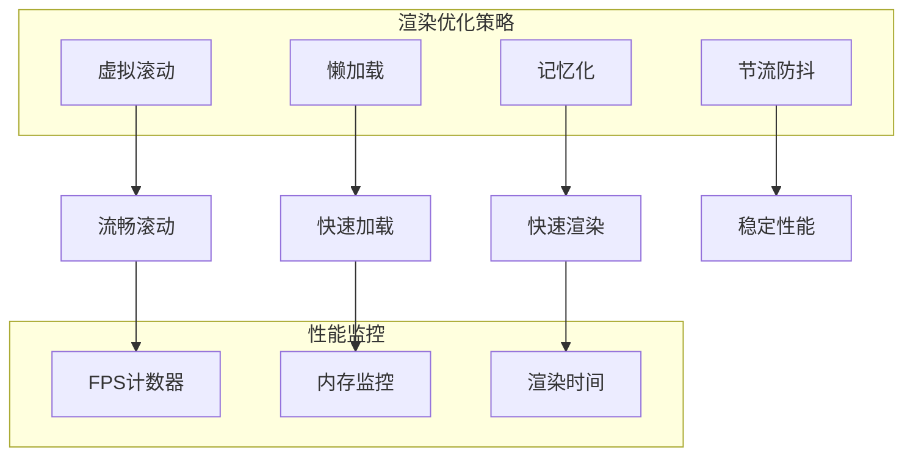

### 资源复用机制

系统实现了高效的资源复用机制：

1. **图片缓存系统**
   - 媒体路径缓存（mediaPathCache）
   - 表情包缓存（emojiCache）
   - 评论图片缓存（commentImageCache）

2. **窗口复用策略**
   - 窗口实例的单例管理
   - 窗口状态的持久化
   - 窗口参数的传递优化

3. **主题资源管理**
   - 主题样式的动态加载
   - CSS变量的统一管理
   - 样式缓存的智能更新

## 故障排除指南

### 常见问题诊断

#### 窗口创建失败

**症状表现**：窗口无法正常打开或立即关闭

**诊断步骤**：
1. 检查主进程日志输出
2. 验证窗口配置参数
3. 确认主题参数传递
4. 检查窗口尺寸设置

**解决方案**：
```typescript
// 窗口创建异常处理示例
try {
    const window = createMomentsWindow(filterUsername);
    if (!window) {
        throw new Error('窗口创建失败');
    }
} catch (error) {
    console.error('窗口创建错误:', error);
    // 回退到默认配置
    const defaultWindow = createMomentsWindow();
}
```

#### 媒体加载超时

**症状表现**：图片或视频长时间无法加载

**诊断步骤**：
1. 检查网络连接状态
2. 验证媒体URL有效性
3. 确认解密密钥正确性
4. 检查缓存状态

**解决方案**：
```typescript
// 媒体加载重试机制
const loadImageWithRetry = async (url: string, retries: number = 3) => {
    for (let i = 0; i < retries; i++) {
        try {
            const result = await window.electronAPI.sns.proxyImage({ url });
            if (result.success) {
                return result;
            }
        } catch (error) {
            if (i === retries - 1) throw error;
            await new Promise(resolve => setTimeout(resolve, 1000 * (i + 1)));
        }
    }
};
```

#### 内存泄漏问题

**症状表现**：应用内存持续增长

**诊断步骤**：
1. 使用Chrome DevTools分析内存快照
2. 检查事件监听器是否正确清理
3. 验证定时器是否及时清除
4. 确认组件卸载时的状态清理

**解决方案**：
```typescript
// 正确的清理模式
useEffect(() => {
    const cleanup = () => {
        // 清理代码
        window.removeEventListener('resize', handleResize);
        clearTimeout(timer);
        // 清理其他资源
    };
    
    return cleanup;
}, []);
```

**章节来源**
- [src/pages/MomentsWindow.tsx:126-488](file://src/pages/MomentsWindow.tsx#L126-L488)
- [src/pages/ImageWindow.tsx:8-519](file://src/pages/ImageWindow.tsx#L8-L519)

## 结论

CipherTalk 的独立窗口功能展现了现代桌面应用的优秀实践，通过精心设计的架构和完善的优化策略，实现了高性能、可扩展的窗口管理系统。系统的主要优势包括：

1. **模块化设计**：清晰的组件分离和职责划分
2. **性能优化**：多层次的性能优化策略
3. **用户体验**：流畅的交互和响应式设计
4. **可维护性**：良好的代码结构和文档支持

未来可以进一步优化的方向包括：
- 增强窗口间的数据共享机制
- 实现更精细的性能监控
- 扩展更多的窗口类型
- 优化移动端适配

这个窗口系统为前端开发者提供了优秀的参考案例，展示了如何在 Electron 环境下构建高质量的独立窗口应用。