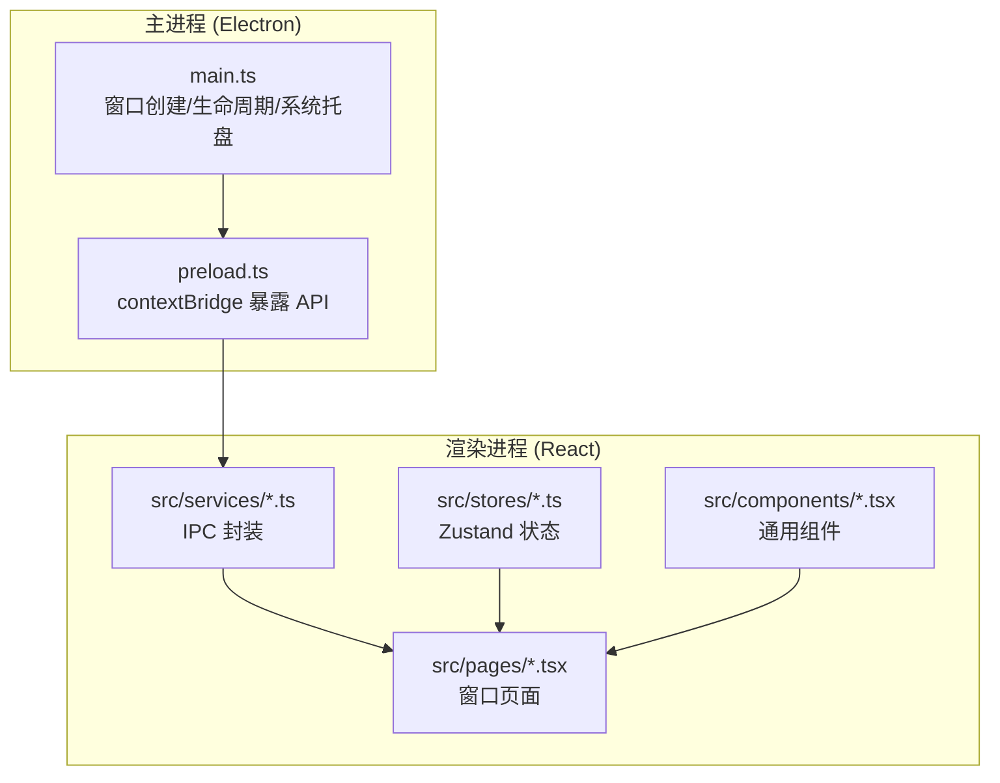
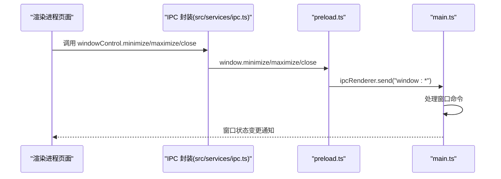
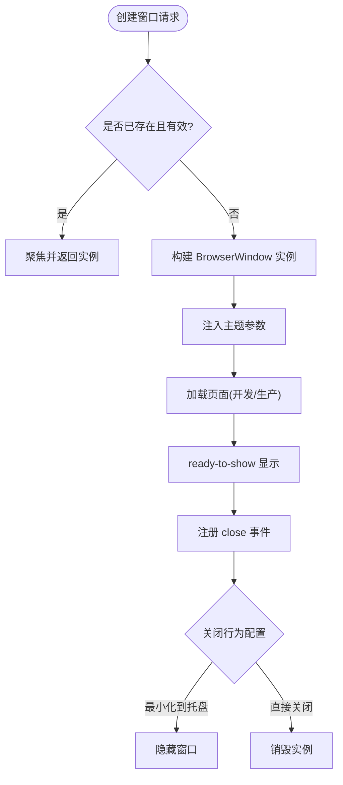
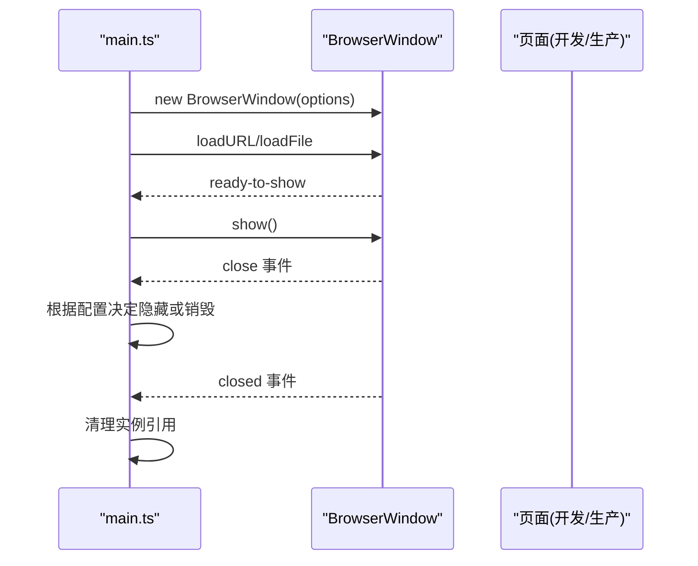
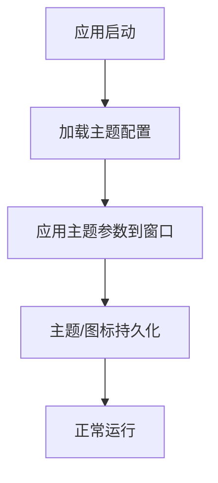
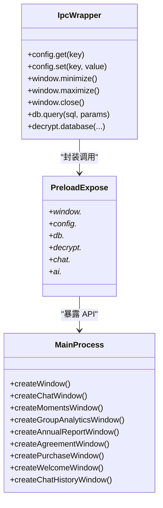
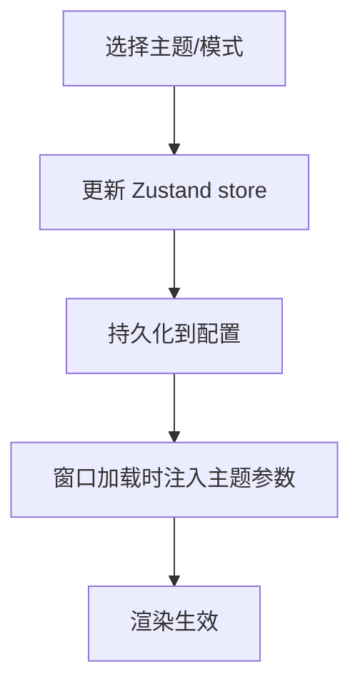
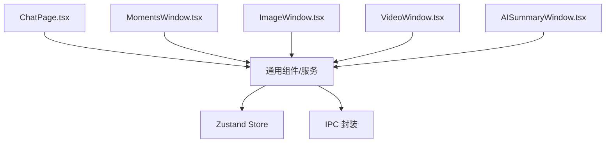
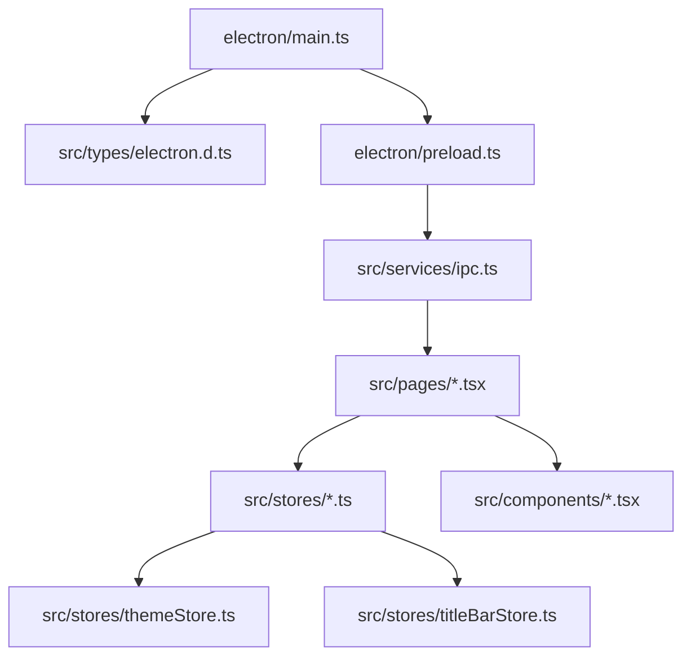

# 窗口系统架构

<cite>
**本文档引用的文件**
- [electron/main.ts](file://electron/main.ts)
- [electron/preload.ts](file://electron/preload.ts)
- [src/services/ipc.ts](file://src/services/ipc.ts)
- [src/stores/themeStore.ts](file://src/stores/themeStore.ts)
- [src/stores/titleBarStore.ts](file://src/stores/titleBarStore.ts)
- [src/pages/AISummaryWindow.tsx](file://src/pages/AISummaryWindow.tsx)
- [src/pages/MomentsWindow.tsx](file://src/pages/MomentsWindow.tsx)
- [src/pages/ImageWindow.tsx](file://src/pages/ImageWindow.tsx)
- [src/pages/VideoWindow.tsx](file://src/pages/VideoWindow.tsx)
- [src/components/TitleBar.tsx](file://src/components/TitleBar.tsx)
- [src/types/electron.d.ts](file://src/types/electron.d.ts)
</cite>

## 目录
1. [引言](#引言)
2. [项目结构](#项目结构)
3. [核心组件](#核心组件)
4. [架构总览](#架构总览)
5. [详细组件分析](#详细组件分析)
6. [依赖关系分析](#依赖关系分析)
7. [性能考虑](#性能考虑)
8. [故障排除指南](#故障排除指南)
9. [结论](#结论)

## 引言
本文件面向开发者，系统性梳理 CipherTalk 的窗口系统架构与实现细节，覆盖以下主题：
- 窗口类型分类与生命周期管理
- 窗口创建与销毁流程
- 窗口配置系统（尺寸记忆、位置保存、状态持久化）
- 窗口间通信机制（IPC、事件传递、数据共享）
- 窗口主题系统（主题继承、样式隔离、动态切换）
- 窗口性能优化（内存管理、渲染优化、资源复用）
- 窗口扩展方法（新窗口类型开发规范、通用组件设计）

## 项目结构
CipherTalk 的窗口系统采用 Electron + React 技术栈，主进程负责窗口生命周期与系统集成，渲染进程负责 UI 与业务逻辑。关键目录与职责如下：
- electron：主进程代码，包含窗口创建、系统托盘、IPC 处理等
- src：渲染进程代码，包含页面组件、状态管理、IPC 封装
- src/pages：各窗口页面组件（聊天、朋友圈、年度报告、图片查看器、视频播放器、AI 摘要等）
- src/stores：Zustand 状态管理（主题、标题栏、应用状态等）
- src/services：前端 IPC 封装与工具
- src/components：通用 UI 组件（如标题栏）

**图表来源**
- [electron/main.ts:1-800](file://electron/main.ts#L1-L800)
- [electron/preload.ts:1-454](file://electron/preload.ts#L1-L454)
- [src/services/ipc.ts:1-38](file://src/services/ipc.ts#L1-L38)

**章节来源**
- [electron/main.ts:1-800](file://electron/main.ts#L1-L800)
- [electron/preload.ts:1-454](file://electron/preload.ts#L1-L454)
- [src/services/ipc.ts:1-38](file://src/services/ipc.ts#L1-L38)

## 核心组件
- 窗口创建器：主进程集中管理各类窗口实例，统一初始化配置、主题注入与生命周期钩子
- IPC 桥接层：preload.ts 通过 contextBridge 暴露安全 API，渲染进程通过 src/services/ipc.ts 封装调用
- 窗口页面：各功能窗口以 React 页面组件形式实现，承载业务逻辑与 UI
- 状态管理：Zustand store 管理主题、标题栏、应用状态等跨窗口共享数据
- 通用组件：标题栏等组件在多窗口复用，保证一致的交互体验

**章节来源**
- [electron/main.ts:193-800](file://electron/main.ts#L193-L800)
- [electron/preload.ts:4-435](file://electron/preload.ts#L4-L435)
- [src/services/ipc.ts:1-38](file://src/services/ipc.ts#L1-L38)
- [src/stores/themeStore.ts:1-146](file://src/stores/themeStore.ts#L1-L146)
- [src/stores/titleBarStore.ts:1-13](file://src/stores/titleBarStore.ts#L1-L13)

## 架构总览
窗口系统采用“主进程统一调度 + 渲染进程页面化”的双层架构。主进程负责：
- 窗口实例管理（单例/聚焦/新建）
- 主题参数传递（查询参数注入）
- 系统托盘与最小化到托盘行为
- 与渲染进程的 IPC 通道建立与事件监听

渲染进程负责：
- 页面组件与业务逻辑
- IPC 封装调用（配置、数据库、解密、窗口控制等）
- 状态管理与主题切换
- 通用组件复用

**图表来源**
- [src/services/ipc.ts:32-37](file://src/services/ipc.ts#L32-L37)
- [electron/preload.ts:72-76](file://electron/preload.ts#L72-L76)
- [electron/main.ts:193-800](file://electron/main.ts#L193-L800)

## 详细组件分析

### 窗口类型与生命周期管理
- 主窗口：标准浏览器窗口，支持最小化到托盘、关闭行为配置
- 独立窗口：聊天窗口、朋友圈窗口、群聊分析窗口、年度报告窗口、AI 摘要窗口、欢迎窗口、聊天记录窗口等
- 无框透明窗口：欢迎窗口采用 frameless + transparent
- 窗口单例：同一类型窗口仅允许一个实例存在，重复打开时聚焦已有窗口
- 生命周期钩子：ready-to-show 显示、close 事件拦截、closed 清理实例

**图表来源**
- [electron/main.ts:193-800](file://electron/main.ts#L193-L800)

**章节来源**
- [electron/main.ts:193-800](file://electron/main.ts#L193-L800)

### 窗口创建与销毁流程
- 主窗口创建：初始化服务、设置图标、webPreferences、标题栏覆盖、show=false、开发/生产环境加载
- 独立窗口创建：统一的 create*Window 函数，包含尺寸、最小尺寸、图标、标题栏覆盖、背景色、主题参数注入、ready-to-show 显示、关闭事件处理
- 销毁流程：closed 事件清理实例引用，确保后续可重建

**图表来源**
- [electron/main.ts:193-800](file://electron/main.ts#L193-L800)

**章节来源**
- [electron/main.ts:193-800](file://electron/main.ts#L193-L800)

### 窗口配置系统（尺寸记忆、位置保存、状态持久化）
- 主题持久化：主题与主题模式通过配置服务持久化，渲染进程通过 window.electronAPI.config 读写
- 应用图标持久化：支持切换应用图标并持久化
- 窗口状态：主进程根据 closeToTray 配置决定最小化到托盘还是直接关闭；窗口尺寸与位置在 Electron 层由系统管理，应用层面未见显式的尺寸/位置持久化逻辑

**图表来源**
- [electron/main.ts:118-141](file://electron/main.ts#L118-L141)
- [src/stores/themeStore.ts:85-111](file://src/stores/themeStore.ts#L85-L111)

**章节来源**
- [electron/main.ts:118-141](file://electron/main.ts#L118-L141)
- [src/stores/themeStore.ts:85-111](file://src/stores/themeStore.ts#L85-L111)

### 窗口间通信机制（IPC、事件传递、数据共享）
- IPC 封装：src/services/ipc.ts 对 window.electronAPI 的常用能力进行封装，便于页面直接调用
- preload 暴露：electron/preload.ts 通过 contextBridge.exposeInMainWorld 暴露 electronAPI，涵盖窗口控制、配置、数据库、解密、聊天、导出、AI 等
- 事件传递：窗口间通过 IPC 事件传递数据（如朋友圈筛选、图片列表更新、AI 流式输出等）
- 数据共享：通过 preload 同步主题配置到 localStorage，实现主窗口场景的主题同步

**图表来源**
- [src/services/ipc.ts:1-38](file://src/services/ipc.ts#L1-L38)
- [electron/preload.ts:4-435](file://electron/preload.ts#L4-L435)
- [electron/main.ts:193-800](file://electron/main.ts#L193-L800)

**章节来源**
- [src/services/ipc.ts:1-38](file://src/services/ipc.ts#L1-L38)
- [electron/preload.ts:4-435](file://electron/preload.ts#L4-L435)
- [src/types/electron.d.ts:15-46](file://src/types/electron.d.ts#L15-L46)

### 窗口主题系统（主题继承、样式隔离、动态切换）
- 主题枚举与信息：主题 ID、名称、描述、主色、背景色等定义于主题存储
- 动态切换：通过设置主题与主题模式，异步持久化到配置，并触发 UI 刷新
- 样式隔离：每个窗口通过查询参数注入主题与模式，避免全局样式污染
- 应用图标：支持切换应用图标并持久化

**图表来源**
- [src/stores/themeStore.ts:1-146](file://src/stores/themeStore.ts#L1-L146)
- [electron/main.ts:118-123](file://electron/main.ts#L118-L123)

**章节来源**
- [src/stores/themeStore.ts:1-146](file://src/stores/themeStore.ts#L1-L146)
- [electron/main.ts:118-123](file://electron/main.ts#L118-L123)

### 窗口页面示例与扩展（聊天、朋友圈、图片、视频、AI 摘要）
- 聊天页面：会话列表、消息渲染、懒加载头像、骨架屏、消息内容解析等
- 朋友圈页面：动态内容解析、媒体懒加载、Live Photo 预览、评论与点赞处理
- 图片查看器：多图导航、缩放旋转、拖拽平移、高清图强制升级、Live Photo 播放
- 视频播放器：播放/暂停、进度条、音量、快捷键、根据视频尺寸调整窗口大小
- AI 摘要窗口：流式输出处理、思考过程可视化、历史记录管理、提供商信息展示

**图表来源**
- [src/pages/ChatPage.tsx:1-200](file://src/pages/ChatPage.tsx#L1-L200)
- [src/pages/MomentsWindow.tsx:1-200](file://src/pages/MomentsWindow.tsx#L1-L200)
- [src/pages/ImageWindow.tsx:1-200](file://src/pages/ImageWindow.tsx#L1-L200)
- [src/pages/VideoWindow.tsx:1-200](file://src/pages/VideoWindow.tsx#L1-L200)
- [src/pages/AISummaryWindow.tsx:1-743](file://src/pages/AISummaryWindow.tsx#L1-L743)

**章节来源**
- [src/pages/ChatPage.tsx:1-200](file://src/pages/ChatPage.tsx#L1-L200)
- [src/pages/MomentsWindow.tsx:1-200](file://src/pages/MomentsWindow.tsx#L1-L200)
- [src/pages/ImageWindow.tsx:1-200](file://src/pages/ImageWindow.tsx#L1-L200)
- [src/pages/VideoWindow.tsx:1-200](file://src/pages/VideoWindow.tsx#L1-L200)
- [src/pages/AISummaryWindow.tsx:1-743](file://src/pages/AISummaryWindow.tsx#L1-L743)

## 依赖关系分析
- 主进程依赖：BrowserWindow、ipcMain、protocol、nativeTheme、Menu、Tray 等
- 渲染进程依赖：Zustand、React、React Router、lucide-react、dom-to-image-more、JSZip 等
- IPC 依赖：preload.ts 暴露 electronAPI，src/services/ipc.ts 封装常用调用
- 状态依赖：主题、标题栏、应用状态通过 Zustand store 管理

**图表来源**
- [electron/main.ts:1-800](file://electron/main.ts#L1-L800)
- [electron/preload.ts:1-454](file://electron/preload.ts#L1-L454)
- [src/services/ipc.ts:1-38](file://src/services/ipc.ts#L1-L38)
- [src/stores/themeStore.ts:1-146](file://src/stores/themeStore.ts#L1-L146)
- [src/stores/titleBarStore.ts:1-13](file://src/stores/titleBarStore.ts#L1-L13)
- [src/types/electron.d.ts:1-800](file://src/types/electron.d.ts#L1-L800)

**章节来源**
- [electron/main.ts:1-800](file://electron/main.ts#L1-L800)
- [electron/preload.ts:1-454](file://electron/preload.ts#L1-L454)
- [src/services/ipc.ts:1-38](file://src/services/ipc.ts#L1-L38)
- [src/stores/themeStore.ts:1-146](file://src/stores/themeStore.ts#L1-L146)
- [src/stores/titleBarStore.ts:1-13](file://src/stores/titleBarStore.ts#L1-L13)
- [src/types/electron.d.ts:1-800](file://src/types/electron.d.ts#L1-L800)

## 性能考虑
- 渲染优化
  - 图片懒加载与骨架屏：会话头像、朋友圈媒体均采用 IntersectionObserver 懒加载与骨架屏，减少首屏阻塞
  - 虚拟列表：聊天页面使用 react-window 的 List 组件，按需渲染可见行，降低 DOM 节点数量
  - DOM 操作最小化：图片查看器与视频播放器通过 CSS 变换实现缩放与旋转，避免频繁重排
- 资源复用
  - 图片解密缓存：图片查看器支持强制升级高清图，避免重复解密
  - 主题参数注入：通过查询参数一次性注入主题，避免重复计算
- 内存管理
  - 窗口关闭清理：closed 事件清理实例引用，防止内存泄漏
  - 事件监听清理：窗口页面在卸载时清理 IPC 监听与定时器

[本节为通用性能建议，无需特定文件引用]

## 故障排除指南
- 窗口无法显示或闪烁
  - 检查 ready-to-show 与 show 的配合，确认窗口创建选项（webPreferences、titleBarStyle、backgroundColor）正确
  - 确认主题参数注入是否成功
- 关闭行为异常
  - 检查 closeToTray 配置，确认 close 事件处理逻辑
- IPC 调用失败
  - 确认 preload.ts 已正确暴露 electronAPI
  - 检查 src/services/ipc.ts 封装是否匹配 preload.ts 暴露的方法签名
- 主题切换无效
  - 检查主题存储与持久化逻辑，确认窗口加载时注入了正确的主题参数

**章节来源**
- [electron/main.ts:233-258](file://electron/main.ts#L233-L258)
- [electron/preload.ts:4-435](file://electron/preload.ts#L4-L435)
- [src/services/ipc.ts:1-38](file://src/services/ipc.ts#L1-L38)
- [src/stores/themeStore.ts:85-111](file://src/stores/themeStore.ts#L85-L111)

## 结论
CipherTalk 的窗口系统通过主进程统一调度与渲染进程模块化页面的组合，实现了稳定、可扩展且高性能的多窗口架构。其特点包括：
- 窗口类型清晰、生命周期可控、单例与聚焦策略明确
- IPC 通道安全可靠，API 封装简洁易用
- 主题系统支持动态切换与持久化，样式隔离良好
- 页面组件广泛采用懒加载、虚拟列表等优化手段，兼顾体验与性能

未来扩展建议：
- 在应用层面增加窗口尺寸与位置的持久化策略
- 为窗口间通信引入更细粒度的事件模型与错误处理
- 增加窗口状态监控与诊断工具，提升可观测性