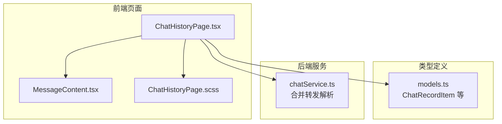
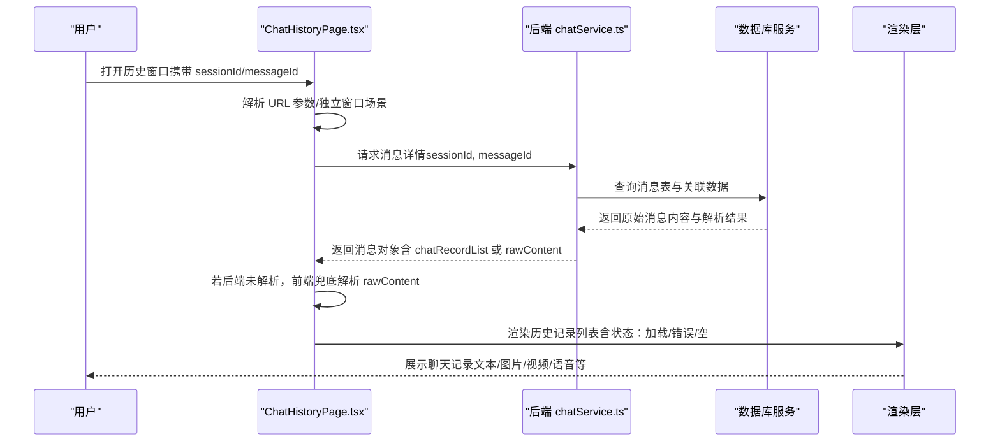
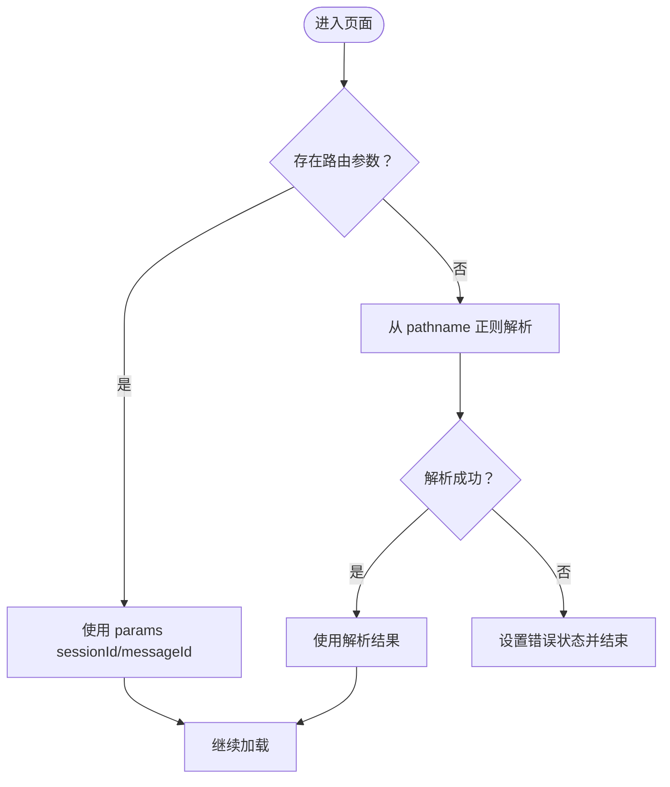
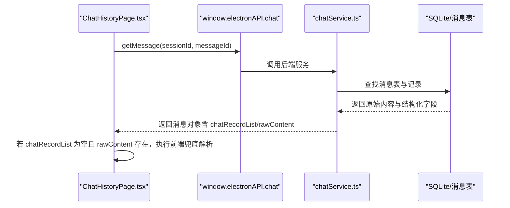
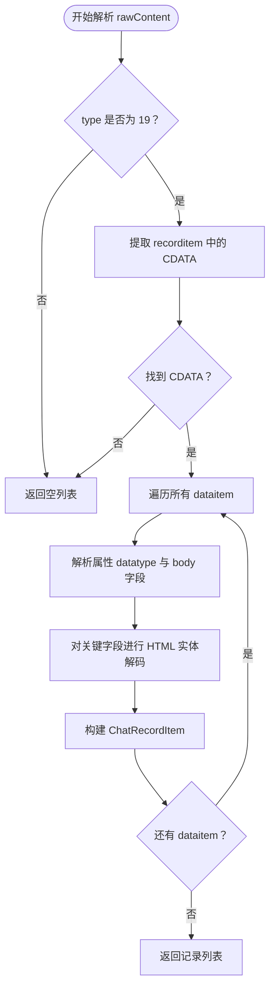
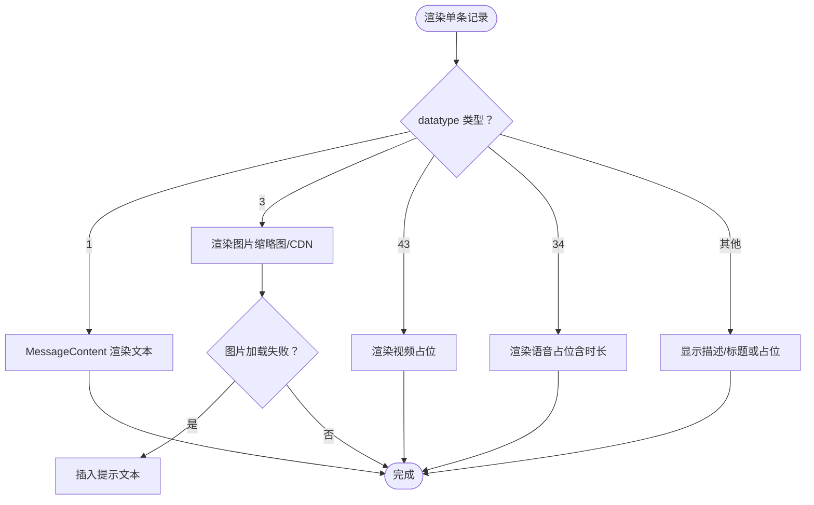
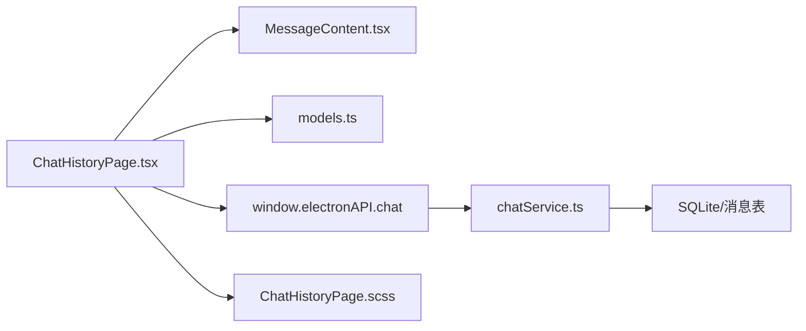

# 聊天历史窗口

<cite>
**本文档引用的文件**
- [ChatHistoryPage.tsx](file://src/pages/ChatHistoryPage.tsx)
- [ChatHistoryPage.scss](file://src/pages/ChatHistoryPage.scss)
- [MessageContent.tsx](file://src/components/MessageContent.tsx)
- [models.ts](file://src/types/models.ts)
- [chatService.ts](file://electron/services/chatService.ts)
- [database.ts](file://src/services/database.ts)
- [wechatEmoji.tsx](file://src/utils/wechatEmoji.tsx)
- [linkify.tsx](file://src/utils/linkify.tsx)
</cite>

## 目录
1. [简介](#简介)
2. [项目结构](#项目结构)
3. [核心组件](#核心组件)
4. [架构总览](#架构总览)
5. [详细组件分析](#详细组件分析)
6. [依赖分析](#依赖分析)
7. [性能考量](#性能考量)
8. [故障排查指南](#故障排查指南)
9. [结论](#结论)
10. [附录](#附录)

## 简介
本文件针对 CipherTalk 的聊天历史窗口功能提供系统化技术文档，重点覆盖以下方面：
- URL 参数解析与独立窗口场景兼容
- 消息获取流程与后端解析协同
- 合并转发消息的前端兜底解析：XML 内容提取、HTML 实体解码、数据结构转换
- 聊天记录渲染机制：消息类型判断、媒体内容处理、错误状态管理
- 窗口状态管理：加载状态、错误处理、空状态显示
- 前端兜底解析逻辑：与后端解析的差异、兼容性处理、性能考虑
- 扩展方法：新增消息类型、渲染优化、用户体验改进

## 项目结构
聊天历史窗口位于前端页面层，主要涉及：
- 页面组件：负责参数解析、数据加载、状态管理与渲染
- 组件：消息内容渲染、表情与链接处理
- 类型定义：统一的数据模型（含合并转发记录项）
- 服务层：后端解析能力与数据库服务（用于理解消息结构）

**图表来源**
- [ChatHistoryPage.tsx:1-239](file://src/pages/ChatHistoryPage.tsx#L1-L239)
- [MessageContent.tsx:1-103](file://src/components/MessageContent.tsx#L1-L103)
- [models.ts:76-97](file://src/types/models.ts#L76-L97)
- [chatService.ts:73-94](file://electron/services/chatService.ts#L73-L94)

**章节来源**
- [ChatHistoryPage.tsx:1-239](file://src/pages/ChatHistoryPage.tsx#L1-L239)
- [ChatHistoryPage.scss:1-124](file://src/pages/ChatHistoryPage.scss#L1-L124)

## 核心组件
- ChatHistoryPage.tsx：负责 URL 参数解析、消息获取、前端兜底解析、状态管理与渲染
- MessageContent.tsx：文本消息渲染，处理换行、链接识别与微信表情
- models.ts：定义 ChatRecordItem 等数据模型，支撑合并转发记录的结构化表示
- chatService.ts：后端解析合并转发消息，输出标准化的 ChatRecordItem 列表
- database.ts：通用消息内容解析与辅助提取（用于理解消息结构与兼容性）

**章节来源**
- [ChatHistoryPage.tsx:1-239](file://src/pages/ChatHistoryPage.tsx#L1-L239)
- [MessageContent.tsx:1-103](file://src/components/MessageContent.tsx#L1-L103)
- [models.ts:76-97](file://src/types/models.ts#L76-L97)
- [chatService.ts:73-94](file://electron/services/chatService.ts#L73-L94)
- [database.ts:123-138](file://src/services/database.ts#L123-L138)

## 架构总览
聊天历史窗口的端到端流程如下：

**图表来源**
- [ChatHistoryPage.tsx:114-152](file://src/pages/ChatHistoryPage.tsx#L114-L152)
- [chatService.ts:2097-2308](file://electron/services/chatService.ts#L2097-L2308)
- [database.ts:69-100](file://src/services/database.ts#L69-L100)

## 详细组件分析

### URL 参数解析与独立窗口兼容
- 优先从路由参数获取 sessionId 与 messageId；若无路由包裹（独立窗口），从 pathname 正则解析
- 无效参数时立即进入错误状态，避免后续请求

**图表来源**
- [ChatHistoryPage.tsx:101-112](file://src/pages/ChatHistoryPage.tsx#L101-L112)

**章节来源**
- [ChatHistoryPage.tsx:101-121](file://src/pages/ChatHistoryPage.tsx#L101-L121)

### 消息获取流程与后端解析协同
- 通过 window.electronAPI.chat.getMessage 获取消息详情
- 优先使用后端解析的 chatRecordList；若为空且存在 rawContent，则前端兜底解析
- 后端解析在 chatService.ts 中实现，包含 XML 类型校验、CDATA 提取、dataitem 解析与字段映射

**图表来源**
- [ChatHistoryPage.tsx:122-132](file://src/pages/ChatHistoryPage.tsx#L122-L132)
- [chatService.ts:2097-2308](file://electron/services/chatService.ts#L2097-L2308)

**章节来源**
- [ChatHistoryPage.tsx:114-152](file://src/pages/ChatHistoryPage.tsx#L114-L152)
- [chatService.ts:2097-2308](file://electron/services/chatService.ts#L2097-L2308)

### 合并转发消息的前端兜底解析算法
- XML 类型校验：type=19 才视为合并转发
- CDATA 提取：从 recorditem 中提取内部 XML
- dataitem 遍历：解析 datatype 与各字段（sourcename/sourcetime/sourceheadurl/datadesc/datatitle/fileext/datasize/messageuuid/dataurl/datathumburl/datacdnurl/aeskey/md5/imgheight/imgwidth/duration）
- HTML 实体解码：对 datadesc/datatitle/dataurl/datathumburl/datacdnurl/aeskey 进行基础实体解码
- 结果：标准化 ChatRecordItem 数组

**图表来源**
- [ChatHistoryPage.tsx:34-99](file://src/pages/ChatHistoryPage.tsx#L34-L99)
- [models.ts:76-97](file://src/types/models.ts#L76-L97)

**章节来源**
- [ChatHistoryPage.tsx:34-99](file://src/pages/ChatHistoryPage.tsx#L34-L99)
- [models.ts:76-97](file://src/types/models.ts#L76-L97)

### 聊天记录渲染机制
- 消息类型判断：datatype=1 文本、datatype=3 图片、datatype=43 视频、datatype=34 语音
- 文本渲染：通过 MessageContent 组件处理换行、链接识别与微信表情
- 媒体内容处理：
  - 图片：优先缩略图/CDN 地址，失败时显示占位与“无法加载”提示
  - 视频/语音：显示占位与时长（语音秒）
- 错误状态管理：加载中/错误/空状态三态显示

**图表来源**
- [ChatHistoryPage.tsx:174-238](file://src/pages/ChatHistoryPage.tsx#L174-L238)
- [MessageContent.tsx:14-64](file://src/components/MessageContent.tsx#L14-L64)
- [ChatHistoryPage.scss:31-124](file://src/pages/ChatHistoryPage.scss#L31-L124)

**章节来源**
- [ChatHistoryPage.tsx:174-238](file://src/pages/ChatHistoryPage.tsx#L174-L238)
- [MessageContent.tsx:1-103](file://src/components/MessageContent.tsx#L1-L103)
- [ChatHistoryPage.scss:1-124](file://src/pages/ChatHistoryPage.scss#L1-L124)

### 窗口状态管理
- 加载状态：请求期间显示“加载中”
- 错误状态：参数无效、获取失败、解析失败时显示错误文案
- 空状态：后端与前端均未解析到记录时显示“暂无可显示的聊天记录”
- 标题：从 rawContent 中提取 title 作为窗口标题

**章节来源**
- [ChatHistoryPage.tsx:114-169](file://src/pages/ChatHistoryPage.tsx#L114-L169)
- [ChatHistoryPage.tsx:134-140](file://src/pages/ChatHistoryPage.tsx#L134-L140)

### 前端兜底解析逻辑：与后端差异、兼容性与性能
- 与后端差异：
  - 后端解析更健壮，包含更复杂的 XML/CDATA 处理与字段提取
  - 前端兜底解析用于兼容旧版本或异常场景，覆盖常用字段与基础实体解码
- 兼容性处理：
  - sourcetime 支持时间戳与字符串两种格式
  - HTML 实体解码仅覆盖常见实体
- 性能考虑：
  - 前端解析仅在后端未提供 chatRecordList 时触发
  - 使用正则逐条提取 dataitem，避免复杂 DOM 解析
  - 对图片加载失败进行本地提示，避免阻塞渲染

**章节来源**
- [ChatHistoryPage.tsx:174-184](file://src/pages/ChatHistoryPage.tsx#L174-L184)
- [ChatHistoryPage.tsx:22-31](file://src/pages/ChatHistoryPage.tsx#L22-L31)
- [chatService.ts:2256-2308](file://electron/services/chatService.ts#L2256-L2308)

## 依赖分析
- ChatHistoryPage.tsx 依赖：
  - 类型模型：ChatRecordItem
  - 组件：MessageContent
  - 后端服务：window.electronAPI.chat（消息获取）
  - 样式：ChatHistoryPage.scss
- 后端 chatService.ts 依赖：
  - SQLite 数据库与消息表
  - XML/CDATA 解析与字段提取
  - HTML 实体解码与 URL 解码

**图表来源**
- [ChatHistoryPage.tsx:1-6](file://src/pages/ChatHistoryPage.tsx#L1-L6)
- [chatService.ts:110-152](file://electron/services/chatService.ts#L110-L152)

**章节来源**
- [ChatHistoryPage.tsx:1-6](file://src/pages/ChatHistoryPage.tsx#L1-L6)
- [chatService.ts:110-152](file://electron/services/chatService.ts#L110-L152)

## 性能考量
- 解析策略：优先使用后端解析结果，前端兜底解析仅在必要时触发，降低前端负担
- 渲染优化：图片懒加载与错误处理，避免阻塞主线程
- 样式优化：SCSS 中限制气泡最大宽度与换行策略，提升长文本可读性
- 数据结构：ChatRecordItem 字段精简，减少不必要的数据传输与处理

## 故障排查指南
- 无效链接：检查 URL 参数或 pathname 是否符合 /chat-history/{sessionId}/{messageId}
- 获取失败：确认 window.electronAPI.chat.getMessage 是否可用，后端数据库连接是否正常
- 解析失败：查看 rawContent 是否包含 recorditem 与 CDATA；确认 type=19
- 图片无法加载：检查 datathumburl/datacdnurl 是否有效；关注 onError 提示
- 文本乱码：确认 HTML 实体解码是否生效；必要时在后端增强解码逻辑

**章节来源**
- [ChatHistoryPage.tsx:117-149](file://src/pages/ChatHistoryPage.tsx#L117-L149)
- [ChatHistoryPage.tsx:196-200](file://src/pages/ChatHistoryPage.tsx#L196-L200)

## 结论
聊天历史窗口通过“后端优先、前端兜底”的设计，在保证兼容性的前提下实现了稳定高效的合并转发记录渲染。前端负责参数解析、状态管理与 UI 渲染，后端负责健壮的 XML/CDATA 解析与字段提取。通过合理的错误处理与性能优化，为用户提供一致、可靠的聊天历史浏览体验。

## 附录

### 扩展方法：新消息类型的添加与优化
- 新增消息类型步骤
  - 在后端 chatService.ts 的解析逻辑中增加 datatype 分支与字段提取
  - 在前端 ChatHistoryPage.tsx 的渲染逻辑中补充对应分支
  - 在 models.ts 中扩展 ChatRecordItem 字段（如需）
  - 在 MessageContent.tsx 中根据需要调整文本处理逻辑
- 渲染优化建议
  - 图片懒加载与骨架屏
  - 长文本折叠与展开
  - 媒体预览弹窗与下载入口
- 用户体验改进
  - 增加“复制/收藏/导出”等操作按钮
  - 支持按时间/类型筛选与搜索
  - 提供“无障碍”与“夜间模式”增强

**章节来源**
- [chatService.ts:2256-2308](file://electron/services/chatService.ts#L2256-L2308)
- [ChatHistoryPage.tsx:186-214](file://src/pages/ChatHistoryPage.tsx#L186-L214)
- [models.ts:76-97](file://src/types/models.ts#L76-L97)
- [MessageContent.tsx:14-64](file://src/components/MessageContent.tsx#L14-L64)