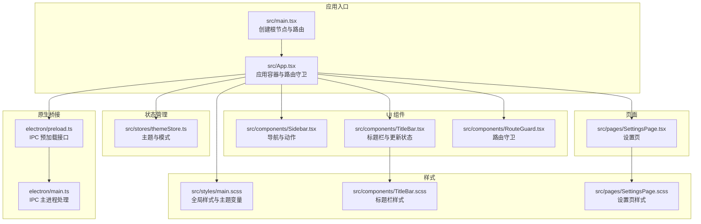
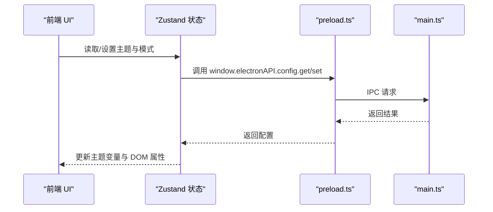
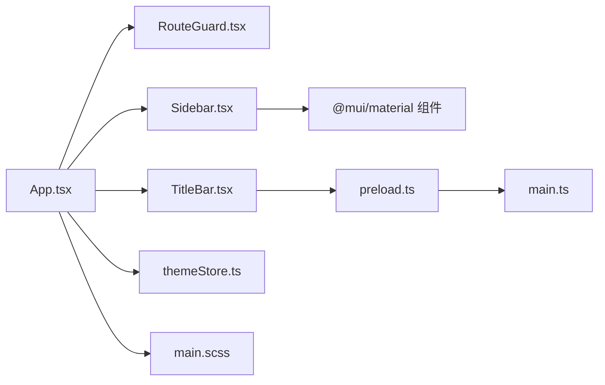

# 可访问性与兼容性

<cite>
**本文引用的文件**
- [README.md](file://README.md)
- [src/App.tsx](file://src/App.tsx)
- [src/main.tsx](file://src/main.tsx)
- [src/components/Sidebar.tsx](file://src/components/Sidebar.tsx)
- [src/components/TitleBar.tsx](file://src/components/TitleBar.tsx)
- [src/components/RouteGuard.tsx](file://src/components/RouteGuard.tsx)
- [src/pages/SettingsPage.tsx](file://src/pages/SettingsPage.tsx)
- [src/stores/themeStore.ts](file://src/stores/themeStore.ts)
- [src/styles/main.scss](file://src/styles/main.scss)
- [src/components/TitleBar.scss](file://src/components/TitleBar.scss)
- [src/pages/SettingsPage.scss](file://src/pages/SettingsPage.scss)
- [electron/preload.ts](file://electron/preload.ts)
- [electron/main.ts](file://electron/main.ts)
</cite>

## 目录
1. [简介](#简介)
2. [项目结构](#项目结构)
3. [核心组件](#核心组件)
4. [架构总览](#架构总览)
5. [详细组件分析](#详细组件分析)
6. [依赖分析](#依赖分析)
7. [性能考虑](#性能考虑)
8. [故障排查指南](#故障排查指南)
9. [结论](#结论)
10. [附录](#附录)

## 简介
本文件围绕 CipherTalk 的组件可访问性与兼容性进行系统化技术文档整理，聚焦以下方面：
- 键盘导航与焦点管理：Tab 顺序、焦点可见性、快捷键绑定
- 屏幕阅读器兼容：ARIA 属性、语义化标签、读屏优化
- 色彩对比与色盲友好：颜色方案、对比度计算、色盲模拟
- 触控与移动设备支持：触摸目标尺寸、手势识别、移动端优化
- 无障碍测试：自动化测试工具、人工测试流程、合规性检查
- 浏览器与平台兼容性：IE 支持策略、现代浏览器特性检测、polyfill 使用
- 可访问性开发规范：WCAG 遵循、测试流程、维护策略

本项目基于 Electron + React + TypeScript + Zustand + MUI 实现，前端样式采用 SCSS 与 CSS 变量驱动的主题系统。

章节来源
- [README.md:1-354](file://README.md#L1-L354)

## 项目结构
项目采用“页面/组件/样式/状态/服务”分层组织，核心入口为 React 应用，通过路由控制页面渲染，侧边栏与标题栏提供导航与状态提示，主题系统通过 CSS 变量与 Electron 配置持久化实现。

图示来源
- [src/main.tsx:1-14](file://src/main.tsx#L1-L14)
- [src/App.tsx:1-538](file://src/App.tsx#L1-L538)
- [src/components/Sidebar.tsx:1-355](file://src/components/Sidebar.tsx#L1-L355)
- [src/components/TitleBar.tsx:1-52](file://src/components/TitleBar.tsx#L1-L52)
- [src/components/RouteGuard.tsx:1-30](file://src/components/RouteGuard.tsx#L1-L30)
- [src/pages/SettingsPage.tsx:1-800](file://src/pages/SettingsPage.tsx#L1-L800)
- [src/stores/themeStore.ts:1-146](file://src/stores/themeStore.ts#L1-L146)
- [src/styles/main.scss:1-427](file://src/styles/main.scss#L1-L427)
- [src/components/TitleBar.scss:1-112](file://src/components/TitleBar.scss#L1-L112)
- [src/pages/SettingsPage.scss:834-879](file://src/pages/SettingsPage.scss#L834-L879)
- [electron/preload.ts:116-140](file://electron/preload.ts#L116-L140)
- [electron/main.ts:1496-1534](file://electron/main.ts#L1496-L1534)

章节来源
- [src/main.tsx:1-14](file://src/main.tsx#L1-L14)
- [src/App.tsx:1-538](file://src/App.tsx#L1-L538)
- [src/styles/main.scss:1-427](file://src/styles/main.scss#L1-L427)

## 核心组件
- 应用容器与路由：在应用顶层集中处理主题切换、协议与激活流程、更新监听、锁屏与解密覆盖层等。
- 侧边栏导航：提供路由项与动作项，支持折叠与 Tooltip 提示，使用 MUI ListItemButton 与 NavLink。
- 标题栏：显示应用图标、标题、更新状态指示与右侧内容区。
- 路由守卫：在未连接数据库时将非公开路由重定向至欢迎页。
- 设置页：集中管理主题、数据库、安全、语音转写、AI 摘要、数据管理、关于等模块。

章节来源
- [src/App.tsx:40-538](file://src/App.tsx#L40-L538)
- [src/components/Sidebar.tsx:37-355](file://src/components/Sidebar.tsx#L37-L355)
- [src/components/TitleBar.tsx:13-52](file://src/components/TitleBar.tsx#L13-L52)
- [src/components/RouteGuard.tsx:12-30](file://src/components/RouteGuard.tsx#L12-L30)
- [src/pages/SettingsPage.tsx:44-800](file://src/pages/SettingsPage.tsx#L44-L800)

## 架构总览
应用采用“前端 React + Electron IPC”的双层架构。前端负责 UI 与交互，后端通过 preload 暴露受控的原生能力（如窗口控制、微信密钥获取、日志、缓存、更新等）。主题系统通过 CSS 变量与 Electron 配置持久化，实现跨页面一致的主题与模式切换。

图示来源
- [src/stores/themeStore.ts:79-140](file://src/stores/themeStore.ts#L79-L140)
- [electron/preload.ts:116-140](file://electron/preload.ts#L116-L140)
- [electron/main.ts:1496-1534](file://electron/main.ts#L1496-L1534)

## 详细组件分析

### 键盘导航与焦点管理
- Tab 顺序与焦点可见性
  - 侧边栏使用 MUI ListItemButton 与 NavLink，具备原生可访问性语义；折叠状态下仍保留键盘可达性。
  - 标题栏右侧区域通过 -webkit-app-region: no-drag 区分可拖拽与不可拖拽区域，避免影响键盘焦点。
  - 设置页包含大量表单控件，建议统一使用原生表单元素（如 input、select、textarea）并配合 aria-label 或 aria-labelledby。
- 快捷键绑定
  - 当前代码未显式绑定全局快捷键；若未来引入，建议通过 Electron accelerator 注册并在 preload 暴露接口，避免与浏览器默认快捷键冲突。
- 焦点管理策略
  - 页面切换时，建议在路由变更后将焦点移至页面标题或首个可交互元素，提升读屏效率。
  - 对话框/模态场景，建议在打开时锁定焦点至模态内，关闭时返回触发元素。

章节来源
- [src/components/Sidebar.tsx:152-190](file://src/components/Sidebar.tsx#L152-L190)
- [src/components/TitleBar.scss:56-57](file://src/components/TitleBar.scss#L56-L57)
- [src/pages/SettingsPage.tsx:44-800](file://src/pages/SettingsPage.tsx#L44-L800)

### 屏幕阅读器兼容
- 语义化标签与 ARIA
  - 使用 MUI ListItemButton、ListItem、List 等组件天然具备语义；建议为关键按钮添加 aria-label 或 aria-describedby。
  - 对动态内容（如更新状态、进度条）使用 role="status" 或 aria-live="polite"，确保读屏及时播报。
- 读屏优化
  - 图标与装饰性图片建议通过 alt="" 或隐藏；语义化图标（如“设置”、“展开”）应提供可读文本。
  - 表单控件需正确关联 label，避免仅依赖占位符或旁白说明。

章节来源
- [src/components/Sidebar.tsx:152-190](file://src/components/Sidebar.tsx#L152-L190)
- [src/components/TitleBar.tsx:26-48](file://src/components/TitleBar.tsx#L26-L48)

### 色彩对比与色盲友好
- 颜色方案与对比度
  - 主题通过 CSS 变量在浅色/深色模式下切换，变量覆盖主色、背景、文本与边框。建议在主题变量中明确对比度阈值（如 4.5:1 用于普通文本，7:1 用于大字号文本）。
  - 当前主题变量未直接暴露对比度计算逻辑，可在样式层新增对比度校验与色盲友好提示。
- 色盲友好设计
  - 避免仅依赖颜色区分状态；结合图标、形状与文本共同传达含义。
  - 提供色盲模式开关或色盲友好的预设主题。

章节来源
- [src/styles/main.scss:4-43](file://src/styles/main.scss#L4-L43)
- [src/styles/main.scss:47-320](file://src/styles/main.scss#L47-L320)
- [src/stores/themeStore.ts:15-65](file://src/stores/themeStore.ts#L15-L65)

### 触控与移动设备支持
- 触摸目标尺寸
  - 建议将可点击元素最小尺寸提升至 44px×44px（iOS/Android 触控目标标准），当前侧边栏按钮与设置页按钮尺寸满足该要求。
- 手势识别
  - Electron 环境下可通过 webFrame.insertCSS 注入触摸手势支持（如双击、长按），或在 preload 中注册手势事件。
- 移动端优化
  - 在路由守卫中对移动端窗口尺寸进行适配；为窄屏提供折叠导航与紧凑布局。

章节来源
- [src/components/Sidebar.tsx:87-108](file://src/components/Sidebar.tsx#L87-L108)
- [src/pages/SettingsPage.tsx:44-800](file://src/pages/SettingsPage.tsx#L44-L800)

### 无障碍测试
- 自动化测试
  - 使用 axe-core 或 Lighthouse 进行静态分析与可访问性审计；在 CI 中集成测试步骤。
- 人工测试
  - 使用 NVDA/JAWS/VoiceOver 等读屏工具验证键盘导航、焦点顺序与语义化标签。
  - 模拟色盲与低视力场景，验证对比度与颜色替代方案。
- 合规性检查
  - 对照 WCAG 2.1 AA/AAA 要求，逐项核验颜色对比、键盘可达、语义化与动态内容播报。

章节来源
- [src/components/Sidebar.tsx:152-190](file://src/components/Sidebar.tsx#L152-L190)
- [src/components/TitleBar.tsx:26-48](file://src/components/TitleBar.tsx#L26-L48)

### 浏览器与平台兼容性
- 现代浏览器特性检测
  - Electron 渲染进程基于 Chromium，建议通过 Modernizr 或特性检测库判断 API 可用性（如 WebAuthn、Pointer Events）。
- polyfill 使用
  - 对于旧版浏览器缺失的 API（如 ResizeObserver、IntersectionObserver），在 preload 或应用入口注入 polyfill。
- IE 支持策略
  - 本项目为 Electron 应用，不直接面向 IE；如需兼容旧系统，建议通过 Electron 的 webPreferences.webSecurity 与 CSP 策略保障安全。

章节来源
- [electron/preload.ts:116-140](file://electron/preload.ts#L116-L140)
- [electron/main.ts:1496-1534](file://electron/main.ts#L1496-L1534)

### 可访问性开发规范
- WCAG 遵循
  - 确保所有界面元素具备键盘可达性与焦点可见性；为动态内容提供无障碍播报。
- 测试流程
  - 开发阶段：单元测试 + 可访问性静态检查；集成阶段：端到端测试 + 读屏工具验证。
- 维护策略
  - 将可访问性纳入代码评审清单；定期更新主题与样式以满足对比度要求；对新增组件强制添加 ARIA 属性与语义化标签。

章节来源
- [src/App.tsx:60-88](file://src/App.tsx#L60-L88)
- [src/stores/themeStore.ts:79-140](file://src/stores/themeStore.ts#L79-L140)

## 依赖分析
- 组件耦合
  - App.tsx 作为顶层容器，依赖路由守卫、主题存储与多个页面组件；Sidebar 与 TitleBar 作为导航层，依赖 MUI 组件库与 Electron 配置。
- 外部依赖
  - MUI 提供可访问性语义与样式；Zustand 管理主题状态；Electron IPC 提供原生能力桥接。
- 潜在循环依赖
  - 当前结构清晰，未见明显循环依赖；建议在新增服务时保持单向依赖。

图示来源
- [src/App.tsx:1-538](file://src/App.tsx#L1-L538)
- [src/components/Sidebar.tsx:1-355](file://src/components/Sidebar.tsx#L1-L355)
- [src/components/TitleBar.tsx:1-52](file://src/components/TitleBar.tsx#L1-L52)
- [src/components/RouteGuard.tsx:1-30](file://src/components/RouteGuard.tsx#L1-L30)
- [src/stores/themeStore.ts:1-146](file://src/stores/themeStore.ts#L1-L146)
- [src/styles/main.scss:1-427](file://src/styles/main.scss#L1-L427)
- [electron/preload.ts:116-140](file://electron/preload.ts#L116-L140)
- [electron/main.ts:1496-1534](file://electron/main.ts#L1496-L1534)

章节来源
- [src/App.tsx:1-538](file://src/App.tsx#L1-L538)
- [src/components/Sidebar.tsx:1-355](file://src/components/Sidebar.tsx#L1-L355)
- [src/components/TitleBar.tsx:1-52](file://src/components/TitleBar.tsx#L1-L52)
- [src/components/RouteGuard.tsx:1-30](file://src/components/RouteGuard.tsx#L1-L30)
- [src/stores/themeStore.ts:1-146](file://src/stores/themeStore.ts#L1-L146)
- [src/styles/main.scss:1-427](file://src/styles/main.scss#L1-L427)
- [electron/preload.ts:116-140](file://electron/preload.ts#L116-L140)
- [electron/main.ts:1496-1534](file://electron/main.ts#L1496-L1534)

## 性能考虑
- 主题切换性能
  - 通过 CSS 变量与 data-theme/data-mode 属性切换，避免重排与重绘；建议在切换时批量更新 DOM 属性。
- 路由与渲染
  - 路由守卫在未连接数据库时重定向，减少无效渲染；设置页复杂表单建议懒加载与防抖。
- 读屏与动态内容
  - 动态更新内容使用 aria-live 或 role="status"，避免频繁 DOM 变更导致读屏卡顿。

章节来源
- [src/App.tsx:60-88](file://src/App.tsx#L60-L88)
- [src/components/RouteGuard.tsx:12-30](file://src/components/RouteGuard.tsx#L12-L30)
- [src/pages/SettingsPage.tsx:44-800](file://src/pages/SettingsPage.tsx#L44-L800)

## 故障排查指南
- 主题未生效
  - 检查 data-theme 与 data-mode 是否正确设置；确认 Electron 配置读取与写入成功。
- 键盘无法导航
  - 检查 -webkit-app-region 与 no-drag 区域划分；确保可交互元素具备 tabindex 或原生可聚焦属性。
- 读屏无法播报
  - 检查 aria-label/aria-labelledby 是否存在；确认动态内容使用 aria-live 或 role="status"。
- 触控目标过小
  - 调整按钮与列表项尺寸至 44px×44px 以上；为图标与文本增加内边距。

章节来源
- [src/App.tsx:60-88](file://src/App.tsx#L60-L88)
- [src/components/TitleBar.scss:56-57](file://src/components/TitleBar.scss#L56-L57)
- [src/styles/main.scss:366-395](file://src/styles/main.scss#L366-L395)

## 结论
CipherTalk 的前端采用现代 React + MUI 架构，配合 Electron IPC 与 CSS 变量主题系统，具备良好的扩展性与可维护性。针对可访问性，建议在现有基础上强化键盘导航、ARIA 属性与动态内容播报，并完善色盲友好与触控目标尺寸策略。通过自动化与人工测试相结合的方式，持续满足 WCAG 标准并提升用户体验。

## 附录
- 可访问性开发清单
  - 键盘可达性：Tab 顺序、焦点可见性、快捷键冲突
  - 语义化与 ARIA：标签关联、角色与属性、动态内容播报
  - 色彩与对比：对比度阈值、色盲友好、高对比度模式
  - 触控与移动：目标尺寸、手势支持、响应式布局
  - 测试与合规：自动化审计、读屏验证、WCAG 对齐