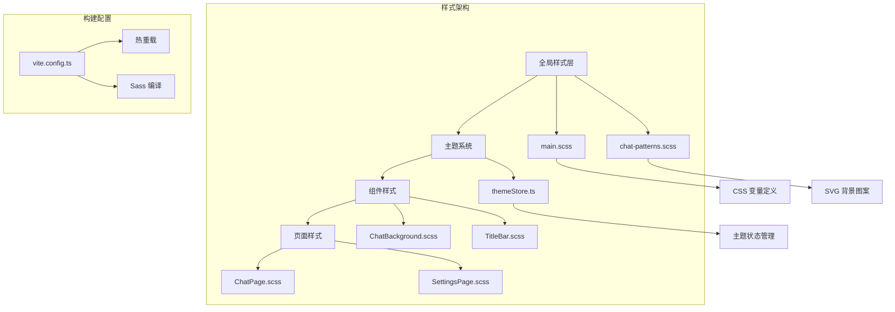
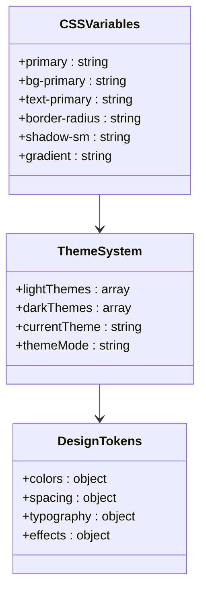
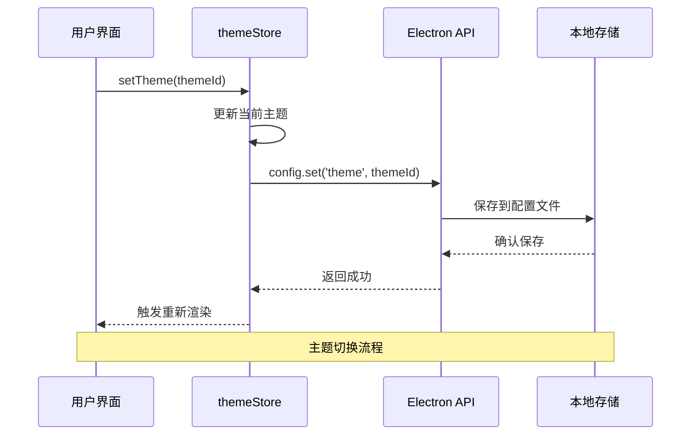
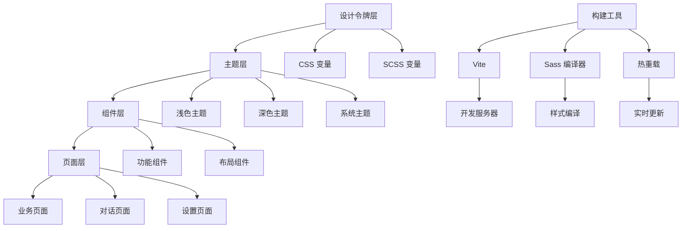
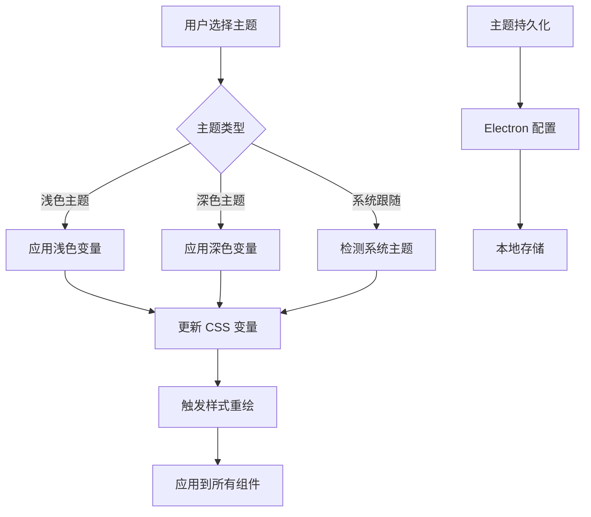
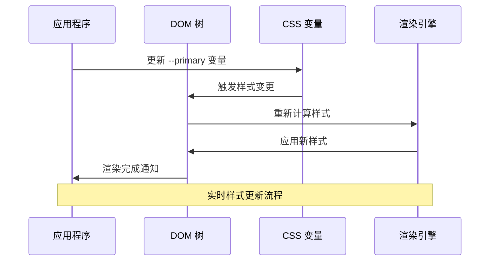
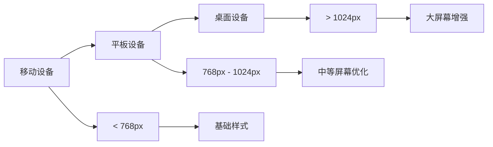
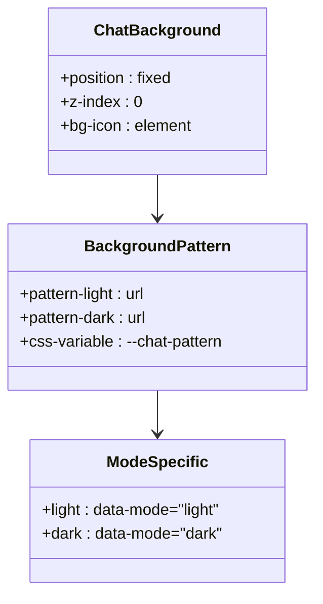
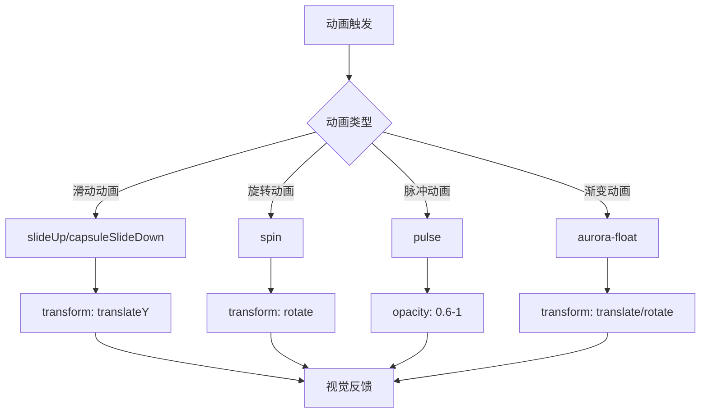
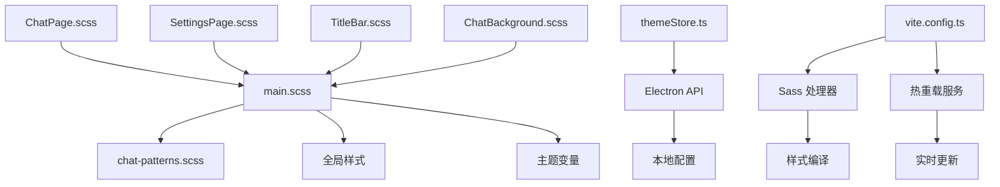

# 样式系统设计

<cite>
**本文档引用的文件**
- [main.scss](file://src/styles/main.scss)
- [chat-patterns.scss](file://src/styles/chat-patterns.scss)
- [themeStore.ts](file://src/store/themeStore.ts)
- [App.scss](file://src/App.scss)
- [ChatPage.scss](file://src/pages/ChatPage.scss)
- [SettingsPage.scss](file://src/pages/SettingsPage.scss)
- [TitleBar.scss](file://src/components/TitleBar.scss)
- [ChatBackground.scss](file://src/components/ChatBackground.scss)
- [vite.config.ts](file://vite.config.ts)
</cite>

## 目录
1. [简介](#简介)
2. [项目结构](#项目结构)
3. [核心组件](#核心组件)
4. [架构概览](#架构概览)
5. [详细组件分析](#详细组件分析)
6. [依赖关系分析](#依赖关系分析)
7. [性能考虑](#性能考虑)
8. [故障排除指南](#故障排除指南)
9. [结论](#结论)
10. [附录](#附录)

## 简介

CipherTalk 的样式系统采用现代化的 CSS 架构设计，结合了 CSS-in-SCSS 和 CSS-in-JS 的优势，实现了高度模块化的主题系统和响应式设计。该系统通过 CSS 变量实现主题切换，通过 SCSS 模块化管理样式文件，并利用 Vite 构建工具提供热重载支持。

## 项目结构

样式系统主要由以下层次组成：

**图表来源**
- [main.scss:1-427](file://src/styles/main.scss#L1-L427)
- [chat-patterns.scss:1-19](file://src/styles/chat-patterns.scss#L1-L19)
- [themeStore.ts:1-146](file://src/store/themeStore.ts#L1-L146)

**章节来源**
- [main.scss:1-427](file://src/styles/main.scss#L1-L427)
- [chat-patterns.scss:1-19](file://src/styles/chat-patterns.scss#L1-L19)
- [vite.config.ts:1-78](file://vite.config.ts#L1-L78)

## 核心组件

### CSS 变量系统

样式系统基于 CSS 自定义属性实现，提供了完整的颜色、间距、字体等设计令牌：

**图表来源**
- [main.scss:4-43](file://src/styles/main.scss#L4-L43)
- [themeStore.ts:3-65](file://src/store/themeStore.ts#L3-L65)

### 主题存储管理

使用 Zustand 状态管理库实现主题状态的持久化存储：

**图表来源**
- [themeStore.ts:85-92](file://src/store/themeStore.ts#L85-L92)

**章节来源**
- [themeStore.ts:1-146](file://src/store/themeStore.ts#L1-L146)
- [main.scss:45-321](file://src/styles/main.scss#L45-L321)

## 架构概览

样式系统的整体架构采用分层设计，确保了可维护性和扩展性：

**图表来源**
- [main.scss:1-427](file://src/styles/main.scss#L1-L427)
- [vite.config.ts:15-77](file://vite.config.ts#L15-L77)

## 详细组件分析

### 主题系统实现

#### 颜色变量定义

系统定义了完整的颜色体系，包括主色调、背景色、文本色等：

| 类别 | 变量名 | 描述 |
|------|--------|------|
| 主色调 | `--primary` | 主要品牌色彩 |
| 背景色 | `--bg-primary` | 主要背景色 |
| 文本色 | `--text-primary` | 主要文本色 |
| 边框色 | `--border-color` | 边框和分割线颜色 |
| 阴影 | `--shadow-sm` | 细微阴影效果 |

#### 主题切换机制

**图表来源**
- [main.scss:45-321](file://src/styles/main.scss#L45-L321)
- [themeStore.ts:94-116](file://src/store/themeStore.ts#L94-L116)

#### 动态样式注入

系统通过 CSS 变量实现动态样式切换，无需重新加载页面：

**图表来源**
- [main.scss:4-43](file://src/styles/main.scss#L4-L43)

**章节来源**
- [main.scss:45-321](file://src/styles/main.scss#L45-L321)
- [themeStore.ts:85-139](file://src/store/themeStore.ts#L85-L139)

### 响应式设计

#### 断点设置

系统采用基于视口宽度的响应式断点：

#### 媒体查询应用

在多个页面中实现了响应式布局：

**章节来源**
- [SettingsPage.scss:721-784](file://src/pages/SettingsPage.scss#L721-L784)
- [ChatPage.scss:720-729](file://src/pages/ChatPage.scss#L720-L729)

### 组件样式架构

#### 聊天背景系统

**图表来源**
- [ChatBackground.scss:1-26](file://src/components/ChatBackground.scss#L1-L26)
- [chat-patterns.scss:12-18](file://src/styles/chat-patterns.scss#L12-L18)

#### 标题栏组件

标题栏采用拖拽区域设计，支持窗口控制按钮：

**章节来源**
- [TitleBar.scss:1-112](file://src/components/TitleBar.scss#L1-L112)

### 动画系统

#### 过渡效果

系统实现了多种过渡动画效果：

| 动画类型 | 应用场景 | 持续时间 | 缓动函数 |
|----------|----------|----------|----------|
| Slide Up | 更新提示 | 0.3s | ease |
| Capsule Slide Down | 下载进度 | 0.3s | cubic-bezier |
| Spin | 加载指示器 | 1s | linear |
| Pulse | 键盘状态 | 1.5s | ease-in-out |

#### 关键帧动画

**图表来源**
- [App.scss:24-33](file://src/App.scss#L24-L33)
- [SettingsPage.scss:53-62](file://src/pages/SettingsPage.scss#L53-L62)

**章节来源**
- [App.scss:24-315](file://src/App.scss#L24-L315)
- [SettingsPage.scss:53-781](file://src/pages/SettingsPage.scss#L53-L781)

## 依赖关系分析

### 样式文件依赖图

**图表来源**
- [main.scss:1-427](file://src/styles/main.scss#L1-L427)
- [vite.config.ts:21-66](file://vite.config.ts#L21-L66)

### 组件耦合分析

样式系统采用了松耦合的设计原则：

- **低耦合**: 各组件样式相互独立，通过公共变量进行通信
- **高内聚**: 相关样式集中在同一文件中管理
- **可复用**: 全局样式变量可在任何组件中使用

**章节来源**
- [vite.config.ts:15-77](file://vite.config.ts#L15-L77)

## 性能考虑

### 样式优化策略

1. **CSS 变量缓存**: 通过 CSS 变量减少重复计算
2. **按需加载**: 组件样式按需编译和加载
3. **动画性能**: 使用 transform 和 opacity 属性优化动画性能
4. **内存管理**: 及时清理不再使用的样式类

### 构建优化

Vite 配置提供了以下优化特性：

- **快速热重载**: 开发时提供毫秒级的样式更新
- **Tree Shaking**: 移除未使用的样式代码
- **压缩优化**: 生产环境自动压缩 CSS 文件

## 故障排除指南

### 常见问题及解决方案

#### 主题切换不生效

**症状**: 更换主题后样式没有变化

**排查步骤**:
1. 检查 `data-theme` 属性是否正确设置
2. 验证 CSS 变量是否被正确更新
3. 确认 Electron 配置存储正常

**章节来源**
- [themeStore.ts:118-139](file://src/store/themeStore.ts#L118-L139)

#### 样式冲突问题

**症状**: 组件样式被意外覆盖

**解决方案**:
1. 使用更具体的选择器优先级
2. 避免使用通配符选择器
3. 检查 CSS 层叠顺序

#### 响应式布局异常

**症状**: 在某些设备上布局错乱

**排查方法**:
1. 检查媒体查询断点设置
2. 验证视口元标签配置
3. 测试不同屏幕尺寸下的表现

## 结论

CipherTalk 的样式系统设计体现了现代化前端工程的最佳实践。通过 CSS-in-SCSS 的模块化架构、基于 CSS 变量的主题系统、以及完善的响应式设计，实现了高度可维护和可扩展的样式管理方案。

系统的主要优势包括：
- **模块化设计**: 样式文件职责明确，易于维护
- **主题灵活性**: 支持多种主题和动态切换
- **性能优化**: 通过构建工具和 CSS 变量优化性能
- **开发体验**: 热重载和错误边界提供良好的开发体验

## 附录

### 样式开发规范

#### 命名约定

1. **组件类名**: 使用 BEM 方法论
2. **变量命名**: 使用语义化前缀（如 `--primary-`）
3. **文件命名**: 使用 kebab-case 命名

#### 代码格式

1. **缩进**: 使用 4 个空格
2. **选择器**: 每个选择器独占一行
3. **属性**: 每个属性独占一行

#### 维护策略

1. **定期重构**: 每季度审查样式代码
2. **版本控制**: 重要样式变更添加注释说明
3. **测试验证**: 新功能添加样式测试用例