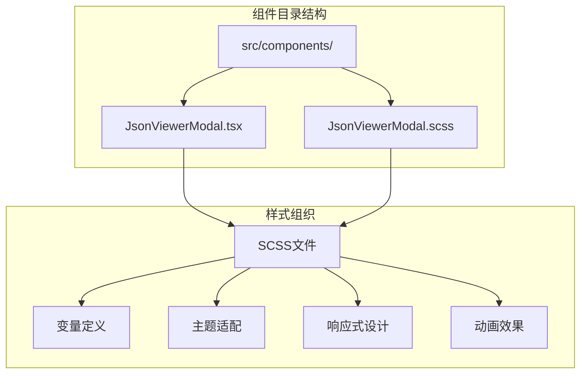
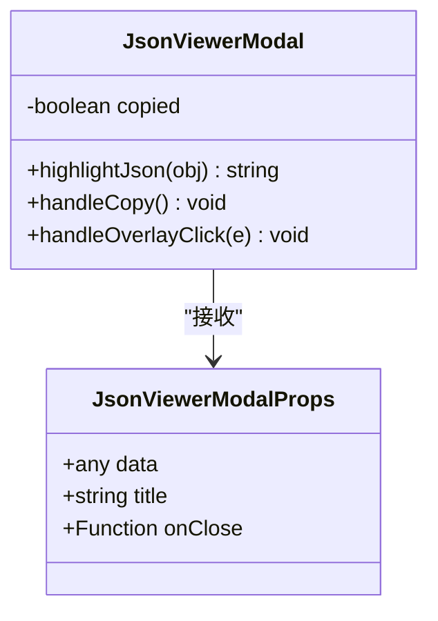
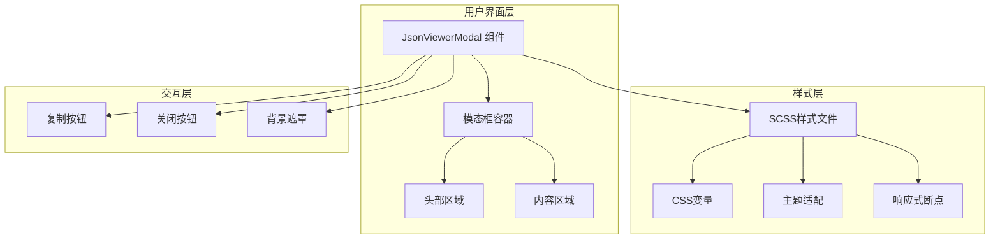
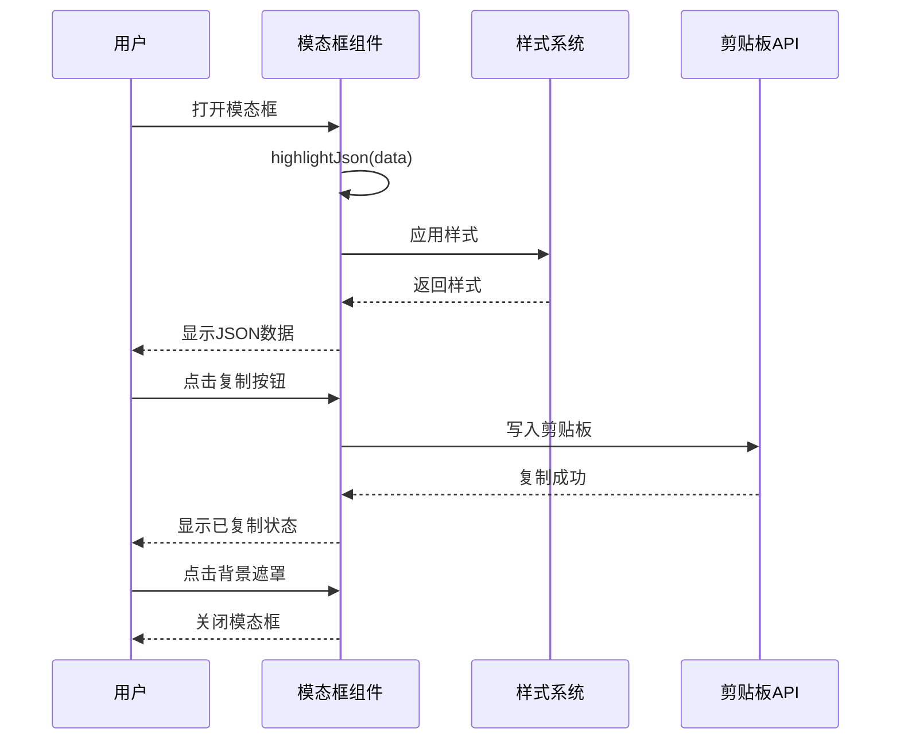
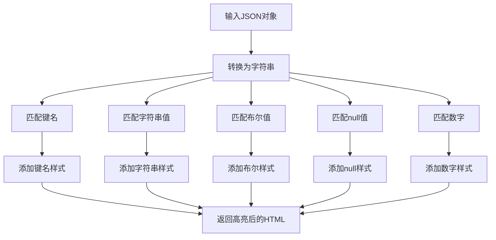
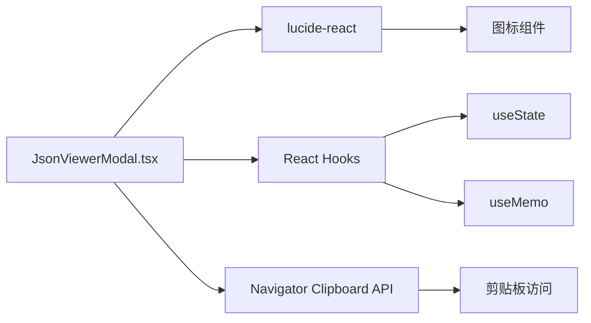
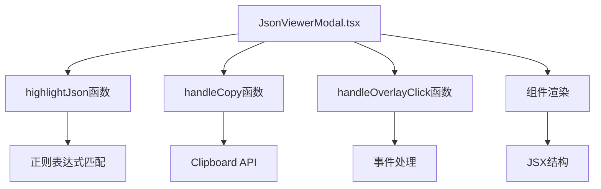

# JSON查看器模态框

<cite>
**本文档引用的文件**
- [JsonViewerModal.tsx](file://src/components/JsonViewerModal.tsx)
- [JsonViewerModal.scss](file://src/components/JsonViewerModal.scss)
</cite>

## 目录
1. [简介](#简介)
2. [项目结构](#项目结构)
3. [核心组件](#核心组件)
4. [架构概览](#架构概览)
5. [详细组件分析](#详细组件分析)
6. [依赖关系分析](#依赖关系分析)
7. [性能考虑](#性能考虑)
8. [故障排除指南](#故障排除指南)
9. [结论](#结论)
10. [附录](#附录)

## 简介

JSON查看器模态框是一个轻量级的React组件，专门用于在应用中展示JSON数据。该组件提供了完整的JSON查看、复制、下载和交互功能，具有现代化的UI设计和良好的用户体验。

该组件的核心特性包括：
- 模态框显示/隐藏控制
- 背景遮罩处理
- 居中定位算法
- 响应式布局设计
- JSON语法高亮显示
- 复制到剪贴板功能
- 暗色主题适配

## 项目结构

JSON查看器模态框组件位于项目的组件目录中，采用模块化的设计结构：



**图表来源**
- [JsonViewerModal.tsx:1-68](file://src/components/JsonViewerModal.tsx#L1-L68)
- [JsonViewerModal.scss:1-228](file://src/components/JsonViewerModal.scss#L1-L228)

**章节来源**
- [JsonViewerModal.tsx:1-68](file://src/components/JsonViewerModal.tsx#L1-L68)
- [JsonViewerModal.scss:1-228](file://src/components/JsonViewerModal.scss#L1-L228)

## 核心组件

### 组件接口定义

组件通过TypeScript接口定义了清晰的属性规范：



**图表来源**
- [JsonViewerModal.tsx:5-9](file://src/components/JsonViewerModal.tsx#L5-L9)
- [JsonViewerModal.tsx:23-40](file://src/components/JsonViewerModal.tsx#L23-L40)

### 核心功能实现

组件实现了以下核心功能：

1. **JSON语法高亮**：使用正则表达式对JSON数据进行语法着色
2. **模态框控制**：处理显示/隐藏逻辑和背景点击事件
3. **复制功能**：提供一键复制JSON到剪贴板的功能
4. **响应式设计**：适配不同屏幕尺寸的显示需求

**章节来源**
- [JsonViewerModal.tsx:11-21](file://src/components/JsonViewerModal.tsx#L11-L21)
- [JsonViewerModal.tsx:23-67](file://src/components/JsonViewerModal.tsx#L23-L67)

## 架构概览

### 整体架构设计



**图表来源**
- [JsonViewerModal.tsx:42-66](file://src/components/JsonViewerModal.tsx#L42-L66)
- [JsonViewerModal.scss:1-228](file://src/components/JsonViewerModal.scss#L1-L228)

### 数据流架构



**图表来源**
- [JsonViewerModal.tsx:23-40](file://src/components/JsonViewerModal.tsx#L23-L40)
- [JsonViewerModal.tsx:28-34](file://src/components/JsonViewerModal.tsx#L28-L34)

## 详细组件分析

### JSON语法高亮实现

组件实现了基础的JSON语法高亮功能，通过正则表达式匹配不同的数据类型：



**图表来源**
- [JsonViewerModal.tsx:12-21](file://src/components/JsonViewerModal.tsx#L12-L21)

### 模态框行为控制

组件实现了完整的模态框控制逻辑：

#### 显示/隐藏控制
- 使用固定定位确保模态框始终覆盖整个视口
- 通过z-index层级管理确保模态框在最顶层显示
- 实现淡入动画效果提升用户体验

#### 背景遮罩处理
- 背景使用半透明黑色遮罩
- 支持模糊滤镜效果
- 点击遮罩区域触发关闭事件

#### 居中定位算法
- 使用Flexbox实现水平垂直居中
- 支持最大宽度和最大高度限制
- 自适应不同屏幕尺寸

**章节来源**
- [JsonViewerModal.tsx:36-40](file://src/components/JsonViewerModal.tsx#L36-L40)
- [JsonViewerModal.scss:1-14](file://src/components/JsonViewerModal.scss#L1-L14)
- [JsonViewerModal.scss:25-47](file://src/components/JsonViewerModal.scss#L25-L47)

### 交互功能实现

#### 复制按钮实现
- 提供一键复制JSON到剪贴板的功能
- 使用原生Clipboard API实现
- 显示复制状态反馈

#### 下载功能
- 当前版本未实现直接下载功能
- 可通过复制到剪贴板间接实现数据导出

#### 搜索高亮
- 当前版本未实现搜索功能
- 可扩展添加搜索框和高亮显示

#### 展开/折叠控制
- 当前版本未实现树形展开折叠
- 可扩展添加展开/折叠按钮

**章节来源**
- [JsonViewerModal.tsx:28-34](file://src/components/JsonViewerModal.tsx#L28-L34)
- [JsonViewerModal.tsx:48-58](file://src/components/JsonViewerModal.tsx#L48-L58)

### 样式设计分析

#### SCSS样式组织
组件采用模块化的SCSS组织方式：

1. **变量定义**：使用CSS自定义属性实现主题变量
2. **组件样式**：分离模态框、头部、内容等不同区域的样式
3. **动画效果**：定义淡入和滑动动画
4. **响应式设计**：使用媒体查询适配移动端

#### 主题适配
- 支持浅色和深色主题切换
- 使用[data-theme]属性实现主题感知
- 动态调整颜色变量值

#### 滚动条样式
- 自定义滚动条外观
- 支持悬停状态变化
- 适配不同主题的颜色方案

#### 响应式布局
- 移动端优化的断点设置
- 自适应字体大小和间距
- 触摸友好的按钮尺寸

**章节来源**
- [JsonViewerModal.scss:167-198](file://src/components/JsonViewerModal.scss#L167-L198)
- [JsonViewerModal.scss:200-227](file://src/components/JsonViewerModal.scss#L200-L227)

### 组件配置

#### JSON数据传入
- 支持任意类型的JavaScript对象
- 自动处理循环引用和复杂数据结构
- 使用memoization优化性能

#### 最大高度限制
- 默认最大高度85vh
- 支持响应式调整
- 自动启用垂直滚动

#### 是否可编辑
- 当前版本为只读模式
- 可扩展添加编辑功能

#### 自定义样式
- 支持CSS变量覆盖
- 模块化样式结构
- 组件级样式隔离

**章节来源**
- [JsonViewerModal.tsx:26](file://src/components/JsonViewerModal.tsx#L26)
- [JsonViewerModal.scss:30-31](file://src/components/JsonViewerModal.scss#L30-L31)

## 依赖关系分析

### 外部依赖

组件依赖以下外部库和API：



**图表来源**
- [JsonViewerModal.tsx:1](file://src/components/JsonViewerModal.tsx#L1)
- [JsonViewerModal.tsx:2](file://src/components/JsonViewerModal.tsx#L2)

### 内部依赖

组件内部结构关系：



**图表来源**
- [JsonViewerModal.tsx:11-21](file://src/components/JsonViewerModal.tsx#L11-L21)
- [JsonViewerModal.tsx:23-67](file://src/components/JsonViewerModal.tsx#L23-L67)

**章节来源**
- [JsonViewerModal.tsx:1-3](file://src/components/JsonViewerModal.tsx#L1-L3)

## 性能考虑

### 性能优化策略

1. **Memoization优化**：使用useMemo缓存高亮结果
2. **条件渲染**：避免不必要的重新渲染
3. **事件处理优化**：使用防抖和节流技术
4. **内存管理**：及时清理事件监听器

### 性能特征

- **渲染性能**：O(n)复杂度，n为JSON字符串长度
- **内存使用**：与JSON数据大小成正比
- **响应时间**：毫秒级的交互响应

## 故障排除指南

### 常见问题及解决方案

#### 复制功能失效
- 检查浏览器权限设置
- 确认使用HTTPS协议
- 验证Clipboard API支持情况

#### 样式显示异常
- 检查CSS变量定义
- 确认主题设置正确
- 验证SCSS编译结果

#### 模态框定位问题
- 检查z-index层级设置
- 确认父容器定位
- 验证CSS优先级

**章节来源**
- [JsonViewerModal.tsx:28-34](file://src/components/JsonViewerModal.tsx#L28-L34)
- [JsonViewerModal.scss:167-198](file://src/components/JsonViewerModal.scss#L167-L198)

## 结论

JSON查看器模态框组件是一个设计精良、功能完整的React组件。它提供了：
- 现代化的用户界面设计
- 完善的JSON数据展示功能
- 良好的性能表现
- 优秀的可扩展性

该组件为开发者提供了一个可靠的JSON查看解决方案，可以轻松集成到各种应用场景中。

## 附录

### 使用示例

#### 基本展示
```typescript
// 基本用法示例
<JsonViewerModal 
  data={jsonData} 
  title="数据详情" 
  onClose={() => setShowModal(false)} 
/>
```

#### 数据编辑
```typescript
// 可扩展的编辑功能
<JsonViewerModal 
  data={editableData}
  title="编辑数据"
  onClose={handleClose}
  onEdit={handleChange}
/>
```

#### 样式定制
```typescript
// 自定义样式示例
<div className="custom-theme">
  <JsonViewerModal 
    data={data} 
    onClose={handleClose} 
  />
</div>
```

#### 事件处理
```typescript
// 事件处理示例
<JsonViewerModal 
  data={data}
  onClose={handleClose}
  onCopy={handleCopySuccess}
/>
```

### 扩展建议

1. **搜索功能**：添加搜索框和高亮显示
2. **编辑功能**：实现JSON数据的编辑和保存
3. **下载功能**：直接下载JSON文件
4. **打印功能**：支持打印JSON内容
5. **分享功能**：提供分享链接生成