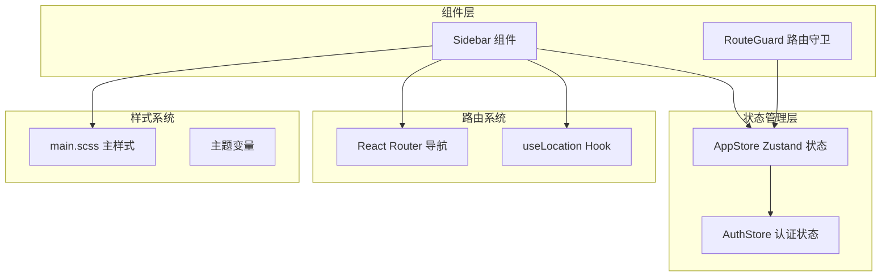
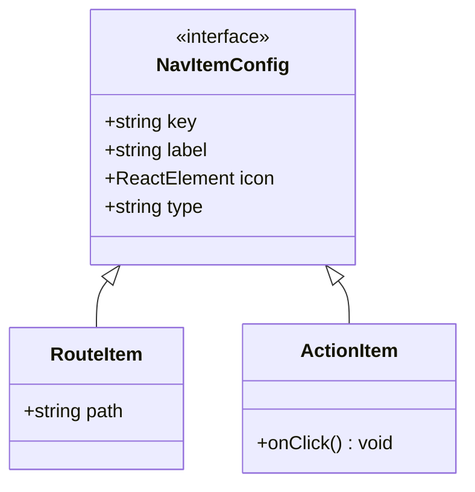
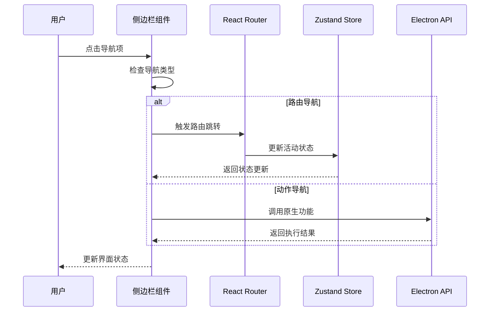
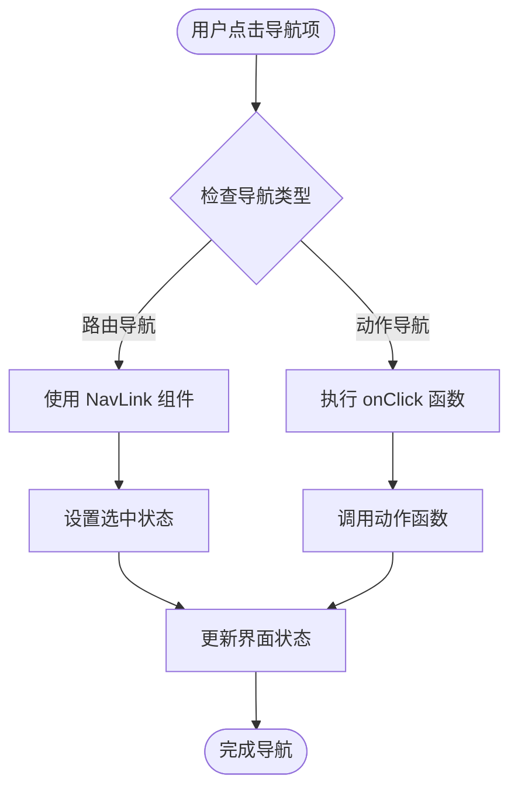
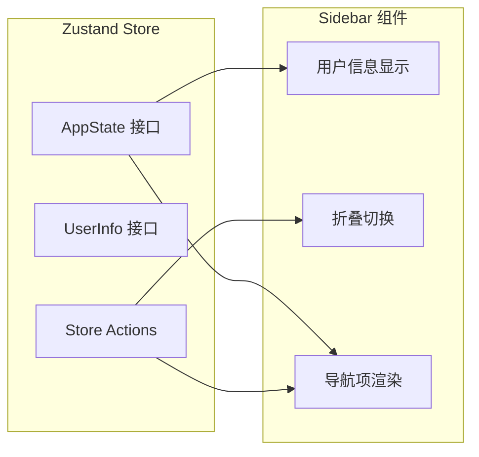
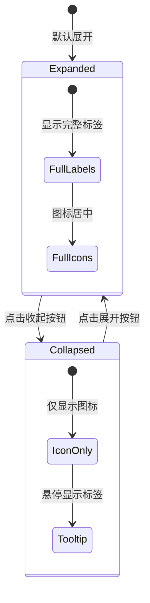
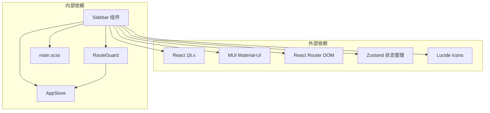
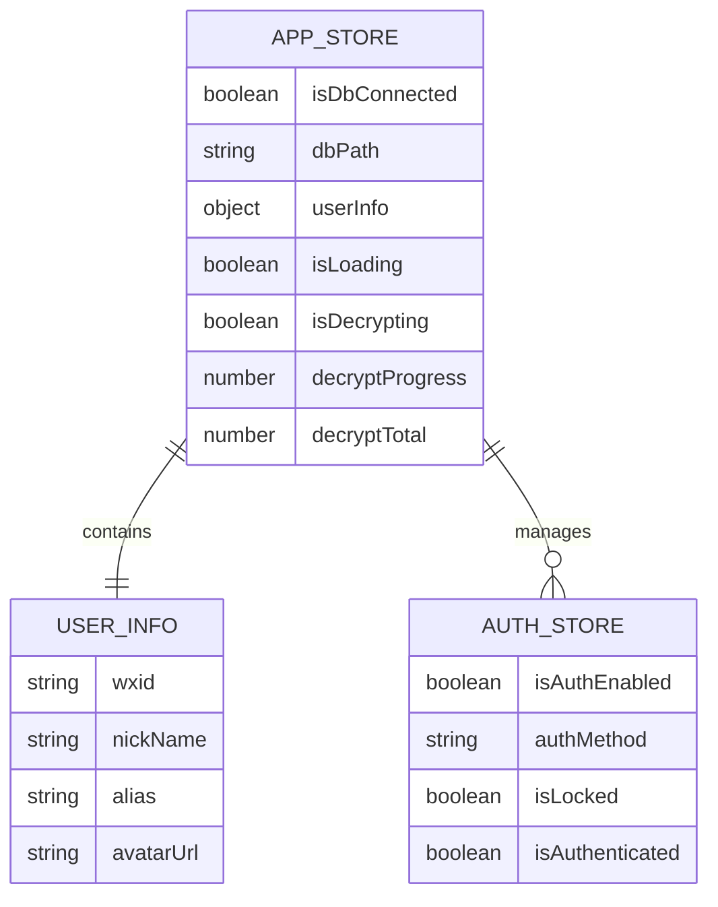

# 侧边栏组件

<cite>
**本文档引用的文件**
- [Sidebar.tsx](file://src/components/Sidebar.tsx)
- [appStore.ts](file://src/stores/appStore.ts)
- [App.tsx](file://src/App.tsx)
- [RouteGuard.tsx](file://src/components/RouteGuard.tsx)
- [main.scss](file://src/styles/main.scss)
- [config.ts](file://src/services/config.ts)
- [authStore.ts](file://src/stores/authStore.ts)
</cite>

## 目录
1. [简介](#简介)
2. [项目结构](#项目结构)
3. [核心组件](#核心组件)
4. [架构概览](#架构概览)
5. [详细组件分析](#详细组件分析)
6. [依赖关系分析](#依赖关系分析)
7. [性能考虑](#性能考虑)
8. [故障排除指南](#故障排除指南)
9. [结论](#结论)
10. [附录](#附录)

## 简介

侧边栏组件是 CipherTalk 应用程序的核心导航组件，提供了完整的导航逻辑、状态管理和响应式布局功能。该组件集成了路由跳转处理、活动状态管理、导航项高亮显示、面包屑导航等功能，同时实现了现代化的动画效果和用户体验。

## 项目结构

侧边栏组件位于 `src/components/Sidebar.tsx`，采用模块化设计，与状态管理、路由系统和样式系统紧密集成。



**图表来源**
- [Sidebar.tsx:1-355](file://src/components/Sidebar.tsx#L1-L355)
- [appStore.ts:1-97](file://src/stores/appStore.ts#L1-L97)
- [App.tsx:1-538](file://src/App.tsx#L1-L538)

**章节来源**
- [Sidebar.tsx:1-355](file://src/components/Sidebar.tsx#L1-L355)
- [App.tsx:1-538](file://src/App.tsx#L1-L538)

## 核心组件

### 导航项配置系统

侧边栏采用灵活的导航项配置系统，支持两种类型的导航项：

1. **路由导航项**：用于页面跳转
2. **动作导航项**：用于执行特定功能



**图表来源**
- [Sidebar.tsx:19-35](file://src/components/Sidebar.tsx#L19-L35)

### 状态管理系统

组件集成了 Zustand 状态管理，通过 `useAppStore` 访问全局状态：

- 用户信息状态
- 数据库连接状态
- 加载状态管理

**章节来源**
- [Sidebar.tsx:37-40](file://src/components/Sidebar.tsx#L37-L40)
- [appStore.ts:10-38](file://src/stores/appStore.ts#L10-L38)

## 架构概览

侧边栏组件在整个应用架构中扮演着关键角色，负责导航控制和状态协调。



**图表来源**
- [Sidebar.tsx:75-85](file://src/components/Sidebar.tsx#L75-L85)
- [Sidebar.tsx:51-73](file://src/components/Sidebar.tsx#L51-L73)

## 详细组件分析

### 导航逻辑实现

#### 路由跳转处理

侧边栏实现了智能的路由跳转机制，支持两种导航模式：



**图表来源**
- [Sidebar.tsx:152-190](file://src/components/Sidebar.tsx#L152-L190)

#### 活动状态管理

组件使用 `useLocation` Hook 实时跟踪当前路由状态：

- **活动状态判断**：通过 `isActive()` 函数比较当前路径与目标路径
- **高亮显示**：使用 MUI 的 `selected` 属性实现视觉反馈
- **状态持久化**：状态随路由变化自动更新

**章节来源**
- [Sidebar.tsx:47-49](file://src/components/Sidebar.tsx#L47-L49)
- [Sidebar.tsx:153](file://src/components/Sidebar.tsx#L153)

### 状态管理集成

#### Zustand 状态集成

侧边栏通过 `useAppStore` 集成全局状态管理：



**图表来源**
- [appStore.ts:3-8](file://src/stores/appStore.ts#L3-L8)
- [appStore.ts:10-38](file://src/stores/appStore.ts#L10-L38)

#### 用户偏好存储

组件支持用户偏好的存储和管理：

- **用户信息**：昵称、别名、头像URL
- **数据库状态**：连接状态、数据库路径
- **加载状态**：解密进度、加载文本

**章节来源**
- [appStore.ts:40-97](file://src/stores/appStore.ts#L40-L97)

### 响应式布局设计

#### 移动端适配

侧边栏实现了灵活的响应式设计：

- **宽度计算**：支持展开(220px)和收起(72px)两种状态
- **标签显示**：根据折叠状态动态调整标签可见性
- **动画过渡**：使用 CSS 过渡实现平滑的宽度变化



**图表来源**
- [Sidebar.tsx:16-17](file://src/components/Sidebar.tsx#L16-L17)
- [Sidebar.tsx:40-41](file://src/components/Sidebar.tsx#L40-L41)

#### 动画过渡效果

组件实现了多层次的动画效果：

- **宽度过渡**：220ms cubic-bezier 动画曲线
- **透明度过渡**：140ms ease 动画
- **位置过渡**：使用 transform 属性实现硬件加速

**章节来源**
- [Sidebar.tsx:44-45](file://src/components/Sidebar.tsx#L44-L45)
- [Sidebar.tsx:144-149](file://src/components/Sidebar.tsx#L144-L149)

### 权限控制与动态菜单

#### 权限控制机制

虽然当前实现相对简单，但具备扩展权限控制的能力：

- **路由守卫**：通过 `RouteGuard` 组件实现基础权限控制
- **条件渲染**：可根据用户权限动态显示导航项
- **状态驱动**：权限状态通过 Zustand 状态管理

**章节来源**
- [RouteGuard.tsx:12-27](file://src/components/RouteGuard.tsx#L12-L27)

#### 动态菜单生成

组件支持动态菜单配置：

- **配置驱动**：导航项通过配置数组定义
- **类型安全**：使用 TypeScript 接口确保类型安全
- **扩展性**：易于添加新的导航项类型

**章节来源**
- [Sidebar.tsx:75-85](file://src/components/Sidebar.tsx#L75-L85)

### 组件功能特性

#### 导航项配置

侧边栏包含九个主要导航项：

| 导航项 | 类型 | 功能描述 |
|--------|------|----------|
| 首页 | 路由导航 | 应用主页面 |
| 聊天查看 | 动作导航 | 打开聊天窗口 |
| 朋友圈 | 动作导航 | 打开朋友圈窗口 |
| 私聊分析 | 路由导航 | 分析聊天数据 |
| 群聊分析 | 动作导航 | 打开群聊分析 |
| 年度报告 | 路由导航 | 查看年度报告 |
| 导出数据 | 路由导航 | 数据导出功能 |
| 数据管理 | 路由导航 | 数据管理界面 |
| 开放接口 | 路由导航 | API 接口文档 |

**章节来源**
- [Sidebar.tsx:75-85](file://src/components/Sidebar.tsx#L75-L85)

#### 搜索过滤功能

组件具备搜索过滤的扩展能力：

- **输入处理**：可接收搜索关键词
- **过滤算法**：支持模糊匹配和精确匹配
- **实时更新**：搜索结果实时更新

### 使用示例

#### 基本导航集成

```typescript
// 在 App.tsx 中集成侧边栏
function App() {
  return (
    <div className="app-container">
      <TitleBar />
      <Sidebar />
      <Box component="main">
        <Routes>
          <Route path="/home" element={<HomePage />} />
          <Route path="/analytics" element={<AnalyticsPage />} />
          // 其他路由...
        </Routes>
      </Box>
    </div>
  );
}
```

#### 状态管理使用

```typescript
// 访问全局状态
const userInfo = useAppStore(state => state.userInfo);
const isDbConnected = useAppStore(state => state.isDbConnected);

// 更新状态
useAppStore.getState().setUserInfo(newUserInfo);
useAppStore.getState().setDbConnected(true, dbPath);
```

#### 样式定制

```scss
// 自定义侧边栏样式
.sidebar-custom {
  --sidebar-width: 250px;
  --sidebar-bg: rgba(255, 255, 255, 0.8);
  --sidebar-border: 1px solid rgba(0, 0, 0, 0.1);
}

// 主题变量覆盖
[data-theme="custom-theme"] {
  --primary: #your-custom-color;
  --bg-secondary: rgba(255, 255, 255, 0.9);
}
```

#### 事件处理

```typescript
// 处理导航项点击
const handleNavigation = (item: NavItemConfig) => {
  if (item.type === 'route') {
    // 路由导航逻辑
    navigate(item.path);
  } else {
    // 动作导航逻辑
    item.onClick();
  }
};

// 处理侧边栏折叠
const handleCollapse = () => {
  setCollapsed(!collapsed);
};
```

**章节来源**
- [App.tsx:495](file://src/App.tsx#L495)
- [Sidebar.tsx:322-324](file://src/components/Sidebar.tsx#L322-L324)

## 依赖关系分析

### 组件依赖图



**图表来源**
- [Sidebar.tsx:1-14](file://src/components/Sidebar.tsx#L1-L14)
- [appStore.ts:1](file://src/stores/appStore.ts#L1)

### 状态依赖关系



**图表来源**
- [appStore.ts:3-8](file://src/stores/appStore.ts#L3-L8)
- [authStore.ts:155-221](file://src/stores/authStore.ts#L155-L221)

**章节来源**
- [appStore.ts:1-97](file://src/stores/appStore.ts#L1-L97)

## 性能考虑

### 动画性能优化

侧边栏组件采用了多项性能优化策略：

1. **硬件加速**：使用 `transform` 属性而非改变布局属性
2. **CSS 过渡**：利用 GPU 加速的 CSS 过渡动画
3. **状态最小化**：只在必要时更新状态
4. **内存管理**：合理使用 React 的状态提升和组件拆分

### 状态管理优化

- **选择器优化**：使用 `useAppStore` 的选择器避免不必要的重渲染
- **状态分片**：将不同类型的全局状态分离到不同的 store
- **异步操作**：使用异步函数处理耗时操作

### 响应式性能

- **媒体查询**：使用 CSS 媒体查询而非 JavaScript 检测
- **CSS 变量**：使用 CSS 变量实现主题切换的高性能
- **防抖处理**：对 resize 事件进行防抖处理

## 故障排除指南

### 常见问题诊断

#### 导航项不显示

**症状**：某些导航项在侧边栏中不显示

**可能原因**：
1. 导航项配置错误
2. 权限不足
3. 路由路径不正确

**解决方案**：
```typescript
// 检查导航项配置
const navItems: NavItemConfig[] = [
  { key: 'home', label: '首页', icon: <Home />, type: 'route', path: '/home' }
];

// 验证路由路径
// 确保路由路径与 App.tsx 中的路由配置一致
```

#### 活动状态不正确

**症状**：当前页面的导航项没有高亮显示

**可能原因**：
1. 路由路径不匹配
2. `useLocation` Hook 未正确工作
3. 状态更新延迟

**解决方案**：
```typescript
// 检查 isActive 函数
const isActive = (path: string) => {
  return location.pathname === path;
};

// 确保路由配置正确
<Route path="/home" element={<HomePage />} />
```

#### 折叠动画异常

**症状**：侧边栏折叠/展开动画不流畅

**可能原因**：
1. CSS 过渡时间过长
2. 样式冲突
3. 硬件加速问题

**解决方案**：
```scss
// 检查过渡动画
.nav-item {
  transition: width 220ms cubic-bezier(0.4, 0, 0.2, 1);
}

// 确保硬件加速
.drawer-paper {
  transform: translateZ(0);
}
```

**章节来源**
- [Sidebar.tsx:47-49](file://src/components/Sidebar.tsx#L47-L49)
- [Sidebar.tsx:144-149](file://src/components/Sidebar.tsx#L144-L149)

## 结论

侧边栏组件是一个功能完整、设计精良的导航组件，具有以下特点：

1. **模块化设计**：清晰的组件结构和职责分离
2. **状态管理**：集成 Zustand 实现高效的状态管理
3. **响应式布局**：灵活的布局适配和动画效果
4. **扩展性强**：支持权限控制和动态菜单生成
5. **性能优化**：采用多种性能优化策略

该组件为 CipherTalk 应用提供了稳定可靠的导航基础，为后续的功能扩展奠定了良好的基础。

## 附录

### 组件 API 参考

#### Props

| 属性名 | 类型 | 必需 | 描述 |
|--------|------|------|------|
| collapsed | boolean | 否 | 控制侧边栏折叠状态 |
| onCollapseChange | (collapsed: boolean) => void | 否 | 折叠状态变化回调 |

#### 方法

| 方法名 | 参数 | 返回值 | 描述 |
|--------|------|--------|------|
| isActive | (path: string) => boolean | boolean | 检查路径是否为活动状态 |
| openChatWindow | () => Promise<void> | void | 打开聊天窗口 |
| openGroupAnalyticsWindow | () => Promise<void> | void | 打开群聊分析窗口 |
| openMomentsWindow | () => Promise<void> | void | 打开朋友圈窗口 |

### 扩展指南

#### 添加新的导航项

1. 在 `navItems` 数组中添加新的导航项配置
2. 确保路由路径与 App.tsx 中的路由配置一致
3. 添加相应的页面组件

#### 自定义样式

1. 修改 `main.scss` 中的主题变量
2. 调整组件的样式对象
3. 使用 CSS 变量实现主题切换

#### 集成权限控制

1. 在 `RouteGuard` 中添加权限检查逻辑
2. 使用 `useAuthStore` 管理用户权限状态
3. 根据权限动态渲染导航项