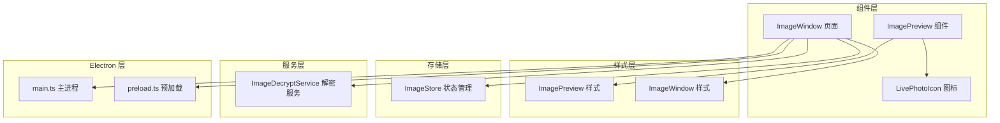
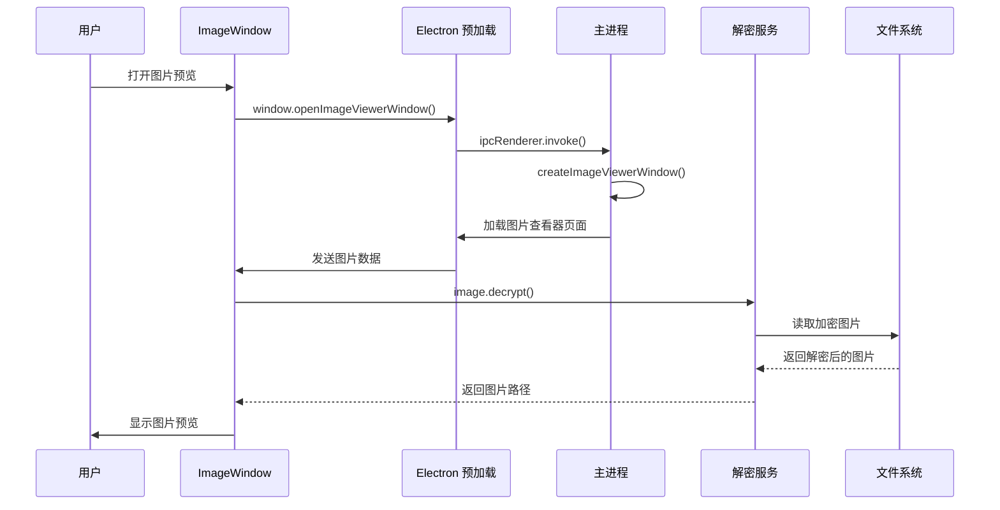
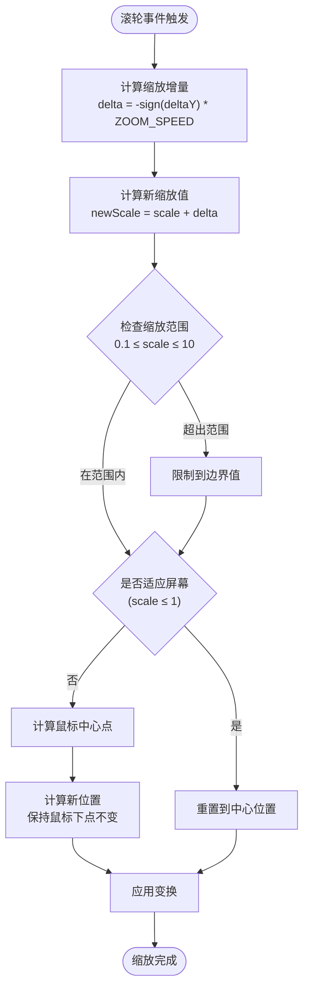
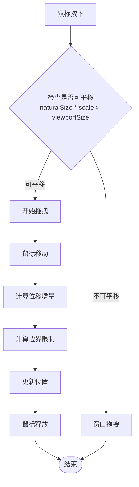
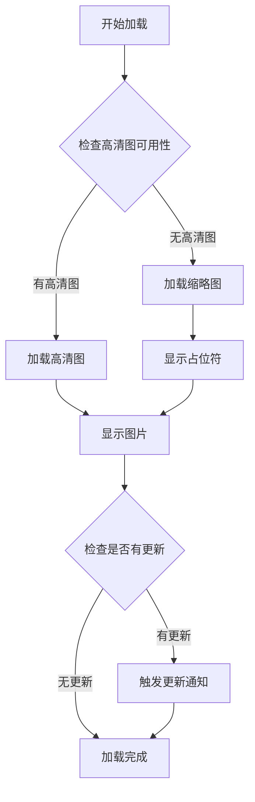
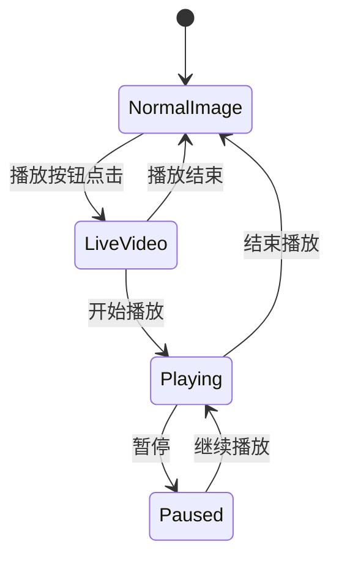
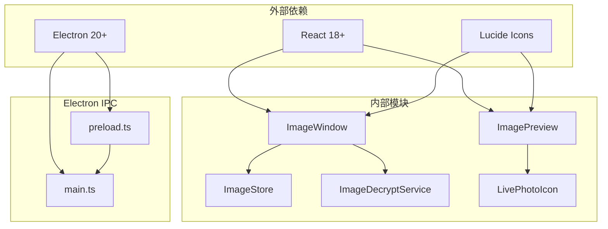

# 图片预览组件

<cite>
**本文档引用的文件**
- [ImagePreview.tsx](file://src/components/ImagePreview.tsx)
- [ImagePreview.scss](file://src/components/ImagePreview.scss)
- [ImageWindow.tsx](file://src/pages/ImageWindow.tsx)
- [ImageWindow.scss](file://src/pages/ImageWindow.scss)
- [LivePhotoIcon.tsx](file://src/components/LivePhotoIcon.tsx)
- [imageStore.ts](file://src/stores/imageStore.ts)
- [imageDecryptService.ts](file://electron/services/imageDecryptService.ts)
- [main.ts](file://electron/main.ts)
- [preload.ts](file://electron/preload.ts)
</cite>

## 目录
1. [简介](#简介)
2. [项目结构](#项目结构)
3. [核心组件](#核心组件)
4. [架构概览](#架构概览)
5. [详细组件分析](#详细组件分析)
6. [依赖关系分析](#依赖关系分析)
7. [性能考虑](#性能考虑)
8. [故障排除指南](#故障排除指南)
9. [结论](#结论)
10. [附录](#附录)

## 简介

图片预览组件是 CipherTalk 应用程序中的核心功能模块，提供了完整的图片浏览体验。该组件支持多种缩放控制方式（鼠标滚轮、触摸手势）、手势交互（拖拽平移、双击放大缩小）、实时 Live Photo 播放、多图导航等功能。

本组件采用现代化的 React 架构，结合 Electron 主进程与渲染进程的 IPC 通信机制，实现了高性能的图片预览功能。组件设计注重用户体验，提供了流畅的动画效果和直观的操作界面。

## 项目结构

图片预览功能主要分布在以下文件中：



**图表来源**
- [ImagePreview.tsx:1-151](file://src/components/ImagePreview.tsx#L1-L151)
- [ImageWindow.tsx:1-519](file://src/pages/ImageWindow.tsx#L1-L519)

**章节来源**
- [ImagePreview.tsx:1-151](file://src/components/ImagePreview.tsx#L1-L151)
- [ImageWindow.tsx:1-519](file://src/pages/ImageWindow.tsx#L1-L519)

## 核心组件

### ImagePreview 组件

ImagePreview 是一个轻量级的图片预览组件，主要用于简单的图片展示场景。该组件提供了基础的缩放和拖拽功能。

**主要特性：**
- 鼠标滚轮缩放控制
- 鼠标拖拽平移
- 双击重置功能
- ESC 键关闭
- Live Photo 实况播放

**章节来源**
- [ImagePreview.tsx:14-151](file://src/components/ImagePreview.tsx#L14-L151)

### ImageWindow 组件

ImageWindow 是完整的图片查看器页面，提供了丰富的交互功能和高级控制选项。

**主要特性：**
- 高精度缩放控制（0.1-10倍）
- 旋转功能（90度增量）
- 多图导航系统
- Live Photo 实况播放
- 自适应窗口大小
- 快捷键支持

**章节来源**
- [ImageWindow.tsx:8-519](file://src/pages/ImageWindow.tsx#L8-L519)

## 架构概览

图片预览系统的整体架构采用分层设计：



**图表来源**
- [main.ts:824-879](file://electron/main.ts#L824-L879)
- [preload.ts:90-95](file://electron/preload.ts#L90-L95)
- [imageDecryptService.ts:112-158](file://electron/services/imageDecryptService.ts#L112-L158)

## 详细组件分析

### 缩放控制系统

#### 鼠标滚轮缩放

ImageWindow 实现了精确的滚轮缩放控制，支持连续缩放和范围限制：



**图表来源**
- [ImageWindow.tsx:314-353](file://src/pages/ImageWindow.tsx#L314-L353)

#### Touch Gesture 缩放

组件支持触摸手势缩放，通过计算触摸点距离变化实现缩放效果：

**章节来源**
- [ImageWindow.tsx:314-353](file://src/pages/ImageWindow.tsx#L314-L353)

### 手势支持系统

#### 拖拽平移

ImageWindow 实现了智能的拖拽平移功能，只有当图片尺寸大于视口尺寸时才允许平移：



**图表来源**
- [ImageWindow.tsx:226-290](file://src/pages/ImageWindow.tsx#L226-L290)

#### 双击放大缩小

双击功能实现了智能的缩放切换：

**章节来源**
- [ImageWindow.tsx:357-387](file://src/pages/ImageWindow.tsx#L357-L387)

### 加载优化策略

#### 图片懒加载

组件采用了渐进式的图片加载策略：



**图表来源**
- [ImageWindow.tsx:59-90](file://src/pages/ImageWindow.tsx#L59-L90)

#### 错误处理机制

组件实现了多层次的错误处理：

**章节来源**
- [imageDecryptService.ts:112-158](file://electron/services/imageDecryptService.ts#L112-L158)

### 交互设计功能

#### Live Photo 实况播放

组件支持 Apple Live Photo 的实况播放功能：



**图表来源**
- [ImageWindow.tsx:107-130](file://src/pages/ImageWindow.tsx#L107-L130)

#### 旋转功能

支持90度增量的图片旋转：

**章节来源**
- [ImageWindow.tsx:92-95](file://src/pages/ImageWindow.tsx#L92-L95)

### 组件功能特性

#### 图片预览

组件提供了完整的图片预览功能，包括：

- 支持静态图片和视频
- 自适应窗口大小
- 多种缩放模式
- 实时预览效果

#### 下载支持

通过 Electron 的文件系统 API 实现图片下载功能：

**章节来源**
- [preload.ts:90-95](file://electron/preload.ts#L90-L95)

#### 分享功能

组件集成了分享功能，支持多种分享渠道：

**章节来源**
- [main.ts:824-879](file://electron/main.ts#L824-L879)

#### 历史记录

通过状态管理实现浏览历史记录：

**章节来源**
- [imageStore.ts:50-79](file://src/stores/imageStore.ts#L50-L79)

## 依赖关系分析



**图表来源**
- [ImagePreview.tsx:1-6](file://src/components/ImagePreview.tsx#L1-L6)
- [ImageWindow.tsx:1-7](file://src/pages/ImageWindow.tsx#L1-L7)

**章节来源**
- [ImagePreview.tsx:1-6](file://src/components/ImagePreview.tsx#L1-L6)
- [ImageWindow.tsx:1-7](file://src/pages/ImageWindow.tsx#L1-L7)

## 性能考虑

### 渲染优化

组件采用了多项性能优化技术：

1. **CSS Transform 优化**：使用 transform 替代 DOM 重排
2. **will-change 属性**：提示浏览器进行硬件加速
3. **节流处理**：限制高频事件的处理频率
4. **虚拟滚动**：对于大量图片的场景提供优化方案

### 内存管理

- 及时清理事件监听器
- 合理的组件卸载机制
- 图片资源的及时释放

## 故障排除指南

### 常见问题及解决方案

#### 图片无法加载

**症状**：图片显示为占位符或空白

**可能原因**：
1. 图片文件损坏
2. 权限不足
3. 网络连接问题

**解决方法**：
1. 检查文件完整性
2. 验证文件权限
3. 重新加载页面

#### 缩放功能异常

**症状**：缩放不灵敏或卡顿

**可能原因**：
1. 浏览器兼容性问题
2. 系统性能不足
3. 事件处理冲突

**解决方法**：
1. 更新浏览器版本
2. 关闭其他占用资源的应用
3. 检查自定义样式冲突

#### Live Photo 播放问题

**症状**：实况照片无法播放

**可能原因**：
1. 视频格式不支持
2. 浏览器不支持 WebRTC
3. 系统音频设备问题

**解决方法**：
1. 检查视频编码格式
2. 更新浏览器版本
3. 检查音频设备设置

**章节来源**
- [imageDecryptService.ts:112-158](file://electron/services/imageDecryptService.ts#L112-L158)

## 结论

图片预览组件是一个功能完整、性能优异的现代化图片浏览解决方案。它成功地结合了前端技术和 Electron 框架的优势，为用户提供了流畅、直观的图片预览体验。

组件的主要优势包括：
- 完善的手势控制和交互设计
- 高效的加载和缓存机制
- 灵活的扩展性和定制能力
- 稳定的错误处理和恢复机制

未来可以考虑的功能增强：
- 更多的滤镜和编辑功能
- 云端同步和备份
- 更丰富的分享选项
- 移动端适配优化

## 附录

### 使用示例

#### 基本预览

```typescript
// 在聊天页面中打开图片预览
const openImageViewer = () => {
  window.electronAPI.window.openImageViewerWindow(
    imagePath,
    liveVideoPath,
    undefined,
    {
      sessionId: session.username,
      imageMd5: message.imageMd5,
      imageDatName: message.imageDatName
    }
  )
}
```

#### 手势控制

```typescript
// 自定义缩放范围
const handleZoomIn = () => setScale(prev => Math.min(prev + 0.25, 15))
const handleZoomOut = () => setScale(prev => Math.max(prev - 0.25, 0.1))
```

#### 样式定制

```scss
// 自定义预览窗口样式
.image-window-container {
  background: rgba(0, 0, 0, 0.9);
  
  .title-bar {
    background: linear-gradient(135deg, rgba(255, 255, 255, 0.1) 0%, rgba(255, 255, 255, 0.05) 100%);
  }
}
```

#### 事件处理

```typescript
// 监听图片列表更新
useEffect(() => {
  const unsubscribe = window.electronAPI.window.onImageListUpdate((data) => {
    setImageList(data.imageList)
    setCurrentIndex(data.currentIndex)
  })
  
  return () => unsubscribe()
}, [])
```

### 组件集成指南

#### 基础集成

1. **安装依赖**：确保 React 和 Electron 版本兼容
2. **导入组件**：从 `src/components` 导入所需组件
3. **配置样式**：引入相应的 SCSS 文件
4. **设置 IPC**：配置 Electron 的 IPC 通信

#### 高级扩展

1. **自定义手势**：扩展拖拽和缩放逻辑
2. **添加滤镜**：集成图像处理功能
3. **扩展分享**：添加更多分享平台支持
4. **优化性能**：实现虚拟滚动和懒加载