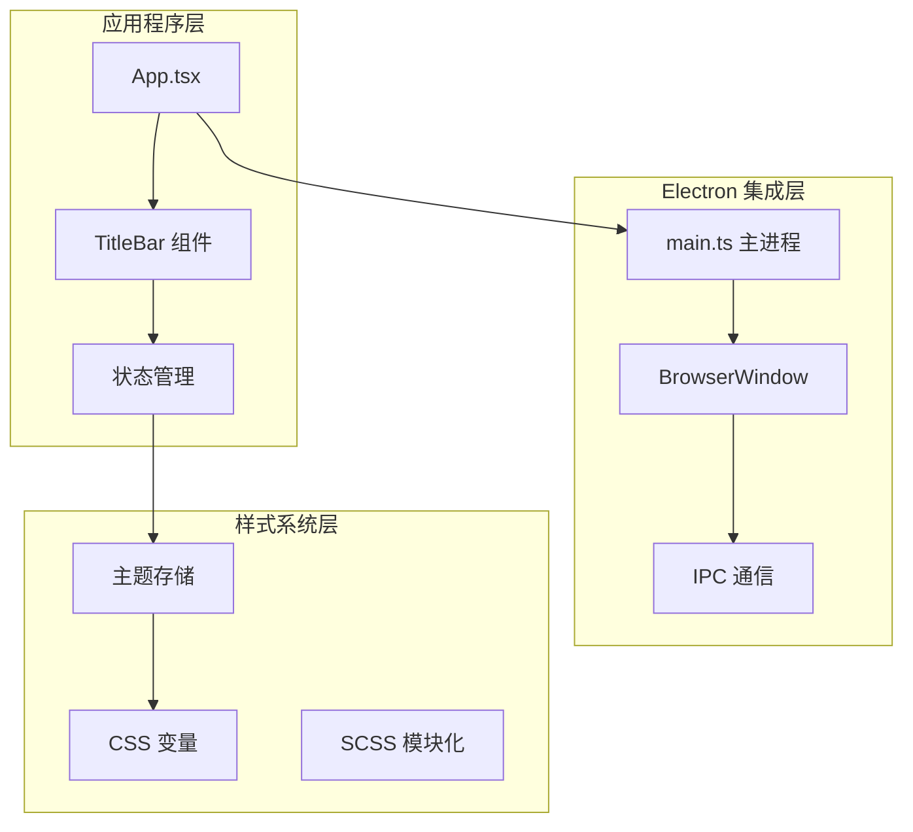
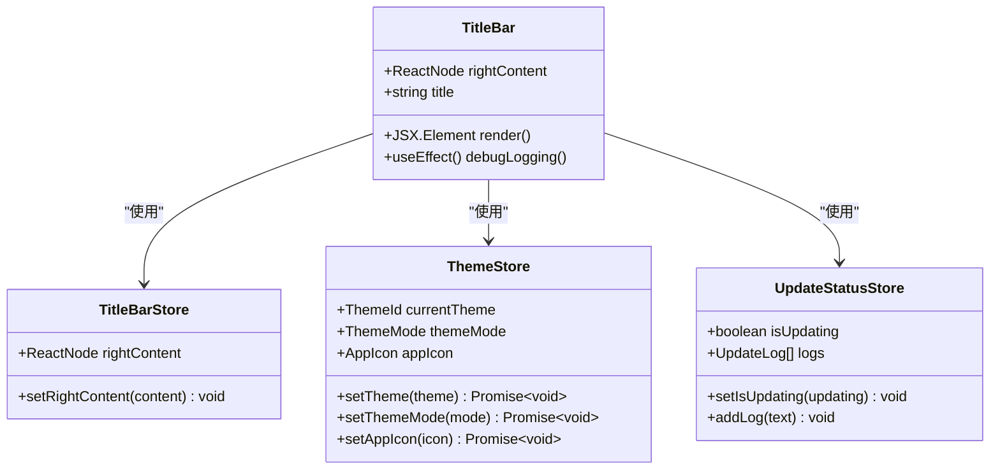
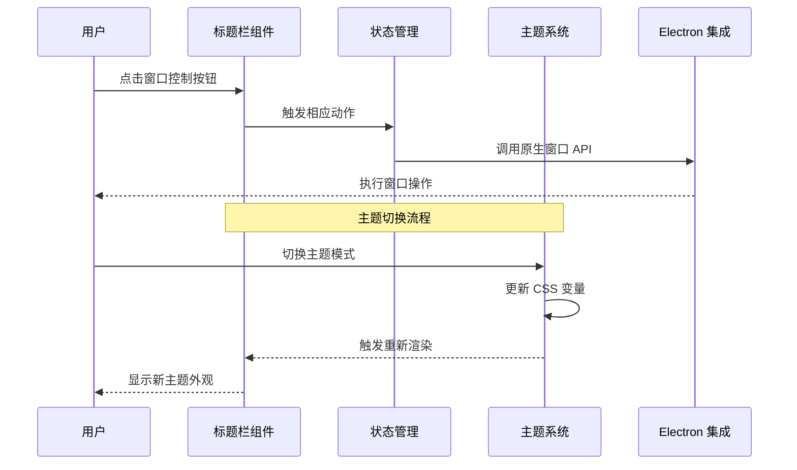
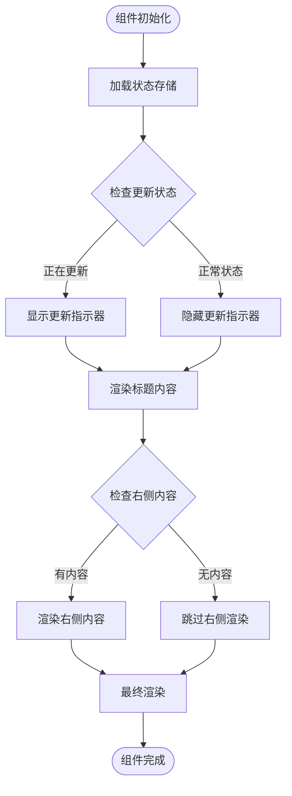
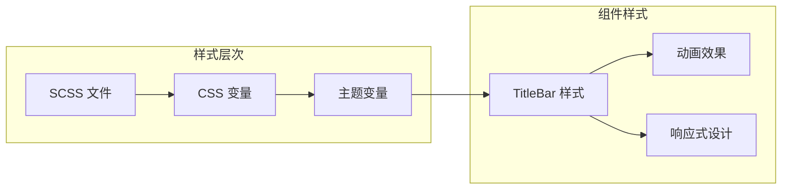
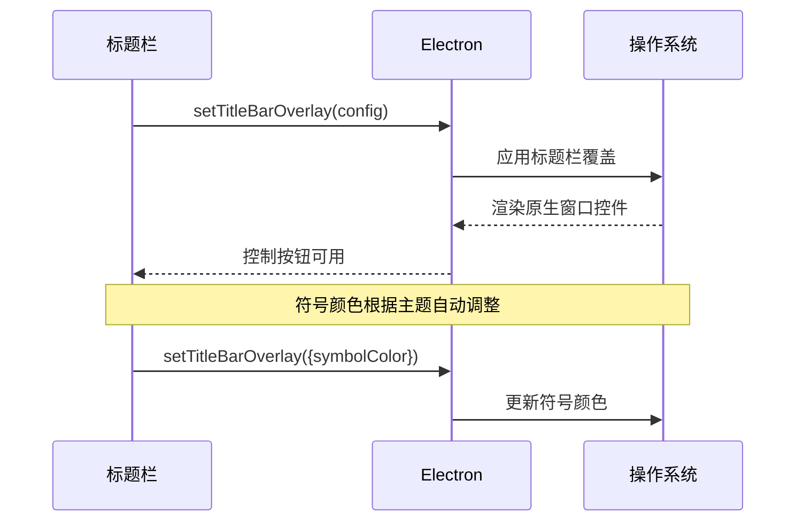
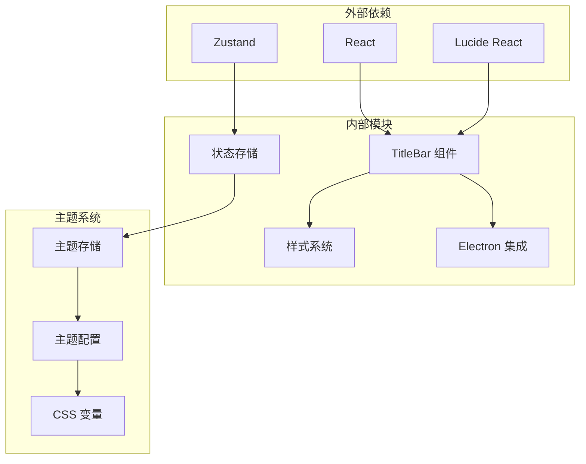

# 标题栏组件

<cite>
**本文档引用的文件**
- [TitleBar.tsx](file://src/components/TitleBar.tsx)
- [TitleBar.scss](file://src/components/TitleBar.scss)
- [titleBarStore.ts](file://src/stores/titleBarStore.ts)
- [themeStore.ts](file://src/stores/themeStore.ts)
- [updateStatusStore.ts](file://src/stores/updateStatusStore.ts)
- [App.tsx](file://src/App.tsx)
- [main.ts](file://electron/main.ts)
- [main.scss](file://src/styles/main.scss)
- [BrowserWindowPage.tsx](file://src/pages/BrowserWindowPage.tsx)
- [ImageWindow.scss](file://src/pages/ImageWindow.scss)
- [WelcomePage.scss](file://src/pages/WelcomePage.scss)
</cite>

## 目录
1. [简介](#简介)
2. [项目结构](#项目结构)
3. [核心组件](#核心组件)
4. [架构概览](#架构概览)
5. [详细组件分析](#详细组件分析)
6. [依赖关系分析](#依赖关系分析)
7. [性能考虑](#性能考虑)
8. [故障排除指南](#故障排除指南)
9. [结论](#结论)
10. [附录](#附录)

## 简介

标题栏组件是 CipherTalk 应用程序的核心界面元素，负责提供统一的窗口控制体验。该组件实现了完整的窗口控制功能，包括最小化、最大化/还原、关闭按钮的原生系统集成功能，以及深色/浅色主题适配。

本组件采用现代化的 React 架构，结合 Zustand 状态管理、CSS 变量主题系统和 Electron 原生窗口集成，为用户提供无缝的跨平台桌面应用体验。

## 项目结构

标题栏组件位于应用程序的组件层次结构中，与主题系统、状态管理和 Electron 集成紧密协作：



**图表来源**
- [App.tsx:40-88](file://src/App.tsx#L40-L88)
- [TitleBar.tsx:13-49](file://src/components/TitleBar.tsx#L13-L49)

**章节来源**
- [TitleBar.tsx:1-52](file://src/components/TitleBar.tsx#L1-L52)
- [App.tsx:40-88](file://src/App.tsx#L40-L88)

## 核心组件

标题栏组件是一个高度模块化的 React 组件，具有以下核心特性：

### 组件架构



**图表来源**
- [TitleBar.tsx:8-17](file://src/components/TitleBar.tsx#L8-L17)
- [titleBarStore.ts:4-12](file://src/stores/titleBarStore.ts#L4-L12)
- [themeStore.ts:67-140](file://src/stores/themeStore.ts#L67-L140)
- [updateStatusStore.ts:9-27](file://src/stores/updateStatusStore.ts#L9-L27)

### 主要功能特性

1. **动态内容管理**: 支持右侧自定义内容注入
2. **主题系统集成**: 完整的深色/浅色主题适配
3. **更新状态指示**: 实时显示数据同步状态
4. **图标动态切换**: 支持节日主题图标切换

**章节来源**
- [TitleBar.tsx:13-49](file://src/components/TitleBar.tsx#L13-L49)
- [titleBarStore.ts:9-12](file://src/stores/titleBarStore.ts#L9-L12)

## 架构概览

标题栏组件的架构设计体现了清晰的关注点分离和模块化原则：



**图表来源**
- [App.tsx:69-88](file://src/App.tsx#L69-L88)
- [themeStore.ts:113-116](file://src/stores/themeStore.ts#L113-L116)

### 系统集成架构

标题栏组件与 Electron 系统的集成体现在多个层面：

1. **窗口控制集成**: 通过 `window.setTitleBarOverlay` 实现原生窗口控制
2. **主题同步**: 自动同步系统主题变化
3. **图标管理**: 动态切换应用图标

**章节来源**
- [App.tsx:69-88](file://src/App.tsx#L69-L88)
- [main.ts:118-123](file://electron/main.ts#L118-L123)

## 详细组件分析

### 标题栏组件实现

标题栏组件采用函数式组件设计，充分利用 React Hooks 进行状态管理：

#### 核心实现逻辑



**图表来源**
- [TitleBar.tsx:13-49](file://src/components/TitleBar.tsx#L13-L49)

#### 状态管理机制

组件通过多个 Zustand 存储实现状态管理：

1. **TitleBarStore**: 管理右侧自定义内容
2. **ThemeStore**: 处理主题和图标状态
3. **UpdateStatusStore**: 监控数据同步状态

**章节来源**
- [TitleBar.tsx:3-6](file://src/components/TitleBar.tsx#L3-L6)
- [titleBarStore.ts:9-12](file://src/stores/titleBarStore.ts#L9-L12)

### 样式系统设计

标题栏组件采用 SCSS 模块化设计，结合 CSS 变量实现主题适配：

#### 样式架构



**图表来源**
- [TitleBar.scss:1-112](file://src/components/TitleBar.scss#L1-L112)
- [main.scss:4-43](file://src/styles/main.scss#L4-L43)

#### 主题适配机制

组件支持多种主题模式的无缝切换：

1. **浅色主题**: 默认白色背景，深色文字
2. **深色主题**: 深色背景，浅色文字
3. **系统主题**: 自动跟随系统主题设置

**章节来源**
- [TitleBar.scss:1-12](file://src/components/TitleBar.scss#L1-L12)
- [main.scss:45-320](file://src/styles/main.scss#L45-L320)

### 窗口控制功能

标题栏组件实现了完整的窗口控制功能，包括原生系统集成功能：

#### 窗口控制集成



**图表来源**
- [App.tsx:76](file://src/App.tsx#L76)

#### 窗口拖拽功能

标题栏实现了智能的窗口拖拽功能：

1. **全局拖拽区域**: 整个标题栏区域可拖拽
2. **精确控制**: 右侧内容区域禁用拖拽
3. **混合模式**: 支持原生拖拽与自定义拖拽

**章节来源**
- [TitleBar.scss:10](file://src/components/TitleBar.scss#L10)
- [TitleBar.scss:56](file://src/components/TitleBar.scss#L56)

### 系统集成特性

标题栏组件与操作系统和 Electron 平台深度集成：

#### Windows 系统适配

1. **原生标题栏**: 使用 `setTitleBarOverlay` 实现原生外观
2. **符号颜色**: 自动根据主题模式调整符号颜色
3. **窗口控制**: 完整支持最小化、最大化、关闭功能

#### 双击标题栏最大化

组件支持双击标题栏进行窗口最大化操作，提供流畅的用户体验。

**章节来源**
- [App.tsx:69-88](file://src/App.tsx#L69-L88)
- [main.ts:196-200](file://electron/main.ts#L196-L200)

## 依赖关系分析

标题栏组件的依赖关系体现了清晰的模块化设计：



**图表来源**
- [TitleBar.tsx:1-6](file://src/components/TitleBar.tsx#L1-L6)
- [themeStore.ts:1-146](file://src/stores/themeStore.ts#L1-L146)

### 关键依赖关系

1. **React 生态系统**: 使用最新 React 特性和 Hooks
2. **状态管理**: 采用轻量级 Zustand 替代 Redux
3. **图标系统**: 集成 Lucide React 图标库
4. **样式系统**: 结合 SCSS 和 CSS 变量

**章节来源**
- [TitleBar.tsx:1-6](file://src/components/TitleBar.tsx#L1-L6)
- [titleBarStore.ts:1-12](file://src/stores/titleBarStore.ts#L1-L12)

## 性能考虑

标题栏组件在设计时充分考虑了性能优化：

### 渲染优化

1. **条件渲染**: 仅在必要时渲染更新指示器
2. **状态隔离**: 将不同状态分离到独立存储中
3. **懒加载**: 图标资源按需加载

### 内存管理

1. **事件清理**: 自动清理事件监听器
2. **存储优化**: 使用原子状态减少不必要的重渲染
3. **资源释放**: 正确管理 Electron 资源

## 故障排除指南

### 常见问题及解决方案

#### 主题切换问题

**问题**: 主题切换后样式不更新
**解决方案**: 
1. 检查 `data-theme` 属性是否正确设置
2. 验证 CSS 变量是否正确更新
3. 确认 `data-mode` 属性同步更新

#### 窗口控制失效

**问题**: 窗口控制按钮无响应
**解决方案**:
1. 检查 Electron 主进程配置
2. 验证 `setTitleBarOverlay` 调用
3. 确认窗口权限设置

#### 图标显示异常

**问题**: 应用图标不显示或显示错误
**解决方案**:
1. 检查图标文件路径
2. 验证 Electron 图标设置
3. 确认主题配置正确

**章节来源**
- [App.tsx:69-88](file://src/App.tsx#L69-L88)
- [themeStore.ts:113-139](file://src/stores/themeStore.ts#L113-L139)

## 结论

标题栏组件展现了现代桌面应用开发的最佳实践，通过精心设计的架构实现了功能完整性、性能优化和用户体验的平衡。组件不仅提供了完整的窗口控制功能，还实现了深度的主题适配和系统集成，为用户提供了专业级的应用体验。

该组件的设计为未来的功能扩展奠定了坚实的基础，包括支持更多窗口控制选项、增强主题定制能力以及进一步优化性能表现。

## 附录

### 使用示例

#### 基本集成

```typescript
// 在应用中引入标题栏
import TitleBar from './components/TitleBar'

function App() {
  return (
    <div className="app-container">
      <TitleBar />
      {/* 其他内容 */}
    </div>
  )
}
```

#### 主题定制

```typescript
// 设置自定义主题
useThemeStore.getState().setTheme('corundum-blue')
useThemeStore.getState().setThemeMode('dark')
```

#### 事件处理

```typescript
// 监听更新状态
useEffect(() => {
  const removeListener = window.electronAPI.dataManagement.onUpdateAvailable(
    (hasUpdate) => {
      useUpdateStatusStore.getState().setIsUpdating(hasUpdate)
    }
  )
  
  return () => removeListener?.()
}, [])
```

### 组件配置选项

| 属性名 | 类型 | 默认值 | 描述 |
|--------|------|--------|------|
| rightContent | ReactNode | null | 右侧自定义内容 |
| title | string | 'CipherTalk' | 标题文本 |

### 扩展指南

1. **添加新的窗口控制按钮**: 通过 `useTitleBarStore` 注入自定义内容
2. **自定义主题**: 在 `main.scss` 中添加新的主题变量
3. **扩展事件处理**: 通过 Electron IPC 添加新的事件监听
4. **样式定制**: 修改 SCSS 文件实现视觉定制