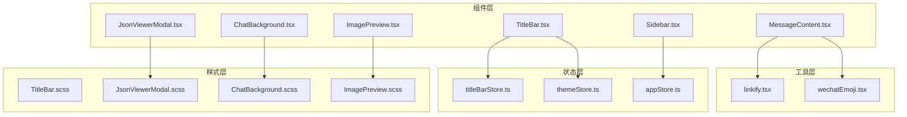
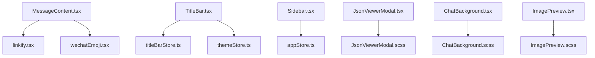
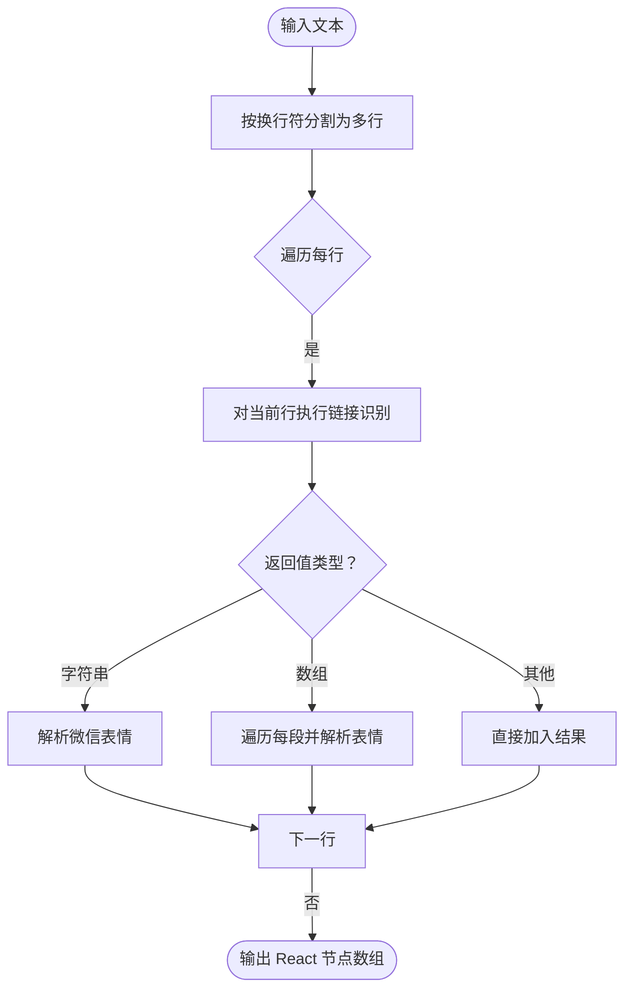
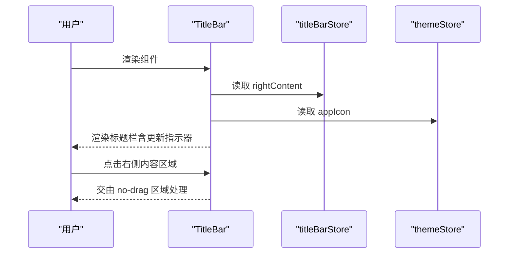
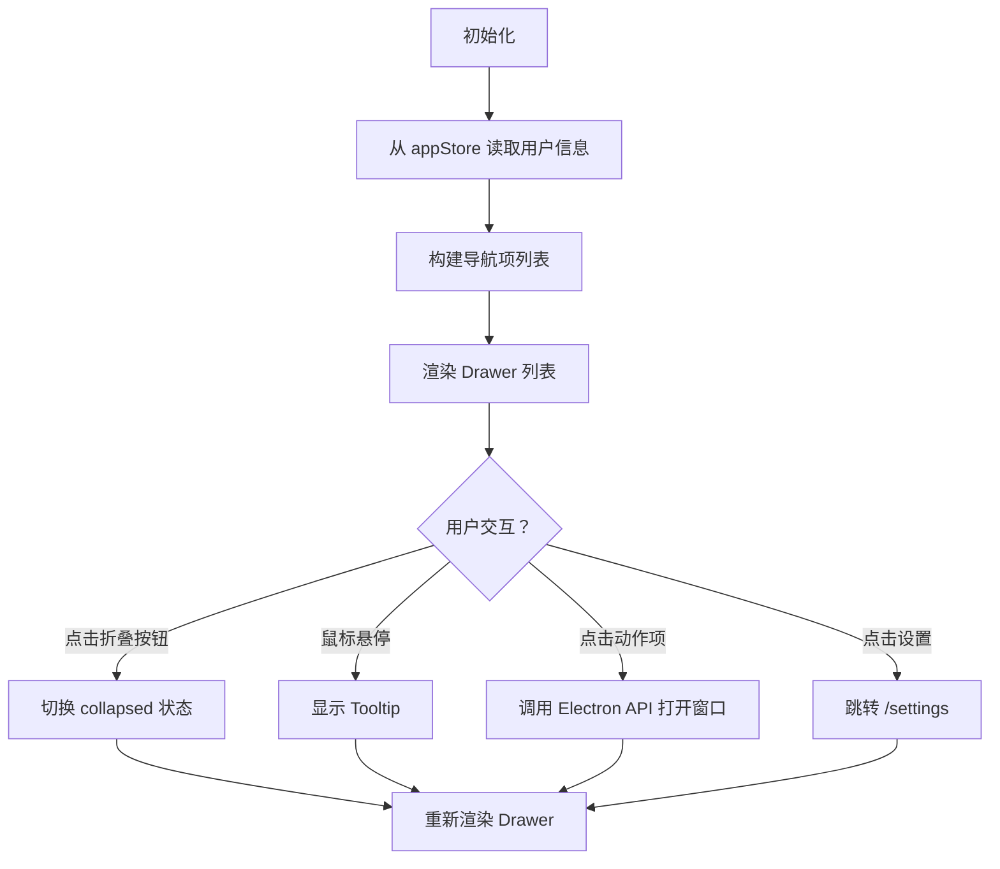
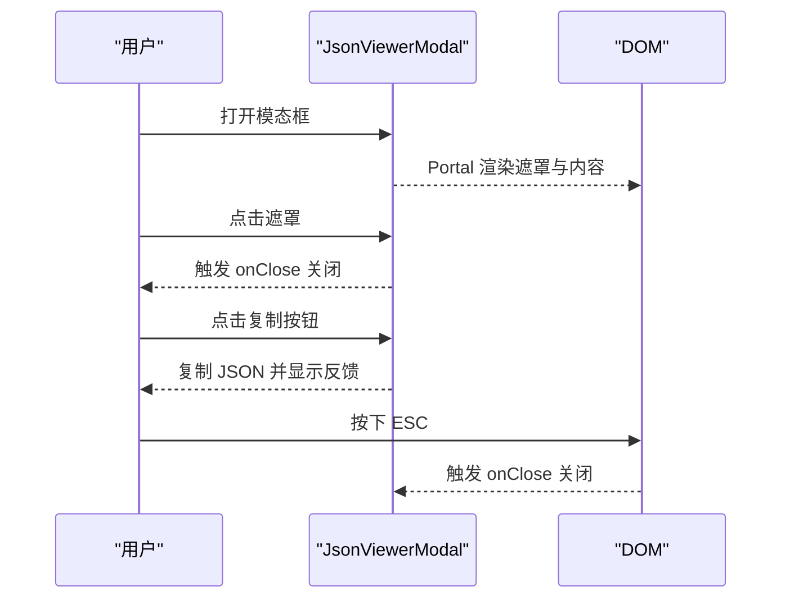
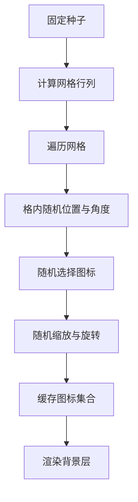
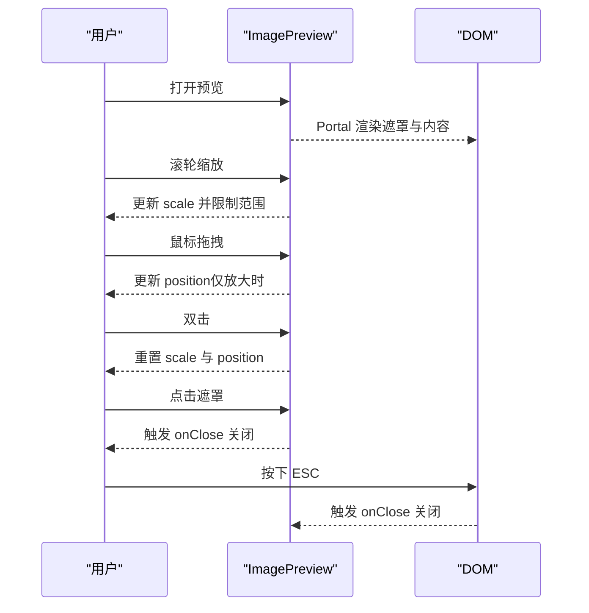
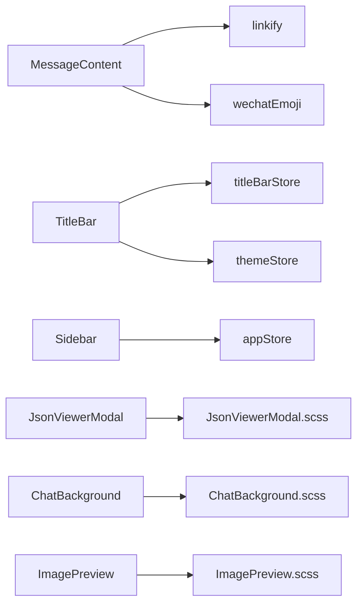

# 核心组件详解

<cite>
**本文档引用的文件**
- [MessageContent.tsx](file://src/components/MessageContent.tsx)
- [linkify.tsx](file://src/utils/linkify.tsx)
- [wechatEmoji.tsx](file://src/utils/wechatEmoji.tsx)
- [TitleBar.tsx](file://src/components/TitleBar.tsx)
- [TitleBar.scss](file://src/components/TitleBar.scss)
- [Sidebar.tsx](file://src/components/Sidebar.tsx)
- [JsonViewerModal.tsx](file://src/components/JsonViewerModal.tsx)
- [JsonViewerModal.scss](file://src/components/JsonViewerModal.scss)
- [ChatBackground.tsx](file://src/components/ChatBackground.tsx)
- [ChatBackground.scss](file://src/components/ChatBackground.scss)
- [ImagePreview.tsx](file://src/components/ImagePreview.tsx)
- [ImagePreview.scss](file://src/components/ImagePreview.scss)
- [titleBarStore.ts](file://src/stores/titleBarStore.ts)
- [themeStore.ts](file://src/stores/themeStore.ts)
- [appStore.ts](file://src/stores/appStore.ts)
</cite>

## 目录
1. [简介](#简介)
2. [项目结构](#项目结构)
3. [核心组件](#核心组件)
4. [架构总览](#架构总览)
5. [详细组件分析](#详细组件分析)
6. [依赖关系分析](#依赖关系分析)
7. [性能考量](#性能考量)
8. [故障排查指南](#故障排查指南)
9. [结论](#结论)
10. [附录](#附录)

## 简介
本文件面向开发者，系统性梳理 CipherTalk 的核心 UI 组件与工具模块，重点覆盖以下方面：
- 消息内容组件：文本处理逻辑、链接识别算法、微信表情解析、换行符转换机制
- 标题栏组件：窗口控制按钮、系统集成、主题适配、拖拽功能
- 侧边栏组件：导航逻辑、状态管理、响应式布局、动画效果
- 模态框组件：对话框行为、遮罩层处理、键盘事件、焦点管理
- 背景组件：渐变效果、图片适配、性能优化
- 图片预览组件：缩放控制、手势支持、加载优化
- 组件使用示例：props 配置、事件处理、样式定制
- 面向开发者的组件集成指南与扩展建议

## 项目结构
本项目采用按功能域划分的目录组织方式，核心组件集中在 src/components，配套样式位于同名 .scss 文件，通用工具位于 src/utils，全局状态通过 Zustand store 管理。

图表来源
- [MessageContent.tsx:1-103](file://src/components/MessageContent.tsx#L1-L103)
- [linkify.tsx:1-115](file://src/utils/linkify.tsx#L1-L115)
- [wechatEmoji.tsx:1-157](file://src/utils/wechatEmoji.tsx#L1-L157)
- [TitleBar.tsx:1-52](file://src/components/TitleBar.tsx#L1-L52)
- [Sidebar.tsx:1-355](file://src/components/Sidebar.tsx#L1-L355)
- [JsonViewerModal.tsx:1-68](file://src/components/JsonViewerModal.tsx#L1-L68)
- [ChatBackground.tsx:1-83](file://src/components/ChatBackground.tsx#L1-L83)
- [ImagePreview.tsx:1-151](file://src/components/ImagePreview.tsx#L1-L151)
- [titleBarStore.ts:1-13](file://src/stores/titleBarStore.ts#L1-L13)
- [themeStore.ts:1-146](file://src/stores/themeStore.ts#L1-L146)
- [appStore.ts:1-97](file://src/stores/appStore.ts#L1-L97)

章节来源
- [MessageContent.tsx:1-103](file://src/components/MessageContent.tsx#L1-L103)
- [TitleBar.tsx:1-52](file://src/components/TitleBar.tsx#L1-L52)
- [Sidebar.tsx:1-355](file://src/components/Sidebar.tsx#L1-L355)
- [JsonViewerModal.tsx:1-68](file://src/components/JsonViewerModal.tsx#L1-L68)
- [ChatBackground.tsx:1-83](file://src/components/ChatBackground.tsx#L1-L83)
- [ImagePreview.tsx:1-151](file://src/components/ImagePreview.tsx#L1-L151)

## 核心组件
本节概述各组件职责与关键实现要点，便于快速定位与集成。

- 消息内容组件（MessageContent）
  - 功能：处理换行符、链接识别、微信表情解析
  - 关键点：按行拆分并插入  ；对每行先执行链接识别，再逐段处理表情；支持禁用链接模式
- 标题栏组件（TitleBar）
  - 功能：应用标题、Logo、更新指示器、右侧自定义区域
  - 关键点：拖拽区域配置、更新状态联动、主题图标切换
- 侧边栏组件（Sidebar）
  - 功能：导航项、用户信息、设置入口、折叠/展开
  - 关键点：MUI Drawer、路由激活态、宽度与透明度过渡、头像与标签动态宽度
- 模态框组件（JsonViewerModal）
  - 功能：JSON 查看与复制、遮罩层点击关闭、语法高亮
  - 关键点：Portal 渲染、高亮规则、复制反馈、响应式样式
- 背景组件（ChatBackground）
  - 功能：聊天背景网格化图标装饰
  - 关键点：固定种子的伪随机分布、网格化布局、旋转与缩放
- 图片预览组件（ImagePreview）
  - 功能：图片/视频预览、滚轮缩放、拖拽平移、ESC 关闭、Live Photo 切换
  - 关键点：Portal 渲染、事件冒泡阻止、边界约束、手势交互

章节来源
- [MessageContent.tsx:10-100](file://src/components/MessageContent.tsx#L10-L100)
- [TitleBar.tsx:13-49](file://src/components/TitleBar.tsx#L13-L49)
- [Sidebar.tsx:37-351](file://src/components/Sidebar.tsx#L37-L351)
- [JsonViewerModal.tsx:23-67](file://src/components/JsonViewerModal.tsx#L23-L67)
- [ChatBackground.tsx:25-80](file://src/components/ChatBackground.tsx#L25-L80)
- [ImagePreview.tsx:14-150](file://src/components/ImagePreview.tsx#L14-L150)

## 架构总览
下图展示组件间的数据流与依赖关系，以及与工具模块和状态层的交互。

图表来源
- [MessageContent.tsx:1-103](file://src/components/MessageContent.tsx#L1-L103)
- [linkify.tsx:1-115](file://src/utils/linkify.tsx#L1-L115)
- [wechatEmoji.tsx:1-157](file://src/utils/wechatEmoji.tsx#L1-L157)
- [TitleBar.tsx:1-52](file://src/components/TitleBar.tsx#L1-L52)
- [Sidebar.tsx:1-355](file://src/components/Sidebar.tsx#L1-L355)
- [JsonViewerModal.tsx:1-68](file://src/components/JsonViewerModal.tsx#L1-L68)
- [ChatBackground.tsx:1-83](file://src/components/ChatBackground.tsx#L1-L83)
- [ImagePreview.tsx:1-151](file://src/components/ImagePreview.tsx#L1-L151)
- [titleBarStore.ts:1-13](file://src/stores/titleBarStore.ts#L1-L13)
- [themeStore.ts:1-146](file://src/stores/themeStore.ts#L1-L146)
- [appStore.ts:1-97](file://src/stores/appStore.ts#L1-L97)

## 详细组件分析

### 消息内容组件（MessageContent）
- 文本处理流程
  - 换行符转换：按 \n 分割为多行，在行间插入   标签
  - 链接识别：对每一行调用 linkifyText，将 URL 转为可点击链接
  - 表情解析：对每一段文本调用 parseWechatEmoji，将 [表情名] 替换为对应图片
  - 禁用链接模式：当 props.disableLinks 为真时，跳过链接识别，仅处理换行与表情
- 性能与健壮性
  - 使用 Fragment 作为中间节点，避免多余 DOM 层
  - 对 linkifyText 返回值进行类型判断，兼容字符串与 ReactNode[]
  - 严格控制 key 唯一性，避免列表渲染异常
- 扩展建议
  - 支持更多富文本标记（如加粗、斜体）
  - 提供自定义链接处理回调（如内部路由）

图表来源
- [MessageContent.tsx:14-64](file://src/components/MessageContent.tsx#L14-L64)
- [linkify.tsx:69-114](file://src/utils/linkify.tsx#L69-L114)
- [wechatEmoji.tsx:21-66](file://src/utils/wechatEmoji.tsx#L21-L66)

章节来源
- [MessageContent.tsx:10-100](file://src/components/MessageContent.tsx#L10-L100)
- [linkify.tsx:69-114](file://src/utils/linkify.tsx#L69-L114)
- [wechatEmoji.tsx:21-66](file://src/utils/wechatEmoji.tsx#L21-L66)

### 标题栏组件（TitleBar）
- 窗口控制与系统集成
  - 拖拽区域：容器设置 -webkit-app-region: drag，右侧区域设置 -webkit-app-region: no-drag
  - 更新指示器：监听更新状态 store，显示旋转动画与提示文本
  - 应用图标：根据主题 store 切换 logo 或新年图标
- 主题适配
  - 使用 CSS 变量与 data-theme 属性，配合暗色主题样式
- 右侧内容插槽
  - 支持外部传入 rightContent，或从 titleBarStore 中读取

图表来源
- [TitleBar.tsx:13-49](file://src/components/TitleBar.tsx#L13-L49)
- [titleBarStore.ts:9-12](file://src/stores/titleBarStore.ts#L9-L12)
- [themeStore.ts:80-140](file://src/stores/themeStore.ts#L80-L140)

章节来源
- [TitleBar.tsx:13-49](file://src/components/TitleBar.tsx#L13-L49)
- [TitleBar.scss:1-112](file://src/components/TitleBar.scss#L1-L112)
- [titleBarStore.ts:1-13](file://src/stores/titleBarStore.ts#L1-L13)
- [themeStore.ts:80-140](file://src/stores/themeStore.ts#L80-L140)

### 侧边栏组件（Sidebar）
- 导航逻辑
  - 内置导航项：首页、聊天查看、朋友圈、分析、导出、数据管理、开放接口
  - 动作项：通过 window.electronAPI 打开特定窗口
  - 激活态：基于当前路由路径高亮选中项
- 状态管理
  - 用户信息：从 appStore 读取昵称、头像等
  - 折叠状态：本地 useState 控制宽度与标签可见性
- 响应式与动画
  - 宽度过渡：220ms cubic-bezier，标签透明度与宽度渐变
  - 选中态：主题主色背景与悬停态颜色变化
- 拖拽与系统集成
  - 通过 MUI Drawer 的 sx 属性配置背景、模糊、边框与滚动策略

图表来源
- [Sidebar.tsx:37-351](file://src/components/Sidebar.tsx#L37-L351)
- [appStore.ts:40-97](file://src/stores/appStore.ts#L40-L97)

章节来源
- [Sidebar.tsx:37-351](file://src/components/Sidebar.tsx#L37-L351)
- [appStore.ts:40-97](file://src/stores/appStore.ts#L40-L97)

### 模态框组件（JsonViewerModal）
- 行为与交互
  - 遮罩层：点击空白处关闭
  - 复制功能：复制格式化后的 JSON，短暂反馈
  - 键盘事件：支持 ESC 关闭（通过 Portal 渲染）
- 样式与主题
  - 暗色主题适配：针对头部、内容区与滚动条进行差异化样式
  - 响应式：移动端尺寸调整与字体大小优化
- 性能
  - 使用 useMemo 缓存高亮结果，避免重复渲染

图表来源
- [JsonViewerModal.tsx:23-67](file://src/components/JsonViewerModal.tsx#L23-L67)
- [JsonViewerModal.scss:1-228](file://src/components/JsonViewerModal.scss#L1-L228)

章节来源
- [JsonViewerModal.tsx:23-67](file://src/components/JsonViewerModal.tsx#L23-L67)
- [JsonViewerModal.scss:1-228](file://src/components/JsonViewerModal.scss#L1-L228)

### 背景组件（ChatBackground）
- 渐变与装饰
  - 固定种子的伪随机分布，保证每次渲染一致性
  - 网格化布局：按 90px 步进，格内留边距，图标随机位置
  - 图标选择与变换：随机选择 lucide-react 图标，随机旋转与缩放
- 性能优化
  - 使用 useMemo 缓存图标集合，避免重复计算
  - 通过 CSS 变量与主题适配，减少运行时样式计算

图表来源
- [ChatBackground.tsx:25-80](file://src/components/ChatBackground.tsx#L25-L80)
- [ChatBackground.scss:1-26](file://src/components/ChatBackground.scss#L1-L26)

章节来源
- [ChatBackground.tsx:25-80](file://src/components/ChatBackground.tsx#L25-L80)
- [ChatBackground.scss:1-26](file://src/components/ChatBackground.scss#L1-L26)

### 图片预览组件（ImagePreview）
- 缩放与手势
  - 滚轮缩放：限制最小/最大比例，避免过度放大或缩小
  - 拖拽平移：仅在放大状态下启用，记录起点并实时更新位置
  - 双击重置：恢复默认缩放与位置
- 视频与 Live Photo
  - 视频支持：自动播放、循环、可控制
  - Live Photo：通过 liveVideoPath 切换照片与视频
- 交互与安全
  - ESC 关闭：监听全局键盘事件
  - 点击遮罩关闭：阻止事件冒泡至容器外
  - Portal 渲染：挂载到 document.body，避免层级与溢出问题

图表来源
- [ImagePreview.tsx:14-150](file://src/components/ImagePreview.tsx#L14-L150)
- [ImagePreview.scss:1-154](file://src/components/ImagePreview.scss#L1-L154)

章节来源
- [ImagePreview.tsx:14-150](file://src/components/ImagePreview.tsx#L14-L150)
- [ImagePreview.scss:1-154](file://src/components/ImagePreview.scss#L1-L154)

## 依赖关系分析
- 组件到工具
  - MessageContent 依赖 linkify 与 wechatEmoji 实现文本增强
- 组件到状态
  - TitleBar 依赖 titleBarStore 与 themeStore
  - Sidebar 依赖 appStore
- 样式与主题
  - 各组件通过 CSS 变量与 data-theme 实现主题适配
- 外部集成
  - Sidebar 与 TitleBar 通过 window.electronAPI 与系统/窗口交互

图表来源
- [MessageContent.tsx:1-103](file://src/components/MessageContent.tsx#L1-L103)
- [linkify.tsx:1-115](file://src/utils/linkify.tsx#L1-L115)
- [wechatEmoji.tsx:1-157](file://src/utils/wechatEmoji.tsx#L1-L157)
- [TitleBar.tsx:1-52](file://src/components/TitleBar.tsx#L1-L52)
- [Sidebar.tsx:1-355](file://src/components/Sidebar.tsx#L1-L355)
- [JsonViewerModal.tsx:1-68](file://src/components/JsonViewerModal.tsx#L1-L68)
- [ChatBackground.tsx:1-83](file://src/components/ChatBackground.tsx#L1-L83)
- [ImagePreview.tsx:1-151](file://src/components/ImagePreview.tsx#L1-L151)
- [titleBarStore.ts:1-13](file://src/stores/titleBarStore.ts#L1-L13)
- [themeStore.ts:1-146](file://src/stores/themeStore.ts#L1-L146)
- [appStore.ts:1-97](file://src/stores/appStore.ts#L1-L97)

章节来源
- [MessageContent.tsx:1-103](file://src/components/MessageContent.tsx#L1-L103)
- [TitleBar.tsx:1-52](file://src/components/TitleBar.tsx#L1-L52)
- [Sidebar.tsx:1-355](file://src/components/Sidebar.tsx#L1-L355)
- [JsonViewerModal.tsx:1-68](file://src/components/JsonViewerModal.tsx#L1-L68)
- [ChatBackground.tsx:1-83](file://src/components/ChatBackground.tsx#L1-L83)
- [ImagePreview.tsx:1-151](file://src/components/ImagePreview.tsx#L1-L151)

## 性能考量
- 渲染优化
  - 使用 useMemo 缓存重型计算（如 ChatBackground 的图标集合、JsonViewerModal 的高亮结果）
  - Fragment 减少不必要的 DOM 层，提升列表渲染效率
- 事件与交互
  - ImagePreview 的拖拽与缩放使用 useCallback，避免重复绑定
  - TitleBar 的更新状态通过 useEffect 记录日志，避免频繁重渲染
- 资源与网络
  - linkify 的 TLD 列表缓存到数据库，减少网络请求与正则构建成本
  - wechatEmoji 的 base64 缓存避免重复 fetch

[本节为通用指导，无需列出具体文件来源]

## 故障排查指南
- 链接无法点击
  - 检查 linkify 是否初始化完成（TLD 列表缓存/拉取）
  - 确认链接前缀补全逻辑与外部打开调用
- 表情未显示
  - 确认表情名是否在 wechat-emojis 支持列表
  - 检查表情图片路径拼接与 public 目录映射
- 模态框无法关闭
  - 确认遮罩层点击事件与 Portal 渲染
  - 检查键盘事件监听是否被其他元素拦截
- 图片预览拖拽无效
  - 确认 scale 条件与 isDragging 状态
  - 检查事件冒泡与容器点击处理
- 标题栏拖拽失效
  - 确认容器与右侧区域的 -webkit-app-region 配置
  - 检查更新指示器与交互区域冲突

章节来源
- [linkify.tsx:35-64](file://src/utils/linkify.tsx#L35-L64)
- [wechatEmoji.tsx:87-155](file://src/utils/wechatEmoji.tsx#L87-L155)
- [JsonViewerModal.tsx:36-40](file://src/components/JsonViewerModal.tsx#L36-L40)
- [ImagePreview.tsx:32-76](file://src/components/ImagePreview.tsx#L32-L76)
- [TitleBar.tsx:20-24](file://src/components/TitleBar.tsx#L20-L24)

## 结论
上述组件围绕“文本增强、系统集成、状态驱动、主题适配、交互体验”五大维度构建，具备良好的可维护性与扩展性。通过工具模块与状态层的解耦，开发者可在不破坏现有行为的前提下，灵活扩展新功能或替换样式方案。

[本节为总结性内容，无需列出具体文件来源]

## 附录

### 组件使用示例与最佳实践
- 消息内容组件（MessageContent）
  - Props
    - content: string（必填）
    - className?: string（可选）
    - disableLinks?: boolean（可选，默认 false）
  - 事件处理
    - 无需事件处理，作为纯展示组件使用
  - 样式定制
    - 通过 className 注入自定义样式，注意与表情图片类名不冲突
  - 示例路径
    - [MessageContent.tsx:70-100](file://src/components/MessageContent.tsx#L70-L100)
- 标题栏组件（TitleBar）
  - Props
    - rightContent?: ReactNode（可选）
    - title?: string（可选）
  - 事件处理
    - 通过 titleBarStore.setRightContent 动态注入右侧内容
  - 样式定制
    - 通过 CSS 变量与 data-theme 切换主题
  - 示例路径
    - [TitleBar.tsx:13-49](file://src/components/TitleBar.tsx#L13-L49)
    - [TitleBar.scss:1-112](file://src/components/TitleBar.scss#L1-L112)
- 侧边栏组件（Sidebar）
  - Props
    - 无（通过 store 与路由集成）
  - 事件处理
    - 动作项通过 window.electronAPI 调用系统窗口
  - 样式定制
    - 通过 sx 属性微调宽度、圆角、过渡时间
  - 示例路径
    - [Sidebar.tsx:37-351](file://src/components/Sidebar.tsx#L37-L351)
- 模态框组件（JsonViewerModal）
  - Props
    - data: any（必填）
    - title?: string（可选）
    - onClose: () => void（必填）
  - 事件处理
    - 点击遮罩、复制按钮、ESC 键
  - 样式定制
    - 通过 JsonViewerModal.scss 调整尺寸、颜色与滚动条
  - 示例路径
    - [JsonViewerModal.tsx:23-67](file://src/components/JsonViewerModal.tsx#L23-L67)
    - [JsonViewerModal.scss:1-228](file://src/components/JsonViewerModal.scss#L1-L228)
- 背景组件（ChatBackground）
  - Props
    - 无
  - 事件处理
    - 无
  - 样式定制
    - 通过 ChatBackground.scss 调整透明度与层级
  - 示例路径
    - [ChatBackground.tsx:25-80](file://src/components/ChatBackground.tsx#L25-L80)
    - [ChatBackground.scss:1-26](file://src/components/ChatBackground.scss#L1-L26)
- 图片预览组件（ImagePreview）
  - Props
    - src: string（必填）
    - isVideo?: boolean（可选）
    - liveVideoPath?: string（可选）
    - onClose: () => void（必填）
  - 事件处理
    - 滚轮缩放、拖拽、双击重置、ESC 关闭、遮罩点击
  - 样式定制
    - 通过 ImagePreview.scss 调整遮罩、按钮与滚动条
  - 示例路径
    - [ImagePreview.tsx:14-150](file://src/components/ImagePreview.tsx#L14-L150)
    - [ImagePreview.scss:1-154](file://src/components/ImagePreview.scss#L1-L154)

### 扩展方法与集成指南
- 新增链接识别规则
  - 在 linkify 中扩展正则或增加协议白名单
  - 注意缓存策略与初始化顺序
  - 参考路径
    - [linkify.tsx:6-64](file://src/utils/linkify.tsx#L6-L64)
- 自定义微信表情包
  - 在 wechatEmoji 中新增表情映射或扩展解析逻辑
  - 确保图片路径与 public 目录一致
  - 参考路径
    - [wechatEmoji.tsx:10-66](file://src/utils/wechatEmoji.tsx#L10-L66)
- 增强标题栏功能
  - 通过 titleBarStore 注入右侧内容，或扩展主题图标
  - 参考路径
    - [titleBarStore.ts:9-12](file://src/stores/titleBarStore.ts#L9-L12)
    - [themeStore.ts:103-111](file://src/stores/themeStore.ts#L103-L111)
- 侧边栏扩展导航
  - 在 navItems 中新增路由项或动作项
  - 通过 window.electronAPI 实现系统窗口打开
  - 参考路径
    - [Sidebar.tsx:75-85](file://src/components/Sidebar.tsx#L75-L85)
- 模态框增强
  - 扩展 JsonViewerModal 的高亮规则或增加导出功能
  - 参考路径
    - [JsonViewerModal.tsx:12-21](file://src/components/JsonViewerModal.tsx#L12-L21)
- 背景组件优化
  - 调整网格密度、图标数量与透明度
  - 参考路径
    - [ChatBackground.tsx:26-61](file://src/components/ChatBackground.tsx#L26-L61)
- 图片预览增强
  - 支持手势缩放、多指旋转或手势关闭
  - 参考路径
    - [ImagePreview.tsx:24-76](file://src/components/ImagePreview.tsx#L24-L76)

章节来源
- [MessageContent.tsx:5-100](file://src/components/MessageContent.tsx#L5-L100)
- [TitleBar.tsx:8-49](file://src/components/TitleBar.tsx#L8-L49)
- [Sidebar.tsx:19-351](file://src/components/Sidebar.tsx#L19-L351)
- [JsonViewerModal.tsx:5-67](file://src/components/JsonViewerModal.tsx#L5-L67)
- [ChatBackground.tsx:25-80](file://src/components/ChatBackground.tsx#L25-L80)
- [ImagePreview.tsx:7-150](file://src/components/ImagePreview.tsx#L7-L150)
- [linkify.tsx:6-64](file://src/utils/linkify.tsx#L6-L64)
- [wechatEmoji.tsx:10-66](file://src/utils/wechatEmoji.tsx#L10-L66)
- [titleBarStore.ts:9-12](file://src/stores/titleBarStore.ts#L9-L12)
- [themeStore.ts:103-111](file://src/stores/themeStore.ts#L103-L111)