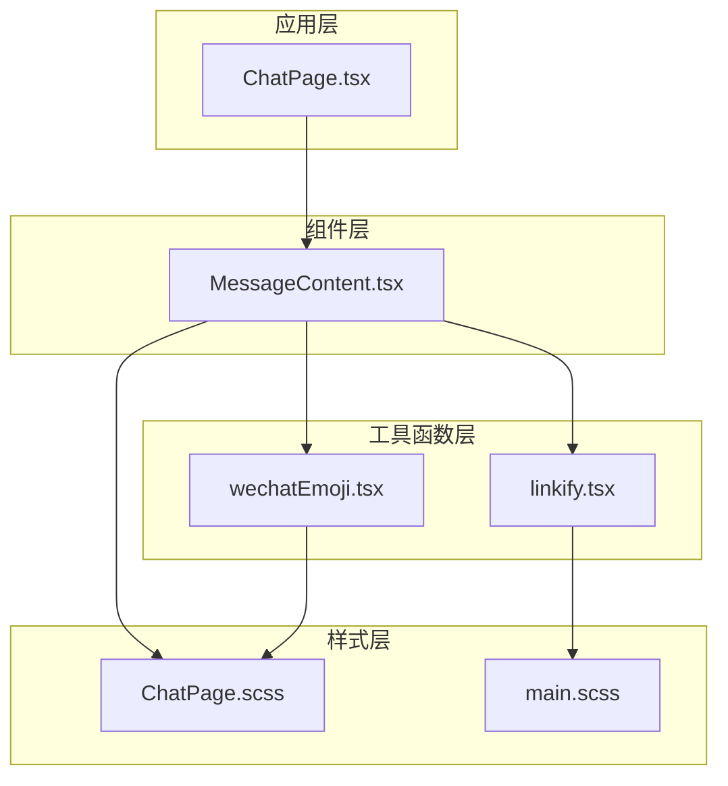
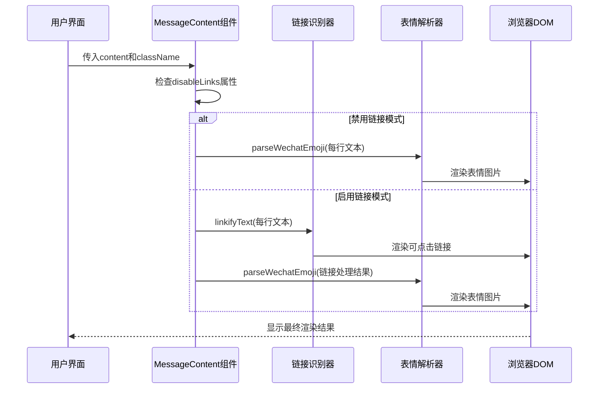
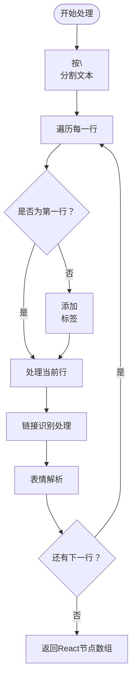
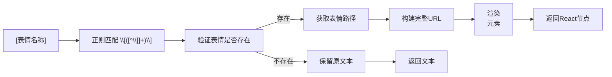
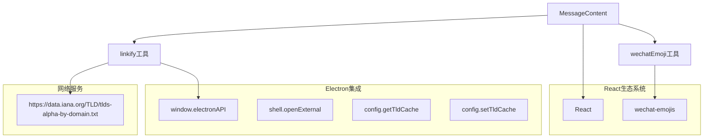

# 消息内容组件

<cite>
**本文档引用的文件**
- [MessageContent.tsx](file://src/components/MessageContent.tsx)
- [linkify.tsx](file://src/utils/linkify.tsx)
- [wechatEmoji.tsx](file://src/utils/wechatEmoji.tsx)
- [ChatPage.tsx](file://src/pages/ChatPage.tsx)
- [ChatPage.scss](file://src/pages/ChatPage.scss)
- [main.scss](file://src/styles/main.scss)
- [package.json](file://package.json)
</cite>

## 目录
1. [简介](#简介)
2. [项目结构](#项目结构)
3. [核心组件](#核心组件)
4. [架构概览](#架构概览)
5. [详细组件分析](#详细组件分析)
6. [依赖关系分析](#依赖关系分析)
7. [性能考虑](#性能考虑)
8. [故障排除指南](#故障排除指南)
9. [结论](#结论)
10. [附录](#附录)

## 简介
消息内容组件是一个专门用于渲染微信聊天记录的React组件，它提供了以下核心功能：
- 文本换行符转换机制（\n到<br/>标签）
- 多行文本渲染策略
- React节点数组构建
- 链接识别算法（linkifyText函数）
- URL匹配规则
- 链接样式处理
- 点击事件绑定
- 微信表情解析（parseWechatEmoji函数）
- 表情包映射表
- 表情渲染优化
- 组件属性配置

该组件在CipherTalk项目中被广泛使用，用于显示聊天消息、系统通知和其他文本内容。

## 项目结构
消息内容组件位于项目的组件目录中，与相关的工具函数和样式文件共同构成了完整的文本渲染解决方案。



**图表来源**
- [MessageContent.tsx:1-103](file://src/components/MessageContent.tsx#L1-L103)
- [linkify.tsx:1-115](file://src/utils/linkify.tsx#L1-L115)
- [wechatEmoji.tsx:1-157](file://src/utils/wechatEmoji.tsx#L1-L157)

**章节来源**
- [MessageContent.tsx:1-103](file://src/components/MessageContent.tsx#L1-L103)
- [package.json:1-169](file://package.json#L1-L169)

## 核心组件
MessageContent组件是整个消息渲染系统的核心，它接收文本内容作为输入，经过处理后输出React节点数组。

### 组件属性配置
组件支持以下属性：

| 属性名 | 类型 | 必需 | 默认值 | 描述 |
|--------|------|------|--------|------|
| content | string | 是 | - | 要渲染的文本内容 |
| className | string | 否 | undefined | 自定义CSS类名 |
| disableLinks | boolean | 否 | false | 是否禁用链接识别功能 |

### 主要功能特性
1. **智能换行处理**：自动将文本中的换行符转换为HTML的<br/>标签
2. **链接识别**：使用复杂的正则表达式识别URL链接
3. **微信表情解析**：支持[表情名称]格式的表情渲染
4. **条件渲染**：根据disableLinks属性决定是否启用链接功能
5. **React节点优化**：构建高效的React节点数组

**章节来源**
- [MessageContent.tsx:5-103](file://src/components/MessageContent.tsx#L5-L103)

## 架构概览
消息内容组件采用分层架构设计，将不同的处理逻辑分离到独立的模块中，实现了高内聚低耦合的设计原则。



**图表来源**
- [MessageContent.tsx:70-100](file://src/components/MessageContent.tsx#L70-L100)
- [linkify.tsx:69-114](file://src/utils/linkify.tsx#L69-L114)
- [wechatEmoji.tsx:21-66](file://src/utils/wechatEmoji.tsx#L21-L66)

## 详细组件分析

### 文本处理逻辑
组件的核心处理流程分为三个主要步骤：

#### 换行符转换机制


**图表来源**
- [MessageContent.tsx:14-64](file://src/components/MessageContent.tsx#L14-L64)

#### 多行文本渲染策略
组件采用逐行处理的方式，确保每行文本都能正确应用链接识别和表情解析功能。对于非禁用链接模式，每行文本都会先经过链接识别处理，然后进行表情解析。

#### React节点数组构建
组件使用React.Fragment来包装处理后的节点，确保不会产生额外的DOM元素。每个节点都有唯一的key属性，便于React进行高效的diff算法。

**章节来源**
- [MessageContent.tsx:14-64](file://src/components/MessageContent.tsx#L14-L64)

### 链接识别算法
linkifyText函数实现了复杂的URL识别和处理逻辑，支持多种URL格式。

#### URL匹配规则
```mermaid
classDiagram
class UrlPattern {
+https? : // 匹配协议
+www\\. 域名前缀
+[-a-zA-Z0-9]* 可选子域名
+\\.(? : ${tlds}) TLD域名
+[/?#][^\\s<>"'{}|\\\\^\\[\\]]* 可选路径参数
}
class TLDList {
+从IANA获取TLD列表
+缓存到Electron配置
+按长度排序确保优先匹配
}
class LinkifyText {
+initTldList() 初始化TLD列表
+linkifyText(text) 处理文本
+buildUrlRegex(pattern) 构建正则表达式
}
LinkifyText --> UrlPattern : 使用
LinkifyText --> TLDList : 依赖
```

**图表来源**
- [linkify.tsx:6-64](file://src/utils/linkify.tsx#L6-L64)
- [linkify.tsx:69-114](file://src/utils/linkify.tsx#L69-L114)

#### URL识别范围
组件支持以下类型的URL识别：
- 完整的HTTP/HTTPS链接
- www开头的域名链接
- 带TLD的域名链接
- 支持查询参数和锚点的链接

#### 链接样式处理
链接采用统一的CSS类名'message-link'，具有以下样式特征：
- 主色调显示
- 悬停时下划线效果
- 自动换行处理
- 指针事件启用

**章节来源**
- [linkify.tsx:69-114](file://src/utils/linkify.tsx#L69-L114)
- [main.scss:416-426](file://src/styles/main.scss#L416-L426)

### 微信表情解析
parseWechatEmoji函数负责将文本中的表情标记转换为对应的图片元素。

#### 表情包映射表


**图表来源**
- [wechatEmoji.tsx:21-66](file://src/utils/wechatEmoji.tsx#L21-L66)

#### 表情渲染优化
组件采用了多项优化措施：
1. **路径缓存**：使用Map缓存表情路径，避免重复查找
2. **条件渲染**：只有在表情存在时才进行渲染
3. **错误处理**：路径获取失败时回退到文本渲染
4. **懒加载**：表情图片采用懒加载策略

#### 性能考虑
- 使用正则表达式的全局标志进行高效匹配
- 避免在循环中创建正则表达式实例
- 实现了基础的缓存机制
- 最小化DOM操作次数

**章节来源**
- [wechatEmoji.tsx:21-66](file://src/utils/wechatEmoji.tsx#L21-L66)
- [wechatEmoji.tsx:81-157](file://src/utils/wechatEmoji.tsx#L81-L157)

### 组件属性配置详解

#### content属性
- **类型**：string
- **必需**：是
- **描述**：要渲染的文本内容，支持多行文本
- **特殊字符**：自动处理换行符、制表符等

#### className属性
- **类型**：string
- **必需**：否
- **默认值**：undefined
- **用途**：为组件根元素添加自定义样式类

#### disableLinks属性
- **类型**：boolean
- **必需**：否
- **默认值**：false
- **行为**：设置为true时禁用链接识别功能，仅进行表情解析

**章节来源**
- [MessageContent.tsx:5-103](file://src/components/MessageContent.tsx#L5-L103)

## 依赖关系分析

### 外部依赖
组件依赖以下外部库和模块：



**图表来源**
- [package.json:54](file://package.json#L54)
- [linkify.tsx:35-64](file://src/utils/linkify.tsx#L35-L64)

### 内部依赖关系
组件之间的依赖关系清晰明确：

1. **MessageContent** → **linkify.tsx**：依赖链接识别功能
2. **MessageContent** → **wechatEmoji.tsx**：依赖表情解析功能
3. **linkify.tsx** → **Electron API**：依赖系统shell功能
4. **wechatEmoji.tsx** → **wechat-emojis库**：依赖第三方表情库

**章节来源**
- [package.json:20-56](file://package.json#L20-L56)
- [linkify.tsx:16-64](file://src/utils/linkify.tsx#L16-L64)

## 性能考虑

### 渲染性能优化
1. **虚拟DOM最小化**：使用React.Fragment避免额外DOM节点
2. **批量处理**：将文本分割为行进行批量处理
3. **缓存机制**：链接TLD列表和表情路径的缓存
4. **条件渲染**：根据属性动态选择处理路径

### 内存管理
- 正则表达式实例的复用
- Map缓存的生命周期管理
- 避免内存泄漏的事件处理器清理

### 网络性能
- TLD列表的本地缓存机制
- 异步获取失败时的降级策略
- 表情图片的懒加载和缓存

## 故障排除指南

### 常见问题及解决方案

#### 链接无法识别
**症状**：URL没有被转换为可点击链接
**可能原因**：
1. TLD列表获取失败
2. URL格式不符合正则表达式
3. disableLinks属性被设置为true

**解决方法**：
1. 检查网络连接和TLD列表缓存
2. 验证URL格式的正确性
3. 确认disableLinks属性设置

#### 表情显示异常
**症状**：[表情名称]显示为纯文本而非图片
**可能原因**：
1. 表情名称不在支持列表中
2. 表情图片路径获取失败
3. 文件系统权限问题

**解决方法**：
1. 验证表情名称的正确性
2. 检查表情文件的存在性
3. 确认文件访问权限

#### 性能问题
**症状**：大量消息渲染缓慢
**可能原因**：
1. 文本内容过大
2. 表情数量过多
3. 链接识别开销大

**解决方法**：
1. 实现虚拟滚动
2. 分批处理消息
3. 优化正则表达式性能

**章节来源**
- [linkify.tsx:16-64](file://src/utils/linkify.tsx#L16-L64)
- [wechatEmoji.tsx:10-16](file://src/utils/wechatEmoji.tsx#L10-L16)

## 结论
消息内容组件是一个设计精良的React组件，它成功地解决了微信聊天记录渲染中的多个技术挑战。通过模块化的架构设计和完善的错误处理机制，该组件能够稳定地处理各种复杂的文本内容。

### 主要优势
1. **功能完整性**：涵盖了链接识别、表情解析、换行处理等所有必要功能
2. **性能优化**：采用了多种优化策略确保渲染效率
3. **可扩展性**：清晰的模块划分便于功能扩展
4. **稳定性**：完善的错误处理和降级策略

### 技术亮点
- 智能的URL识别算法
- 高效的表情解析机制
- 灵活的渲染策略
- 完善的缓存系统

## 附录

### 使用示例

#### 基本用法
```jsx
<MessageContent content="Hello\nWorld" />
```

#### 禁用链接场景
```jsx
<MessageContent content="Visit https://example.com" disableLinks={true} />
```

#### 自定义样式
```jsx
<MessageContent 
  content="Custom styled message" 
  className="my-custom-class" 
/>
```

#### 事件处理
```jsx
<MessageContent 
  content="Interactive message with links" 
  onClick={(e) => console.log('Message clicked')}
/>
```

### 开发者扩展指南

#### 添加新功能
1. 在相应的工具函数中添加新逻辑
2. 更新MessageContent组件以调用新功能
3. 添加适当的单元测试

#### 性能优化建议
1. 实现虚拟滚动处理大量消息
2. 优化正则表达式的复杂度
3. 添加更多的缓存机制
4. 实现懒加载策略

#### 错误处理增强
1. 添加更详细的错误日志
2. 实现重试机制
3. 添加用户友好的错误提示

**章节来源**
- [ChatPage.tsx:6-6](file://src/pages/ChatPage.tsx#L6-L6)
- [ChatPage.tsx:192](file://src/pages/ChatPage.tsx#L192)
- [ChatPage.tsx:3546](file://src/pages/ChatPage.tsx#L3546)