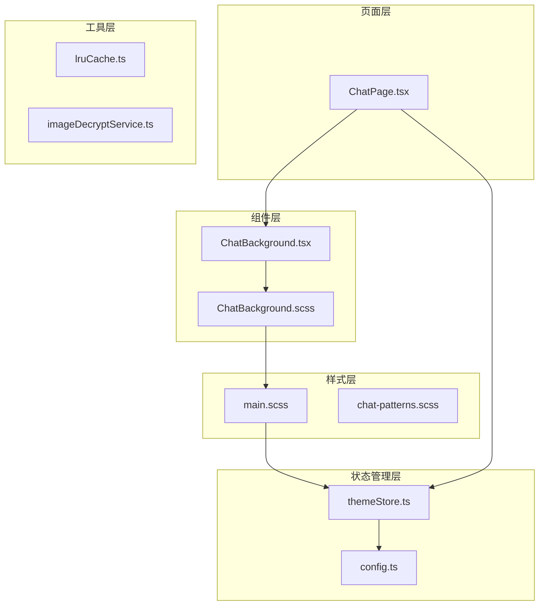
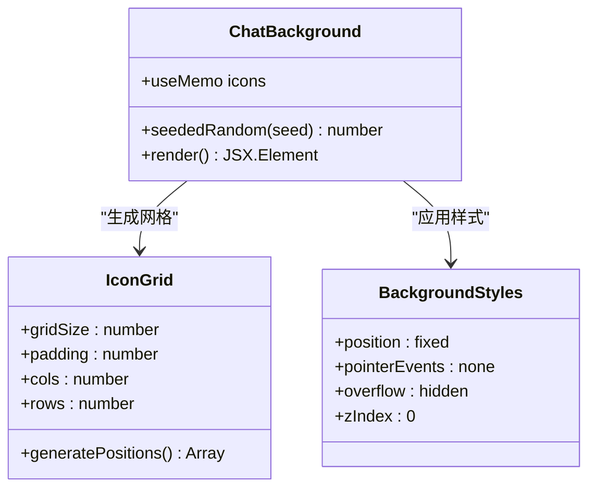
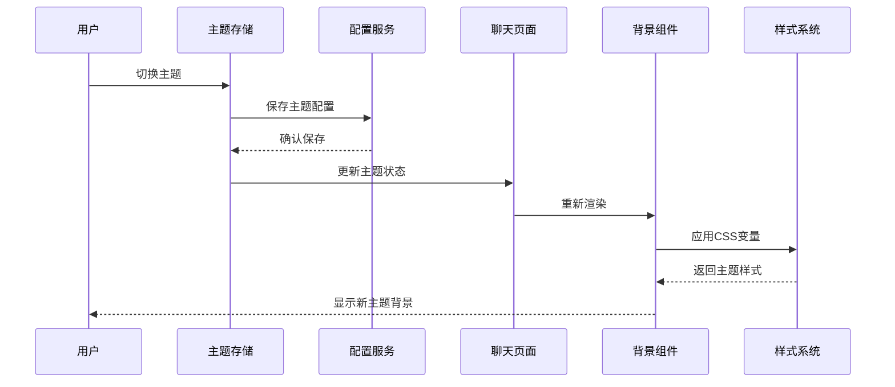
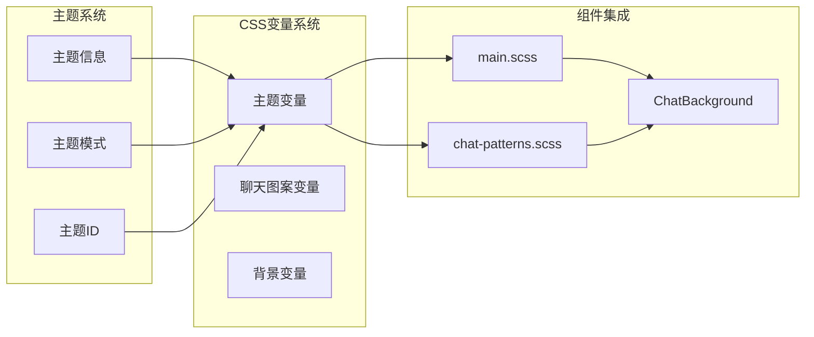
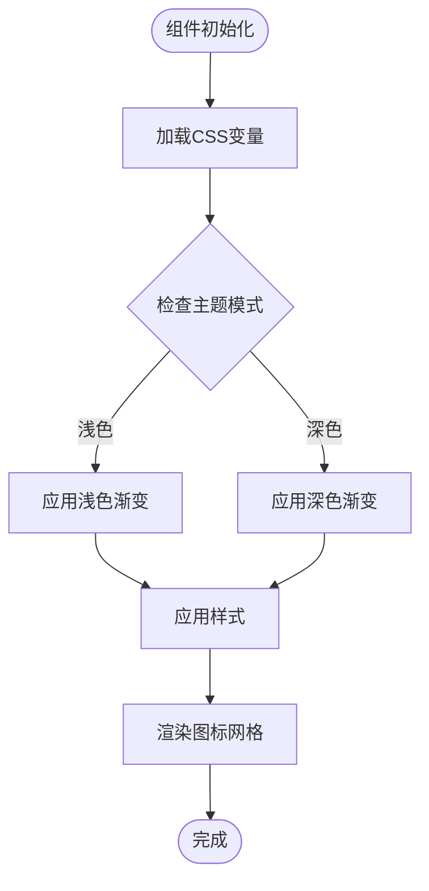
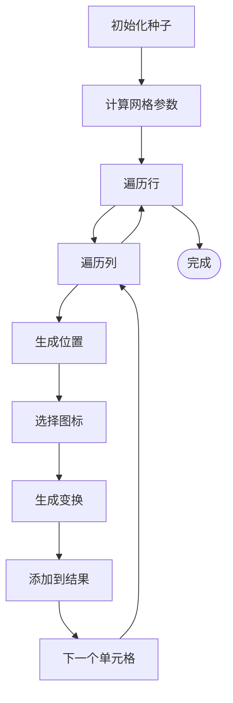
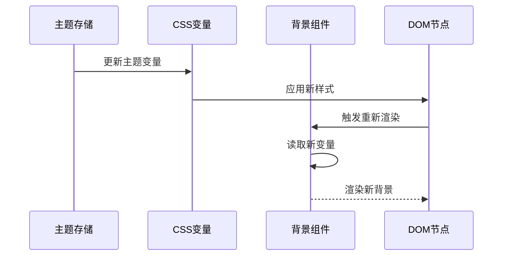
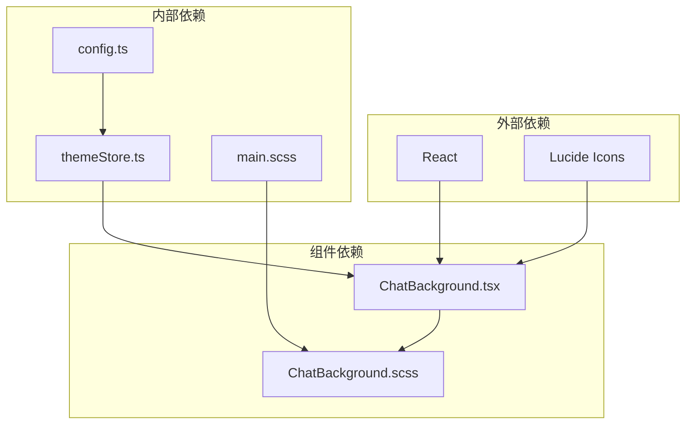

# 聊天背景组件

<cite>
**本文档引用的文件**
- [ChatBackground.tsx](file://src/components/ChatBackground.tsx)
- [ChatBackground.scss](file://src/components/ChatBackground.scss)
- [main.scss](file://src/styles/main.scss)
- [chat-patterns.scss](file://src/styles/chat-patterns.scss)
- [themeStore.ts](file://src/stores/themeStore.ts)
- [config.ts](file://src/services/config.ts)
- [ChatPage.tsx](file://src/pages/ChatPage.tsx)
- [lruCache.ts](file://src/utils/lruCache.ts)
- [imageDecryptService.ts](file://electron/services/imageDecryptService.ts)
</cite>

## 目录
1. [简介](#简介)
2. [项目结构](#项目结构)
3. [核心组件](#核心组件)
4. [架构概览](#架构概览)
5. [详细组件分析](#详细组件分析)
6. [依赖关系分析](#依赖关系分析)
7. [性能考量](#性能考量)
8. [故障排除指南](#故障排除指南)
9. [结论](#结论)
10. [附录](#附录)

## 简介
聊天背景组件是一个轻量级的装饰性UI组件，为聊天界面提供动态背景效果。该组件采用纯前端实现，无需外部资源依赖，通过CSS变量和React组件实现主题系统的无缝集成。组件主要功能包括：
- 动态网格背景装饰
- 图标随机分布效果
- 深浅色主题适配
- 性能优化的渲染策略

## 项目结构
聊天背景组件位于src/components目录下，与主题系统、样式文件形成完整的集成架构。

**图表来源**
- [ChatBackground.tsx:1-83](file://src/components/ChatBackground.tsx#L1-L83)
- [ChatBackground.scss:1-26](file://src/components/ChatBackground.scss#L1-L26)
- [main.scss:1-301](file://src/styles/main.scss#L1-L301)
- [themeStore.ts:1-146](file://src/stores/themeStore.ts#L1-L146)

**章节来源**
- [ChatBackground.tsx:1-83](file://src/components/ChatBackground.tsx#L1-L83)
- [ChatBackground.scss:1-26](file://src/components/ChatBackground.scss#L1-L26)

## 核心组件
聊天背景组件由两个核心文件组成：ChatBackground.tsx（逻辑层）和ChatBackground.scss（样式层）。组件采用函数式组件设计，利用React的useMemo Hook进行性能优化。

### 组件架构

**图表来源**
- [ChatBackground.tsx:25-61](file://src/components/ChatBackground.tsx#L25-L61)
- [ChatBackground.scss:1-17](file://src/components/ChatBackground.scss#L1-L17)

### 核心特性
- **网格系统**：基于90x90像素的网格布局，确保背景元素的规律排列
- **随机分布**：使用种子生成器确保每次渲染的一致性
- **主题适配**：通过CSS变量自动适配深浅色主题
- **性能优化**：使用useMemo避免重复计算

**章节来源**
- [ChatBackground.tsx:25-83](file://src/components/ChatBackground.tsx#L25-L83)
- [ChatBackground.scss:1-26](file://src/components/ChatBackground.scss#L1-L26)

## 架构概览
聊天背景组件与整个应用的主题系统形成紧密集成，通过CSS变量实现动态主题切换。

**图表来源**
- [themeStore.ts:79-140](file://src/stores/themeStore.ts#L79-L140)
- [config.ts:162-171](file://src/services/config.ts#L162-L171)
- [ChatPage.tsx:1-13](file://src/pages/ChatPage.tsx#L1-L13)

## 详细组件分析

### 渐变效果实现
聊天背景组件虽然不直接实现复杂的渐变效果，但与整体主题系统的渐变设计形成协调。

#### CSS渐变定义
组件通过继承全局CSS变量实现渐变效果：
- `--text-primary`: 主要文本颜色变量
- `--bg-gradient`: 背景渐变变量
- `--primary-gradient`: 主色调渐变变量

#### 颜色过渡算法
组件使用简单的透明度过渡：
- 浅色主题：图标透明度0.045
- 深色主题：图标透明度0.055
- 通过`:root[data-mode="dark"]`选择器实现条件样式

#### 动画循环效果
组件本身不包含动画，但可以与页面其他动画元素配合使用。

**章节来源**
- [ChatBackground.scss:8-16](file://src/components/ChatBackground.scss#L8-L16)
- [main.scss:34-43](file://src/styles/main.scss#L34-L43)

### 图片适配机制
聊天背景组件专注于矢量图标而非位图图片，因此不涉及复杂的图片加载和适配逻辑。

#### 背景图片加载
组件不包含背景图片加载功能，主要使用SVG图标作为装饰元素。

#### 尺寸计算
图标尺寸固定为38像素，通过CSS的`size`属性控制。

#### 裁剪策略
组件不涉及图片裁剪，所有元素都保持完整显示。

#### 模糊效果处理
组件不包含模糊效果处理逻辑。

### 主题系统集成
组件与应用的主题系统形成完整的集成架构。

**图表来源**
- [themeStore.ts:3-13](file://src/stores/themeStore.ts#L3-L13)
- [main.scss:12-43](file://src/styles/main.scss#L12-L43)
- [chat-patterns.scss:11-18](file://src/styles/chat-patterns.scss#L11-L18)

#### 深色/浅色主题切换
组件通过CSS变量自动响应主题切换：
- 使用`:root[data-mode="dark"]`选择器
- 条件应用不同的透明度值
- 保持视觉一致性

#### 颜色变量管理
组件依赖以下关键CSS变量：
- `--text-primary`: 控制图标颜色
- `--bg-primary`: 背景主色
- `--bg-secondary`: 背景次色

#### 动态主题更新
主题更新通过以下流程实现：
1. 用户触发主题切换
2. 主题存储更新状态
3. CSS变量实时更新
4. 组件自动重新渲染

#### 用户偏好保存
主题偏好通过配置服务持久化存储。

**章节来源**
- [themeStore.ts:67-140](file://src/stores/themeStore.ts#L67-L140)
- [config.ts:162-171](file://src/services/config.ts#L162-L171)

### 性能优化策略
组件采用多种策略确保高性能渲染。

#### 图片缓存策略
虽然组件不直接处理图片，但项目提供了完善的图片缓存机制：
- LRU缓存实现，限制内存使用
- 电子端缓存服务，支持多种图片格式
- 缓存键值规范化处理

#### 懒加载实现
组件本身不需要懒加载，但页面其他部分实现了完整的懒加载策略：
- 图片懒加载：IntersectionObserver监听
- 预加载机制：提前50-1200px开始加载
- 超时处理：避免长时间加载阻塞

#### 内存管理
- 使用useMemo避免重复计算
- 合理的组件卸载清理
- 缓存容量限制

#### 渲染性能考虑
- 固定的网格布局减少重排
- CSS变量优于JavaScript样式更新
- 避免不必要的DOM操作

**章节来源**
- [lruCache.ts:1-51](file://src/utils/lruCache.ts#L1-L51)
- [imageDecryptService.ts:1303-1458](file://electron/services/imageDecryptService.ts#L1303-L1458)

### 组件配置
组件支持以下配置选项：

#### 背景类型选择
- 网格背景：默认装饰类型
- 可扩展性：支持添加新的背景类型

#### 颜色参数
- 图标颜色：通过`--text-primary`变量控制
- 透明度：根据主题模式自动调整
- 尺寸：固定38像素图标

#### 图片路径
组件不涉及图片路径配置，使用内置SVG图标。

#### 动画参数
组件不包含动画参数，但可以与页面其他动画元素配合使用。

## 使用示例

### 基本背景
在聊天页面中直接引入组件即可获得完整的背景效果。

### 主题切换
组件会自动响应主题切换，无需额外配置。

### 自定义样式
可以通过修改CSS变量来自定义背景样式：
- 修改`--text-primary`改变图标颜色
- 调整`.bg-icon`的透明度
- 自定义网格间距

### 性能优化
- 确保使用useMemo避免重复渲染
- 合理设置网格密度
- 控制图标数量

## 详细组件分析

### 渐变算法实现
组件采用简单的线性渐变，通过CSS变量实现动态主题适配。

**图表来源**
- [main.scss:34-43](file://src/styles/main.scss#L34-L43)
- [ChatBackground.scss:8-16](file://src/components/ChatBackground.scss#L8-L16)

### 图标生成算法
组件使用种子生成器确保每次渲染的一致性。

**图表来源**
- [ChatBackground.tsx:26-61](file://src/components/ChatBackground.tsx#L26-L61)

### 主题系统集成
组件与主题系统的集成通过CSS变量实现。

**图表来源**
- [themeStore.ts:79-140](file://src/stores/themeStore.ts#L79-L140)
- [main.scss:4-43](file://src/styles/main.scss#L4-L43)

**章节来源**
- [ChatBackground.tsx:19-61](file://src/components/ChatBackground.tsx#L19-L61)
- [ChatBackground.scss:8-16](file://src/components/ChatBackground.scss#L8-L16)

## 依赖关系分析

**图表来源**
- [ChatBackground.tsx:1-9](file://src/components/ChatBackground.tsx#L1-L9)
- [themeStore.ts:1-3](file://src/stores/themeStore.ts#L1-L3)
- [main.scss:1-2](file://src/styles/main.scss#L1-L2)

### 组件耦合度
- **低耦合**：组件只依赖CSS变量和React基础功能
- **高内聚**：所有背景相关逻辑集中在单一文件
- **无循环依赖**：清晰的单向依赖关系

### 外部依赖管理
- React：用于组件生命周期和状态管理
- Lucide Icons：提供丰富的SVG图标库
- CSS变量：实现主题系统的动态切换

**章节来源**
- [ChatBackground.tsx:1-9](file://src/components/ChatBackground.tsx#L1-L9)
- [themeStore.ts:1-3](file://src/stores/themeStore.ts#L1-L3)

## 性能考量

### 渲染性能
- 使用useMemo避免重复计算图标位置
- 固定的网格布局减少DOM操作
- CSS变量优于JavaScript样式更新

### 内存优化
- 图标数组在组件挂载时计算一次
- 无额外的状态管理开销
- 合理的组件卸载清理

### 主题切换性能
- CSS变量更新比重新渲染组件更快
- 无需重新计算网格布局
- 平滑的主题过渡效果

## 故障排除指南

### 主题不生效
1. 检查CSS变量是否正确设置
2. 确认`:root[data-mode="dark"]`选择器是否正确
3. 验证主题存储状态是否更新

### 图标显示异常
1. 检查Lucide图标导入是否正确
2. 确认图标组件是否可用
3. 验证CSS类名是否正确

### 性能问题
1. 检查useMemo是否正常工作
2. 确认网格密度设置合理
3. 避免频繁的主题切换

**章节来源**
- [ChatBackground.tsx:25-83](file://src/components/ChatBackground.tsx#L25-L83)
- [ChatBackground.scss:1-26](file://src/components/ChatBackground.scss#L1-L26)

## 结论
聊天背景组件是一个设计精良的装饰性UI组件，具有以下特点：
- **简洁高效**：使用最少的代码实现丰富的视觉效果
- **主题友好**：与整体主题系统无缝集成
- **性能优秀**：采用多种优化策略确保流畅体验
- **易于扩展**：清晰的架构便于功能扩展

组件成功实现了动态网格背景装饰，在不增加外部依赖的情况下提供了高质量的用户体验。

## 附录

### 组件API参考
- **props**: 无（无外部参数）
- **状态**: 无（内部状态管理）
- **事件**: 无（只读组件）

### 主题变量参考
- `--text-primary`: 图标颜色
- `--bg-primary`: 背景主色
- `--bg-secondary`: 背景次色
- `--bg-gradient`: 背景渐变

### 扩展建议
1. 支持自定义图标集合
2. 添加动画效果选项
3. 实现响应式网格布局
4. 增加性能监控功能