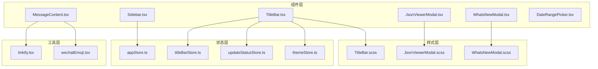
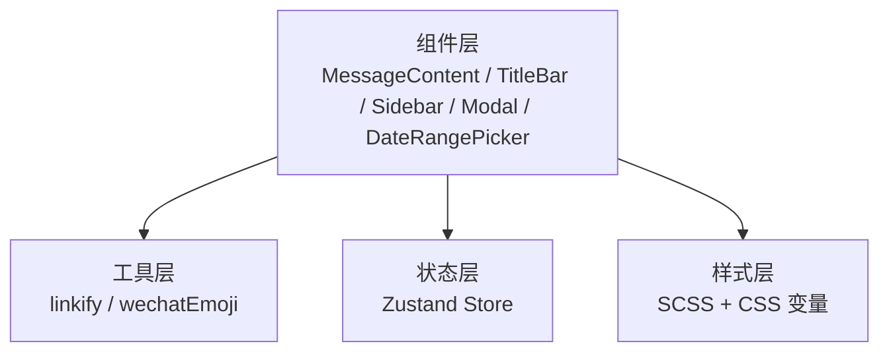
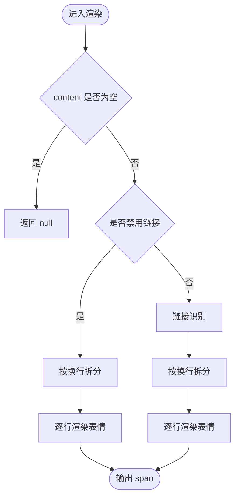
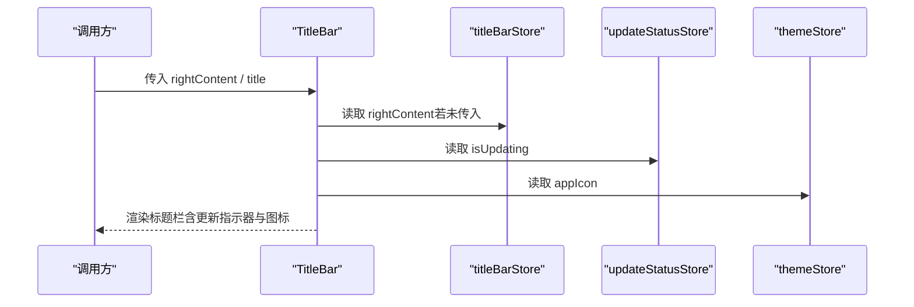
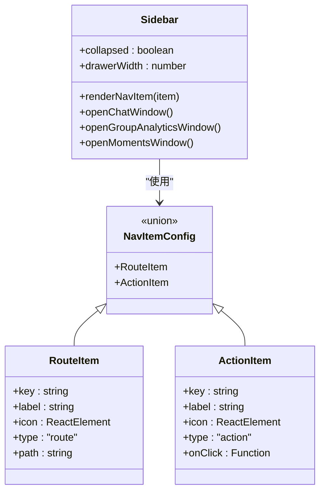
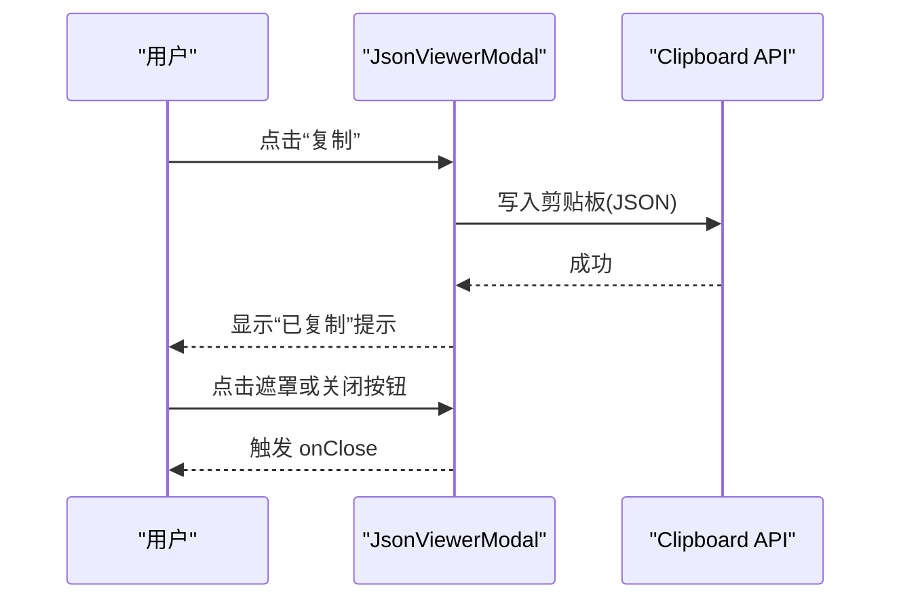
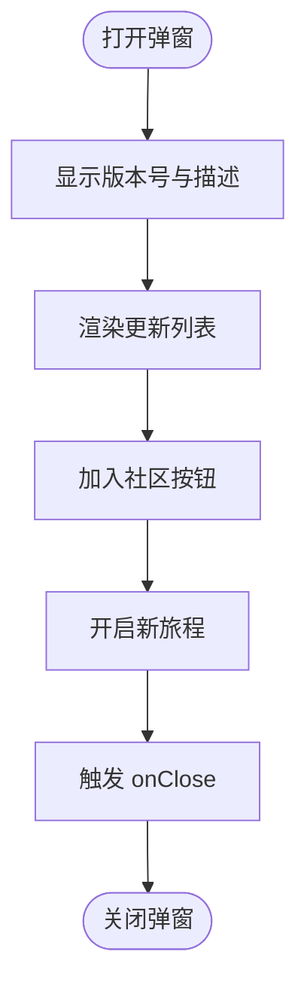
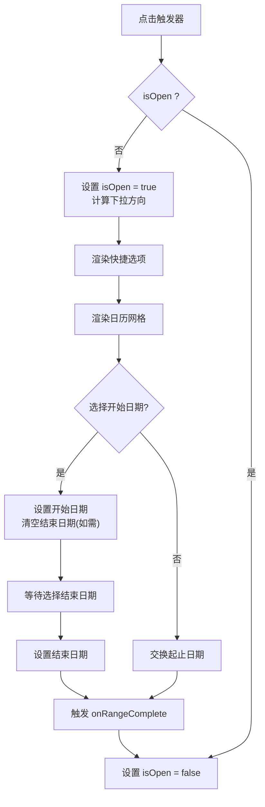
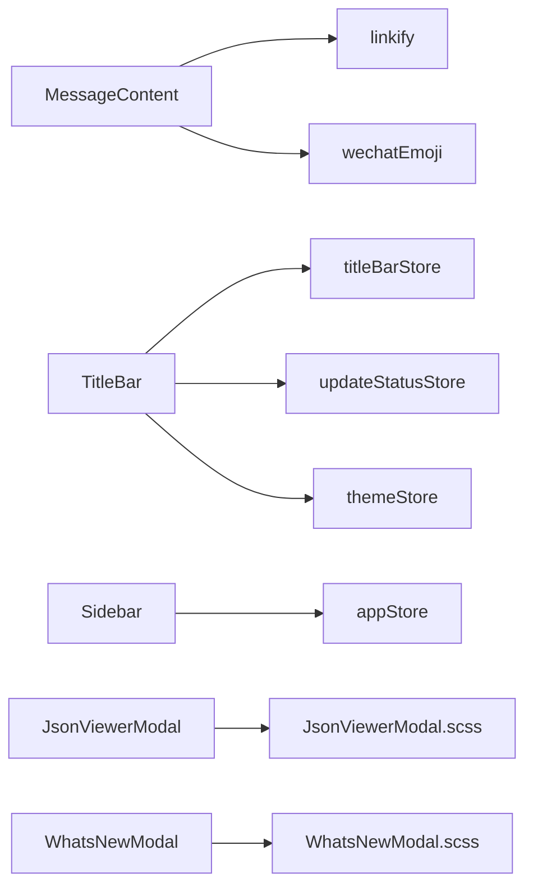

# 组件库设计

<cite>
**本文引用的文件**
- [MessageContent.tsx](file://src/components/MessageContent.tsx)
- [Sidebar.tsx](file://src/components/Sidebar.tsx)
- [TitleBar.tsx](file://src/components/TitleBar.tsx)
- [JsonViewerModal.tsx](file://src/components/JsonViewerModal.tsx)
- [WhatsNewModal.tsx](file://src/components/WhatsNewModal.tsx)
- [TitleBar.scss](file://src/components/TitleBar.scss)
- [JsonViewerModal.scss](file://src/components/JsonViewerModal.scss)
- [WhatsNewModal.scss](file://src/components/WhatsNewModal.scss)
- [DateRangePicker.tsx](file://src/components/DateRangePicker.tsx)
- [wechatEmoji.tsx](file://src/utils/wechatEmoji.tsx)
- [linkify.tsx](file://src/utils/linkify.tsx)
- [appStore.ts](file://src/stores/appStore.ts)
- [titleBarStore.ts](file://src/stores/titleBarStore.ts)
- [themeStore.ts](file://src/stores/themeStore.ts)
- [updateStatusStore.ts](file://src/stores/updateStatusStore.ts)
</cite>

## 目录
1. [引言](#引言)
2. [项目结构](#项目结构)
3. [核心组件](#核心组件)
4. [架构总览](#架构总览)
5. [详细组件分析](#详细组件分析)
6. [依赖关系分析](#依赖关系分析)
7. [性能考量](#性能考量)
8. [故障排查指南](#故障排查指南)
9. [结论](#结论)
10. [附录](#附录)

## 引言
本文件面向前端开发者，系统化梳理 CipherTalk 组件库的设计与实现，重点覆盖以下方面：
- UI 组件分类、命名规范与复用策略
- 核心组件设计：消息内容组件、标题栏组件、侧边栏组件、模态框组件
- 属性设计：props 接口定义、默认值与类型约束
- 状态管理：内部状态、外部控制、状态提升
- 样式系统：CSS 模块化、主题适配、响应式设计
- 可访问性：键盘导航、屏幕阅读器支持、色彩对比
- 组件开发规范：代码风格、测试要求、文档编写
- 最佳实践：如何在项目中高效使用组件库

## 项目结构
组件库位于 src/components 目录，采用按功能分层组织方式：
- 功能型组件：消息内容、标题栏、侧边栏、模态框、日期选择器等
- 工具函数：链接识别、微信表情解析
- 状态管理：Zustand store，集中管理主题、标题栏右侧内容、更新状态、应用状态
- 样式：各组件独立 SCSS 文件，配合 CSS 变量实现主题与响应式

图表来源
- [MessageContent.tsx:1-103](file://src/components/MessageContent.tsx#L1-L103)
- [Sidebar.tsx:1-355](file://src/components/Sidebar.tsx#L1-L355)
- [TitleBar.tsx:1-52](file://src/components/TitleBar.tsx#L1-L52)
- [JsonViewerModal.tsx:1-68](file://src/components/JsonViewerModal.tsx#L1-L68)
- [WhatsNewModal.tsx:1-88](file://src/components/WhatsNewModal.tsx#L1-L88)
- [DateRangePicker.tsx:1-240](file://src/components/DateRangePicker.tsx#L1-L240)
- [linkify.tsx:1-115](file://src/utils/linkify.tsx#L1-L115)
- [wechatEmoji.tsx:1-157](file://src/utils/wechatEmoji.tsx#L1-L157)
- [appStore.ts:1-97](file://src/stores/appStore.ts#L1-L97)
- [titleBarStore.ts:1-13](file://src/stores/titleBarStore.ts#L1-L13)
- [themeStore.ts:1-146](file://src/stores/themeStore.ts#L1-L146)
- [updateStatusStore.ts:1-28](file://src/stores/updateStatusStore.ts#L1-L28)
- [TitleBar.scss:1-112](file://src/components/TitleBar.scss#L1-L112)
- [JsonViewerModal.scss:1-228](file://src/components/JsonViewerModal.scss#L1-L228)
- [WhatsNewModal.scss:1-200](file://src/components/WhatsNewModal.scss#L1-L200)

章节来源
- [MessageContent.tsx:1-103](file://src/components/MessageContent.tsx#L1-L103)
- [Sidebar.tsx:1-355](file://src/components/Sidebar.tsx#L1-L355)
- [TitleBar.tsx:1-52](file://src/components/TitleBar.tsx#L1-L52)
- [JsonViewerModal.tsx:1-68](file://src/components/JsonViewerModal.tsx#L1-L68)
- [WhatsNewModal.tsx:1-88](file://src/components/WhatsNewModal.tsx#L1-L88)
- [DateRangePicker.tsx:1-240](file://src/components/DateRangePicker.tsx#L1-L240)
- [linkify.tsx:1-115](file://src/utils/linkify.tsx#L1-L115)
- [wechatEmoji.tsx:1-157](file://src/utils/wechatEmoji.tsx#L1-L157)
- [appStore.ts:1-97](file://src/stores/appStore.ts#L1-L97)
- [titleBarStore.ts:1-13](file://src/stores/titleBarStore.ts#L1-L13)
- [themeStore.ts:1-146](file://src/stores/themeStore.ts#L1-L146)
- [updateStatusStore.ts:1-28](file://src/stores/updateStatusStore.ts#L1-L28)
- [TitleBar.scss:1-112](file://src/components/TitleBar.scss#L1-L112)
- [JsonViewerModal.scss:1-228](file://src/components/JsonViewerModal.scss#L1-L228)
- [WhatsNewModal.scss:1-200](file://src/components/WhatsNewModal.scss#L1-L200)

## 核心组件
- 消息内容组件：负责换行、链接识别、微信表情渲染，支持禁用链接模式
- 标题栏组件：统一窗口标题栏布局，集成更新状态指示与右侧内容插槽
- 侧边栏组件：基于 Material-UI Drawer 实现的导航侧栏，支持折叠与动态路由
- 模态框组件：JSON 查看器与“新版本”弹窗，提供复制、关闭、外链打开等交互
- 日期选择器：带快捷选项的日历选择器，支持点击外部关闭与上下文定位

章节来源
- [MessageContent.tsx:5-103](file://src/components/MessageContent.tsx#L5-L103)
- [TitleBar.tsx:8-52](file://src/components/TitleBar.tsx#L8-L52)
- [Sidebar.tsx:37-355](file://src/components/Sidebar.tsx#L37-L355)
- [JsonViewerModal.tsx:5-68](file://src/components/JsonViewerModal.tsx#L5-L68)
- [WhatsNewModal.tsx:5-88](file://src/components/WhatsNewModal.tsx#L5-L88)
- [DateRangePicker.tsx:5-240](file://src/components/DateRangePicker.tsx#L5-L240)

## 架构总览
组件库采用“组件 + 工具 + 状态 + 样式”的分层架构：
- 组件层：职责单一、可组合、可复用
- 工具层：通用能力（链接识别、表情解析）封装为纯函数
- 状态层：Zustand store 提供主题、标题栏、更新状态、应用状态
- 样式层：SCSS + CSS 变量，支持主题与响应式

图表来源
- [MessageContent.tsx:1-103](file://src/components/MessageContent.tsx#L1-L103)
- [TitleBar.tsx:1-52](file://src/components/TitleBar.tsx#L1-L52)
- [Sidebar.tsx:1-355](file://src/components/Sidebar.tsx#L1-L355)
- [JsonViewerModal.tsx:1-68](file://src/components/JsonViewerModal.tsx#L1-L68)
- [WhatsNewModal.tsx:1-88](file://src/components/WhatsNewModal.tsx#L1-L88)
- [DateRangePicker.tsx:1-240](file://src/components/DateRangePicker.tsx#L1-L240)
- [linkify.tsx:1-115](file://src/utils/linkify.tsx#L1-L115)
- [wechatEmoji.tsx:1-157](file://src/utils/wechatEmoji.tsx#L1-L157)
- [appStore.ts:1-97](file://src/stores/appStore.ts#L1-L97)
- [titleBarStore.ts:1-13](file://src/stores/titleBarStore.ts#L1-L13)
- [themeStore.ts:1-146](file://src/stores/themeStore.ts#L1-L146)
- [updateStatusStore.ts:1-28](file://src/stores/updateStatusStore.ts#L1-L28)
- [TitleBar.scss:1-112](file://src/components/TitleBar.scss#L1-L112)
- [JsonViewerModal.scss:1-228](file://src/components/JsonViewerModal.scss#L1-L228)
- [WhatsNewModal.scss:1-200](file://src/components/WhatsNewModal.scss#L1-L200)

## 详细组件分析

### 消息内容组件（MessageContent）
- 设计目标：安全地渲染用户消息，自动处理换行、链接与微信表情
- 关键特性
  - 换行处理：将文本中的换行符转换为段落元素
  - 链接识别：通过工具函数识别 URL 并生成可点击链接
  - 表情渲染：将文本中的表情占位符替换为图片
  - 可选禁用链接：在特定场景下仅渲染文本与表情
- 属性设计
  - content: string（必填）
  - className?: string（可选）
  - disableLinks?: boolean（可选，默认 false）
- 性能与复杂度
  - 文本处理为 O(n)，其中 n 为字符数；表情与链接均通过正则扫描
  - 使用 Fragment 与 key 保证列表渲染稳定
- 可访问性
  - 链接使用原生 a 标签，支持键盘访问
  - 表情图片提供 alt 与 title，便于屏幕阅读器识别
- 代码片段路径
  - [MessageContentProps 定义:5-8](file://src/components/MessageContent.tsx#L5-L8)
  - [禁用链接分支:70-90](file://src/components/MessageContent.tsx#L70-L90)
  - [链接与表情处理流程:14-64](file://src/components/MessageContent.tsx#L14-L64)

图表来源
- [MessageContent.tsx:14-100](file://src/components/MessageContent.tsx#L14-L100)
- [linkify.tsx:69-114](file://src/utils/linkify.tsx#L69-L114)
- [wechatEmoji.tsx:21-66](file://src/utils/wechatEmoji.tsx#L21-L66)

章节来源
- [MessageContent.tsx:5-103](file://src/components/MessageContent.tsx#L5-L103)
- [linkify.tsx:1-115](file://src/utils/linkify.tsx#L1-L115)
- [wechatEmoji.tsx:1-157](file://src/utils/wechatEmoji.tsx#L1-L157)

### 标题栏组件（TitleBar）
- 设计目标：统一窗口顶部区域，支持右侧内容插槽与更新状态指示
- 关键特性
  - 右侧内容插槽：支持传入或从 store 注入
  - 更新状态：监听全局更新状态并在标题栏显示旋转指示器
  - 主题图标：根据主题 store 切换应用图标
- 属性设计
  - rightContent?: ReactNode（可选）
  - title?: string（可选，默认使用组件内部逻辑）
- 状态管理
  - 使用标题栏 store 注入右侧内容
  - 使用更新状态 store 控制更新指示器
  - 使用主题 store 获取应用图标
- 代码片段路径
  - [TitleBarProps 定义:8-11](file://src/components/TitleBar.tsx#L8-L11)
  - [右侧内容合并逻辑:14-15](file://src/components/TitleBar.tsx#L14-L15)
  - [更新状态监听与渲染:20-24](file://src/components/TitleBar.tsx#L20-L24)

图表来源
- [TitleBar.tsx:13-49](file://src/components/TitleBar.tsx#L13-L49)
- [titleBarStore.ts:9-12](file://src/stores/titleBarStore.ts#L9-L12)
- [updateStatusStore.ts:16-27](file://src/stores/updateStatusStore.ts#L16-L27)
- [themeStore.ts:79-140](file://src/stores/themeStore.ts#L79-L140)

章节来源
- [TitleBar.tsx:8-52](file://src/components/TitleBar.tsx#L8-L52)
- [TitleBar.scss:1-112](file://src/components/TitleBar.scss#L1-L112)
- [titleBarStore.ts:1-13](file://src/stores/titleBarStore.ts#L1-L13)
- [updateStatusStore.ts:1-28](file://src/stores/updateStatusStore.ts#L1-L28)
- [themeStore.ts:1-146](file://src/stores/themeStore.ts#L1-L146)

### 侧边栏组件（Sidebar）
- 设计目标：提供主应用导航与用户信息展示，支持折叠与动画过渡
- 关键特性
  - 路由项与动作项混合配置
  - 折叠动画：宽度、透明度、标签显隐平滑过渡
  - 用户头像与昵称：支持从 store 读取用户信息
  - Electron 窗口操作：通过 window.electronAPI 打开子窗口
- 状态管理
  - 内部状态：折叠开关
  - 外部状态：用户信息来自 app store
- 代码片段路径
  - [Nav 项配置与渲染:75-190](file://src/components/Sidebar.tsx#L75-L190)
  - [折叠动画与样式计算:40-150](file://src/components/Sidebar.tsx#L40-L150)
  - [用户信息与头像渲染:42-43](file://src/components/Sidebar.tsx#L42-L43)

图表来源
- [Sidebar.tsx:19-35](file://src/components/Sidebar.tsx#L19-L35)
- [Sidebar.tsx:75-190](file://src/components/Sidebar.tsx#L75-L190)

章节来源
- [Sidebar.tsx:37-355](file://src/components/Sidebar.tsx#L37-L355)
- [appStore.ts:3-38](file://src/stores/appStore.ts#L3-L38)

### 模态框组件
#### JSON 查看器（JsonViewerModal）
- 设计目标：以语法高亮的方式展示任意 JSON 数据，支持复制与关闭
- 关键特性
  - 内联高亮：通过正则替换为不同颜色的 span
  - 复制到剪贴板：反馈“已复制”
  - 点击遮罩关闭：提升交互一致性
- 属性设计
  - data: any（必填）
  - title?: string（可选，默认“原始数据”）
  - onClose: () => void（必填）
- 代码片段路径
  - [高亮函数与复制逻辑:12-34](file://src/components/JsonViewerModal.tsx#L12-L34)
  - [遮罩点击关闭:36-40](file://src/components/JsonViewerModal.tsx#L36-L40)

图表来源
- [JsonViewerModal.tsx:23-67](file://src/components/JsonViewerModal.tsx#L23-L67)
- [JsonViewerModal.scss:108-165](file://src/components/JsonViewerModal.scss#L108-L165)

章节来源
- [JsonViewerModal.tsx:5-68](file://src/components/JsonViewerModal.tsx#L5-L68)
- [JsonViewerModal.scss:1-228](file://src/components/JsonViewerModal.scss#L1-L228)

#### 新版本弹窗（WhatsNewModal）
- 设计目标：展示版本更新内容，引导用户加入社区
- 关键特性
  - 版本号展示与“开启新旅程”按钮
  - 社区入口：打开外部链接
  - 响应式布局与动画
- 属性设计
  - onClose: () => void（必填）
  - version: string（必填）
- 代码片段路径
  - [更新列表与社区入口:11-46](file://src/components/WhatsNewModal.tsx#L11-L46)
  - [按钮交互与关闭回调:74-81](file://src/components/WhatsNewModal.tsx#L74-L81)

图表来源
- [WhatsNewModal.tsx:10-85](file://src/components/WhatsNewModal.tsx#L10-L85)
- [WhatsNewModal.scss:1-200](file://src/components/WhatsNewModal.scss#L1-L200)

章节来源
- [WhatsNewModal.tsx:5-88](file://src/components/WhatsNewModal.tsx#L5-L88)
- [WhatsNewModal.scss:1-200](file://src/components/WhatsNewModal.scss#L1-L200)

### 日期选择器（DateRangePicker）
- 设计目标：提供直观的时间范围选择，支持快捷选项与日历视图
- 关键特性
  - 快捷选项：今天、最近 N 天、全部时间
  - 日历网格：渲染当月日历，高亮起止与区间
  - 点击外部关闭：提升可用性
  - 上下文定位：根据触发元素位置自动调整下拉方向
- 属性设计
  - startDate: string（必填）
  - endDate: string（必填）
  - onStartDateChange: (date: string) => void（必填）
  - onEndDateChange: (date: string) => void（必填）
  - onRangeComplete?: () => void（可选）
- 代码片段路径
  - [快捷选项与日期计算:60-93](file://src/components/DateRangePicker.tsx#L60-L93)
  - [日历网格与高亮逻辑:155-183](file://src/components/DateRangePicker.tsx#L155-L183)

图表来源
- [DateRangePicker.tsx:26-237](file://src/components/DateRangePicker.tsx#L26-L237)

章节来源
- [DateRangePicker.tsx:5-240](file://src/components/DateRangePicker.tsx#L5-L240)

## 依赖关系分析
- 组件间依赖
  - MessageContent 依赖 linkify 与 wechatEmoji 工具
  - TitleBar 依赖多个 store 与样式
  - Sidebar 依赖 appStore 与 Electron API
  - 模态框组件依赖各自样式文件
- 状态依赖
  - appStore：用户信息、数据库连接状态、解密进度
  - titleBarStore：标题栏右侧内容
  - themeStore：主题、主题模式、应用图标
  - updateStatusStore：更新状态与日志
- 外部依赖
  - Material-UI 组件（Avatar、Box、Drawer、List 等）
  - Electron API（window.electronAPI）

图表来源
- [MessageContent.tsx:1-103](file://src/components/MessageContent.tsx#L1-L103)
- [linkify.tsx:1-115](file://src/utils/linkify.tsx#L1-L115)
- [wechatEmoji.tsx:1-157](file://src/utils/wechatEmoji.tsx#L1-L157)
- [TitleBar.tsx:1-52](file://src/components/TitleBar.tsx#L1-L52)
- [Sidebar.tsx:1-355](file://src/components/Sidebar.tsx#L1-L355)
- [JsonViewerModal.tsx:1-68](file://src/components/JsonViewerModal.tsx#L1-L68)
- [WhatsNewModal.tsx:1-88](file://src/components/WhatsNewModal.tsx#L1-L88)
- [titleBarStore.ts:1-13](file://src/stores/titleBarStore.ts#L1-L13)
- [updateStatusStore.ts:1-28](file://src/stores/updateStatusStore.ts#L1-L28)
- [themeStore.ts:1-146](file://src/stores/themeStore.ts#L1-L146)
- [appStore.ts:1-97](file://src/stores/appStore.ts#L1-L97)
- [JsonViewerModal.scss:1-228](file://src/components/JsonViewerModal.scss#L1-L228)
- [WhatsNewModal.scss:1-200](file://src/components/WhatsNewModal.scss#L1-L200)

章节来源
- [appStore.ts:1-97](file://src/stores/appStore.ts#L1-L97)
- [titleBarStore.ts:1-13](file://src/stores/titleBarStore.ts#L1-L13)
- [themeStore.ts:1-146](file://src/stores/themeStore.ts#L1-L146)
- [updateStatusStore.ts:1-28](file://src/stores/updateStatusStore.ts#L1-L28)

## 性能考量
- 文本处理
  - MessageContent 对链接与表情的处理均为 O(n)，建议在高频渲染场景下缓存中间结果
- 正则与 DOM
  - linkify 使用惰性初始化的正则，避免重复构建
  - wechatEmoji 使用缓存避免重复请求表情资源
- 动画与布局
  - Sidebar 的折叠使用 CSS 过渡，尽量减少强制布局
  - DateRangePicker 根据可视区域自动调整下拉方向，避免溢出
- 状态更新
  - Zustand store 采用局部更新，避免不必要的重渲染

## 故障排查指南
- 链接无法点击
  - 检查 linkify 的初始化与 TLD 缓存是否成功
  - 确认链接事件绑定与 preventDefault 是否正确执行
  - 参考：[linkify 初始化与正则构建:35-64](file://src/utils/linkify.tsx#L35-L64)
- 表情未显示
  - 检查表情名称是否在支持列表中
  - 确认表情资源路径与网络访问权限
  - 参考：[wechatEmoji 路径解析与缓存:10-16](file://src/utils/wechatEmoji.tsx#L10-L16)
- 侧边栏折叠异常
  - 检查 CSS 变量与过渡动画是否生效
  - 确认 Drawer 宽度计算与状态切换逻辑
  - 参考：[Sidebar 折叠与样式计算:40-150](file://src/components/Sidebar.tsx#L40-L150)
- 标题栏图标不更新
  - 检查 themeStore 的 setAppIcon 与 Electron 配置保存
  - 参考：[themeStore 应用图标设置:103-111](file://src/stores/themeStore.ts#L103-L111)
- 模态框无法关闭
  - 确认遮罩点击与关闭按钮事件绑定
  - 参考：[JsonViewerModal 遮罩关闭:36-40](file://src/components/JsonViewerModal.tsx#L36-L40)

章节来源
- [linkify.tsx:1-115](file://src/utils/linkify.tsx#L1-L115)
- [wechatEmoji.tsx:1-157](file://src/utils/wechatEmoji.tsx#L1-L157)
- [Sidebar.tsx:1-355](file://src/components/Sidebar.tsx#L1-L355)
- [themeStore.ts:1-146](file://src/stores/themeStore.ts#L1-L146)
- [JsonViewerModal.tsx:1-68](file://src/components/JsonViewerModal.tsx#L1-L68)

## 结论
CipherTalk 组件库通过清晰的分层设计与工具化能力，实现了高内聚、低耦合的 UI 组件体系。核心组件围绕“可组合、可扩展、可维护”的原则构建，结合 Zustand 状态管理与 CSS 变量主题系统，满足多主题与响应式需求。建议在实际项目中遵循本文档的属性设计、状态管理与可访问性规范，持续完善测试与文档，以提升组件库的稳定性与可复用性。

## 附录
- 组件命名规范
  - 文件名采用 PascalCase，如 MessageContent.tsx
  - 组件导出默认导出，便于按需引入
- 属性设计规范
  - 必填字段明确标注，可选字段提供合理默认值
  - 类型约束使用 TypeScript 接口，避免运行时错误
- 状态管理规范
  - 内部状态尽量保持局部化，避免过度提升
  - 外部控制通过 props 明确传递，增强可控性
- 样式规范
  - 使用 SCSS + CSS 变量，统一主题与响应式断点
  - 为暗色主题提供适配规则
- 可访问性规范
  - 为交互元素提供键盘可达性
  - 为图片提供替代文本与标题
  - 确保足够的色彩对比度
- 测试与文档
  - 为关键工具函数提供单元测试
  - 为组件提供 Storybook 或示例页面
  - 维护变更日志与组件 API 文档