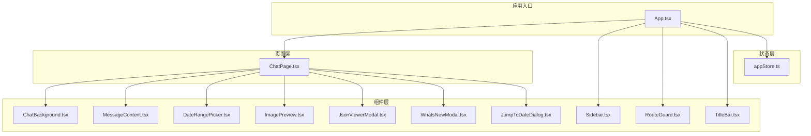
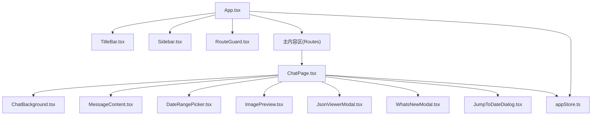
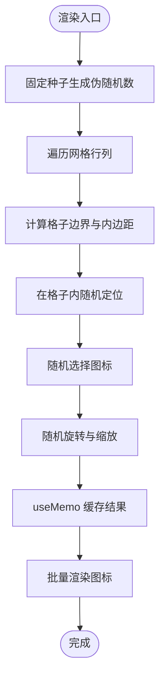
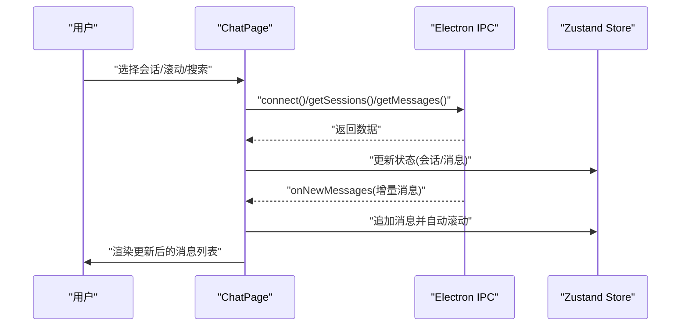
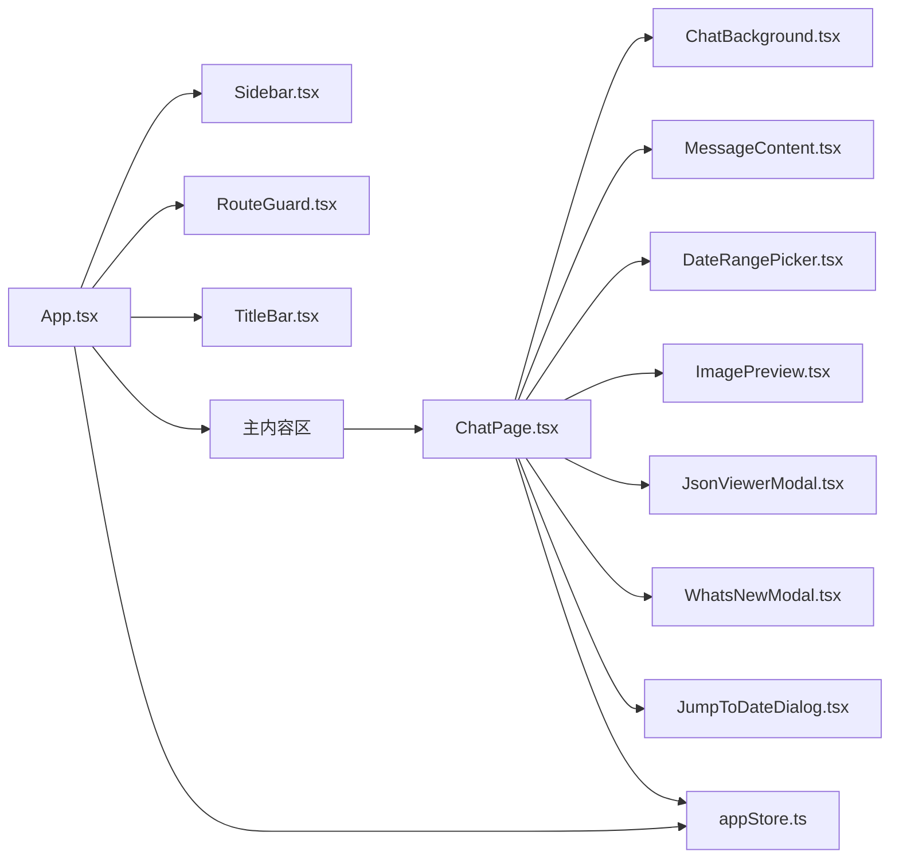

# 组件架构设计

<cite>
**本文引用的文件**
- [src/components/ChatBackground.tsx](file://src/components/ChatBackground.tsx)
- [src/components/ChatBackground.scss](file://src/components/ChatBackground.scss)
- [src/components/MessageContent.tsx](file://src/components/MessageContent.tsx)
- [src/components/Sidebar.tsx](file://src/components/Sidebar.tsx)
- [src/components/DateRangePicker.tsx](file://src/components/DateRangePicker.tsx)
- [src/components/DateRangePicker.scss](file://src/components/DateRangePicker.scss)
- [src/components/ImagePreview.tsx](file://src/components/ImagePreview.tsx)
- [src/components/RouteGuard.tsx](file://src/components/RouteGuard.tsx)
- [src/components/TitleBar.tsx](file://src/components/TitleBar.tsx)
- [src/components/JsonViewerModal.tsx](file://src/components/JsonViewerModal.tsx)
- [src/components/WhatsNewModal.tsx](file://src/components/WhatsNewModal.tsx)
- [src/components/JumpToDateDialog.tsx](file://src/components/JumpToDateDialog.tsx)
- [src/pages/ChatPage.tsx](file://src/pages/ChatPage.tsx)
- [src/stores/appStore.ts](file://src/stores/appStore.ts)
- [src/App.tsx](file://src/App.tsx)
</cite>

## 目录
1. [引言](#引言)
2. [项目结构](#项目结构)
3. [核心组件](#核心组件)
4. [架构总览](#架构总览)
5. [组件详细分析](#组件详细分析)
6. [依赖关系分析](#依赖关系分析)
7. [性能考量](#性能考量)
8. [故障排查指南](#故障排查指南)
9. [结论](#结论)
10. [附录](#附录)

## 引言
本文件面向 CipherTalk 的前端组件架构，系统化梳理组件分类体系（功能性组件、复合组件、容器组件）、命名规范、复用策略、层次结构、生命周期管理、性能优化与最佳实践。文档以仓库现有组件为依据，结合页面与状态管理模块，给出可落地的设计与实现建议。

## 项目结构
项目采用“页面 + 组件 + 存储 + 服务”的分层组织方式：
- 页面层：负责路由与布局，承载复杂交互与状态管理逻辑
- 组件层：可复用的功能单元，分为功能性组件（纯渲染）、复合组件（组合多个子组件）、容器组件（绑定状态与副作用）
- 存储层：Zustand 状态管理，提供应用级状态与派生状态
- 服务层：Electron 与后端交互封装，提供 IPC 接口

图表来源
- [src/App.tsx:40-538](file://src/App.tsx#L40-L538)
- [src/pages/ChatPage.tsx:1-800](file://src/pages/ChatPage.tsx#L1-L800)
- [src/components/ChatBackground.tsx:1-83](file://src/components/ChatBackground.tsx#L1-L83)
- [src/components/MessageContent.tsx:1-103](file://src/components/MessageContent.tsx#L1-L103)
- [src/components/Sidebar.tsx:1-355](file://src/components/Sidebar.tsx#L1-L355)
- [src/components/DateRangePicker.tsx:1-240](file://src/components/DateRangePicker.tsx#L1-L240)
- [src/components/ImagePreview.tsx:1-151](file://src/components/ImagePreview.tsx#L1-L151)
- [src/components/RouteGuard.tsx:1-30](file://src/components/RouteGuard.tsx#L1-L30)
- [src/components/TitleBar.tsx:1-52](file://src/components/TitleBar.tsx#L1-L52)
- [src/components/JsonViewerModal.tsx:1-68](file://src/components/JsonViewerModal.tsx#L1-L68)
- [src/components/WhatsNewModal.tsx:1-88](file://src/components/WhatsNewModal.tsx#L1-L88)
- [src/components/JumpToDateDialog.tsx:1-180](file://src/components/JumpToDateDialog.tsx#L1-L180)
- [src/stores/appStore.ts:1-97](file://src/stores/appStore.ts#L1-L97)

章节来源
- [src/App.tsx:40-538](file://src/App.tsx#L40-L538)
- [src/stores/appStore.ts:1-97](file://src/stores/appStore.ts#L1-L97)

## 核心组件
- 功能性组件：仅负责渲染与少量简单逻辑，如 ChatBackground、MessageContent、TitleBar、JsonViewerModal、WhatsNewModal、JumpToDateDialog
- 复合组件：组合多个功能性组件与容器组件，如 Sidebar、DateRangePicker
- 容器组件：绑定状态、副作用与业务逻辑，如 ChatPage、RouteGuard

章节来源
- [src/components/ChatBackground.tsx:1-83](file://src/components/ChatBackground.tsx#L1-L83)
- [src/components/MessageContent.tsx:1-103](file://src/components/MessageContent.tsx#L1-L103)
- [src/components/TitleBar.tsx:1-52](file://src/components/TitleBar.tsx#L1-L52)
- [src/components/JsonViewerModal.tsx:1-68](file://src/components/JsonViewerModal.tsx#L1-L68)
- [src/components/WhatsNewModal.tsx:1-88](file://src/components/WhatsNewModal.tsx#L1-L88)
- [src/components/JumpToDateDialog.tsx:1-180](file://src/components/JumpToDateDialog.tsx#L1-L180)
- [src/components/Sidebar.tsx:1-355](file://src/components/Sidebar.tsx#L1-L355)
- [src/components/DateRangePicker.tsx:1-240](file://src/components/DateRangePicker.tsx#L1-L240)
- [src/pages/ChatPage.tsx:1-800](file://src/pages/ChatPage.tsx#L1-L800)
- [src/components/RouteGuard.tsx:1-30](file://src/components/RouteGuard.tsx#L1-L30)

## 架构总览
应用通过 App.tsx 统一装配标题栏、侧边栏、路由守卫与主内容区；页面层 ChatPage 聚合大量业务逻辑与性能优化策略；组件层提供可复用 UI 与交互；状态层通过 Zustand 提供全局状态；服务层通过 Electron IPC 与后端交互。

图表来源
- [src/App.tsx:462-538](file://src/App.tsx#L462-L538)
- [src/pages/ChatPage.tsx:1-800](file://src/pages/ChatPage.tsx#L1-L800)
- [src/components/ChatBackground.tsx:1-83](file://src/components/ChatBackground.tsx#L1-L83)
- [src/components/MessageContent.tsx:1-103](file://src/components/MessageContent.tsx#L1-L103)
- [src/components/DateRangePicker.tsx:1-240](file://src/components/DateRangePicker.tsx#L1-L240)
- [src/components/ImagePreview.tsx:1-151](file://src/components/ImagePreview.tsx#L1-L151)
- [src/components/JsonViewerModal.tsx:1-68](file://src/components/JsonViewerModal.tsx#L1-L68)
- [src/components/WhatsNewModal.tsx:1-88](file://src/components/WhatsNewModal.tsx#L1-L88)
- [src/components/JumpToDateDialog.tsx:1-180](file://src/components/JumpToDateDialog.tsx#L1-L180)
- [src/stores/appStore.ts:1-97](file://src/stores/appStore.ts#L1-L97)

## 组件详细分析

### ChatBackground（功能性组件）
- 职责：在聊天背景中以网格化方式渲染大量小图标，使用固定种子生成伪随机分布，保证一致性与性能
- 性能：通过 useMemo 缓存图标集合，避免重复计算
- 样式：通过 ChatBackground.scss 控制透明度与层级，确保消息内容在背景之上

图表来源
- [src/components/ChatBackground.tsx:19-61](file://src/components/ChatBackground.tsx#L19-L61)
- [src/components/ChatBackground.scss:1-26](file://src/components/ChatBackground.scss#L1-L26)

章节来源
- [src/components/ChatBackground.tsx:1-83](file://src/components/ChatBackground.tsx#L1-L83)
- [src/components/ChatBackground.scss:1-26](file://src/components/ChatBackground.scss#L1-L26)

### MessageContent（功能性组件）
- 职责：处理文本换行、链接识别与微信表情渲染，支持禁用链接模式
- 复杂度：O(n) 行处理，逐行拆分并组合 React 节点
- 可复用性：通过 props(content, className, disableLinks) 实现高内聚低耦合

章节来源
- [src/components/MessageContent.tsx:1-103](file://src/components/MessageContent.tsx#L1-L103)

### Sidebar（复合组件）
- 职责：导航菜单、用户信息展示、折叠切换、MUI 样式与动画
- 结构：定义 RouteItem 与 ActionItem 类型，统一渲染逻辑
- 交互：通过 Electron API 打开独立窗口，状态来自 appStore

章节来源
- [src/components/Sidebar.tsx:1-355](file://src/components/Sidebar.tsx#L1-L355)

### DateRangePicker（复合组件）
- 职责：日期范围选择器，支持快捷选项、日历网格、点击选择、点击外部关闭
- 交互：useEffect 监听点击外部关闭；useMemo 优化渲染；useRef 管理容器与触发器
- 样式：独立 SCSS 文件，覆盖主题变量与动画

章节来源
- [src/components/DateRangePicker.tsx:1-240](file://src/components/DateRangePicker.tsx#L1-L240)
- [src/components/DateRangePicker.scss:1-213](file://src/components/DateRangePicker.scss#L1-L213)

### ImagePreview（功能性组件）
- 职责：图片/视频预览，支持滚轮缩放、拖拽平移、ESC 关闭、LivePhoto 模式切换
- 交互：useCallback 优化事件处理器；useEffect 注册键盘事件；createPortal 渲染到 body
- 可复用性：通过 props(src, isVideo, liveVideoPath, onClose) 传递行为

章节来源
- [src/components/ImagePreview.tsx:1-151](file://src/components/ImagePreview.tsx#L1-L151)

### RouteGuard（容器组件）
- 职责：路由守卫，未连接数据库且访问非公开路由时重定向
- 依赖：appStore 中 isDbConnected 与 PUBLIC_ROUTES 列表

章节来源
- [src/components/RouteGuard.tsx:1-30](file://src/components/RouteGuard.tsx#L1-L30)
- [src/stores/appStore.ts:1-97](file://src/stores/appStore.ts#L1-L97)

### TitleBar（功能性组件）
- 职责：标题栏与更新状态指示，支持右侧内容注入与主题图标切换
- 依赖：titleBarStore、updateStatusStore、themeStore

章节来源
- [src/components/TitleBar.tsx:1-52](file://src/components/TitleBar.tsx#L1-L52)

### JsonViewerModal（功能性组件）
- 职责：JSON 数据查看与复制，带语法高亮与复制反馈
- 优化：useMemo 缓存高亮结果

章节来源
- [src/components/JsonViewerModal.tsx:1-68](file://src/components/JsonViewerModal.tsx#L1-L68)

### WhatsNewModal（功能性组件）
- 职责：新版本特性展示，支持外部链接跳转
- 交互：通过 Electron shell 打开 Telegram 频道

章节来源
- [src/components/WhatsNewModal.tsx:1-88](file://src/components/WhatsNewModal.tsx#L1-L88)

### JumpToDateDialog（功能性组件）
- 职责：日期跳转对话框，支持日历网格与“回到今天”快捷操作
- 交互：useEffect 初始化状态；渲染日历网格；禁用未来日期

章节来源
- [src/components/JumpToDateDialog.tsx:1-180](file://src/components/JumpToDateDialog.tsx#L1-L180)

### ChatPage（容器组件）
- 职责：聊天页面主容器，负责数据库连接、会话加载、消息加载、增量推送、滚动控制、日期跳转、批量操作等
- 性能：IntersectionObserver 懒加载头像；useMemo 缓存高亮；react-window 虚拟滚动；useCallback 优化事件
- 生命周期：useEffect 初始化连接、监听增量消息、组件卸载时清理

图表来源
- [src/pages/ChatPage.tsx:375-592](file://src/pages/ChatPage.tsx#L375-L592)
- [src/stores/appStore.ts:1-97](file://src/stores/appStore.ts#L1-L97)

章节来源
- [src/pages/ChatPage.tsx:1-800](file://src/pages/ChatPage.tsx#L1-L800)

## 依赖关系分析
- 组件间依赖：ChatPage 依赖多个功能性组件；App.tsx 依赖 Sidebar、RouteGuard、TitleBar；Sidebar 依赖 appStore
- 外部依赖：MUI Material、Lucide Icons、Zustand、react-window、Electron IPC
- 样式依赖：各组件拥有独立 SCSS 文件，遵循统一主题变量

图表来源
- [src/App.tsx:462-538](file://src/App.tsx#L462-L538)
- [src/pages/ChatPage.tsx:1-800](file://src/pages/ChatPage.tsx#L1-L800)
- [src/components/Sidebar.tsx:1-355](file://src/components/Sidebar.tsx#L1-L355)
- [src/components/RouteGuard.tsx:1-30](file://src/components/RouteGuard.tsx#L1-L30)
- [src/components/TitleBar.tsx:1-52](file://src/components/TitleBar.tsx#L1-L52)
- [src/stores/appStore.ts:1-97](file://src/stores/appStore.ts#L1-L97)

## 性能考量
- 懒加载与骨架屏：头像组件使用 IntersectionObserver 与超时处理，避免长时间加载阻塞
- memo 化：useMemo 缓存高亮结果与图标集合；useCallback 优化事件处理器
- 虚拟滚动：react-window 列表行组件减少 DOM 节点数量
- 滚动与预加载：滚动阈值触发加载，保持历史消息位置稳定
- 状态更新优化：智能合并更新，避免不必要的渲染

章节来源
- [src/pages/ChatPage.tsx:42-166](file://src/pages/ChatPage.tsx#L42-L166)
- [src/components/ChatBackground.tsx:25-61](file://src/components/ChatBackground.tsx#L25-L61)
- [src/components/JsonViewerModal.tsx:23-27](file://src/components/JsonViewerModal.tsx#L23-L27)

## 故障排查指南
- 路由守卫：未连接数据库且访问受保护路由时会被重定向至欢迎页
- 更新状态：监听更新可用与下载进度，显示更新提示与进度胶囊
- 错误边界：建议在页面层包裹错误边界组件，捕获子树异常并降级显示
- 性能监控：可在关键路径埋点（连接、加载、渲染）并上报

章节来源
- [src/components/RouteGuard.tsx:12-27](file://src/components/RouteGuard.tsx#L12-L27)
- [src/App.tsx:136-178](file://src/App.tsx#L136-L178)

## 结论
CipherTalk 的组件架构以页面为中心，围绕 ChatPage 展开，组件层提供高内聚低耦合的功能性与复合组件，状态层通过 Zustand 管理全局状态，服务层通过 Electron IPC 与后端交互。整体设计强调可复用性、可维护性与性能优化，适合在大型桌面应用中推广。

## 附录

### 组件分类体系与命名规范
- 分类原则
  - 功能性组件：纯渲染、无副作用、通过 props 输入输出
  - 复合组件：组合多个子组件，负责布局与交互协调
  - 容器组件：绑定状态、副作用与业务逻辑，向下传递 props
- 命名规范
  - 文件命名：PascalCase.tsx（如 ChatPage.tsx、DateRangePicker.tsx）
  - 组件命名：PascalCase（与文件同名）
  - 样式命名：与组件同名 + .scss（如 DateRangePicker.scss）

章节来源
- [src/pages/ChatPage.tsx:1-800](file://src/pages/ChatPage.tsx#L1-L800)
- [src/components/DateRangePicker.tsx:1-240](file://src/components/DateRangePicker.tsx#L1-L240)
- [src/components/DateRangePicker.scss:1-213](file://src/components/DateRangePicker.scss#L1-L213)

### 组件复用策略
- 高内聚低耦合：通过 props 传递行为与数据，避免硬编码
- 事件处理机制：统一通过回调函数向上冒泡，便于测试与替换
- 状态下沉：将与 UI 无关的状态放入 Zustand，避免在组件树中传递过多 props

章节来源
- [src/components/JsonViewerModal.tsx:23-40](file://src/components/JsonViewerModal.tsx#L23-L40)
- [src/components/ImagePreview.tsx:14-76](file://src/components/ImagePreview.tsx#L14-L76)
- [src/stores/appStore.ts:1-97](file://src/stores/appStore.ts#L1-L97)

### 组件层次结构与通信
- 父子组件：App -> 主内容区 -> ChatPage；ChatPage -> 多个功能性组件
- 兄弟组件通信：通过共同父组件或状态管理（Zustand）传递
- 跨层级数据传递：通过全局状态 store 或事件总线（Electron IPC）

章节来源
- [src/App.tsx:462-538](file://src/App.tsx#L462-L538)
- [src/pages/ChatPage.tsx:1-800](file://src/pages/ChatPage.tsx#L1-L800)

### 组件生命周期管理
- 初始化：useEffect 中执行连接、预加载、监听器注册
- 更新：useEffect 监听路由变化、状态变化；智能合并更新避免闪烁
- 销毁：useEffect 返回清理函数，解除监听与定时器

章节来源
- [src/pages/ChatPage.tsx:375-592](file://src/pages/ChatPage.tsx#L375-L592)
- [src/components/RouteGuard.tsx:17-24](file://src/components/RouteGuard.tsx#L17-L24)

### 组件性能优化实践
- 懒加载：IntersectionObserver + 超时处理
- memo 化：useMemo/useCallback
- 虚拟滚动：react-window
- 滚动控制：阈值触发与位置保持

章节来源
- [src/pages/ChatPage.tsx:42-166](file://src/pages/ChatPage.tsx#L42-L166)
- [src/components/JsonViewerModal.tsx:23-27](file://src/components/JsonViewerModal.tsx#L23-L27)
- [src/components/DateRangePicker.tsx:34-45](file://src/components/DateRangePicker.tsx#L34-L45)

### 组件开发最佳实践
- 代码组织：按功能域分层，页面/组件/样式/存储分离
- 错误边界：在页面层包裹错误边界组件
- 性能监控：埋点关键路径，上报性能指标

章节来源
- [src/App.tsx:462-538](file://src/App.tsx#L462-L538)